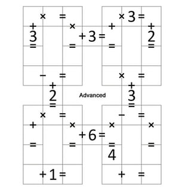
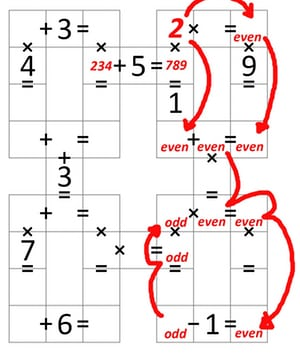
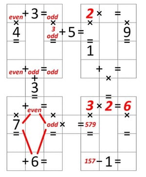
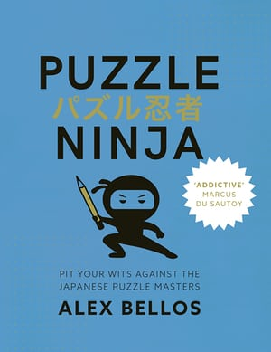

Did you solve it? Le Sudoku français est arrivé!

# Did you solve it? Le Sudoku français est arrivé!

The solutions (and hints) for today’s puzzles.

Numerical projections illuminate the Arc de Triomphe in Paris. Photograph: EDMOND/SIPA/REX/Shutterstock

[In my puzzle blog earlier today](https://www.theguardian.com/science/2018/jan/15/can-you-solve-it-le-sudoku-francais-est-arrive), I set you four Garam puzzles.

You can see (and print out) the puzzles [by clicking on this link](https://uploads.guim.co.uk/2018/01/12/four_garam_puzzles_(08c775788bc5cc6b56e87ac53a9b2884fb2d0dad).jpg).

You can see (and print out) the solutions [by clicking on this link](https://uploads.guim.co.uk/2018/01/12/four_garam_puzzles_(solution)_(e587cfe2659c47d9a0bc08d87d0d195a3c9eb44a).jpg).

But before you look at the answers, perhaps all you needed was a hint to get you going.

Here are the two most difficult examples, and how you make the first move:

**Advanced****: **The first cell to fill in is the one in the top right corner. It must be either 8 or 9, since when you add 2 the answer is a two-digit number, which can only be 10 or 11. The square therefore must be 9, since from the horizontal line it is a multiple of 3.

**Hard**: Look at the equation with a 5. The only possibilities for the cell to the left of the 5 are 2,3 and4. (It cannot be 1, since the vertical equation through that cell is a multiplication with a two-digit answer, and if the cell was a 1 the answer would be a single digit). The only possibilities for the cell to the right are 7,8 and 9. We can now deduce that the cell above this cell is a 2 (as illustrated below), since only if 7, 8 or 9 are multiplied by a 2 is the answer a two-digit number beginning with a 1. Once we know that this cell is a 2, we can deduce that all the cells marked ‘even’ in the illustration are even, and that the ones marked odd are odd, because when you multiply an even number by any other whole number, the answer is even, and when two odd numbers are multiplied together the answer is odd. I had said to think Liberty, Equality and Parity! Parity is the fact of being either even or odd.

In the bottom right loop, we have ODD x EVEN = EVEN. The odd number must be greater than 1, since if it was 1 the vertical equation ODD x ODD would not reach double figures. So the odd number in the horizontal equation is 3 or greater. We know the even number must be at least 2. The only combination that works is 3 x 2 = 6. Which means that the cell below the 3 must be either 5, 7 or 9.

Now look at the bottom left loop. Let A be the cell on the same horizontal row as the 7. Now A must be odd, since it is part of a multiplication with an odd answer (going horizontally), and the only way to get an odd answer is for two odd numbers to multiply with each other. Now since 7 is odd, and since A is also odd, we can deduce that the number underneath the 3 (column 2, row 5) is even, as marked. This is because for the equation X + 6 = Y on the bottom row to be true, then X and Y need to either be both even, or both odd. If they are both even, then number above the 7 and the number above A are both even. And if they are both odd, then these two numbers are both odd. We can deduce that the number between them must be even. From this we can work out the parities of some of the cells in the top left loop. I’ll leave the rest to you.

*I set a puzzle here every two weeks on a Monday.**I’m always on the look-out for great puzzles. If you would like to suggest one, [email me](https://www.theguardian.com/science/2018/jan/15/did-you-solve-it-le-sudoku-francais-est-arrivemailto:bellospuzzle@gmail.com).*

*Thanks to Ramsés Bounkeo Safo for today’s puzzles. For more Garam puzzles [check out his website](https://www.garamgame.com/garam/garam_en_ligne/tutoriel/index.html).*

*My latest book is [Puzzle Ninja](http://amzn.to/2j2eYZw), which includes more than 200 original, handmade Japanese logic puzzles, as well as background material about Japanese puzzle culture.*

##  Since you’re here …

… we have a small favour to ask. More people are reading the Guardian than ever but advertising revenues across the media are falling fast. And unlike many news organisations, we haven’t put up a paywall – we want to keep our journalism as open as we can. So you can see why we need to ask for your help. The Guardian’s independent, investigative journalism takes a lot of time, money and hard work to produce. But we do it because we believe our perspective matters – because it might well be your perspective, too.

  xmlns="http://www.w3.org/2000/svg">

>  I appreciate there not being a paywall: it is more democratic for the media to be available for all and not a commodity to be purchased by a few. I’m happy to make a contribution so others with less means still have access to information. >  Thomasine F-R. >

If everyone who reads our reporting, who likes it, helps fund it, our future would be much more secure. **For as little as £1, you can support the Guardian – and it only takes a minute. Thank you.**

 [Support the Guardian](https://support.theguardian.com/uk?bundle=contribute&REFPVID=jcgmfyw81d54iw1so871&INTCMP=gdnwb_copts_memco_kr1_epic_ask_four_earning_control&acquisitionData=%7B%22source%22%3A%22GUARDIAN_WEB%22%2C%22componentId%22%3A%22gdnwb_copts_memco_kr1_epic_ask_four_earning_control%22%2C%22componentType%22%3A%22ACQUISITIONS_EPIC%22%2C%22campaignCode%22%3A%22gdnwb_copts_memco_kr1_epic_ask_four_earning_control%22%2C%22abTest%22%3A%7B%22name%22%3A%22ContributionsEpicAskFourEarning%22%2C%22variant%22%3A%22control%22%7D%2C%22referrerPageviewId%22%3A%22jcgmfyw81d54iw1so871%22%2C%22referrerUrl%22%3A%22https%3A%2F%2Fwww.theguardian.com%2Fscience%2F2018%2Fjan%2F15%2Fdid-you-solve-it-le-sudoku-francais-est-arrive%22%7D)

 