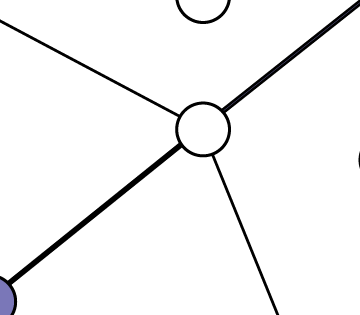

Dijkstra's in Disguise

Dijkstra's in Disguise

https://blog.evjang.com/2018/08/dijkstras.html

You can find a PDF version of this blog post here . A weighted graph is a data structure consisting of some vertices and edges, and each...