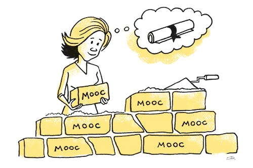
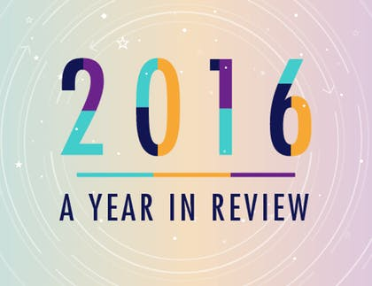
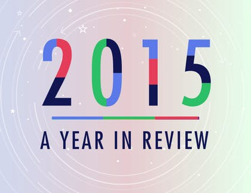
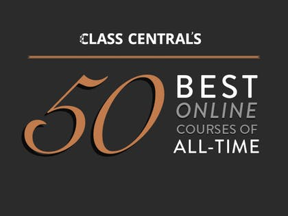

Discover Free Online Courses & MOOCs • Class Central

#  MOOC Report [RSS Feed](https://www.class-central.com/report/feed)

 Online Education News and Analysis

 [See morearticles](https://www.class-central.com/report)

# MOOCWatch

MOOCWatch is our semi-regular publication where we dive deep into the world of MOOCs, giving the latest trends, news, and our perspective on what’s happening in the industry.

 Get MOOCWatch in your inbox

-

 

### MOOCWatch • No. 17

##   [MOOCs Become Big Business](https://www.class-central.com/report/moocs-become-big-business/)

Udacity’s revenues, Coursera’s Bachelors degree, MicroBachelors, Best Online Courses of 2017, and more.

By Dhawal Shah  *April 9th, 2018*

-

 

### MOOCWatch • No. 16

##   [MOOC Providers Target Degrees](https://www.class-central.com/report/moocwatch-16-mooc-providers-target-degrees/)

We round up all the news from the MOOC sphere: iMBA stats, Udacity’s impressive numbers, Learner Tips, and much, much more.

By Dhawal Shah  *October 23rd, 2017*

# Latest Articles

-

###   [60 Universities Just Launched 100 Free Online Courses. Here’s The Full List.](https://www.class-central.com/report/new-online-courses-april-2018/)

By Dhawal Shah  *30th Apr, 2018*

-

###   [1950+ Free Online Courses from 250 Universities Starting this Month. Here’s the Full List.](https://www.class-central.com/report/mooc-course-report-may-2018/)

By Dhawal Shah  *30th Apr, 2018*

-

###   [Ten Most Popular MOOCs Starting in May 2018](https://www.class-central.com/report/ten-most-popular-may-2018/)

By Dhawal Shah  *24th Apr, 2018*

-

###   [Sessions We’re Excited About at the 2018 Open edX Conference](https://www.class-central.com/report/2018-open-edx-conference/)

By Laurie Pickard  *23rd Apr, 2018*

-

###   [How Open University Works: An Insider’s Perspective](https://www.class-central.com/report/open-university-insiders-perspective/)

By Manoel Cortes Mendez  *22nd Apr, 2018*

# Popular Articles

-

#### World

###   [Massive List of MOOC Providers Around The World](https://www.class-central.com/report/mooc-providers-list/)

Where to find MOOCs: The definitive guide to MOOC providers.

By Dhawal Shah  **

-

#### Guides

###   [The Best Data Science Curriculum](https://www.class-central.com/report/best-data-science-curriculum/)

The best MOOCs for launching yourself into the data science industry.

By David Venturi  **

-

#### Analysis

###   [Harvard and the Rise of a Digital Ivy League](https://www.class-central.com/report/harvard-digital-ivy-league/)

There’s a new elite forming in higher education: universities that have millions of enrollments.

By Anuar Lequerica  **

-

#### Opinion

###   [MOOCs No Longer Massive, Still Attract Millions](https://www.class-central.com/report/moocs-no-longer-massive/)

We've gained the ability to take MOOCs at any time, but lost something in the process.

By Dhawal Shah  **

# MOOC Report Articles also Published in

- 

- 

- 

- 

- 

#  MOOCs Through the Years

- 

 [Read More](https://www.class-central.com/moocs-year-in-review-2017)

- 

 [Read More](https://www.class-central.com/moocs-year-in-review-2016)

- 

 [Read More](https://www.class-central.com/moocs-year-in-review-2015)

#### Previous Years:

- [2014](https://www.class-central.com/moocs-year-in-review-2014)

- [2013](https://www.class-central.com/moocs-year-in-review-2013)

- [2012](https://www.class-central.com/moocs-year-in-review-2012)

#  Highest Rated Courses on Class Central

- 

 [Browse Courses](https://www.class-central.com/report/top-50-moocs-2017-edition/)

- 

 [Browse Courses](https://www.class-central.com/report/best-free-online-courses-2017/)

#### Previous Years:

- [2016](https://www.class-central.com/report/best-free-online-courses-2016/)

- [2015](https://www.class-central.com/report/best-free-online-courses-2015/)