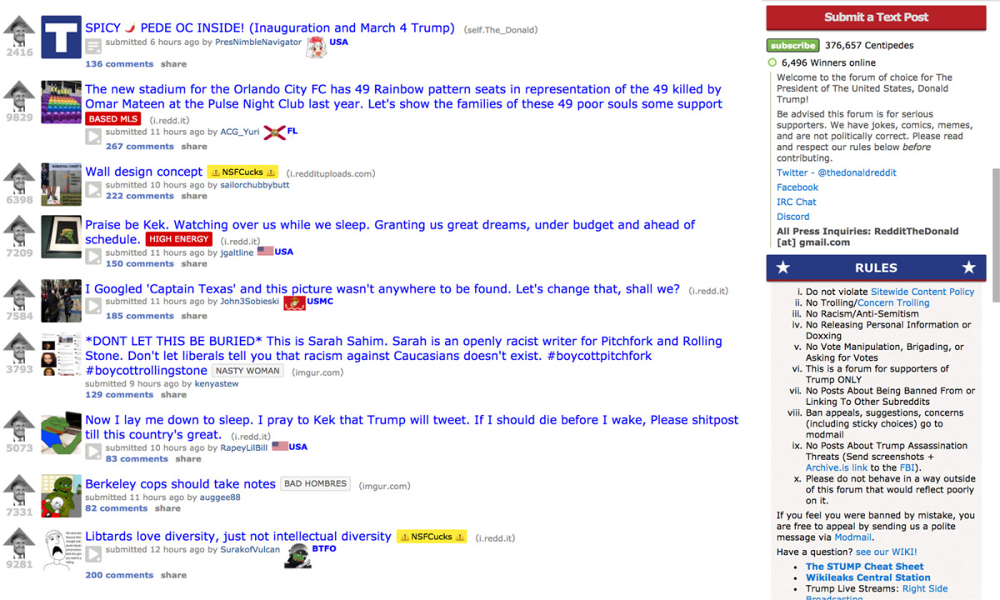
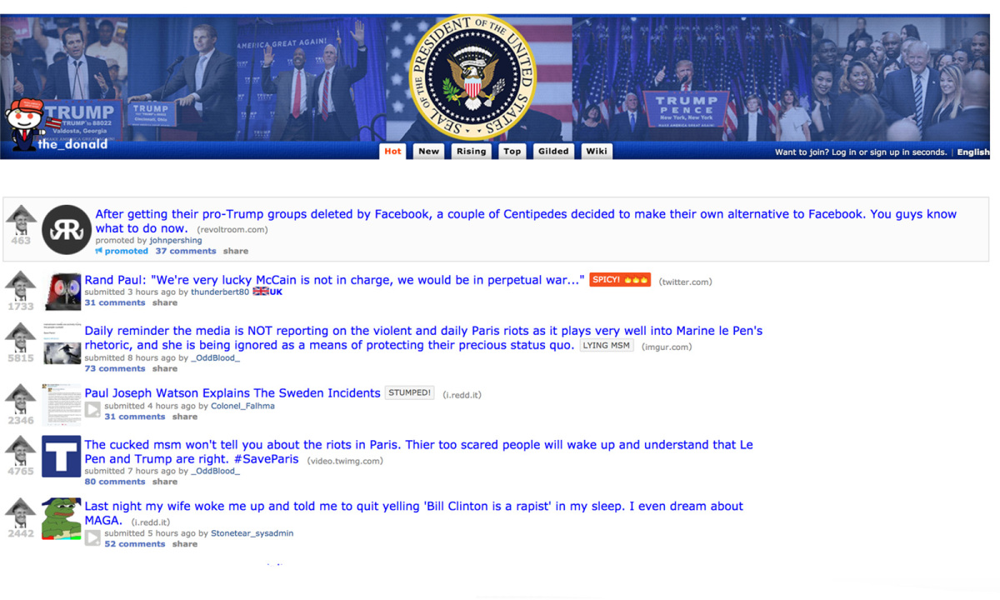
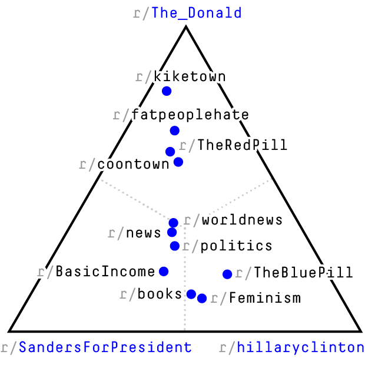
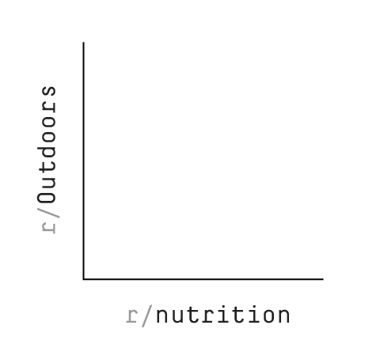
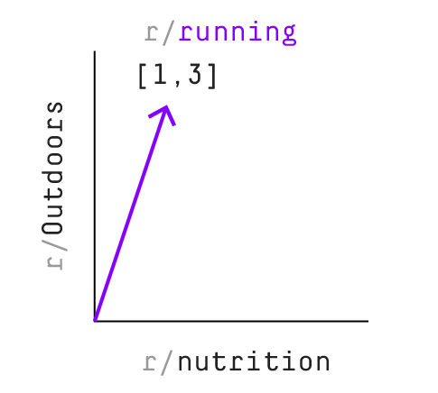
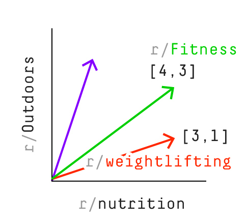
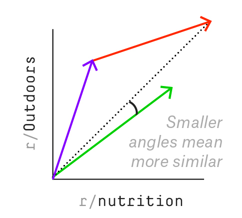

Dissecting Trump’s Most Rabid Online Following

# Dissecting Trump’s Most Rabid Online Following

By  Trevor Martin | Art by yesyesno
Filed under [Donald Trump](https://fivethirtyeight.com/tag/donald-trump/)
Published Mar. 23, 2017

- [](https://fivethirtyeight.com/features/dissecting-trumps-most-rabid-online-following/?share=facebook&nb=1)
- [](https://fivethirtyeight.com/features/dissecting-trumps-most-rabid-online-following/?share=twitter&nb=1)
- [](https://fivethirtyeight.com/features/dissecting-trumps-most-rabid-online-following/mailto:?subject=I%20thought%20you%E2%80%99d%20like%20this%20article%20from%20FiveThirtyEight&body=https%3A%2F%2Ffivethirtyeight.com%2Ffeatures%2Fdissecting-trumps-most-rabid-online-following%2F?ex_cid=538email)

r/The Donald
–+–
r/politics
r/uncensorednews
r/conspiracy
===
r/fatpeoplehate
r/HillaryForPrison
r/CFB

Editor’s note: The story below contains two slurs that appear in the names of subreddits. Links to Reddit may also contain offensive material.

President Donald Trump’s administration, in its turbulent first months, has drawn fire from both the left and the right, including [the ACLU](https://www.aclu.org/blog/speak-freely/well-see-you-court-why-trumps-executive-order-refugees-violates-establishment), [government ethics accountability](http://www.theatlantic.com/business/archive/2017/02/donald-trump-conflicts-of-interests/508382/) groups and [former Bush](http://www.nbcnews.com/news/us-news/torture-memos-author-former-doj-attorney-john-yoo-says-trump-n717346)  [administration officials](https://www.theatlantic.com/magazine/archive/2017/03/how-to-build-an-autocracy/513872/). But one group has shown [nothing but unbridled enthusiasm](https://www.reddit.com/r/The_Donald/search?q=executive+order&sort=top&restrict_sr=on) for the president’s actions thus far: the over 380,000 members of [r/ r/The_Donald](https://www.reddit.com/r/The_Donald/), one of the thousands of comment boards on Reddit, the [fifth-most-popular website](http://www.alexa.com/topsites/countries/US) in the U.S.

The subreddit, where posters refer to President Trump as the “[God Emperor](https://www.reddit.com/r/The_Donald/comments/5oy605/to_the_top_the_god_emperor/)” and “[daddy](https://www.reddit.com/r/The_Donald/comments/5f1b4s/its_here_daddy_official_statement_about_jill/),” is arguably the epicenter of Trump fervor on the internet. Its membership has grown steadily since the 2016 presidential election, though its members were especially active during the campaign. They [mobilized to comb through](https://www.reddit.com/r/The_Donald/comments/57vefh/podesta_emails_magathread/) the hacked Democratic National Committee emails published on WikiLeaks and [played a large role](https://www.nytimes.com/2016/11/20/opinion/sunday/reddit-and-the-god-emperor-of-the-internet.html?_r=0) in spreading information and theories about those emails. More broadly, they waged the “[Great Meme War](http://www.politico.com/magazine/story/2017/03/memes-4chan-trump-supporters-trolls-internet-214856)”: an effort to get Trump elected by bombarding the internet with social-media-ready content promoting Trump or bashing Democratic candidate Hillary Clinton. Some of those memes [played on Clinton’s campaign gaffes](https://www.google.com/search?q=deplorable+meme+r/The_Donald&espv=2&source=lnms&sa=X&ved=0ahUKEwjnwquGjNbSAhWU14MKHY_zA10Q_AUIBSgA&biw=1440&bih=680&dpr=2), such as her use of the phrase “[basket of deplorables](https://www.nytimes.com/2016/09/11/us/politics/hillary-clinton-basket-of-deplorables.html),” while others involved an emerging pro-Trump iconography centered around images of Pepe the Frog — a cartoon character with a [convoluted history](https://gimletmedia.com/episode/77-the-grand-tapestry-of-pepe/) that gained especial prominence after it was [co-opted by white nationalists as a sort of unofficial mascot](https://www.adl.org/education/references/hate-symbols/pepe-the-frog). Members of r/The_Donald like to say they “[shitposted](http://knowyourmeme.com/memes/shitposting)” Donald Trump into office; regardless of whether the flood of memes swung the election, it did overwhelm the front page of Reddit to such an extent that the site’s CEO [rushed to deploy a change in Reddit’s algorithm](https://www.reddit.com/r/announcements/comments/4oedco/lets_all_have_a_town_hall_about_rall/) that limits the influence of any single subreddit.[1](https://fivethirtyeight.com/features/dissecting-trumps-most-rabid-online-following/#fn-1)

What can we say about the animating force behind r/The_Donald? For one, it’s not universal among Trump supporters; nearly [63 million](http://uselectionatlas.org/RESULTS/national.php?year=2016&f=0&off=0&elect=0) Americans voted for Trump, and the 382,000 members of r/The_Donald represent less than 1 percent of that. But in the subreddit’s vocal and dedicated membership, you can find an influential strain of Trump boosterism. [According to former staffers](http://www.politico.com/magazine/story/2017/03/memes-4chan-trump-supporters-trolls-internet-214856), the Trump campaign team monitored the subreddit for messages that resonated, and Trump himself participated in an [“Ask Me Anything”](https://www.reddit.com/r/The_Donald/comments/4uxdbn/im_donald_j_trump_and_im_your_next_president_of/) on r/The_Donald in July. Since the election, the subreddit has continued to [serve as a conduit](http://www.newstatesman.com/science-tech/internet/2016/12/pizzagate-how-4chan-conspiracy-went-mainstream) through which fringe conspiracy theories — often started on sites like 4chan.org, a freewheeling image-based message board best known for [creating memes, posting stolen celebrity nudes and birthing the hacker collective Anonymous](http://www.independent.co.uk/voices/comment/what-is-4chan-and-why-does-it-threaten-women-like-emma-watson-9751486.html) — enter a larger online discourse. The most striking example has been “Pizzagate,” the false idea that a pizza parlor in Washington, D.C., is the center of a child-trafficking ring involving Clinton campaign manager John Podesta, which prompted a man from North Carolina to “self-investigate” the shop, where he fired a rifle several times and threatened an employee.

r/The_Donald has repeatedly [been accused](https://motherboard.vice.com/en_us/article/what-is-rthedonald-donald-trump-subreddit) of [offering a safe harbor](https://www.washingtonpost.com/news/the-intersect/wp/2016/07/20/the-people-running-reddits-largest-trump-club-also-promote-eugenics-and-call-muslims-animals/?utm_term=.921997171008) where racists and white nationalists can congregate and express their views, much the same way that Trump’s campaign is said to have [mobilized and emboldened those same groups](https://mediamatters.org/blog/2016/11/16/updated-complete-history-donald-trumps-relationship-white-nationalist-movement/214491). And indeed, r/The_Donald is [home](https://np.reddit.com/r/The_Donald/comments/5ppdnl/3rd_wave_feminism_vs_reality/) to [some](https://np.reddit.com/r/The_Donald/comments/4xiasn/welcome_to_sweden/) pretty [vile](https://np.reddit.com/r/The_Donald/comments/5ldfmg/red_pills_are_the_hardest_to_swallow/) comment [threads](https://np.reddit.com/r/The_Donald/comments/5hprpc/thank_you_merkel/). The subreddit’s moderators declined to talk to us about their community and accused FiveThirtyEight of being “fake news.” Regardless, we think there’s a way to get at the nature of r/The_Donald that is more rigorous than doing a quick scan of its comments (and certainly more objective than simply soliciting the opinions of the group’s fans and detractors).

We’ve adapted a technique that’s used in machine learning research — called latent semantic analysis — to characterize 50,323 active subreddits[2](https://fivethirtyeight.com/features/dissecting-trumps-most-rabid-online-following/#fn-2) based on 1.4 billion comments posted from Jan. 1, 2015, to Dec. 31, 2016, in a way that allows us to quantify how similar *in essence* one subreddit is to another. At its heart, the analysis is based on commenter overlap: Two subreddits are deemed more similar if many commenters have posted often to both. This also makes it possible to do what we call “subreddit algebra”: adding one subreddit to another and seeing if the result resembles some third subreddit, or subtracting out a component of one subreddit’s character and seeing what’s left. (There’s a detailed explanation of how this analysis works at the bottom of the article).

Here’s a simple example: Using our technique, you can add the primary subreddit for talking about the NBA ([r/ r/nba](https://www.reddit.com/r/nba/)) to the main subreddit for the state of Minnesota ([r/ r/minnesota](https://www.reddit.com/r/minnesota/)) and the closest result is [r/ r/timberwolves](https://www.reddit.com/r/timberwolves/), the subreddit dedicated to Minnesota’s pro basketball team. Similarly, you can take r/nba and subtract [r/ r/sports](https://www.reddit.com/r/sports/), and the result is [r/ r/Sneakers](https://www.reddit.com/r/Sneakers/), a subreddit dedicated to the sneaker culture that is a [prominent non-sport component](https://fivethirtyeight.com/features/you-see-sneakers-these-guys-see-hundreds-of-millions-in-resale-profit/) of NBA fandom.

This may all seem pretty abstract, but that same algebra can be applied to r/The_Donald. What happens when you break r/The_Donald up into subgroups using subreddit subtraction? What happens when you add unrelated subreddits to r/The_Donald? Before we get into those questions, let’s take a look at the subreddits that are most similar to r/The_Donald, according to our analysis[3](https://fivethirtyeight.com/features/dissecting-trumps-most-rabid-online-following/#fn-3):

1.[r/ r/Conservative](https://www.reddit.com/r/Conservative)0.741Discussion of conservative philosophy

2.[r/ r/AskTrumpSupporters](https://www.reddit.com/r/AskTrumpSupporters)0.737Q&A with Trump supporters

3.[r/ r/HillaryForPrison](https://www.reddit.com/r/HillaryForPrison)0.675Extreme anti-Clinton commentary

4.[r/ r/uncensorednews](https://www.reddit.com/r/uncensorednews)0.661News with a focus on far-right-wing views

5.[r/ r/AskThe_Donald](https://www.reddit.com/r/AskThe_Donald)0.634Q&A subreddit run by r/The_Donald moderators

[r/ r/Conservative](https://www.reddit.com/r/Conservative/) and [r/ r/AskTrumpSupporters](https://www.reddit.com/r/AskTrumpSupporters/) top the list, followed by [r/ r/HillaryForPrison](https://www.reddit.com/r/HillaryForPrison/), a subreddit that refers to Hillary Clinton by the pronoun “it” and notes in bold on the sidebar that “Putting It behind bars is fun!” After that it’s [r/ r/uncensorednews](https://www.reddit.com/r/uncensorednews/), a subreddit started by [white nationalist moderators](https://np.reddit.com/r/dataisbeautiful/comments/4o15je/runcensorednews_subreddit_network_these_are_the/) who found the existing, extremely popular [r/ r/news](https://www.reddit.com/r/news/) subreddit to be too liberal.

So does this mean that users who comment on r/The_Donald comment on r/Conservative more than any other subreddit? No. Eight percent of r/The_Donald’s users have also commented on r/Conservative, which is about one-fifth the size of r/The_Donald, and conversely, 51 percent of commenters on r/Conservative have commented on r/The_Donald. But the raw number of shared commenters isn’t very informative on its own because, for example, almost every subreddit will have a lot of overlap with big, really popular subreddits such as [r/ r/AskReddit](https://www.reddit.com/r/AskReddit/), which has over 16 million members. Our analysis is a bit more subtle: We weight the overlaps in commenters according to, in essence, how surprising those overlaps are — that is, how much more two subreddits’ user bases overlap than we would expect them to based on chance alone. Since essentially every subreddit overlaps heavily with super popular groups like r/AskReddit, that result is no longer surprising and gets a lower weight. What rises to the top, then, are the more unlikely results that are characteristic of a specific subreddit rather than those that are common to Reddit as a whole. And by looking at these weighted commenter overlap rankings across thousands of subreddits, we built a profile for each subreddit that helps capture what defines the average commenter on each specific subreddit.

There’s nothing too revealing in that list above — all of those subreddits are explicitly pro-Trump, anti-Clinton or politically conservative. So let’s use subreddit algebra to dissect r/The_Donald into its constituent parts. What happens when you filter out commenters’ general interest in politics? To figure that out, we can subtract [r/ r/politics](https://www.reddit.com/r/politics/) from r/The_Donald. The result most closely matches [r/ r/fatpeoplehate](https://www.reddit.com/r/fatpeoplehate), a [now-banned subreddit](http://www.theverge.com/2015/6/10/8761763/reddit-harassment-ban-fat-people-hate-subreddit) that was dedicated to ridiculing and bullying overweight people.

[r/ r/The_Donald](http://www.reddit.com/r/The_Donald)  –  [r/ r/politics](http://www.reddit.com/r/politics)

1.[r/ r/fatpeoplehate](https://www.reddit.com/r/fatpeoplehate)0.275For sharing insults aimed at overweight people (now banned)

2.[r/ r/TheRedPill](https://www.reddit.com/r/TheRedPill)0.274Virulently misogynistic subreddit, nominally devoted to “sexual strategy”

3.[r/ r/Mr_Trump](https://www.reddit.com/r/Mr_Trump)0.266Now-dormant subreddit formed during a moderator schism at r/The_Donald

4.[r/ r/coontown](https://www.reddit.com/r/coontown)0.266Open and enthusiastic racism against black people (now banned)

5.[r/ r/4chan](https://www.reddit.com/r/4chan)0.253Screenshots of 4chan.org posts

Subreddit algebra isn’t quite as simple as A – B = C. It’s more like A – B is closer to C than anything else, but it’s also pretty similar to D and not far off from E. So when you subtract r/politics from r/The_Donald, you actually get a list of every subreddit in our analysis, ranked in order of their similarity to the result of that subtraction. We’re showing just the top five.

And that top five isn’t exactly pretty, though it does support the theory that at least a subset of Trump’s supporters are motivated by racism. The presence of r/fatpeoplehate at the top of the list echoes some of President Trump’s own behavior, including his referring to 1996 Miss Universe winner Alicia Machado as [“Miss Piggy”](https://www.nytimes.com/2016/09/28/us/politics/alicia-machado-donald-trump.html?_r=0) and insulting Rosie O’Donnell [about her weight](http://www.cnn.com/2015/08/07/politics/donald-trump-rosie-odonnell-feud/). The second-closest result, [r/ r/TheRedPill](https://www.reddit.com/r/TheRedPill/), describes itself in its sidebar as a place for “[discussion of sexual strategy in a culture increasingly lacking a positive identity for men](http://web.archive.org/web/20170108140222/https://www.reddit.com/r/TheRedPill/)”; named after a scene from the “The Matrix,” the group believes that women run the world and men are an oppressed class, and from that belief springs an ideology that has been described as “[the heart of modern misogyny](https://www.theguardian.com/technology/2016/apr/14/the-red-pill-reddit-modern-misogyny-manosphere-men).” [r/ r/Mr_Trump](https://www.reddit.com/r/Mr_Trump) self-describes as “[the #1 Alt-Right, most uncucked subreddit](http://web.archive.org/web/20160625041130/https://www.reddit.com/r/Mr_Trump/)” — referring to a [populist white-nationalist movement](https://www.splcenter.org/fighting-hate/extremist-files/ideology/alternative-right) and an [increasingly all-purpose insult](http://www.gq.com/story/why-angry-white-men-love-calling-people-cucks) meant to denigrate others’ masculinity — and the appallingly named [r/ r/coontown](https://www.reddit.com/r/coontown) is the now-banned but previously central [home to unrepentant racism](https://www.washingtonpost.com/news/morning-mix/wp/2015/07/17/coontown-a-noxious-racist-corner-of-reddit-survives-recent-purge) on Reddit. Finally, coming in at No. 5 is [r/ r/4chan](https://www.reddit.com/r/4chan/), a subreddit dedicated to posting screenshots of threads found on 4chan, where [many users supported Trump](https://www.washingtonpost.com/news/the-intersect/wp/2016/11/09/we-actually-elected-a-meme-as-president-how-4chan-celebrated-trumps-victory/) for president and where the [/pol/ board](http://www.thedailybeast.com/articles/2015/06/29/dylann-roof-4chan-and-the-new-online-racism.html) in particular has a strongly racist bent.

We dissected r/The_Donald in a bunch of other ways using subreddit algebra. Here are some of the more interesting results:

[r/ r/The_Donald](http://www.reddit.com/r/The_Donald)  –  [r/ r/conspiracy](http://www.reddit.com/r/conspiracy)

1.[r/ r/CFB](https://www.reddit.com/r/CFB)0.269For college football discussion
2.[r/ r/nfl](https://www.reddit.com/r/nfl)0.255For NFL discussion

3.[r/ r/TrumpMinnesota](https://www.reddit.com/r/TrumpMinnesota)0.244Small subreddit for Trump supporters in Minnesota

[r/ r/The_Donald](http://www.reddit.com/r/The_Donald)  +  [r/ r/europe](http://www.reddit.com/r/europe)

1.[r/ r/european](https://www.reddit.com/r/european)0.781Now-private subreddit that hosted racist and anti-Semitic commentary on European affairs

2.[r/ r/worldnews](https://www.reddit.com/r/worldnews)0.768Main subreddit for discussion of world affairs

3.[r/ r/syriancivilwar](https://www.reddit.com/r/syriancivilwar)0.688For discussion of the conflict in Syria

[r/ r/The_Donald](http://www.reddit.com/r/The_Donald)  +  [r/ r/Games](http://www.reddit.com/r/Games)

1.[r/ r/KotakuInAction](https://www.reddit.com/r/KotakuInAction)0.676Main hub of Gamergate discussion on Reddit

2.[r/ r/gaming](https://www.reddit.com/r/gaming)0.619Largest general gaming subreddit

3.[r/ r/Cynicalbrit](https://www.reddit.com/r/Cynicalbrit)0.586Unofficial fanpage for the internet personality TotalBiscuit

So even adding innocuous subreddits, such as [r/ r/europe](https://www.reddit.com/r/europe/) and [r/ r/Games](https://www.reddit.com/r/Games/), to r/The_Donald can result in something ugly or hate-based — [r/ r/european](https://www.reddit.com/r/european/) frequently [hosts anti-Semitism and racism](http://www.vox.com/2016/5/21/11701482/donald-trump-subreddit-drama-europeans), while [r/ r/KotakuInAction](https://www.reddit.com/r/KotakuInAction/) is Reddit’s main home for the [misogynistic Gamergate movement](https://www.washingtonpost.com/news/the-intersect/wp/2014/10/14/the-only-guide-to-gamergate-you-will-ever-need-to-read/?utm_term=.ce42fd0497f0). Which raises a question: Are these hateful communities linked *specifically* to Trump’s supporters on Reddit, or are they common to politically active Reddit users in general? To get at that question, let’s try subtracting r/politics from r/conservative:

[r/ r/Conservative](http://www.reddit.com/r/Conservative)  –  [r/ r/politics](http://www.reddit.com/r/politics)

1.[r/ r/Mary](https://www.reddit.com/r/Mary)0.265Subreddit for devotees of the biblical Mary

2.[r/ r/RCIA](https://www.reddit.com/r/RCIA)0.264For those considering converting to Catholicism (RCIA means “rite of Christian initiation for adults”)

3.[r/ r/ak47](https://www.reddit.com/r/ak47)0.241For discussing the AK-47 rifle

4.[r/ r/TelaIgne](https://www.reddit.com/r/TelaIgne)0.240A space where Catholic redditors pray for other redditors (the name is Latin for “web on fire”)

5.[r/ r/ChristianJewishRoots](https://www.reddit.com/r/ChristianJewishRoots)0.240For discussion of the relationship between Christian and Jewish theology

When we do this, we find that the top result is a subreddit [dedicated to the glorification of a biblical Mary](https://www.reddit.com/r/Mary/), and the [other](https://www.reddit.com/r/RCIA/)  [related](https://www.reddit.com/r/TelaIgne/)  [subreddits](https://www.reddit.com/r/ChristianJewishRoots/) are similarly focused on Christianity, except for [r/ r/ak47](https://www.reddit.com/r/ak47/), which is dedicated to the famous rifle.

So what about the other 2016 presidential candidates? How does Trump’s Reddit following compare to that of Hillary Clinton or Democratic primary candidate Bernie Sanders (whose [r/ r/SandersForPresident](https://www.reddit.com/r/SandersForPresident/) subreddit still has over 215,000 members)? This analysis lets us take any subreddit and say how “Trump-ish” it is vs. how “Clinton-ish” or “Sanders-ish” it is. Here’s a selection of subreddits plotted on a three-way spectrum from r/The_Donald to r/SandersForPresident to [r/ r/hillaryclinton](https://www.reddit.com/r/hillaryclinton/).

Subreddits dedicated to politics and news are smack in the middle. [r/ r/Feminism](https://www.reddit.com/r/Feminism/) is on the Sanders/Clinton side of the spectrum, though slightly closer to Clinton, as is [r/ r/TheBluePill](https://www.reddit.com/r/TheBluePill), a feminist parody of r/TheRedPill; [r/ r/BasicIncome](https://www.reddit.com/r/BasicIncome/) (a subreddit advocating for a [universal basic income](https://fivethirtyeight.com/features/universal-basic-income/)) is also on the liberal side, though slightly closer to Sanders.

And all of those hate-based subreddits? They’re decidedly in r/The_Donald’s corner.

**How does this work?**

[Latent semantic analysis](https://en.wikipedia.org/wiki/Latent_semantic_analysis) (LSA) — the technique from natural language processing that we’ve adapted for this analysis — is often used to [determine how related one book](http://lsa3.colorado.edu/papers/JASIS.lsi.90.pdf), article or speech is to another. The basic idea is that documents using similar words with similar frequency are probably closely related. But what about the words themselves? LSA also allows you to assess how similar words are by [looking at the other words that show up around them](http://lsa.colorado.edu/papers/dp1.LSAintro.pdf). So, for example, two words that might rarely show up together (say “dog” and “cat”) but often have the same words nearby (such as “pet” and “vet”) are deemed closely related. The way this works is that every word in, say, a book is assigned a value based on its co-occurrence with every other word in that book, and the result is a set of vectors — one for each word — that can be compared numerically. On a very technical level, the way you determine how similar two words like “dog” and “cat” are is by [looking at the angle](https://en.wikipedia.org/wiki/Cosine_similarity) between their two vectors (there’s a visual guide to understanding these concepts below).

Vectors are interesting because they can be enormous, multidimensional things that contain a huge amount of information — but you can still use them to do [grade-school arithmetic](https://en.wikipedia.org/wiki/Linear_algebra#Vector_spaces). When machine-learning researchers at Google tried adding word vectors together or subtracting one from another, they discovered semantically meaningful relationships.[4](https://fivethirtyeight.com/features/dissecting-trumps-most-rabid-online-following/#fn-4) For example, if you take the vector for “king,” subtract the vector for “man” and add the vector for “woman,” the [closest result is the vector for “queen.”](http://www.aclweb.org/anthology/N13-1090) Slightly more subtle relationships were [also exposed](https://arxiv.org/pdf/1310.4546.pdf): e.g. “Rome” plus “Germany” equals “Berlin.” It turned out to be a very powerful way of analyzing language. Here, we are also using co-occurrence to try to uncover the nature of different subreddits and their relationships to one another.

The idea of co-occurrence is clear when we’re talking about words, but what does it mean for subreddits? We found relationships by looking at how many commenters various subreddits have in common — that’s our measure of co-occurrence. Here’s a simplified example of how this works:

Let’s say we want to see how subreddits in the world of health and exercise are related to one another. To do that, we can plot every subreddit in terms of two key subreddits — r/nutrition and r/Outdoors

1

Let’s start with r/running. That subreddit has, let’s say, one commenter who has also commented in r/nutrition and three who have also commented in r/Outdoors. So we give it a vector of [1,3]

2

Now let’s add two more subreddits: r/weightlifting and r/Fitness. r/weightlifting has three commenters in common with r/nutrition and one with r/Outdoors, and r/Fitness has four and three, respectively.

3

Now we can do some addition by combining the vectors. If we add r/weightlifting to r/running, we get a third vector that looks similar to r/Fitness. The angle between the two gives us a measure of just how similar.

4

So instead of (King – Man) + Woman = Queen, you get Running + Weightlifting = Fitness.

For over 50,000 subreddits that span a huge range of topics, it gets a bit more complicated. Instead of characterizing all of them in terms of just two subreddits — like [r/Outdoors](https://www.reddit.com/r/Outdoors/) and [r/nutrition](https://www.reddit.com/r/nutrition/) above — we ranked all of the subreddits by the number of unique commenters and then pulled out the 2,133 subreddits whose unique commenter rank was between 200 and 2,201 (there are some ties). We used this subset of subreddits to characterize all active subreddits.[5](https://fivethirtyeight.com/features/dissecting-trumps-most-rabid-online-following/#fn-5) We then combined all the resulting subreddit vectors into a big matrix with 50,323 rows and 2,133 columns and converted the raw co-occurrences to [positive pointwise mutual information values](https://en.wikipedia.org/wiki/Pointwise_mutual_information).[6](https://fivethirtyeight.com/features/dissecting-trumps-most-rabid-online-following/#fn-6) Similarity between subreddits is based on the cosine similarity of their vectors — a measure of the angle between them. To perform subreddit algebra, subreddit vectors are added and subtracted using standard linear algebra, and then the cosine similarities are calculated to rank subreddits by their similarity to the combination.

**Are we sure this is meaningful?**

To test our analysis, we looked at some cases of subreddit algebra where the results should be obvious — like the example above where adding r/nba to r/minnesota should (and does) yield r/timberwolves as the best fit. Other combinations of a sport and a location similarly result in location-specific discussions of that sport.

We also looked at a test case involving a harder-to-see relationship. If you take the subreddit for managing money and investing, [r/personalfinance](https://www.reddit.com/r/personalfinance/), and subtract the subreddit for frugality, [r/Frugal](https://www.reddit.com/r/Frugal/), the resulting most similar subreddit is [r/wallstreetbets](https://www.reddit.com/r/wallstreetbets/), a subreddit about taking extreme risks in the stock market.

**The data and code behind this analysis**

The Reddit comments data is from a collection hosted on [Google’s BigQuery](https://www.reddit.com/r/bigquery/comments/3cej2b/17_billion_reddit_comments_loaded_on_bigquery/) of 1.4 billion comments from January 2015 to December 2016.[7](https://fivethirtyeight.com/features/dissecting-trumps-most-rabid-online-following/#fn-7) The analysis itself was done in R. You can [find the code here](https://github.com/fivethirtyeight/data/tree/master/subreddit-algebra).

*Development by Justin McCraw*