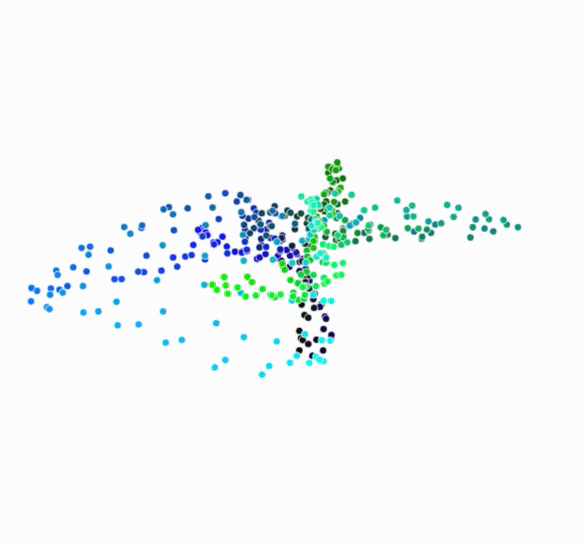
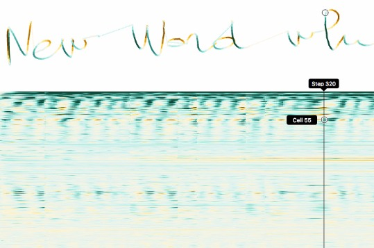
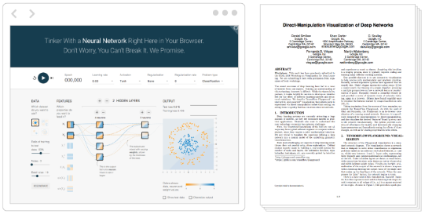

Distill

 [  Distill](http://distill.pub/)

 [About](http://distill.pub/about/)  [Prize](http://distill.pub/prize/)  [Submit](http://distill.pub/journal/)

#   Machine Learning Research  Should Be Clear, Dynamic and Vivid.  **Distill** Is Here to Help.

 [   ### A Journal    Devoted to clear explanations, native to the Web.](http://distill.pub/journal/)  [   ### $10,000 Prizes    For outstanding work communicating and refining ideas.](http://distill.pub/prize/)  [   ### Tools    For creating beautiful, interactive articles.](http://distill.pub/guide/)

## A modern medium for presenting research

The web is a powerful medium to share new ways of thinking. Over the last few years we’ve [seen](http://explorableexplanations.com/)  [many](http://cs.stanford.edu/people/karpathy/convnetjs/)  [imaginative](http://www.r2d3.us/visual-intro-to-machine-learning-part-1/)  [examples](http://colah.github.io/)  [of](https://acko.net/tv/toolsforthought/)  [such](http://cognitivemedium.com/tat/)  [work](http://worrydream.com/MediaForThinkingTheUnthinkable/). But traditional academic publishing remains focused on the PDF, which prevents this sort of communication.

 [(L)](http://distill.pub/2016/augmented-rnns/)

[Reactive diagrams](http://distill.pub/2016/augmented-rnns/) allow for a type of communication not possible in static mediums. Hover over this diagram to see how a neural turing machine shifts its attention over its old memory values to create new values.

## New ways of thinking enable new discoveries

New notations, visualizations, and mental models can deepen our understanding. By nurturing the development of such new ways of thinking, Distill will enable new discoveries.

 

[An interactive playground](http://distill.pub/2016/misread-tsne/) for t-SNE dimensionality reduction helps readers develop an intuition for technique and where it is best applied.

## Machine learning needs more transparency

Machine learning will fundamentally change how humans and computers interact. It’s important to make those techniques transparent, so we can understand and safely control how they work. Distill will provide a platform for vividly illustrating these ideas.

 

[An inspectable RNN](http://distill.pub/2016/handwriting/) handwriting model allows readers to feed in examples and see activations in real time.

## Legitimacy for non-traditional research artifacts

Many researchers want to do work that is not easily contained within a PDF, but can’t get the support they need to pursue it. We, as the research community, are failing them by not treating these wonderful, non-traditional research artifacts as “real” academic contributions.

 

[Non-traditional contributions](http://playground.tensorflow.org/) often don’t get credit unless authors wrap them with [proxy papers](http://poloclub.gatech.edu/idea2016/papers/p115-smilkov.pdf). Unfortunately, this multiplies effort and divides attention.

## Clear writing benefits everyone

When we rush papers out the door to meet conference deadlines, something suffers — often it is the readability and clarity of our communication. This can add severe drag to the entire community as our readers struggle to understand our ideas. We think this “research debt” can be avoided.

 

## The people behind Distill

### Editors

   [Shan Carter](http://shancarter.com/)  [Google Brain Team](http://g.co/brain)

   [Chris Olah](http://colah.github.io/)  [Google Brain Team](http://g.co/brain)

### Steering Committee

   [Yoshua Bengio](http://www.iro.umontreal.ca/~bengioy/yoshua_en/index.html)  [Université de Montréal](http://distill.pub/about/)

   [Mike Bostock](http://bost.ocks.org/mike/)  [Data-Driven Documents](http://d3js.org/)

   [Amanda Cox](http://www.nytimes.com/by/amanda-cox)  [The New York Times](http://www.nytimes.com/section/upshot)

   [Ian Goodfellow](http://www.iangoodfellow.com/)  [Google Brain Team](http://g.co/brain)

   [Andrej Karpathy](http://cs.stanford.edu/people/karpathy/)  [OpenAI](http://openai.com/blog/)

   [Shakir Mohamed](http://shakirm.com/)  [DeepMind](http://deepmind.com/)

   [Michael Nielsen](http://michaelnielsen.org/)  [YC Research](http://ycr.org/)

   [Fernanda Viégas](http://fernandaviegas.com/)  [Google Big Picture Group](https://research.google.com/bigpicture/)

 [  Distill](http://distill.pub/) is dedicated to clear explanations of machine learning

[(L)](http://distill.pub/about/#)Window size:  x
Viewport size:  x