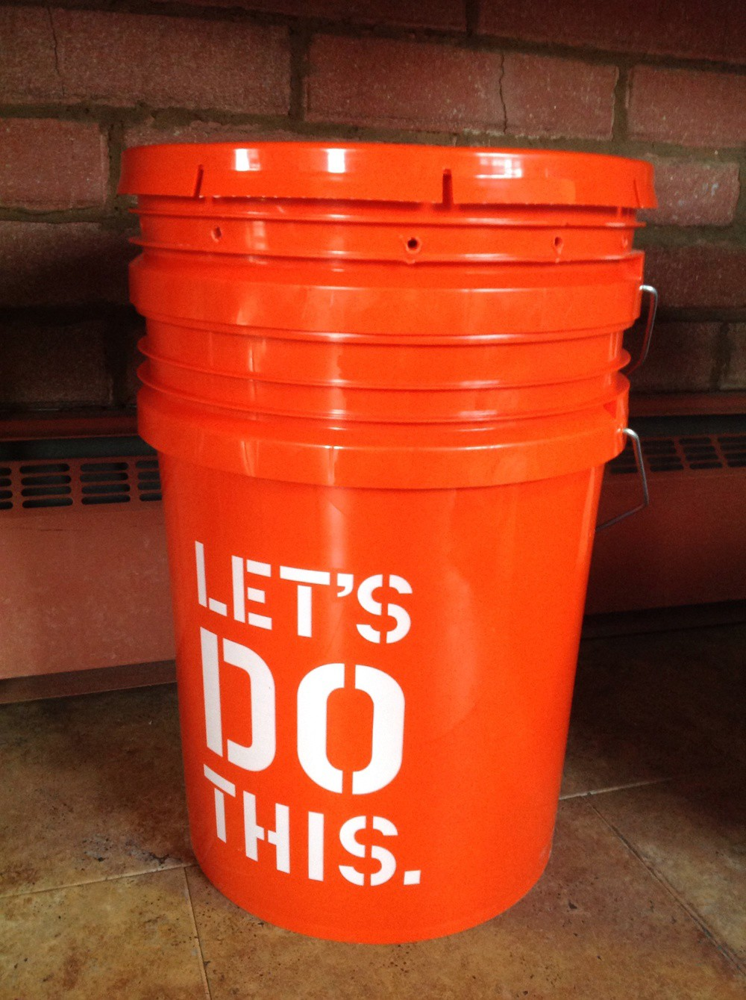

Do you make decisions rationally? - Towards Data Science

# Do you make decisions rationally?

## Part 1 of 3 —Two scenarios from behavioral economics to test yourself

[Cassie Kozyrkov](https://towardsdatascience.com/@kozyrkov?source=post_page-----d12a0eb9c89b----------------------)

[Mar 18](https://towardsdatascience.com/do-you-make-decisions-rationally-d12a0eb9c89b?source=post_page-----d12a0eb9c89b----------------------) · 3 min read

Curious to know whether you’re a rational [decision-maker](http://bit.ly/quaesita_di) well on your way to data-driven decisions? Imagine the scene below and answer the multiple choice question to find out!

Image: [SOURCE](https://www.destructoid.com//ul/518357-64f4eb1470b7b2cc897b616e39855f7b5c5f1c9b.jpg).

# Two little gambling games

Let’s pretend that I have a bucket filled with 90 golf balls in my living room and that we’re going to play two rounds of gambling games with it. (*Whoa*, you’re thinking, *that’s a big bucket. *Yup, we’re practicing using our imagination for this one.)

Your job will be to pick the conditions of both gambles up front (before any balls are drawn).

Then I’ll close my eyes, scramble the balls thoroughly, pull out a ball, show it to you, put it back, repeat. (You’ll be watching me live through your screen so I can’t cheat). Got it? Okay, here comes the most important thing — what info do you have about the bucket?

Image: [SOURCE](https://images.squarespace-cdn.com/content/v1/50ec5b52e4b0fa6edbb255b4/1416235456069-XHPXJ88FZB91S6AT9VBW/ke17ZwdGBToddI8pDm48kP9ixLvegiCiaphYrxDbh8B7gQa3H78H3Y0txjaiv_0fDoOvxcdMmMKkDsyUqMSsMWxHk725yiiHCCLfrh8O1z5QPOohDIaIeljMHgDF5CVlOqpeNLcJ80NK65_fV7S1UUsb6TDm6lwtyvufj6lXSkk9qP8EwNT_O62_qbM5aCAUa2TWYoExZvBjfEz7VOpF6Q/image-asset.jpeg).

# Contents of the bucket

The bucket has **30 white balls** and **60 other balls** that are either yellow or pink (you don’t know how many of each kind).

Now for your choices.

# Game 1

You have the choice between *Gamble A *or *Gamble B*:
**Gamble A:** You receive $100 if I draw a white ball, $0 otherwise.
**Gamble B:** You receive $100 if I draw a yellow ball, $0 otherwise.

Choose wisely and make a note of your choice (**A or B**) before scrolling down to Game 2. If you are so strongly indifferent that you’ll gladly let a coin decide for you, then do that.

Image: [SOURCE](https://www.golfstorageguide.com/yellow-vs-white-colored-golf-balls/).

**Reminder:
***The bucket still has 30 white balls and 60 other balls that are either
pink or yellow.*

# Game 2

You have the choice between *Gamble C *or *Gamble D*:

**Gamble C:** You receive $100 if I draw a white or pink ball, $0 if the ball is yellow.

**Gamble D:** You receive $100 if I draw a pink or yellow ball, $0 if the ball is white.

Jot down your choice (**C or D**) so we can get this party started. As before, if you really don’t have a preference, toss a coin.

# Did you chose rationally?

We’ll find out soon, but first why don’t you [take a look](https://twitter.com/quaesita/status/1240286740763619331) at how your choices compare with what other people picked by clicking here. The options were:

- ***A&C***
- ***A&D***
- ***B&C***
- ***B&D***

Go ahead, [see what other people picked](https://twitter.com/quaesita/status/1240286740763619331), and then scroll down for your diagnosis* and an explanation…

**Spoiler alert**: the answer that’s leading the [poll](https://twitter.com/quaesita/status/1240286740763619331) right now is *irrational*! Uh-oh. Find out why tomorrow.

Image: [SOURCE](https://www.somagnews.com/wp-content/uploads/2020/03/d3-2-e1583519162281.jpg).

Ready to find out why most people are irrational with decisions like this one? Continue to Part 2 [here](http://bit.ly/quaesita_ellsberg).