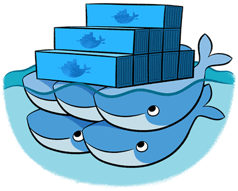

Docker orchestration (and why we need it) – Ataccama

# Docker orchestration (and why we need it)

### Beyond Docker

Docker is an awesome, highly useful software for application containerization that allows you to run hundreds or even thousands of isolated containers on a single node. It’s especially helpful in creating a unified environment for developers, QA testers, and production, since you can use Docker to be sure that you have the same libraries and, for example, versions of Java installed everywhere. If you want to use it in production with a microservices-based application, however, you’ll need something more.

A few things that Docker can’t quite do for you (out of the box):

- •Run multi-container applications
- •Run multi-container applications distributed to several hardware nodes
- •Provide and update configurations for services
- •Scale running services
- •Load balancing
- •Create a secure network for a multi-node cluster
- •And more…

You might be thinking, Wait! All that stuff can be done with Docker tools like Docker Compose, Swarm, and….

Technically, that’s correct. But the devil’s in the details, so read on to learn more.

### Which tool to choose?

You know that you need an orchestration tool — but which one? A simple Google search or visit to [Stack Overflow](http://stackoverflow.com/questions/18285212/how-to-scale-docker-containers-in-production) will offer tens or even hundreds of these tools.

It’s useful to keep in mind that at three years old, Docker is still quite young. All tools based on Docker are therefore even younger, less mature, and less ready for production. Most of these projects went live for just a few short months before being abandoned.

Among the more popular of these tools, however, you can find Kubernetes, Swarm, Mesos and Rancher. Here at [Ataccama](https://www.ataccama.com/), we’ve chosen Rancher, with all of its cool features, advantages, and disadvantages.

### Rancher

### What is Rancher?

Rancher is not a Docker orchestration tool.
What?!?!

It’s actually a metaproject that gathers a lot of** well-known mature tools** and technologies to create a powerful platform for Docker orchestration. Which ones does it work with? HAProxy, IPsec, strongSwan, Consul, cAdvisor, Swarm, Mesos, Kubernetes, Docker Machine, Docker Compose, and of course Docker itself.

Why do we need Rancher if these tools are available individually?

Put simply, it’s much more comfortable to use them as a preconfigured bundle. Also, Rancher has some unique features (see the list below) that you can’t find by just combining these individual tools. And it’s definitely an advantage to be able to choose which well-known and tested applications to use for our Rancher stack. With a nice web GUI, you get everything you need out of the box, plus everything you could dream about with a catalog or plug-in:

- •Secure inter-node IPsec encrypted network realized with strongSwan
- •Load balancing and health monitoring by HAProxy
- •Node load monitoring by cAdvisor
- •Multi-container application and incremental upgrade with rollback using a slightly modified version of Docker Compose
- •Automatic host deployment to Amazon EC2, Azure, DigitalOcean, etc. with Docker Machine
- •Dynamic configuration with consul and confd
- •Catalog with hundreds of preconfigured applications, plus the ability to create your own catalog to deploy your application with just one click

Nowadays, Rancher** supports four different orchestration engines:** Swarm (which only became production-ready recently), Kubernetes (more complex that what we need), Mesos (for very large deployments of thousands of containers), and Cattle. Here at Ataccama, we chose Cattle. It’s a Rancher product, and a simple tool that covers all of our needs.

Below you can find a few examples of applications to run on Rancher, including system applications to manage and boost flexibility, and increase the number of features Rancher can provide. These examples are mostly infrastructure-related.

What might you need from, say, Cloud infrastructure? You might want to store Docker images privately. In that case, just set up a Docker registry from the catalog. If you need to monitor, there’s an ELK stack you can find there. If you’re storing code for your project, your own Rancher catalog, or a CI tool for automatic testing and development, just go to your catalog. Install GitLab and Jenkins, or any other application that suits your requirements.

Another advantage of Rancher is that there is **no vendor lock**. If you get tired of Rancher one day, you don’t have to rewrite all your configs. Just use your current configuration with the orchestration engine directly.

### Creating a private catalog

If you want to deploy an application by pressing a button, you can use an already-available common catalog. It’s also possible to write our own.

You generally don’t want to just use material from the public Rancher catalog. Even when you do, some customization is typically still required. For that reason, it’s a good idea to consider a private catalog. Almost all of our infrastructure at Ataccama that runs inside the Rancher catalog also goes there. It’s simply a Git repository that stores configuration files.

Below is a technical example for a private catalog with ELK. A simple structure looks like this:

The simplest catalog file structure

As you can see, this catalog has only two items inside — an ELK stack and the catalog itself.

config.yml only has a general description of the project:

config.yml

And docker-compose.yml is just a regular Docker Compose file, without almost any Rancher magic:

docker-compose.yml

The label tells Rancher to re-download the image with every service upgrade, even if you already have the same version of the image available locally.

rancher-compose.yml includes all Rancher-specific magic, like health check settings, variables, scaling settings, and more. In this particular case, however, we don’t need anything from it. The file therefore has only a short description for the catalog and scale of the service:

rancher-compose.yml

Of course, we can use this right from our working repository. For security reasons, access to our company Git servers from the outside is restricted. Instead, we pack it to Docker and push it to the data center where we plan to use it.

The simplest Docker file for this purpose looks like this:

Docker file

If you need to, you can add SSL, authentication and other useful features. Now you just need to build an image, upload it to the registry, and upgrade the service on Rancher instance with this command:

> rancher-compose — project-name “private-rancher-catalog” up -d — confirm-upgrade — force-upgrade rancher-catalog

If you push the command to a CI server such as Jenkins, you will automatically get an updated version after every change in the catalog.

This is the simplest possible example item with only one service, and without any of the extra features that Rancher can provide. However, it can be much more complicated. Here’s the scheme for one of our Ataccama projects:

Configuring this project is much more complex, as it covers the relation between services, scaling, health check, scheduling, versioning, and so on.

And here are some more graphics, such as a simple ELK stack scheme:

And a host resource consumption overview:

### Conclusion

Still not sure whether a Docker orchestration tool is right for your project? If you only need to work with Docker in a minimal way, it’s easy enough to go to any article on the subject, learn how to run it, and get it working without orchestration. This is sufficient for a single developer with a laptop, but it’s far from a production-ready solution.

To to run Docker for production, you need a reliable and flexible tool set — and Rancher is a great choice for this. It’s true that it does have some disadvantages. Comparatively speaking, it’s resource hungry. It’s particularly demanding on CPU and RAM. It’s also written almost entirely in Java, which can make searching the logs mixed with stack traces challenging at times, and make service upgrades a bit on the slow side. However, at Ataccama we solved the resource allocation problem by running Rancher on a separate node, and we now have a more realistic idea of what problems we can expect with it.

We like being able to use Docker orchestration tools as a bundle, and we need to be able to pick and choose well-tested applications for our Rancher stack. Rancher supports this.

Overall, Rancher a powerful tool that offers simple, out-of-the-box Docker orchestration with a rich set of default futures and huge potential for adopting it to your personal or professional needs. It certainly works for Ataccama. If you’re a developer working on development infrastructure or a team setting up infrastructure for your company, Rancher might just be the right fit for you, too.

But hey, don’t take my word for it. Check out the links below and see for yourself.

- •[Stack Overflow](http://stackoverflow.com/questions/18285212/how-to-scale-docker-containers-in-production)
- •http://docs.rancher.com/rancher/v1.3/en/quick-start-guide/
- •https://www.docker.com/
- •http://kubernetes.io/