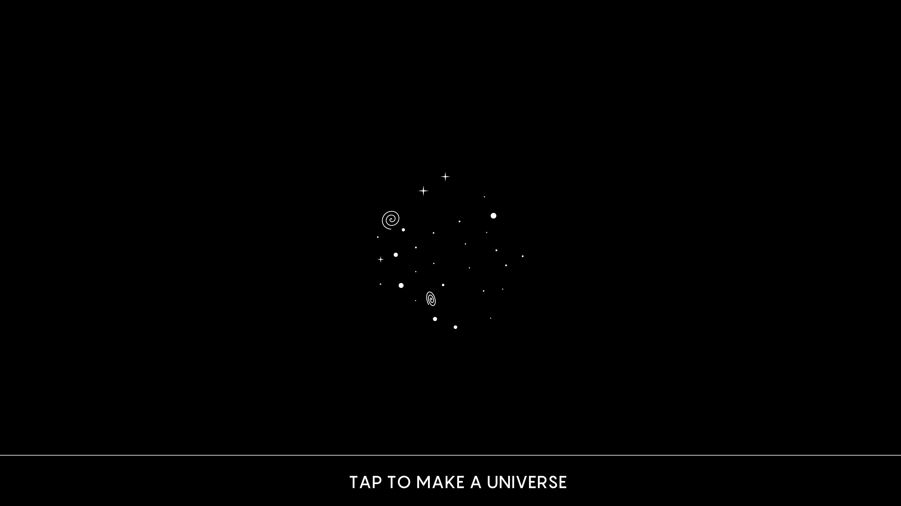

Does Time Really Flow? New Clues Come From a Century-Old Approach to Math. | Quanta Magazine

###### [theoretical physics](https://www.quantamagazine.org/tag/theoretical-physics/)

# Does Time Really Flow? New Clues Come From a Century-Old Approach to Math.

The laws of physics imply that the passage of time is an illusion. To avoid this conclusion, we might have to rethink the reality of infinitely precise numbers.

[ 60](https://www.quantamagazine.org/does-time-really-flow-new-clues-come-from-a-century-old-approach-to-math-20200407/#comments)

###### Read Later

 

If numbers cannot have infinite strings of digits, then the future can never be perfectly preordained.

[Dave Whyte](http://beesandbombs.com/) for Quanta Magazine

[     ### Natalie Wolchover  *Senior Writer/Editor*](https://www.quantamagazine.org/authors/natalie/)

* * *

*April 7, 2020*

* * *

[View PDF/Print Mode](https://www.quantamagazine.org/does-time-really-flow-new-clues-come-from-a-century-old-approach-to-math-20200407/#)

[foundations of mathematics](https://www.quantamagazine.org/tag/foundations-of-mathematics/)[general relativity](https://www.quantamagazine.org/tag/general-relativity/)[mathematics](https://www.quantamagazine.org/tag/mathematics/)[physics](https://www.quantamagazine.org/tag/physics/)[quantum gravity](https://www.quantamagazine.org/tag/quantum-gravity/)[quantum information theory](https://www.quantamagazine.org/tag/quantum-information-theory/)[quantum physics](https://www.quantamagazine.org/tag/quantum-physics/)[space-time](https://www.quantamagazine.org/tag/space-time/)[theoretical physics](https://www.quantamagazine.org/tag/theoretical-physics/)[time](https://www.quantamagazine.org/tag/time/)

Strangely, although we feel as if we sweep through time on the knife-edge between the fixed past and the open future, that edge — the present — appears nowhere in the existing laws of physics.

In Albert Einstein’s theory of relativity, for example, time is woven together with the three dimensions of space, forming a bendy, four-dimensional space-time continuum — a “block universe” encompassing the entire past, present and future. Einstein’s equations portray everything in the block universe as decided from the beginning; the initial conditions of the cosmos determine what comes later, and surprises do not occur — they only seem to. “For us believing physicists,” Einstein wrote in 1955, weeks before his death, “the distinction between past, present and future is only a stubbornly persistent illusion.”

The timeless, pre-determined view of reality held by Einstein remains popular today. “The majority of physicists believe in the block-universe view, because it is predicted by general relativity,” said [Marina Cortês](http://www.iastro.pt/ia/newStaffDetails.html?ID=116), a cosmologist at the University of Lisbon.

However, she said, “if somebody is called on to reflect a bit more deeply about what the block universe means, they start to question and waver on the implications.”

Physicists who think carefully about time point to troubles posed by quantum mechanics, the laws describing the probabilistic behavior of particles. At the quantum scale, irreversible changes occur that distinguish the past from the future: A particle maintains simultaneous quantum states until you measure it, at which point the particle adopts one of the states. Mysteriously, individual measurement outcomes are random and unpredictable, even as particle behavior collectively follows statistical patterns. This apparent inconsistency between the nature of time in quantum mechanics and the way it functions in relativity has created uncertainty and confusion.

Over the past year, the Swiss physicist [Nicolas Gisin](https://www.unige.ch/gap/quantum/members:nicolas_gisin) has published four papers that attempt to dispel the fog surrounding time in physics. As Gisin sees it, the problem all along has been mathematical. Gisin argues that time in general and the time we call the present are easily expressed in a century-old mathematical language called intuitionist mathematics, which rejects the existence of numbers with infinitely many digits. When intuitionist math is used to describe the evolution of physical systems, it makes clear, according to Gisin, that “time really passes and new information is created.” Moreover, with this formalism, the strict determinism implied by Einstein’s equations gives way to a quantum-like unpredictability. If numbers are finite and limited in their precision, then nature itself is inherently imprecise, and thus unpredictable.

Physicists are still digesting Gisin’s work — it’s not often that someone tries to reformulate the laws of physics in a new mathematical language — but many of those who have engaged with his arguments think they could potentially bridge the conceptual divide between the determinism of general relativity and the inherent randomness at the quantum scale.

“I found it intriguing,” said [Nicole Yunger Halpern](https://www.cfa.harvard.edu/itamp-people/nicole.yunger_halpern), a quantum information scientist at Harvard University, responding to [Gisin’s recent article in *Nature Physics*](https://www.nature.com/articles/s41567-019-0748-5). “I’m open to giving intuitionist mathematics a shot.”

Cortês called Gisin’s approach “extremely interesting” and “shocking and provocative” in its implications. “It’s really a very interesting formalism that is addressing this problem of finite precision in nature,” she said.

Gisin said it’s important to formulate laws of physics that cast the future as open and the present as very real, because that’s what we experience. “I am a physicist who has my feet on the ground,” he said. “Time passes; we all know that.”

## Information and Time

Gisin, 67, is primarily an experimenter. He runs a lab at the University of Geneva that has performed groundbreaking experiments in quantum communication and quantum cryptography. But he is also the rare crossover physicist who is known for important theoretical insights, especially ones involving quantum chance and nonlocality.

On Sunday mornings, in lieu of church, Gisin makes a habit of sitting quietly in his chair at home with a mug of oolong tea and contemplating deep conceptual puzzles. It was on a Sunday about two and a half years ago that he realized that the deterministic picture of time in Einstein’s theory and the rest of “classical” physics implicitly assumes the existence of infinite information.

Nicolas Gisin in his home office overlooking the garden.
Carole Parodi

Consider the weather. Because it’s chaotic, or highly sensitive to small differences, we can’t predict exactly what the weather will be a week from now. But because it’s a classical system, textbooks tell us that we could, in principle, predict the weather a week on, if only we could measure every cloud, gust of wind and butterfly’s wing precisely enough. It’s our own fault we can’t gauge conditions with enough decimal digits of detail to extrapolate forward and make perfectly accurate forecasts, because the actual physics of weather unfolds like clockwork.

Now expand this idea to the entire universe. In a predetermined world in which time only seems to unfold, exactly what will happen for all time actually had to be set from the start, with the initial state of every single particle encoded with infinitely many digits of precision. Otherwise there would be a time in the far future when the clockwork universe itself would break down.

But information is physical. Modern research shows it requires energy and occupies space. Any volume of space is known to have a finite information capacity (with the densest possible information storage happening inside black holes). The universe’s initial conditions would, Gisin realized, require far too much information crammed into too little space. “A real number with infinite digits can’t be physically relevant,” he said. The block universe, which implicitly assumes the existence of infinite information, must fall apart.

He sought a new way of describing time in physics that didn’t presume infinitely precise knowledge of the initial conditions.

## The Logic of Time

The modern acceptance that there exists a continuum of real numbers, most with infinitely many digits after the decimal point, carries little trace of the vitriolic debate over the question in the first decades of the 20th century. David Hilbert, the great German mathematician, espoused the now-standard view that real numbers exist and can be manipulated as completed entities. Opposed to this notion were mathematical “intuitionists” led by the acclaimed Dutch topologist L.E.J. Brouwer, who saw mathematics as a construct. Brouwer insisted that numbers must be constructible, their digits calculated or chosen or randomly determined one at a time. Numbers are finite, said Brouwer, and they’re also processes: They can become ever more exact as more digits reveal themselves in what he called a choice sequence, a function for producing values with greater and greater precision.

By grounding mathematics in what can be constructed, intuitionism has far-reaching consequences for the practice of math, and for determining which statements can be deemed true. The most radical departure from standard math is that the law of excluded middle, a vaunted principle since the time of Aristotle, doesn’t hold. The law of excluded middle says that either a proposition is true, or its negation is true — a clear set of alternatives that offers a powerful mode of inference. But in Brouwer’s framework, statements about numbers might be neither true nor false at a given time, since the number’s exact value hasn’t yet revealed itself.

*open-quote*
A real number with infinite digits can’t be physically relevant.
*close-quote*
Nicolas Gisin

There’s no difference from standard math when it comes to numbers like 4, or ½, or pi, the ratio of a circle’s circumference to its diameter. Even though pi is irrational, with no finite decimal expansion, there’s an algorithm for generating its decimal expansion, making pi just as determinate as a number like ½. But consider another number *x* that’s in the ballpark of ½.

Say the value of *x *is 0.4999, where further digits unfurl in a choice sequence. Maybe the sequence of 9s will continue forever, in which case *x* converges to exactly ½. (This fact, that 0.4999… = 0.5, is true in standard math as well, since *x* differs from ½ by less than any finite difference.)

But if at some future point in the sequence, a digit other than 9 crops up — if, say, the value of *x *becomes 4.999999999999997… — then no matter what happens after that, *x* is less than ½. But before that happens, when all we know is 0.4999, “we don’t know whether or not a digit other than 9 will ever show up,” explained [Carl Posy](https://en.philosophy.huji.ac.il/people/carl-posy), a philosopher of mathematics at the Hebrew University of Jerusalem and a leading expert on intuitionist math. “At the time we consider this *x*, we cannot say that *x* is less than ½, nor can we say that *x* equals ½.” The proposition “*x* is equal to ½” is not true, and neither is its negation. The law of the excluded middle doesn’t hold.

Moreover, the continuum can’t be cleanly divided into two parts consisting of all numbers less than ½ and all those greater than or equal to ½. “If you try to cut the continuum in half, this number *x* is going to stick to the knife, and it won’t be on the left or on the right,” said Posy. “The continuum is viscous; it’s sticky.”

Hilbert compared the removal of the law of excluded middle from math to “prohibiting the boxer the use of his fists,” since the principle underlies much mathematical deduction. Although Brouwer’s intuitionist framework compelled and fascinated the likes of Kurt Gödel and Hermann Weyl, standard math, with its real numbers, dominates because of ease of use.

## The Unfolding of Time

Gisin first encountered intuitionist math at a meeting last May attended by Posy. When the two got to talking, Gisin quickly saw a connection between the unspooling decimal digits of numbers in this mathematical framework and the physical notion of time in the universe. Materializing digits seemed to naturally correspond to the sequence of moments defining the present, when the uncertain future becomes concrete reality. The lack of the law of excluded middle is akin to indeterministic propositions about the future.

In work [published](https://journals.aps.org/pra/abstract/10.1103/PhysRevA.100.062107) last December in *Physical Review A*, Gisin and his collaborator Flavio Del Santo used intuitionist math to formulate an alternative version of classical mechanics, one that makes the same predictions as the standard equations but casts events as indeterministic — creating a picture of a universe where the unexpected happens and time unfolds.

*open-quote*

If I look at where we have paradoxes and what problems we have, in the end they always boil down to this notion of time.

*close-quote*
Renato Renner

It is a bit like the weather. Recall that we can’t precisely forecast the weather because we don’t know the initial conditions of every atom on Earth to infinite precision. But in Gisin’s indeterministic version of the story, those exact numbers never existed. Intuitionist math captures this: The digits that specify the weather’s state ever more precisely, and dictate its evolution ever further into the future, are chosen in real time as that future unfolds in a choice sequence. [Renato Renner](https://itp.phys.ethz.ch/people/person-detail.NTkyNzU=.TGlzdC84NDYsLTE5MDQ4MDM5ODI=.html), a quantum physicist at the Swiss Federal Institute of Technology Zurich, said Gisin’s arguments “point in the direction that deterministic predictions are fundamentally impossible in general.”

In other words, the world is indeterministic; the future is open. Time, Gisin said, “is not unfolding like a movie in the cinema. It is really a creative unfolding. The new digits really get created as time passes.”

[Fay Dowker](https://www.imperial.ac.uk/people/f.dowker), a quantum gravity theorist at Imperial College London, said she is “very sympathetic” to Gisin’s arguments, as “he is on the side of those of us who think that physics doesn’t accord with our experience and therefore it’s missing something.” Dowker agrees that mathematical languages shape our understanding of time in physics, and that the standard Hilbertian mathematics that treats real numbers as completed entities “is certainly static. It has this character of being timeless, and that definitely is a limitation to us as physicists if we’re trying to incorporate something that’s as dynamic as our experience of the passage of time.”

For physicists such as Dowker who are interested in the connections between gravity and quantum mechanics, one of the most important implications of this new view of time is how it begins to bridge what have long been thought of as two mutually incompatible views of the world. “One of the implications it has for me,” said Renner, “is that classical mechanics is in some ways closer to quantum mechanics than we thought.”

## Quantum Uncertainty and Time

If physicists are going to solve the mystery of time, they have to grapple not just with the space-time continuum of Einstein, but also with the knowledge that the universe is fundamentally quantum, ruled by chance and uncertainty. Quantum theory paints a very different picture of time than Einstein’s theory. “Our two big theories on physics, quantum theory and general relativity, make different statements,” said Renner. He and several other physicists said this inconsistency underlies the struggle to find a quantum theory of gravity — a description of the quantum origin of space-time — and to understand why the Big Bang happened. “If I look at where we have paradoxes and what problems we have, in the end they always boil down to this notion of time.”

Time in quantum mechanics is rigid, not bendy and intertwined with the dimensions of space as in relativity. Furthermore, measurements of quantum systems “make time in quantum mechanics irreversible, whereas otherwise the theory is completely reversible,” said Renner. “So time plays a role in this thing that we still don’t really understand.”

Many physicists interpret quantum physics as telling us that the universe is indeterministic. “For Chrissakes, you have two uranium atoms: One of them decays after 500 years, and the other one decays after 1,000 years, and yet they’re completely identical in every way,” said [Nima Arkani-Hamed](https://www.sns.ias.edu/arkani), a physicist at the Institute for Advanced Study in Princeton, New Jersey. “In every meaningful sense, the universe is not deterministic.”

Still, other popular interpretations of quantum mechanics, including the [many-worlds interpretation](https://www.quantamagazine.org/why-the-many-worlds-interpretation-of-quantum-mechanics-has-many-problems-20181018/), manage to keep the classical, deterministic notion of time alive. These theories cast quantum events as playing out a predetermined reality. Many-worlds, for instance, says each quantum measurement splits the world into multiple branches that realize every possible outcome, all of which were set in advance.

*open-quote*
Real numbers can’t exist, because you can’t hide them inside black holes.
*close-quote*
Ahmed Almheiri

Gisin’s ideas go the other way. Instead of trying to make quantum mechanics a deterministic theory, he hopes to provide a common, indeterministic language for both classical and quantum physics. But the approach departs from standard quantum mechanics in an important way.

In quantum mechanics, information can be shuffled or scrambled, but never created or destroyed. Yet if the digits of numbers defining the state of the universe grow over time as Gisin proposes, then new information is coming into being. Gisin said he “absolutely” rejects the notion that information is preserved in nature, largely because “there is clearly new information that is created during a measurement process.” He added, “I’m saying that we need another way of looking at these entire ideas.”

This new way of thinking about information may suggest a resolution to the [black hole information paradox](https://www.quantamagazine.org/stephen-hawkings-black-hole-paradox-keeps-physicists-puzzled-20180314/), which asks what happens to information swallowed by black holes. General relativity implies that information gets destroyed; quantum theory says it’s preserved. Hence the paradox. If a different formulation of quantum mechanics in terms of intuitionist math allows information to be created by quantum measurements, perhaps it also lets information be destroyed.

[Jonathan Oppenheim](https://www.ucl.ac.uk/oppenheim/), a theoretical physicist at University College London, believes information is indeed lost in black holes. He doesn’t know if Brouwer’s intuitionism will be the key to showing this, as Gisin contends, but he says there’s reason to think information creation and destruction might be deeply related to time. “Information is destroyed as you go forward in time; it’s not destroyed as you move through space,” Oppenheim said. The dimensions that make up Einstein’s block universe are very different from one another.

Along with supporting the idea of creative (and possibly destructive) time, intuitionist math also offers a novel interpretation of our conscious experience of time. Recall that in this framework, the continuum is sticky, impossible to cut in two. Gisin associates this stickiness with our sense that the present is “thick” — a substantive moment rather than a zero-width point that cleanly cleaves past from future. In standard physics, based on standard math, time is a continuous parameter that can take any value on the number line. “However,” Gisin said, “if the continuum is represented by intuitionistic mathematics, then time can’t be cut in two sharply.” It’s thick, he said, “in the same sense as honey is thick.”

So far, it’s just an analogy. Oppenheim said he had “a good feeling about this notion that the present is thick. I’m not sure why we have that feeling.”

## The Future of Time

Gisin’s ideas have prompted a range of responses from other theorists, all with their own thought experiments and intuitions about time to go on.

Several experts agreed that real numbers don’t seem to be physically real, and that physicists need a new formalism that doesn’t rely on them. [Ahmed Almheiri](https://www.ias.edu/scholars/ahmed-almheiri), a theoretical physicist at the Institute for Advanced Study who studies black holes and quantum gravity, said quantum mechanics “precludes the existence of the continuum.” Quantum math bundles energy and other quantities into packets, which are more like whole numbers rather than a continuum. And infinite numbers get truncated inside black holes. “A black hole may seem to have a continuously infinite number of internal states, but [these get] cut off,” he said, due to quantum gravitational effects. “Real numbers can’t exist, because you can’t hide them inside black holes. Otherwise they’d be able to hide an infinite amount of information.”

[Sandu Popescu](http://www.bristol.ac.uk/physics/people/sandu-popescu/), a physicist at the University of Bristol who corresponds often with Gisin, agreed with the latter’s indeterministic worldview but said he is not convinced that intuitionist math is necessary. Popescu objects to the idea that digits of real numbers count as information.

Arkani-Hamed found Gisin’s use of intuitionist math interesting and potentially relevant to cases such as black holes and the Big Bang where gravity and quantum mechanics come into apparent conflict. “These questions — of numbers as finite, or fundamentally things that exist, or whether there’s infinitely many digits, or the digits are made as you go on,” he said, “might be related to how we should ultimately think about cosmology in situations where we don’t know how to apply quantum mechanics.” He too sees the need for a new mathematical language that could “liberate” physicists from infinite precision and allow them to “talk about things that are a little bit fuzzy all the time.”

Gisin’s ideas resonate in many corners but still need to be fleshed out. Going forward, he hopes to find a way of reformulating relativity and quantum mechanics in terms of finite, fuzzy intuitionist mathematics, as he did with classical mechanics, potentially bringing the theories closer. He has some ideas about how to approach the quantum side.

One way that infinity rears its head in quantum mechanics is in the “tail problem”: Try to localize a quantum system, like an electron on the moon, and “if you do that with standard mathematics, you have to admit that an electron on the moon has a super small probability of being also detected on Earth,” Gisin said. The “tail” of the mathematical function representing the particle’s position “becomes exponentially small but nonzero.”

### Related:

* * *

1. 1.

##### [The Universal Law That Aims Time’s Arrow](https://www.quantamagazine.org/the-universal-law-that-aims-times-arrow-20190801/)

2. 2.

##### [Mathematicians Bridge Finite-Infinite Divide](https://www.quantamagazine.org/mathematicians-bridge-finite-infinite-divide-20160524/)

3. 3.

##### [A Debate Over the Physics of Time](https://www.quantamagazine.org/a-debate-over-the-physics-of-time-20160719/)

4. 4.

##### [Time’s Arrow Traced to Quantum Source](https://www.quantamagazine.org/quantum-entanglement-drives-the-arrow-of-time-scientists-say-20140416/)

But Gisin wonders, “What reality should we attribute to a super small number? Most experimentalists would say, ‘Put it to zero and stop questioning.’ But maybe the more theoretically oriented would say, ‘OK, but there is something there according to the math.’

“But it depends, now, which math,” he continued. “Classical math, there is something. In intuitionist math, no. There is nothing.” The electron is on the moon, and its chance of turning up on Earth is well and truly zero.

Since Gisin first published his work, the future has grown only more uncertain. Now every day is a kind of Sunday for him, as crisis grips the world. Away from the lab, and unable to see his granddaughters except on a screen, he plans to keep thinking, at home with his mug of tea and garden view.

### Share this article

[ ![](data:image/svg+xml,%3csvg xmlns='http://www.w3.org/2000/svg' class='absolute fit-x mxa c-1a1a1a js-evernote-checked' x='0px' y='0px' viewBox='0 0 50 50' enable-background='new 0 0 50 50' xml:space='preserve' data-reactid='336' data-evernote-id='229'%3e%3cg data-reactid='337' data-evernote-id='755' class='js-evernote-checked'%3e%3c!-- react-text: 338 --%3e %3c!-- /react-text --%3e%3cpath fill='currentColor' d='M20.6%2c38.5c-0.8%2c0-1.6%2c0.3-2.2%2c0.8L16%2c41.9c-1.1%2c1-2.4%2c1.6-3.9%2c1.6c-1.5%2c0-2.8-0.5-3.9-1.6c-0.5-0.5-0.9-1.1-1.2-1.8 c-0.3-0.7-0.4-1.4-0.4-2.1c0-0.7%2c0.1-1.4%2c0.4-2.1c0.3-0.7%2c0.7-1.2%2c1.2-1.8l9.1-9c1-0.9%2c2.2-1.8%2c3.8-2.7s3-0.7%2c4.3%2c0.7 c0.6%2c0.6%2c1.3%2c0.8%2c2.2%2c0.8s1.5-0.3%2c2.1-0.9c0.6-0.6%2c0.9-1.3%2c0.9-2.2s-0.3-1.6-0.9-2.2c-2.2-2.2-4.8-3.1-7.8-2.7 c-3%2c0.4-5.9%2c2-8.8%2c4.8l-9.2%2c9c-1.1%2c1.1-1.9%2c2.4-2.5%2c3.8C0.7%2c35%2c0.4%2c36.5%2c0.4%2c38c0%2c1.6%2c0.3%2c3%2c0.9%2c4.4c0.6%2c1.4%2c1.4%2c2.7%2c2.5%2c3.8 c1.1%2c1.1%2c2.4%2c2%2c3.8%2c2.5c1.4%2c0.6%2c2.9%2c0.8%2c4.4%2c0.8s2.9-0.3%2c4.3-0.8c1.4-0.6%2c2.7-1.4%2c3.8-2.5l2.5-2.5c0.6-0.6%2c0.9-1.3%2c0.9-2.1 s-0.3-1.6-0.9-2.2C22.1%2c38.8%2c21.4%2c38.5%2c20.6%2c38.5z' data-reactid='339' data-evernote-id='756' class='js-evernote-checked'%3e%3c/path%3e%3c!-- react-text: 340 --%3e %3c!-- /react-text --%3e%3cpath fill='currentColor' d='M48.7%2c7.9c-0.6-1.4-1.4-2.7-2.5-3.8c-2.4-2.4-5.1-3.6-8-3.7c-3-0.1-5.5%2c0.9-7.7%2c3.1l-3.1%2c3.1c-0.6%2c0.6-0.9%2c1.3-0.9%2c2.1 s0.3%2c1.6%2c0.9%2c2.2s1.3%2c0.9%2c2.2%2c0.9s1.6-0.3%2c2.2-0.8l3.1-3.1c1.2-1.1%2c2.4-1.5%2c3.7-1.3c1.3%2c0.3%2c2.5%2c0.9%2c3.4%2c1.9 c0.5%2c0.5%2c0.9%2c1.1%2c1.2%2c1.8c0.3%2c0.7%2c0.4%2c1.4%2c0.4%2c2.1c0%2c0.7-0.1%2c1.4-0.4%2c2.1c-0.3%2c0.7-0.7%2c1.2-1.2%2c1.8l-9.7%2c9.6 c-2.2%2c2.2-3.9%2c3.1-5.1%2c2.7s-2-0.8-2.4-1.3c-0.6-0.6-1.3-0.8-2.2-0.8s-1.5%2c0.3-2.1%2c0.9c-0.6%2c0.6-0.9%2c1.3-0.9%2c2.2s0.3%2c1.5%2c0.9%2c2.1 c1%2c1%2c2.1%2c1.8%2c3.2%2c2.3s2.4%2c0.7%2c3.6%2c0.7c1.5%2c0%2c3-0.4%2c4.6-1.1c1.6-0.7%2c3.1-1.9%2c4.6-3.4l9.8-9.6c1.1-1.1%2c1.9-2.4%2c2.5-3.8 c0.6-1.4%2c0.9-2.9%2c0.9-4.4C49.6%2c10.8%2c49.3%2c9.3%2c48.7%2c7.9z' data-reactid='341' data-evernote-id='757' class='js-evernote-checked'%3e%3c/path%3e%3c!-- react-text: 342 --%3e %3c!-- /react-text --%3e%3c/g%3e%3c/svg%3e)](https://www.quantamagazine.org/does-time-really-flow-new-clues-come-from-a-century-old-approach-to-math-20200407/#0)

###### Copied!

[ ](https://www.quantamagazine.org/does-time-really-flow-new-clues-come-from-a-century-old-approach-to-math-20200407/mailto:?subject=Does%20Time%20Really%20Flow?%20New%20Clues%20Come%20From%20a%20Century-Old%20Approach%20to%20Math.&body=The%20laws%20of%20physics%20imply%20that%20the%20passage%20of%20time%20is%20an%20illusion.%20To%20avoid%20this%20conclusion,%20we%20might%20have%20to%20rethink%20the%20reality%20of%20infinitely%20precise%20numbers.%0A%0Ahttps://www.quantamagazine.org/does-time-really-flow-new-clues-come-from-a-century-old-approach-to-math-20200407/)

[ ![](data:image/svg+xml,%3csvg xmlns='http://www.w3.org/2000/svg' class='absolute fit-x mxa c-1a1a1a js-evernote-checked' viewBox='4 0 33 33' enable-background='new 0 0 30 30' data-reactid='363' data-evernote-id='232'%3e%3cpath fill='currentColor' d='M39.58%2c19.65A4.72%2c4.72%2c0%2c0%2c0%2c31.91%2c16a22.4%2c22.4%2c0%2c0%2c0-10.42-3.09l2-6.38%2c5.6%2c1.31a3.91%2c3.91%2c0%2c1%2c0%2c.43-2.08L23.05%2c4.27A1.08%2c1.08%2c0%2c0%2c0%2c21.79%2c5L19.26%2c12.9A22.6%2c22.6%2c0%2c0%2c0%2c8%2c16a4.68%2c4.68%2c0%2c1%2c0-5.56%2c7.51%2c8.32%2c8.32%2c0%2c0%2c0-.08%2c1.12c0%2c3.21%2c1.89%2c6.2%2c5.31%2c8.41a22.69%2c22.69%2c0%2c0%2c0%2c12.23%2c3.3A22.67%2c22.67%2c0%2c0%2c0%2c32.15%2c33c3.43-2.21%2c5.31-5.2%2c5.31-8.41a8.77%2c8.77%2c0%2c0%2c0-.06-1%2c4.65%2c4.65%2c0%2c0%2c0%2c2.18-3.93M33.05%2c5.8a1.78%2c1.78%2c0%2c1%2c1-1.8%2c1.78%2c1.79%2c1.79%2c0%2c0%2c1%2c1.8-1.78M11.52%2c22.53a2.71%2c2.71%2c0%2c0%2c1%2c2.69-2.66%2c2.65%2c2.65%2c0%2c1%2c1-2.69%2c2.66m14.93%2c7.73c-1.37%2c1.35-3.47%2c2-6.43%2c2h0c-3%2c0-5.06-.65-6.43-2a1.05%2c1.05%2c0%2c0%2c1%2c0-1.5%2c1.09%2c1.09%2c0%2c0%2c1%2c1.52%2c0c.94.93%2c2.54%2c1.38%2c4.91%2c1.38h0c2.37%2c0%2c4-.45%2c4.91-1.38a1.08%2c1.08%2c0%2c0%2c1%2c1.52%2c0%2c1.07%2c1.07%2c0%2c0%2c1%2c0%2c1.5m-.63-5.1a2.65%2c2.65%2c0%2c1%2c1%2c2.66-2.63%2c2.65%2c2.65%2c0%2c0%2c1-2.66%2c2.63' transform='translate(-0.42 -3.68)' data-reactid='364' data-evernote-id='773' class='js-evernote-checked'%3e%3c/path%3e%3c/svg%3e)](https://www.reddit.com/submit?url=https://www.quantamagazine.org/does-time-really-flow-new-clues-come-from-a-century-old-approach-to-math-20200407/)

* * *

### Newsletter

*Get Quanta Magazine delivered to your inbox*

[(L)](https://www.quantamagazine.org/does-time-really-flow-new-clues-come-from-a-century-old-approach-to-math-20200407/#newsletter)

[Most recent newsletter](http://us1.campaign-archive2.com/home/?u=0d6ddf7dc1a0b7297c8e06618&id=f0cb61321c)