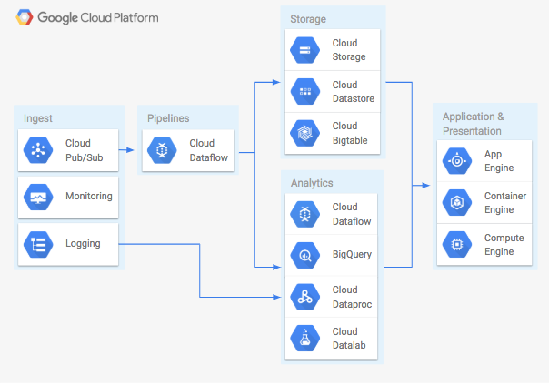
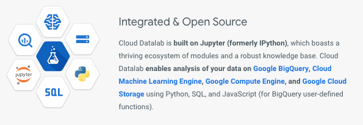
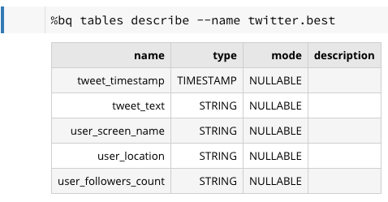
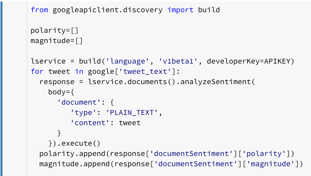
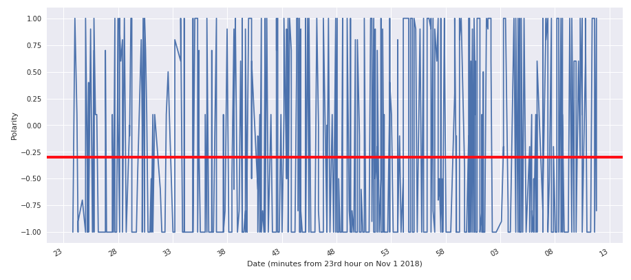
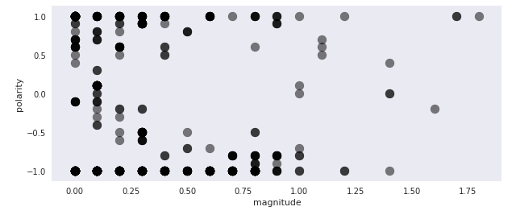
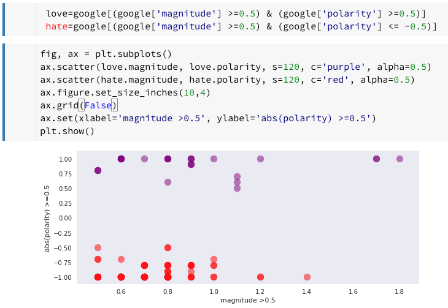
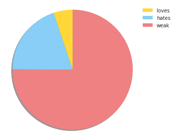
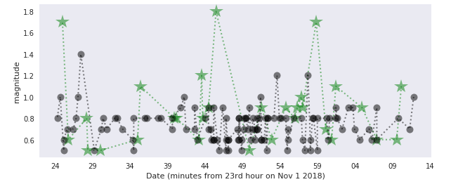

Does everyone hate your tweets? Google Cloud Platform NLP can help!

# Does everyone hate your tweets? Google Cloud Platform NLP can help!

[Dr. Elaina Hyde](https://medium.com/@elaina.hyde)
Nov 5, 2018·6 min read

Have you ever wondered just how your favourite tech company was ‘really’ doing? Wanted to track the hashtags you create or someone else’s on Twitter? Well, it turns out there is an easy way you can get access and run some very powerful Natural Language Processing (NLP) with very little training for your machine learning algorithms. We are going to use Python but we can avoid the nltk package altogether!

So, how do we get started? Well, firstly let’s pick one of the most common problems on Twitter, negative comments and posts. How can we track negativity over time in the things that we are interested in? For the purposes of this article, I am going to investigate the hashtag ‘#Google’. The first step is to be able to pull data off of Twitter and into the Google Cloud Platform (GCP).

Dealing with streaming data on GCP is easy if you write a small pipeline in Dataflow. Fortunately this pipeline process was recently published by Servian’s Graham Polley on Medium over [here](https://medium.com/weareservian/tweets-pipelines-gcp-and-poetry-how-did-it-get-to-this-2a6e47fb3f6a).

How are we going to build our pipeline? Following Graham’s article above, we can refer to the general solution on GCP (below).

The General Process for a Solution of bringing real-time data into GCP (from GCP Official Icons and Sample Diagrams downloadable .pptx)

We are pulling twitter data in by picking a few of the tools shown above and using them to the best effect. In particular we concentrate on Dataflow and BigQuery. The Dataflow pipeline is the same type of pipeline used by Graham and is written in Java and uses Cloud Build to deploy. The JSON data can go directly into our Data Warehouse of BigQuery. It is necessary to set up a [developer account](https://developer.twitter.com/) with Twitter first, so if you are starting from scratch make sure to do that right away as it can take a few days to get approved.

Once our Twitter data is on GCP we can start to reap the benefits of the GCP architecture right away. Our data lands in BigQuery, one of my all time favourite data tools on GCP and hands down the best place to access data for analytics. The very fast querying of massive datasets is just what we need to easily process the tweets our pipeline pulls in. For more on BigQuery, pop over [here](https://cloud.google.com/bigquery/).

So now what? Well, prototyping any Machine Learning on GCP is very easy and get’s us to my second favourite tool of all time, Google Cloud Datalab**.** It’s so good sometimes it even ties with BigQuery. Datalab offers a Pythonic notebook interface in the GCP environment built on Jupyter. It has interfaces which make for easy SQL querying of BigQuery data, easy bash access, and lots of special commands that we won’t cover here, but check its [% commands](https://googledatalab.github.io/pydatalab/google.datalab%20Commands.html#) when you get a chance.

https://cloud.google.com/datalab/

Once we are running Datalab, we can dive right into Natural Language Processing (NLP). NLP uses algorithmic approaches to text to identify sentiment, extract information, and otherwise analyse text. These algorithms generally take a large amount of training and can be cumbersome to construct in traditional methods. However, we will circumvent all of this with the [Google NLP API](https://cloud.google.com/natural-language/).

The NLP API is a pre-trained machine learning algorithm that is behind such technology as Google Assistant, Google Translate and more. We will use it to extract polarity and magnitude from the tweets in our data. Polarity is how negative or positive a statement is, while the magnitude is how ‘strong’ that same statement is: *“I love Google Cloud Platform!”* would be a strongly positive statement, i.e. high magnitude and positive polarity**.**  *“Sometimes, but not always, I feel a little bit frustrated when I am trying to set my row keys in Bigtable.”* would be a weakly negative statement, i.e. low magnitude and negative polarity.

So what first? Inside Datalab we look at our BigQuery data:

Pipeline written from Twitter data into BigQuery

Once our data is read into a data frame in Python we can see that #Google occurs in 582/11030 tweets. We could wait for more data to stream in, but this is enough for our purposes. We call our data frame ‘google’ and to extract polarity and magnitude for all #Google tweets we just import build and run an `analyzeSentiment()` of each tweet.

Calling the Google NLP API

Note, if you are doing this for the first time, you will need to set up an API key in your GCP account for the NLP API to be used. Now that we have all our data, we can look at magnitude and polarity over time for #Google.

Magnitude of #Google over a few minutes

Polarity of #Google over a few minutes

At first this looks very messy, but fortunately if we want to see how many ‘loves’ and ‘hates’ #Google**  **has over this period, we are actually only looking for strongly negative or positive tweets (high absolute polarity, and high magnitude). Our dataset shows the the spread in polarity and magnitude for our hashtag.

#Google Polarity and Magnitude on Nov 1 2018

It looks like we have higher polarity (positive) tweets at the higher magnitudes (stronger statements) which is good to see for our #Google. Maybe not everyone hates our hashtag! We can look further by separating our tweets into loves and hates with simple Python and use data frames for easy plotting.

loves (purple) and hates (red) from sentiment analysis

Looking at these in terms of total number of tweets we can see a problem with #Google right away.

Total type of each tweet

Firstly, weak tweets seem to dominate, also we are not getting as many (numerically) loves as hates. Does everyone hate our tweets?

Fortunately, if we investigate the loves and hates we can see a redeeming feature in our tweets. In particular, now that we have our loves and hates, we can see how they behave over time.

Magnitude of loves (green) and hates (black)

So does everyone hate #Google tweets? Fortunately, no! The loves in green above have the highest magnitude, i.e. the strongest sentiment. The hates in black have in general lower, towards our cutoff, values. So, there are a good deal of loves and hates, strong magnitude tweets, but they do fluctuate quite a good deal in the data we have managed to capture. Even though we have numerically more hates, it is the loves that have the strongest magnitude.

*> “There is always some madness in love. But there is also always some reason in madness.”*>

> – Friedrich Nietzsche
What’s next?

We could check any other hashtags we cared to invent, or even look for accounts that were tweeting the most positive or negative content, look for trends over time or even set up flagging. Now that our data is in BigQuery and we have set up Datalab, the sky (or the cloud in any case) is the limit.

Want to see more? The code for this investigation is on my GitHub account [here](https://github.com/AstroHyde/gcp-tweets-streaming-pipeline). Thanks for reading!