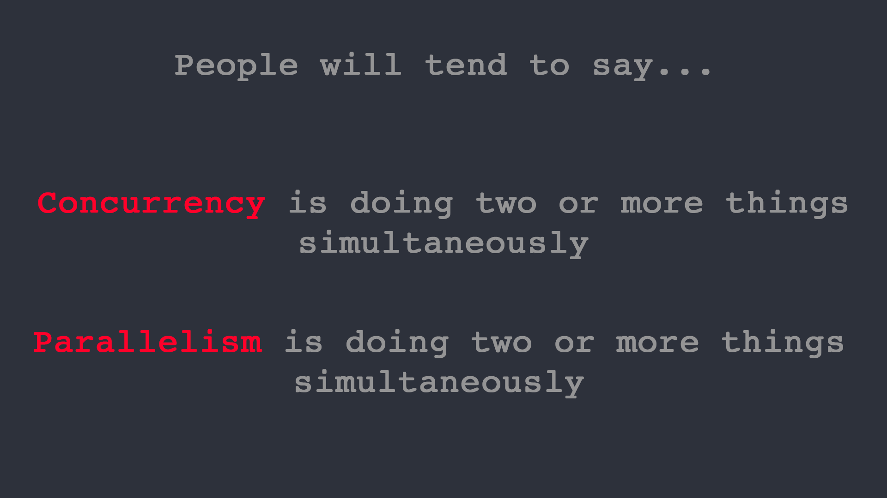

Don’t be confused between Concurrency and Parallelism

# Don’t be confused between Concurrency and Parallelism

[Skrew Everything](https://medium.com/@skreweverything)

Apr 16, 2018·8 min read

* * *

*...*
*Vote for next post or mention what do you want to see next here:*

[**Next post on? — Question Cafe** *Everything you need to know about Basic working of Deep Learning Neural Networks — Everything you need to know about…*question.cafe](https://question.cafe/ul7zd6r)[(L)](https://question.cafe/ul7zd6r)

* * *

*...*
Many people use the terms “Concurrency” and “Parallelism” interchangeably.
For god sake, its not! They both refer different things.

* * *

*...*

**> Concurrency**>  is about dealing with lots of things at once. **> Parallelism**>  is about doing lots of things at once.

* * *

*...*

### **Parallelism**

It means that an application splits its tasks up into smaller subtasks which can be processed in parallel, for instance on multiple CPUs at the exact same time.

Having multiple threads do similar task which are independent of each other in terms of data and resource that they require to do so. Eg: Google crawler can spawn thousands of threads and each thread can do it’s task independently.

### **Concurrency**

It means that an application is making progress on more than one task at the same time (concurrently). Well, if the computer only has one CPU the application may not make progress on more than one task at exactly the same time, but more than one task is being processed at a time inside the application. It does not completely finish one task before it begins the next.

Concurrency comes into picture when you have shared data, shared resource among the threads. In a transactional system this means you have to synchronize the critical section of the code using some techniques like Locks, semaphores, etc.

* * *

*...*

***It’s important to note that parallelism implies concurrency, but concurrency does not guarantee parallelism. Basically, concurrency is about structure while parallelism is about execution.***

* * *

*...*

Confusion exists because dictionary meanings of both these words are almost the same:

- •**Concurrent**: existing, happening, or done at the same time(dictionary.com)
- •**Parallel**: very similar and often happening at the same time(merriam webster).

Yet the way they are used in computer science and programming are quite different. Here is my interpretation:

- •**Concurrency**: Interruptability
- •**Parallelism**: Independentability

So what do I mean by above definitions? I will clarify with a real world analogy.

* * *

*...*

### Example — 1

Let’s say you have to get done 2 very important tasks in one day
1. 1.Get a passport
2. 2.Get a presentation done

Now problem is task-1 requires you to goto an extremely bureaucratic government office that makes you wait for 4 hours in a line to get your passport. Whereas task-2 is required to be done for your office and it is a critical one. Both of these have to be finished on a specific day.

**Case-1: Sequential Execution** Ordinarily, you will drive to passport office for 2 hours, wait in the line for 4 hours, get the task done, drive back two hours, go home, stay away 5 more hours and get presentation done.

**Case-2: Concurrent Execution:** But you are smart. You plan ahead. What you do is, you carry a laptop with you, and while waiting in the line, you start working on your presentation. This way, once you get back at home, you just need to work one extra hour instead of 5 more hours. In this case, both the tasks are done by you, just in pieces. You interrupted the passport task while waiting in the line and worked on presentation. Whereas when your number was called, you interrupted presentation task and switched to passport task. The saving in time was essentially possible due to interruptability of both the tasks. Concurrency, IMO, should be taken as “isolation” in ACID properties of a database.Two database transactions satisfy isolation requirement if you perform sub-transactions in each in any interleaved way and the final result is same as if the two tasks were done serially. Remember, that for both the passport and presentation tasks, you are the sole executioner.

**Case-3: Parallel Execution** Now since you are such a smart fella, obviously you are a higher up and you have got an assistant. Now before you leave to do passport task, you call him and tell him to prepare first draft of the presentation. You spend your entire day and finish passport task, come back and see your mails and you find the presentation draft. He has done a pretty solid job and with some edits in 2 more hours, you finalize it. Now since, your assistant is just as smart as you, he was able to work on it independently without a need to ask you for constant clarifications. Thus, the due to the independentability of the tasks, they were performed in the same time by two different executioners.

Still with me? Alright ..

**Case-4: Concurrent But Not Parallel** Remember your passport task where you have to wait in the line? In this case, notice that since it is **your** passport, your assistant cannot wait in the line for you. Thus, the passport tasks has interruptability (you can stop it while waiting in the line and resume it later when your number is called), but no independentability(your assistant cannot wait in your stead).

**Case-5: Parallel But Not Concurrent** Say, the government office has a security check to enter the premises. Here, you have to take off all electronic devices and submit them to the officers which you only get back after finishing your task. In this, case, the passport task is neither independent nor interruptible. Even if you are waiting in the line, you cannot work on something else because you do not have necessary equipment. Similarly, say the presentation is so highly mathematical in nature that you require 100% concentration for at least 5 hours. You cannot do it while waiting in line for passport task even if you have your laptop with you. In this case, the presentation task is independent(either you or your assistant can put 5 hours of focused effort), but not interruptible.

**Case-6: Concurrent and Parallel Execution** Now say that in addition to assigning an assistant to the presentation, you also carry a laptop with you to passport task. While waiting in the line, you see that assistant has created first 10 slides in a shared deck. You send comments out to him, correcting him. Thus, now when you get back at home, instead of investing 2 hours to finalize the draft, you just need 15 minutes. This was possible because presentation task has independentability(either one of you can do it) and interruptability(you can stop it and resume it later). So you concurrently executed both the task and only executed presentation task in parallel.

Lets say, that the government office is corrupt in addition to being overly bureaucratic. Thus, you can enter it, show your identification, start waiting in line for your number to be called, give some money to the guard and make someone else hold your position in the line, sneak out, come back before your number is called and resume it.

In this case, you can perform both the passport and presentation tasks concurrently and in parallel. You can sneak out and your position is held by your assistant. Both of you can work on the presentation etc.

* * *

*...*

### Example — 2

**Assume** that a organization organizes a chess tournament where 10 players (**with equal chess playing skills**) will challenge a **professional champion** chess player. And since chess is 1:1 game thus organizers have to conduct 10 games in time efficient manner so that they can finish the whole event as quickly as possible.

Hopefully following scenarios will easily describe multiple ways of conducting these 10 games:

**1) SERIAL** — lets say that the professional plays with each person one by one i.e. starts and finishes the game with one person and then starts the next game with next person and so on. In other words, they decided to conduct the games sequentially. So if one game takes 10 mins to complete then 10 games will take 100 mins, also assume that transition from one game to other takes 6 secs then for 10 games it will be 54 secs (approx. 1 min).

so the whole event will approximately complete in 101 mins (**WORST APPROACH**)

**2) CONCURRENT** — lets say that professional plays his turn and moves on to next player so all 10 players are playing simultaneously but the professional player is not with two person at a time, he plays his turn and moves on to next person. Now assume professional player takes 6 sec to play his turn and also transition time of professional player b/w two players is 6 sec so total transition time to get back to first player will be 1min (10x6sec). Therefore, by the time he is back to first person with, whom event was started, 2mins have passed (10xtime_per_turn_by_champion + 10xtransition_time=2mins)

Assuming that all player take 45sec to complete their turn so based on 10mins per game from SERIAL event the no. of rounds before a game finishes should 600/(45+6) = 11 rounds (approx)

So the whole event will approximately complete in 11xtime_per_turn_by_player_&_champion + 11xtransition_time_across_10_players = 11x51 + 11x60sec= 561 + 660 = 1221sec = 20.35mins (approximately)

SEE THE IMPROVEMENT from 101 mins to 20.35 mins (**BETTER APPROACH**)

**3) PARALLEL** — lets say organizers get some extra funds and thus decided to invite **two professional champion player** (both equally capable) and divided the set of same 10 players (challengers) in two group of 5 each and assigned them to two champion i.e. one group each. Now the event is progressing in parallel in these two sets i.e. at least two players (one in each group) are playing against the two professional players in their respective group.

However within the group the professional player with take one player at a time (i.e. sequentially) so without any calculation you can easily deduce that whole event will approximately complete in 101/2=50.5mins to complete

SEE THE IMPROVEMENT from 101 mins to 50.5 mins (**GOOD APPROACH**)

**4) CONCURRENT + PARALLEL** — In above scenario, lets say that the two champion player will play concurrently (read 2nd point) with the 5 players in their respective groups so now games across groups are running in parallel but within group they are running concurrently.

So the games in one group will approximately complete in 11xtime_per_turn_by_player_&_champion + 11xtransition_time_across_5_players = 11x51 + 11x30 = 600 + 330 = 930sec = 15.5mins (approximately)

So the whole event (involving two such parallel running group) will approximately complete in 15.5mins

SEE THE IMPROVEMENT from 101 mins to 15.5 mins (**BEST APPROACH**)

**NOTE:** in above scenario if you replace 10 players with 10 similar jobs and two professional player with a two CPU cores then again the following ordering will remain true:

SERIAL > PARALLEL > CONCURRENT > CONCURRENT+PARALLEL

(NOTE: this order might change for other scenarios as this ordering highly depends on inter-dependency of jobs, communication needs b/w jobs and transition overhead b/w jobs)