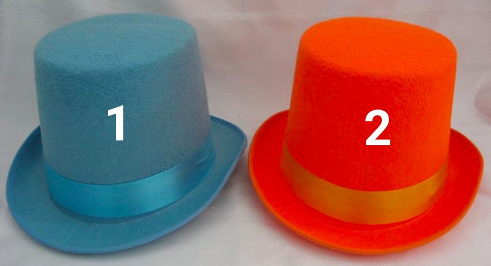
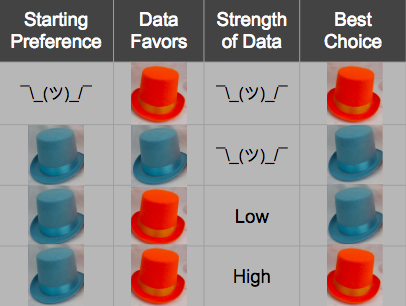

Don’t waste your time on statistics - Towards Data Science

# Don’t waste your time on statistics

[Cassie Kozyrkov](https://towardsdatascience.com/@kozyrkov?source=post_page-----8163635da56c----------------------)

[May 29, 2018](https://towardsdatascience.com/whats-the-point-of-statistics-8163635da56c?source=post_page-----8163635da56c----------------------) · 3 min read

I recently discovered that a dear friend of mine managed to earn a PhD in [statistics](http://bit.ly/quaesita_statistics) without ever having asked himself this question: *what’s the point of statistics, anyway?* Oh, dear. If you don’t know what it’s for, you also don’t know when it’s not for you. Turns out professors don’t make this obvious, so let me see if I can help.

[***Statistics*  **is the science of changing your mind under uncertainty](http://bit.ly/quaesita_statistics). What might your mind be set to? A [***default action***](http://bit.ly/quaesita_damnedlies) or a ***prior belief***. But what should you do if your mind isn’t set? What if you have no opinions whatsoever?

Just go with your estimate (that’s just a fancy way of saying “best guess based on what you know”). How do you get one? Just look at the data and report what’s there. This is called [analytics](http://bit.ly/quaesita_datasci) (a.k.a. data-mining) and if you’ve ever used a spreadsheet, you’ve already done it. The good news is that your gut is actually pretty good at giving you the right estimate. No need for complex mathemagics.

“But it could be wrong!” Of course it could be wrong, that’s what it means to be uncertain. There’s no mathemagic in the world that can make certainty out of uncertainty. Your best guess might be a mistake, but it is your *best *guess, which makes any other guess a worse guess and even more likely to be wrong.

So just go with your gut, it doesn’t even matter how much data you have!
“Wait, but I need to know if I have enough data!” Mmmm? Enough for what?

Pause for a moment and imagine you’re choosing between blue and orange hats. If you are truly indifferent between them and the data stack up in favor of orange, you’d be insane to end up with blue. Even you only had 3 data points total. Even if it’s only 0.0000000000001% in favor of orange. By what madness did you get blue?! Go with orange, no math required.

If you’re indifferent between these hats to begin with and you get more votes for orange than blue, there’s no math in the world that should tell you to pick blue. Math isn’t magic and it doesn’t violate common sense.

The only way it makes sense to end up choosing blue is if you had a preference for the blue hat to begin with. Then you’re asking whether the evidence in favor of orange is strong enough. In other words, whether there’s enough data to change your mind. Okay, so how can you tell? Welcome to [statistics](http://bit.ly/quaesita_statistics).

In the top half of the table, the evidence doesn’t contradict your starting preference, there’s no need for statistical calculations. You can make your decision immediately. If your evidence is out of line with your preference, you can use statistical calculations to find out whether the evidence should make you want to change your mind.

> Statistics is the science of changing your mind.

So if you’re dealing with uncertainty (e.g. “Will this machine learning system work on tomorrow’s data?”) and the options aren’t each alike in dignity (e.g. “We probably shouldn’t launch it unless it works.”) then you’ve come to the right place: statistics is for you. [Zoom through its main ideas here](http://bit.ly/quaesita_statistics). Everyone else, flee now before you end up crunching a bunch of numbers meticulously… and uselessly. [Analytics](http://bit.ly/quaesita_analysts) is a better option for you.