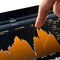

ETF Database: The Original & Comprehensive Guide to ETFs

tablet

[ Discover Multi-Cap ETFs  ](https://etfdb.com/type/size/multi-cap/)

Multi-Cap Power Rankings
6th
3-Mo. Fund Flow

[Fund Flow Leaderboard](https://etfdb.com/type/size/multi-cap/#asset_class_size-power-rankings__fund-flow-leaderboard&sort_name=performance_position&sort_order=asc&page=1)

3rd
Avg. 3-Mo. Return

[Return Leaderboard](https://etfdb.com/type/size/multi-cap/#asset_class_size-power-rankings__return-leaderboard&sort_name=aum_position&sort_order=asc&page=1)

2nd
Aggregate AUM

[AUM Leaderboard](https://etfdb.com/type/size/multi-cap/#asset_class_size-power-rankings__aum-leaderboard&sort_name=performance_position&sort_order=asc&page=1)

ETF Overview
Assets ($MM)

[VNQ](https://adclick.g.doubleclick.net/pcs/click?xai=AKAOjssevpcsAuOgu7tNWqjdSBQtoU-Vchk3U4LXZYGbHD64oegXIVffwdtSMXnjoZDYKkBUvUeY9oYxK1zq36SmTw4-0ZacEo_cgt-Man0fX-QgN19XL2v_Q1jzhkohVWIwAXBHLR3PRm9bRh2pPEOL9DLhgbjfhdzcFXxn6JHdU9iXMVljtasTRNROLD9bRJ0NY4n7BYmqZpbfAKpVjetOhd9D1ue0m8dqtEI9-PZ6TX9jgBga_rOKFVfzXt-wtoxH9hI&sig=Cg0ArKJSzICni-xmNwfUEAE&urlfix=1&adurl=https://etfdb.com/etf/VNQ/)

Vanguard Real Estate Index Fund
$36,637.63

[VB](https://adclick.g.doubleclick.net/pcs/click?xai=AKAOjssevpcsAuOgu7tNWqjdSBQtoU-Vchk3U4LXZYGbHD64oegXIVffwdtSMXnjoZDYKkBUvUeY9oYxK1zq36SmTw4-0ZacEo_cgt-Man0fX-QgN19XL2v_Q1jzhkohVWIwAXBHLR3PRm9bRh2pPEOL9DLhgbjfhdzcFXxn6JHdU9iXMVljtasTRNROLD9bRJ0NY4n7BYmqZpbfAKpVjetOhd9D1ue0m8dqtEI9-PZ6TX9jgBga_rOKFVfzXt-wtoxH9hI&sig=Cg0ArKJSzICni-xmNwfUEAE&urlfix=1&adurl=https://etfdb.com/etf/VB/)

Vanguard Small Cap ETF
$24,886.19

[VO](https://adclick.g.doubleclick.net/pcs/click?xai=AKAOjssevpcsAuOgu7tNWqjdSBQtoU-Vchk3U4LXZYGbHD64oegXIVffwdtSMXnjoZDYKkBUvUeY9oYxK1zq36SmTw4-0ZacEo_cgt-Man0fX-QgN19XL2v_Q1jzhkohVWIwAXBHLR3PRm9bRh2pPEOL9DLhgbjfhdzcFXxn6JHdU9iXMVljtasTRNROLD9bRJ0NY4n7BYmqZpbfAKpVjetOhd9D1ue0m8dqtEI9-PZ6TX9jgBga_rOKFVfzXt-wtoxH9hI&sig=Cg0ArKJSzICni-xmNwfUEAE&urlfix=1&adurl=https://etfdb.com/etf/VO/)

Vanguard Mid-Cap Index ETF
$27,082.02

[ POWERED BY  ](https://adclick.g.doubleclick.net/pcs/click?xai=AKAOjssevpcsAuOgu7tNWqjdSBQtoU-Vchk3U4LXZYGbHD64oegXIVffwdtSMXnjoZDYKkBUvUeY9oYxK1zq36SmTw4-0ZacEo_cgt-Man0fX-QgN19XL2v_Q1jzhkohVWIwAXBHLR3PRm9bRh2pPEOL9DLhgbjfhdzcFXxn6JHdU9iXMVljtasTRNROLD9bRJ0NY4n7BYmqZpbfAKpVjetOhd9D1ue0m8dqtEI9-PZ6TX9jgBga_rOKFVfzXt-wtoxH9hI&sig=Cg0ArKJSzICni-xmNwfUEAE&urlfix=1&adurl=http://etfdb.com)

tablet

[ Discover Biotech ETFs  ](https://etfdb.com/type/sector/healthcare/biotechnology/)

Industry Power Rankings
75th
3-Mo. Fund Flow

[Fund Flow Leaderboard](https://etfdb.com/type/sector/healthcare/biotechnology/#industry-power-rankings__fund-flow-leaderboard&sort_name=performance_position&sort_order=asc&page=1)

65th
Avg. 3-Mo. Return

[Return Leaderboard](https://etfdb.com/type/sector/healthcare/biotechnology/#industry-power-rankings__return-leaderboard&sort_name=aum_position&sort_order=asc&page=1)

12th
Aggregate AUM

[AUM Leaderboard](https://etfdb.com/type/sector/healthcare/biotechnology/#industry-power-rankings__aum-leaderboard&sort_name=performance_position&sort_order=asc&page=1)

ETF Overview
Assets ($MM)

[IBB](https://adclick.g.doubleclick.net/pcs/click?xai=AKAOjssMyWx5Dm-gxmyG2fB_0O8A80Rw-qha5MqJlfkc4LLydEBQsfOFz7B8Tpg_8Y2wa9d7JL6kMrxZAWqeaBnANxVf922WgbnyCnm59DhxX2R3BXAO9dmi4Tle4yGildMDd0tpybiibB7VJ7X3s5ZY66TCx4rSOitJzHHJx-rulWDgegW2Qh2URlmBkRSLMaF9cOTmHLlxNHWgW7vamVNV3dQqyy72J5Exhy-0od0vxWltlQ2L5xrmsk8ak3PSLERlhTQ&sig=Cg0ArKJSzPFMI3YZudNwEAE&urlfix=1&adurl=https://etfdb.com/etf/IBB/)

iShares Nasdaq Biotechnology ETF
$6,514.97

[XBI](https://adclick.g.doubleclick.net/pcs/click?xai=AKAOjssMyWx5Dm-gxmyG2fB_0O8A80Rw-qha5MqJlfkc4LLydEBQsfOFz7B8Tpg_8Y2wa9d7JL6kMrxZAWqeaBnANxVf922WgbnyCnm59DhxX2R3BXAO9dmi4Tle4yGildMDd0tpybiibB7VJ7X3s5ZY66TCx4rSOitJzHHJx-rulWDgegW2Qh2URlmBkRSLMaF9cOTmHLlxNHWgW7vamVNV3dQqyy72J5Exhy-0od0vxWltlQ2L5xrmsk8ak3PSLERlhTQ&sig=Cg0ArKJSzPFMI3YZudNwEAE&urlfix=1&adurl=https://etfdb.com/etf/XBI/)

SPDR S&P Biotech ETF
$3,482.82

[FBT](https://adclick.g.doubleclick.net/pcs/click?xai=AKAOjssMyWx5Dm-gxmyG2fB_0O8A80Rw-qha5MqJlfkc4LLydEBQsfOFz7B8Tpg_8Y2wa9d7JL6kMrxZAWqeaBnANxVf922WgbnyCnm59DhxX2R3BXAO9dmi4Tle4yGildMDd0tpybiibB7VJ7X3s5ZY66TCx4rSOitJzHHJx-rulWDgegW2Qh2URlmBkRSLMaF9cOTmHLlxNHWgW7vamVNV3dQqyy72J5Exhy-0od0vxWltlQ2L5xrmsk8ak3PSLERlhTQ&sig=Cg0ArKJSzPFMI3YZudNwEAE&urlfix=1&adurl=https://etfdb.com/etf/FBT/)

First Trust Amex Biotechnology Index
$1,610.30

[ POWERED BY  ](https://adclick.g.doubleclick.net/pcs/click?xai=AKAOjssMyWx5Dm-gxmyG2fB_0O8A80Rw-qha5MqJlfkc4LLydEBQsfOFz7B8Tpg_8Y2wa9d7JL6kMrxZAWqeaBnANxVf922WgbnyCnm59DhxX2R3BXAO9dmi4Tle4yGildMDd0tpybiibB7VJ7X3s5ZY66TCx4rSOitJzHHJx-rulWDgegW2Qh2URlmBkRSLMaF9cOTmHLlxNHWgW7vamVNV3dQqyy72J5Exhy-0od0vxWltlQ2L5xrmsk8ak3PSLERlhTQ&sig=Cg0ArKJSzPFMI3YZudNwEAE&urlfix=1&adurl=http://etfdb.com/)

## » Featured Articles

News

## [The Time to Get Active with Fixed Income is Now](https://etfdb.com/news/2019/10/14/the-time-to-get-active-with-fixed-income-is-now/)

[Ben Hernandez](https://etfdb.com/authors/ben-hernandez/)Oct 14, 2019

Now more than ever, strategy plays an even bigger role in the bond markets than simply opting for...

News

## [Deciphering Merits of a Bitcoin Investment](https://etfdb.com/news/2019/10/14/deciphering-merits-of-bitcoin-investment/)

[Tom Lydon](https://etfdb.com/authors/tom-lydon/)Oct 14, 2019

Bitcoin, the largest digital currency by market capitalization, has its share of critics and...

Multi-Asset Channel

## [Quality Is Vital For Corporate Bond Market](https://etfdb.com/multi-asset-channel/quality-vital-for-corporate-bond-market/)

[Tom Lydon](https://etfdb.com/authors/tom-lydon/)Oct 14, 2019

At the start of this year, fears ran high that corporate bonds in the BBB-rated spectrum, meaning...

Relative Value Investing Channel

## [Are Small Cap Equities the Right Choice for the Next 10 Years?](https://etfdb.com/relative-value-channel/are-small-cap-equities-the-right-choice-for-next-10-years/)

[Ben Hernandez](https://etfdb.com/authors/ben-hernandez/)Oct 14, 2019

With volatility taking hold of major U.S. indexes once again, it might seem that seeking the...

Core ETF Channel

## [Playing it Fairly Safe With Small Caps](https://etfdb.com/core-etf-channel/playing-it-fairly-safe-with-small-caps/)

[Tom Lydon](https://etfdb.com/authors/tom-lydon/)Oct 14, 2019

Small-cap stocks and ETFs are coming off impressive performances in September, but with October’s...

## » ETFdb.com Quicklinks

### [ETF Screener](https://etfdb.com/screener/)

Screen ETFs based on asset class, issuer, market cap, expense ratio, and more.

### [ETFs by Category](https://etfdb.com/etfdb-categories/)

Each ETF has been classified into one “best-fit” ETFdb.com Category by the ETFdb.com staff.

### [ETFs by Type](https://etfdb.com/types/)

ETFs are tagged by the ETFdb.com staff with more than one type; e.g. “leveraged”, “government bond” and “bond”

### [ETFs by Geography](https://etfdb.com/tool/country-exposure/)

Looking to add country specific exposure to your portfolio? Use our Country Exposure Tool!

### [ETFs by Issuer](https://etfdb.com/issuers/)

Use our database tool to find ETFs issued by one of over 70 different issuers quickly and easily.

### [ETFs by Tracking Index](https://etfdb.com/indexes/)

ETFdb.com staff have categorized hundreds of indexes which are tracked or benchmarked by mutual funds and ETFs.

## » Popular ETFs

[Alt Energy](https://etfdb.com/etfdb-category/alternative-energy-equities/)
[Biotech](https://etfdb.com/type/sector/healthcare/biotechnology/)
[BND](https://etfdb.com/etf/BND/)
[China](https://etfdb.com/type/region/emerging-asia-pacific/china/)
[Corporate Bonds](https://etfdb.com/etfdb-category/corporate-bonds/)
[Crude Oil](https://etfdb.com/type/commodity/energy/crude-oil/)
[Dividend ETFs](https://etfdb.com/type/investment-style/dividend-etfs/)
[Energy Equities](https://etfdb.com/etfdb-category/energy-equities/)
[Energy MLP](https://etfdb.com/type/sector/energy/mlp/)
[Europe Equities](https://etfdb.com/etfdb-category/europe-equities/)
[European](https://etfdb.com/themes/european-etfs/)
[GLD](https://etfdb.com/etf/GLD/)
[Gold](https://etfdb.com/type/commodity/precious-metals/gold-etf/)
[Government Bonds](https://etfdb.com/etfdb-category/government-bonds/)
[High Yield Bonds](https://etfdb.com/etfdb-category/high-yield-bonds/)
[IBB](https://etfdb.com/etf/IBB/)
[India](https://etfdb.com/type/region/emerging-asia-pacific/india/)
[Inverse/Short](https://etfdb.com/themes/inverse-short-etfs/)
[Inverse/Short Gold](https://etfdb.com/themes/inverse-short-gold-etfs/)
[Inverse/Short Oil](https://etfdb.com/themes/inverse-short-oil-etfs/)
[IVV](https://etfdb.com/etf/IVV/)
[Leveraged](https://etfdb.com/themes/leveraged-etfs/)
[Leveraged 3X](https://etfdb.com/themes/leveraged-3x-etfs/)
[Leveraged 3X Gold](https://etfdb.com/themes/leveraged-3x-gold-etfs/)
[Leveraged 3X Oil](https://etfdb.com/themes/leveraged-3x-oil-etfs/)
[Leveraged Crude Oil](https://etfdb.com/themes/leveraged-crude-oil-etfs/)
[Leveraged Equities](https://etfdb.com/type/equity/all/leveraged/)
[Leveraged Gold](https://etfdb.com/themes/leveraged-gold-etfs/)
[Leveraged Gold Miners](https://etfdb.com/themes/leveraged-gold-miners-etfs/)
[Leveraged Oil](https://etfdb.com/themes/leveraged-oil-etfs/)
[MLP](https://etfdb.com/type/sector/energy/mlp/)
[Natural Gas](https://etfdb.com/type/commodity/energy/natural-gas/)
[Oil](https://etfdb.com/themes/oil-etfs/)
[Oil & Gas](https://etfdb.com/etfdb-category/oil-gas/)
[QQQ](https://etfdb.com/etf/QQQ/)
[Real Estate](https://etfdb.com/etfdb-category/real-estate/)
[RSX](https://etfdb.com/etf/RSX/)
[Russia](https://etfdb.com/type/region/emerging-europe/russia/)
[SDY](https://etfdb.com/etf/SDY/)
[SGDJ](https://etfdb.com/etf/SGDJ/)
[SGDM](https://etfdb.com/etf/SGDM/)
[Silver](https://etfdb.com/type/commodity/precious-metals/silver-etfs/)
[Smart Beta](https://etfdb.com/themes/smart-beta-etfs/)
[SPY](https://etfdb.com/etf/SPY/)
[TAN](https://etfdb.com/etf/TAN/)
[Tech](https://etfdb.com/etfdb-category/technology-equities/)
[USO](https://etfdb.com/etf/USO/)
[Vanguard Bond](https://etfdb.com/themes/vanguard-bond-etfs/)

[Vanguard Bond Market](https://etfdb.com/themes/vanguard-total-bond-market-etfs/)

[Vanguard Broad Int'l](https://etfdb.com/themes/vanguard-broad-international-etfs/)

[Vanguard Dividend](https://etfdb.com/themes/vanguard-dividend-etfs/)

[Vanguard Emerging Market](https://etfdb.com/themes/vanguard-emerging-market-etfs/)

[Vanguard Energy](https://etfdb.com/themes/vanguard-energy-etfs/)
[Vanguard European](https://etfdb.com/themes/vanguard-european-etfs/)
[Vanguard Health Care](https://etfdb.com/themes/vanguard-health-care-etfs/)

[Vanguard International](https://etfdb.com/themes/vanguard-international-etfs/)

[Vanguard Small Cap](https://etfdb.com/themes/vanguard-small-cap-etfs/)
[Vanguard Technology](https://etfdb.com/themes/vanguard-technology-etfs/)
[VIG](https://etfdb.com/etf/VIG/)
[VNQ](https://etfdb.com/etf/VNQ/)
[Volatility](https://etfdb.com/etfdb-category/volatility/)
[VOO](https://etfdb.com/etf/VOO/)
[VTI](https://etfdb.com/etf/VTI/)
[VXX](https://etfdb.com/etf/VXX/)
[VYM](https://etfdb.com/etf/VYM/)
[XBI](https://etfdb.com/etf/XBI/)
[XLE](https://etfdb.com/etf/XLE/)
[XLK](https://etfdb.com/etf/XLK/)

View Less

## » Popular Content Centers

#### Most Popular ETF Screens

- [Cheapest ETFs](https://etfdb.com/compare/lowest-expense-ratio/)
- [Largest ETFs](https://etfdb.com/compare/market-cap/)
- [Most Traded ETFs](https://etfdb.com/compare/volume/)
- [Best Performing ETFs YTD](https://etfdb.com/compare/highest-ytd-returns/)
- [High Yielding Dividend ETFs](https://etfdb.com/etfs/investment-style/dividend-etfs/#dividends)

[View More](https://etfdb.com/compare/)

#### Financial Advisor & RIA Center

- [Ten Commandments Of ETF Investing](https://etfdb.com/financial-advisor-center/ten-commandments-of-etf-investing/)
- [Why An ETF Can’t Collapse](https://etfdb.com/financial-advisor-center/why-an-etf-cant-collapse/)
- [How to Build a Simple ETF Portfolio](https://etfdb.com/etf-education/how-to-build-a-simple-and-effective-all-etf-portfolio/)
- [When the Fine Print Matters for ETF Investors](https://etfdb.com/etf-education/when-the-fine-print-matters-for-etf-investors/)
- [How to Build a Simple and Effective All-ETF Portfolio](https://etfdb.com/etf-education/how-to-build-a-simple-and-effective-all-etf-portfolio/)

[View More](https://etfdb.com/financial-advisor-center/)

#### Alternatives ETF Center

- [Leveraged ETF FAQs](https://etfdb.com/leveraged-etf-center/leveraged-etf-faqs/)
- [The Other Side Of The Leveraged ETF Coin: How Compounding Can (And Does) Work For Investors](https://etfdb.com/leveraged-etfs/the-other-side-of-the-leveraged-etf-coin-how-compounding-can-and-does-work-for-investors/)
- [Under The Hood Of Leveraged ETFs](https://etfdb.com/leveraged-etf-center/under-the-hood-of-leveraged-etfs/)
- [Leveraged ETF Report Card: A Closer Look At Performance](https://etfdb.com/leveraged-etf-center/leveraged-etf-report-card-closer-look-at-performance/)
- [Special Report: Alternative ETPs In Focus](https://etfdb.com/etf-research-reports/special-report-alternatives-etps-in-focus/)

[View More](https://etfdb.com/leveraged-etf-center/)

#### Fixed Income ETF Center

- [Using ETFs To Build A Complete Bond Portfolio](https://etfdb.com/fixed-income-etfs/using-etfs-to-build-a-complete-bond-portfolio/)
- [Bond ETFs In Focus: Defining All The Yield Metrics](https://etfdb.com/2011/bond-etfs-in-focus-defining-all-the-yield-metrics/)
- [Getting The Most Out Of Your Bond ETFs](https://etfdb.com/fixed-income-etfs/getting-the-most-out-of-your-bond-etfs/)
- [International Bond ETFs: Cruising Through All The Options](https://etfdb.com/2011/international-bond-etfs-cruising-through-all-the-options/)
- [Bond ETF Drawbacks: Case For Active Management In Fixed Income Arena](https://etfdb.com/fixed-income-etfs/bond-etf-drawbacks-case-for-active-management-in-fixed-income-arena/)

[View More](https://etfdb.com/fixed-income-etf-center/)

#### Browse by ETFdb.com Category

Each ETF has been classified into one best-fit ETFdb.com Category by the ETFdb.com staff.

[VIEW ALL ETFdb.com CATEGORIES](https://etfdb.com/etfdb-categories/)

## » Latest Stories

News

## [Inside Fixed Income to Explore Keys Themes in Bond ETFs](https://etfdb.com/news/2019/10/14/inside-fixed-income-explore-key-themes-bond-etfs/)

[Brenton Garen](https://etfdb.com/authors/brenton-garen/)Oct 14, 2019

The word is out: bond ETFs are raking in the assets to the tune of roughly $74 billion in the...

News

## [Deciphering Merits of a Bitcoin Investment](https://etfdb.com/news/2019/10/14/deciphering-merits-of-bitcoin-investment/)

[Tom Lydon](https://etfdb.com/authors/tom-lydon/)Oct 14, 2019

Bitcoin, the largest digital currency by market capitalization, has its share of critics and...

News

## [The Time to Get Active with Fixed Income is Now](https://etfdb.com/news/2019/10/14/the-time-to-get-active-with-fixed-income-is-now/)

[Ben Hernandez](https://etfdb.com/authors/ben-hernandez/)Oct 14, 2019

Now more than ever, strategy plays an even bigger role in the bond markets than simply opting for...

News

## [Robots Could Conquer the Bond Trading Space](https://etfdb.com/news/2019/10/11/robots-could-conquer-the-bond-trading-space/)

[Ben Hernandez](https://etfdb.com/authors/ben-hernandez/)Oct 11, 2019

AllianceBernstein Holding LP introduced a robot with the capability of executing corporate-bond...

News

## [Turkey ETF Still Vulnerable to Risks of US Sanctions](https://etfdb.com/news/2019/10/11/turkey-etf-still-vulnerable-to-risks-of-us-sanctions/)

[Max Chen](https://etfdb.com/authors/max-chen/)Oct 11, 2019

Turkey country-specific ETF could continue to weaken as the country’s military actions into Syria...

News

## [Schwab Launches 3 Low-Cost Fixed Income ETFs](https://etfdb.com/news/2019/10/10/schwab-launches-3-low-cost-fixed-income-etfs/)

Oct 10, 2019

This week, Charles Schwab Investments Management (CSIM), an asset management arm of The Charles...

#### **Get Email Updates

Subscribe to receive FREE updates, insights and more, straight to your inbox

{:type=>"text", :name=>"b_7eab376f4a9b7d1d63580ce58_39dd3ad7e5", :tabindex=>"-1", :value=>""}

[See More Feature Stories](https://etfdb.com/news/)

Loading Articles...**