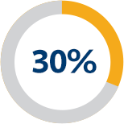
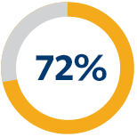

Earn Your Master’s in Data Science Online

## Earn Your Master’s in Data Science Online

The UC Berkeley School of Information’s (I School) Master of Information and Data Science (MIDS) online program prepares data science professionals to be leaders in the field. By blending a multidisciplinary curriculum, experienced faculty, an accomplished network of peers, and the flexibility of online learning, the WASC-accredited datascience@berkeley program brings UC Berkeley to you, wherever you are.

## Complete a Rigorous, Skills-Driven Curriculum

The multidisciplinary MIDS curriculum draws upon social sciences, computer science, statistics, management, and law. Students use the latest tools and analytical methods to work with data at scale, derive insights from complex and unstructured data, and solve real-world problems.

The 27-unit, online program is designed for the working professional’s schedule and can be completed on one of three paths: full time, accelerated, or part time.

[Learn More About the Curriculum](https://datascience.berkeley.edu/academics/)

## The core curriculum focuses on the following key skills:

Research Design
Data Cleansing
Data Engineering
Data Mining and Exploring
Data Visualization
Information Ethics and Privacy
Statistical Analysis
Machine Learning

## Featured Courses

### Applied Machine Learning

Students will learn how to apply crucial machine learning techniques to solve problems, run evaluations and interpret results, and understand scaling up from thousands of data points to billions.

### Natural Language Processing with Deep Learning

This course is a broad introduction to linguistic phenomena and our attempts to analyze them with machine learning. We cover a wide range of concepts with a focus on practical applications such as information extraction, machine translation, sentiment analysis, and summarization.

## Reach Your Career Goals

Graduates of the MIDS program learn the necessary skills to become leaders in the data science field. Upon completing the program, you will be able to analyze problems and ask results-driven questions, apply the latest statistical and computational methods, and use advanced machine learning techniques. Graduates of our online data science program stand out for their ability to effectively communicate findings while understanding the ethical and legal requirements of the complicated data privacy and security landscape.

MIDS graduates are working around the world to solve social, economic, and health problems and applying their skills at top companies such as Airbnb, Amazon, BCG, and Fitbit.

## Graduates excel in roles such as:

Business Data Analyst
Data Analyst
Data Architect
Systems Engineer
Data Scientist
Solutions Architect

“I rely heavily on the knowledge and confidence that I gained from the MIDS curriculum as I approach open-ended data science problems. My professors at UC Berkeley provided me with a strong basis in structured problem solving and critical thinking as a data scientist.” ”

**– Erin Boehmer, data scientist at Fenix International**

### In a survey of recent MIDS graduates:

30 percent of recent graduates reported receiving a promotion.

58 percent of recent graduates reported getting a new job.

72 percent of recent graduates reported receiving a salary increase.

## Experience UC Berkeley, No Matter Where You Are

MIDS students attend classes and complete coursework online, so the program can be completed from anywhere in the world. Located in the San Francisco Bay Area, the UC Berkeley School of Information (I School) is at the forefront of data science innovation, and datascience@berkeley students gain connections to our vibrant network.

The online learning experience blends live, online classes taught by I School faculty, with asynchronous coursework to spark class discussion. Students also participate in an immersion on the UC Berkeley campus where they meet their classmates and instructors in person. As a UC Berkeley I School student, you will receive personalized support from the beginning of the admissions process until after you graduate. Career resources are available for personalized coaching, job searching tools, and industry connections.

[Learn About the Online Experience](https://datascience.berkeley.edu/experience/)

## Join an Ambitious Student Community

The MIDS program attracts intelligent, creative data professionals who work for top companies in computer software, finance, and health care. As a datascience@berkeley student, you will learn alongside these professionals, who are balancing their coursework with demanding careers and personal commitments.

“People in the program come from very diverse fields, and they bring a lot of knowledge and experience that is just as valuable as the program curriculum itself.”

**– Sharon Lin, senior analyst of big data and analytics at Okta**

## Immersions

As a Master of Information and Data Science (MIDS) student, [the immersion](https://datascience.berkeley.edu/academics/immersion/) is your opportunity to meet faculty and peers in person on the UC Berkeley campus. You will have the opportunity to gain on-the-ground perspectives from instructors and industry leaders, meet with data science professionals, and soak up more of the School of Information (I School) culture. Offered twice a year, each three- to four-day immersion is crafted to deliver additional learning, networking, and community-building opportunities.

#### Application Deadlines

There are three program start dates throughout the year, and applications are reviewed on a rolling basis. The next final application deadline is June 6.

[**Review Application Deadlines**](https://datascience.berkeley.edu/admissions/)

#### Application Requirements

Applications to the MIDS program are evaluated holistically. Find out what you’ll need to apply by reading our admissions requirements.

[**See Admissions Requirements**](https://datascience.berkeley.edu/admissions/admissions-requirements/)

#### Upcoming Events

Learn more about the program and meet MIDS faculty and students during online or in-person events.

[**Attend an Upcoming Event**](https://datascience.berkeley.edu/admissions/events/)

## Get Started Today

Advance your data science career with UC Berkeley's online Master of Information and Data Science.