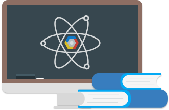
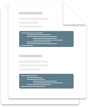
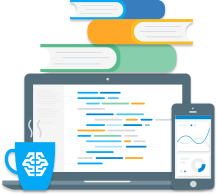

Education Grants - Free Credits for University Computer Science Classes  |  Google Cloud Platform

# Google Cloud Platform Education Grants

## Free Google Cloud Platform credits for computer science courses in higher education

 [Apply Now](https://lp.google-mkto.com/CloudEduGrants_Faculty.html)

### Prepare Your Students for Cloud Computing

Give students the ability to learn on the leading cloud platform. On Google Cloud Platform, students will find all the tools necessary to build a wide range of applications and have access to the same infrastructure, data analytics, and machine learning that Google uses.

 

## Free Cloud Credits

University faculty can apply for Google Cloud Platform Education Grants for their computer science courses. Approved applicants will receive a grant for free credits which their teaching staff and students can use on any [Google Cloud Platform product](https://cloud.google.com/products/).

 

## Documentation for Students and Teachers

Along with credits, this program hosts a group of faculty using the program and will provide a curated set of resources designed to help students and faculty use Google Cloud Platform products effectively in computer science curricula.

 

## Tools for Any Course

With Education Grants, faculty, teaching staff and students will receive free credits that they can use on any Google Cloud Platform product. Faculty, teaching staff and students in mobile development courses can start coding their apps immediately on [Google App Engine](https://cloud.google.com/appengine/) and scale without the headache of managing servers. [Vision API](https://cloud.google.com/vision/) and [Translation API](https://cloud.google.com/translate/) provide straightforward examples for machine learning lessons while [BigQuery](https://cloud.google.com/bigquery/) allows students to explore the challenges of working with large data sets. Google Cloud Platform can be used in courses covering Networking, Cyber Security, System Administration, and more.

 

### Eligibility

Faculty can apply for Education Grants for computer science courses meeting the [following criteria](https://lp.google-mkto.com/CloudEduGrants.html):

**US:** Universities that are regionally accredited.

 **International:** Higher learning institutions and universities that can award degrees [in these countries.](https://lp.google-mkto.com/CloudEduGrants.html)

If you are not a faculty member, or you are a faculty member in a country not listed above, you can still [express interest.](https://lp.google-mkto.com/CloudEduGrants_Interest.html) Opt in for communications from us and we'll send you information about other credit programs and news from Google Cloud Platform.

Please note that grants are made at Google's discretion. Google reserves the right to not grant credits and change the criteria for granting credits at any time.

.

### Get a Google Cloud Platform Education Grant for computer science courses:

 [Apply Now](https://lp.google-mkto.com/CloudEduGrants_Faculty.html)
 .

.
.

### Additional Resources

 [ ### Google for Education    View Google’s Education site](https://www.google.com/edu/products/cloud-platform?utm_source=gcpweb&utm_medium=web&utm_campaign=2016-edu-gcp-na-grants-webform-other-crossreg-cs_webleads&utm_content=)

 [ ### Start a Free Trial    Try Google Cloud Platform for free](https://cloud.google.com/free-trial/)

 [ ### Interactive Tutorial    Explore and use our services](https://interactive-tutorial.appspot.com/)

 .
 .