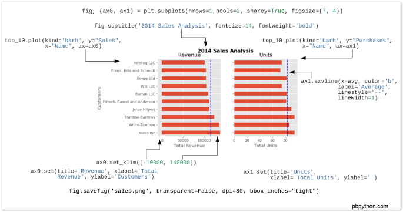
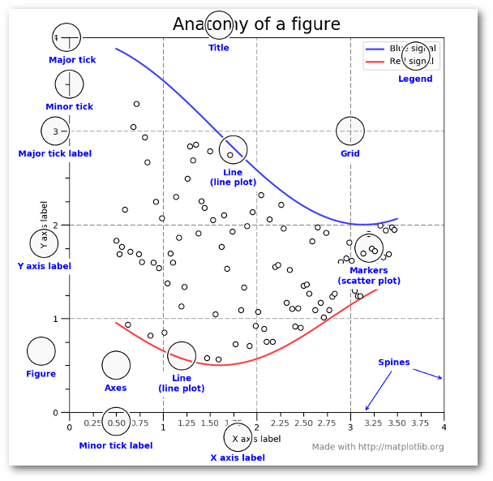
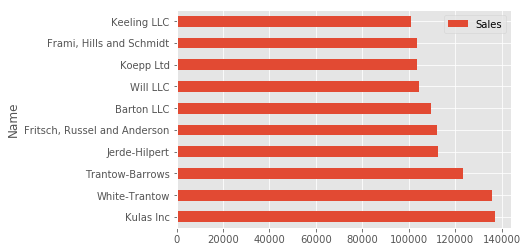
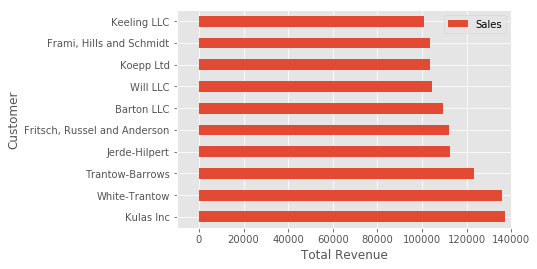
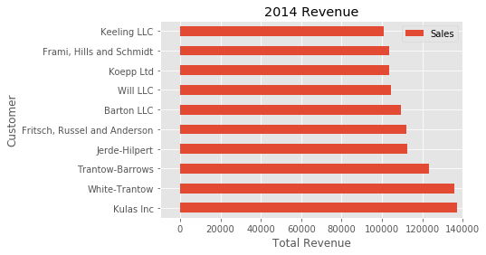
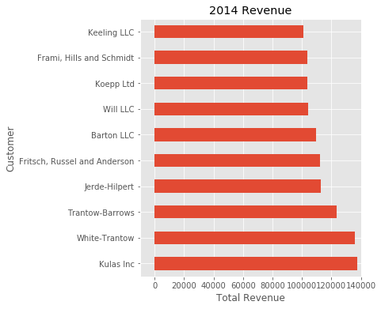
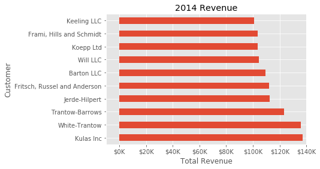
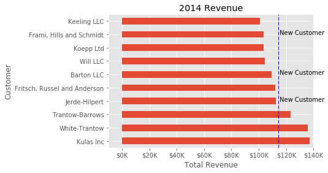
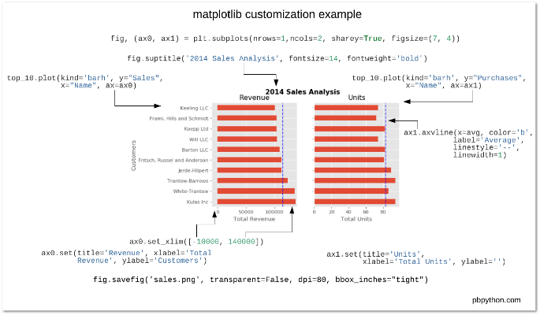

Effectively Using Matplotlib - Practical Business Python

 [*  *](http://pbpython.com/)

# [Practical Business Python](http://pbpython.com/)

Taking care of business, one python script at a time

Tue 25 April 2017

#   [Effectively Using Matplotlib](http://pbpython.com/effective-matplotlib.html)

Posted by [Chris Moffitt](http://pbpython.com/author/chris-moffitt.html) in [articles](http://pbpython.com/category/articles.html)

 

## Introduction

The python visualization world can be a frustrating place for a new user. There are many different options and choosing the right one is a challenge. For example, even after 2 years, this [article](http://pbpython.com/visualization-tools-1.html) is one of the top posts that lead people to this site. In that article, I threw some shade at matplotlib and dismissed it during the analysis. However, after using tools such as pandas, scikit-learn, seaborn and the rest of the data science stack in python - I think I was a little premature in dismissing matplotlib. To be honest, I did not quite understand it and how to use it effectively in my workflow.

Now that I have taken the time to learn some of these tools and how to use them with matplotlib, I have started to see matplotlib as an indispensable tool. This post will show how I use matplotlib and provide some recommendations for users getting started or users who have not taken the time to learn matplotlib. I do firmly believe matplotlib is an essential part of the python data science stack and hope this article will help people understand how to use it for their own visualizations.

## Why all the negativity towards matplotlib?

In my opinion, there are a couple of reasons why matplotlib is challenging for the new user to learn.

First, matplotlib has two interfaces. The first is based on MATLAB and uses a state-based interface. The second option is an an object-oriented interface. The why’s of this dual approach are outside the scope of this post but *knowing* that there are two approaches is vitally important when plotting with matplotlib.

The reason two interfaces cause confusion is that in the world of stack overflow and tons of information available via google searches, new users will stumble across multiple solutions to problems that look somewhat similar but are not the same. I can speak from experience. Looking back on some of my old code, I can tell that there is a mishmash of matplotlib code - which is confusing to me (even if I wrote it).

Key Point
 New matplotlib users should learn and use the object oriented interface.

Another historic challenge with matplotlib is that some of the default style choices were rather unattractive. In a world where R could generate some really cool plots with ggplot, the matplotlib options tended to look a bit ugly in comparison. The good news is that matplotlib 2.0 has much nicer styling capabilities and ability to theme your visualizations with minimal effort.

The third challenge I see with matplotlib is that there is confusion as to when you should use pure matplotlib to plot something vs. a tool like pandas or seaborn that is built on top of matplotlib. Anytime there can be more than one way to do something, it is challenging for the new or infrequent user to follow the right path. Couple this confusion with the two different API’s and it is a recipe for frustration.

## Why stick with matplotlib?

Despite some of these issues, I have come to appreciate matplotlib because it is extremely powerful. The library allows you to create almost any visualization you could imagine. Additionally, there is a rich ecosystem of python tools built around it and many of the more advanced visualization tools use matplotlib as the base library. If you do any work in the python data science stack, you will need to develop some basic familiarity with how to use matplotlib. That is the focus of the rest of this post - developing a basic approach for effectively using matplotlib.

## Basic Premises

If you take nothing else away from this post, I recommend the following steps for learning how to use matplotlib:

1. Learn the basic matplotlib terminology, specifically what is a

	Figure and an
	Axes.

2. Always use the object-oriented interface. Get in the habit of using it from the start of your analysis.

3. Start your visualizations with basic pandas plotting.
4. Use seaborn for the more complex statistical visualizations.
5. Use matplotlib to customize the pandas or seaborn visualization.

This graphic from the [matplotlib faq](https://matplotlib.org/faq/usage_faq.html) is gold. Keep it handy to understand the different terminology of a plot.

Most of the terms are straightforward but the main thing to remember is that the

	Figureis the final image that may contain 1 or more axes. The
	Axes represent an individual plot. Once you understand what these are and how to access them through the object oriented API, the rest of the process starts to fall into place.

The other benefit of this knowledge is that you have a starting point when you see things on the web. If you take the time to understand this point, the rest of the matplotlib API will start to make sense. Also, many of the advanced python packages like seaborn and ggplot rely on matplotlib so understanding the basics will make those more powerful frameworks much easier to learn.

Finally, I am not saying that you should avoid the other good options like ggplot (aka ggpy), bokeh, plotly or altair. I just think you’ll need a basic understanding of matplotlib + pandas + seaborn to start. Once you understand the basic visualization stack, you can explore the other options and make informed choices based on your needs.

## Getting Started

The rest of this post will be a primer on how to do the basic visualization creation in pandas and customize the most common items using matplotlib. Once you understand the basic process, further customizations are relatively straightforward.

I have focused on the most common plotting tasks I encounter such as labeling axes, adjusting limits, updating plot titles, saving figures and adjusting legends. If you would like to follow along, the [notebook](https://github.com/chris1610/pbpython/tree/master/notebooks/Effectively-Using-Matplotlib.ipynb) includes additional detail that should be helpful.

To get started, I am going to setup my imports and read in some data:

import  pandas  as  pdimport  matplotlib.pyplot  as  pltfrom  matplotlib.ticker  import  FuncFormatterdf  =  pd.read_excel("https://github.com/chris1610/pbpython/blob/master/data/sample-salesv3.xlsx?raw=true")df.head()

|     | account number | name | sku | quantity | unit price | ext price | date |
| --- | --- | --- | --- | --- | --- | --- | --- |
| 0   | 740150 | Barton LLC | B1-20000 | 39  | 86.69 | 3380.91 | 2014-01-01 07:21:51 |
| 1   | 714466 | Trantow-Barrows | S2-77896 | -1  | 63.16 | -63.16 | 2014-01-01 10:00:47 |
| 2   | 218895 | Kulas Inc | B1-69924 | 23  | 90.70 | 2086.10 | 2014-01-01 13:24:58 |
| 3   | 307599 | Kassulke, Ondricka and Metz | S1-65481 | 41  | 21.05 | 863.05 | 2014-01-01 15:05:22 |
| 4   | 412290 | Jerde-Hilpert | S2-34077 | 6   | 83.21 | 499.26 | 2014-01-01 23:26:55 |

The data consists of sales transactions for 2014. In order to make this post a little shorter, I’m going to summarize the data so we can see the total number of purchases and total sales for the top 10 customers. I am also going to rename columns for clarity during plots.

top_10  =  (df.groupby('name')['ext price',  'quantity'].agg({'ext price':  'sum',  'quantity':  'count'})  .sort_values(by='ext price',  ascending=False))[:10].reset_index()top_10.rename(columns={'name':  'Name',  'ext price':  'Sales',  'quantity':  'Purchases'},  inplace=True)

Here is what the data looks like.

|     | Name | Purchases | Sales |
| --- | --- | --- | --- |
| 0   | Kulas Inc | 94  | 137351.96 |
| 1   | White-Trantow | 86  | 135841.99 |
| 2   | Trantow-Barrows | 94  | 123381.38 |
| 3   | Jerde-Hilpert | 89  | 112591.43 |
| 4   | Fritsch, Russel and Anderson | 81  | 112214.71 |
| 5   | Barton LLC | 82  | 109438.50 |
| 6   | Will LLC | 74  | 104437.60 |
| 7   | Koepp Ltd | 82  | 103660.54 |
| 8   | Frami, Hills and Schmidt | 72  | 103569.59 |
| 9   | Keeling LLC | 74  | 100934.30 |

Now that the data is formatted in a simple table, let’s talk about plotting these results as a bar chart.

As I mentioned earlier, matplotlib has many different styles available for rendering plots. You can see which ones are available on your system using

	plt.style.available.

plt.style.available
['seaborn-dark',
'seaborn-dark-palette',
'fivethirtyeight',
'seaborn-whitegrid',
'seaborn-darkgrid',
'seaborn',
'bmh',
'classic',
'seaborn-colorblind',
'seaborn-muted',
'seaborn-white',
'seaborn-talk',
'grayscale',
'dark_background',
'seaborn-deep',
'seaborn-bright',
'ggplot',
'seaborn-paper',
'seaborn-notebook',
'seaborn-poster',
'seaborn-ticks',
'seaborn-pastel']
Using a style is as simple as:
plt.style.use('ggplot')

I encourage you to play around with different styles and see which ones you like.

Now that we have a nicer style in place, the first step is to plot the data using the standard pandas plotting function:

top_10.plot(kind='barh',  y="Sales",  x="Name")

The reason I recommend using pandas plotting first is that it is a quick and easy way to prototype your visualization. Since most people are probably already doing some level of data manipulation/analysis in pandas as a first step, go ahead and use the basic plots to get started.

## Customizing the Plot

Assuming you are comfortable with the gist of this plot, the next step is to customize it. Some of the customizations (like adding titles and labels) are very simple to use with the pandas

	plot function. However, you will probably find yourself needing to move outside of that functionality at some point. That’s why I recommend getting in the habit of doing this:

fig,  ax  =  plt.subplots()top_10.plot(kind='barh',  y="Sales",  x="Name",  ax=ax)

The resulting plot looks exactly the same as the original but we added an additional call to

	plt.subplots() and passed the
	ax to the plotting function. Why should you do this? Remember when I said it is critical to get access to the axes and figures in matplotlib? That’s what we have accomplished here. Any future customization will be done via the
	ax or
	fig objects.

We have the benefit of a quick plot from pandas but access to all the power from matplotlib now. An example should show what we can do now. Also, by using this naming convention, it is fairly straightforward to adapt others’ solutions to your unique needs.

Suppose we want to tweak the x limits and change some axis labels? Now that we have the axes in the

	ax variable, we have a lot of control:

fig,  ax  =  plt.subplots()top_10.plot(kind='barh',  y="Sales",  x="Name",  ax=ax)ax.set_xlim([-10000,  140000])ax.set_xlabel('Total Revenue')ax.set_ylabel('Customer');

Here’s another shortcut we can use to change the title and both labels:

fig,  ax  =  plt.subplots()top_10.plot(kind='barh',  y="Sales",  x="Name",  ax=ax)ax.set_xlim([-10000,  140000])ax.set(title='2014 Revenue',  xlabel='Total Revenue',  ylabel='Customer')

To further demonstrate this approach, we can also adjust the size of this image. By using the

	plt.subplots() function, we can define the
	figsize in inches. We can also remove the legend using
	ax.legend().set_visible(False)

fig,  ax  =  plt.subplots(figsize=(5,  6))top_10.plot(kind='barh',  y="Sales",  x="Name",  ax=ax)ax.set_xlim([-10000,  140000])ax.set(title='2014 Revenue',  xlabel='Total Revenue')ax.legend().set_visible(False)

There are plenty of things you probably want to do to clean up this plot. One of the biggest eye sores is the formatting of the Total Revenue numbers. Matplotlib can help us with this through the use of the

	FuncFormatter. This versatile function can apply a user defined function to a value and return a nicely formatted string to place on the axis.

Here is a currency formatting function to gracefully handle US dollars in the several hundred thousand dollar range:

def  currency(x,  pos):  'The two args are the value and tick position'  if  x  >=  1000000:  return  '${:1.1f}M'.format(x*1e-6)  return  '${:1.0f}K'.format(x*1e-3)

Now that we have a formatter function, we need to define it and apply it to the x axis. Here is the full code:

fig,  ax  =  plt.subplots()top_10.plot(kind='barh',  y="Sales",  x="Name",  ax=ax)ax.set_xlim([-10000,  140000])ax.set(title='2014 Revenue',  xlabel='Total Revenue',  ylabel='Customer')formatter  =  FuncFormatter(currency)ax.xaxis.set_major_formatter(formatter)ax.legend().set_visible(False)

That’s much nicer and shows a good example of the flexibility to define your own solution to the problem.

The final customization feature I will go through is the ability to add annotations to the plot. In order to draw a vertical line, you can use

	ax.axvline()and to add custom text, you can use
	ax.text().

For this example, we’ll draw a line showing an average and include labels showing three new customers. Here is the full code with comments to pull it all together.

*# Create the figure and the axes*fig,  ax  =  plt.subplots()*# Plot the data and get the averaged*top_10.plot(kind='barh',  y="Sales",  x="Name",  ax=ax)avg  =  top_10['Sales'].mean()*# Set limits and labels*ax.set_xlim([-10000,  140000])ax.set(title='2014 Revenue',  xlabel='Total Revenue',  ylabel='Customer')*# Add a line for the average*ax.axvline(x=avg,  color='b',  label='Average',  linestyle='--',  linewidth=1)*# Annotate the new customers*for  cust  in  [3,  5,  8]:  ax.text(115000,  cust,  "New Customer")*# Format the currency*formatter  =  FuncFormatter(currency)ax.xaxis.set_major_formatter(formatter)*# Hide the legend*ax.legend().set_visible(False)

While this may not be the most exciting plot it does show how much power you have when following this approach.

## Figures and Plots

Up until now, all the changes we have made have been with the indivudual plot. Fortunately, we also have the ability to add multiple plots on a figure as well as save the entire figure using various options.

If we decided that we wanted to put two plots on the same figure, we should have a basic understanding of how to do it. First, create the figure, then the axes, then plot it all together. We can accomplish this using

	plt.subplots():

fig,  (ax0,  ax1)  =  plt.subplots(nrows=1,  ncols=2,  sharey=True,  figsize=(7,  4))

In this example, I’m using

	nrows and
	ncols to specify the size because this is very clear to the new user. In sample code you will frequently just see variables like 1,2. I think using the named parameters is a little easier to interpret later on when you’re looking at your code.

I am also using

	sharey=True so that the yaxis will share the same labels.

This example is also kind of nifty because the various axes get unpacked to

	ax0and
	ax1. Now that we have these axes, you can plot them like the examples above but put one plot on
	ax0 and the other on
	ax1.

*# Get the figure and the axes*fig,  (ax0,  ax1)  =  plt.subplots(nrows=1,ncols=2,  sharey=True,  figsize=(7,  4))top_10.plot(kind='barh',  y="Sales",  x="Name",  ax=ax0)ax0.set_xlim([-10000,  140000])ax0.set(title='Revenue',  xlabel='Total Revenue',  ylabel='Customers')*# Plot the average as a vertical line*avg  =  top_10['Sales'].mean()ax0.axvline(x=avg,  color='b',  label='Average',  linestyle='--',  linewidth=1)*# Repeat for the unit plot*top_10.plot(kind='barh',  y="Purchases",  x="Name",  ax=ax1)avg  =  top_10['Purchases'].mean()ax1.set(title='Units',  xlabel='Total Units',  ylabel='')ax1.axvline(x=avg,  color='b',  label='Average',  linestyle='--',  linewidth=1)*# Title the figure*fig.suptitle('2014 Sales Analysis',  fontsize=14,  fontweight='bold');*# Hide the legends*ax1.legend().set_visible(False)ax0.legend().set_visible(False)

Up until now, I have been relying on the jupyter notebook to display the figures by virtue of the

	%matplotlib inline directive. However, there are going to be plenty of times where you have the need to save a figure in a specific format and integrate it with some other presentation.

Matplotlib supports many different formats for saving files. You can use

	fig.canvas.get_supported_filetypes() to see what your system supports:

fig.canvas.get_supported_filetypes()
{'eps': 'Encapsulated Postscript',
'jpeg': 'Joint Photographic Experts Group',
'jpg': 'Joint Photographic Experts Group',
'pdf': 'Portable Document Format',
'pgf': 'PGF code for LaTeX',
'png': 'Portable Network Graphics',
'ps': 'Postscript',
'raw': 'Raw RGBA bitmap',
'rgba': 'Raw RGBA bitmap',
'svg': 'Scalable Vector Graphics',
'svgz': 'Scalable Vector Graphics',
'tif': 'Tagged Image File Format',
'tiff': 'Tagged Image File Format'}
Since we have the

	fig object, we can save the figure using multiple options:

fig.savefig('sales.png',  transparent=False,  dpi=80,  bbox_inches="tight")

This version saves the plot as a png with opaque background. I have also specified the dpi and

	bbox_inches="tight" in order to minimize excess white space.

## Conclusion

Hopefully this process has helped you understand how to more effectively use matplotlib in your daily data analysis. If you get in the habit of using this approach when doing your analysis, you should be able to quickly find out how to do whatever you need to do to customize your plot.

As a final bonus, I am including a quick guide to unify all the concepts. I hope this helps bring this post together and proves a handy reference for future use.

- [← Understanding the Transform Function in Pandas](http://pbpython.com/pandas_transform.html)

- [How Accurately Can Prophet Project Website Traffic? →](http://pbpython.com/prophet-accuracy.html)

Tags[**pandas](http://pbpython.com/tag/pandas.html) [**matplotlib](http://pbpython.com/tag/matplotlib.html)

* * *

[**Tweet](https://twitter.com/intent/tweet?original_referer=http%3A%2F%2Fpbpython.com%2Feffective-matplotlib.html&ref_src=twsrc%5Etfw&text=Effectively%20Using%C2%A0Matplotlib%20-%20Practical%20Business%20Python&tw_p=tweetbutton&url=http%3A%2F%2Fpbpython.com%2Feffective-matplotlib.html&via=chris1610)

|     |     |
| --- | --- |
| Share | 20  |

368
 [Vote](https://news.ycombinator.com/item?id=14668706)

    [inShare.](#)280

[reddit](http://www.reddit.com/r/MachineLearning/comments/6l002p/n_effectively_using_matplotlib/)

[Upvote](http://www.reddit.com/r/MachineLearning/comments/6l002p/n_effectively_using_matplotlib/)[Downvote](http://www.reddit.com/r/MachineLearning/comments/6l002p/n_effectively_using_matplotlib/)[1 point](http://www.reddit.com/r/MachineLearning/comments/6l002p/n_effectively_using_matplotlib/)

## Comments

- [44 comments]()
- [**pbpython.com**](https://disqus.com/home/forums/pbizpython/)
- [Login](https://disqus.com/embed/comments/?base=default&f=pbizpython&t_u=http%3A%2F%2Fpbpython.com%2Feffective-matplotlib.html&t_d=Effectively%20Using%C2%A0Matplotlib%20-%20Practical%20Business%20Python&t_t=Effectively%20Using%C2%A0Matplotlib%20-%20Practical%20Business%20Python&s_o=default#)
- [1](https://disqus.com/home/inbox/)
- [ Recommend  9](https://disqus.com/embed/comments/?base=default&f=pbizpython&t_u=http%3A%2F%2Fpbpython.com%2Feffective-matplotlib.html&t_d=Effectively%20Using%C2%A0Matplotlib%20-%20Practical%20Business%20Python&t_t=Effectively%20Using%C2%A0Matplotlib%20-%20Practical%20Business%20Python&s_o=default#)
- [⤤  Share](https://disqus.com/embed/comments/?base=default&f=pbizpython&t_u=http%3A%2F%2Fpbpython.com%2Feffective-matplotlib.html&t_d=Effectively%20Using%C2%A0Matplotlib%20-%20Practical%20Business%20Python&t_t=Effectively%20Using%C2%A0Matplotlib%20-%20Practical%20Business%20Python&s_o=default#)
- [Sort by Best](https://disqus.com/embed/comments/?base=default&f=pbizpython&t_u=http%3A%2F%2Fpbpython.com%2Feffective-matplotlib.html&t_d=Effectively%20Using%C2%A0Matplotlib%20-%20Practical%20Business%20Python&t_t=Effectively%20Using%C2%A0Matplotlib%20-%20Practical%20Business%20Python&s_o=default#)

Join the discussion…

- [Attach](https://disqus.com/embed/comments/?base=default&f=pbizpython&t_u=http%3A%2F%2Fpbpython.com%2Feffective-matplotlib.html&t_d=Effectively%20Using%C2%A0Matplotlib%20-%20Practical%20Business%20Python&t_t=Effectively%20Using%C2%A0Matplotlib%20-%20Practical%20Business%20Python&s_o=default#)

###### Log in with

-
-
-
-

######  or sign up with Disqus

?

### Disqus is a discussion network

- Disqus never moderates or censors. The rules on this community are its own.
- Don't be a jerk or do anything illegal. Everything is easier that way.

[Read full terms and conditions](https://docs.disqus.com/kb/terms-and-policies/)

-

    - [−](https://disqus.com/embed/comments/?base=default&f=pbizpython&t_u=http%3A%2F%2Fpbpython.com%2Feffective-matplotlib.html&t_d=Effectively%20Using%C2%A0Matplotlib%20-%20Practical%20Business%20Python&t_t=Effectively%20Using%C2%A0Matplotlib%20-%20Practical%20Business%20Python&s_o=default#)
    - [*⚑*](https://disqus.com/embed/comments/?base=default&f=pbizpython&t_u=http%3A%2F%2Fpbpython.com%2Feffective-matplotlib.html&t_d=Effectively%20Using%C2%A0Matplotlib%20-%20Practical%20Business%20Python&t_t=Effectively%20Using%C2%A0Matplotlib%20-%20Practical%20Business%20Python&s_o=default#)

 [Denis Akhiyarov](https://disqus.com/by/denisakhiyarov/)    •  [3 months ago](http://pbpython.com/effective-matplotlib.html#comment-3274594371)

I think the main concern people have with matplotlib is it's limited interactivity in notebooks when compared to bokeh, plotly and bqplot. This recently started to be addressed with `%matplotlib notebook` magic. Next level would be integration with ipywidgets.

    -

        - [−](https://disqus.com/embed/comments/?base=default&f=pbizpython&t_u=http%3A%2F%2Fpbpython.com%2Feffective-matplotlib.html&t_d=Effectively%20Using%C2%A0Matplotlib%20-%20Practical%20Business%20Python&t_t=Effectively%20Using%C2%A0Matplotlib%20-%20Practical%20Business%20Python&s_o=default#)
        - [*⚑*](https://disqus.com/embed/comments/?base=default&f=pbizpython&t_u=http%3A%2F%2Fpbpython.com%2Feffective-matplotlib.html&t_d=Effectively%20Using%C2%A0Matplotlib%20-%20Practical%20Business%20Python&t_t=Effectively%20Using%C2%A0Matplotlib%20-%20Practical%20Business%20Python&s_o=default#)

 [Neal McBurnett](https://disqus.com/by/nealmcburnett/)    [*>* Denis Akhiyarov](http://pbpython.com/effective-matplotlib.html#comment-3274594371)  •  [2 months ago](http://pbpython.com/effective-matplotlib.html#comment-3280617961)

Exactly! Especially ways to select or hover over data points and learn about them via popups, which I don't see in ipywidgets offhand

        -

            - [−](https://disqus.com/embed/comments/?base=default&f=pbizpython&t_u=http%3A%2F%2Fpbpython.com%2Feffective-matplotlib.html&t_d=Effectively%20Using%C2%A0Matplotlib%20-%20Practical%20Business%20Python&t_t=Effectively%20Using%C2%A0Matplotlib%20-%20Practical%20Business%20Python&s_o=default#)
            - [*⚑*](https://disqus.com/embed/comments/?base=default&f=pbizpython&t_u=http%3A%2F%2Fpbpython.com%2Feffective-matplotlib.html&t_d=Effectively%20Using%C2%A0Matplotlib%20-%20Practical%20Business%20Python&t_t=Effectively%20Using%C2%A0Matplotlib%20-%20Practical%20Business%20Python&s_o=default#)

 [Denis Akhiyarov](https://disqus.com/by/denisakhiyarov/)    [*>* Neal McBurnett](http://pbpython.com/effective-matplotlib.html#comment-3280617961)  •  [2 months ago](http://pbpython.com/effective-matplotlib.html#comment-3282787280)

`%matplotlib notebook` magic already provides tooltip in right lower corner with info on data points when hovering over them. This is very limited, but still addresses the main use case (x & y coordinates).

    -

        - [−](https://disqus.com/embed/comments/?base=default&f=pbizpython&t_u=http%3A%2F%2Fpbpython.com%2Feffective-matplotlib.html&t_d=Effectively%20Using%C2%A0Matplotlib%20-%20Practical%20Business%20Python&t_t=Effectively%20Using%C2%A0Matplotlib%20-%20Practical%20Business%20Python&s_o=default#)
        - [*⚑*](https://disqus.com/embed/comments/?base=default&f=pbizpython&t_u=http%3A%2F%2Fpbpython.com%2Feffective-matplotlib.html&t_d=Effectively%20Using%C2%A0Matplotlib%20-%20Practical%20Business%20Python&t_t=Effectively%20Using%C2%A0Matplotlib%20-%20Practical%20Business%20Python&s_o=default#)

 [Georgy Ayzel](https://disqus.com/by/ayzelgv/)    [*>* Denis Akhiyarov](http://pbpython.com/effective-matplotlib.html#comment-3274594371)  •  [3 months ago](http://pbpython.com/effective-matplotlib.html#comment-3278385186)

One of the core possibility to play with mpl figure is to use %matplotlib notebook notation instead of standard %matplotlib inline

        -

            - [−](https://disqus.com/embed/comments/?base=default&f=pbizpython&t_u=http%3A%2F%2Fpbpython.com%2Feffective-matplotlib.html&t_d=Effectively%20Using%C2%A0Matplotlib%20-%20Practical%20Business%20Python&t_t=Effectively%20Using%C2%A0Matplotlib%20-%20Practical%20Business%20Python&s_o=default#)
            - [*⚑*](https://disqus.com/embed/comments/?base=default&f=pbizpython&t_u=http%3A%2F%2Fpbpython.com%2Feffective-matplotlib.html&t_d=Effectively%20Using%C2%A0Matplotlib%20-%20Practical%20Business%20Python&t_t=Effectively%20Using%C2%A0Matplotlib%20-%20Practical%20Business%20Python&s_o=default#)

 [Denis Akhiyarov](https://disqus.com/by/denisakhiyarov/)    [*>* Georgy Ayzel](http://pbpython.com/effective-matplotlib.html#comment-3278385186)  •  [2 months ago](http://pbpython.com/effective-matplotlib.html#comment-3282790867)

exactly, but you can also play with the figure much more in the qt backend, when the matplotlib figure is displayed in a popup window. What I would like to is switch between notebook and qt backends with a click of a button.

    -

        - [−](https://disqus.com/embed/comments/?base=default&f=pbizpython&t_u=http%3A%2F%2Fpbpython.com%2Feffective-matplotlib.html&t_d=Effectively%20Using%C2%A0Matplotlib%20-%20Practical%20Business%20Python&t_t=Effectively%20Using%C2%A0Matplotlib%20-%20Practical%20Business%20Python&s_o=default#)
        - [*⚑*](https://disqus.com/embed/comments/?base=default&f=pbizpython&t_u=http%3A%2F%2Fpbpython.com%2Feffective-matplotlib.html&t_d=Effectively%20Using%C2%A0Matplotlib%20-%20Practical%20Business%20Python&t_t=Effectively%20Using%C2%A0Matplotlib%20-%20Practical%20Business%20Python&s_o=default#)

 [Chris Moffitt](https://disqus.com/by/chris1610/)  Mod  [*>* Denis Akhiyarov](http://pbpython.com/effective-matplotlib.html#comment-3274594371)  •  [3 months ago](http://pbpython.com/effective-matplotlib.html#comment-3275174211)

I agree as well. I have not played with the notebook magic yet but am definitely interested in learning more about that functionality.

        -

            - [−](https://disqus.com/embed/comments/?base=default&f=pbizpython&t_u=http%3A%2F%2Fpbpython.com%2Feffective-matplotlib.html&t_d=Effectively%20Using%C2%A0Matplotlib%20-%20Practical%20Business%20Python&t_t=Effectively%20Using%C2%A0Matplotlib%20-%20Practical%20Business%20Python&s_o=default#)
            - [*⚑*](https://disqus.com/embed/comments/?base=default&f=pbizpython&t_u=http%3A%2F%2Fpbpython.com%2Feffective-matplotlib.html&t_d=Effectively%20Using%C2%A0Matplotlib%20-%20Practical%20Business%20Python&t_t=Effectively%20Using%C2%A0Matplotlib%20-%20Practical%20Business%20Python&s_o=default#)

 [Denis Akhiyarov](https://disqus.com/by/denisakhiyarov/)    [*>* Chris Moffitt](http://pbpython.com/effective-matplotlib.html#comment-3275174211)  •  [2 months ago](http://pbpython.com/effective-matplotlib.html#comment-3282792440)

notebook magic is much nicer than inline, especially if you need to zoom in/out on the plots without re-running the plotting code.

-

    - [−](https://disqus.com/embed/comments/?base=default&f=pbizpython&t_u=http%3A%2F%2Fpbpython.com%2Feffective-matplotlib.html&t_d=Effectively%20Using%C2%A0Matplotlib%20-%20Practical%20Business%20Python&t_t=Effectively%20Using%C2%A0Matplotlib%20-%20Practical%20Business%20Python&s_o=default#)
    - [*⚑*](https://disqus.com/embed/comments/?base=default&f=pbizpython&t_u=http%3A%2F%2Fpbpython.com%2Feffective-matplotlib.html&t_d=Effectively%20Using%C2%A0Matplotlib%20-%20Practical%20Business%20Python&t_t=Effectively%20Using%C2%A0Matplotlib%20-%20Practical%20Business%20Python&s_o=default#)

 [pauloneves](https://disqus.com/by/pauloneves/)    •  [2 months ago](http://pbpython.com/effective-matplotlib.html#comment-3279978277)

Just to say thanks for the nice writeup. I've been doing dirty plots from examples in the web. This post really clarified all the basic concepts for me.

-

    - [−](https://disqus.com/embed/comments/?base=default&f=pbizpython&t_u=http%3A%2F%2Fpbpython.com%2Feffective-matplotlib.html&t_d=Effectively%20Using%C2%A0Matplotlib%20-%20Practical%20Business%20Python&t_t=Effectively%20Using%C2%A0Matplotlib%20-%20Practical%20Business%20Python&s_o=default#)
    - [*⚑*](https://disqus.com/embed/comments/?base=default&f=pbizpython&t_u=http%3A%2F%2Fpbpython.com%2Feffective-matplotlib.html&t_d=Effectively%20Using%C2%A0Matplotlib%20-%20Practical%20Business%20Python&t_t=Effectively%20Using%C2%A0Matplotlib%20-%20Practical%20Business%20Python&s_o=default#)

 [Lincoln Frias](https://disqus.com/by/lincolnfrias/)    •  [3 months ago](http://pbpython.com/effective-matplotlib.html#comment-3278041267)

Awesome, very helpful. Thanks!

-

    - [−](https://disqus.com/embed/comments/?base=default&f=pbizpython&t_u=http%3A%2F%2Fpbpython.com%2Feffective-matplotlib.html&t_d=Effectively%20Using%C2%A0Matplotlib%20-%20Practical%20Business%20Python&t_t=Effectively%20Using%C2%A0Matplotlib%20-%20Practical%20Business%20Python&s_o=default#)
    - [*⚑*](https://disqus.com/embed/comments/?base=default&f=pbizpython&t_u=http%3A%2F%2Fpbpython.com%2Feffective-matplotlib.html&t_d=Effectively%20Using%C2%A0Matplotlib%20-%20Practical%20Business%20Python&t_t=Effectively%20Using%C2%A0Matplotlib%20-%20Practical%20Business%20Python&s_o=default#)

 [Carlos](https://disqus.com/by/disqus_qkF80f5d3x/)    •  [10 days ago](http://pbpython.com/effective-matplotlib.html#comment-3398447747)

How to run de code?
I writed:
import pandas as pd
import matplotlib.pyplot as plt
from matplotlib.ticker import FuncFormatter
df = pd.read_excel("sample-salesv3.xlsx")
df.head()

top_10 = (df.groupby('name')['ext price', 'quantity'].agg({'ext price': 'sum', 'quantity': 'count'})

.sort_values(by='ext price', ascending=False))[:10].reset_index()

top_10.rename(columns={'name': 'Name', 'ext price': 'Sales', 'quantity': 'Purchases'}, inplace=True)

plt.style.use('ggplot')
top_10.plot(kind='barh', y="Sales", x="Name")
But only return :
Process finished with exit code 0

    -

        - [−](https://disqus.com/embed/comments/?base=default&f=pbizpython&t_u=http%3A%2F%2Fpbpython.com%2Feffective-matplotlib.html&t_d=Effectively%20Using%C2%A0Matplotlib%20-%20Practical%20Business%20Python&t_t=Effectively%20Using%C2%A0Matplotlib%20-%20Practical%20Business%20Python&s_o=default#)
        - [*⚑*](https://disqus.com/embed/comments/?base=default&f=pbizpython&t_u=http%3A%2F%2Fpbpython.com%2Feffective-matplotlib.html&t_d=Effectively%20Using%C2%A0Matplotlib%20-%20Practical%20Business%20Python&t_t=Effectively%20Using%C2%A0Matplotlib%20-%20Practical%20Business%20Python&s_o=default#)

 [Chris Moffitt](https://disqus.com/by/chris1610/)  Mod  [*>* Carlos](http://pbpython.com/effective-matplotlib.html#comment-3398447747)  •  [10 days ago](http://pbpython.com/effective-matplotlib.html#comment-3398454101)

You need to run this in a jupyter notebook and include %matplotlib inline or add [plt.show](http://disq.us/url?url=http%3A%2F%2Fplt.show%3ACKLZj5HEpqZp72VVcgxm7nEIVtg&cuid=3227818)() at the end of your script.

-

    - [−](https://disqus.com/embed/comments/?base=default&f=pbizpython&t_u=http%3A%2F%2Fpbpython.com%2Feffective-matplotlib.html&t_d=Effectively%20Using%C2%A0Matplotlib%20-%20Practical%20Business%20Python&t_t=Effectively%20Using%C2%A0Matplotlib%20-%20Practical%20Business%20Python&s_o=default#)
    - [*⚑*](https://disqus.com/embed/comments/?base=default&f=pbizpython&t_u=http%3A%2F%2Fpbpython.com%2Feffective-matplotlib.html&t_d=Effectively%20Using%C2%A0Matplotlib%20-%20Practical%20Business%20Python&t_t=Effectively%20Using%C2%A0Matplotlib%20-%20Practical%20Business%20Python&s_o=default#)

 [JD Angerhofer](https://disqus.com/by/jdangerhofer/)    •  [13 days ago](http://pbpython.com/effective-matplotlib.html#comment-3393391562)

Terrific write-up -- thanks! I've been stumbling along cobbling visualizations together mostly by luck and Google searches thus far, but I now have a better grasp on the inner mechanics.

This article should go on the Matplotlib documentation site under "Getting Started" or similar.

    -

        - [−](https://disqus.com/embed/comments/?base=default&f=pbizpython&t_u=http%3A%2F%2Fpbpython.com%2Feffective-matplotlib.html&t_d=Effectively%20Using%C2%A0Matplotlib%20-%20Practical%20Business%20Python&t_t=Effectively%20Using%C2%A0Matplotlib%20-%20Practical%20Business%20Python&s_o=default#)
        - [*⚑*](https://disqus.com/embed/comments/?base=default&f=pbizpython&t_u=http%3A%2F%2Fpbpython.com%2Feffective-matplotlib.html&t_d=Effectively%20Using%C2%A0Matplotlib%20-%20Practical%20Business%20Python&t_t=Effectively%20Using%C2%A0Matplotlib%20-%20Practical%20Business%20Python&s_o=default#)

 [Chris Moffitt](https://disqus.com/by/chris1610/)  Mod  [*>* JD Angerhofer](http://pbpython.com/effective-matplotlib.html#comment-3393391562)  •  [13 days ago](http://pbpython.com/effective-matplotlib.html#comment-3393397098)

Thanks! Actually, I do believe there is going to be a tutorial in one of the soon to be released versions of matplotlib that is heavily based on this post. I will definitely link to it when it goes live.

        -

            - [−](https://disqus.com/embed/comments/?base=default&f=pbizpython&t_u=http%3A%2F%2Fpbpython.com%2Feffective-matplotlib.html&t_d=Effectively%20Using%C2%A0Matplotlib%20-%20Practical%20Business%20Python&t_t=Effectively%20Using%C2%A0Matplotlib%20-%20Practical%20Business%20Python&s_o=default#)
            - [*⚑*](https://disqus.com/embed/comments/?base=default&f=pbizpython&t_u=http%3A%2F%2Fpbpython.com%2Feffective-matplotlib.html&t_d=Effectively%20Using%C2%A0Matplotlib%20-%20Practical%20Business%20Python&t_t=Effectively%20Using%C2%A0Matplotlib%20-%20Practical%20Business%20Python&s_o=default#)

 [JD Angerhofer](https://disqus.com/by/jdangerhofer/)    [*>* Chris Moffitt](http://pbpython.com/effective-matplotlib.html#comment-3393397098)  •  [13 days ago](http://pbpython.com/effective-matplotlib.html#comment-3393440640)

Good to hear! I have found the documentation to be... erm... somewhat lacking in the past, though this may have changed with the arrival of 2.0. I'll keep my eyes peeled.

-

    - [−](https://disqus.com/embed/comments/?base=default&f=pbizpython&t_u=http%3A%2F%2Fpbpython.com%2Feffective-matplotlib.html&t_d=Effectively%20Using%C2%A0Matplotlib%20-%20Practical%20Business%20Python&t_t=Effectively%20Using%C2%A0Matplotlib%20-%20Practical%20Business%20Python&s_o=default#)
    - [*⚑*](https://disqus.com/embed/comments/?base=default&f=pbizpython&t_u=http%3A%2F%2Fpbpython.com%2Feffective-matplotlib.html&t_d=Effectively%20Using%C2%A0Matplotlib%20-%20Practical%20Business%20Python&t_t=Effectively%20Using%C2%A0Matplotlib%20-%20Practical%20Business%20Python&s_o=default#)

 [Ben Dundee](https://disqus.com/by/bendundee/)    •  [13 days ago](http://pbpython.com/effective-matplotlib.html#comment-3393179091)

This post is gold, and where was that figure 5 years ago when I started playing with matplotlib? You hit the nail on the head -- matplotlib has a rough reputation because the API has a steep learning curve. I've generally exported data frames to excel and played there.

Great post!

-

    - [−](https://disqus.com/embed/comments/?base=default&f=pbizpython&t_u=http%3A%2F%2Fpbpython.com%2Feffective-matplotlib.html&t_d=Effectively%20Using%C2%A0Matplotlib%20-%20Practical%20Business%20Python&t_t=Effectively%20Using%C2%A0Matplotlib%20-%20Practical%20Business%20Python&s_o=default#)
    - [*⚑*](https://disqus.com/embed/comments/?base=default&f=pbizpython&t_u=http%3A%2F%2Fpbpython.com%2Feffective-matplotlib.html&t_d=Effectively%20Using%C2%A0Matplotlib%20-%20Practical%20Business%20Python&t_t=Effectively%20Using%C2%A0Matplotlib%20-%20Practical%20Business%20Python&s_o=default#)

 [Kadir](https://disqus.com/by/disqus_qtWm5k2MA9/)    •  [14 days ago](http://pbpython.com/effective-matplotlib.html#comment-3392830793)

Thank you for the great article!
Your approach the the easiest and cleanest I've seen so far...

I didn't even know that I can further customize plots created by pandas, seaborn etc so easily...

-

    - [−](https://disqus.com/embed/comments/?base=default&f=pbizpython&t_u=http%3A%2F%2Fpbpython.com%2Feffective-matplotlib.html&t_d=Effectively%20Using%C2%A0Matplotlib%20-%20Practical%20Business%20Python&t_t=Effectively%20Using%C2%A0Matplotlib%20-%20Practical%20Business%20Python&s_o=default#)
    - [*⚑*](https://disqus.com/embed/comments/?base=default&f=pbizpython&t_u=http%3A%2F%2Fpbpython.com%2Feffective-matplotlib.html&t_d=Effectively%20Using%C2%A0Matplotlib%20-%20Practical%20Business%20Python&t_t=Effectively%20Using%C2%A0Matplotlib%20-%20Practical%20Business%20Python&s_o=default#)

 [Damien Irving](https://disqus.com/by/DamienIrving/)    •  [15 days ago](http://pbpython.com/effective-matplotlib.html#comment-3390782086)

How would a newcomer know if they are using the state-based or object-oriented interface?

    -

        - [−](https://disqus.com/embed/comments/?base=default&f=pbizpython&t_u=http%3A%2F%2Fpbpython.com%2Feffective-matplotlib.html&t_d=Effectively%20Using%C2%A0Matplotlib%20-%20Practical%20Business%20Python&t_t=Effectively%20Using%C2%A0Matplotlib%20-%20Practical%20Business%20Python&s_o=default#)
        - [*⚑*](https://disqus.com/embed/comments/?base=default&f=pbizpython&t_u=http%3A%2F%2Fpbpython.com%2Feffective-matplotlib.html&t_d=Effectively%20Using%C2%A0Matplotlib%20-%20Practical%20Business%20Python&t_t=Effectively%20Using%C2%A0Matplotlib%20-%20Practical%20Business%20Python&s_o=default#)

 [Chris Moffitt](https://disqus.com/by/chris1610/)  Mod  [*>* Damien Irving](http://pbpython.com/effective-matplotlib.html#comment-3390782086)  •  [15 days ago](http://pbpython.com/effective-matplotlib.html#comment-3390791171)

That is a good question. The stateful interface looks like this:
plt.figure()
plt.subplot()
plt.gcf() # [get current figure]
plt.gca() # [get current axis]

Each command updates the current figure. It is relatively simple but gets hard with complex plots.

The Object Oriented interface calls methods of specific figures and axes. It looks more like

fig, ax = plt.subplots()
ax[0].plot()
ax[1].plot()

The real challenge is that it is difficult (especially for the new user) to differentiate - especially when you're just trying to make a simple plot. My hope with this post was to get people more used to the Object Oriented approach because its a better long term approach and is generally more consistent with other python OO interfaces.

Hope that helps!

-

    - [−](https://disqus.com/embed/comments/?base=default&f=pbizpython&t_u=http%3A%2F%2Fpbpython.com%2Feffective-matplotlib.html&t_d=Effectively%20Using%C2%A0Matplotlib%20-%20Practical%20Business%20Python&t_t=Effectively%20Using%C2%A0Matplotlib%20-%20Practical%20Business%20Python&s_o=default#)
    - [*⚑*](https://disqus.com/embed/comments/?base=default&f=pbizpython&t_u=http%3A%2F%2Fpbpython.com%2Feffective-matplotlib.html&t_d=Effectively%20Using%C2%A0Matplotlib%20-%20Practical%20Business%20Python&t_t=Effectively%20Using%C2%A0Matplotlib%20-%20Practical%20Business%20Python&s_o=default#)

 [David Ross](https://disqus.com/by/disqus_TMHPGvs89r/)    •  [a month ago](http://pbpython.com/effective-matplotlib.html#comment-3338559085)

Simply knowing there are two interfaces to matplotlib explains why I've had a hard time customising plots in the past. This tutorial has really cleared up a lot of issues I have had so thank you! I was wondering if you know where within the matplotlib docs it explains how to customise all of the plot parameters (major tick font size, set ylabel etc.) using only the object orientated interface?

    -

        - [−](https://disqus.com/embed/comments/?base=default&f=pbizpython&t_u=http%3A%2F%2Fpbpython.com%2Feffective-matplotlib.html&t_d=Effectively%20Using%C2%A0Matplotlib%20-%20Practical%20Business%20Python&t_t=Effectively%20Using%C2%A0Matplotlib%20-%20Practical%20Business%20Python&s_o=default#)
        - [*⚑*](https://disqus.com/embed/comments/?base=default&f=pbizpython&t_u=http%3A%2F%2Fpbpython.com%2Feffective-matplotlib.html&t_d=Effectively%20Using%C2%A0Matplotlib%20-%20Practical%20Business%20Python&t_t=Effectively%20Using%C2%A0Matplotlib%20-%20Practical%20Business%20Python&s_o=default#)

 [Tim Hopper](https://disqus.com/by/timhopper/)    [*>* David Ross](http://pbpython.com/effective-matplotlib.html#comment-3338559085)  •  [13 days ago](http://pbpython.com/effective-matplotlib.html#comment-3393274915)

I'm hoping to add that to [pythonplot.com](http://disq.us/url?url=http%3A%2F%2Fpythonplot.com%3AQCIDK2Z-Pr4AcAlGugI3hDL5RxE&cuid=3227818) at some point.

        -

            - [−](https://disqus.com/embed/comments/?base=default&f=pbizpython&t_u=http%3A%2F%2Fpbpython.com%2Feffective-matplotlib.html&t_d=Effectively%20Using%C2%A0Matplotlib%20-%20Practical%20Business%20Python&t_t=Effectively%20Using%C2%A0Matplotlib%20-%20Practical%20Business%20Python&s_o=default#)
            - [*⚑*](https://disqus.com/embed/comments/?base=default&f=pbizpython&t_u=http%3A%2F%2Fpbpython.com%2Feffective-matplotlib.html&t_d=Effectively%20Using%C2%A0Matplotlib%20-%20Practical%20Business%20Python&t_t=Effectively%20Using%C2%A0Matplotlib%20-%20Practical%20Business%20Python&s_o=default#)

 [Chris Moffitt](https://disqus.com/by/chris1610/)  Mod  [*>* Tim Hopper](http://pbpython.com/effective-matplotlib.html#comment-3393274915)  •  [13 days ago](http://pbpython.com/effective-matplotlib.html#comment-3393399238)

Awesome. [pythonplot.com](http://disq.us/url?url=http%3A%2F%2Fpythonplot.com%3AQCIDK2Z-Pr4AcAlGugI3hDL5RxE&cuid=3227818) is a great resource. Really well done examples and super helpful for understanding the plotting landscape!

    -

        - [−](https://disqus.com/embed/comments/?base=default&f=pbizpython&t_u=http%3A%2F%2Fpbpython.com%2Feffective-matplotlib.html&t_d=Effectively%20Using%C2%A0Matplotlib%20-%20Practical%20Business%20Python&t_t=Effectively%20Using%C2%A0Matplotlib%20-%20Practical%20Business%20Python&s_o=default#)
        - [*⚑*](https://disqus.com/embed/comments/?base=default&f=pbizpython&t_u=http%3A%2F%2Fpbpython.com%2Feffective-matplotlib.html&t_d=Effectively%20Using%C2%A0Matplotlib%20-%20Practical%20Business%20Python&t_t=Effectively%20Using%C2%A0Matplotlib%20-%20Practical%20Business%20Python&s_o=default#)

 [Chris Moffitt](https://disqus.com/by/chris1610/)  Mod  [*>* David Ross](http://pbpython.com/effective-matplotlib.html#comment-3338559085)  •  [a month ago](http://pbpython.com/effective-matplotlib.html#comment-3338703302)

To be honest, I find that looking through the gallery and examples on the matplotlib site is the best way to understand how to use it. I have not been able to find one really good simple page with what you're referring to.

        -

            - [−](https://disqus.com/embed/comments/?base=default&f=pbizpython&t_u=http%3A%2F%2Fpbpython.com%2Feffective-matplotlib.html&t_d=Effectively%20Using%C2%A0Matplotlib%20-%20Practical%20Business%20Python&t_t=Effectively%20Using%C2%A0Matplotlib%20-%20Practical%20Business%20Python&s_o=default#)
            - [*⚑*](https://disqus.com/embed/comments/?base=default&f=pbizpython&t_u=http%3A%2F%2Fpbpython.com%2Feffective-matplotlib.html&t_d=Effectively%20Using%C2%A0Matplotlib%20-%20Practical%20Business%20Python&t_t=Effectively%20Using%C2%A0Matplotlib%20-%20Practical%20Business%20Python&s_o=default#)

 [David Ross](https://disqus.com/by/disqus_TMHPGvs89r/)    [*>* Chris Moffitt](http://pbpython.com/effective-matplotlib.html#comment-3338703302)  •  [a month ago](http://pbpython.com/effective-matplotlib.html#comment-3341710635)

Damn that's ashame. Thanks!

-

    - [−](https://disqus.com/embed/comments/?base=default&f=pbizpython&t_u=http%3A%2F%2Fpbpython.com%2Feffective-matplotlib.html&t_d=Effectively%20Using%C2%A0Matplotlib%20-%20Practical%20Business%20Python&t_t=Effectively%20Using%C2%A0Matplotlib%20-%20Practical%20Business%20Python&s_o=default#)
    - [*⚑*](https://disqus.com/embed/comments/?base=default&f=pbizpython&t_u=http%3A%2F%2Fpbpython.com%2Feffective-matplotlib.html&t_d=Effectively%20Using%C2%A0Matplotlib%20-%20Practical%20Business%20Python&t_t=Effectively%20Using%C2%A0Matplotlib%20-%20Practical%20Business%20Python&s_o=default#)

 [uuplusu](https://disqus.com/by/uuplusu/)    •  [a month ago](http://pbpython.com/effective-matplotlib.html#comment-3336345626)

The best guide I have ever seen.

-

    - [−](https://disqus.com/embed/comments/?base=default&f=pbizpython&t_u=http%3A%2F%2Fpbpython.com%2Feffective-matplotlib.html&t_d=Effectively%20Using%C2%A0Matplotlib%20-%20Practical%20Business%20Python&t_t=Effectively%20Using%C2%A0Matplotlib%20-%20Practical%20Business%20Python&s_o=default#)
    - [*⚑*](https://disqus.com/embed/comments/?base=default&f=pbizpython&t_u=http%3A%2F%2Fpbpython.com%2Feffective-matplotlib.html&t_d=Effectively%20Using%C2%A0Matplotlib%20-%20Practical%20Business%20Python&t_t=Effectively%20Using%C2%A0Matplotlib%20-%20Practical%20Business%20Python&s_o=default#)

 [Duk Dos](https://disqus.com/by/dukdos/)    •  [2 months ago](http://pbpython.com/effective-matplotlib.html#comment-3320201656)

Thanks, your article really helps to underestand some basic concepts

-

    - [−](https://disqus.com/embed/comments/?base=default&f=pbizpython&t_u=http%3A%2F%2Fpbpython.com%2Feffective-matplotlib.html&t_d=Effectively%20Using%C2%A0Matplotlib%20-%20Practical%20Business%20Python&t_t=Effectively%20Using%C2%A0Matplotlib%20-%20Practical%20Business%20Python&s_o=default#)
    - [*⚑*](https://disqus.com/embed/comments/?base=default&f=pbizpython&t_u=http%3A%2F%2Fpbpython.com%2Feffective-matplotlib.html&t_d=Effectively%20Using%C2%A0Matplotlib%20-%20Practical%20Business%20Python&t_t=Effectively%20Using%C2%A0Matplotlib%20-%20Practical%20Business%20Python&s_o=default#)

 [Jonathan Nyquist](https://disqus.com/by/jonathannyquist/)    •  [2 months ago](http://pbpython.com/effective-matplotlib.html#comment-3302800750)

Really nice! Minor point: The blue line for the average has a label in the code that does not appear in the plot.

    -

        - [−](https://disqus.com/embed/comments/?base=default&f=pbizpython&t_u=http%3A%2F%2Fpbpython.com%2Feffective-matplotlib.html&t_d=Effectively%20Using%C2%A0Matplotlib%20-%20Practical%20Business%20Python&t_t=Effectively%20Using%C2%A0Matplotlib%20-%20Practical%20Business%20Python&s_o=default#)
        - [*⚑*](https://disqus.com/embed/comments/?base=default&f=pbizpython&t_u=http%3A%2F%2Fpbpython.com%2Feffective-matplotlib.html&t_d=Effectively%20Using%C2%A0Matplotlib%20-%20Practical%20Business%20Python&t_t=Effectively%20Using%C2%A0Matplotlib%20-%20Practical%20Business%20Python&s_o=default#)

 [Chris Moffitt](https://disqus.com/by/chris1610/)  Mod  [*>* Jonathan Nyquist](http://pbpython.com/effective-matplotlib.html#comment-3302800750)  •  [2 months ago](http://pbpython.com/effective-matplotlib.html#comment-3305327995)

Oops. I must have used the wrong image. Thanks for pointing it out.

        -

            - [−](https://disqus.com/embed/comments/?base=default&f=pbizpython&t_u=http%3A%2F%2Fpbpython.com%2Feffective-matplotlib.html&t_d=Effectively%20Using%C2%A0Matplotlib%20-%20Practical%20Business%20Python&t_t=Effectively%20Using%C2%A0Matplotlib%20-%20Practical%20Business%20Python&s_o=default#)
            - [*⚑*](https://disqus.com/embed/comments/?base=default&f=pbizpython&t_u=http%3A%2F%2Fpbpython.com%2Feffective-matplotlib.html&t_d=Effectively%20Using%C2%A0Matplotlib%20-%20Practical%20Business%20Python&t_t=Effectively%20Using%C2%A0Matplotlib%20-%20Practical%20Business%20Python&s_o=default#)

 [Jonathan Nyquist](https://disqus.com/by/jonathannyquist/)    [*>* Chris Moffitt](http://pbpython.com/effective-matplotlib.html#comment-3305327995)  •  [2 months ago](http://pbpython.com/effective-matplotlib.html#comment-3306472240)

Not sure you did. I tried something similar and no label appeared.

            -

                - [−](https://disqus.com/embed/comments/?base=default&f=pbizpython&t_u=http%3A%2F%2Fpbpython.com%2Feffective-matplotlib.html&t_d=Effectively%20Using%C2%A0Matplotlib%20-%20Practical%20Business%20Python&t_t=Effectively%20Using%C2%A0Matplotlib%20-%20Practical%20Business%20Python&s_o=default#)
                - [*⚑*](https://disqus.com/embed/comments/?base=default&f=pbizpython&t_u=http%3A%2F%2Fpbpython.com%2Feffective-matplotlib.html&t_d=Effectively%20Using%C2%A0Matplotlib%20-%20Practical%20Business%20Python&t_t=Effectively%20Using%C2%A0Matplotlib%20-%20Practical%20Business%20Python&s_o=default#)

 [Boris Dieseldorff](https://disqus.com/by/borisdieseldorff/)    [*>* Jonathan Nyquist](http://pbpython.com/effective-matplotlib.html#comment-3306472240)  •  [a month ago](http://pbpython.com/effective-matplotlib.html#comment-3350470037)

The label argument is used if you generate a legend.
Since no legend is visible, there's nothing for it to do.

-

    - [−](https://disqus.com/embed/comments/?base=default&f=pbizpython&t_u=http%3A%2F%2Fpbpython.com%2Feffective-matplotlib.html&t_d=Effectively%20Using%C2%A0Matplotlib%20-%20Practical%20Business%20Python&t_t=Effectively%20Using%C2%A0Matplotlib%20-%20Practical%20Business%20Python&s_o=default#)
    - [*⚑*](https://disqus.com/embed/comments/?base=default&f=pbizpython&t_u=http%3A%2F%2Fpbpython.com%2Feffective-matplotlib.html&t_d=Effectively%20Using%C2%A0Matplotlib%20-%20Practical%20Business%20Python&t_t=Effectively%20Using%C2%A0Matplotlib%20-%20Practical%20Business%20Python&s_o=default#)

 [Brendan @ LearnDataSci](https://disqus.com/by/brendan_learndatasci/)    •  [2 months ago](http://pbpython.com/effective-matplotlib.html#comment-3295334376)

Excellent intro. Matplotlib is just so easy to use with iPython notebooks. Is it your preferred choice for plotting now?

    -

        - [−](https://disqus.com/embed/comments/?base=default&f=pbizpython&t_u=http%3A%2F%2Fpbpython.com%2Feffective-matplotlib.html&t_d=Effectively%20Using%C2%A0Matplotlib%20-%20Practical%20Business%20Python&t_t=Effectively%20Using%C2%A0Matplotlib%20-%20Practical%20Business%20Python&s_o=default#)
        - [*⚑*](https://disqus.com/embed/comments/?base=default&f=pbizpython&t_u=http%3A%2F%2Fpbpython.com%2Feffective-matplotlib.html&t_d=Effectively%20Using%C2%A0Matplotlib%20-%20Practical%20Business%20Python&t_t=Effectively%20Using%C2%A0Matplotlib%20-%20Practical%20Business%20Python&s_o=default#)

 [Chris Moffitt](https://disqus.com/by/chris1610/)  Mod  [*>* Brendan @ LearnDataSci](http://pbpython.com/effective-matplotlib.html#comment-3295334376)  •  [2 months ago](http://pbpython.com/effective-matplotlib.html#comment-3295445816)

I tend to use seaborn for the more complex visualizations and then matplotlib for customization. I definitely use ipython notebooks for my working environment. If it gets really involved and I intend to run frequently, I'll develop a standalone script but that is not that common.

-

    - [−](https://disqus.com/embed/comments/?base=default&f=pbizpython&t_u=http%3A%2F%2Fpbpython.com%2Feffective-matplotlib.html&t_d=Effectively%20Using%C2%A0Matplotlib%20-%20Practical%20Business%20Python&t_t=Effectively%20Using%C2%A0Matplotlib%20-%20Practical%20Business%20Python&s_o=default#)
    - [*⚑*](https://disqus.com/embed/comments/?base=default&f=pbizpython&t_u=http%3A%2F%2Fpbpython.com%2Feffective-matplotlib.html&t_d=Effectively%20Using%C2%A0Matplotlib%20-%20Practical%20Business%20Python&t_t=Effectively%20Using%C2%A0Matplotlib%20-%20Practical%20Business%20Python&s_o=default#)

 [Monne Ng](https://disqus.com/by/monneng/)    •  [2 months ago](http://pbpython.com/effective-matplotlib.html#comment-3281735609)

I also got confused by the different interfaces, so this is very useful, thanks!

-

    - [−](https://disqus.com/embed/comments/?base=default&f=pbizpython&t_u=http%3A%2F%2Fpbpython.com%2Feffective-matplotlib.html&t_d=Effectively%20Using%C2%A0Matplotlib%20-%20Practical%20Business%20Python&t_t=Effectively%20Using%C2%A0Matplotlib%20-%20Practical%20Business%20Python&s_o=default#)
    - [*⚑*](https://disqus.com/embed/comments/?base=default&f=pbizpython&t_u=http%3A%2F%2Fpbpython.com%2Feffective-matplotlib.html&t_d=Effectively%20Using%C2%A0Matplotlib%20-%20Practical%20Business%20Python&t_t=Effectively%20Using%C2%A0Matplotlib%20-%20Practical%20Business%20Python&s_o=default#)

 [Bob](https://disqus.com/by/disqus_WpI193KSUi/)    •  [2 months ago](http://pbpython.com/effective-matplotlib.html#comment-3279656091)

I get an error using python3.5
KeyError: ('ext price', 'quantity')

    -

        - [−](https://disqus.com/embed/comments/?base=default&f=pbizpython&t_u=http%3A%2F%2Fpbpython.com%2Feffective-matplotlib.html&t_d=Effectively%20Using%C2%A0Matplotlib%20-%20Practical%20Business%20Python&t_t=Effectively%20Using%C2%A0Matplotlib%20-%20Practical%20Business%20Python&s_o=default#)
        - [*⚑*](https://disqus.com/embed/comments/?base=default&f=pbizpython&t_u=http%3A%2F%2Fpbpython.com%2Feffective-matplotlib.html&t_d=Effectively%20Using%C2%A0Matplotlib%20-%20Practical%20Business%20Python&t_t=Effectively%20Using%C2%A0Matplotlib%20-%20Practical%20Business%20Python&s_o=default#)

 [Micky](https://disqus.com/by/disqus_UAsQxPIk1A/)    [*>* Bob](http://pbpython.com/effective-matplotlib.html#comment-3279656091)  •  [a month ago](http://pbpython.com/effective-matplotlib.html#comment-3351802912)

Me too

        -

            - [−](https://disqus.com/embed/comments/?base=default&f=pbizpython&t_u=http%3A%2F%2Fpbpython.com%2Feffective-matplotlib.html&t_d=Effectively%20Using%C2%A0Matplotlib%20-%20Practical%20Business%20Python&t_t=Effectively%20Using%C2%A0Matplotlib%20-%20Practical%20Business%20Python&s_o=default#)
            - [*⚑*](https://disqus.com/embed/comments/?base=default&f=pbizpython&t_u=http%3A%2F%2Fpbpython.com%2Feffective-matplotlib.html&t_d=Effectively%20Using%C2%A0Matplotlib%20-%20Practical%20Business%20Python&t_t=Effectively%20Using%C2%A0Matplotlib%20-%20Practical%20Business%20Python&s_o=default#)

 [Chris Moffitt](https://disqus.com/by/chris1610/)  Mod  [*>* Micky](http://pbpython.com/effective-matplotlib.html#comment-3351802912)  •  [a month ago](http://pbpython.com/effective-matplotlib.html#comment-3351809731)

I'm not sure why this would happen. I run the code fine in python 3.5. It seems like the data may not be read in properly. What version of pandas are you using?

            -

                - [−](https://disqus.com/embed/comments/?base=default&f=pbizpython&t_u=http%3A%2F%2Fpbpython.com%2Feffective-matplotlib.html&t_d=Effectively%20Using%C2%A0Matplotlib%20-%20Practical%20Business%20Python&t_t=Effectively%20Using%C2%A0Matplotlib%20-%20Practical%20Business%20Python&s_o=default#)
                - [*⚑*](https://disqus.com/embed/comments/?base=default&f=pbizpython&t_u=http%3A%2F%2Fpbpython.com%2Feffective-matplotlib.html&t_d=Effectively%20Using%C2%A0Matplotlib%20-%20Practical%20Business%20Python&t_t=Effectively%20Using%C2%A0Matplotlib%20-%20Practical%20Business%20Python&s_o=default#)

 [Micky](https://disqus.com/by/disqus_UAsQxPIk1A/)    [*>* Chris Moffitt](http://pbpython.com/effective-matplotlib.html#comment-3351809731)  •  [a month ago](http://pbpython.com/effective-matplotlib.html#comment-3352255397)

Thanks a lot. I find my pandas version is too old. When I installed a new version. The code is available.

-

    - [−](https://disqus.com/embed/comments/?base=default&f=pbizpython&t_u=http%3A%2F%2Fpbpython.com%2Feffective-matplotlib.html&t_d=Effectively%20Using%C2%A0Matplotlib%20-%20Practical%20Business%20Python&t_t=Effectively%20Using%C2%A0Matplotlib%20-%20Practical%20Business%20Python&s_o=default#)
    - [*⚑*](https://disqus.com/embed/comments/?base=default&f=pbizpython&t_u=http%3A%2F%2Fpbpython.com%2Feffective-matplotlib.html&t_d=Effectively%20Using%C2%A0Matplotlib%20-%20Practical%20Business%20Python&t_t=Effectively%20Using%C2%A0Matplotlib%20-%20Practical%20Business%20Python&s_o=default#)

 [Lyndon Ollar](https://disqus.com/by/lyndonollar/)    •  [3 months ago](http://pbpython.com/effective-matplotlib.html#comment-3274562634)

Thanks, as someone who picked up ggplot first, I have been making the mistake of following random matplotlib examples for a while. This was a nice concise write up that really laid the basics out for me. I think matplotlib will be easier from here out.

    -

        - [−](https://disqus.com/embed/comments/?base=default&f=pbizpython&t_u=http%3A%2F%2Fpbpython.com%2Feffective-matplotlib.html&t_d=Effectively%20Using%C2%A0Matplotlib%20-%20Practical%20Business%20Python&t_t=Effectively%20Using%C2%A0Matplotlib%20-%20Practical%20Business%20Python&s_o=default#)
        - [*⚑*](https://disqus.com/embed/comments/?base=default&f=pbizpython&t_u=http%3A%2F%2Fpbpython.com%2Feffective-matplotlib.html&t_d=Effectively%20Using%C2%A0Matplotlib%20-%20Practical%20Business%20Python&t_t=Effectively%20Using%C2%A0Matplotlib%20-%20Practical%20Business%20Python&s_o=default#)

 [Chris Moffitt](https://disqus.com/by/chris1610/)  Mod  [*>* Lyndon Ollar](http://pbpython.com/effective-matplotlib.html#comment-3274562634)  •  [3 months ago](http://pbpython.com/effective-matplotlib.html#comment-3275177130)

I have very limited experience with ggplot so I have not had to do a lot of customization to make a plot work for me. I'll be curious to hear how your journey goes. Good luck!

-

    - [−](https://disqus.com/embed/comments/?base=default&f=pbizpython&t_u=http%3A%2F%2Fpbpython.com%2Feffective-matplotlib.html&t_d=Effectively%20Using%C2%A0Matplotlib%20-%20Practical%20Business%20Python&t_t=Effectively%20Using%C2%A0Matplotlib%20-%20Practical%20Business%20Python&s_o=default#)
    - [*⚑*](https://disqus.com/embed/comments/?base=default&f=pbizpython&t_u=http%3A%2F%2Fpbpython.com%2Feffective-matplotlib.html&t_d=Effectively%20Using%C2%A0Matplotlib%20-%20Practical%20Business%20Python&t_t=Effectively%20Using%C2%A0Matplotlib%20-%20Practical%20Business%20Python&s_o=default#)

 [Andy Carter](https://disqus.com/by/disqus_KnZsiKSjHC/)    •  [3 months ago](http://pbpython.com/effective-matplotlib.html#comment-3274004741)

Have been getting into pandas and seaborn at work lately; this blog has been invaluable and this latest post is the icing on the cake! Cheers Chris.

    -

        - [−](https://disqus.com/embed/comments/?base=default&f=pbizpython&t_u=http%3A%2F%2Fpbpython.com%2Feffective-matplotlib.html&t_d=Effectively%20Using%C2%A0Matplotlib%20-%20Practical%20Business%20Python&t_t=Effectively%20Using%C2%A0Matplotlib%20-%20Practical%20Business%20Python&s_o=default#)
        - [*⚑*](https://disqus.com/embed/comments/?base=default&f=pbizpython&t_u=http%3A%2F%2Fpbpython.com%2Feffective-matplotlib.html&t_d=Effectively%20Using%C2%A0Matplotlib%20-%20Practical%20Business%20Python&t_t=Effectively%20Using%C2%A0Matplotlib%20-%20Practical%20Business%20Python&s_o=default#)

 [Chris Moffitt](https://disqus.com/by/chris1610/)  Mod  [*>* Andy Carter](http://pbpython.com/effective-matplotlib.html#comment-3274004741)  •  [3 months ago](http://pbpython.com/effective-matplotlib.html#comment-3274157940)

Great! I'm really glad to hear its been useful.

-

    - [−](https://disqus.com/embed/comments/?base=default&f=pbizpython&t_u=http%3A%2F%2Fpbpython.com%2Feffective-matplotlib.html&t_d=Effectively%20Using%C2%A0Matplotlib%20-%20Practical%20Business%20Python&t_t=Effectively%20Using%C2%A0Matplotlib%20-%20Practical%20Business%20Python&s_o=default#)
    - [*⚑*](https://disqus.com/embed/comments/?base=default&f=pbizpython&t_u=http%3A%2F%2Fpbpython.com%2Feffective-matplotlib.html&t_d=Effectively%20Using%C2%A0Matplotlib%20-%20Practical%20Business%20Python&t_t=Effectively%20Using%C2%A0Matplotlib%20-%20Practical%20Business%20Python&s_o=default#)

 [Daniel Kremer](https://disqus.com/by/disqus_mKy1SjsbSg/)    •  [3 months ago](http://pbpython.com/effective-matplotlib.html#comment-3273467762)

Great write up here. I generate quite a few plots for work with matplotlib, and there are some cool little things here, that some times you just don't think of.

Ex. Calling both subplots (ax0, ax1) at figure initialization . I always did it separately, this is way better!

Thanks for the snippets.

    -

        - [−](https://disqus.com/embed/comments/?base=default&f=pbizpython&t_u=http%3A%2F%2Fpbpython.com%2Feffective-matplotlib.html&t_d=Effectively%20Using%C2%A0Matplotlib%20-%20Practical%20Business%20Python&t_t=Effectively%20Using%C2%A0Matplotlib%20-%20Practical%20Business%20Python&s_o=default#)
        - [*⚑*](https://disqus.com/embed/comments/?base=default&f=pbizpython&t_u=http%3A%2F%2Fpbpython.com%2Feffective-matplotlib.html&t_d=Effectively%20Using%C2%A0Matplotlib%20-%20Practical%20Business%20Python&t_t=Effectively%20Using%C2%A0Matplotlib%20-%20Practical%20Business%20Python&s_o=default#)

 [Chris Moffitt](https://disqus.com/by/chris1610/)  Mod  [*>* Daniel Kremer](http://pbpython.com/effective-matplotlib.html#comment-3273467762)  •  [3 months ago](http://pbpython.com/effective-matplotlib.html#comment-3273509979)

Glad it helped.

## Also on **pbpython.com**

- [

### Populating MS Word Templates with Python - Practical Business Python

    - 15 comments •

    - 4 months ago•

[Chris Moffitt— Absolutely. VBA is still a viable choice & sometimes is the path of least resistance a lot of times! Still, it's …](http://disq.us/url?url=http%3A%2F%2Fpbpython.com%2Fpython-word-template.html%3ApLH9368kvvygMgq445u8f1ZK6lo&imp=8gu7j9n2k095r4&prev_imp=8gu6sh01md5k32&forum_id=3227818&forum=pbizpython&thread_id=5757932633&thread=5571482177&zone=thread&area=bottom&object_type=thread&object_id=5571482177)](http://disq.us/url?url=http%3A%2F%2Fpbpython.com%2Fpython-word-template.html%3ApLH9368kvvygMgq445u8f1ZK6lo&imp=8gu7j9n2k095r4&prev_imp=8gu6sh01md5k32&forum_id=3227818&forum=pbizpython&thread_id=5757932633&thread=5571482177&zone=thread&area=bottom&object_type=thread&object_id=5571482177)

- [

### Learn More About Pandas By Building and Using a Weighted Average Function

    - 7 comments •

    - a year ago•

[Chris— In "Handling Division by Zero" you should return NaN or raise an exception, because the average in that case is …](http://disq.us/url?url=http%3A%2F%2Fpbpython.com%2Fweighted-average.html%3AEqjhGbRKElhc3e8U5g5Hx_jhZd4&imp=8gu7j9n2k095r4&prev_imp=8gu6sh01md5k32&forum_id=3227818&forum=pbizpython&thread_id=5757932633&thread=4524606106&zone=thread&area=bottom&object_type=thread&object_id=4524606106)](http://disq.us/url?url=http%3A%2F%2Fpbpython.com%2Fweighted-average.html%3AEqjhGbRKElhc3e8U5g5Hx_jhZd4&imp=8gu7j9n2k095r4&prev_imp=8gu6sh01md5k32&forum_id=3227818&forum=pbizpython&thread_id=5757932633&thread=4524606106&zone=thread&area=bottom&object_type=thread&object_id=4524606106)

- [

### Data Science Challenge - Predicting Baseball Fanduel Points

    - 2 comments •

    - 6 months ago•

[Chris Moffitt— To be honest I need to see what I am allowed to post. Some of the data elements were proprietary so we were …](http://disq.us/url?url=http%3A%2F%2Fpbpython.com%2Fanalyze-this-fanduel.html%3AtU2zvYDePPVnC95bwvzTf_FCKf4&imp=8gu7j9n2k095r4&prev_imp=8gu6sh01md5k32&forum_id=3227818&forum=pbizpython&thread_id=5757932633&thread=5470043316&zone=thread&area=bottom&object_type=thread&object_id=5470043316)](http://disq.us/url?url=http%3A%2F%2Fpbpython.com%2Fanalyze-this-fanduel.html%3AtU2zvYDePPVnC95bwvzTf_FCKf4&imp=8gu7j9n2k095r4&prev_imp=8gu6sh01md5k32&forum_id=3227818&forum=pbizpython&thread_id=5757932633&thread=5470043316&zone=thread&area=bottom&object_type=thread&object_id=5470043316)

- [

### Creating Advanced Excel Workbooks with Python

    - 3 comments •

    - 2 years ago•

[gamesbook— "XlsxWriter allows you to create an Excel file from scratch but it does not support copying data from an existing …](http://disq.us/url?url=http%3A%2F%2Fpbpython.com%2Fadvanced-excel-workbooks.html%3ABAXfYy1uy1PXTMAofFyxvHTLozc&imp=8gu7j9n2k095r4&prev_imp=8gu6sh01md5k32&forum_id=3227818&forum=pbizpython&thread_id=5757932633&thread=4383176979&zone=thread&area=bottom&object_type=thread&object_id=4383176979)](http://disq.us/url?url=http%3A%2F%2Fpbpython.com%2Fadvanced-excel-workbooks.html%3ABAXfYy1uy1PXTMAofFyxvHTLozc&imp=8gu7j9n2k095r4&prev_imp=8gu6sh01md5k32&forum_id=3227818&forum=pbizpython&thread_id=5757932633&thread=4383176979&zone=thread&area=bottom&object_type=thread&object_id=4383176979)

- [Powered by Disqus](https://disqus.com/)
- [*✉*Subscribe*✔*](https://disqus.com/embed/comments/?base=default&f=pbizpython&t_u=http%3A%2F%2Fpbpython.com%2Feffective-matplotlib.html&t_d=Effectively%20Using%C2%A0Matplotlib%20-%20Practical%20Business%20Python&t_t=Effectively%20Using%C2%A0Matplotlib%20-%20Practical%20Business%20Python&s_o=default#)
- [*d*Add Disqus to your site](https://publishers.disqus.com/engage?utm_source=pbizpython&utm_medium=Disqus-Footer)
- [*🔒*Privacy](https://help.disqus.com/customer/portal/articles/1657951?utm_source=disqus&utm_medium=embed-footer&utm_content=privacy-btn)

#### ** Social

- [ **Github](https://github.com/chris1610/pbpython)

- [ **Twitter](https://twitter.com/chris1610)

- [ **BitBucket](http://bitbucket.org/chris1610)

- [ **Reddit](http://www.reddit.com/user/chris1610/)

- [ **LinkedIn](http://www.linkedin.com/in/cmoffitt)

#### ** Categories

- [** articles](http://pbpython.com/category/articles.html)

- [** news](http://pbpython.com/category/news.html)

#### **Popular

- [**Pandas Pivot Table Explained](http://pbpython.com/pandas-pivot-table-explained.html)

- [**Common Excel Tasks Demonstrated in Pandas](http://pbpython.com/excel-pandas-comp.html)

- [**Overview of Python Visualization Tools](http://pbpython.com/visualization-tools-1.html)

- [**Web Scraping - It's Your Civic Duty](http://pbpython.com/web-scraping-mn-budget.html)

- [**Simple Graphing with IPython and Pandas](http://pbpython.com/simple-graphing-pandas.html)

#### ** Tags

 [**pelican](http://pbpython.com/tag/pelican.html)  [**sets](http://pbpython.com/tag/sets.html)  [**seaborn](http://pbpython.com/tag/seaborn.html)  [**bokeh](http://pbpython.com/tag/bokeh.html)  [**scikit-learn](http://pbpython.com/tag/scikit-learn.html)  [**gui](http://pbpython.com/tag/gui.html)  [**ggplot](http://pbpython.com/tag/ggplot.html)  [**plotting](http://pbpython.com/tag/plotting.html)  [**jinja](http://pbpython.com/tag/jinja.html)  [**powerpoint](http://pbpython.com/tag/powerpoint.html)  [**process](http://pbpython.com/tag/process.html)  [**google](http://pbpython.com/tag/google.html)  [**plotly](http://pbpython.com/tag/plotly.html)  [**barnum](http://pbpython.com/tag/barnum.html)  [**ipython](http://pbpython.com/tag/ipython.html)  [**xlsxwriter](http://pbpython.com/tag/xlsxwriter.html)  [**excel](http://pbpython.com/tag/excel.html)  [**python](http://pbpython.com/tag/python.html)  [**analyze-this](http://pbpython.com/tag/analyze-this.html)  [**cases](http://pbpython.com/tag/cases.html)  [**pdf](http://pbpython.com/tag/pdf.html)  [**pygal](http://pbpython.com/tag/pygal.html)  [**vcs](http://pbpython.com/tag/vcs.html)  [**oauth2](http://pbpython.com/tag/oauth2.html)  [**stdlib](http://pbpython.com/tag/stdlib.html)  [**matplot](http://pbpython.com/tag/matplot.html)  [**xlwings](http://pbpython.com/tag/xlwings.html)  [**matplotlib](http://pbpython.com/tag/matplotlib.html)  [**csv](http://pbpython.com/tag/csv.html)  [**s3](http://pbpython.com/tag/s3.html)  [**beautifulsoup](http://pbpython.com/tag/beautifulsoup.html)  [**word](http://pbpython.com/tag/word.html)  [**github](http://pbpython.com/tag/github.html)  [**pandas](http://pbpython.com/tag/pandas.html)  [**mlxtend](http://pbpython.com/tag/mlxtend.html)  [**notebooks](http://pbpython.com/tag/notebooks.html)

#### ** Feeds

- [** Atom Feed](http://pbpython.com/feeds/all.atom.xml)

* * *

#### ** Disclosure

We are a participant in the Amazon Services LLC Associates Program, an affiliate advertising program designed to provide a means for us to earn fees by linking to Amazon.com and affiliated sites.

Ⓒ 2017 Practical Business Python  •  Site built using [Pelican](http://getpelican.com/)  •  Theme based on [VoidyBootstrap](http://www.voidynullness.net/page/voidy-bootstrap-pelican-theme/) by [RKI](http://www.robertiwancz.com/)

[**Tweet](https://twitter.com/intent/tweet?original_referer=http%3A%2F%2Fpbpython.com%2Feffective-matplotlib.html&ref_src=twsrc%5Etfw&text=Effectively%20Using%C2%A0Matplotlib%20-%20Practical%20Business%20Python&tw_p=tweetbutton&url=http%3A%2F%2Fpbpython.com%2Feffective-matplotlib.html&via=chris1610)

[< 1 min to Spreed]()