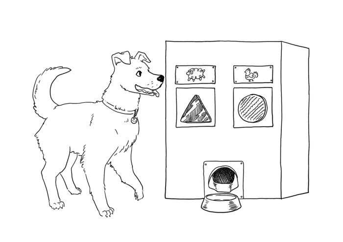
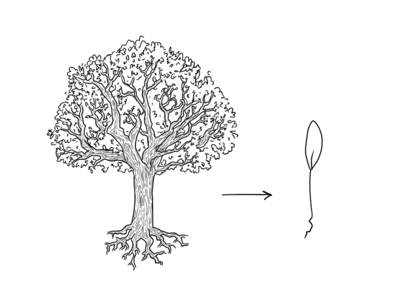
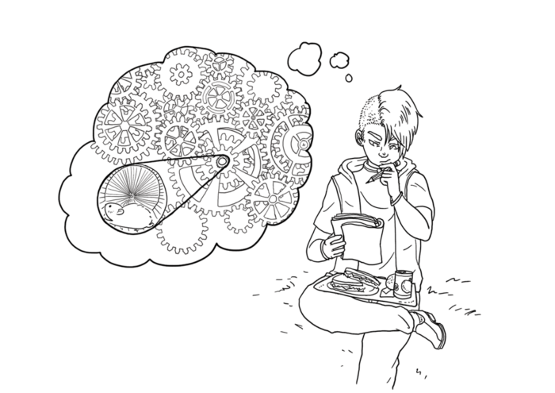
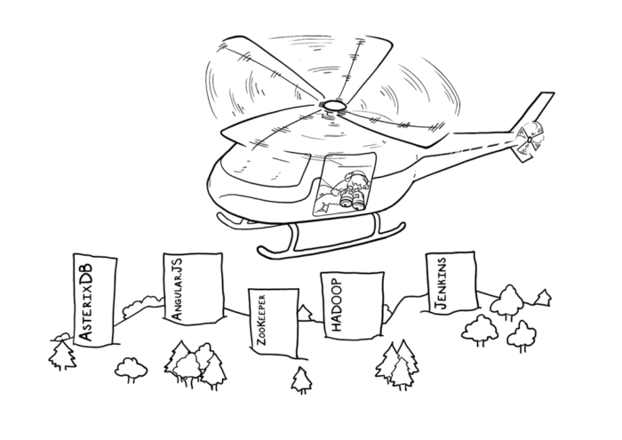
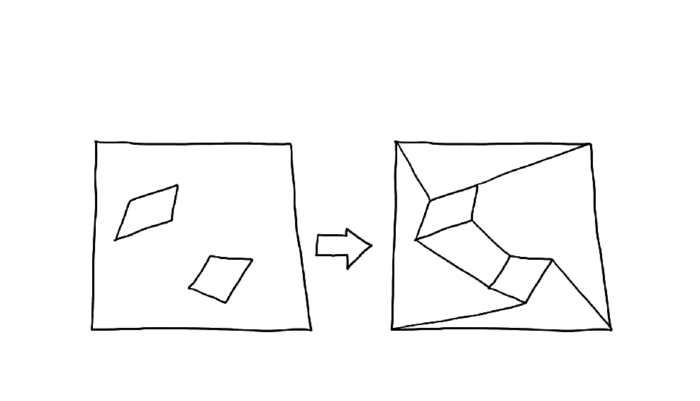

Eight Habits of Expert Software Designers: An Illustrated Guide

# Eight Habits of Expert Software Designers: An Illustrated Guide

The best designers employ specific habits, learned practices, and observed principles when they work. Here are a few of them.

**Experience and innate ability are not the only paths to success. Illustration: Yen Quach

By: Marian Petre & André van der Hoek

What makes an expert software designer? The typical answer — experience and innate ability — is less than satisfying. While it carries elements of truth, it offers little from which we can learn and generalize. Experts clearly do not just approach their work randomly. Quite the contrary, they have specific habits, learned practices, and observed principles that they employ deliberately during their design work.

**This article is adapted from the book “[Software Design Decoded: 66 Ways Experts Think](https://www.amazon.com/Software-Design-Decoded-Experts-Think/dp/0262035189)“

Some may be familiar with them, others not. Some are easily put in practice, others not. Some have immediate impact, others not. A constant, however, is that expert software designers are keenly aware of all of these practices and draw on them when the situation calls for it.

Rooted in many years of studying professional software designers and their ways of working, our book “[Software Design Decoded](https://www.amazon.com/Software-Design-Decoded-Experts-Think/dp/0262035189)” illuminates 66 of those habits, practices, and principles, several of which are featured below. They have been confirmed to us time and again by those working in the field, and each can be traced back to academic literature that documents expert behavior. The book’s [companion site](https://softwaredesigndecoded.wordpress.com/annotated-bibliography/) provides an annotated bibliography that compiles that key underpinning literature, as well as the opportunity to suggest additional insights.

Today, software is no longer limited by technology, but rather by imagination. Yet the software that turns the imagined into reality can be complex, and the context in which this transformation must happen can be even more complex. This places extraordinary demands on software designers, demands that can be met only if we collectively “step up” to achieve sustained excellence in design. We hope these illustrations can play a small part.

* * *

### 1) Experts involve the user:

**Based on [dog-appropriate switches](http://www.open.ac.uk/blogs/ACI/?author=1) designed by Clara

Mancini.

Experts are acutely aware of users. They deliberately involve users in the design process, studying them, talking to them, engaging them in testing intermediate designs, and even asking them to take an active role in the design team.

Yet experts do not take everything users say at face value. They realize the potential limitations, as users’ thinking is often colored by current experiences. Experts look beyond what users ask for, to what users actually need.

### 2) Experts design elegant abstractions:

While all developers create abstractions, experts design them. A good abstraction makes evident what is important, both in what it does and how it does it. Through a single lens, it communicates the problem it solves and the machinery of its solution.

Experts are not satisfied with just any abstraction, they deliberately seek elegant abstractions through which complex structures can be introduced, understood, and referred to efficiently.

### 3) Experts focus on the essence:

Every design problem has an essence, a core set of considerations that must be understood and “nailed” in the design solution for it to solve the problem successfully. This essence can be disruptive: changes in the core drastically alter the peripheral decisions that need to be made. Experts focus their efforts on the essence first, and delay expending effort designing on the periphery.

### 4) Experts simulate continually:

Experts imagine how a design will work — simulating aspects of the envisioned software and how the different parts of the design support a variety of scenarios. When working with others, experts regularly walk through a design by verbalizing its operation step-by-step. When alone, they simulate mentally, exercising the design repeatedly over time.

### 5) Experts look around:

In the same way that architects walk cities to examine and take inspiration from existing buildings, software experts examine the designs of other software to “see how they did it.” They frequently do so in response to a particular challenge they face, but they often also spend time looking around just to add to their repertoire of possible design solutions to draw upon in the future.

### 6) Experts reshape the problem space:

Experts often step back from the stated problem and consider the problem space more broadly, looking for alternative ways of understanding “what the problem is.” They may change direction by reconceiving the problem space, or by addressing a different problem in the same space. They intentionally choose somewhat different goals from the original design problem, as this leads to insights either into where the real problem lies, or into how to overcome key obstacles.

### 7) Experts see error as opportunity:

Design regularly involves error: things that “go amiss,” misunderstandings, obstacles, wrong turns, emergent issues. Rather than fearing error, experts embrace error as opportunity. They accept it as an inherent part of design and take time to explore both the failure and the context around it. Understanding what happened often reveals insights about the problem — or about the solution — such as assumptions, misconceptions, misalignments, and emergent properties.

### 8) Experts think about what they are *not* designing:

While it is natural to focus on what a design must accomplish, experts also spend time thinking about what a design is not intended to do. In articulating and considering boundaries, they discover where they are over- and under-designing.

* * *

*Marian Petre is Professor of Computing at the Open University. André van der Hoek is Professor of Informatics at the University of California, Irvine. Together, they are the authors of “*[*Software Design Decoded*](https://www.amazon.com/Software-Design-Decoded-Experts-Think/dp/0262035189)*.”*

*All illustrations by *[*Yen Quach*](http://www.yendraws.com/)*. *