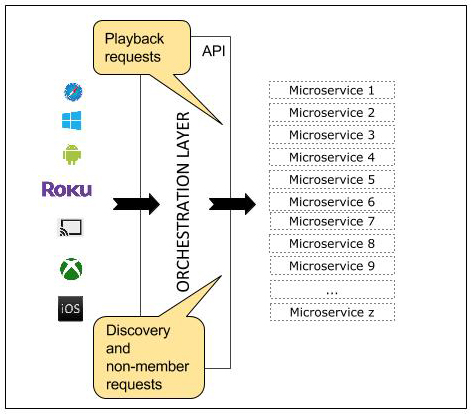
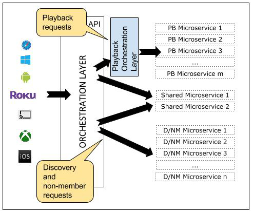
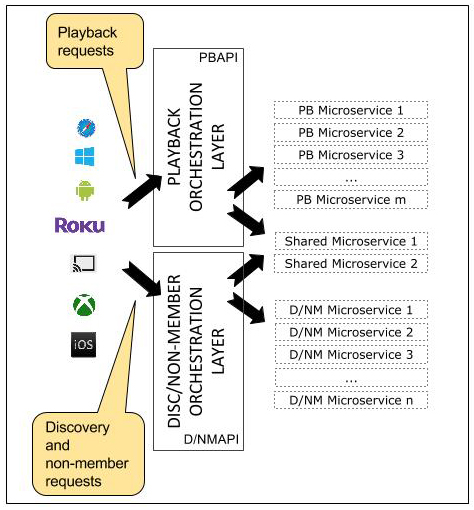

Engineering Trade-Offs and The Netflix API Re-Architecture

### Engineering Trade-Offs and The Netflix API Re-Architecture

Netflix’s [engineering culture](http://www.slideshare.net/reed2001/culture-1798664/) is predicated on Freedom & Responsibility, the idea that everyone (and every team) at Netflix is entrusted with a core responsibility. Within that framework they are free to operate with freedom to satisfy their mission. Accordingly, teams are generally responsible for all aspects of their systems, ranging from design, architecture, development, deployments, and operations. At the same time, it is inefficient to have all teams build everything that they need from scratch, given that there are often commonalities in the infrastructure needs of teams. We (like everyone else) value code reuse and consolidation where appropriate.

Given these two ideas (Freedom & Responsibility and leveragability of code), how can an individual and/or team figure out what they should optimize for themselves and what they should inherit from a centralized team? These kinds of trade-offs are pervasive in making engineering decisions, and Netflix is no exception.

The Netflix API is the service that handles the (sign-up, discovery and playback) traffic from all devices from all users. Over the last few years, the service has grown in a number of different dimensions: it’s grown in complexity, its request volume has increased, and Netflix’s subscriber base has grown as we expanded to most countries in the world. As the demands on the Netflix API continue to rise, the architecture that supports this massive responsibility is starting to approach its limits. As a result, we are working on a new architecture to position us well for the future (see [a recent presentation at QCon](https://www.infoq.com/presentations/netflix-groovy-scripting) for more details). This post explores the challenge of how, in the course of our re-architecture, we work to reconcile seemingly conflicting engineering principles: velocity and full ownership vs. maximum code reuse and consolidation.

Microservices Orchestration in the Netflix API

The Netflix API is the “front door” to the Netflix ecosystem of microservices. As requests come from devices, the API provides the logic of composing calls to all services that are required to construct a response. It gathers whatever information it needs from the backend services, in whatever order needed, formats and filters the data as necessary, and returns the response.

So, at its core, the Netflix API is an orchestration service that exposes coarse grained APIs by composing fined grained functionality provided by the microservices.

To make this happen, the API has at least four primary requirements: provide a flexible request protocol; map requests to one or more fine-grained APIs to backend microservices; provide a common resiliency abstraction to protect backend microservices; and create a context boundary (“buffer”) between device and backend teams.

Today, the API service exposes three categories of coarse grained APIs: *non-member *(sign-up, billing, free trial, etc.), *discovery* (recommended shows and movies, search, etc.) and *playback* (decisions regarding the streaming experience, licensing to ensure users can view specific content, viewing history, heartbeats for user bookmarking, etc.).

Consider an example from the playback category of APIs. Suppose a user clicks the “play” button for [Stranger Things Episode 1](https://www.netflix.com/title/80057281) on their mobile phone. In order for playback to begin, the mobile phone sends a “play” request to the API. The API in turn calls several microservices under the hood. Some of these calls can be made in parallel, because they don’t depend on each other. Others have to be sequenced in a specific order. The API contains all the logic to sequence and parallelize the calls as necessary. The device, in turn, doesn’t need to know anything about the orchestration that goes on under the hood when the customer clicks “play”.

*  Figure 1: Devices send requests to API, which orchestrates the ecosystem of microservices.*

**
**

Playback requests, with some exceptions, map only to playback backend services. There are many more discovery and non-member dependent services than playback services, but the separation is relatively clean, with only a few services needed both for playback and non-playback requests.

This is not a new insight for us, and our organizational structure reflects this. Today, two teams, both the API and the Playback teams, contribute to the orchestration layer, with the Playback team focusing on Playback APIs. However, only the API team is responsible for the full operations of the API, including releases, 24/7 support, rollbacks, etc. While this is great for code reuse, it goes against our principle of teams owning and operating in production what they build.

With this in mind, the goals to address in the new architecture are:

- We want each team to own and operate in production what they build. This will allow more targeted alerting, and faster MTTR.
- Similarly, we want each team to own their own release schedule and wherever possible not have releases held up by unrelated changes.

Two competing approaches

As we look into the future, we are considering two options. In option 1 (see figure 2), the orchestration layer in the API will, for all playback requests, be a pass-through and simply send the requests on to the playback-specific orchestration layer. The playback orchestration layer would then play the role of orchestrating between all playback services. The one exception to a full pass-through model is the small set of shared services, where the orchestration layer in the API would enrich the request with whatever information the playback orchestration layer needs in order to service the request.

**
**

*Figure 2: OPTION 1: Pass-through orchestration layer with playback-specific orchestration layer*

**
**
Alternatively, we could simply split into two separate APIs (see figure 3).
**
**

*Figure 3: OPTION 2: Separate playback and discovery/non-member APIs*
**
**

Both of the approaches actually solve the challenges we set out to solve: for each option, each team will own the release cycle as well as the production operations of their own orchestration layer - a step forward in our minds. This means that the choice between the two options comes down to other factors. Below we discuss some of our considerations.

Developer Experience

The developers who use our API (i.e., Netflix’s device teams) are top priority when designing, building and supporting the new API. They will program against our API daily, and it is important for our business that their developer experience and productivity is excellent. Two of the top concerns in this area are discovery and documentation: our partner teams will need to know how to interact with the API, what parameters to pass in and what they can expect back. Another goal is flexibility: due to the complex needs we have for 1000+ device types, our API must be extremely flexible. For instance, a device may want to request a different number of videos, and different properties about them, than another device would. All of this work will be important to both playback and non-playback APIs, so how is this related to the one vs. two APIs discussion? One API facilitates more uniformity in those areas: how requests are made and composed, how the API is documented, where and how teams find out about changes or additions to the API, API versioning, tools to optimize the developer experience, etc. If we go the route of two APIs, this is all still possible, but we will have to work harder across the two teams to achieve this.

Organizational implications and shared components

The two teams are very close and collaborate effectively on the API today. However, we are keenly aware that a decision to create two APIs, owned by two separate teams, can have profound implications. Our goals would, and should, be minimal divergence between the two APIs. Developer experience, as noted above, is one of the reasons. More broadly, we want to maximize the reuse of any components that are relevant to both APIs. This also includes any orchestration mechanisms, and any tools, mechanisms, and libraries related to scalability, reliability, and resiliency. The risk is that the two APIs could drift apart over time. What would that mean? For one, it could have organizational consequences (e.g., need for more staff). We could end up in a situation where we have valued ownership of components to a degree that we have abandoned component reuse. This is not a desirable outcome for us, and we would have to be very thoughtful about any divergence between the two APIs.

Even in a world where we have a significant amount of code use, we recognize that the operational overhead will be higher. As noted above, the API is critical to the Netflix service functioning properly for customers. Up until now, only one of the teams has been tasked with making the system highly scalable and highly resilient, and carrying the operational burden. The team has spent years building up expertise and experience in system scale and resiliency. By creating two APIs, we would be distributing these tasks and responsibilities to both teams.

Simplicity

If one puts the organizational considerations aside, two separate APIs is simply the cleaner architecture. In option 1, if the API acts largely as a pass-through, is it worth incurring the extra hop? Every playback request that would come into the API would simply be passed along to the playback orchestration layer without providing much functional value (besides the small set of functionality needed from the shared services). If the components that we build for discovery, insights, resiliency, orchestration, etc. can be reused in both APIs, the simplicity of having a clean separation between the two APIs is appealing. Moreover, as mentioned briefly above, option 1 also requires two teams to be involved for Playback API pushes that change the interaction model, while option 2 truly separates out the deployments.

Where does all of this leave us? We realize that this decision will have long-lasting consequences. But in taking all of the above into consideration, we have also come to understand that there is no perfect solution. There is no right or wrong, only trade-offs. Our path forward is to make informed assumptions and then experiment and build based on them. In particular, we are experimenting with how much we can generalize the building blocks we have already built and are planning to build, so that they could be used in both APIs. If this proves fruitful, we will then build two APIs. Despite the challenges, we are optimistic about this path and excited about the future of our services. If you are interested in helping us tackle this and other equally interesting challenges, come join us! We are [hiring](https://jobs.netflix.com/jobs/860912) for [several](https://jobs.netflix.com/jobs/860577) different  [roles](https://jobs.netflix.com/jobs/860522).

*By [Katharina Probst](https://www.linkedin.com/in/katharinaprobst), [Justin Becker](https://www.linkedin.com/in/jbeck449)***

**
*8 Comments*
*Sort by*

[Oldest**](https://www.facebook.com/plugins/feedback.php?api_key=181875188571207&channel_url=http%3A%2F%2Fstaticxx.facebook.com%2Fconnect%2Fxd_arbiter%2Fr%2F1FegrZjPbq3.js%3Fversion%3D42%23cb%3Df3cb1a70874e75%26domain%3Dtechblog.netflix.com%26origin%3Dhttp%253A%252F%252Ftechblog.netflix.com%252Ff22780bec83f5e8%26relation%3Dparent.parent&href=http%3A%2F%2Ftechblog.netflix.com%2F2016%2F08%2Fengineering-trade-offs-and-netflix-api.html&locale=en_US&numposts=10&sdk=joey&width=450#)

.

*Add a comment...*

.
.

[Logan Stuart](https://www.facebook.com/logan.stuart) ·

*[DevOps Engineer](https://www.facebook.com/pages/DevOps-Engineer/120430528019554) at [Wanderu](https://www.facebook.com/GoWanderu/)*

Your images are private in drive.

[*Like*](https://www.facebook.com/plugins/feedback.php?api_key=181875188571207&channel_url=http%3A%2F%2Fstaticxx.facebook.com%2Fconnect%2Fxd_arbiter%2Fr%2F1FegrZjPbq3.js%3Fversion%3D42%23cb%3Df3cb1a70874e75%26domain%3Dtechblog.netflix.com%26origin%3Dhttp%253A%252F%252Ftechblog.netflix.com%252Ff22780bec83f5e8%26relation%3Dparent.parent&href=http%3A%2F%2Ftechblog.netflix.com%2F2016%2F08%2Fengineering-trade-offs-and-netflix-api.html&locale=en_US&numposts=10&sdk=joey&width=450#) · [*Reply*](https://www.facebook.com/plugins/feedback.php?api_key=181875188571207&channel_url=http%3A%2F%2Fstaticxx.facebook.com%2Fconnect%2Fxd_arbiter%2Fr%2F1FegrZjPbq3.js%3Fversion%3D42%23cb%3Df3cb1a70874e75%26domain%3Dtechblog.netflix.com%26origin%3Dhttp%253A%252F%252Ftechblog.netflix.com%252Ff22780bec83f5e8%26relation%3Dparent.parent&href=http%3A%2F%2Ftechblog.netflix.com%2F2016%2F08%2Fengineering-trade-offs-and-netflix-api.html&locale=en_US&numposts=10&sdk=joey&width=450#) · **1 · [Aug 23, 2016 4:59pm](http://techblog.netflix.com/2016/08/engineering-trade-offs-and-netflix-api.html?fb_comment_id=1281438451889722_1282268875140013)

[Daniel Jacobson](https://www.facebook.com/djacobson) ·

*[Vice President of Edge Engineering](https://www.facebook.com/pages/Vice-President-of-Edge-Engineering/760480653976202) at [Netflix](https://www.facebook.com/netflixus/)*

fixed, please confirm

[*Like*](https://www.facebook.com/plugins/feedback.php?api_key=181875188571207&channel_url=http%3A%2F%2Fstaticxx.facebook.com%2Fconnect%2Fxd_arbiter%2Fr%2F1FegrZjPbq3.js%3Fversion%3D42%23cb%3Df3cb1a70874e75%26domain%3Dtechblog.netflix.com%26origin%3Dhttp%253A%252F%252Ftechblog.netflix.com%252Ff22780bec83f5e8%26relation%3Dparent.parent&href=http%3A%2F%2Ftechblog.netflix.com%2F2016%2F08%2Fengineering-trade-offs-and-netflix-api.html&locale=en_US&numposts=10&sdk=joey&width=450#) · [*Reply*](https://www.facebook.com/plugins/feedback.php?api_key=181875188571207&channel_url=http%3A%2F%2Fstaticxx.facebook.com%2Fconnect%2Fxd_arbiter%2Fr%2F1FegrZjPbq3.js%3Fversion%3D42%23cb%3Df3cb1a70874e75%26domain%3Dtechblog.netflix.com%26origin%3Dhttp%253A%252F%252Ftechblog.netflix.com%252Ff22780bec83f5e8%26relation%3Dparent.parent&href=http%3A%2F%2Ftechblog.netflix.com%2F2016%2F08%2Fengineering-trade-offs-and-netflix-api.html&locale=en_US&numposts=10&sdk=joey&width=450#) · Aug 23, 2016 5:44pm

.
.

[Ricardo Mendonça Ferreira](https://www.facebook.com/altoretrato) ·

[Fortaleza, Brazil](https://www.facebook.com/pages/Fortaleza-Brazil/114535871892330)

Daniel Jacobson Working fine for me.

[*Like*](https://www.facebook.com/plugins/feedback.php?api_key=181875188571207&channel_url=http%3A%2F%2Fstaticxx.facebook.com%2Fconnect%2Fxd_arbiter%2Fr%2F1FegrZjPbq3.js%3Fversion%3D42%23cb%3Df3cb1a70874e75%26domain%3Dtechblog.netflix.com%26origin%3Dhttp%253A%252F%252Ftechblog.netflix.com%252Ff22780bec83f5e8%26relation%3Dparent.parent&href=http%3A%2F%2Ftechblog.netflix.com%2F2016%2F08%2Fengineering-trade-offs-and-netflix-api.html&locale=en_US&numposts=10&sdk=joey&width=450#) · [*Reply*](https://www.facebook.com/plugins/feedback.php?api_key=181875188571207&channel_url=http%3A%2F%2Fstaticxx.facebook.com%2Fconnect%2Fxd_arbiter%2Fr%2F1FegrZjPbq3.js%3Fversion%3D42%23cb%3Df3cb1a70874e75%26domain%3Dtechblog.netflix.com%26origin%3Dhttp%253A%252F%252Ftechblog.netflix.com%252Ff22780bec83f5e8%26relation%3Dparent.parent&href=http%3A%2F%2Ftechblog.netflix.com%2F2016%2F08%2Fengineering-trade-offs-and-netflix-api.html&locale=en_US&numposts=10&sdk=joey&width=450#) · **1 · Aug 23, 2016 7:34pm

.
.
.
.

[Matt Bishop](https://www.facebook.com/reentry) ·

*[Principal Architect](https://www.facebook.com/pages/Principal-Architect/137330212969462) at [Elastic Path Software](https://www.facebook.com/elasticpath/)*

The key phrase here is "the separation is relatively clean". The domains can each evolve their own API as needed. Not all APIs are so separable though; they have overlapping concepts and identifiers that require them to work together.

[*Like*](https://www.facebook.com/plugins/feedback.php?api_key=181875188571207&channel_url=http%3A%2F%2Fstaticxx.facebook.com%2Fconnect%2Fxd_arbiter%2Fr%2F1FegrZjPbq3.js%3Fversion%3D42%23cb%3Df3cb1a70874e75%26domain%3Dtechblog.netflix.com%26origin%3Dhttp%253A%252F%252Ftechblog.netflix.com%252Ff22780bec83f5e8%26relation%3Dparent.parent&href=http%3A%2F%2Ftechblog.netflix.com%2F2016%2F08%2Fengineering-trade-offs-and-netflix-api.html&locale=en_US&numposts=10&sdk=joey&width=450#) · [*Reply*](https://www.facebook.com/plugins/feedback.php?api_key=181875188571207&channel_url=http%3A%2F%2Fstaticxx.facebook.com%2Fconnect%2Fxd_arbiter%2Fr%2F1FegrZjPbq3.js%3Fversion%3D42%23cb%3Df3cb1a70874e75%26domain%3Dtechblog.netflix.com%26origin%3Dhttp%253A%252F%252Ftechblog.netflix.com%252Ff22780bec83f5e8%26relation%3Dparent.parent&href=http%3A%2F%2Ftechblog.netflix.com%2F2016%2F08%2Fengineering-trade-offs-and-netflix-api.html&locale=en_US&numposts=10&sdk=joey&width=450#) · [Aug 24, 2016 12:00am](http://techblog.netflix.com/2016/08/engineering-trade-offs-and-netflix-api.html?fb_comment_id=1281438451889722_1282524485114452)

[Katharina Probst](https://www.facebook.com/katharina.probst) ·
*Works at [Netflix](https://www.facebook.com/netflixus/)*

Yes, that's absolutely right. For us, the remaining discovery/non-member API is a great example of this and is not as cleanly separable.

[*Like*](https://www.facebook.com/plugins/feedback.php?api_key=181875188571207&channel_url=http%3A%2F%2Fstaticxx.facebook.com%2Fconnect%2Fxd_arbiter%2Fr%2F1FegrZjPbq3.js%3Fversion%3D42%23cb%3Df3cb1a70874e75%26domain%3Dtechblog.netflix.com%26origin%3Dhttp%253A%252F%252Ftechblog.netflix.com%252Ff22780bec83f5e8%26relation%3Dparent.parent&href=http%3A%2F%2Ftechblog.netflix.com%2F2016%2F08%2Fengineering-trade-offs-and-netflix-api.html&locale=en_US&numposts=10&sdk=joey&width=450#) · [*Reply*](https://www.facebook.com/plugins/feedback.php?api_key=181875188571207&channel_url=http%3A%2F%2Fstaticxx.facebook.com%2Fconnect%2Fxd_arbiter%2Fr%2F1FegrZjPbq3.js%3Fversion%3D42%23cb%3Df3cb1a70874e75%26domain%3Dtechblog.netflix.com%26origin%3Dhttp%253A%252F%252Ftechblog.netflix.com%252Ff22780bec83f5e8%26relation%3Dparent.parent&href=http%3A%2F%2Ftechblog.netflix.com%2F2016%2F08%2Fengineering-trade-offs-and-netflix-api.html&locale=en_US&numposts=10&sdk=joey&width=450#) · **1 · Sep 15, 2016 9:51pm

.
.
.
.

[Kasun Indrasiri](https://www.facebook.com/kasun.indrasiri) ·

[San Jose, California](https://www.facebook.com/pages/San-Jose-California/111948542155151)

How does the scaling happens before the separation of 'playback' and 'discovery/non-member APIs'? Are we scaling that as a single monolithic component?

[*Like*](https://www.facebook.com/plugins/feedback.php?api_key=181875188571207&channel_url=http%3A%2F%2Fstaticxx.facebook.com%2Fconnect%2Fxd_arbiter%2Fr%2F1FegrZjPbq3.js%3Fversion%3D42%23cb%3Df3cb1a70874e75%26domain%3Dtechblog.netflix.com%26origin%3Dhttp%253A%252F%252Ftechblog.netflix.com%252Ff22780bec83f5e8%26relation%3Dparent.parent&href=http%3A%2F%2Ftechblog.netflix.com%2F2016%2F08%2Fengineering-trade-offs-and-netflix-api.html&locale=en_US&numposts=10&sdk=joey&width=450#) · [*Reply*](https://www.facebook.com/plugins/feedback.php?api_key=181875188571207&channel_url=http%3A%2F%2Fstaticxx.facebook.com%2Fconnect%2Fxd_arbiter%2Fr%2F1FegrZjPbq3.js%3Fversion%3D42%23cb%3Df3cb1a70874e75%26domain%3Dtechblog.netflix.com%26origin%3Dhttp%253A%252F%252Ftechblog.netflix.com%252Ff22780bec83f5e8%26relation%3Dparent.parent&href=http%3A%2F%2Ftechblog.netflix.com%2F2016%2F08%2Fengineering-trade-offs-and-netflix-api.html&locale=en_US&numposts=10&sdk=joey&width=450#) · [Sep 3, 2016 6:05pm](http://techblog.netflix.com/2016/08/engineering-trade-offs-and-netflix-api.html?fb_comment_id=1281438451889722_1293005340733033)

[Katharina Probst](https://www.facebook.com/katharina.probst) ·
*Works at [Netflix](https://www.facebook.com/netflixus/)*
Yes, that is what we currently do.

[*Like*](https://www.facebook.com/plugins/feedback.php?api_key=181875188571207&channel_url=http%3A%2F%2Fstaticxx.facebook.com%2Fconnect%2Fxd_arbiter%2Fr%2F1FegrZjPbq3.js%3Fversion%3D42%23cb%3Df3cb1a70874e75%26domain%3Dtechblog.netflix.com%26origin%3Dhttp%253A%252F%252Ftechblog.netflix.com%252Ff22780bec83f5e8%26relation%3Dparent.parent&href=http%3A%2F%2Ftechblog.netflix.com%2F2016%2F08%2Fengineering-trade-offs-and-netflix-api.html&locale=en_US&numposts=10&sdk=joey&width=450#) · [*Reply*](https://www.facebook.com/plugins/feedback.php?api_key=181875188571207&channel_url=http%3A%2F%2Fstaticxx.facebook.com%2Fconnect%2Fxd_arbiter%2Fr%2F1FegrZjPbq3.js%3Fversion%3D42%23cb%3Df3cb1a70874e75%26domain%3Dtechblog.netflix.com%26origin%3Dhttp%253A%252F%252Ftechblog.netflix.com%252Ff22780bec83f5e8%26relation%3Dparent.parent&href=http%3A%2F%2Ftechblog.netflix.com%2F2016%2F08%2Fengineering-trade-offs-and-netflix-api.html&locale=en_US&numposts=10&sdk=joey&width=450#) · **1 · Sep 15, 2016 9:48pm

.
.
.
.

[Lou Powell](https://www.facebook.com/lou.powell.14)

I would want to know what the likelyhood of further divergence is? If it is likely, could it result in more tiers of vertical pass-through orchestration. That could be a strong case for working out formal collaboration and methods to create horizontal separation.

[*Like*](https://www.facebook.com/plugins/feedback.php?api_key=181875188571207&channel_url=http%3A%2F%2Fstaticxx.facebook.com%2Fconnect%2Fxd_arbiter%2Fr%2F1FegrZjPbq3.js%3Fversion%3D42%23cb%3Df3cb1a70874e75%26domain%3Dtechblog.netflix.com%26origin%3Dhttp%253A%252F%252Ftechblog.netflix.com%252Ff22780bec83f5e8%26relation%3Dparent.parent&href=http%3A%2F%2Ftechblog.netflix.com%2F2016%2F08%2Fengineering-trade-offs-and-netflix-api.html&locale=en_US&numposts=10&sdk=joey&width=450#) · [*Reply*](https://www.facebook.com/plugins/feedback.php?api_key=181875188571207&channel_url=http%3A%2F%2Fstaticxx.facebook.com%2Fconnect%2Fxd_arbiter%2Fr%2F1FegrZjPbq3.js%3Fversion%3D42%23cb%3Df3cb1a70874e75%26domain%3Dtechblog.netflix.com%26origin%3Dhttp%253A%252F%252Ftechblog.netflix.com%252Ff22780bec83f5e8%26relation%3Dparent.parent&href=http%3A%2F%2Ftechblog.netflix.com%2F2016%2F08%2Fengineering-trade-offs-and-netflix-api.html&locale=en_US&numposts=10&sdk=joey&width=450#) · [Sep 8, 2016 7:28am](http://techblog.netflix.com/2016/08/engineering-trade-offs-and-netflix-api.html?fb_comment_id=1281438451889722_1297488836951350)

.
.

[Mohammed Vaseemuddin](https://www.facebook.com/mohammed.vaseemuddin)
thanks for the insights. Its never an easy decision.

[*Like*](https://www.facebook.com/plugins/feedback.php?api_key=181875188571207&channel_url=http%3A%2F%2Fstaticxx.facebook.com%2Fconnect%2Fxd_arbiter%2Fr%2F1FegrZjPbq3.js%3Fversion%3D42%23cb%3Df3cb1a70874e75%26domain%3Dtechblog.netflix.com%26origin%3Dhttp%253A%252F%252Ftechblog.netflix.com%252Ff22780bec83f5e8%26relation%3Dparent.parent&href=http%3A%2F%2Ftechblog.netflix.com%2F2016%2F08%2Fengineering-trade-offs-and-netflix-api.html&locale=en_US&numposts=10&sdk=joey&width=450#) · [*Reply*](https://www.facebook.com/plugins/feedback.php?api_key=181875188571207&channel_url=http%3A%2F%2Fstaticxx.facebook.com%2Fconnect%2Fxd_arbiter%2Fr%2F1FegrZjPbq3.js%3Fversion%3D42%23cb%3Df3cb1a70874e75%26domain%3Dtechblog.netflix.com%26origin%3Dhttp%253A%252F%252Ftechblog.netflix.com%252Ff22780bec83f5e8%26relation%3Dparent.parent&href=http%3A%2F%2Ftechblog.netflix.com%2F2016%2F08%2Fengineering-trade-offs-and-netflix-api.html&locale=en_US&numposts=10&sdk=joey&width=450#) · [Sep 9, 2016 4:15pm](http://techblog.netflix.com/2016/08/engineering-trade-offs-and-netflix-api.html?fb_comment_id=1281438451889722_1298738706826363)

.
.

[Ralf Wilden](https://www.facebook.com/ralf.wilden) ·

*[Founder](https://www.facebook.com/pages/Founder/849873341726582) at [Intentsys Pte Ltd](https://www.facebook.com/pages/Intentsys-Pte-Ltd/1656722984600849)*

Excellent article about the realities of purist vs. practical

[*Like*](https://www.facebook.com/plugins/feedback.php?api_key=181875188571207&channel_url=http%3A%2F%2Fstaticxx.facebook.com%2Fconnect%2Fxd_arbiter%2Fr%2F1FegrZjPbq3.js%3Fversion%3D42%23cb%3Df3cb1a70874e75%26domain%3Dtechblog.netflix.com%26origin%3Dhttp%253A%252F%252Ftechblog.netflix.com%252Ff22780bec83f5e8%26relation%3Dparent.parent&href=http%3A%2F%2Ftechblog.netflix.com%2F2016%2F08%2Fengineering-trade-offs-and-netflix-api.html&locale=en_US&numposts=10&sdk=joey&width=450#) · [*Reply*](https://www.facebook.com/plugins/feedback.php?api_key=181875188571207&channel_url=http%3A%2F%2Fstaticxx.facebook.com%2Fconnect%2Fxd_arbiter%2Fr%2F1FegrZjPbq3.js%3Fversion%3D42%23cb%3Df3cb1a70874e75%26domain%3Dtechblog.netflix.com%26origin%3Dhttp%253A%252F%252Ftechblog.netflix.com%252Ff22780bec83f5e8%26relation%3Dparent.parent&href=http%3A%2F%2Ftechblog.netflix.com%2F2016%2F08%2Fengineering-trade-offs-and-netflix-api.html&locale=en_US&numposts=10&sdk=joey&width=450#) · [Sep 12, 2016 2:51am](http://techblog.netflix.com/2016/08/engineering-trade-offs-and-netflix-api.html?fb_comment_id=1281438451889722_1301144386585795)

.
.

[Razvan Cojocaru](https://www.facebook.com/razvanc99) ·

*[Ski Coach](https://www.facebook.com/pages/Ski-Coach/145693318781911) at [Glacier Racing Ski Club](https://www.facebook.com/pages/Glacier-Racing-Ski-Club/913733045341918)*

Perhaps another interesting solution would involve allowing the Playback layer to inject their orchestration logic, which they would manage, into the API layer. That seems to get the best of both worlds. Managing updates and versions would certainly be interesting to solve, but doesn't seem much more complex than pushing updates into a large cluster today...?

The Playback team would still not quite operate it, but the API layer to them would be more of an immutable infrastructure service.

If the orchestration logic would not be actual code, but rather a lightweight DSL, it could easily be in*...*[*See More*](https://www.facebook.com/plugins/feedback.php?api_key=181875188571207&channel_url=http%3A%2F%2Fstaticxx.facebook.com%2Fconnect%2Fxd_arbiter%2Fr%2F1FegrZjPbq3.js%3Fversion%3D42%23cb%3Df3cb1a70874e75%26domain%3Dtechblog.netflix.com%26origin%3Dhttp%253A%252F%252Ftechblog.netflix.com%252Ff22780bec83f5e8%26relation%3Dparent.parent&href=http%3A%2F%2Ftechblog.netflix.com%2F2016%2F08%2Fengineering-trade-offs-and-netflix-api.html&locale=en_US&numposts=10&sdk=joey&width=450#)

[*Like*](https://www.facebook.com/plugins/feedback.php?api_key=181875188571207&channel_url=http%3A%2F%2Fstaticxx.facebook.com%2Fconnect%2Fxd_arbiter%2Fr%2F1FegrZjPbq3.js%3Fversion%3D42%23cb%3Df3cb1a70874e75%26domain%3Dtechblog.netflix.com%26origin%3Dhttp%253A%252F%252Ftechblog.netflix.com%252Ff22780bec83f5e8%26relation%3Dparent.parent&href=http%3A%2F%2Ftechblog.netflix.com%2F2016%2F08%2Fengineering-trade-offs-and-netflix-api.html&locale=en_US&numposts=10&sdk=joey&width=450#) · [*Reply*](https://www.facebook.com/plugins/feedback.php?api_key=181875188571207&channel_url=http%3A%2F%2Fstaticxx.facebook.com%2Fconnect%2Fxd_arbiter%2Fr%2F1FegrZjPbq3.js%3Fversion%3D42%23cb%3Df3cb1a70874e75%26domain%3Dtechblog.netflix.com%26origin%3Dhttp%253A%252F%252Ftechblog.netflix.com%252Ff22780bec83f5e8%26relation%3Dparent.parent&href=http%3A%2F%2Ftechblog.netflix.com%2F2016%2F08%2Fengineering-trade-offs-and-netflix-api.html&locale=en_US&numposts=10&sdk=joey&width=450#) · [Sep 14, 2016 6:06pm](http://techblog.netflix.com/2016/08/engineering-trade-offs-and-netflix-api.html?fb_comment_id=1281438451889722_1303450786355155) · [*Edited*](https://www.facebook.com/plugins/feedback.php?api_key=181875188571207&channel_url=http%3A%2F%2Fstaticxx.facebook.com%2Fconnect%2Fxd_arbiter%2Fr%2F1FegrZjPbq3.js%3Fversion%3D42%23cb%3Df3cb1a70874e75%26domain%3Dtechblog.netflix.com%26origin%3Dhttp%253A%252F%252Ftechblog.netflix.com%252Ff22780bec83f5e8%26relation%3Dparent.parent&href=http%3A%2F%2Ftechblog.netflix.com%2F2016%2F08%2Fengineering-trade-offs-and-netflix-api.html&locale=en_US&numposts=10&sdk=joey&width=450#)

.
.

[Dorian Moises Mattar](https://www.facebook.com/dorian.mattar) ·

*[Realtor](https://www.facebook.com/pages/Realtor/997711030247472) at [Premier Realty Associates](https://www.facebook.com/mypremieragent/)*

How do I obtain a key for development? All links I have tried are dead ends.

[*Like*](https://www.facebook.com/plugins/feedback.php?api_key=181875188571207&channel_url=http%3A%2F%2Fstaticxx.facebook.com%2Fconnect%2Fxd_arbiter%2Fr%2F1FegrZjPbq3.js%3Fversion%3D42%23cb%3Df3cb1a70874e75%26domain%3Dtechblog.netflix.com%26origin%3Dhttp%253A%252F%252Ftechblog.netflix.com%252Ff22780bec83f5e8%26relation%3Dparent.parent&href=http%3A%2F%2Ftechblog.netflix.com%2F2016%2F08%2Fengineering-trade-offs-and-netflix-api.html&locale=en_US&numposts=10&sdk=joey&width=450#) · [*Reply*](https://www.facebook.com/plugins/feedback.php?api_key=181875188571207&channel_url=http%3A%2F%2Fstaticxx.facebook.com%2Fconnect%2Fxd_arbiter%2Fr%2F1FegrZjPbq3.js%3Fversion%3D42%23cb%3Df3cb1a70874e75%26domain%3Dtechblog.netflix.com%26origin%3Dhttp%253A%252F%252Ftechblog.netflix.com%252Ff22780bec83f5e8%26relation%3Dparent.parent&href=http%3A%2F%2Ftechblog.netflix.com%2F2016%2F08%2Fengineering-trade-offs-and-netflix-api.html&locale=en_US&numposts=10&sdk=joey&width=450#) · [Oct 27, 2016 10:45pm](http://techblog.netflix.com/2016/08/engineering-trade-offs-and-netflix-api.html?fb_comment_id=1281438451889722_1346747598692140)

.
.
**

[Facebook Comments Plugin](https://developers.facebook.com/docs/plugins/comments/?utm_campaign=social_plugins&utm_medium=offsite_pages&utm_source=comments_plugin)

.

Posted by[Daniel Jacobson](https://www.blogger.com/profile/10452657688644415482)at[8:51 AM](http://techblog.netflix.com/2016/08/engineering-trade-offs-and-netflix-api.html)

[Email This](https://www.blogger.com/share-post.g?blogID=725338818844296080&postID=6812669724127718801&target=email)[BlogThis!](https://www.blogger.com/share-post.g?blogID=725338818844296080&postID=6812669724127718801&target=blog)[Share to Twitter](https://www.blogger.com/share-post.g?blogID=725338818844296080&postID=6812669724127718801&target=twitter)[Share to Facebook](https://www.blogger.com/share-post.g?blogID=725338818844296080&postID=6812669724127718801&target=facebook)[Share to Pinterest](https://www.blogger.com/share-post.g?blogID=725338818844296080&postID=6812669724127718801&target=pinterest)

|     |
| --- |
| +16   Recommend this on Google |