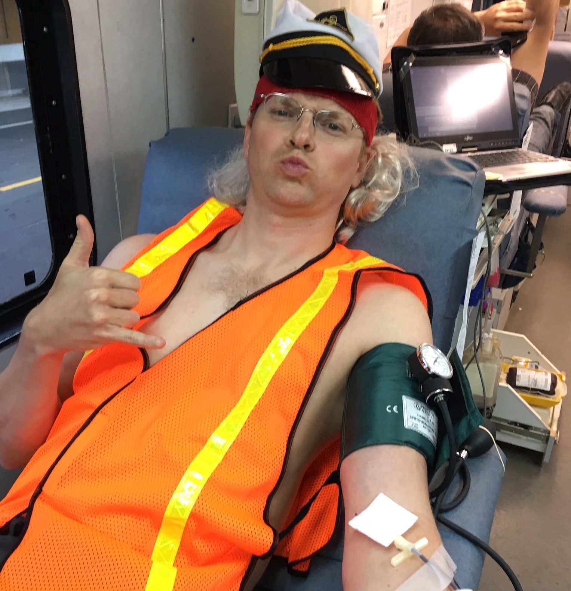
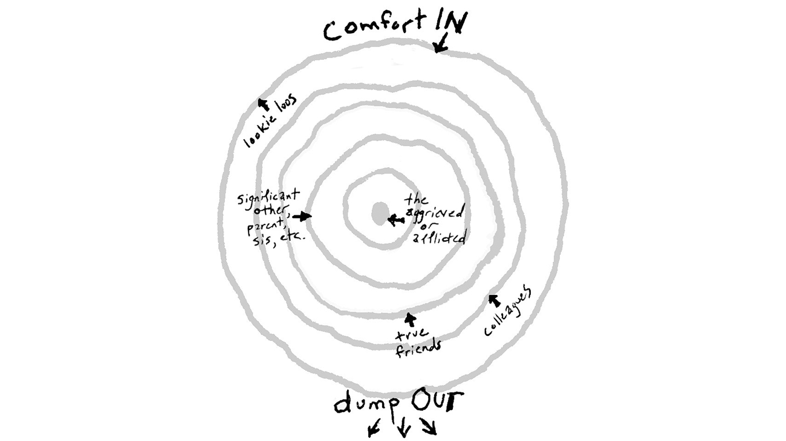

Etiquette and the Cancer Patient – Season of the Witch – Medium

# Etiquette and the Cancer Patient

Frustrated they couldn’t help in other ways, friends organized a big blood drive. And they dressed in costumes, DJ’d music and had a ball. Exactly how I would have wanted it. [Rob Webb](https://medium.com/@RobbWebbb) keeping blood between brothers and sisters.

I’ve failed to complete this post a number of times. It’s laden with caveats and nuances and limited to just my learning, but it’s important that everyone becomes familiar and adept at how to support the cancer patient. But I think it’s applicable to any patient whose life is threatened.

Thanks to science and medicine, many Americans get well into middle age before a friend becomes gravely ill. We know how to talk about in hushed tones amongst ourselves but barring previous misfortune have no idea how to properly respond. But even more importantly I found many adults flounder to respond because they haven’t had to grapple with overwhelming senses of despair and helplessness and the secret they dare not verbalize that they and their family are just as vulnerable. The last thing a patient needs is for their friends and acquaintances to respond from a crazed, fearful place. For some it’s just too much and they can’t even show up. For others it’s becomes about them, offering to help just to avoid facing what I describe above. Plenty of others want to help simply because they don’t know what to do. Some people figure it out quickly and get with the program. A small few have the life experience to approach it the right way, while some other expert humans are simply so comfortable accepting that life is change and emotions are life that they’re naturals.

So, the first part of being good to the patient is to get your own head together. Be mindful of how this is making *you* feel. Channel your fear of this happening to your family into a celebration of being alive. Accept that feeling helpless isn’t a shortcoming. Recognize despair and grief are part of the pantheon of life experiences. You do this because you don’t want to make any of this about you. Support and love must flow to the patient and fear and discomfort must flow away. If you are not good at expressing love and gratefulness to your friend, learn how to do so quickly.

Recognize that everyone that knows the patient is distraught and overwhelmed by feeling helpless and there are often very few ways to help. The closer you are to the patient the stronger these feelings are. If there is some help to give that provides the giver a sense of satisfaction the patient’s inner circle always get first right of refusal. [There’s a wonderful article by a breast cancer patient about this you should read that boils down to “comfort in” and “dump out.](http://www.latimes.com/nation/la-oe-0407-silk-ring-theory-20130407-story.html#axzz2kF8iBw9U)”

Comfort radiates in, Crap radiates out. [Understand how you stand amongst the concentric circles](http://www.latimes.com/nation/la-oe-0407-silk-ring-theory-20130407-story.html#axzz2kF8iBw9U).

If you ever “want” or “need” to do something for the patient recognize that this is something *you* need, and your needs are inconsequential to the patient and the care givers. Reframe your thinking to what could benefit the patient and caregivers. Definitely do not insist that you do something or expect special consideration without approval. Again this is not about your trying to minimize your anxiety, this is about the patient and the caregivers having the best possible days.

Even just saying “How are you?” is an ask. I know it’s an American catch-all phrase to start a conversation, but now is not the time to use. When friends would ask me, my first thought was “Im doing like shit, fuck you very much for asking,” even though I knew it was an innocent, inexperienced question. When my friend [Lori Dorn](https://medium.com/u/22cb43057b99) had breast cancer she requested people ask the much more manageable question: “how are you today?”

How are you? Bad.

Create a new habit such that when you’re thinking of them tell them by just saying, “thinking of you.” and don’t expect a response. No matter how bad I was, it was always nice to see such a text. Don’t do it too often (daily) but also don’t go to long without letting them know you’re thinking about them. The patient may reply and want to talk which was always nice, but even when they don’t, they’ll always read it, smile and know they aren’t forgotten. (But again do this suitably, don’t hound the patient.)

Thinking of you. Good.

If you want to write something longer to the patient like a letter or email, that is great, just avoid asking direct questions or anything that makes the patient beholden to respond and always make it clear this is just something you wanted to share with them by ending “no need to reply.”

* * *

*...*

Do not assume what the patients and caregivers need and want. My wife likes making meals as a way to enrich the family. Every meal that was brought over denied Molly one of the few ways she had left to provide health to us.

Of course every patient and caregivers are different. Some may greatly value pre-made meals. The further out you are from the inner circle the more thoughtful you have to be to find out ways to help. The primary caregivers are often too overwhelmed to prioritize finding tasks for each person that offers help.

You could write the offer in an email or call, but understand the family may be overwhelmed with offers of help and don’t have the time to give thoughtful declines. Take a non-answer as a “no” and don’t belabor the situation by making the offer repeatedly. Yes it sucks having unresolved feelings of helpless, but again, this is not about you.

Nonetheless keep trying to find a help vector. Perhaps stop by the house with flowers or chocolates knowing you may just be leaving them at the door. But maybe it’s an okay time and you’re invited in. Look around the house. Does something need fixing? Is the sink full of dishes? Just do the dishes. Is laundry piled? Does a child look like they need to get outside? Offer then to do this or come back later. Don’t expect to get to see the patient or get word of thanks. Be like a fairy that silently helps and sneaks away and I’m sure you’ll feel releaved you helped.

Or wait for the rare moment when the family says how you can help. Molly tweeted one day:

and suddenly we’re getting pictures of friend all over the country giving blood. Other friends who had been frustrated their previous offers to make me feel better were declined organized 4 hours with a bloodmobile and invited anyone they knew was a friend of mine. ***They did all this without asking one thing of me***. They just made it happen and I got see all the pictures. Thanks to [Edgar Blazona](https://medium.com/@EdgarBlazona)for organizing and all my friends that were able to pitch in. During a crazed time for us it was deeply touching.

* * *

*...*

Avoid using the phrase “let me know if there’s anything I can do.” First off, it’s an ask of the patient or caregiver. You’re asking them to come up with something they could do to help. Secondly, most of the time we found the “anything” offer meant, “… if I happen to be free at that time.” Everyone has kids or jobs or travel plans and mostly can’t come running on a moment’s notice at an awkward time. Unless you’re really ready to cancel getaway plans or take a day off from work, don’t say “anything.” Instead say “Im hopeful I can find a way to help you.”

People always offered to do the more meaningful services such as taking patient to hospital or bringing food. Consider offering to do the dirty work: clean the kitchen, take out the weekly garbage; weed the garden; do the laundry and you’re much more likely to get an exasperated yes.

* * *

*...*

If the patient is conscious, avoid “protecting them” by asking questions of the caregiver. If you want to know if the patient would want something ask the patient. Don’t give even more work to the caregiver.

Recognize the caregivers and people closest to the patient are fully extended trying to keep the family going. Whatever despair, grief and helplessness you feel is nothing compared to theirs. Figure out how you can help the caregivers. The patient gets all the attention and the caregivers get all the work plus having their lives turned inside out. Are you close to the caregivers? Then tell them you’re thinking of them. Obsess over how *their* pain could be reduced. Patients rely of the well being of their caregivers. Help the caregiver and you help the patient.

* * *

*...*

Words of encouragement along the lines of “you’re a fighter,” or “be strong” never resonated with me. The closest my experience has been to a fight is me getting punched in the face over and over again. The science and treatments fight the tumors, and my purpose is to withstand it all as long as I can. Turns out this sentiment isn’t just me. I saw three threads yesterday from people saying “stop acting like McCain can fight his way out of glioblastoma.” I know you’re dying to say “but fighting to live longer is what fighting is,” but I suspect you say that more from fear of death than sympathy for the sticken. ***So listen to the stricken.*** Wish them peace and happiness. Let them know how important they are to yoy and cheer them on always.

Of course, if the patient tells you they are fighting, then cheer them of with their own words.

* * *

*...*

Don’t tell the patient about your other experiences with the illness. The patient is not here so you can unload your own frustrations. I know it’s human nature to talk about that which is similar to the current moment, but fight that unbeneficial urge. No patient wants to hear about you aunt that died of the same cancer. My uncle died of renal cell carcinoma am I going to tell you about that? No. One aside is I did want to hear any story of someone with stage IV cancer that was told they would die and managed to live. That is always inspirational to me. But don’t come at me with some “inspirational” story of someone that survived a treatable cancer. They’re only inspirational to people who have never been challenged, not those that are dying.

* * *

*...*

Don’t lie to the person, “you’re going to beat this.” or “I know you can do it” because it makes you feel better saying it. Get into the headspace of the patient. Listen to them. Cheer them on with what they say is hard for them. Let you know you love them and want to be there for them.

* * *

*...*

*Ted Rheingold lives in San Francisco and has been living with cancer since his Stage-4 diagnosis (clear cell renal cell carcinoma) in April, 2016. Here’s written frankly about his experience in this blog, *[*Season of the Witch*](https://medium.com/season-of-the-witch)*. You can follow him on twitter *[*@tedr*](http://twitter.com/tedr)*.*