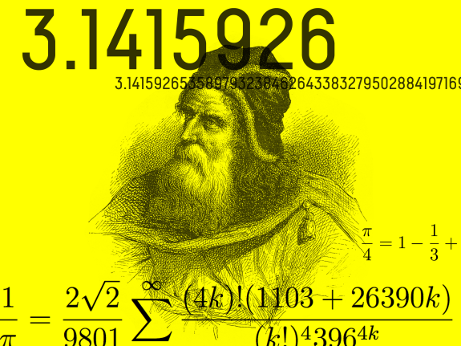
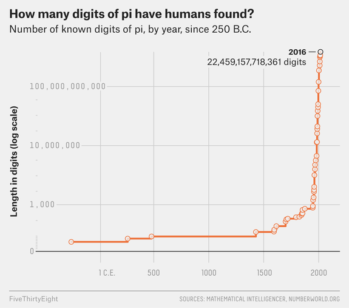

Even After 22 Trillion Digits, We’re Still No Closer To The End Of Pi

#  Even After 22 Trillion Digits, We’re Still No Closer To The End Of Pi

There have been just a few more digits added to pi since Archimedes got to 3.141.

Illustration by Linda Tran Tutovan / Getty images

Depending on your philosophical views on time and calendars and so on, today is something like the 4.5 billionth Pi Day that Earth has witnessed. But that long history is nothing compared to the infinity of pi itself.

A refresher for those of you who have forgotten your seventh-grade math lessons[1](https://fivethirtyeight.com/features/even-after-22-trillion-digits-were-still-no-closer-to-the-end-of-pi/#fn-1): Pi, or the Greek letter ππ, is a mathematical constant equal to the ratio of a circle’s circumference to its diameter — C/d. It lurks in every circle, and equals approximately 3.14. (Hence Pi Day, which takes place on March 14, aka 3/14.)

But the simplicity of its definition belies pi’s status as the most fascinating, and most studied, number in the history of the world. While treating pi as equal to 3.14 is often good enough, the number really continues on forever, a seemingly random series of digits ambling infinitely outward and obeying no discernible pattern — 3.14159265358979…. That’s because it’s an [irrational number](http://mathworld.wolfram.com/IrrationalNumber.html), meaning that it cannot be represented by a fraction of two whole numbers (although approximations such as [22/7](https://en.wikipedia.org/wiki/22/7) can come close).

ADVERTISEMENT

But that hasn’t stopped humanity from furiously chipping away at pi’s unending mountain of digits. We’ve been at it for millennia.

People have been interested in the number for basically as long we’ve understood math. The ancient Egyptians, according to [a document](http://mathworld.wolfram.com/RhindPapyrus.html) that also happens to be the world’s oldest collection of math puzzles, knew that pi was something like 3.1. A millennium or so later, an estimate of pi showed up in the bible: The Old Testament, in 1 Kings, [seems to imply](https://www.biblegateway.com/passage/?search=1+Kings+7%3A23&version=KJV) that pi equals 3: “And he made a molten sea, ten cubits from the one brim to the other: it was round all about … and a line of thirty cubits did compass it round about.”

Archimedes, the [greatest mathematician of antiquity](https://www.scientificamerican.com/article/fact-or-fiction-archimede/), got as far as 3.141 by around 250 B.C. Archimedes approached his calculation of pi geometrically, by [sandwiching](https://upload.wikimedia.org/wikipedia/commons/thumb/c/c9/Archimedes_pi.svg/2000px-Archimedes_pi.svg.png) a circle between two straight-edged [regular polygons](http://mathworld.wolfram.com/RegularPolygon.html). Measuring polygons was easier than measuring circles, and Archimedes measured pi-like ratios as the number of the polygons’ sides increased, until they closely resembled circles.

Meaningful improvement on Archimedes’s method wouldn’t come for hundreds of years. Using the new technique of [integration](https://en.wikipedia.org/wiki/Integral), mathematicians like Gottfried Leibniz, one of the fathers of calculus, could prove such elegant equations for pi as:

π4=1−13+15−17+19−…π4=1−13+15−17+19−…

The right-hand side, just like pi, continues forever. If you add and subtract and add and subtract all those simple fractions, you’ll inch ever closer to pi’s true value. The problem is that you’ll inch *very, very slowly*. To get just 10 correct digits of pi, you’d have to add about 5 billion fractions together.

But more efficient formulas were discovered. Take this one, from Leonhard Euler, probably the greatest mathematician ever, in the 18th century:

π26=112+122+132+…π26=112+122+132+…

And Srinivasa Ramanujan, a self-taught mathematical genius from India, discovered the totally surprising and bizarre equation below in the early 1900s. Each additional term in this sum [adds eight correct digits](http://crd-legacy.lbl.gov/~dhbailey/dhbpapers/pi-quest.pdf) to an estimate of pi:

1π=22‾√9801∑k=0∞(4k)!(1103+26390k)(k!)43964k1π=229801∑k=0∞(4k)!(1103+26390k)(k!)43964k

Much like with the [search for large prime numbers](https://fivethirtyeight.com/features/we-have-a-new-prime-number-and-its-23-million-digits-long/), computers blasted this pi-digit search out of Earth orbit and into deep space starting in the mid-1900s. ENIAC, an early electronic computer and the only computer in the U.S. in 1949, calculated pi to over 2,000 places, nearly doubling the record.

As computers got faster and memory became more available, digits of pi began falling like dominoes, racing down the number’s infinite line, impossibly far but also never closer to the end. Building off of Ramanujan’s formula, the mathematical brothers Gregory and David Chudnovsky [calculated](https://www.newyorker.com/magazine/1992/03/02/the-mountains-of-pi) over 2 billion digits of pi in the early 1990s using a homemade supercomputer housed in a cramped and sweltering Manhattan apartment. They’d double their tally to 4 billion digits after a few years.

The [current record](https://www.newscientist.com/article/2124418-celebrate-pi-day-with-9-trillion-more-digits-than-ever-before/) now stands at over 22 trillion digits — thousands of times more than the Chudnovskys’ home-brewed supercomputer — worked out after 105 days of computation on a [Dell server](http://www.dell.com/en-us/work/shop/dell-poweredge-servers/poweredge-r930-rack-server/spd/poweredge-r930) using a freely available program called [y-cruncher](http://www.numberworld.org/y-cruncher/). That program, which uses both the Ramanujan and Chudnovsky [formulas](http://www.numberworld.org/y-cruncher/internals/formulas.html), has been used to find record numbers of digits of not only pi, but other endless, irrational numbers, including [e](http://mathworld.wolfram.com/e.html), 2‾√2, log2log⁡2 and the [golden ratio](https://en.wikipedia.org/wiki/Golden_ratio).

But maybe 22 trillion digits is just a bit of overkill. NASA’s Jet Propulsion Laboratory [uses](https://www.jpl.nasa.gov/edu/news/2016/3/16/how-many-decimals-of-pi-do-we-really-need/) only *15 *digits of pi for its highest-accuracy calculations for interplanetary navigation. Heck, Isaac Newton knew that many digits 350 years ago. “A value of ππ to 40 digits would be more than enough to compute the circumference of the Milky Way galaxy to an error less than the size of a proton,” a group of researchers wrote in a [useful history](http://crd-legacy.lbl.gov/~dhbailey/dhbpapers/pi-quest.pdf) of the number. So why would we ever need 22 trillion digits?

Sure, we’ve learned a bit of math theory while digging deep into pi: about [fast Fourier transforms](http://mathworld.wolfram.com/FastFourierTransform.html) and that pi is probably a so-called [normal number](https://en.wikipedia.org/wiki/Normal_number). But the more satisfying answer seems to me to have nothing to do with math. Maybe it has to do with what President John F. Kennedy said about [building a space program](https://www.youtube.com/watch?v=ouRbkBAOGEw). We do things like this “not because they are easy, but because they are hard; because that goal will serve to organize and measure the best of our energies and skills.”

But there’s one major difference: The moon is not infinitely far away; we can actually get there. Maybe this famous quote about chess is more apt: “Life is not long enough for chess — but that is the fault of life, not of chess.”

Pi is too long for humankind. But that is the fault of humankind, not of pi. Happy Pi Day.