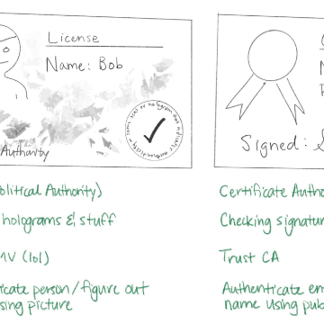

Everything you should know about certificates and PKI but are too afraid to ask

Everything you should know about certificates and PKI but are too afraid to ask

https://smallstep.com/blog/everything-pki.html

Certificates and public key infrastructure (PKI) are hard. No shit, right? I know a lot of smart people who've avoided this particular rabbit hole. Personally, I avoided it for a long time and felt some shame for not knowing more. The obvious result was a vicious cycle: I was too embarrassed to ask questions so I never learned. Eventually I was forced to learn this stuff because of what it enables: PKI lets you define a system cryptographically. It's universal and vendor neutral. It works everywhere so bi