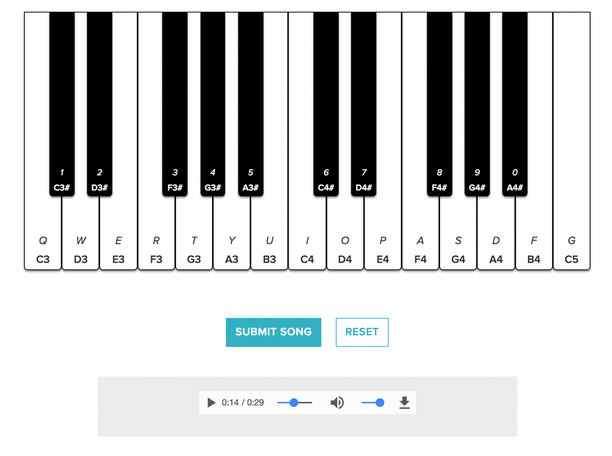
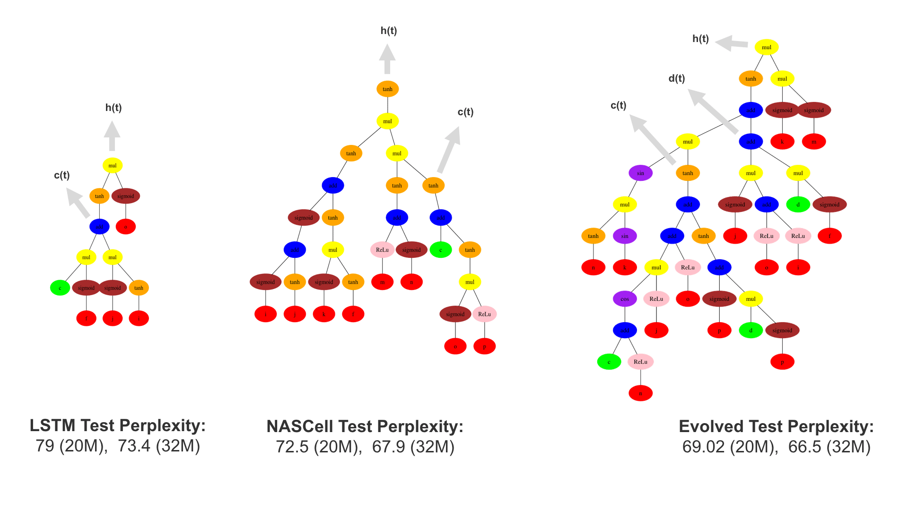
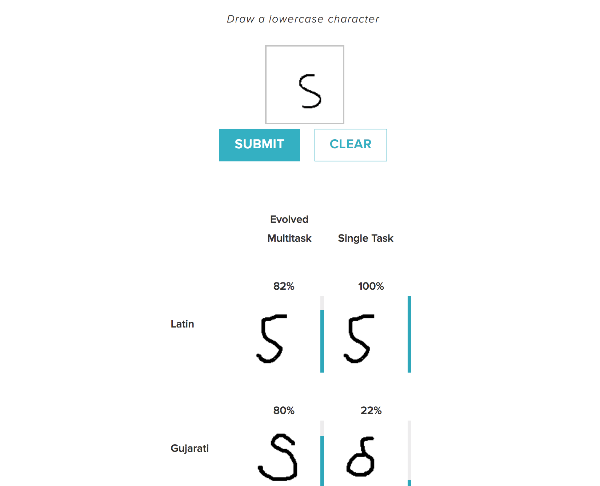
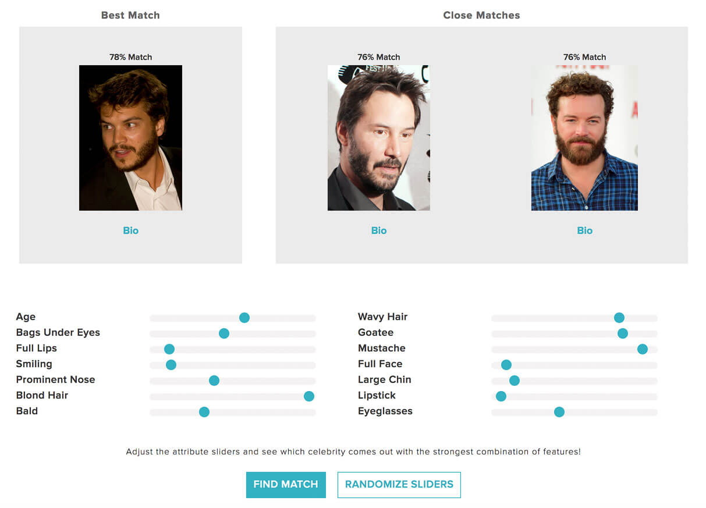

Evolution is the New Deep Learning

# Evolution is the New Deep Learning

By [Risto Miikkulainen](https://www.linkedin.com/in/risto-miikkulainen-ab43b9b8/)

Vice President Research; Professor of Computer Science at the University of Texas at Austin

*[If you are visiting from Hacker News, please be sure to check out the [papers responsible](https://www.sentient.ai/sentient-labs/ea/) for the development of these apps].*

At Sentient, we have an entire team dedicated to research and experimentation in AI. Over the past few years, the team has focused on developing new methods in Evolutionary Computation (EC), i.e. designing artificial neural network architectures, building commercial applications, and solving challenging computational problems using methods inspired by natural evolution. This research builds upon more than 25 years of research at UT Austin and other academic institutions, and coincides with related efforts recently at [OpenAI](https://blog.openai.com/evolution-strategies/), [DeepMind](https://deepmind.com/blog/population-based-training-neural-networks/), [Google Brain](https://arxiv.org/abs/1802.01548), and [Uber](https://eng.uber.com/deep-neuroevolution/). There is significant momentum building in this area; indeed, we believe evolutionary computation may well be the next big thing in AI technology.

Like Deep Learning (DL), EC was introduced decades ago, and it is currently experiencing a similar boost from the available big compute and big data. However, it addresses a distinctly different need: Whereas DL focuses on modeling what we already know, EC focuses on creating new knowledge. In that sense, it is the next step up from DL: Whereas DL makes it possible to recognize new instances of objects and speech within familiar categories, EC makes it possible to discover entirely new objects and behaviors—those that maximize a given objective. Thus, EC makes a host of new applications possible: designing more effective behaviors for robots and virtual agents; creating more effective and cheaper health interventions, growth recipes for agriculture, and mechanical and biological processes.

Today, Sentient released five papers and a [web portal](https://www.sentient.ai/sentient-labs/ea/) reporting significant progress in taking this step, focusing on three areas: (1) DL architectures are evolved to exceed state of the art in three standard machine learning benchmarks; (2) techniques are developed for increasing performance and reliability of evolution in real-world applications; and (3) evolutionary problem solving is demonstrated on very hard computational problems.

This post focuses on the first of these areas, i.e. optimization of DL architectures with EC.

## Sentient Reveals Breakthrough Research in Neuroevolution

Much of the power of deep learning comes from the size and complexity of the networks. With neuroevolution, the DL architecture (i.e. network topology, modules, and hyperparameters) can be optimized beyond human ability. The three demos that we will cover in this article are Omni Draw, Celeb Match, and the Music Maker (Language Modeling). In all three examples, Sentient successfully surpassed the state-of-the-art DL benchmark using neuroevolution.

#### [Music Maker (Language Modeling)](https://www.sentient.ai/sentient-labs/ea/lstm-music/)

In the Language Modeling domain, the system is trained to predict the next word in a “language corpus”, i.e. a large collection of text such as several years of the Wall Street Journal. After the network has made its prediction, this input can be looped back into its input, and the network can generate an entire sequence of words. Interestingly, the same technique applies equally well to musical sequences, where it makes for a fun demo. The user inputs a few initial notes, and the system improvises an entire melody based on that starting point. By means of neuroevolution, Sentient optimized the design of the gated recurrent (Long Short-Term Memory or LSTM) nodes (i.e. the network’s “memory” structure) to make the model more accurate in predicting the next note.

[(L)](https://www.sentient.ai/sentient-labs/ea/lstm-music/)

In the language modeling domain (i.e. predicting the next word in a language corpus called [Penn Tree Bank](https://catalog.ldc.upenn.edu/ldc99t42)), the benchmark is defined by Perplexity Points, a measurement of how well a probabilistic model can predict real samples. The lower the number the better, as we want the model to be less “perplexed” when predicting the next word in a sequence. In this case, Sentient beat the standard LSTM structure by 10.8 Perplexity Points. Remarkably, although several human-designed LSTM variations have been proposed, they have not improved performance much—LSTM structure was essentially unchanged for 25 years. Our [neuroevolution experiments](https://www.sentient.ai/sentient-labs/ea/lstm/) showed that it can, as a matter of fact, be improved significantly by adding more complexity, i.e. memory cells and more nonlinear, parallel pathways.

[(L)](https://www.sentient.ai/sentient-labs/ea/lstm/)

Why does this breakthrough matter? Language is a powerful and complex construct of human intelligence. Language modeling, i.e. predicting the next word in a text, is a benchmark that measures how well machine learning methods can learn language structure. It is therefore a surrogate for building natural language processing systems that includes speech and language interfaces, machine translation (such as Google Translate), and even medical data such as DNA sequences and heart rate diagnosis. The better we can do in the language modeling benchmark, the better language processing systems we can build, using the same technology.

#### [Omni Draw](https://www.sentient.ai/sentient-labs/ea/omni-draw/)

Omniglot is a handwritten character recognition benchmark on recognizing characters in 50 different alphabets, including real languages like Cyrillic (written Russian), Japanese, and Hebrew, to artificial languages such as Tengwar (the written language in Lord of the Rings).

[(L)](https://www.sentient.ai/sentient-labs/ea/omni-draw/)

This demo showcases multitask learning, in which the model learns all languages at once and exploits the relationship between characters from different languages. So, for instance, the user inputs an image and the system outputs suggestions for different character matches in different languages, saying “this would be ‘X’ in Latin, ‘Y’ in Japanese, and ‘Z’ in Tengwar, etc.”—taking advantage of its understanding of the relationships between Japanese, Tengwar, and Latin to figure out which character is the best match. This differs from a single task learning environment where the model trains on one language at a time and cannot make the same connections across language data sets.

In this Omniglot multitask character recognition task, our research team improved error of character matching from **32% to 10%.**

Omniglot is an example of a dataset that has relatively little data per language—for instance, it may have only a few characters in Greek but many in Japanese. It succeeds by using its knowledge of the relationships between languages to find solutions, hence, finding a solution in the face of missing or sparse data. Why is this important? For many real world applications, labeled data is expensive or dangerous to acquire (e.g., medical applications, agriculture, and robotic rescue), hence automatically designing models that exploit the relationships to *similar* or related datasets could, in a way, substitute the missing dataset and boost research capabilities. It is also an excellent demonstration of the power of neuroevolution: there are many ways in which the languages can be related, and evolution discovers the best ways to tie their learning together.

#### [Celeb Match](https://www.sentient.ai/sentient-labs/ea/celeb-match/)

The Celeb Match demo deals similarly with multitask learning, but this time, with a large-scale data sets. The demo is based on the CelebA dataset, which consists of around 200,000 images of celebrities, each of which is labeled with 40 binary attributes such as “Male vs. Female”, “beard vs. no beard”, “glasses vs. no glasses”, etc. Each attribute induces a “classification task” that induces the system to detect and identify each attribute. As a fun add-on, we’ve created a demo that turns this task around: The user can set the desired degree for each attribute, and the system finds the closest celebrity match, as determined by the evolved multitask learning network. For instance, if the current attribute settings result in an image of Brad Pitt, the user can increase “gray hair” to find which celebrity would be similar to Brad Pitt but with different hair.

[(L)](https://www.sentient.ai/sentient-labs/ea/celeb-match/)

In this domain, the state-of-the-art benchmark is the test error across all attributes, i.e. whether the system detected the attribute correctly (male/female, young/mature, large eyes/small eyes), etc. In the CelebA multitask face classification domain, Sentient used evolutionary computation to optimize the networks that detect these attributes, reducing error from **8.00% to 7.94%** for an ensemble (an average of) three models.

This technology is a step forward in the ability for AI to predict diverse attributes of people, places, and things in the physical world. Unlike networks trained to find similarities based on abstract, learned features, it makes the similarities semantic and interpretable.

#### Just the Tip of the Iceberg!

Omni Draw, Celeb Match, and the Music Maker are just three examples of interactive demos that illustrate the power of [neuroevolution](https://www.sentient.ai/sentient-labs/ea-1/). We invite you to learn more about the technology behind them on our website and papers, as well as the two other aspects of evolution as the next deep learning: [commercialization](https://www.sentient.ai/sentient-labs/ea-2/) and [solving hard problems](https://www.sentient.ai/sentient-labs/ea-3/).

Read more on our evolution research web portal, [Evolution is the New Deep Learning](https://www.sentient.ai/sentient-labs/ea/).