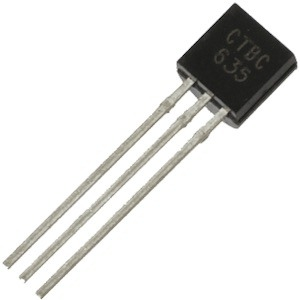
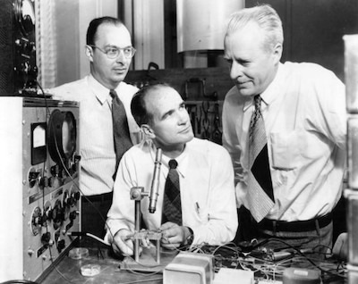
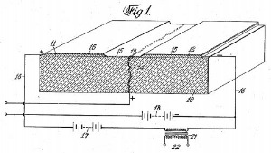
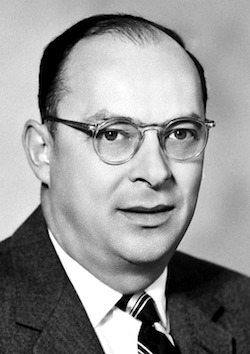
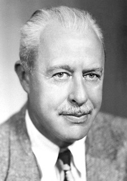
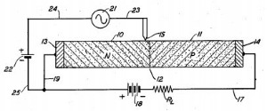
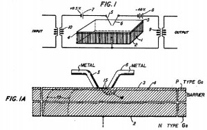

Evolution of the Transistor: Shockley, Bardeen and Brattain discover foundation of modern electronics in 1947 - IPWatchdog.com | Patents & Patent Law

# Evolution of the Transistor: Shockley, Bardeen and Brattain discover foundation of modern electronics in 1947

By [**Steve Brachmann**](http://www.ipwatchdog.com/author/sbrachmann/)
April 3, 2017
6
[Print Article](#)
 AddThis Sharing Buttons

[Share to TwitterTwitter]()[Share to FacebookFacebook34]()[Share to LinkedInLinkedIn21]()[Share to Google+Google+]()[Share to EmailEmail]()[Share to MoreMore12]()

“BC635 Transistor” by Aminba1376. Licensed under CC BY-SA 4.0.

One of the foundational elements of all electronic devices today is the [transistor](https://en.wikipedia.org/wiki/Transistor), a semiconductor device including three terminals which is capable of amplifying an electric current or voltage which is applied to one of the terminals and output through another terminal. It’s no understatement to say that modern electronic devices couldn’t function without a component that can process electrical signals in the manner accomplished by a transistor. Yesterday’s transistors have largely been replaced by today’s [integrated circuits](https://en.wikipedia.org/wiki/Integrated_circuit), which are capable of much more complex processing of electrical signals, but the discovery of the transistor was a huge turning point in the electronics industry of the mid-20th century. The invention of the transistor has been [hailed as a milestone achievement by the Institute of Electrical and Electronics Engineers](http://ethw.org/Milestones:Invention_of_the_First_Transistor_at_Bell_Telephone_Laboratories,_Inc.,_1947) (IEEE). In 2011, state-of-the-art processing units [contained as many as 2.9 billion transistors on a single chip](https://www.cnet.com/news/ati-and-nvidia-face-off-obliquely/).

(L to R) John Bardeen, William Shockley and Walter Brattain. Picture by AT&T. Public domain.

In 1974, a trio of engineering luminaries were inducted into the [National Inventors Hall of Fame](http://www.invent.org/) for their seminal contributions to the creation of the transistor. [William B. Shockley](http://www.invent.org/honor/inductees/inductee-detail/?IID=134), [John Bardeen](http://www.invent.org/honor/inductees/inductee-detail/?IID=8) and [Walter H. Brattain](http://www.invent.org/honor/inductees/inductee-detail/?IID=19) are the trio credited with developing the first commercially successful transistor product in the 1940s at the widely heralded American research and development facility [Bell Labs](https://en.wikipedia.org/wiki/Bell_Labs). This April 4th marks the 67th anniversary of the issue date for one of two patents for which this trio of innovators has been inducted into the Hall of Fame, giving us a good occasion to look back at the development of this incredibly important 20th century invention.

## **De Forest’s Audion Enables Amplification in Vacuum Tubes, But Issues Remained**

For decades prior to the advent of the transistor, the amplification of electrical signals was achieved through the use of [vacuum tubes](https://en.wikipedia.org/wiki/Vacuum_tube). Invented in 1904 by British electrical engineer [John Ambrose Fleming](https://en.wikipedia.org/wiki/John_Ambrose_Fleming), [vacuum tubes consisted of two electrodes within a glass-enclosed vacuum](http://www.pbs.org/transistor/science/events/vacuumt.html) which enabled an electric current to flow between the two electrodes. Although Fleming invented the first widely used vacuum tube, the first “audion” vacuum tube device capable of amplification was invented in 1907 by American inventor [Lee De Forest](https://en.wikipedia.org/wiki/Lee_de_Forest), a pioneer in early radio and motion picture technologies. Such amplification enabled electrical currents to be directed further along a cable without weakening.

The ability to control and amplify an electric current using vacuum tubes made these devices an incredibly important component of electronic systems built in the early 20th century. For example, De Forest’s audions became a central component to the first cross-country telephone line constructed by AT&T [which could transmit a telephone call signal up to 3,400 miles by July 1914](http://www.pbs.org/transistor/background1/events/transcon.html). Audions installed in Pittsburgh, Omaha and Salt Lake City supported this first cross-country phone line by boosting the call’s electrical signal at strategic points along the way.

The vacuum tube did have serious drawbacks which the transistor would improve upon, however. Vacuum tubes were constructed of glass and any cracks would disrupt the vacuum and cause the tube to stop working properly. Vacuum tubes would also generate a great deal of heat which increases the risk of glass cracking and contributes to the degeneration of internal components.

## **Early Semiconductor Advances Pave the Way Towards the Transistor**

These shortcomings in conventional vacuum tubes attracted the attention of engineers at Bell Labs, which was operated by AT&T, as early as the 1930s when research director [Mervin Kelly](https://en.wikipedia.org/wiki/Mervin_Kelly) reasoned that the nascent field of semiconductors might hold the answer. Scientific research into the electrical resistance and conductivity properties of semiconductor material goes back as far as the early 19th century to the days of the very influential British scientist [Michael Faraday](https://en.wikipedia.org/wiki/Michael_Faraday). In the early 20th century, the body of knowledge surrounding [solid-state physics](https://en.wikipedia.org/wiki/Solid-state_physics), especially the atomic properties of solid materials, began to grow. In 1914, Johann Koenigsberger, a physics professor at Germany’s [University of Freiburg](https://www.uni-freiburg.de/?set_language=en), [created three classifications for solid-state materials based on conductivity](http://www-old.itl.waw.pl/czasopisma/JTIT/2010/1/3.pdf): metals, insulators and variable conductors.

The transistor resulting from the Bell Labs research project would not be the world’s first transistor, however. The first patent covering what could be considered a field-effect transistor was filed in 1926 by Austro-Hungarian-American physicist [Julius Edgar Lilienfeld](https://en.wikipedia.org/wiki/Julius_Edgar_Lilienfeld). In January 1930, Lilienfeld was issued [U.S. Patent No. 1745175](http://www.freepatentsonline.com/1745175.pdf), titled *Method and Apparatus for Controlling Electric Currents*. The patent claimed the method of controlling the flow of an electric current in an electrically conducting medium of minute thickness by subjecting the medium to an electrostatic influence to impede the flow of the current by maintaining a potential in excess of the particular potential prevailing at an intermediate point. As Lilienfeld’s patent notes, “the present invention has for its object to dispense entirely of devices relying upon the transmission of electrons through an evacuated space.” Unfortunately, the work of neither Lilienfeld nor [Oskar Heil](https://en.wikipedia.org/wiki/Oskar_Heil), a German electrical engineer who also patented a transistor invention in Europe in 1934, gained much notoriety as [neither inventor published much research or left much of a record of their inventions](http://www.computerhistory.org/siliconengine/field-effect-semiconductor-device-concepts-patented/).

William B. Shockley. Picture by the Nobel Foundation. Public domain.

By the 1940s, then, the state of development into transistors had been brewing to the point that a commercially successful product would be ready before too long. By 1945, Kelly had the team in place at Bell Labs which would alight on this discovery, led by American physicist [William Shockley](https://en.wikipedia.org/wiki/William_Shockley). Shockley’s team included fellow American physics experts [John Bardeen](https://en.wikipedia.org/wiki/John_Bardeen) and [Walter Brattain](https://en.wikipedia.org/wiki/Walter_Houser_Brattain) as well as chemists [Stanley Morgan](https://www.aip.org/history-programs/niels-bohr-library/oral-histories/4785) and [Robert Gibney](http://www.pbs.org/transistor/album1/addlbios/gibney.html); the team also received input from physicist [Gerald Pearson](https://en.wikipedia.org/wiki/Gerald_Pearson), who would later achieve greater fame at Bell Labs as one of the developers of the first practical photovoltaic, or solar, cell.

John Bardeen. Picture by the Nobel Foundation. Public domain.

**Shockley’s Field-Effect Failure is Converted Into Success by Bardeen and Brattain**

In the spring of 1945, the efforts of Shockley’s team were directed at creating a semiconductor amplifier which worked on the principle of the [field effect](http://www.pbs.org/transistor/science/info/transmodern.html), a principle which theorizes that a strong electrical field could cause electricity to flow through a nearby semiconductor. Shockley put this theory into practice by construction a silicon-coated cylinder mounted next to a plate of metal. Experiments using an external electrical field could not bring a working transistor to fruition, however, frustrating the group’s activities time and again.

Walter H. Brattain. Picture by the Nobel Foundation. Public domain.

It would take a breakthrough insight by Bardeen, working remotely with Brattain at Bell Labs’ facility in Murray Hill, NJ, to bring the Bell Labs research team within striking distance of a working field-effect transistor. Ordered by Shockley to determine why the silicon field-effect device wasn’t working, Bardeen theorized that local variations in the surface state of a metal could trap charge carriers and cause failures in conductivity. Bardeen and Brattain went ahead with efforts to create point contacts between a semiconductor and conducting wires which were surrounded by electrolytes, working mainly with gold leaf contacts applied to a surface of germanium. The duo discovered that the introduction of gold leaf to the germanium increased the concentration of holes for electrons at the germanium’s surface and created electron collector and emitter layers, an early form of what is known today as a [p-n junction](https://en.wikipedia.org/wiki/P%E2%80%93n_junction) in semiconductors. In December 1947, Bardeen and Brattain successfully created the world’s first [point-contact transistor](https://en.wikipedia.org/wiki/Point-contact_transistor).

Successful research and development teams don’t always get along, however, and the next episode of the invention of the transistor was fueled in no small part by Shockley’s fiery personality. Angered that he was not directly involved with Bardeen and Brattain’s work (indeed, the two reportedly changed their focus based on Bardeen’s surface state theory without telling Shockley), [Shockley hid himself away in a hotel room in Chicago](http://www.pbs.org/transistor/album1/) where he designed the [junction, or sandwich, transistor](http://www.pbs.org/transistor/science/events/sandtran.html) over the course of four weeks; the first working model would come two years later. So-called because of its layered structure, the sandwich transistor was covered on either side by a collector and an emitter layer with a transistor base sandwiched between those two layers. This device allowed an electric current to enter the transistor base, which was missing electrons, and amplify the signal being sent from the collector layer to the emitter layer.

The rifts developing between Shockley and the duo of Bardeen and Brattain was no small part of public relations concern for Bell Labs. Although the patent only lists Shockley as inventor, all three are inducted into the National Inventors Hall of Fame for [U.S. Patent No. 2502488](http://www.freepatentsonline.com/2502488.pdf), titled *Semiconductor Amplifier* and issued April 4th, 1950. It claimed a transmitting device composed of a semiconductor material having zones of opposite conductivity type separated by a barrier, an ohmic connection to each zone remote from the barrier and a rectifying contact on one zone closely adjacent to the barrier. The patent does reference a patent application filed by Bardeen and Brattain as a reference for energy relations within a semiconductor.

The second patent for which this trio is inducted into the Hall of Fame is [U.S. Patent No. 2524053](http://www.freepatentsonline.com/2524035.pdf), issued October 3rd, 1950, under the title *Three-Electrode Circuit Element Utilizing Semiconductor Materials* and listing Bardeen and Brattain as inventors. This patent disclosed a circuit element composed of a block of semiconductor material with a body of one conductivity type and a thin surface layer of an opposite conductivity type, an emitter electrode making contact with the surface layer, a collector electrode making contact with the surface to collect current spreading from the emitter electrode and a base electrode making contact with the body of the block. The patent discusses the use of n-type and p-type layers in semiconductors and notes that past attempts to create such devices for current amplification have failed to be commercially successful.

The contributions of these three scientists towards this fundamental discovery in electrical engineering resulted in them being jointly named the winners of the [1956 Nobel Prize in Physics](https://www.nobelprize.org/nobel_prizes/physics/laureates/1956/index.html). The three would go on to earn an incredible amount of recognition for this and other scientific discoveries. Shockley would go on to be an incredibly prolific inventor, [listed as an inventor on 90 U.S. patents](http://ethw.org/William_Shockley), but he became ostracized from the scientific community later in life as he increasingly became a contentious proponent of race-based eugenics. Bardeen would go on to become the only person to win two Nobel Prizes in Physics when he was named along with [Leon Neil Cooper](https://en.wikipedia.org/wiki/Leon_Cooper) and [John Robert Schrieffer](https://en.wikipedia.org/wiki/John_Robert_Schrieffer) as Nobel laureates [for their jointly developed theory of superconductivity](http://www.nobelprize.org/nobel_prizes/physics/laureates/1972/), an important technological aspect underpinning supercomputers. As for the transistor, any reader should be able to appreciate that without this tiny building block of electrical engineering, they couldn’t have finished reading this article using a computing device.

####

 AddThis Sharing Buttons

[Share to TwitterTwitter]()[Share to FacebookFacebook34]()[Share to LinkedInLinkedIn21]()[Share to Google+Google+]()[Share to EmailEmail]()[Share to MoreMore12]()

#### The Author

[Steve Brachmann](http://www.ipwatchdog.com/author/sbrachmann/) is a writer located in Buffalo, New York. He has worked professionally as a freelancer for more than a decade. He has become a regular contributor to IPWatchdog.com, writing about technology, innovation and is the primary author of the [Companies We Follow](http://www.ipwatchdog.com/category/companies/) series. His work has been published by *The Buffalo News*, *The Hamburg Sun*, USAToday.com, Chron.com, Motley Fool and OpenLettersMonthly.com. [Steve](https://plus.google.com/116275452101893310100?rel=author) also provides website copy and documents for various business clients.

[(L)](https://twitter.com/Steve_Brachmann)[(L)](https://www.linkedin.com/in/sjbrachmann)

**Tags:**[famous inventors](http://www.ipwatchdog.com/tag/famous-inventors/), [hall of fame](http://www.ipwatchdog.com/tag/hall-of-fame/), [inventors hall of fame](http://www.ipwatchdog.com/tag/inventors-hall-of-fame/), [John Bardeen](http://www.ipwatchdog.com/tag/john-bardeen/), [Nation Inventor's Hall Of Fame](http://www.ipwatchdog.com/tag/nation-inventors-hall-of-fame/), [national inventors hall of fame](http://www.ipwatchdog.com/tag/national-inventors-hall-of-fame/), [patent](http://www.ipwatchdog.com/tag/patent/), [patents](http://www.ipwatchdog.com/tag/patents/), [transistors](http://www.ipwatchdog.com/tag/transistors/), [Walter Brattain](http://www.ipwatchdog.com/tag/walter-brattain/), [William Shockley](http://www.ipwatchdog.com/tag/william-shockley/)

**Posted In:**[AT&T](http://www.ipwatchdog.com/category/companies/att-companies/), [Electronics](http://www.ipwatchdog.com/category/tech-blog/electronics/), [IP News](http://www.ipwatchdog.com/category/news/), [IPWatchdog Articles](http://www.ipwatchdog.com/category/ipwatchdog-articles/), [IPWatchdog.com Articles](http://www.ipwatchdog.com/category/blog/), [Materials](http://www.ipwatchdog.com/category/tech-blog/materials/), [Patents](http://www.ipwatchdog.com/category/patent-blog/), [Semiconductors](http://www.ipwatchdog.com/category/tech-blog/semiconductors-tech-blog/), [Technology & Innovation](http://www.ipwatchdog.com/category/tech-blog/)

**Warning & Disclaimer**: The pages, articles and comments on IPWatchdog.com do not constitute legal advice, nor do they create any attorney-client relationship. The articles published express the personal opinion and views of the author and should not be attributed to the author’s employer, clients or the sponsors of IPWatchdog.com. [Read more](http://www.ipwatchdog.com/about/not-legal-advice-just-an-informed-opinion/).

[(L)](http://www.ipwatchdog.com/szbl-content-block/ad-post-comments/)

#### Discuss this

There are currently **6 Comments** comments.[Join the discussion](http://www.ipwatchdog.com/2017/04/03/transistor-shockley-bardeen-brattain-modern-electronics/id=79427/#respond).

1. **AC**  April 3, 2017 3:54 pm

I would also point out that Bardeen won for both experimental work (transistor) and theoretical work (“classical” BCS superconductivity). Truly one of the great innovative engineering minds of the 20th century.

2. **step back**  April 3, 2017 4:10 pm

But the transistor is merely a fundamental building block of human ingenuity as are all “generic” computer related devices and methods and thus is patent ineligible.

The SCOTeti hath spoken and so it must be so.
/end sarcasm 😉
3. **Gene Quinn**  April 3, 2017 4:21 pm
Step-

“A transistor is a semiconductor device used to amplify or switch electronic signals and electrical power.” See: https://en.wikipedia.org/wiki/Transistor

Sounds pretty abstract to me too. Far more abstract than the MRI machine that the PTAB said was abstract back at the end of 2016.

-Gene
4. **step back**  April 3, 2017 9:12 pm
Gene–
Agreed.
“Semiconducting” is merely a natural phenomenon free for all men to partake of.

“Switching” is a natural outcome of applying Samuel Morse’s conventional electro-motive forces to the naturally occurring semiconductive elements.

Merely “isolating” germanium or silicon and merely crowding dopants in one side or another is not a “significantly more” event because crowding of this sort happens in the organizing of funda-mental human activities such as having too many patients packed into one dorm or another of an asylum.

(p.s. No hint intended here that the SCOTeti occupy a dorm.)
😉
https://patentu.blogspot.com/2017/03/the-hitchikers-guide-through-judicial.html
5. **vic kley**  April 4, 2017 2:59 pm

Julius Edgar Lilienfeld was the inventor not only of an early transistor but also of the transistor type (Field Effect) that has dominated and continues to dominate the field of integrated circuits and microcomputers. In numbers alone it makes any subsequent claims and awards to the Shockley team and its related entities are lies and frauds including those by the Swedish blind men who choose Nobel winners.

Austrian Jew Julius Edgar Lilienfeld invented it two decades before Shockley’s team and he has the patent to prove it. Nothing else including sparse follow on publications and other BS by the antisemite Shockley, AT&T and other thieves should matter.

The idea that an inventor has some obligation to manufacture or otherwise promote an invention is exactly an idea promoted by large entities to steal inventions from others.

6. **Anon**  April 4, 2017 5:24 pm

Nice post and some interesting comments. Fortunately Lilienfeld’s name is not forgotten and I certainly have fond memories of Bardeen strolling the halls of Loomis Labs. Politics (personal, governmental, commercial) seldom mesh well with science, as we know from permissible hindsight. Some additional insight by Howard Huff:

Point-contact semiconductor amplifier (transistor action), evolved (significantly) from studies on Shockley’s field-effect principle – Invented by Bardeen and Brattain on December 16, 1947, for which they received a patent on October 3, 1950 – Shockley not co-patent holder with Bardeen and Brattain since his scientific contribution of field-effect principle anticipated through previous patent awarded to Lilienfeld in 1930

John Bardeen, co-inventor of point-contact transistor and inventor of MOS transistor, may rightly be called father of modern electronics.

### Post a Comment

Respectfully add to the discussion.

###

**Name ***
**Email ***
**Website**

Notify me of followup comments via e-mail. You can also [subscribe](http://www.ipwatchdog.com/comment-subscriptions/?srp=79427&srk=dec02b88ca7ebdc99707f3c3955b58d7&sra=s&srsrc=f) without commenting.