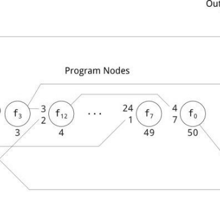

Evolutionary algorithm outperforms deep-learning machines at video games

Evolutionary algorithm outperforms deep-learning machines at video games

https://www.technologyreview.com/s/611568/evolutionary-algorithm-outperforms-deep-learning-machines-at-video-games/

Neural networks have garnered all the headlines, but a much more powerful approach is waiting in the wings.