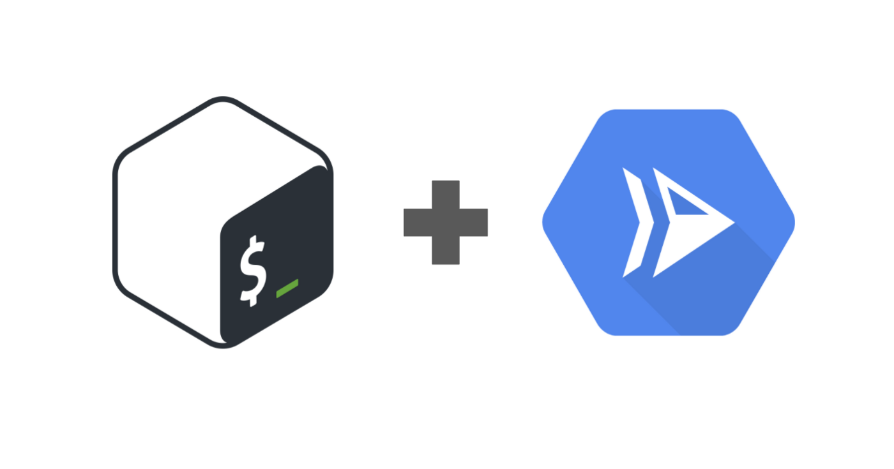

Executing bash scripts with a webhook in Google Cloud

# Executing bash scripts with a webhook in Google Cloud

[Anshu Rao](https://medium.com/@anshu.rao?source=post_page-----75ea4b173c9----------------------)

[Apr 27](https://medium.com/google-cloud/executing-bash-scripts-with-a-webhook-in-google-cloud-75ea4b173c9?source=post_page-----75ea4b173c9----------------------) · 4 min read

I recently came across an interesting question about automation in GCP: *How can I trigger a bash script off a webhook?* It’s a seemingly common automation challenge, but the solution wasn’t completely obvious.

This gets especially tricky when you have a more complex bash script with certain binary dependencies. A really good example of this problem is running a script to scan your Google Cloud organization for publicly available functions, a challenge that [Thomas Ruble](http://www.medium.com/@truble) tackled in his [Medium article](https://medium.com/@truble/scan-your-google-cloud-projects-for-open-cloud-functions-531a57304ade). It’s an interesting read, check it out if you haven’t already!

|     |     |
| --- | --- |
| 1   | #!/bin/bash |
| 2   |     |
| 3   | set -e |
| 4   |     |
| 5   | # This script outputs all the projects that have unauthenticated cloud functions |
| 6   | # Outputs a newline separated list of public functions in the comma-separated format: FUNCTION_NAME,PROJECT_ID |
| 7   |     |
| 8   | if [ $#  -ne 1 ] |
| 9   | then |
| 10  |  echo  "Usage: scan.sh ROOT_FOLDER_ID" |
| 11  |  exit 1 |
| 12  | fi  |
| 13  |     |
| 14  | function  search_project() { |
| 15  | PROJECT=$1 |
| 16  | FUNCTIONS=$(gcloud functions list --project $PROJECT --format="csv[no-heading](NAME,REGION)") |
| 17  |  for  FUNCTION  in  $FUNCTIONS;  do |
| 18  | FUNCTION_NAME=$(echo $FUNCTION  \| cut -d, -f1) |
| 19  | FUNCTION_REGION=$(echo $FUNCTION  \| cut -d, -f2) |
| 20  | PUBLIC=$(gcloud functions get-iam-policy $FUNCTION_NAME --region $FUNCTION_REGION --project $PROJECT  \| grep 'allUsers\\|allAuthenticatedUsers'  \| cat) |
| 21  |  if [ !  -z  "$PUBLIC" ];  then |
| 22  |  echo  "$FUNCTION_NAME,$PROJECT" |
| 23  |  fi |
| 24  |  done |
| 25  | }   |
| 26  |     |
| 27  | function  search_folder() { |
| 28  | FOLDER_ID=$1 |
| 29  |  for  PROJECT  in  $(gcloud projects list --filter="parent=$FOLDER_ID" --format="value(PROJECT_ID)");  do |
| 30  |  # Check if the functions API is enabled in this project |
| 31  | SERVICE_ENABLED=$(gcloud services list --project $PROJECT --filter="NAME=cloudfunctions.googleapis.com" --format="value(NAME)") |
| 32  |  if [ "$SERVICE_ENABLED"  ==  "cloudfunctions.googleapis.com" ];  then |
| 33  | search_project $PROJECT |
| 34  |  fi |
| 35  |  done |
| 36  | }   |
| 37  |     |
| 38  | function  walk() { |
| 39  | for  FOLDER  in  $(gcloud resource-manager folders list --folder $1 --format="value(ID)");  do |
| 40  | search_folder $FOLDER |
| 41  | walk $FOLDER |
| 42  | done |
| 43  | }   |
| 44  |     |
| 45  | walk $1 |

 [view raw](https://gist.github.com/the-fool/8576e541e84df65c80c449f1108c4b84/raw/015ef5587dd272ca8fa5c4e88345119a6fabefad/scan.sh)  [scan.sh](https://gist.github.com/the-fool/8576e541e84df65c80c449f1108c4b84#file-scan-sh) hosted with ❤ by [GitHub](https://github.com/)

***Note****: This bash script is from Thomas Ruble’s *[*Medium article*](https://medium.com/@truble/scan-your-google-cloud-projects-for-open-cloud-functions-531a57304ade)* on scanning public cloud functions*.

Now what if I wanted to take Thomas’ scripted solution and trigger its execution using a webhook? Essentially the end-to-end solution would be able to send an HTTP request with the necessary script arguments in the payload, execute the script, and return its results in a json response. This will open the door for more automation, service-to-service integrations, and pipeline creation.

Now that we better understand the challenge we’re aiming to solve, let’s jump right in!

## Can we run bash scripts in Cloud Functions?

At first glance, [**Google Cloud Functions**](https://cloud.google.com/functions) seems like the perfect fit for this use case. If you’re not familiar, Google Cloud Functions is a lightweight, **serverless** platform for **event-driven **functions with a fully-managed runtime environment in which your code is executed. We can setup a Cloud Function to respond to an HTTP trigger to run our code. Currently Cloud Functions supports the following runtimes:

- Node.js
- Python
- Go

It seems like we could just hand our script to a Cloud Function and we’d be good to go, but as you can see **bash** is not an available runtime environment. The next logical step seems to be to open a subprocess in a Cloud Function in order to execute our bash commands. Although this approach would work, the downside is that the [system packages available in the runtime environment](https://cloud.google.com/functions/docs/reference/python-system-packages) are limited by design, so we are unable to execute any bash commands using custom binaries.

## What about Cloud Build?

[**Google Cloud Build**](https://cloud.google.com/cloud-build) is a continuous build, test, and deploy service that executes on Google infrastructure. With Cloud Build, you can define *custom build steps *in order to execute your build, with each step taking place in a docker container. By writing your own build step, you can package your dependencies in a single container and run your shell script. The Cloud Build documentation has a [good example of this use case](https://cloud.google.com/cloud-build/docs/create-custom-build-steps#example_executing_a_shell_script_from_your_source).

But what about the webhook? Although it’s possible to invoke a Cloud Build pipeline with a call to the Cloud Build API, it’s not a good fit for our use case. Cloud Build is clunky for running a one-off script since it’s semantics are tied to source code and artifact production. Also, using the API call doesn’t do well to pass *parameters *to our bash script. In any case, Cloud Build isn’t the best answer to our problems. This is where Cloud Run comes in and saves the day!

## Cloud Run

Google’s [**Cloud Run**](https://cloud.google.com/run)**  **service is another one of Google Cloud’s **serverless **offerings, and is the best fit solution for our challenge. Cloud Run is a fully-managed compute platform that runs your stateless containers that speak HTTP. Simply provide Cloud Run with your container and Cloud Run will listen for requests or events on port 8080. Read up on Cloud Run concepts and tutorials in the [Cloud Run documentation](https://cloud.google.com/run/docs).

# Bash scripts in Cloud Run

## Creating a web server to listen to HTTP requests

Our first step is to set up a simple web server to listen to the HTTP requests we receive on port 8080. Since our application will be containerized, we can write our server in our favorite language. In this example, I’ve elected to create a lightweight Python server using [Flask](https://flask.palletsprojects.com/en/1.1.x/). Using Flask, we can create a route for our application to handle HTTP POST methods.

Next, we can add logic in the method we just created to parse and clean the request body for any arguments our bash script requires. We can set these arguments as container environment variables using os.environ which our bash script can then use.

|     |     |
| --- | --- |
| 1   | import  os, subprocess |
| 2   | from  flask  import  Flask, request, abort |
| 3   |     |
| 4   | app  =  Flask(__name__) |
| 5   |     |
| 6   | @app.route("/", methods=["POST"]) |
| 7   | def  main(): |
| 8   |  data  =  request.json |
| 9   |  os.environ["ROOT_FOLDER_ID"] =  data["root"] |
| 10  |  o  =  subprocess.run( |
| 11  | ["./scan.sh $ROOT_FOLDER_ID"], |
| 12  |  stdout=subprocess.PIPE, stderr=subprocess.STDOUT, text=True |
| 13  | )   |
| 14  |     |
| 15  |  return {"results": o.stdout} |
| 16  |     |
| 17  | if  __name__  ==  "__main__": |
| 18  |  app.run( |
| 19  |  debug=True, |
| 20  |  host="0.0.0.0", |
| 21  |  port=int(os.environ.get("PORT", 8080)) |
| 22  | )   |

 [view raw](https://gist.github.com/ChandranshuRao14/db57add49aa529792df0db899039ab62/raw/a61e19cab0e6448f6ada83d88944578c52a093ad/app.py)  [app.py](https://gist.github.com/ChandranshuRao14/db57add49aa529792df0db899039ab62#file-app-py) hosted with ❤ by [GitHub](https://github.com/)

***Note****: the Flask server must listen on the PORT environment variable as specified by the *[*container contract*](https://cloud.google.com/run/docs/reference/container-contract)*.*

## Containerizing and Deploying the Application

Now that we’ve written our web server which executes the bash script, our next step is to containerize our application. Remember that Cloud Run manages *stateless containers*, so we need to create a Dockerfile with instructions on how the container should be built. Here we can include the binaries we need in the container image so that it’s available to the bash script. Since Cloud Run accepts container images as the deployment unit, we can add any executables or system libraries to the image and use it in our application. In other words, we can package all of our dependencies for our bash script and ship it off to Cloud Run - in this case, we’ll include the Google Cloud SDK in our environment.

|     |     |
| --- | --- |
| 1   | # Use the Google Cloud SDK image. |
| 2   | FROM google/cloud-sdk |
| 3   |     |
| 4   | RUN apt-get update && apt-get install -y python3-pip python3 |
| 5   |     |
| 6   | # Copy local code to the container image. |
| 7   | ENV APP_HOME /app |
| 8   | WORKDIR $APP_HOME |
| 9   | COPY . ./ |
| 10  |     |
| 11  | # Install production dependencies. |
| 12  | RUN pip3 install Flask gunicorn |
| 13  |     |
| 14  | # Run the web service on container startup |
| 15  | CMD exec gunicorn --bind :$PORT --workers 1 --threads 8 app:app |

 [view raw](https://gist.github.com/ChandranshuRao14/9536380f954f8040a432f57bae88e96c/raw/9aa84c1a5fb2ed4745f1ffe4066adc994d51ba39/Dockerfile)  [Dockerfile](https://gist.github.com/ChandranshuRao14/9536380f954f8040a432f57bae88e96c#file-dockerfile) hosted with ❤ by [GitHub](https://github.com/)

Now that we’ve containerized our application, we can build our container, push it to GCR, and deploy it to Cloud Run. We’ll also configure the service to prevent unauthenticated access, so that we can control who has access to invoke the service using [IAM policies](https://cloud.google.com/run/docs/securing/managing-access). These two gcloud commands will take care of these steps for us:

gcloud builds submit --tag gcr.io/**$PROJECT_ID**/**$IMAGE**

gcloud run deploy --image gcr.io/**$PROJECT_ID**/**$IMAGE** --platform managed --no-allow-unauthenticated --region us-central1 **${SERVICE_NAME}**

That about wraps it up! We’ve now successfully setup a webhook to execute our function scanner.