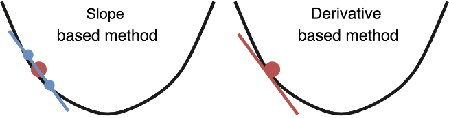
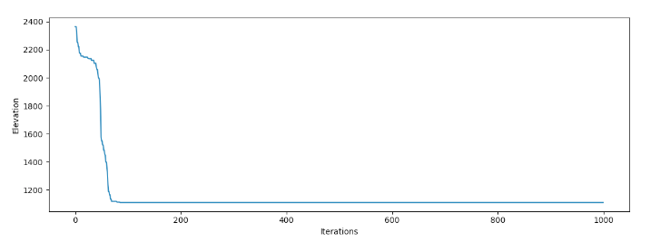

Executing gradient descent on the earth

###   [Executing gradient descent on the earth](https://fosterelli.co/executing-gradient-descent-on-the-earth)

September 19, 2017 — Chris Foster

A common analogy for explaining [gradient descent](https://spin.atomicobject.com/2014/06/24/gradient-descent-linear-regression/) goes like the following: a person is stuck in the mountains during heavy fog, and must navigate their way down. The natural way they will approach this is to look at the slope of the visible ground around them and slowly work their way down the mountain by following the downward slope.

This captures the essence of gradient descent, but this analogy always ends up breaking down when we scale to a high dimensional space where we have very little idea what the actual geometry of that space is. Although, in the end it’s often not a practical concern because gradient descent seems to work pretty well.

But the important question is: how well does gradient descent perform on the actual earth?

## Defining a cost function and weights

In a general model gradient descent is used to find weights for a model that minimizes our cost function, which is usually some representation of the errors made by a model over a number of predictions. We don’t have a model predicting anything in this case and therefore no “errors”, so adapting this to traveling around the earth requires some stretching of the usual machine learning context.

In our earth-bound traveling algorithm, our goal is going to be to find sea level from wherever our starting conditions are. That is, we will define our “weights” to be a latitude and longitude and we will define our “cost function” to be the current height from sea level. Put another way, we are asking gradient descent to optimize our latitude and longitude values such that the height from sea level is minimized. Unfortunately, we don’t have a mathematical function that describes the entire earth’s geography so we will calculate our cost values using a raster [elevation dataset](http://dwtkns.com/srtm/) available from NASA:

	import rasterio

	*# Open the elevation dataset*
	src = rasterio.open(sys.argv[1])
	band = src.read(1)

	*# Fetch the elevation*
	def get_elevation(lat, lon):
	    vals = src.index(lon, lat)
	    return band[vals]

	*# Calculate our 'cost function'*
	def compute_cost(theta):
	    lat, lon = theta[0], theta[1]
	    J = get_elevation(lat, lon)
	    return J

Gradient descent works by looking at the gradient of the cost function with respect to each variable it is optimizing for, and adjusting the variables such that they produce a lower cost function. This is easy when your cost function is a mathematical metric like mean squared error, but as we mentioned our “cost function” is a database lookup so there isn’t anything to take the derivative of.

Luckily, we can approximate the gradient the same way our human explorer in our analogy would: by looking around. The gradient is equivalent to the slope, so we will estimate the slope by taking a point slightly above our current location and a point slightly below it (in each dimension) and divide them to get our estimated derivative. This should work reasonably well:

	def gradient_descent(theta, alpha, gamma, num_iters):
	    J_history = np.zeros(shape=(num_iters, 3))
	    velocity = [ 0, 0 ]

	    for i in range(num_iters):

	        cost = compute_cost(theta)

	        *# Fetch elevations at offsets in each dimension*
	        elev1 = get_elevation(theta[0] + 0.001, theta[1])
	        elev2 = get_elevation(theta[0] - 0.001, theta[1])
	        elev3 = get_elevation(theta[0], theta[1] + 0.001)
	        elev4 = get_elevation(theta[0], theta[1] - 0.001)

	        J_history[i] = [ cost, theta[0], theta[1] ]
	        if cost <= 0: return theta, J_history

	        *# Calculate slope*
	        lat_slope = elev1 / elev2 - 1
	        lon_slope = elev3 / elev4 - 1

	        *# Update variables*
	        theta[0][0] = theta[0][0] - lat_slope
	        theta[1][0] = theta[1][0] - lon_slope

	    return theta, J_history

Great! You’ll notice that this differs from most implementations of gradient descent in that there is no X or y variables passed into this function. Our cost function doesn’t require calculating the error of any predictions, so we only need the variables we are optimizing here. Let’s try running this on [Mount Olympus](https://goo.gl/maps/Y1pHMAd3xdt) in Washington:

Hm, it seems to get stuck! This happens testing in most other locations as well. It turns out that the earth is *filled* with local minima, and gradient descent has a huge amount of difficulty finding the global minimum when starting in a local area that’s even slightly away from the ocean.

## Momentum optimization

Vanilla gradient descent isn’t our only tool in the box, so we will try [momentum optimization](http://ruder.io/optimizing-gradient-descent/index.html#momentum). Momentum is inspired by real physics, which makes the application of it to gradient descent on real geometry an attractive idea. Unfortunately, if we place even a very large bolder at the top of Mount Olympus and let it go, it’s unlikely to have enough momentum to reach the ocean, so we’ll have to use some unrealistic (in physical terms) values of gamma here:

	def gradient_descent(theta, alpha, gamma, num_iters):
	    J_history = np.zeros(shape=(num_iters, 3))
	    velocity = [ 0, 0 ]

	    for i in range(num_iters):

	        cost = compute_cost(theta)

	        *# Fetch elevations at offsets in each dimension*
	        elev1 = get_elevation(theta[0] + 0.001, theta[1])
	        elev2 = get_elevation(theta[0] - 0.001, theta[1])
	        elev3 = get_elevation(theta[0], theta[1] + 0.001)
	        elev4 = get_elevation(theta[0], theta[1] - 0.001)

	        J_history[i] = [ cost, theta[0], theta[1] ]
	        if cost <= 0: return theta, J_history

	        *# Calculate slope*
	        lat_slope = elev1 / elev2 - 1
	        lon_slope = elev3 / elev4 - 1

	        *# Calculate update with momentum*
	        velocity[0] = gamma * velocity[0] + alpha * lat_slope
	        velocity[1] = gamma * velocity[1] + alpha * lon_slope

	        *# Update variables*
	        theta[0][0] = theta[0][0] - velocity[0]
	        theta[1][0] = theta[1][0] - velocity[1]

	    return theta, J_history

With some variable tweaking, gradient descent should have a better chance of finding the ocean:

  Your browser does not support the video tag.

We have success! It’s interesting watching the behaviour of the optimizer, it seems to fall into a valley and “roll off” each of the sides on it’s way down the mountain, which agrees with our intuition of how an object with extremely high momentum should behave physically.

## Closing thoughts

The earth should actually be a *very* easy function to optimize. Since the earth is primarily covered by oceans, more than two thirds of possible valid inputs for this function return the optimal cost function value. However, the earth is plagued with local minima and non-convex geography.

Because of this, I think it provides a lot of interesting opportunities for exploring how machine learning optimization methods perform on tangible and understandable local geometries. It seems to perform pretty well on Mount Olympus, so let’s call this analogy “confirmed”!

If you have thoughts on this, let me know on [twitter](https://twitter.com/chrisfosterelli)!

The code for the project is [available here](https://github.com/chrisfosterelli/physical-gradient-descent).

 [Back to the index page](https://fosterelli.co/)