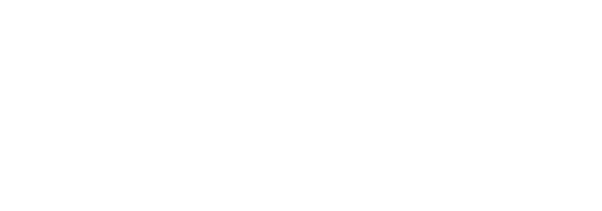
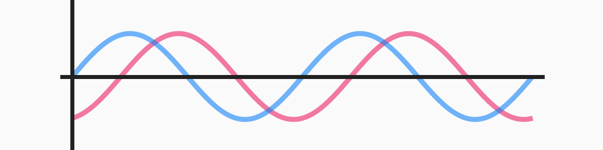
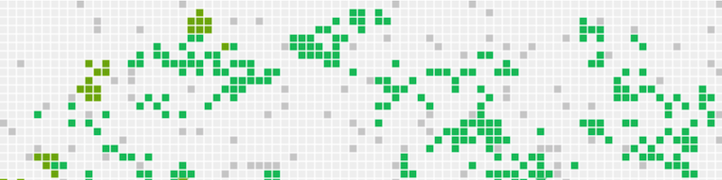
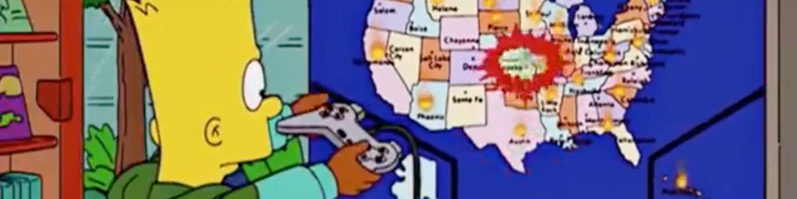
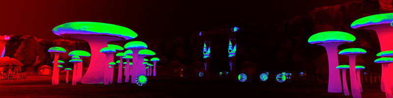

Explorable Explanations

**EXPLORABLE**
EXPLANATIONS

Lion cubs play-fight to learn social skills. Rats play to learn emotional skills. Monkeys play to learn cognitive skills. And yet, in the last century, we humans have convinced ourselves that play is useless, and learning is *supposed* to be boring.

Gosh, no wonder we’re all so miserable.

Welcome to **Explorable Explanations**, a hub for learning through play! We’re a disorganized “movement” of artists, coders & educators who want to *reunite play and learning*.

Let's get started! Check out these **3 random Explorables**:
[

★ Why Do Astronauts Float? [physics](https://explorabl.es/physics)  spaaaaace!](https://testtubegames.com/weightless.html)[

★ Let's Learn About Waveforms [math](https://explorabl.es/math)[physics](https://explorabl.es/physics)  an interactive guide to waves & harmonics](https://pudding.cool/2018/02/waveforms/)[

★ Going Critical [math](https://explorabl.es/math)[social science](https://explorabl.es/social)  how ideas & diseases spread](https://www.meltingasphalt.com/interactive/going-critical/)[

★ Mathigon [math](https://explorabl.es/math)  mathematics with playful, active learning](https://mathigon.org/)[

★ The 2018 Explorables Jam [misc](https://explorabl.es/misc)  a hackathon to explain an idea through play!](https://explorabl.es/jam/)[

★ A Slower Speed of Light [physics](https://explorabl.es/physics)  a game that shows what moving near light-speed looks like](http://gamelab.mit.edu/games/a-slower-speed-of-light/)

even more!
**Play Explorable Explanations in specific subjects:**

[art](https://explorabl.es/art)[biology](https://explorabl.es/biology)[chemistry](https://explorabl.es/chemistry)[civics](https://explorabl.es/civics)[earth science](https://explorabl.es/earth)[economics](https://explorabl.es/economics)[journalism](https://explorabl.es/journalism)[math](https://explorabl.es/math)[meta](https://explorabl.es/meta)[misc](https://explorabl.es/misc)[philosophy](https://explorabl.es/philosophy)[physics](https://explorabl.es/physics)[programming](https://explorabl.es/programming)[psychology](https://explorabl.es/psychology)[social science](https://explorabl.es/social)

**Make your own Explorable Explanations:**

[tools](https://explorabl.es/tools)[tutorials](https://explorabl.es/tutorials)[further reading](https://explorabl.es/reading)[frequently asked questions](https://explorabl.es/faq)

**See *everything* on one page:**
[ALL OF IT](https://explorabl.es/all)

Explorable Explanations is, above all, an *experiment*. None of us know anything, and that's exciting. We'd love for you to join us, in playing & making these interactive things!

There's a lot to explore with Explorable Explanations. ♥

[@explorables](https://twitter.com/explorables)[r/explorables](https://www.reddit.com/r/explorables/)

this website is open sauce

[get code & see credits!](https://github.com/explorableexplanations/explorableexplanations.github.io#explorable-explanations)

