Explore the World's Museums

Submit Museum

#

Explore the world's museums, virtually

Take a trip through the world's best virtual museums & galleries, all without leaving the house.

Filter

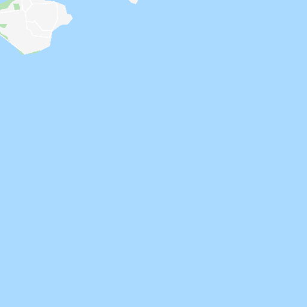
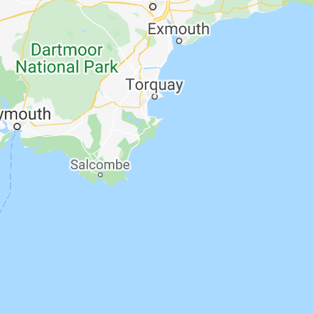
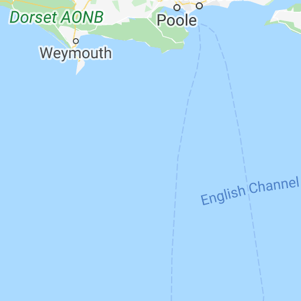
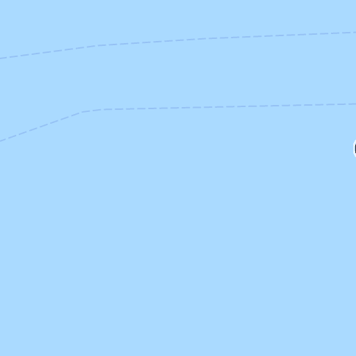

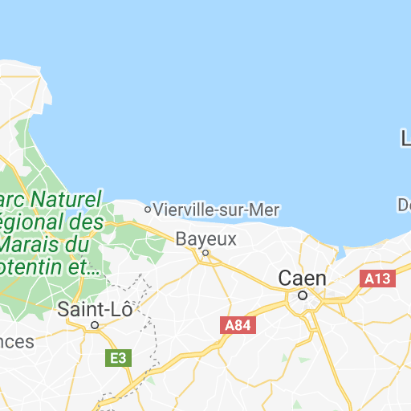
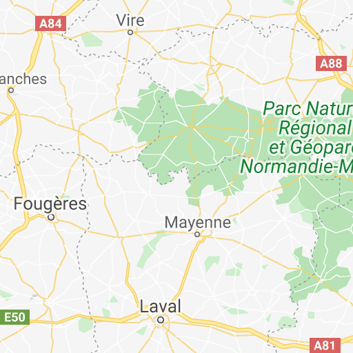

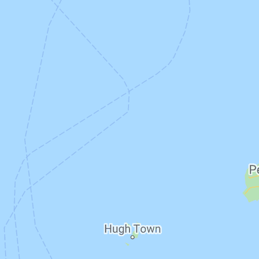
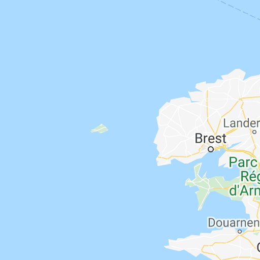
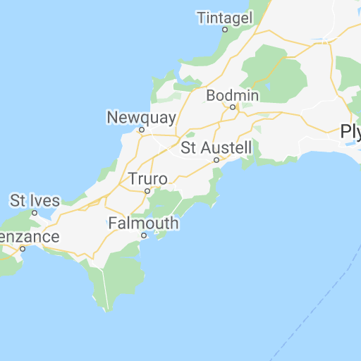
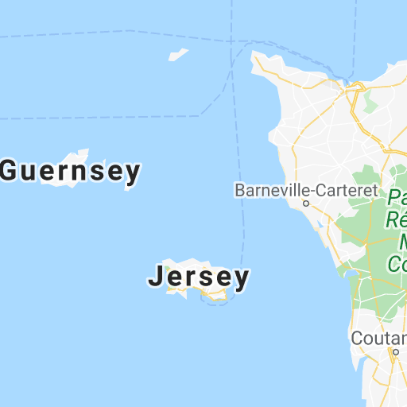
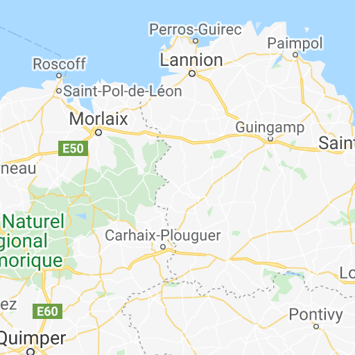
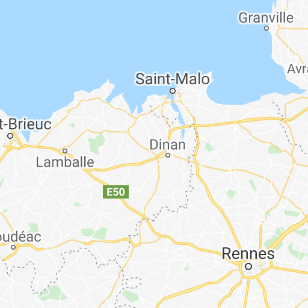

Map data ©2020 Google

[Terms of Use](https://www.google.com/intl/en_US/help/terms_maps.html)

Map
Satellite

By creating an account, you'll be able to keep track of which museums you've been to, and which you want to go back to.

✓
I agree to virtualmuseums.io's *terms and conditions*

Email

Password

What's this all about?

If you're reading this, chances are that you're stuck inside right now due to the Coronavirus outbreak. There are plenty of reasons why it can be frustrating to be stuck at home, one of which is that you can't get out and explore the world around you.

virtualmuseums.io aims to make up for this by letting you tour the world's most famous virtual museums.

What's a virtual museum?

A virtual museum is a digitised version of a real-life museum. Many virtual museums offer virtual tours, which let you walk through the museum and examine different artefacts as if you were there in person. Other virtual museums don't offer virtual tours, but do let you explore huge parts of their collections online.

Got it, but why would I actually do this?

Different people get different things from the idea of a virtual museum.

For some, virtual museums offer something to do during a lockdown that's not just binge-watching Netflix. For others, visiting virtual museums around the globe offers some of the benefits of travelling; being able to see other cultures, and learn about things outside of your immediate experience.

If you haven't tried visiting a virual museum, give it a go and see what appeals to you!

Got any questions or ideas? I'd love to hear them on Twitter *@mackgrenfell*