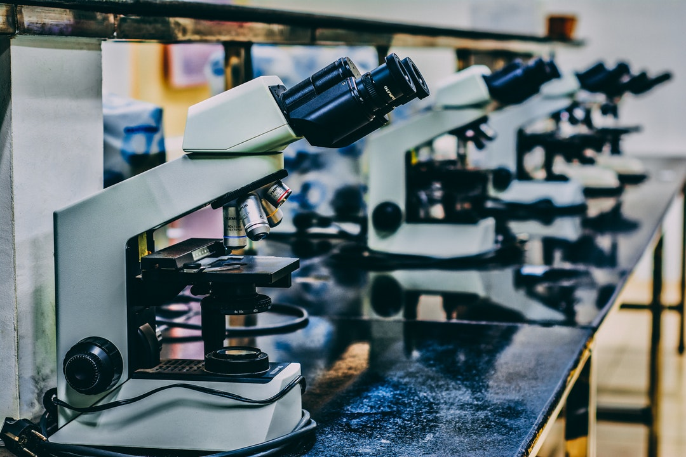
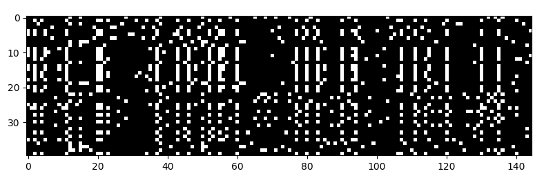

Exploring DNA with Deep Learning

 10 January 2019  /  [Humans of Machine Learning](https://blog.floydhub.com/tag/humans-of-ml/)

# Exploring DNA with Deep Learning

 

Neural networks are changing the way that Lex Flagel studies DNA.

Lex's recent paper – *[The Unreasonable Effectiveness of Convolutional Neural Networks in Population Genetic Inference](https://academic.oup.com/mbe/advance-article/doi/10.1093/molbev/msy224/5229930)* – demonstrates how simple deep learning techniques can be used to tackle the ever-changing field of DNA research.

Lex is the Quantitative Genetics Team Lead at Bayer Crop Science. At Bayer, Lex focuses on genetics, genomics, bioinformatics, and data science on crops like corn and soybeans. Don’t worry — we’ll dig into what all those terms mean! Lex has a PhD in Genetics from Iowa State University. He’s also an Adjunct Professor at the University of Minnesota.

I’m excited to share my conversation with Lex for this [Humans of Machine Learning](https://blog.floydhub.com/tag/humans-of-ml/) ([#humansofml](https://twitter.com/hashtag/HumansOfML)) interview. In this post, we’re going to learn about how Lex uses deep learning to study population genetics, as well as Lex’s own journey with data science and AI.

**So what exactly is population genetics?**

Population genetics is the study of DNA variation between individuals. For example, it can be used to determine your ancestry from your DNA sequence, or for identifying the mutations that help certain populations adapt to a new environment. It’s an area of evolutionary biology has been around for more than 100 years, and it is really benefitted in the last decade from an explosion of new DNA sequencing technologies. Today’s population geneticists have vastly more data than their predecessors had. So it’s a very exciting time to be doing population genetics.

**Most of what I know about DNA comes from the Jurassic Park animation sequence about frog blood. Can you help me understand the difference between genetics and genomics?**

Genomics deals with the construction and study of genomes.

### Ready to build, train, and deploy AI?

#### Get started with FloydHub's collaborative AI platform for free

 [ ###### Try FloydHub for free](https://www.floydhub.com/?utm_source=blog&utm_medium=banner-dl-dna&utm_campaign=try_floydhub_for_free)

**Sorry to interrupt — but what's a genome?**

A genome is the complete collection of DNA in an organism. All living species have a genome, but they vary considerably in size.  The human genome, for example, is organized into 23 chromosomes, which is a little bit like an encyclopedia being organized into 23 volumes. And to continue the metaphor, if you counted all the characters (individual DNA “base pairs”), there’d be more than 6 billion in each human genome. So it’s a really long encyclopedia.

**Okay, thanks — back to genetics versus genomics.**

Right. So, genomes are interesting to study in their own right, but they are also an essential starting point for other research. So, for example, a lot of research in population genetics involves some genomics as well. It’s kind of like astronomy (population genetics) and optics (genomics). Both are independent fields of study, but if you want to do astronomy you probably better also know a thing or two about optics.

Genetics is the study of the inheritance of traits. Genetics often starts with a variable trait (like brown vs. blue eyes), and then seeks to understand the genes in the genome that underlie it.

Ultimately, geneticists are interested in how different parts of the genome work, and so geneticists often use genomics too. Hopefully you can see that these fields aren’t separable. There is a lot of overlap between genetics, genomics, and population genetics. Many people, like myself, identify with all three of these fields.

**Okay, how about bioinformatics then?**

As I mentioned, DNA sequencing technology has exploded in the past ten years. So we now have a massive flood of DNA data, with petabytes more coming each year.

One complicating aspect of DNA sequencing is that the DNA sequences come out unordered and unstructured. So, in order to do anything useful with it, you have to sort of put together a big DNA puzzle first to get the DNA in a usable order.

Bioinformatics is a branch of computer science that helps us do this. And, as above, if you are going to study population genetics, you’ll probably also be engaged in some bioinformatics, too.

**How is population genetics traditionally studied?**
A famous population geneticist named Dick Lewontin once wrote that:

> What we can measure is by definition uninteresting, and what we are interested in is by definition unmeasurable.

That pretty much sums up population genetics. It’s a field that is always creating new methods to measure (or at least estimate) things that are not directly or easily measurable.

This is my favorite thing about population genetics, each year someone finds a new way to measure something that I would have thought impossible. For example, [a few years ago some population geneticists figured out that humans and Neanderthals must have interbred](https://www.nature.com/articles/nature12886), because many modern humans have inherited small chunks of Neanderthal DNA. They did this despite the fact that Neanderthals have been extinct for thousands of years.

Population genetics has a strong underlying tradition of mathematical and statistical theory. However, when it comes to applying this theory to real data and making inferences, population genetics is open to all kinds of methods. People are constantly introducing new ideas from different areas of math, stats, and machine learning. The practitioners in the field are mathematically sophisticated and also very pragmatic and open to anything that works.

**How is a DNA sequence traditionally represented? I’m remembering a bunch of different colored capital letters stacked together in a double-helix. **

Yeah, the double-helix is the correct chemical representation of DNA. But DNA is really special. It’s a bio-polymer made of four basic parts: Adenine, Cytosine, Guanine, and Thymine. We always call them `A`, `C`, `G`, and `T`. These four chemicals link together in any possible order making a chain, and this gives one thread of the DNA double-helix. And the second thread of the double-helix complements the first. So if you have `A` on the first thread, you have to have `T` on the second. Likewise `C` and `G` always complement each other. So knowing only one thread of the helix, you can always spell the other.

So, given all this, it means you can pick one thread of the helix and represent in a computer as a string with our four letter DNA alphabet, like `TAGCTT`, without loss of information.

But it gets more complicated, because we all carry genetic variation. So maybe in your genome it’s spelled `TA*G*CTT`, but in mine it’s spelled `TA*A*CTT`, where the asterisks mark a `G/A` mutation that distinguishes us. It’s these distinguishing mutations that populations geneticists use to make inferences about ancestry. Sometimes they represent them as letters, and sometimes they use [one-hot encoding](https://en.wikipedia.org/wiki/One-hot) to transform the DNA alphabet into a binary code.

**Can you show me an example of one-hot encoding DNA?**
Take the following DNA matrix:

	indv1 A T C C G A T C C A
	indv2 A T T C G G T C C A
	indv3 A T T C G G T C G A
	indv4 T T T C G A T C G A
	      *   *     *     *

This represents a ten letter stretch of DNA from four individuals. But only four of the columns in the DNA matrix have genetic variation (noted with asterisks under the columns in the matrix). So we’ll only retain those four columns. Then we’ll encode them as binary, where by convention we will designate as zero the letter found in `indv1`.

For example, the first column is:

	A
	A
	A
	T

We’d translate that to:

	0
	0
	0
	1

If we do this for the whole matrix, we get the following one-hot encoded 4x4 matrix:

	0000
	0110
	0111
	1101

**So what are you using these one-hot encodings for?**

One-hot encoding transforms the DNA data in a format we can use with deep learning, and also reduces the data size by throwing away all the non-mutated locations in the genome because they carry no meaningful information.

**Wait — why are the non-mutating locations not meaningful?**

Those locations contain no diagnostic information. Imagine I had a coin with heads on both sides and I told you I could flip it and predict what side is up every time. You wouldn’t be very impressed, because the only option is heads. It’s kind of the same with non-mutating sites. If every individual has the letter “T” (as in the second column of the matrix above), then there is no information for that location, and it cannot help us genetically differentiate between individuals. That location is essentially a coin with heads on both sides.

**Where did you and your team get the insight to represent these sequences as images?**

The real breakthrough here came from a team at Google and Verily. They invented a tool called [DeepVariant](https://www.nature.com/articles/nbt.4235) for identifying DNA mutations. They did this by converting DNA sequences to images and feeding them through a convolutional neural network. That was a real eye-opener. It suggested that all kinds of problems in population genetics could also be treated in this way.

**Can you show us some example images?**
Definitely. Here’s one:

One-hot encoded DNA sequences represented as an image

It’s a matrix of binary values, where each row is a different individual (40 total), and each column is is a mutation containing site (145 total) in a stretch of the genome.

Some individuals have one form of the mutation which is a “1” in the matrix (represented by white), while others have the other form, which a “0” in the matrix (represented by black).

What you get is a sort of barcode that represents the patterns of variation in the DNA data. And image recognition techniques like convolutional neural networks can work with this representation. Once we got the DNA data formatted in this way, it was pretty much all downhill. We trained convolutional neural networks to do different population genetic tasks on these DNA images.

**Can you tell me a bit more about these population genetics tasks? What tasks did your models perform?**

We identified four different tasks in population genetics. Each is inferential, meaning the thing you want to measure isn’t directly observable in the DNA data, but it can be inferred (unmeasurable but interesting, like the quote above). Also, each has it’s own associated branch of theory in and math in classical population genetics. So they are four separate kinds of problems. In the jargon of the field these task were are called:

1. detecting introgression
2. estimating historical recombination rates
3. identifying selective sweeps
4. estimating demography.

Some are a little esoteric, but detecting introgression is pretty easy to understand. Introgression just means historical interbreeding between distinct species or populations. So for example, identifying Neanderthal DNA in modern human genomes. So we treated this as a classification problem (introgression/no introgression) and trained a neural network to predict the correct class.

The other three are similarly inferential, though some are classifiers and others are regressors. The really cool thing was that the neural networks performed well in all four tasks using very similar architectures, so they are probably quite general purpose for population genetics. There’s a similarity here to a recent discover with Google’s new AlphaZero. It originally mastered the board game Go, [but it has now been shown that, with a few tweaks, it can master other board games like Chess.](https://arstechnica.com/science/2018/12/move-over-alphago-alphazero-taught-itself-to-play-three-different-games/) In both population genetics and board games this is a big deal, because historically optimizations that improve performance in one task in population genetics (or on one board game), won’t translate into improvements for other tasks. But with these deep learning approaches, it seems likely that many improvements to the neural network discovered in one task will translate to improvements in an unrelated task, just as it did between Go and Chess. So instead of each of us sort of chipping away at our own little problems in isolation, with deep learning it’s more like we are all chipping away at the same general problem.

**Are there any tradeoffs in your deep learning approach versus the traditional approach?**

Traditional techniques involve developing mathematical theory and then deriving equations from this theory to detect patterns in a DNA data matrix like the one above. For example, a classic method might involve building an equation that takes the DNA matrix as input that outputs a negative number if it appears the population is shrinking over time, a number near zero if the population size is stable, and a positive value if it’s growing. The trick is dreaming up this equation. That takes a lot of expertise. In the parlance of machine learning, the classic approach is all about building special feature extractors based on domain specific knowledge and math/stats skills.

Convolutional neural network techniques, like the ones we used, have built in feature extractors. So in a sense you offload that work to the machine. And that’s a really pretty amazing, because it’s hard work! However, there’s a catch. Though neural networks can automate feature extraction, they are poor at giving explanations of how they did it. For example, a it’s pretty easy to train a neural network to distinguish pictures of cats from pictures of dogs. But it’s really hard to get them to tell you why they think a certain picture is a cat, or what generally distinguishes cats from dogs. Our method suffers from this problem as well. So the neural networks we built can make some pretty stunning inferences, which is great, but they can’t teach you new theory or lead you to new equations. In contrast, because many classical methods in population genetics are derived from theory, they can explain themselves in the terms of that theory, which is really useful for understanding and learning.

The other limitation is the size of the input matrix. Using our methods, you can’t handle DNA images that are really huge. For example a training data set with matrices that each have 10,000 individuals (rows) by 1 million locations (columns) would be a huge computational challenge using our methods. But those kinds of data sets exist and people want to analyze them. So for now folks will either have to down-sample or compress these data sets to use our methods, or switch to classical approaches in population genetics which often scale better.

**What are the implications of your research?**

It’s very early days. Our paper just came out and in it we introduced the first step on a path toward a new kind of population genetic data analysis. This path may lead to exciting discoveries down the road, but I think right now the population genetics community is absorbing these ideas and thinking about how best to use them. People are also already thinking about making [adversarial examples](https://en.wikipedia.org/wiki/Adversarial_machine_learning), and I think there is a lot to learn about the limits of these methods by identifying DNA image inputs that fool the neural network.  So we’ll see. There is a lot of excitement around this, and some really smart folks are thinking about how best to build on our research, but research takes time. I bet in a few years we’ll see some really cool applications emerge.

**Are you solely focused on plants? Or can your research be applied to other populations — I’m thinking animals or viruses or something like that.**

Yes, any organism.  DNA is the same across all of life.
**What tools or frameworks did you use for building your neural network?**

We used Keras and TensorFlow, and did all the pre- and post-processing with Python. [Our code is on GitHub](https://github.com/flag0010/pop_gen_cnn/).

In my day job, I have access to a really well engineered cloud-based platform for doing machine learning, so I’ve gotten spoiled and I expect things to just work. I looked for the simplest turnkey option for this project and that’s how I found FloydHub. I knew within 5 minutes that I’d made the right choice. FloydHub closely matched my enterprise platform experience, which is to say it got out of my way and let me focus on the problem at hand.

**Tell me more about your team on this project. I’m interested in hearing about your real-world experiences collaborating on a deep learning project.**

It was a team effort between myself and two professors: Yaniv Brandvain at U of MN, and Dan Schrider at UNC-Chapel Hill. Yaniv and Dan are both great population geneticists who also have machine learning skills. I did most of the neural network training, but really leaned heavily on them to define the problems and to explain our results in terms that population geneticists would understand. Through our work we brought some new methods into this well established scientific field, so it was important to put them in context and explain why a practicing population geneticist should care. Since Yaniv and Dan are both practicing population geneticists, it was crucial to have their perspectives.

**I’d like to change gears a bit —what do you teach at U of MN?**

I have a courtesy “adjunct” faculty appointment at U of MN. So it’s an office, internet access, and a library card. I receive no pay and have no teaching duties. That said, I can do research with people at U of MN, like I did in this project with Prof. Brandvain.

My day job is at Bayer. My team at Bayer is in St Louis but I work remotely from Minneapolis. The position at U of MN gives me an office and like-minded researchers to interact with. So I do an industry job in an academic setting, and in my free time I pursue a little academic research like this project. It’s really a wonderful arrangement.

**How did you first get into deep learning and machine learning?**

When I left graduate school (I studied genetics), I don’t think I’d heard those terms. But when I got to industry (2012), they were really hot areas. So I learned everything in my job. I worked with machine learning experts doing projects where we were using these techniques daily. It was great, I learned by doing.

**Do you have any suggested resources or advice for people who want to get into deep learning?**

I think it’s smart to first learning the basic concepts in statistics and machine learning, and then tackle deep learning. A great free book is [An Introduction to Statistical Learning](https://www-bcf.usc.edu/~gareth/ISL/ISLR%20Seventh%20Printing.pdf). It provides a good foundation. For deep learning itself I like [this tutorial by Michael Nielsen](http://neuralnetworksanddeeplearning.com/) and a series of [beautiful videos by 3Blue1Brown](https://www.youtube.com/watch?v=aircAruvnKk&t=2s). I’ve also heard good things about [Andrew Ng’s Coursera courses](https://www.coursera.org/instructor/andrewng), but I’ve never taken them.

**Final question - is Jurassic Park going to happen in our lifetimes?**

No, I don’t think so. Getting un-degraded dinosaur DNA would be hard. It would have to sit around for millions of years. Not much can withstand those timescales on our ever-changing planet.

That said, a professor at Harvard named [George Church thinks we can bring back the Woolly Mammoth](http://https//reviverestore.org/projects/woolly-mammoth/)! I think they have DNA from a mammoth found frozen in a cave. In my opinion it’s not so far-fetched, and maybe we could resurrect mammoths in our lifetime. I’m not sure how I feel about it though, there are a lot of things to think through before we get too far down this path.

**Final final question — what’s your favorite plant?**

My favorite plants are the fragrant ones. I love fresh bright scented plants, like eucalyptus and mint. But I think my absolute favorite is balsam fir.

**Thank you, Lex! This was great. Where can people go to find out more about you and your work?**

Thank you for your interest in our project. Our paper describing these ideas just got [accepted in a journal called Molecular Biology and Evolution](https://doi.org/10.1093/molbev/msy224). Also, if this area of research is interesting to you, keep an eye out for future work by my collaborator, [Dr. Dan Schrider](https://www.schriderlab.org/). He’s cooking up new methods and applications with his lab at UNC-Chapel Hill.

### Subscribe to FloydHub Blog

Get the latest posts delivered right to your inbox

 

#### [Charlie Harrington](https://blog.floydhub.com/author/charlie/)

Software Engineer at FloydHub

 [Read More](https://blog.floydhub.com/author/charlie/)