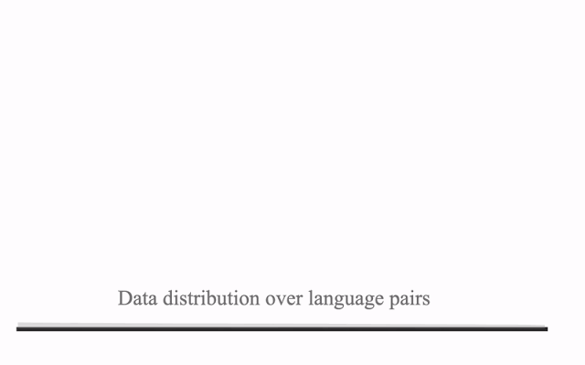
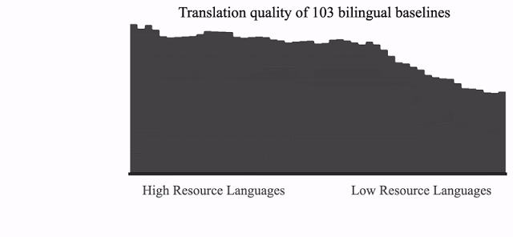
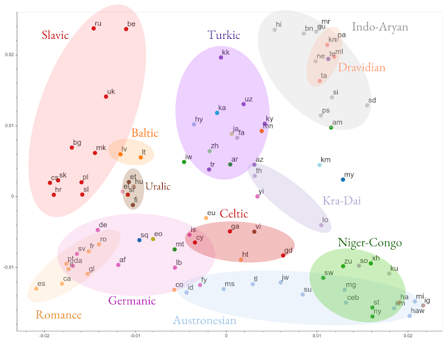

Exploring Massively Multilingual, Massive Neural Machine Translation

## [Exploring Massively Multilingual, Massive Neural Machine Translation](http://ai.googleblog.com/2019/10/exploring-massively-multilingual.html)

Friday, October 11, 2019

 Posted by Ankur Bapna, Software Engineer and Orhan Firat, Research Scientist, Google Research

*“... perhaps the way [of translation] is to descend, from each language, down to the common base of human communication — the real but as yet undiscovered universal language — and then re-emerge by whatever particular route is convenient.”* — [Warren Weaver](https://en.wikipedia.org/wiki/Warren_Weaver), 1949

Over the last few years there has been enormous progress in the quality of machine translation (MT) systems, breaking language barriers around the world thanks to the developments in [neural machine translation](https://en.wikipedia.org/wiki/Neural_machine_translation) (NMT). The success of NMT however, owes largely to the great amounts of supervised training data. But what about languages where data is scarce, or even absent? Multilingual NMT, with the inductive bias that “*the learning signal from one language should benefit the quality of translation to other languages”, *is a potential remedy.

Multilingual machine translation processes multiple languages using a single translation model. The success of multilingual training for data-scarce languages has been demonstrated for [automatic speech recognition](https://ai.googleblog.com/2019/09/large-scale-multilingual-speech.html) and [text-to-speech](https://ai.googleblog.com/2018/09/text-to-speech-for-low-resource.html) systems, and by prior research on multilingual translation [[1](https://www.aclweb.org/anthology/P15-1166/),[2](https://ai.googleblog.com/2016/11/zero-shot-translation-with-googles.html),[3](https://www.aclweb.org/anthology/N16-1101.pdf)]. We previously studied the effect of [scaling up the number of languages](https://arxiv.org/abs/1903.00089) that can be learned in a single neural network, while controlling the amount of training data per language. But what happens once all constraints are removed? Can we train a single model using all of the available data, despite the huge differences across languages in data size, scripts, complexity and domains?

In “[Massively Multilingual Neural Machine Translation in the Wild: Findings and Challenges](https://arxiv.org/pdf/1907.05019.pdf)” and follow-up papers [[4](https://arxiv.org/pdf/1811.06965.pdf),[5](https://arxiv.org/abs/1909.02197),[6](https://arxiv.org/abs/1909.00437),[7](https://arxiv.org/abs/1909.08478)], we push the limits of research on multilingual NMT by training a single NMT model on 25+ billion sentence pairs, from 100+ languages to and from English, with 50+ billion parameters. The result is an approach for massively multilingual, massive neural machine translation (M4) that demonstrates large quality improvements on both low- and high-resource languages and can be easily adapted to individual domains/languages, while showing great efficacy on cross-lingual downstream transfer tasks.

**Massively Multilingual Machine Translation**

Though data skew across language-pairs is a [great challenge in NMT](https://www.aclweb.org/anthology/W17-3204/), it also creates an ideal scenario in which to study *[transfer](https://en.wikipedia.org/wiki/Transfer_learning)*, where insights gained through training on one language can be applied to the translation of other languages. On one end of the distribution, there are high-resource languages like French, German and Spanish where there are billions of parallel examples, while on the other end, supervised data for low-resource languages such as Yoruba, Sindhi and Hawaiian, is limited to a few tens of thousands.

|     |
| --- |
|  |
| The data distribution over all language pairs (in log scale) and the relative translation quality ([BLEU score](https://en.wikipedia.org/wiki/BLEU)) of the bilingual baselines trained on each one of these specific language pairs. |

Once trained using all of the available data (25+ billion examples from 103 languages), we observe strong *positive transfer *towards low-resource languages, dramatically improving the translation quality of 30+ languages at the tail of the distribution by an average of 5 [BLEU](https://en.wikipedia.org/wiki/BLEU) points. This effect is [already known](https://www.aclweb.org/anthology/N16-1101/), but surprisingly encouraging, considering the comparison is between bilingual baselines (i.e., models trained only on specific language pairs) and a single multilingual model with *[representational capacity](http://www.deeplearningbook.org/contents/ml.html)* similar to a single bilingual model. This finding hints that massively multilingual models are effective at generalization, and capable of capturing the representational similarity across a large body of languages.

|     |
| --- |
|  |
| Translation quality comparison of a single massively multilingual model against bilingual baselines that are trained for each one of the 103 language pairs. |

In our EMNLP’19 paper [[5](https://arxiv.org/abs/1909.02197)], we compare the representations of multilingual models across different languages. We find that multilingual models learn shared representations for [linguistically similar languages](https://www.britannica.com/science/linguistics/Language-classification) without the need for external constraints, validating [long-standing intuitions](https://arxiv.org/abs/1802.00273) and empirical results that [exploit these similarities](https://arxiv.org/abs/1808.04189). In [[6](https://arxiv.org/abs/1909.00437)], we further demonstrate the effectiveness of these learned representations on cross-lingual transfer on downstream tasks.

|     |
| --- |
|  |
| Visualization of the clustering of the encoded representations of all 103 languages, based on representational similarity. Languages are color-coded by their [linguistic family](https://www.encyclopedia.com/humanities/encyclopedias-almanacs-transcripts-and-maps/language-family). |

**Building Massive Neural Networks**

As we increase the number of low-resource languages in the model, the quality of high-resource language translations starts to decline. This regression is [recognized](https://en.wikipedia.org/wiki/Language_transfer) in multi-task setups, arising from inter-task competition and the unidirectional nature of transfer (i.e., from high- to low-resource)*. *While working on [better learning](https://arxiv.org/pdf/1909.06434.pdf) and [capacity control](https://arxiv.org/abs/1904.04971) algorithms to mitigate this *negative transfer*, we also extend the representational capacity of our neural networks by making them bigger by increasing the number of model parameters to improve the quality of translation for high-resource languages.

Numerous design choices can be made to scale neural network capacity, including adding more layers or making the hidden representations wider. Continuing [our study](https://arxiv.org/abs/1808.07561) on training deeper networks for translation, we utilized [GPipe](https://ai.googleblog.com/2019/03/introducing-gpipe-open-source-library.html) [[4](https://arxiv.org/pdf/1811.06965.pdf)] to train 128-layer [Transformers](https://ai.googleblog.com/2017/08/transformer-novel-neural-network.html) with over 6 billion parameters. Increasing the model capacity resulted in significantly improved performance across all languages by an average of 5 [BLEU](https://en.wikipedia.org/wiki/BLEU) points. We also studied other properties of very deep networks, including the [depth-width trade-off](https://ai.googleblog.com/2016/06/wide-deep-learning-better-together-with.html), trainability challenges and design choices for scaling Transformers to over 1500 layers with 84 billion parameters.

While scaling depth is one approach to increasing model capacity, exploring architectures that can exploit the multi-task nature of the problem is a very plausible complementary way forward. By modifying the Transformer architecture through the substitution of the vanilla feed-forward layers with [sparsely-gated mixture of experts](https://arxiv.org/abs/1701.06538), we drastically scale up the model capacity, allowing us to successfully train and pass 50 billion parameters, which further improved translation quality across the board.

|     |
| --- |
|  |
| Translation quality improvement of a single massively multilingual model as we increase the capacity (number of parameters) compared to 103 individual bilingual baselines. |

**Making M4 Practical**

It is inefficient to train large models with extremely high computational costs for every individual language, domain or transfer task. Instead, we present methods [[7](https://arxiv.org/abs/1909.08478)] to make these models more practical by using capacity tunable layers to adapt a new model to specific languages or domains, without altering the original.

**Next Steps**

At least half of the 7,000 languages currently spoken will no longer exist by the end of this century[*](https://ai.googleblog.com/2019/10/exploring-massively-multilingual.html#1). Can multilingual machine translation come to the rescue? We see the M4 approach as a stepping stone towards serving the next 1,000 languages; starting from such multilingual models will allow us to easily extend to new languages, domains and down-stream tasks, even when parallel data is unavailable. Indeed the path is rocky, and on the road to universal MT many promising solutions appear to be interdisciplinary. This makes multilingual NMT a plausible test bed for machine learning practitioners and theoreticians interested in exploring the annals of multi-task learning, meta-learning, training dynamics of deep nets and much more. We still have a long way to go.

**Acknowledgements **

*This effort is built on contributions from Naveen Arivazhagan, Dmitry Lepikhin, Melvin Johnson, Maxim Krikun, Mia Chen, Yuan Cao, Yanping Huang, Sneha Kudugunta, Isaac Caswell, Aditya Siddhant, Wei Wang, Roee Aharoni, Sébastien Jean, George Foster, Colin Cherry, Wolfgang Macherey, Zhifeng Chen and Yonghui Wu. We would also like to acknowledge support from the Google Translate, Brain, and Lingvo development teams, Jakob Uszkoreit, Noam Shazeer, Hyouk Joong Lee, Dehao Chen, Youlong Cheng, David Grangier, Colin Raffel, Katherine Lee, Thang Luong, Geoffrey Hinton, Manisha Jain, Pendar Yousefi and Macduff Hughes.*

* * *

[*****]() The Cambridge Handbook of Endangered Languages (Austin and Sallabank, 2011). [↩](https://ai.googleblog.com/2019/10/exploring-massively-multilingual.html#top1)

