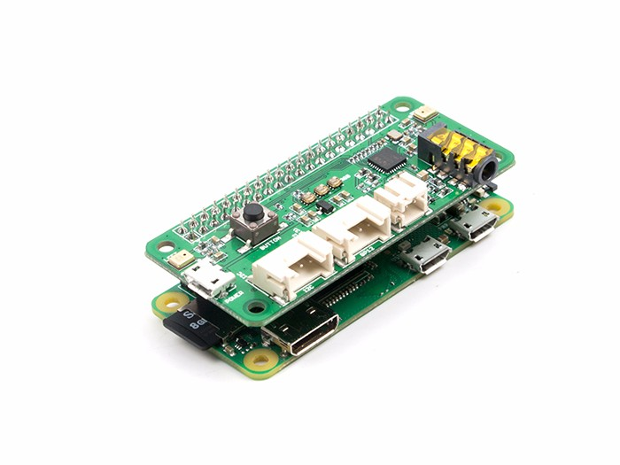
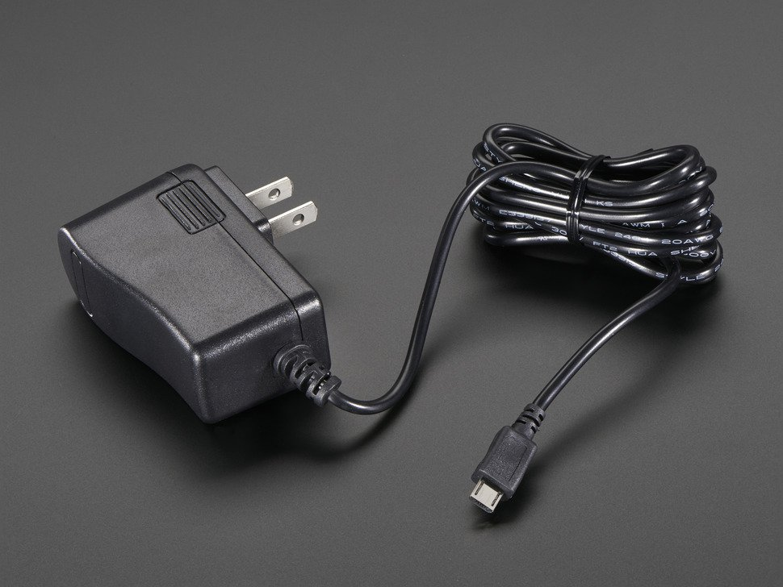

FIGLAB/ubicoustics: Accompanying repository for Ubicoustics: Plug-and-Play Acoustic Activity Recognition

# Research Code for Ubicoustics

This is the research repository for Ubicoustics: Plug-and-Play Acoustic Activity Recognition (UIST 2018). It contains the base toolchain and demo for Ubicoustics. [More information about the research can be found here](http://www.gierad.com/projects/ubicoustics).

# System Requirements

The deep learning system is written in `python3`, specifically `tensorflow` and `keras`.

To begin, we recommend using `virtualenv` to run a self-contained setup:
$ virtualenv ./ubicoustics -p python3.6
$ source ubicoustics/bin/activate
Once `virtualenv` is activated, install the following dependencies via `pip`:
(ubicoustics)$ git clone https://github.com/FIGLAB/ubicoustics.git
(ubicoustics)$ pip install numpy==1.14.1 tensorflow==1.5.0 keras==2.1.6 wget
Finally, install `pyaudio` for microphone access:

(ubicoustics)$ pip install --global-option='build_ext' --global-option='-I/opt/local/include' --global-option='-L/opt/local/lib' pyaudio

Keep in mind that `pyaudio` will require `portaudio` and `libasound` as non-python dependencies. You'll have to install those separately for your OS.

`IMPORTANT:` When you install `pyaudio` via pip, you need to manually specify the `lib` and `include` directories via the `--global-option` flag. The example above assumes `portaudio` is installed under `/opt/local/include` and `/opt/local/lib`.

# Example Demos

Once the dependencies above are installed, try these four demos. It requires our pre-trained model that is not part of this repo (due to filesize restrictions), but we provide a downloader script to simplify this process.

## Example #0: File Prediction (Simple)

This simple demo reads an audio file, extracts features, and feeds them into the ML model for offline prediction. Once you've installed all dependencies, run `example_fileprediction_simple.py`:

(ubicoustics)$ python example_fileprediction_simple.py

The script will automatically download a model file called `example_model.hdf5` into the `/models` directory (if it doesn't exist). It's an 865.8MB file, so the download might take a while depending on your Internet connection. The script above will perform audio event detection on `example.wav`.

=====
Checking model...
=====
Downloading example_model.hdf5 [867MB]:
100% [.......................................]
Prediction: Coughing (1.00)
Prediction: Coughing (1.00)
Prediction: Coughing (1.00)
Prediction: Coughing (1.00)
Prediction: Coughing (1.00)
Prediction: Toilet Flushing (1.00)
Prediction: Toilet Flushing (1.00)
Prediction: Toilet Flushing (1.00)
Prediction: Water Running (1.00)
Prediction: Water Running (1.00)
Prediction: Water Running (1.00)
Prediction: Water Running (1.00)
Prediction: Water Running (1.00)
Prediction: Water Running (1.00)
Prediction: Water Running (1.00)
Prediction: Water Running (1.00)
Prediction: Knocking (1.00)
Prediction: Knocking (0.99)
Prediction: Knocking (0.91)

## Example #1: File Prediction (Playback)

Next, you can run the demo that plays back an audio file via `example_fileprediction_playback.py`:

(ubicoustics)$ python example_fileprediction_playback.py

It's similar to the previous example, but it uses `pyaudio`'s non-blocking mechanism to process audio buffers at a given sample length. We insert `ubicoustics` predictions within that block:

# Audio FORMATFORMAT  = pyaudio.paInt16CHANNELS  =  1RATE  =  16000CHUNK  =  RATE# Input fileswf = wave.open('example.wav', 'rb')# Callbackdef  audio_samples(input, frame_count, time_info, status_flags):

in_data = wf.readframes(frame_count) # Audio Processing Code here  # ...  return (in_data, pyaudio.paContinue)# Non-Blocking Callp = pyaudio.PyAudio()

stream = p.open(format=FORMAT, channels=CHANNELS, rate=RATE, output=True, frames_per_buffer=CHUNK, stream_callback=audio_samples)

The script will use your computer's speakers to playback the audio file while displaying its predictions. If everything runs correctly, you should get the following output:

=====
Checking model...
=====
Beginning prediction for example.wav (use speakers for playback):
Prediction: Coughing (1.00)
Prediction: Coughing (1.00)
Prediction: Coughing (1.00)
Prediction: Coughing (1.00)
Prediction: Coughing (0.06)
Prediction: Toilet Flushing (1.00)
Prediction: Toilet Flushing (1.00)
Prediction: Toilet Flushing (1.00)
Prediction: Water Running (1.00)
Prediction: Water Running (1.00)
Prediction: Water Running (1.00)
Prediction: Water Running (1.00)
Prediction: Water Running (1.00)
Prediction: Water Running (1.00)
Prediction: Water Running (1.00)
Prediction: Chopping (0.96)
Prediction: Knocking (1.00)
Prediction: Knocking (1.00)
Prediction: Knocking (0.99)

## Example #2: Live Prediction (Simple)

This next example will use your system microphone to perform live audio event predictions.

(ubicoustics)$ python example_liveprediction_simple.py

It will check your system for a list of available microphones, and it will prompt you to choose one.

	=====
	1 / 2: Checking Microphones...
	=====
	=== Available Microphones: ===
	# 0 - Built-in Microphone
	# 1 - Gierad's Apple AirPods
	======================================
	Select microphone [0]: 0

You can also use the `--mic <mic-id>` flag to specify which local microphone to use.

	(ubicoustics)$ python example_liveprediction_simple.py --mic 0

The system will then perform audio event predictions using the chosen microphone. Your output should look something like this:

	Using mic: # 0 - Built-in Microphone
	=====
	2 / 2: Checking model...
	=====
	# Live Prediction Using Microphone: # 0 - Built-in Microphone
	Prediction: Typing (0.97)
	Prediction: Typing (0.97)
	Prediction: Typing (1.00)
	Prediction: Knocking (1.00)
	Prediction: Knocking (0.46)
	Prediction: Door In-Use (0.15)
	Prediction: Door In-Use (0.12)
	Prediction: Door In-Use (0.12)
	Prediction: Phone Ringing (0.46)
	Prediction: Phone Ringing (0.86)

This script makes predictions every second. This script should run on most platforms, including a `Raspberry Pi B+` (1GB of memory, 16GB disk space, with 4GB set as SWAP). If you need help setting up your RPi, send an email to Gierad ([gierad.laput@cs.cmu.edu](https://github.com/FIGLAB/ubicousticsmailto:gierad.laput@cs.cmu.edu)).

To manually grab a list of microphones for your system, just run `microphones.py`:

(ubicoustics)$ python microphones.py

## Example #3: Live Prediction (Detail View)

To form a better intuition on the system's behavior, this final example shows all the knobs you can turn, including the system's confidence values, along with audio levels and some parameters that you can tweak (e.g., thresholds) for real-time prediction.

	(ubicoustics)$ python example_liveprediction_detail.py

Here's an example screenshot:

Prediction confidence values will be shown in real time. The system checks whether the highest confidence value exceeds a given threshold AND wether the audio levels are significant enough to warrant an event trigger (e.g., > -40dB). These parameters can be adjusted using the `PREDICTION_THRES` and `DBLEVEL_THRES` parameters:

PREDICTION_THRES  =  0.8  # confidenceDBLEVEL_THRES  =  -40  # dB

# Reference

Gierad Laput, Karan Ahuja, Mayank Goel, Chris Harrison. 2018. Ubicoustics: Plug-and-Play Acoustic Activity Recognition. In Proceedings of the 31st Annual Symposium on User Interface Software and Technology (UIST '18). ACM, New York, NY, USA.

[Download the paper here](http://www.gierad.com/assets/ubicoustics/ubicoustics.pdf).

BibTex Reference:

	@inproceedings {ubicoustics,
	  author={Laput, G. and Ahuja, K. and Goel, M. and Harrison, C},
	  title={Ubicoustics: Plug-and-Play Acoustic Activity Recognition},
	  booktitle={Proceedings of the 31st Annual Symposium on User Interface Software and Technology},
	  series={USIT '18},
	  year={2018},
	  location={Berlin, Germany},
	  numpages={10},
	  publisher={ACM},
	  address={New York, NY, USA}
	}

# License

Due to licensing restrictions, audio `wav` files and training code are only available by request (for now), and can only be used for research i.e., non-commercial purposes. Otherwise, Ubicoustics is freely available for non-commercial use, and may be redistributed under these conditions. Please see the license file for further details. For a commercial license, please contact Gierad Laput, Chris Harrison, and the CMU Technology Transfer Office ([innovation@cmu.edu](https://github.com/FIGLAB/ubicousticsmailto:innovation@cmu.edu)).

# Appendix A: Raspberry Pi

We've received several requests to document how we made Ubicoustics run on a Raspberry Pi. Be forewarned that we're pushing the limits of what an RPi can do, but that's part of the fun. If you're all for it, here's what you'll need:

## Hardware

1. [Raspberry Pi 3 Model B+ - CortexA53 with 1GB](https://www.adafruit.com/product/3775)

1. [ReSpeaker 2-Mics Pi HAT (or better)](https://m.seeedstudio.com/productDetail/2874)

1. [16GB Micro SD Card (Class 10)](https://www.amazon.com/SanDisk-COMINU024966-16GB-microSD-Card/dp/B004KSMXVM)

1. [5V 2.5A Switching Power Supply (Highly Recommended)](https://www.adafruit.com/product/1995)

1. Alternative: Google AIY Kit

You can also use Google's AIY Voice Kit as a starting point. It uses roughly the same configuration as above, except you'll need a 16GB Mini SD Card (the AIY Kit comes with an 8GB card). It is markedly slower than an RPi B+.

You can buy the Google AIY Voice Kit from [Target](https://www.target.com/p/-/A-53416295).

The Google AIY Kit is the absolute bare-bones configuration that we've tested. Again, it is significantly slower than an RPi B+ (but it has built-in Google integrations that you might find useful for other apps).

## Software and Configuration

### Install Raspbian OS

We recommend using Raspbian Lite as the operating system, but other flavors will do. There's an entire process that documents [how to flash your SD card with the latest Raspbian OS](https://www.raspberrypi.org/documentation/installation/installing-images/). If you're running macOS, we recommend [going through this documentation](https://www.raspberrypi.org/documentation/installation/installing-images/mac.md).

### Install Microphone Drivers

Next, install the audio drivers for the ReSpeaker 2-Mics Pi HAT. Detailed documentation about the process [can be found here](http://wiki.seeedstudio.com/ReSpeaker_2_Mics_Pi_HAT/).

$ git clone https://github.com/respeaker/seeed-voicecard.git
$ cd seeed-voicecard
$ sudo ./install.sh
$ reboot

### Configure SWAP Space

Once flashed, change your RPi configuration so that it uses extra memory SWAP space. You can do this by editing `/etc/dphys-swapfile`:

	$ sudo nano /etc/dphys-swapfile

Uncomment the `CONF_SWAPSIZE` and `CONF_MAXSWAP` parameters, and set them to a value that is roughly above 1G. In our case, we've set it to `4096`.

	CONF_SWAPSIZE=4096
	CONF_MAXSWAP=4096

### Install `virtualenv`

Once you've configured your SWAP space, we recommend creating a `virtualenv` environment. You can do this via:

$ sudo pip3 install virtualenv
$ virtualenv ./ubicoustics -p python3
$ source ubicoustics/bin/activate

Once `virtualenv` is installed, clone the repo and follow the instructions above to run Ubicoustics.

(ubicoustics)$ git clone https://github.com/FIGLAB/ubicoustics.git
(ubicoustics)$ cd ubicoustics
(ubicoustics)$ python example_fileprediction_simple.py

Once running, you'll get warning messages, specifically about exceeding memory. Don't worry— RPi will keep chugging along until `tensorflow` completes loading the model. Once done, your output should look something like this:

	Downloading example_model.hdf5 [867MB]:
	100% [......................................................................] 865808944 / 865808944
	Using deep learning model: models/example_model.hdf5
	2018-12-17 15:09:08.039745: W tensorflow/core/framework/allocator.cc:113] Allocation of 1024 exceeds 10% of system memory.
	2018-12-17 15:09:08.040125: W tensorflow/core/framework/allocator.cc:113] Allocation of 1024 exceeds 10% of system memory.
	2018-12-17 15:09:08.040456: W tensorflow/core/framework/allocator.cc:113] Allocation of 2048 exceeds 10% of system memory.
	2018-12-17 15:09:08.040689: W tensorflow/core/framework/allocator.cc:113] Allocation of 2048 exceeds 10% of system memory.
	2018-12-17 15:09:08.040904: W tensorflow/core/framework/allocator.cc:113] Allocation of 16384 exceeds 10% of system memory.
	Prediction: Coughing (1.00)
	Prediction: Coughing (1.00)
	Prediction: Coughing (1.00)
	Prediction: Coughing (1.00)
	Prediction: Coughing (1.00)
	Prediction: Toilet Flushing (1.00)
	Prediction: Toilet Flushing (1.00)
	Prediction: Toilet Flushing (1.00)
	Prediction: Water Running (1.00)
	Prediction: Water Running (1.00)
	Prediction: Water Running (1.00)
	Prediction: Water Running (1.00)
	Prediction: Water Running (1.00)
	Prediction: Water Running (1.00)
	Prediction: Water Running (1.00)
	Prediction: Water Running (1.00)
	Prediction: Knocking (1.00)
	Prediction: Knocking (0.99)
	Prediction: Knocking (0.91)

Feel free to try the other examples. It takes a while for RPi to run the script, but once loaded, you'll have a prediction framerate of about 1Hz. If you've made it this far, congratulations! :)

(ubicoustics)$ python example_liveprediction_simple.py

That's it! For help, questions, and general feedback, contact Gierad Laput ([gierad.laput@cs.cmu.edu](https://github.com/FIGLAB/ubicousticsmailto:gierad.laput@cs.cmu.edu)).

## Disclaimer

	THE PROGRAM IS DISTRIBUTED IN THE HOPE THAT IT WILL BE USEFUL, BUT WITHOUT ANY WARRANTY. IT IS PROVIDED "AS IS" WITHOUT WARRANTY OF ANY KIND, EITHER EXPRESSED OR IMPLIED, INCLUDING, BUT NOT LIMITED TO, THE IMPLIED WARRANTIES OF MERCHANTABILITY AND FITNESS FOR A PARTICULAR PURPOSE. THE ENTIRE RISK AS TO THE QUALITY AND PERFORMANCE OF THE PROGRAM IS WITH YOU. SHOULD THE PROGRAM PROVE DEFECTIVE, YOU ASSUME THE COST OF ALL NECESSARY SERVICING, REPAIR OR CORRECTION.

	IN NO EVENT UNLESS REQUIRED BY APPLICABLE LAW THE AUTHOR WILL BE LIABLE TO YOU FOR DAMAGES, INCLUDING ANY GENERAL, SPECIAL, INCIDENTAL OR CONSEQUENTIAL DAMAGES ARISING OUT OF THE USE OR INABILITY TO USE THE PROGRAM (INCLUDING BUT NOT LIMITED TO LOSS OF DATA OR DATA BEING RENDERED INACCURATE OR LOSSES SUSTAINED BY YOU OR THIRD PARTIES OR A FAILURE OF THE PROGRAM TO OPERATE WITH ANY OTHER PROGRAMS), EVEN IF THE AUTHOR HAS BEEN ADVISED OF THE POSSIBILITY OF SUCH DAMAGES.