Face ID, Touch ID, No ID, PINs and Pragmatic Security

# Face ID, Touch ID, No ID, PINs and Pragmatic Security

- [](https://twitter.com/share?url=https://www.troyhunt.com/face-id-touch-id-pins-no-id-and-pragmatic-security/&text=Troy%20Hunt%3A%20Face%20ID%2C%20Touch%20ID%2C%20No%20ID%2C%20PINs%20and%20Pragmatic%20Security)
- [](https://www.facebook.com/sharer/sharer.php?u=https://www.troyhunt.com/face-id-touch-id-pins-no-id-and-pragmatic-security/)
- [](https://plus.google.com/share?url=https://www.troyhunt.com/face-id-touch-id-pins-no-id-and-pragmatic-security/)
- [](https://www.linkedin.com/shareArticle?mini=true&url=https://www.troyhunt.com/face-id-touch-id-pins-no-id-and-pragmatic-security/)
- [](https://reddit.com/submit?url=https://www.troyhunt.com/face-id-touch-id-pins-no-id-and-pragmatic-security/&title=Troy%20Hunt%3A%20Face%20ID%2C%20Touch%20ID%2C%20No%20ID%2C%20PINs%20and%20Pragmatic%20Security)
- [](https://www.troyhunt.com/face-id-touch-id-pins-no-id-and-pragmatic-security/mailto:?subject=Troy%20Hunt%3A%20Face%20ID%2C%20Touch%20ID%2C%20No%20ID%2C%20PINs%20and%20Pragmatic%20Security&body=https://www.troyhunt.com/face-id-touch-id-pins-no-id-and-pragmatic-security/)

14 September 2017

I was wondering recently after poring through yet another data breach how many people actually use multi-step verification. I mean here we have a construct where even if the attacker has the victim's credentials, they're rendered useless once challenged for the authenticator code or SMS which is subsequently set. I went out looking for figures and found the following on Dropbox:

Less than 1%. That's alarming. It's alarming not just because the number is so low, but because Dropbox holds such valuable information for so many people. Not only that, but their multi-step implementation is very low-friction - you generally only ever see it when setting up a new machine for the first time.

But here's the problem with multi-step verification: it a perfect example of where security is friction. No matter how easy you make it, it's something you have to do *in addition* to the thing you normally do, namely entering a username and password. That's precisely the same problem with getting people to put PINs on their phone and as a result, there's a huge number of devices out there left wide open. How many? It's hard to tell because there's no easy way of collecting those stats. I found one survey from 2014 which said [52% of people have absolutely nothing protecting their phone](https://www.elie.net/blog/survey-most-people-dont-lock-their-android-phones-but-should). Another in 2016 said [the number is more like 34%](http://www.androidauthority.com/psa-use-a-lockscreen-password-668689/). Keep searching and you'll find more stats of wildly varying values but the simple fact remains that there are a *huge* number of people out there with no protection on the device at all.

And this brings us to Face ID. I'm writing this the day after the iPhone X launch and obviously this pattern of biometric login is now going to be a major part of the Apple security strategy:

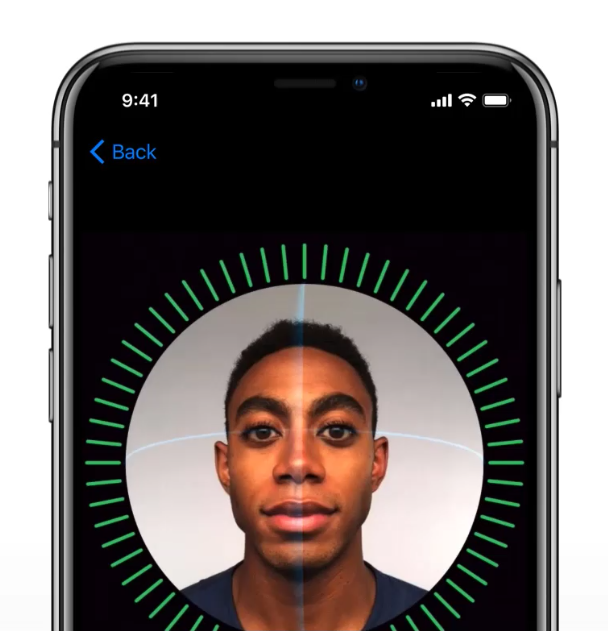

Of course, this now brings with it the whole biometrics discussion and to some extent, it's similar to the one we had when Touch ID launched in 2013 with the iPhone 5S. Obviously there are differences, but many of the issues are also the same. Either way, in my mind both pose fantastic upsides for 99.x% of people and I shared that thought accordingly:

Not everyone agreed though and there were some responses I honestly didn't see coming. I want to outline some of the issues with each and why per the title of this post, "pragmatic security" is really important here.

## No ID

Let's start here because it's the obvious one. Missing PINs on phones provides zero protection from any adversary that gets their hands on it; the kids, a pickpocket or law enforcement - it's free reign for all. Free reign over photos and videos, free reign over messages and email and free reign to communicate with anyone else under the identity of the device owner. I'm stating things here that may seem obvious to you, but clearly the risks haven't yet hit home for many people.

A lack of PIN has also proved very useful for *remote* attackers. Back in 2014 I wrote about [the "Oleg Pliss" situation](https://www.troyhunt.com/the-mechanics-of-icloud-hack-and-how/) where unprotected devices were being remotely locked and ransomed. This was only possible when the device didn't have a PIN, a fact the attacker abused by then placing their own on it after gaining access to the victim's online Apple account.

But we can't talk about devices not having any authentication without talking about *why* and that almost always comes down to friction. The Dropbox multi-step verification situation described above where an additional security control is imposed. So let's move on and start talking about that friction, let's talk about PINs.

## PIN

The first point I'll make here as I begin talking about the 3 main security constructs available is that they're all *differently* secure. This is not a case of one is "secure" and another is "insecure" in any sort of absolute way and anyone referring to them in this fashion is missing a very important part of the narrative. With that said, let's look at the pros and cons involved here.

Obviously, the big pro of a PIN is familiarity (that and not having the problems mentioned above, of course). If you can remember a number, you can set a PIN and hey, we're all good at remembering numbers, right? Like that same one that people use everywhere... which is obviously a con. And this is a perfect example of the human element we so frequently neglect when having this discussion: people take shortcuts with PINs. They reuse them. They follow basic patterns. They disclose them to other people - how many people's kids know the PIN that unlocks their phone? And before you answer "not mine", you're (probably) not normal people by virtue of being interested enough in your security to be here reading this post in the first place!

But PINs are enormously popular and even when you *do* use the biometric options we're about to get into, you're still going to need one on your phone anyway. For example, every time you hard-reboot an iPhone with Touch ID you need to enter the PIN. When you do, depending on the environment you're in you may be a bit inclined to do so like this:

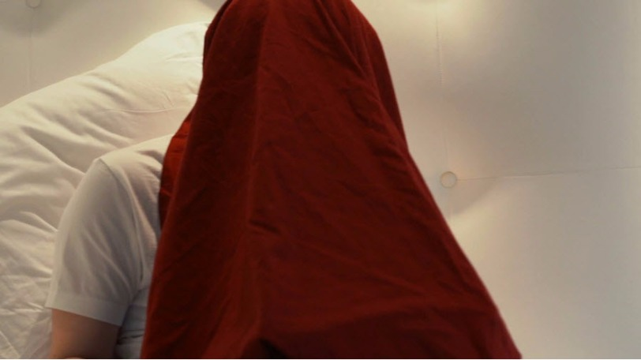

This is Edward Snowden typing his password in whilst under a blanket in the [Citizenfour documentary](https://en.wikipedia.org/wiki/Citizenfour). He's doing everything he can to ensure there's no way his password can be observed by others because this is precisely the problem with passwords - anyone who has yours can use it (again, this is why multi-step verification is so important). Now you may argue that Snowden's threat profile is such that he *needs* to take such measures and you're right - I can see exactly why he'd do this. But this also means recognising that different people have different threat profiles and whilst Ed was worried about the likes of the NSA specifically targeting him as a high-value individual, you are (almost certainly) not.

We've all been warned about the risk of shoulder surfing at one time or another and it's pretty common to find it represented in corporate training programs [in a similar fashion to this](https://www.slideshare.net/akshaysurve53/shoulder-surfing-resistant-graphical-and-image-based-login-system):

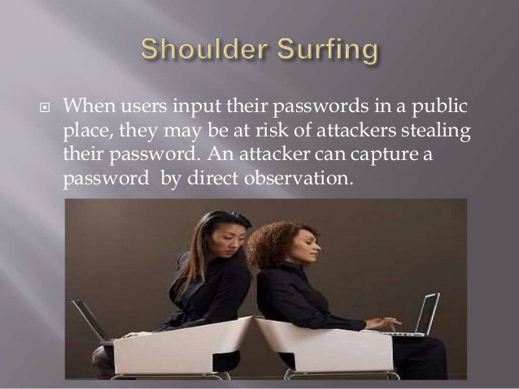

Except as it relates to PINs on phones, the problem is much worse. Firstly, it's worse because it's a PIN that's a mere 4 or 6 digits (you could always go alphanumeric on an iPhone but that'll be a near-zero percentage of people) and there's only 10 characters to choose from so observing and remembering them isn't hard. Secondly, mobile devices are obviously used in, well, mobile locations so you're unlocking them on the train, in the shops and in a whole raft of locations where people can directly observe you. When using Apple Pay is a perfect example: you're standing in a queue with people in front of you and people behind you waiting for you to pay for your shopping and that's not a great environment to be entering a secret by pressing a small number of big buttons on a publicly observable screen.

And then there's all the really niche attacks against PINS, for example [using thermal imaging to detect the locations the screen was tapped](https://www.theatlantic.com/technology/archive/2017/03/hot-hands-smartphones/519069/). Now that's by no means trivial, but some of criticisms being levelled at biometrics are also by no means trivial so let's keep it an even playing field. Even entering your PIN in an open space away from people presents a risk in the presence of the burgeoning number of surveillance cameras that are present.

But there's one thing in particular PINs are resilient to which biometrics are not: [the police in the US can force you to unlock your phone using your fingerprint](https://www.theatlantic.com/technology/archive/2016/05/iphone-fingerprint-search-warrant/480861/). I'm not sure how this differs in the rest of the world, but it was regularly highlighted to me during yesterday's discussions. Now there are obvious privacy issues with this - *big ones* - but getting back to the personal threat actors issue, this is something the individual needs to think about and consider whether it's a significant enough risk to them to rule out biometrics. If you're an activist or political dissident or indeed an outright criminal, this may pose a problem. For everyone else, you're starting to approach infinitely small likelihoods. I heard an argument yesterday that, for example, a lady who was filming a bloke being shot by the police could have then been forced to unlock her phone by fingerprint so the cops can erase the evidence. But think this through for a moment...

There will always be attack vectors like this. *Always.* The question someone has to ask when choosing between biometrics or PIN is how threatened they personally feel by these situations. And then they make their own security decision of their own free volition.

Let's move onto the biometric alternatives.

## Touch ID

Given we've now had 4 years of Touch ID (and of course many more years of fingerprint auth in general), we've got a pretty good sense the threat landscape. Even 15 years ago, [researchers were circumventing biometric logins](https://www.theregister.co.uk/2002/05/16/gummi_bears_defeat_fingerprint_sensors/). In that particular case, the guy simply lifted a fingerprint from a glass then enhanced it with a cyanoacrylate adhesive, photographed it, took it into Photoshop and cleaned up the picture, printed it onto a transparency sheet, grabbed a photo-sensitive printed circuit board then etched the printed fingerprint from the transparency sheet into the copper on the board before moulding a gelatine finger onto it hence inheriting the fingerprint. Easy!

There have many other examples of auth bypass since that time, including against Apple's Touch ID and indeed some of them have been simpler too. Like PINs, it's not foolproof and what people are doing is trading various security and usability attributes between the PIN and biometric options. A PIN has to be known to unlock the device whilst a fingerprint could be forged, but then a PIN may have been observed or readily guessed (and certainly there are brute force protections to limit this) whilst biometric login can be used in plain sight. They're *differently* secure and they protect from different threat actors. It's *extremely* unlikely that the guy who steals your phone off a bar is going to be able to do this, much more likely that a nation state actor that sees a high value in a target's phone will.

One of the arguments I heard against Touch ID yesterday is that an "attacker" could cause a sleeping or unconscious person to unlock their device by placing the owner's finger on the home button. I've quoted the word "attacker" because one such situation occurred last year when [a six year old used her sleeping mother's fingerprint to buy $250 worth of Pokemon](http://www.complex.com/life/2016/12/kid-buys-250-dollars-pokemon-items-with-moms-thumbprint). Now I've got a 5-year-old and a 7-year-old so I reckon I'm qualified enough to make a few comments on the matter (plus the whole thing about me thinking a lot about security!)

Firstly, whilst the hacker inside of me is thinking "that kid is pretty smart", the parent inside of me is thinking "that kids needs a proverbial kick up the arse". There's nothing unusual about kids using parent's phones for all manner of things and we've probably all given an unlocked phone to one of our own children for them to play a game, watch a video or even just talk on the phone. Touch ID, PIN or nothing at all, if a kid abuses their parent's trust in this way then there's a very different discussion to be had than the one about how sophisticated a threat actor needs to be in order to circumvent it.

Be that as it may, there are certainly circumstances where biometric login poses a risk that PINs don't and the unconscious one is a perfect example. Now in my own personal threat model, being unconscious whilst someone steals my phone *and* forces me to unlock it is not exactly high up on the list of things that keep me awake at night. But if I was a binge drinker and prone to the odd bender, Touch ID may simply not be a good model for me. Then again, if the victim is getting paralytic drunk and the attacker wants access to an unlocked phone then there are many other simple social engineering tricks to make that happen. In fact, in the attacker's world, the victim having a PIN may well be preferable because it could be observed on unlock and then used to modify security settings that are otherwise unavailable with mere access to fingerprints.

One of the neat features coming in iOS 11 when it hits next week [is the ability to rapidly disable Touch ID](https://www.wired.com/story/apples-ios-11-will-make-it-even-harder-for-cops-to-extract-your-data/):

> “

> Tap the phone's home button five times, and it will launch a new lockscreen with options to make an emergency call or offer up the owner's emergency medical information. But that S.O.S. mode also silently disables TouchID, requiring a passcode to unlock the phone. That feature could be used to prevent someone from using the owner's finger to unlock their phone while they're sleeping or otherwise incapacitated, for instance.

> ”

What this means is that were you find yourself in a higher risk situation with only Touch ID enabled (i.e. you've been pulled over by the police and are concerned about them compelling you to biometrically unlock your phone), there's a speedy option to disable it. But that's obviously no good if you don't have time to enable it so if you're going to hold up a liquor store and it's possible the cops may come bursting in at any time, it could be tough luck (also, don't hold up liquor stores!)

Another new feature helps further strengthen the security model:
> “

> in iOS 11, iPhones will not only require a tap to trust a new computer, but the phone's passcode, too. That means even if forensic analysts do seize a phone while it's unlocked or use its owner's finger to unlock it, they still need a passcode to offload its data to a program where it can be analyzed wholesale.

> ”

I particularly like this because it adds protection to *all* unlocked devices where the PIN is not known. If you're compelled to biometrically unlock the device, that won't allow the data to be siphoned off via tethering it. Yes, it could still be accessed directly on the device, but that's a damn sight better then unfettered direct access to storage.

So pros and cons and indeed that's the whole theme of this post. Let's move onto the new thing.

## Face ID

I watched the keynote today and was obviously particularly interested in how Face ID was positioned so let me share the key bits here. Keep in mind that I obviously haven't played with this and will purely be going by Apple's own info here.

Firstly, this is not a case of "if the camera sees something that looks like the owner's face the device unlocks". Here's why:

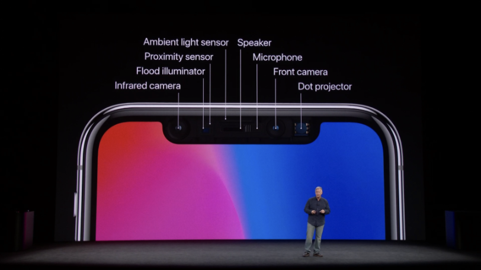

Infrared camera + flood illuminator + proximity sensor + ambient light sensor + camera + dot projector = Face ID. Each of these plays a different role and you can see how, for example, something like infrared could be used to discern the difference between a human head and a photo.

In Apple's demo, they talk about the flood illuminator being used to detect the face (including in the dark):

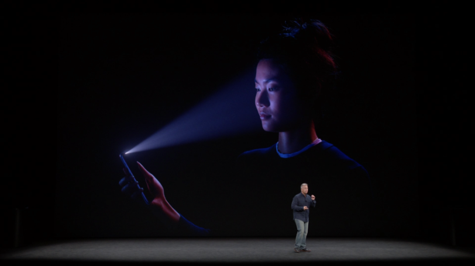
This is followed up by the infrared camera taking an image:
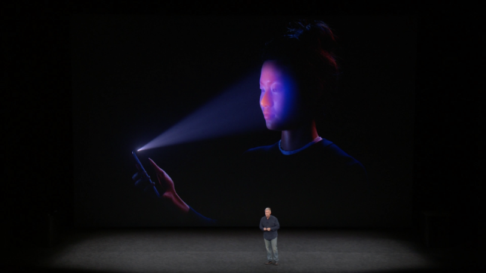
The dot projector then pumps out 30k invisible dots:
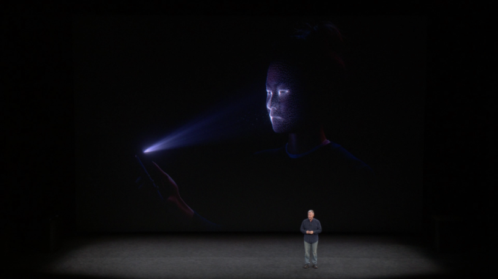

The IR image and the dot pattern then get "pushed though neural networks to create a mathematical model of your face" which is then compared to the stored one created at setup. Now of course we don't know how much of this is fancy Apple speak versus reality and I'm *very* keen to see the phone get into the hands of creative security people, but you can't help but think that the breadth of sensors available for visual verification trumps those required for touch alone.

Apple is obviously conscious of comparisons between the two biometric implementations and they shared some stats on the likelihood of each returning a false positive. Firstly, Touch ID:

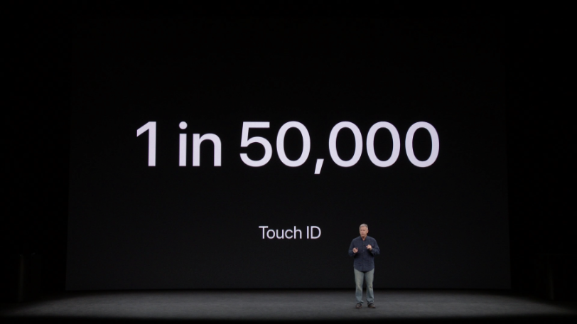

So what they're saying here is that you've got a 1 in 50k chance of someone else's print unlocking your phone. From a pure chance perspective, those are pretty good odds but I'm not sure that's the best metric to use (more on that in a moment).

Here's how Face ID compares:
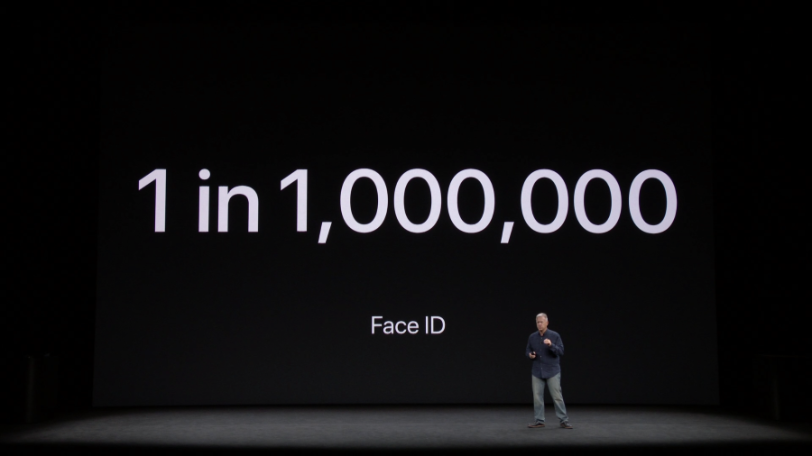

One in a million. There's literally a saying that's "one in a million" which symbolises the extremely remote likelihood of something happening! The 20x figure over Touch ID is significant but it doesn't seem like the right number to be focusing on. The *right* number would be the one that illustrates not the likelihood of random people gaining access, but rather the likelihood of an adversary tricking the biometrics via artificial means such as the gummi bears and PCBs. But that's not the sort of thing we're going to know until people start attempting just that.

Be that as it may, Apple claim that Face ID is resilient to both photos and masks:

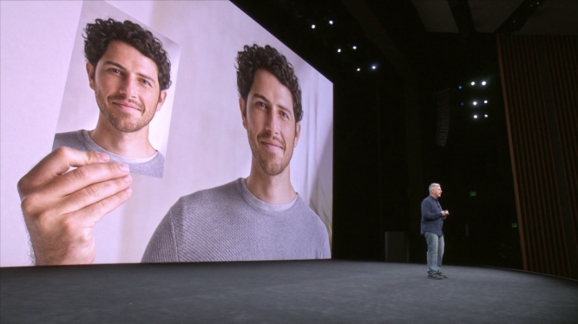
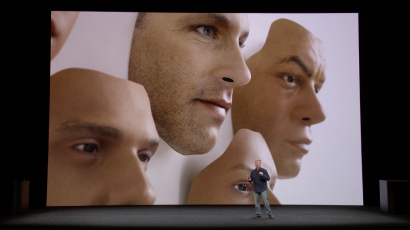

And with all those sensors, it's certainly believable that there's enough inputs to discern with a high degree of confidence what is a legitimate face versus a fake one. Having said that, even Apple themselves acknowledged that certain threats remain:

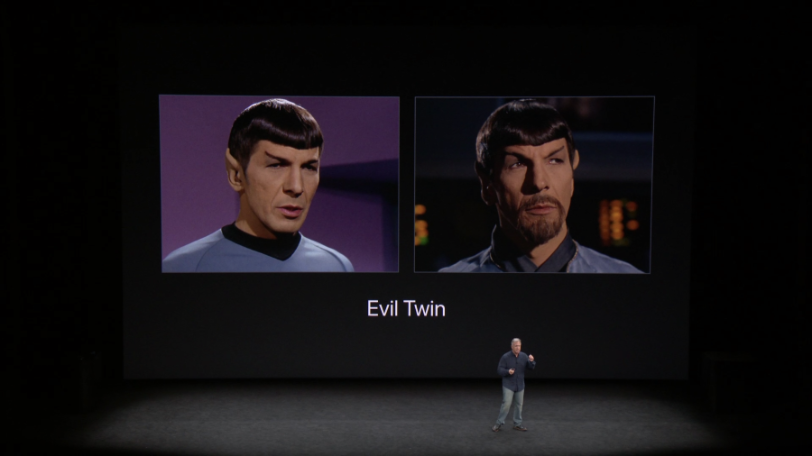

Laughs were had, jokes were made but the underlying message was that Face ID isn't foolproof. Just like Touch ID. And PINs.

Thinking back to Touch ID for a moment, one of the risk flagged there was a kid holding a sleeping adult's finger on the sensor or indeed someone doing the same with an unconscious iPhone owner. Face ID seems to solve this problem:

> “
> If your eyes are closed or you're looking away, it's not going to unlock
> ”

Which makes a lot of sense - given the processing power to actually observe and interpret eye movements in the split second within which you expect this to work, this would be a really neat failsafe. Apple highlights this as "attention awareness" when they wrap up the Face ID portion of the presentation:

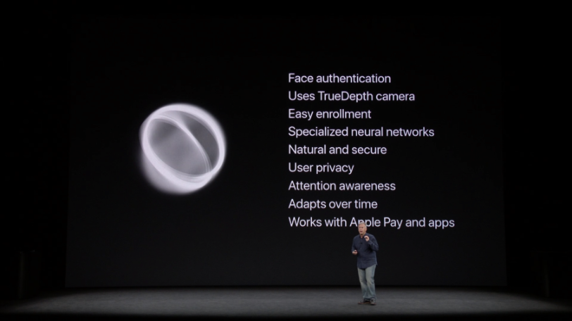

Moving on to something different, when I shared 99.x% tweet earlier on, a thread emerged about abusive spouses. Now if I'm honest, I didn't see that angle coming and it made me curious - what *is* the angle? I mean how does Face ID pose a greater threat to victims of domestic violence than the previous auth models? There's the risk of being physically compelled to unlock the phone, but of course Touch ID poses the same risk. One would also imagine that in such a situation, an abusive husband may demand a PIN in the same intimidating fashion in which they demand a finger is placed on the sensor or the front facing camera is pointed at the face (and appropriate eye movement is made). It's hard to imagine there are many legitimate scenarios where an iPhone X is present, is only using Face ID, the owner is an abused woman and the man is able to compel her to unlock the device in a way that wasn't previously possible. The only tangible thing I could take away from that conversation is that many people won't understand the respective strengths and weaknesses of each authentication method which, of course, is true for anyone regardless of their relationship status. (Folks who understand both domestic violence and the role of technology in that environment, do please comment if I'm missing something.)

The broader issue here is trusting those you surround yourself with in the home. In the same way that I trust my kids and my wife not to hold my finger to my phone while I'm sleeping, I trust them not to abuse my PC if I walk away from it whilst unlocked and yes, one would reasonably expect to be able to do that in their own home. The PC sits there next to my wallet with cash in it and the keys to the cars parked out the front. When you can no longer trust those in your immediate vicinity within the sanctity of your own home, you have a much bigger set of problems:

Having absorbed all the info and given Face ID some deeper thought, I stand by that 99.x% tweet until proven wrong. I just can't make good, rational arguments against it without letting go of the pragmatism which acknowledges all the factors I've mentioned above.

## Summary

What we have to keep in mind here is just how low the security bar is still set for so many people. Probably not for you being someone interested in reading this sort of material in the first place, but for the billions of "normals" out there now using mobile devices. Touch ID and Face ID as so frictionless that they remove the usability barrier PINs post. There's a good reason Apple consistently shows biometric authentication in all their demos - because it's just such a slick experience.

The majority of negative commentary I'm seeing about Face ID in particular amounts to "facial recognition is bad" and that's it. Some of those responses seem to be based on the assumption that it introduces a privacy risk in the same way as facial tracking in, say, the local supermarket would. But that's not the case here; the data is stored in the iPhone's secure enclave and never leaves the device:

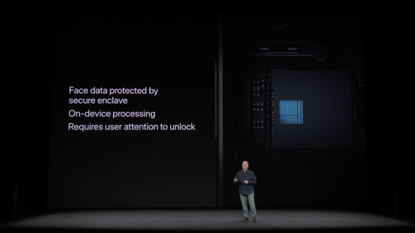

More than anything though, we need to remember that Face ID introduces another security model with its own upsides and downsides on both security and usability. It's not "less secure than a PIN", it's differently secure and the trick now is in individuals choosing the auth model that's right for them.

I'll order an iPhone X when they hit the store next month and I'll be giving Face ID a red hot go. I'll also be watching closely as smart security folks around the world try to break it :)

[Security](https://www.troyhunt.com/tag/security/)

[** Tweet](https://twitter.com/share?text=Troy%20Hunt%3A%20Face%20ID%2C%20Touch%20ID%2C%20No%20ID%2C%20PINs%20and%20Pragmatic%20Security&url=https://www.troyhunt.com/face-id-touch-id-pins-no-id-and-pragmatic-security/)[** Post](https://www.facebook.com/sharer/sharer.php?u=https://www.troyhunt.com/face-id-touch-id-pins-no-id-and-pragmatic-security/)[** Share](https://plus.google.com/share?url=https://www.troyhunt.com/face-id-touch-id-pins-no-id-and-pragmatic-security/)[** Update](https://www.linkedin.com/shareArticle?mini=true&url=https://www.troyhunt.com/face-id-touch-id-pins-no-id-and-pragmatic-security/)[** Email](https://www.troyhunt.com/face-id-touch-id-pins-no-id-and-pragmatic-security/mailto:?subject=Troy%20Hunt%3A%20Face%20ID%2C%20Touch%20ID%2C%20No%20ID%2C%20PINs%20and%20Pragmatic%20Security&body=https://www.troyhunt.com/face-id-touch-id-pins-no-id-and-pragmatic-security/)[** RSS](https://feeds.feedburner.com/TroyHunt)

##### Troy Hunt

Hi, I'm Troy Hunt, I write this blog, create courses for Pluralsight and am a Microsoft Regional Director and MVP who travels the world speaking at events and training technology professionals [](https://www.troyhunt.com/about)

- [5 comments]()
- [**Troy Hunt's Blog**](https://disqus.com/home/forums/troyhunt/)
- [(L)](https://disqus.com/embed/comments/?base=default&f=troyhunt&t_i=ghost-59b8975a011eb6002e75c529&t_u=https%3A%2F%2Fwww.troyhunt.com%2Fface-id-touch-id-pins-no-id-and-pragmatic-security%2F&t_d=Face%20ID%2C%20Touch%20ID%2C%20No%20ID%2C%20PINs%20and%20Pragmatic%20Security&t_t=Face%20ID%2C%20Touch%20ID%2C%20No%20ID%2C%20PINs%20and%20Pragmatic%20Security&s_o=default#)
- [](https://disqus.com/home/inbox/)
- [ Recommend](https://disqus.com/embed/comments/?base=default&f=troyhunt&t_i=ghost-59b8975a011eb6002e75c529&t_u=https%3A%2F%2Fwww.troyhunt.com%2Fface-id-touch-id-pins-no-id-and-pragmatic-security%2F&t_d=Face%20ID%2C%20Touch%20ID%2C%20No%20ID%2C%20PINs%20and%20Pragmatic%20Security&t_t=Face%20ID%2C%20Touch%20ID%2C%20No%20ID%2C%20PINs%20and%20Pragmatic%20Security&s_o=default#)
- [⤤  Share](https://disqus.com/embed/comments/?base=default&f=troyhunt&t_i=ghost-59b8975a011eb6002e75c529&t_u=https%3A%2F%2Fwww.troyhunt.com%2Fface-id-touch-id-pins-no-id-and-pragmatic-security%2F&t_d=Face%20ID%2C%20Touch%20ID%2C%20No%20ID%2C%20PINs%20and%20Pragmatic%20Security&t_t=Face%20ID%2C%20Touch%20ID%2C%20No%20ID%2C%20PINs%20and%20Pragmatic%20Security&s_o=default#)
- [Sort by Best](https://disqus.com/embed/comments/?base=default&f=troyhunt&t_i=ghost-59b8975a011eb6002e75c529&t_u=https%3A%2F%2Fwww.troyhunt.com%2Fface-id-touch-id-pins-no-id-and-pragmatic-security%2F&t_d=Face%20ID%2C%20Touch%20ID%2C%20No%20ID%2C%20PINs%20and%20Pragmatic%20Security&t_t=Face%20ID%2C%20Touch%20ID%2C%20No%20ID%2C%20PINs%20and%20Pragmatic%20Security&s_o=default#)

Join the discussion…

- [Attach](https://disqus.com/embed/comments/?base=default&f=troyhunt&t_i=ghost-59b8975a011eb6002e75c529&t_u=https%3A%2F%2Fwww.troyhunt.com%2Fface-id-touch-id-pins-no-id-and-pragmatic-security%2F&t_d=Face%20ID%2C%20Touch%20ID%2C%20No%20ID%2C%20PINs%20and%20Pragmatic%20Security&t_t=Face%20ID%2C%20Touch%20ID%2C%20No%20ID%2C%20PINs%20and%20Pragmatic%20Security&s_o=default#)

-

    - [−](https://disqus.com/embed/comments/?base=default&f=troyhunt&t_i=ghost-59b8975a011eb6002e75c529&t_u=https%3A%2F%2Fwww.troyhunt.com%2Fface-id-touch-id-pins-no-id-and-pragmatic-security%2F&t_d=Face%20ID%2C%20Touch%20ID%2C%20No%20ID%2C%20PINs%20and%20Pragmatic%20Security&t_t=Face%20ID%2C%20Touch%20ID%2C%20No%20ID%2C%20PINs%20and%20Pragmatic%20Security&s_o=default#)
    - [****](https://disqus.com/embed/comments/?base=default&f=troyhunt&t_i=ghost-59b8975a011eb6002e75c529&t_u=https%3A%2F%2Fwww.troyhunt.com%2Fface-id-touch-id-pins-no-id-and-pragmatic-security%2F&t_d=Face%20ID%2C%20Touch%20ID%2C%20No%20ID%2C%20PINs%20and%20Pragmatic%20Security&t_t=Face%20ID%2C%20Touch%20ID%2C%20No%20ID%2C%20PINs%20and%20Pragmatic%20Security&s_o=default#)

 [Nick Renwick](https://disqus.com/by/nrenwick/)    •  [an hour ago](https://www.troyhunt.com/face-id-touch-id-pins-no-id-and-pragmatic-security/#comment-3516889741)

Great post Troy. Very fair, i've been having the same argument in our office, its not less secure, its just differently secured. Perhaps once all the researchers have a crack at breaking it more people will be open to the option, then knowing the risks involved. For 'Normals' some security is better than none at all - will be interesting to watch how this plays out...

-

    - [−](https://disqus.com/embed/comments/?base=default&f=troyhunt&t_i=ghost-59b8975a011eb6002e75c529&t_u=https%3A%2F%2Fwww.troyhunt.com%2Fface-id-touch-id-pins-no-id-and-pragmatic-security%2F&t_d=Face%20ID%2C%20Touch%20ID%2C%20No%20ID%2C%20PINs%20and%20Pragmatic%20Security&t_t=Face%20ID%2C%20Touch%20ID%2C%20No%20ID%2C%20PINs%20and%20Pragmatic%20Security&s_o=default#)
    - [****](https://disqus.com/embed/comments/?base=default&f=troyhunt&t_i=ghost-59b8975a011eb6002e75c529&t_u=https%3A%2F%2Fwww.troyhunt.com%2Fface-id-touch-id-pins-no-id-and-pragmatic-security%2F&t_d=Face%20ID%2C%20Touch%20ID%2C%20No%20ID%2C%20PINs%20and%20Pragmatic%20Security&t_t=Face%20ID%2C%20Touch%20ID%2C%20No%20ID%2C%20PINs%20and%20Pragmatic%20Security&s_o=default#)

Howard  •  [an hour ago](https://www.troyhunt.com/face-id-touch-id-pins-no-id-and-pragmatic-security/#comment-3516903965)

A very similar discussion is being held over on the 1Password forums.

Now that Apple are introducing FaceID people are concerned that, if compromised, an attacker would not only have access to the iPhone but also the 1Password database.

The closest analogy is that 1Password are saying that two locks on your front door are unnecessary, all you need is one key and that gives you access to everything. It doesn't take a genius to figure that this is highly undesirable.

For reasons best known to them they say that it's not a good idea to offer a separate PIN to access 1Password and that [if a user is concerned with FaceID] they should enter their full master password each time (that's some serious friction!)

[https://blog.agilebits.com/...](https://disq.us/url?url=https%3A%2F%2Fblog.agilebits.com%2F2017%2F09%2F12%2Fface-it-the-iphone-x-looks-amazing%2F%3AkkCL5J0faZp4u5Sp0d-sgPtnr2c&cuid=621325)

-

    - [−](https://disqus.com/embed/comments/?base=default&f=troyhunt&t_i=ghost-59b8975a011eb6002e75c529&t_u=https%3A%2F%2Fwww.troyhunt.com%2Fface-id-touch-id-pins-no-id-and-pragmatic-security%2F&t_d=Face%20ID%2C%20Touch%20ID%2C%20No%20ID%2C%20PINs%20and%20Pragmatic%20Security&t_t=Face%20ID%2C%20Touch%20ID%2C%20No%20ID%2C%20PINs%20and%20Pragmatic%20Security&s_o=default#)
    - [****](https://disqus.com/embed/comments/?base=default&f=troyhunt&t_i=ghost-59b8975a011eb6002e75c529&t_u=https%3A%2F%2Fwww.troyhunt.com%2Fface-id-touch-id-pins-no-id-and-pragmatic-security%2F&t_d=Face%20ID%2C%20Touch%20ID%2C%20No%20ID%2C%20PINs%20and%20Pragmatic%20Security&t_t=Face%20ID%2C%20Touch%20ID%2C%20No%20ID%2C%20PINs%20and%20Pragmatic%20Security&s_o=default#)

 [Robert Grant](https://disqus.com/by/disqus_T3qUkLDQ0r/)    •  [an hour ago](https://www.troyhunt.com/face-id-touch-id-pins-no-id-and-pragmatic-security/#comment-3516891588)

How does this compare to Kinect/Windows 10's face unlock?

## Also on **Troy Hunt's Blog**

- [

### Free Course: Here's What this Ubiquiti UniFi Stuff Is All About

    - 26 comments •

    - a month ago•

[Troy Hunt—Awesome! I've got some of the cams sitting here too, just need to get around to giving them a go but they look very nice :)](https://disq.us/?url=https%3A%2F%2Fwww.troyhunt.com%2Fheres-what-this-ubiquiti-unifi-stuff-is-all-about%2F&key=PLjWbqAKc9UHCWFNfXRaHA)](https://disq.us/?url=https%3A%2F%2Fwww.troyhunt.com%2Fheres-what-this-ubiquiti-unifi-stuff-is-all-about%2F&key=PLjWbqAKc9UHCWFNfXRaHA)

- [

### Troy Hunt: Weekly update 45

    - 10 comments •

    - 2 months ago•

[CJ—Colour me intrigued about next week's "release" and further Weekly update (re: Passwords)](https://disq.us/?url=https%3A%2F%2Fwww.troyhunt.com%2Fweekly-update-45%2F&key=Cb3V22o5ZxbKYds8HQUYJg)](https://disq.us/?url=https%3A%2F%2Fwww.troyhunt.com%2Fweekly-update-45%2F&key=Cb3V22o5ZxbKYds8HQUYJg)

- [

### Inside The Massive 711 Million Record Onliner Spambot Dump

    - 325 comments •

    - 17 days ago•

[David Robertson— Apparently my email address is part of this breach. Is there a way to find out if it was associated with a password? (Even if not, I'll be …](https://disq.us/?url=https%3A%2F%2Fwww.troyhunt.com%2Finside-the-massive-711-million-record-onliner-spambot-dump%2F&key=BbsALbJVEXx1KF6upM-JAg)](https://disq.us/?url=https%3A%2F%2Fwww.troyhunt.com%2Finside-the-massive-711-million-record-onliner-spambot-dump%2F&key=BbsALbJVEXx1KF6upM-JAg)

- [

### The Trouble With Commercial CAs and EV Certs

    - 123 comments •

    - 2 months ago•

[Cha— Hi Troy, you asked if anyone had an explanation why the biggest brands do not use EV. There *might* be another reason that I believe no one has mentioned …](https://disq.us/?url=https%3A%2F%2Fwww.troyhunt.com%2Fon-the-perceived-value-ev-certs-cas-phishing-lets-encrypt%2F&key=NJl5NFut9nOJPpNZMQ0EJA)](https://disq.us/?url=https%3A%2F%2Fwww.troyhunt.com%2Fon-the-perceived-value-ev-certs-cas-phishing-lets-encrypt%2F&key=NJl5NFut9nOJPpNZMQ0EJA)

- [Powered by Disqus](https://disqus.com/)
- [*✉*Subscribe*✔*](https://disqus.com/embed/comments/?base=default&f=troyhunt&t_i=ghost-59b8975a011eb6002e75c529&t_u=https%3A%2F%2Fwww.troyhunt.com%2Fface-id-touch-id-pins-no-id-and-pragmatic-security%2F&t_d=Face%20ID%2C%20Touch%20ID%2C%20No%20ID%2C%20PINs%20and%20Pragmatic%20Security&t_t=Face%20ID%2C%20Touch%20ID%2C%20No%20ID%2C%20PINs%20and%20Pragmatic%20Security&s_o=default#)
- [*d*Add Disqus to your site](https://publishers.disqus.com/engage?utm_source=troyhunt&utm_medium=Disqus-Footer)
- [*🔒*Privacy](https://help.disqus.com/customer/portal/articles/466259-privacy-policy)