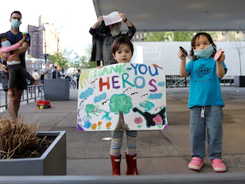

Face it: This is a good time to make a will - The Washington Post

[Home](https://www.washingtonpost.com/?tid=home_link_ss&itid=home_link_ss)

Share

![](data:image/svg+xml,%3csvg class='pinterest pointer pa-xs brad-50 b hover-fill-white mr-xs js-evernote-checked' width='24' height='24' viewBox='0 0 24 24' xmlns='http://www.w3.org/2000/svg' data-evernote-id='311'%3e%3ctitle%3eShare on Pinterest%3c/title%3e%3cpath d='M12 2C6.477 2 2 6.477 2 12c0 4.239 2.634 7.86 6.354 9.317-.09-.79-.165-2.008.033-2.873.18-.781 1.169-4.97 1.169-4.97s-.297-.602-.297-1.482c0-1.391.807-2.428 1.811-2.428.856 0 1.267.642 1.267 1.407 0 .856-.543 2.14-.83 3.334-.24.995.501 1.81 1.48 1.81 1.778 0 3.145-1.876 3.145-4.576 0-2.395-1.72-4.066-4.181-4.066-2.848 0-4.519 2.132-4.519 4.338 0 .856.33 1.777.74 2.28.083.098.091.189.067.288-.074.312-.247.995-.28 1.135-.041.181-.148.223-.338.132-1.25-.584-2.033-2.403-2.033-3.876 0-3.153 2.289-6.05 6.61-6.05 3.465 0 6.164 2.47 6.164 5.778 0 3.449-2.173 6.222-5.185 6.222-1.012 0-1.967-.527-2.288-1.152l-.626 2.379c-.222.872-.83 1.958-1.242 2.625.938.288 1.926.444 2.963.444 5.522 0 10-4.477 10-10A9.98 9.98 0 0 0 12 2' fill-rule='evenodd'%3e%3c/path%3e%3c/svg%3e)

[19](https://www.washingtonpost.com/lifestyle/home/face-it-this-is-a-good-time-to-make-a-will/2020/05/04/10d98136-8975-11ea-ac8a-fe9b8088e101_story.html#comments-wrapper)

[Home & Garden](http://www.washingtonpost.com/lifestyle/home-garden/)
Perspective

Add to list

# Face it: This is a good time to make a will

(iStock)
By
[Nicole Anzia](https://www.washingtonpost.com/people/nicole-anzia/)
May 5, 2020 at 12:00 p.m. GMT+1

Our current health crisis is a stark reminder that life is fragile and unpredictable.

None of us could have fathomed the extent to which this pandemic would turn our lives upside down in a matter of weeks, nor do we know when it will be over. Planning for anything during such uncertain times is difficult, but one thing we can — and should — plan for is what happens when we die.

No one wants to think about their own death. Most Americans plan to get a will done eventually, but then continually put it off or forget to do it during the course of their busy lives. A [study conducted in 2017](https://www.kff.org/other/report/serious-illness-in-late-life-the-publics-views-and-experiences/)[by the Kaiser Family Foundation](https://www.kff.org/other/report/serious-illness-in-late-life-the-publics-views-and-experiences/)found that 60 percent of Americans don’t have a will.

People delay doing their estate documents because they don’t know where to start, think it will cost too much, or don’t think it’s necessary because they’re young and healthy. And, of course, the process involves making tough decisions. But “with so much uncertainty about the coronavirus, knowing your plan is in place and your loved ones are provided for can be of some comfort,” says Marla Roeser, an estate planning attorney in Potomac.

AD

*[*[Quarantine reset: 5 steps to make you feel more in control](https://www.washingtonpost.com/lifestyle/home/quarantine-reset-5-steps-to-make-you-feel-more-in-control/2020/04/20/586296dc-7d9f-11ea-9040-68981f488eed_story.html?tid=lk_interstitial_manual_7&itid=lk_interstitial_manual_7)*]*

### Wills and revocable trusts

Every adult with assets should have a will. And if you own property or have minor children, it is even more important. If you die without a will, you will have given up all control over what happens to your money, assets and minor children. And leaving a mess for others to deal with is not only irresponsible, but it can also cause major emotional and financial strain for your survivors. For those who don’t have extremely complex financial matters, online sites make creating a will convenient and affordable.

A revocable living trust is another option for end-of-life planning. It differs from a will in that it allows you to transfer your assets into a trust that you can control until your death. After you die, the assets in the trust will automatically pass to your beneficiaries, avoiding the need to go through probate.

AD

### Health-care power of attorney and living will

A health-care power of attorney and living will, often referred to as “advance directives,” are also critical estate documents. The durable health-care power of attorney designates who will have the power to make health-care decisions for you if you can’t make them yourself. Family members may have different ideas regarding various health-care decisions, but the power of attorney gives the designee the final decision-making power.

A living will explains what type of medical treatment you wish to receive at the end of your life. Many people think their family members will know what to do when faced with critical decisions regarding health care, but during such a stressful and uncertain time, it’s better to have your wishes clearly communicated to your loved ones in a written document.

AD

Living wills can also be

created online. [Five Wishes](https://fivewishes.org/shop/order/product/five-wishes-living-will) is a popular resource, but there are other options available, too. Each site informs you of the requirements in your state.

### Financial power of attorney

The financial power of attorney document is another standard part of any estate plan. This document designates someone to manage your legal and financial affairs. If you don’t designate an agent and you become disabled, the only way to manage your assets is for a loved one to go to court and get a guardian appointed, which can be costly and take months to complete.

As with your will and other estate documents, a simple financial power of attorney can be created online.

### Working with an attorney

If you choose to work with an estate planning attorney instead of creating your own documents online, that person can guide you through the process in a relatively short time frame. “Unless you have a highly sophisticated portfolio that requires complicated tax planning, estate planning documents can be drawn up within a few weeks,” says Amanda DiChello, a partner in the Private Client Services Practice Group at Cozen O’Connor in Philadelphia

AD

The process involves an initial meeting or conference call, some follow-up discussions, a review of the documents and the execution of the documents. DiChello says, “The length of time it takes from start to finish is usually determined by how quickly clients are able to make decisions, some of which require careful consideration.”

If you’re using an online site, be sure you understand what is required to finalize your documents during the pandemic. Estate planning attorneys are navigating how different states are adapting to the legal requirements necessary for the execution of estate planning documents during this time. In some instances, states are creating pandemic-specific laws that permit the execution of certain estate planning documents remotely.

If you have used an estate attorney in the past and would like to make changes to existing documents, DiChello recommends you reach out to an attorney. “Making handwritten changes to existing estate planning documents can lead to costly mistakes. And proving the validity of those changes is a time-consuming process that can significantly delay probate,” DiChello says.

AD

### Sharing the complete picture

Separate from creating essential estate documents, it’s crucial to provide a trusted friend or family member with a complete picture of your financial life, including where you bank, your account numbers and the names of the companies you use for your 401(k), IRA, 529 and pension, as well as your point of contact at each company. Also pass along ownership information for assets such as cars and homes, as well as any information related to outstanding debts.

### Passwords

It is vital that someone knows how to access your accounts, which requires creating a document with your usernames and passwords to pass along, or establishing an account with an online company that stores your password information and giving the access information for the master site to a trusted person.

AD

### Documents

Keep your marriage license, settlement papers from a divorce, birth certificate and Social Security number among your important documents, too. Include with this information the name of your life insurance company and policy number, as well as other important contacts who could assist surviving family members in the event of your death — your financial adviser, lawyer, insurance contacts and your accountant.

Making plans for your death feels like a morbid pursuit, but if you think about it in terms of your legacy to your loved ones, it can feel a little more manageable. And even though end-of-life planning requires that you make difficult decisions, the process usually turns out to be less challenging than people think it will be. Any stress associated with getting your estate documents created and organized is typically outweighed by the relief of having gotten it done.

AD

**More from [Lifestyle](http://www.washingtonpost.com/lifestyle?tid=lk_inline_manual_43&itid=lk_inline_manual_43):**

[DIY household cleaners that work if you’re short on supplies](https://www.washingtonpost.com/lifestyle/home/diy-household-cleaners-that-work-if-youre-short-on-supplies/2020/04/15/aedf5b36-7d9e-11ea-9040-68981f488eed_story.html?tid=lk_inline_manual_44&itid=lk_inline_manual_44)

[Why beans are the pandemic comfort veggie](https://www.washingtonpost.com/lifestyle/home/why-beans-are-the-pandemic-comfort-veggie/2020/04/21/b9401bfa-7f57-11ea-a3ee-13e1ae0a3571_story.html?tid=lk_inline_manual_45&itid=lk_inline_manual_45)

[Q&A: Ashley Moore on bringing homesteading into your life](https://www.washingtonpost.com/lifestyle/qanda-ashley-moore-on-bringing-homesteading-into-your-life/2020/04/23/c26be3ee-80c4-11ea-84c2-0792d8591911_livediscussion.html?tid=lk_inline_manual_46&itid=lk_inline_manual_46)

[19 Comments](https://www.washingtonpost.com/lifestyle/home/face-it-this-is-a-good-time-to-make-a-will/2020/05/04/10d98136-8975-11ea-ac8a-fe9b8088e101_story.html#comments-wrapper)

More from The Post

- [## President erupts at George Conway for ‘Mourning in America’ video, about the ‘deadly virus Trump ignored’](https://www.washingtonpost.com/nation/2020/05/05/trump-george-conway-coronavirus/?tid=pr_hybrid_collaborative_1_na-ans_1&itid=pr_hybrid_collaborative_1_na-ans_1)

“I don’t know what Kellyanne did to her deranged loser of a husband, Moonface,” Trump tweeted, “but it must have been really bad.”

- [## 15 children in New York City have developed a puzzling and serious inflammatory syndrome possibly linked to covid-19](https://www.washingtonpost.com/health/2020/05/05/coronavirus-children-kawasaki-syndrome/?tid=pr_hybrid_collaborative_2_na-ans_2&itid=pr_hybrid_collaborative_2_na-ans_2)

The children, ages 2 to 15 years, experienced persistent fever and elevated inflammatory markers similar to a syndrome known as Kawasaki disease. More than half had a rash, abdominal pain, vomiting or diarrhea. Less than half had any respiratory symptoms.

- 

Opinion

[## Trump’s damage is already done. He may not be able to save himself.](https://www.washingtonpost.com/opinions/2020/05/05/trumps-damage-is-already-done-he-may-not-be-able-save-himself/?tid=pr_hybrid_collaborative_3_na-ans_3&itid=pr_hybrid_collaborative_3_na-ans_3)

The worse is yet to come for the virus and the GOP.

- 

Opinion

[## Trump’s unhinged rant about a new attack ad shows his weakness](https://www.washingtonpost.com/opinions/2020/05/05/trumps-unhinged-rant-about-new-attack-ad-shows-his-weakness/?tid=pr_hybrid_collaborative_4_na-ans_4&itid=pr_hybrid_collaborative_4_na-ans_4)

Trump rages over a brutal new ad that depicts the calamity he has wrought.

- 

Analysis

[## The fallout from this ‘Bachelor’ season shows how much the franchise has gone off the rails](https://www.washingtonpost.com/lifestyle/2020/05/05/bachelor-peter-weber-kelley-flanagan-season-twist/?tid=pr_hybrid_collaborative_5_na-ans_5&itid=pr_hybrid_collaborative_5_na-ans_5)

Peter Weber is now dating Kelley Flanagan, his fourth runner-up — one of the many antics far more interesting than the actual show.

PAID PROMOTED STORIES

- [      Do business from the heart. In Germany.Germany Works.](https://paid.outbrain.com/network/redir?p=_XzPc9iE6PX-4eP-yQaMOGUklFDSLM3CYIMiFWMtX8Bs7BcL2Hhf4_KWzxoY4ZTh_1exHI2EotMsZUaxTQQ-d0CVll5le3tGLPgqi56RwJo-s8A6y6AApXFd_67Q4dKJRPpq6mqjpckdZQqHi9JLR6SLYpCr87xq8qtQelNvFjAqiDtj1XynbsckEN83KJwtnZQwRh0aAJClNS_Qdl7x8noZPS7tBLbxEoO55Nb9bDSW1I0g1wr6hsQ4rlfIiUQz9Kn5oP-vzOtIwltCnYpaLqlkJfLhgMCHKy_5a-MrS2cdlx0d6GsKrQLhIRb6B1BZ4KRiXaNgxtf0fh1ptyWs2TkcvvjR_Glp52o8eKzCvp6sFa2zTocrtM1CsHP_aPXHBD30SRLpRRykxeIn9iRZT2fwZQ56SRTDdOrvC5BTG1YhmeUliYKYHyCNn0CpSo8jVzwQUJZ3oxyxjmkTAbeYQiGFOL-nbJA0t4wvyROljlm5VoKBpcl0APZW4WYG5So4j2_D_8v4BFifn2kJTRN8i3EGH8gfJAydPun1iXe53ECQ2qVaEOi_CfRKTpPPP6ayvqaBVA1xx4cdgawJus8BsjssKIIDJkS8aDVcLZYzIz5TnvYklbJIZ_7Mt3KNzt4yXQ2o90DiFNe56m1Y4I3Hc1870bmNWWXrUJ2zjM3U8mTjoErUZvJ63T_CTbS9O2meSGkcez4aexCtEWuWpADsplE7uOnAcCUWLkdPmPbC_A-chu2mSXBX2mD8FfU77qZhJReQJ4ursA29r60RfhgC3m99EUiFT_qvm3DBv_iP0QRAUbUvpFeVj06brEPjqtWZWVfqTNekoJxAumr-FI72HJluT1DIZVw1PowIaj-3HkaQ6BjByAwEj1W71GF3jEmr2hDbi1haHJeSw2AimhT-dntHeRF6CjZHjord8W-D51Fz29_07yN1RUCLA1Z4Ue6uHUQQpyO4WRGjzsL6bf0V4tTtP7voF8Qrgt5EMtpEWNYRwPylwhrQynOwYuCE3QOlhf6Su5_86s-GjQrV0_X7YTuB_udpnfcVc1lpGq5L9cLqz3kUeQO3eiCXZa3y4tC_B-xp_gh43Wz36sStWwG9Cg8lmOlBktyx_-du7OR6GVJZBCEsSvKBlSdp7dSEPBjRqrqoK_5X3DJP36pZYCHJRBu3yfO20QstdigroU76uPdKiqnKIJ__iUKsK59oVnc763G3AHlYAycG8ay24Gzq73HEw2DgAJY3uxegsCMVwhbYJjRD64mIDSxonKvDKcHF_69bvreiHFNG5OdxuysHJs773_iyy6hmnOHmSxKYLQ0&c=72de12ed&v=3)
- [     Revealed: Why Seniors Should Release Equity From Their HomesTelegraph Equity Release](https://paid.outbrain.com/network/redir?p=X6qb12OfVSoM5XXW8yZa70g15KDtRkPCnmFZayj2xPu3ERy61223Wgg0nS1snimRRj9Mu5BnsbmoYDSCJ0RIOMZ6uRV55vWA_i7PtcloAX4RveMpdqNBXxUdNrV2QiOqJZdWfGAkWF3FztGfCuCpJPZ2ve-w9MfHVfFumGM8mIPVfr-Nhoh8vpCcRLGo2KFv94EuHavew8vVkDOjotlsT3Ma5a9wMvg4O4TGE14S1Gtr5gCWIWVby10EdvkqxFpNGLkAcCABkMv8-VWTSYq2ad3Lbq7_4cWS4abvlngz25ZbuLUbCJs75ptHZe36jiqlyKXyVZrz4vhZIRqhsr9KDx5E2CghPdpU0F7Bm-DM2a5bRRqPip5WreKRsW5z3yrKmfJFIC-sRZ8Nr5PNYo7tiixHxMp1W1qFIYBwCMutIi7GYBPsPjWxT_J7Ht7ebdT0ou2PhNUvfiAl9kacEaeRLGIQPoraREAMVyELVjXzBIdcrODJwwnS6naFXg7itUzYhHONrRYcTczNHAvvZt6-Jp3e0h6RCYuFOY_Qd75Ln1RzvTUX0XOPSdOTbqzNjUZDshMgABHHS_hUOqo79wzx3hecmqDGAvGi2NjTBFX-YfQBycl8_Fps5YI_Us2F5PkVsP17udyxs29jeEYOVfrnkpicxrqz2MtKR-Qi54h_tmxqUKCy-OKOOoUosRPq8ENkiATRmfCDDWMuTCStkzRlXGbxNDiemjuasdcXMdRPSsr6bk7PiAqAoo6NyYvw5yDHDYNqW_0vexvUWzphK4tIjKY5FvR0QF3pdF8CR7YlT-O4EwZFRUOB6bgRk0Sy5vrPr4WvUB1bEZMDSmJOuj914CY437v1B2rdqdhAijsrhVU_hrHiTzjthvS7GzvcBisd02Pkh4ZNVDzP-rP5gO-H_GqXj_dhJpQtw83pPas3Y1TnI-u1RDpw23O0VJIavZlwKy8UL2Gj4nhAqCMLZ1XxnloHolcI5-dZyg1uEAtxc-UUTz7Kv1dAiPVqzf5d1HDLOF9owhY6sszCRik8dR_ZyXcJ0KPqjiE_dVM50BtIdjSfTxaUkhj4gzLo3BCc4YVCgoedLpjw9Ih1f4Y6VSSI2kGbB3ln9GUU9yJhmX0rogZZAaRn9zt10SY6qwagqE-MlUvYiNoYR3FBoyR7BxBOrlrkI30ZzB7oxIHTsOmfl7vZouMFsx1NZK-CPROT8PHSjCDiQQ6IdlMYrMEkE0h47RQlFLwGRd_uDEOyn-Y5T0Z4bUfXbYI8hG-u6wnAFpbGyFiiI_Iav16nZR7aPkO2CevJJfqroscsb2moE-PbK4EJdXbw5KhvPkthIbfmdo-hOHzLR2iUP3wTmE3fv_CbvEpryma3PmV1T6WyxWRRrApT07482CJOYSNkl-wR983S&c=80bc6725&v=3)
- [     Dubai Villa Prices Fall to Lowest Point in a DecadeMansion Global](https://paid.outbrain.com/network/redir?p=jm72_udf8SwB1LmF_ctHzNIfUVHk3Wfx5XXb8HwNbw5-NwCteTH0s8v82w4ZetTXEuq4GDH9Ee-VFWWTIpMpP5CySfnIk1-iIjl8wCTnBiTO_kCrWcdw-0mWR3IpUAkXqb81-tzsMBWSTPAOu4bSnWns3oh-k5w06tG4VZZGJq1PfqXRa_VDMszGZNAnxq743pVOo4Kie8XVQYQM9EAAFxDPXKfZdEy7kYLjcAQHUY3byMKYtQta6PLsPhstr6YI_v6rYcDDc59jDL6zEh5Ezo0VwKYS3lZAwI7CgsWZJ1HJMdB7M1DZer6c8ui4b5G0-2WLm-qESZu9wpFM7_r556na523ayYc_dHBf0t8NfReOoGkbCsV34x_7fZj7TSJcAI038E5MTHt_fY0nWkbAUlUQux-X-RI0DQFvWgbieSSF5QBAGpjiYhipyTcmQqQTgjet_4RqzK2vgx6dYFXuXVsGFi6AgMtjm-1Sjj3G-fkD054qt5yMtp1h8rKIFO_IaTktefsuR2UA59NmbDNicl1gyzux9bVZ3V8RkI_kGz7VqT6xAr4uZvv0rBDHRsxJWNIy4rS2siEq3mVBKmywksszg7-3yNRAnVmQzcIotL8PX6xQMe018HTD9QUg44SLGCrGwksEPeg46auUY9rlbBE_1h99GFcfm2Nw4r0mIlTKwBaEU6NkHfyQJTckvRwpMCKSJWj_2Q4erDLNNKypdEjsuM_Wt8EzHm0COpClvCm9Q80llReINidZ9S2HA4J1JqLoUQFZG40zBIHnaiDonOy14AgAQgVlC8QL9TR5AHtj4HZKN3X9f7zpBSf9YFTFVYG1y3qNIThgHA59ciBvhfUKI5d7SCMsSDhOo6yeE9afBX_g24ot5D8r_T19wEi-GztE1QGPwJloBbYv6FeF0IKyT7ESwuX0tyFK3-qAZKBlG6-wHCinJQBHP-7QMXt1d845chhY2BVdzE9RrsmSJ6vGVMEUf5cVyuWpISUZHOap0eRL6khyu2VO8YLrAcvtvG3wQ45pQjy64Dl97Oell1DAnVszTBBiPUgdiBPD0gwtyOUdmatV45RPD8JVgsy-oAol7vXLUABjykBhEhrpLfpcaqUqOdWEf8AfwbrB-7rZ5CBiiL6zdV7efH4xYCKIFyXuqZUJFoy8-blmlLqQPKoly00zafRfIUWZquRT-2X404H3qY6eeFr7MAri4T2IwN_gbq_UmLMGJnrJyNlU6lyWJDu-pmLcOj6qamyp7Wrw8bfMMm-pqLoijNVmdMGwof0ViT9qWpF13hBwCDy5huh1Rm7K6nVVkvQ_bJGNEGEZuPRS3QAcgNqQQ2HaYQaHjghSDnfRBQSdryzHugvMUhOsCR-ZYpq5vIv957Z-UFpTcqdZ07VCqaGFQw5I44E4QvZIUSHdGHH4k9SSEHD9Lg&c=5e6b65cf&v=3)
- [     Jeff Bezos Drops $16 Million on Another Manhattan Pad to Create a ‘Vertical’ Dream HomeMansion Global](https://paid.outbrain.com/network/redir?p=B--9kaPHD9QUgF-YaiS64AkEt-iezwi5WC4UuKzzmrOGFXapxpxBQujcFuxuAp7EXWwGjTNTEZ99NbvWBTdl7X8aezo1qPPSHft6kQ6Hq0DmKGAYfP-aXiYdyGWtiJyqR_ftG1Fkbqwx8Ctu3ziczMwG0trGKIx_HhZJRoKDrYZybkDLvufd4hlz6PglufrDlYJRvDCk-ECItmYL7mkH5IutL_nJDj2slW574fHVEb6xhGM_b_nVqJLIwjn_3tV8Ra1S0-yldpV9l-AB2QAycINU1ssKbMKmPrDC7RDxxkowakmriXJ3Rkn6IUmR1bYUfVo-Subu45BKf4EdATBW1D5m2HQeUMwSbYjw0Gn3qnyzEEP-WbczvqUDe7tD80sY96MN87i2cJZVuDYBtP1pZ-PjAGstyjl6Yqcqz4NLKYSpVCgAgqPPyUFagcM9VFTGuE9MyTxK8BI6gQoRm9CrL2PcQ756_uFSf6_k980sKNF4Dy8wS0ORRBA9W5rq6Txc3npb8_SqlhLgcx1aC3k8nomYOVYZfl_6Qee1NPll_m5Sifx4lCF9m5Z8MBPD1N6B-BZ-3uoYjDyK3LqvwwxRu26ZCy4vSUinJzpcsMhIXMYlEdpxGldEuEdFr7pYrXBWrsNT0HBVO96xEPJ_7mQFstSxjqqTQeVDKIaGoFRrO7_iYlNet7jsFZRc0FrwJy56oCF9LTn_AzKHW4THLKhol1eyug8q0LEYQxpR7IY4kAGKaUOc6QLgJ8a7WhLOguBH7780zbzOdt1jIn4MSspr2Ar-7vBifsJtvLlQSI8M8jsQS5eY3scf-Fbn45wkPbhFWczDQsaZZqlBiAYGSQchfFQmHUf9M1Ta2toLQ72Gmlph2lj1huVDmhFei6hRUbFpEdLe69QlnkmvLTtq9LDYbEJbC9nc77eGMPoGlK76GX-VT1Oz5eA-Rwnmj3CmKl99Ofe8fJ0oHW-dNR05AGhOfVhJrwuZmqLHY-yjICAT5ed0doAgA2T6C3IH210e1aR8p54uU0phGd2CpjR1-80Whjs0w8CWvlITanIJQn9BLYPRU5ssJCCEOXf0n2MRzYA8aLX6awgIeEHbnt_H0hnq7MrbmOABGnfLB9de23hkG2Rpp7MYt0_8ae1qYCo_FMN4ss3UEf_ttyfHsDvy1Tv0dSDb2KNfX2OvXC9ZYh6d3APVUnPMQLpHNT1NLV5UttN4dbJbAWselCuExeae4iYAoOCUzIt8q6W059bQdT-GvEKXAVzsM00Y2a-7Fqr8HN5FJmKaRPKnoT1AHcbBv9b7-yOLwaGuZION29-l3EN6VH-2ARR2goC9OycAhL17qPN1d7V_VpC3ViirBqSKNxVkW9Im0T98WC1pqmschaD5KdlylA9-mYMZZ9041KAVCILORzrXgLxhLzKZ4v4oFzhbBg&c=b520e38b&v=3)
- [     Before You Try HelloFresh, Read ThisPopdust](https://paid.outbrain.com/network/redir?p=Ld1Mf_K9vUHHiugnS5EMeyLP-kELCkyvOMU-tLV8c4dTQ-thxEA4gyFgcZc8M8I0bar81Gfy2iXSg_TnRcRCRzsXz4oFobPiB_Ygqy19Xn5Q1tqkqzng7oaBAc6v5Jpf7qQCOXYVbcwOyQjvrOdnFVBl_TOljhpXSCllROGUKcwLJ1kLn_a4fvIk5WhwC-q-sWXV9-bgwg8lY6tBcpkTTy1_Ym9C250HW0NjJXUL_CafkjAQXDeHGCsb_hZ_kEaNhDw89j5Br0d7UXrcGFgXqrcpbOCTZqraTY8rPuorHXCQy2VavFj_1PqX7w9bZyltllOqUWt7bGv4cGH0gESSivwsZ384IHfwJVbukPV9BqmiRvCb6H8w6IK9kCoNRdqjw4SWtXHHNr4jqsZS8CCYBXQHgfvsgzSp-0aRIayVPMqlXQY6QydUGwY-t9RZVD2MsdrT6KYFoJnctP9tY-pPvtKEVG3LCzO8xfWf13UfnKkFIg9XMZfMTeazwDqYzihZXaHdswyQ4ls2sFpSnXcgi6oQQ1-m0JoJ_iUHgA5H7gNh0sn8FC4oT5-m4guMHEpXdslqC3uGj0kdpYGVALU2PD68oxGEH1dx4OjVHAjdgAjtYX1MWhPU1cwurYFEmMEfaBoVG7h4K8Fb7VF1dwfOofCDGWttafUQ1o6O44ANAAanWaK4MemFUoChOzFyc08FUd51rIa1gkvZTk69YsbOC6plKJYn1iZTSUkPJn5dnJ1mpcS9dTNKecAuLXO9wc_3FzKUCCR3TW2MlQiJwpvspIYDtfqtFgut09BmtkoBeowaNDzOHRvdtsCKmTF8u4YDXBH5_C9JAyOKAHDS2REvZZiM8_-raBtasMOMP21LHPJcQAnPEw1H9ldxxCYeSqbkCn_5-gnyIBuh84ZlAKQ3t73Zkc3kx1KaBJeuSC3i0Zc3as7LJplydIEbUsBkQshqwyPD9q6pTbGL44gm0UZFnLpA5V7od8U_PSrCE2leg2lyiMpxyfKl1TnJkCHNnmQABEupb5coFq7T00wTQSk7nzavkA88qaESpYgujq9v9EAwRsteHoutGEjXzc5cLiFvLOWp7a-BJp1VIg-LuHVrYWRr5rlicRkggfYxyPzQK_2mGL7HX-XrDB8X_8sWF6EInpBGqfbj22hFbEEiCj4JGK9ikX4dgrkjbblqUt_hhtzQ8zdI3dnCK3-Dil9BmIMavfGcYftG4YtkrZy5s7spk4nmRZWjLx_Yp9aZ0FlYpw2K5ZUUi-D45PyOcxOBsRSLfOTP7329lyWYZnTO99xwHKjitCvXR1WpnXjQtcqhjutKGO9dwBZDphudzBgjx5hNU36hPw7qtekHUJzU3lUPwl3YjjQ6KCwB6Pg1XwRnS-8&c=70fdb9d5&v=3)
- [     RBS made home-buying easier focusing on humanity. Learn more hereIBM](https://paid.outbrain.com/network/redir?p=W2OQDuymfpG25Rc3bG8NCmeN38uITO1-dA6K5qUWwCZDptsjxtjQc731U-KNyhuQJh-URUPvwbcH1dm0A6fm15_MYqahYw1x0Jb-KYzGWBZtkpDPaJIt-vOhOkmGlwlqbAJiisQ3OTczm-IL2UOnEnAgePyNmbpIKgDQTrxj0unYGCFfoVO3tTDTnHP44i_Th4KISIohFKRhPYGyXGNDa--yHNFbMBx5OhUdkjb55m58ruOyg79PJnjvHcpUyOhJ0THfCcC_OiV5_Sh_Ef8xJbX69bibiYZ8AYaxQBuIS4budGFrYb8uu9OiAUtETzuNKQ4FOyLYKy3ZgTSgCI4K4bAkfAAbKbp_NZfmPwsA73fFYouQ0M3fTkIohGqCRn3IawFhnFc56xAsiHIK6x-IyGYtJhWip8wiuI_K7Ty5tpfva3aASI40r0bqxQUnzl1Tjh31uywlvJRJ57K4r8415EIogVXJUhI3xBlUcJB9RRB6uYK_WLk-TvEOK-862k_NCP0zsnUVlqJkVbvuOQGc0SjgI7MGT4JFVUMIx5ElkiJvnWjzsc30rTQZs4vWg9BudjdVgraTMZJuMODnBmQh4g_N2JF7FJT3CJhnPH-jwom3_6DgO2V207sqU2LaB6H8iDJepCRfZ1TEqp6d4Bx79yIB-aQug9GXVW0nmhp8ZmmAto8OgKylcgLrlgh8ROlvTHJrFXHByGqaA2AwiN93HmQhtnOPNgZxK39N9Sa1jQOR9TpFb4gRPebQHyA9O8MymiVQfyVSZWw63jx5KxaTektWj56aLssjzMiSbcAmYbcJChzrXA6sjX5tp02IQQVJzqtMqMcguguBP0jHWXO-aq7embzKMbJAEBYM804d6mrDt1eiRcLc8psm--0unZzZW7GDZyAs7Eu4GVXj48QTR4q5lAgxHwASew8BQeUOYtB8PScp7l2QEhYVcTPI1a6669lx8lDr9IiCEXkas2sEIqRlTDBpDgEZmRGTs_uH-LZYZiDj6bMK2jN4k3TMyrWPkVAyZqNKio8M5ckSkbNsLj7cXHALrsO8-g5ZRWNReWBcKD2Zbgh-WI5PzHG1002CfqSuSUZ-GmBz70RoKG2BYcNc7p71KlSFBJehNB_Lb4wnT3HvqQvYiq4mwNDlQac8bEG-gjlk9qnJ26A1s8tvYsKudxJ89Y4tofCFcnUrkPUpRN77holv_rJSOe0D6kAbEYwwKtDfmzM4K29L-VtET3zUfpJ9k7aIAqVf1lW8ebqO8LANBoSTk4OBR1wgdX7P0JQ4sXCvLP9Ou73O9rL0eA2nBKWrNKIsYV4lW5VuPi60SZUsw0XQGnM7dWOWsy18NCrR025GCpBc7wsrDBmygL8hm-yG5i84pdiLA6k8M4UyXvbiqp5MWLAojbJajmFrlX6XW_FhrAiqt8hbIHO_TNhEAtk93s3IBx3_eNrWSuUKQKlv27INvfx8CpMHQwpu&c=648d39a0&v=3)

[Recommended by](https://www.outbrain.com/what-is/default/en)

 [K5HFU3UKHYI6VAG72JFTLJLIVY.webp](../_resources/779cf1fa341f32838178128d8b58da34.gif)

 

 

 

Most Read[Lifestyle](https://www.washingtonpost.com/lifestyle/home-garden)

- 1

[## Kim Jong Un appears to be alive after all. So why did CNN and other news outlets report he was on his deathbed?](https://www.washingtonpost.com/lifestyle/media/kim-jong-un-appears-to-be-alive-after-all-so-how-did-his-death-make-the-news/2020/05/05/e9cf7f0e-8d6c-11ea-a0bc-4e9ad4866d21_story.html?tid=mr_lifestyle_1&itid=mr_lifestyle_1)

- 2

[## Masks are here to stay. And they’re quickly becoming a way to express ourselves.](https://www.washingtonpost.com/lifestyle/style/masks-fashion-style-designs/2020/05/04/6a1b77a6-8a2c-11ea-ac8a-fe9b8088e101_story.html?tid=mr_lifestyle_2&itid=mr_lifestyle_2)

- 3

Perspective

[## Carolyn Hax: Some boyfriends you quarantine with, others you quarantine from](https://www.washingtonpost.com/lifestyle/advice/carolyn-hax-some-boyfriends-you-quarantine-with-others-you-quarantine-from/2020/05/05/24d2457a-8672-11ea-a3eb-e9fc93160703_story.html?tid=mr_lifestyle_3&itid=mr_lifestyle_3)

- 4

Perspective

[## Miss Manners: No, men are not exempt from washing their hands](https://www.washingtonpost.com/lifestyle/advice/miss-manners-no-men-are-not-exempt-from-washing-their-hands/2020/05/04/b5f42834-80f0-11ea-8013-1b6da0e4a2b7_story.html?tid=mr_lifestyle_4&itid=mr_lifestyle_4)

- 5

Perspective

[## Ask Amy: Anti-vax mother-in-law worries parents](https://www.washingtonpost.com/lifestyle/advice/ask-amy-anti-vax-mother-in-law-worries-parents/2020/05/04/d6213b20-8e73-11ea-a9c0-73b93422d691_story.html?tid=mr_lifestyle_5&itid=mr_lifestyle_5)

### Opinions A.M. newsletter

The best of The Post's opinions and commentary, in your inbox every morning.

By signing up you agree to our [Terms of Use](https://www.washingtonpost.com/terms-of-service/2011/11/18/gIQAldiYiN_story.html) and [Privacy Policy](https://www.washingtonpost.com/privacy-policy/2011/11/18/gIQASIiaiN_story.html)

[Podcast](https://www.washingtonpost.com/podcasts/?tid=aud_rr_postreportslnch&itid=aud_rr_postreportslnch)

[Post Reports](https://www.washingtonpost.com/podcasts/post-reports/?tid=aud_rr_postreportslnch&itid=aud_rr_postreportslnch)

The Washington Post's daily podcast: unparalleled reports, expert insight, clear analysis. For your ears.

Add to [Apple Podcasts](https://itunes.apple.com/us/podcast/id1444873564?mt=2&at=1001lvyS&ct=articlerr), [Google Podcasts](https://www.google.com/podcasts?feed=aHR0cHM6Ly9wb2RjYXN0LnBvc3R0di5jb20vaXR1bmVzL3Bvc3QtcmVwb3J0cy54bWw)