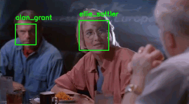

Face recognition with OpenCV, Python, and deep learning - PyImageSearch

Face recognition with OpenCV, Python, and deep learning - PyImageSearch

https://www.pyimagesearch.com/2018/06/18/face-recognition-with-opencv-python-and-deep-learning/

Learn how to perform face recognition using OpenCV, Python, and dlib by applying deep learning for highly accurate facial recognition.