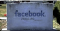
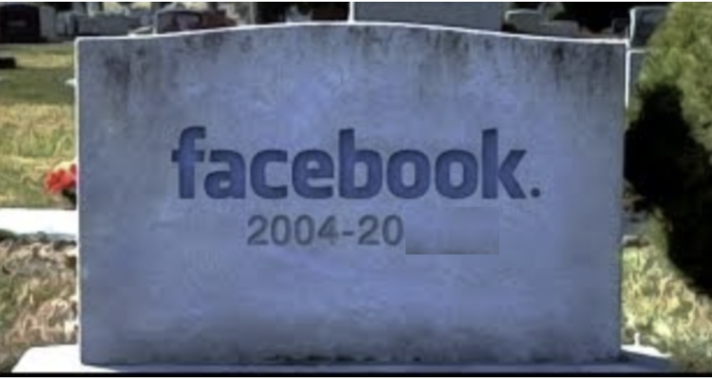
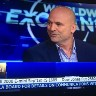
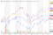

Facebook Is Dying, Libra Won’t Save It, & Wall Street Is Clueless

# Facebook Is Dying, Libra Won’t Save It, & Wall Street Is Clueless

[Lou Kerner](https://medium.com/@loukerner?source=post_page---------------------------)

[Jul 25](https://medium.com/crypto-oracle/facebook-is-dying-libra-wont-save-it-wall-street-is-clueless-47243c17f107?source=post_page---------------------------) · 3 min read

I was the first person to call Mark Zuckerberg in 2004 and offer to buy the company (I was running [Bolt](https://en.wikipedia.org/wiki/Bolt_(website)?source=post_page---------------------------) at the time). In March, 2010, I published [the first Wall Street style research report on Facebook](http://loukerner.tumblr.com/?source=post_page---------------------------) on a Tumblr blog, with a $100 billion five year price target (it was actively trading in the private markets at $16B). For a brief while, I went back to Wall Street as a “Social Media Analyst” where I upped my target valuation forFacebook to $200 billion (per this clip of me on Bloomberg TV in late 2010)

I still had hair in 2010

My 2014 revenue forecast was [off by just 1%](https://loukerner.tumblr.com/?source=post_page---------------------------), because I focused on **user engagement**. As Facebook continued to increase user engagement, I continued to be a Facebook bull. I believe that social media platforms are either growing user engagement, or they’re dying. And for eight years, Facebook was growing user engagement.

But Facebook’s Q4 ’17 earnings, released on January 31st, 2018, revealed the first decline in user engagement in Facebook’s history. Facebook gave the excuse that they were purposefully trying to prevent Facebook users from doing the #1 thing they liked to do on Facebook. Facebook was finally trying [to stop fake news](https://www.facebook.com/facebookmedia/blog/working-to-stop-misinformation-and-false-news?source=post_page---------------------------). I didn’t care about the excuse. So I turned bearish, penning [this blog post](https://goo.gl/WR8tv2?source=post_page---------------------------)to note the occasion.

It’s been 18 months since that post, and Facebook shares has underperformed the NASDAQ (up 5% vs. 15% for the NASDAQ). More telling, Facebook has dramatically underperformed it’s peer group (which I define as [FAMGA](https://medium.com/crypto-oracle/the-coming-epic-battle-between-crypto-famga-aka-facebook-apple-microsoft-google-amazon-1a05489c3abb?source=post_page---------------------------)), which averaged a gain of 33% over the past 18 months.

I believe Facebook will continue to underperform the NASDAQ and their peers, because of one simple graph.

# The Graph That Shows Facebook Is Dying

While Facebook [presented 19 slides](https://s21.q4cdn.com/399680738/files/doc_financials/2019/Q2/Q2-2019-Earnings-Presentation-07.24.2019.pdf?source=post_page---------------------------) on their earnings conference call on July 24th, they didn’t present the slide below, which, in my opinion, is the most important of all. The graph below shows the year-over-year change in user engagement, which is defined by Facebook as Daily Active Users/Monthly Active Users (DAU/MAU). It’s not a pretty picture:

The graph/data above shows that Facebook is dying. At the moment, it’s a slow death, but at some point, it will accelerate. That’s what social networks do. They grow engagement, until they don’t.

# What Wall Street Misses

The main thing that Wall Street misses is that revenue is a lagging indicator of engagement. So revenue growth is still accelerating (up 27.6% y-o-y), catching up to user and engagement growth of years past. When revenue starts slowing dramatically in 2020, which it will, Wall Street will be caught off guard.

# But What About Instagram & WhatsApp & Libra

WhatsApp and Instagram are both insanely great products with massive audiences. That said, those properties monetize users at a fraction of Facebook today.

And, finally, while I believe Libra is an audacious project, with unimaginable potential for wealth creation, I believe [Libra’s DOA for regulatory reasons](https://medium.com/crypto-oracle/david-marcus-testimony-to-congress-will-highlight-that-libra-is-doa-4b82f1c86d7c?source=post_page---------------------------).

[ ## Libra may be irrelevant by the time it gets the go ahead: CryptoOracle  ###  Lou Kerner of CryptoOracle says cryptocurrency is the next big thing and, if the U.S. regulators roll out the red tape…     ####  www.cnbc.com](https://www.cnbc.com/video/2019/07/18/libra-may-be-irrelevant-by-the-time-it-gets-the-go-ahead-cryptooracle.html?source=post_page---------------------------)

The bottom line is that the user engagement growth that powered Facebook’s stratospheric rise in valuation has come to an end, ….. investors beware.

*If you got value from this post ****please “Clap” below (up to 50 times). ****That’s how I get value. Thx!*