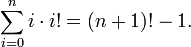

Factorial base numbers and permutations | General Abstract Nonsense

# Factorial base numbers and permutations

Jul 22, 2012   #[algorithms](https://generalabstractnonsense.com/tags/algorithms)

This is something I came across while doing a[project euler problem](http://projecteuler.net/problem=24). The problem was asking you to find what is the millionth lexicographic permutation of the digits 0 to 9. After solving the problem by writing a method that generated the next permutation of a number and calling it 999,999 times, I was browsing the thread with other people’s solutions, and came across someone who used factoradic numbers to solve it. I was quite intrigued as I hadn’t heard of this number system before and had no idea how it can help us generate the millionth permutation. I’m sure you are intrigued too, dear reader.

The idea is simple. In this number system, the ith number from the right has base i.

This sounds simple, but it makes one rethink how numbers work. We are used to constant base numbers, where the ith digit from the right has a place value of base^(i-1). However in factoradic, the ith digit from the right has a place value of (i-1)!. Why, is not immediately obvious, but if we go back and think why do decimal numbers’ digits have the place values they do, we can see the parallelism.

#### How base ten numbers work

In decimal, if you had just one digit, you could only represent the numbers from 0 to 9. If you wanted to keep counting further than 9, one way would be to use another, different kind of digit, one that you would use to count the number of Tens. Why Tens though and not Nines or Elevens? *Because 10 is 1 more than the maximum value you could represent with the previously existing digits*. If we decided to count the number of Nines instead with that new digit, then we would end up with two different representations for the number nine: 09 and 10 would be the same. On the other hand, if we decided to count the number of Elevens with that new digit, then we would have no way to represent the number ten. So now you have two digits, each one with 10 possible values and you can represent up to 10*10 different numbers, from 0 to 99. If you wanted to keep going further, you would have to add another yet different kind of digit to count the 100s, and so on.

#### How factorial base numbers work

Let’s adapt that to factoradic. The first digit has base 1, with only one possible value: 0. That’s not so useful, as you can’t count anything. It can only be zero, nothing else. So we add another kind of digit to count the number of Ones. But this new digit will have a different base: base 2. So it has two possible values: 0 and 1. As we have a digit with 2 possible values, and another with 1 possible value, we can create a total of 2*1 = 2! different numbers. Their values range from 0 to 2!-1.

If we want to count further than that, we add another digit, which will have base 3 this time, and possible values: 0, 1, 2. With this digit, we will count the number of 2!s, which is the previously maximum representable value plus 1. Now we can represent 3*2*1 = 3! different numbers ranging from 0 to 3!-1. And so on.

- The ith digit from the right has place value (i-1)! as it counts the number of (i-1)!s.
- The maximum value we can represent with n digits is : (n-1) * (n-1)! + (n-2) * (n-2)! + .. + 3 * 3! + 2 * 2! + 1 * 1!
- To convert a 7 digit number like 4533210 from factoradic to decimal we do 4 * **6!** + 5 * **5!** + 3 * **4!** + 3 * **3!** * 2 * **2!** + 1 * **1!** + 0 * **0!** = 3575

Another fact which makes this number system work, and which can be proven by induction is thatwhich means that the biggest number you can represent with n digits in factoradic, is equal to the smallest number you can represent with n+1 digits minus 1. This establishes that there is a unique representation for every integer in factoradic.

### Factoradic numbers and permutations

Now the reason any of this is relevant to the permutations project Euler problem, is that there is a natural mapping between the numbers with n digits in factorial representation, and the permutations of n elements in lexicographical order.

A _permutation _of a set of objects is a rearrangement of these objects into a particular order.

For example, the set {0, 1, 2} has 3! permutations. In lexicographical (or alphabetical) order, they are the following:

| Lexicographic permutation | Index (decimal) | Index (factoradic) |
| --- | --- | --- |
| 012 | 0   | 000 |
| 021 | 1   | 010 |
| 102 | 2   | 100 |
| 120 | 3   | 110 |
| 201 | 4   | 200 |
| 210 | 5   | 210 |

There is a way to calculate a permutation by its index without enumerating all the previous ones! Let’s say you want to know what is the 4th lexicographical permutation of the digits in the set {0, 1, 2}. That is, the permutation with index 3, as they are zero indexed.

The first thing to do is convert decimal 3 to its factoradic representation and get 110. Then in order to calculate the permutation we follow these steps:

| Available set elements in lexicographic order | {0, 1, 2} |
| --- | --- |
| Factoradic Index | **1**10 |
| Permuation | ?   |

The leftmost digit of the factoradic number, is the same as the leftmost digit of the permutation. In our case that’s “1”. We use this digit as the first digit in the permutation, and delete it from the set of available elements.

| Available set elements in lexicographic order | {0, (1), 2} |
| --- | --- |
| Factoradic Index | (1)(1)0 |
| Permuation | 1.. |

At this point our available set elements are {0, 2} and the unused digits in the factoradic number are (1)10. Now, the cool bit is that if we view the set {0, 2} as a zero-indexed list, and if we view the remaining digits in the factoradic number as indices to this list, then each successive digit defines the next number of the permutation!

So, looking at the factoradic number **(1)10** the next digit to use is **1**, which means that the next number in the permutation is the number with index 1 from the set **{0, (1), 2}.** That is 2. We add this number to the permutation, delete it from the set elements, and mark it as used in the factoradic number.Now we have:

| Available set elements in lexicographic order | {0, (1), (2)} |
| --- | --- |
| Factoradic Index | (11)**0** |
| Permuation | 12.. |

Looking at the factoradic number (11)0 the next digit in the permutation is the one with index 0 in the list {0, (1), (2)}. That is 0. We delete this element from the set and put it in the permutation.

| Available set elements in lexicographic order | (0), (1), (2)} |
| --- | --- |
| Factoradic Index | (110) |
| Permuation | 120 |

And that’s it! We calculated that the permutation with index 3 is 120 which can be verified from our table.

### Converting decimal to factorial base

When we did the conversion above, the first step was to convert the index of the wanted permutation from decimal to factorial base. But how do we do that? Fortunately, the old method of successive integer divisions by the place value for each position still works.

Let’s see an example. Let’s convert 81 decimal to factoradic. 81 is less than 5! (=120) but more than 4!(=24) which means it should be possible to represent it using 5 digits in factoradic, because as we saw, the ith digit from the right has place value (i-1)!

Since our number has 5 digits, it will be of the form d4 * 4! + d3 * 3! + d2 * 2! + d1 * 1! + d0 * 0!

Performing successive divisions by the place value for each position we get 81 = **3** * 4! + *9*_9 _= **1** * 3! + *3*_3 _= **1** * 2! + *1**1* = **1** * 1! + *0**0* = **0** * 0! + *0*

So the result is 31110 in factoradic.
Let’s convert it back to decimal to check we got the right number:
3*4! + 1*3! + 1*2! + 1*1! + 0*0! equals 81 indeed.

### So how can you find the millionth permutation fast?

Going back to the original problem of finding the millionth lexicographic permutation of the digits 0-9, now with our newly acquired factoradic skills, we can find the answer by simply doing

	permutationByFactoradicIndex(decimalToFactoradic(1,000,000 - 1),  sortedSetElements)

It’s just a matter of writing these two functions.

#### References:

http://en.wikipedia.org/wiki/Factorial_number_system
http://www.keithschwarz.com/interesting/code/?dir=factoradic-permutation

http://www.scribd.com/doc/77075601/Generating-Permutations-From-Factoradic-Numbers

http://www.mathsisfun.com/base-conversion-method.html