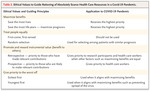
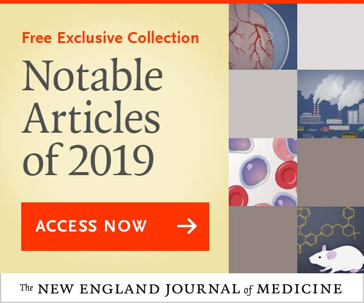
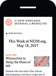

Fair Allocation of Scarce Medical Resources in the Time of Covid-19 | NEJM

[Sounding Board](https://www.nejm.org/medical-articles/sounding-board)

# Fair Allocation of Scarce Medical Resources in the Time of Covid-19

List of authors.

- Ezekiel J. Emanuel, M.D., Ph.D.,
- Govind Persad, J.D., Ph.D.,
- Ross Upshur, M.D.,
- Beatriz Thome, M.D., M.P.H., Ph.D.,
- Michael Parker, Ph.D.,
- Aaron Glickman, B.A.,
- Cathy Zhang, B.A.,
- Connor Boyle, B.A.,
- Maxwell Smith, Ph.D.,
- and James P. Phillips, M.D.

- [Article](https://www.nejm.org/doi/full/10.1056/NEJMsb2005114#full)

- [Figures/Media](https://www.nejm.org/doi/full/10.1056/NEJMsb2005114#figures_media)

 [Metrics](https://www.nejm.org/doi/metrics/10.1056/NEJMsb2005114)

- [*39* References](https://www.nejm.org/doi/full/10.1056/NEJMsb2005114#article_references)

Covid-19 is officially a pandemic. It is a novel infection with serious clinical manifestations, including death, and it has reached at least 124 countries and territories. Although the ultimate course and impact of Covid-19 are uncertain, it is not merely possible but likely that the disease will produce enough severe illness to overwhelm health care infrastructure. Emerging viral pandemics “can place extraordinary and sustained demands on public health and health systems and on providers of essential community services.”[1](https://www.nejm.org/doi/full/10.1056/NEJMsb2005114#) Such demands will create the need to ration medical equipment and interventions.

Rationing is already here. In the United States, perhaps the earliest example was the near-immediate recognition that there were not enough high-filtration N-95 masks for health care workers, prompting contingency guidance on how to reuse masks designed for single use.[2](https://www.nejm.org/doi/full/10.1056/NEJMsb2005114#) Physicians in Italy have proposed directing crucial resources such as intensive care beds and ventilators to patients who can benefit most from treatment.[3,4](https://www.nejm.org/doi/full/10.1056/NEJMsb2005114#) Daegu, South Korea — home to most of that country’s Covid-19 cases — faced a hospital bed shortage, with some patients dying at home while awaiting admission.[5](https://www.nejm.org/doi/full/10.1056/NEJMsb2005114#) In the United Kingdom, protective gear requirements for health workers have been downgraded, causing condemnation among providers.[6](https://www.nejm.org/doi/full/10.1056/NEJMsb2005114#) The rapidly growing imbalance between supply and demand for medical resources in many countries presents an inherently normative question: How can medical resources be allocated fairly during a Covid-19 pandemic?

## Health Impacts of Moderate-to-Severe Pandemics

 Table 1. Potential U.S. Health and Health Care Effects of Pandemic Covid-19 as Compared with Influenza.

In 2005, the U.S. Department of Health and Human Services (HHS) developed a Pandemic Influenza Plan that modeled the potential health care impact of moderate and severe influenza pandemics. The plan was updated after the 2009 H1N1 outbreak and most recently in 2017.[1](https://www.nejm.org/doi/full/10.1056/NEJMsb2005114#) It suggests that a moderate pandemic will infect about 64 million Americans, with about 800,000 (1.25%) requiring hospitalization and 160,000 (0.25%) requiring beds in the intensive care unit (ICU) ([Table 1](https://www.nejm.org/doi/full/10.1056/NEJMsb2005114#)).[1](https://www.nejm.org/doi/full/10.1056/NEJMsb2005114#) A severe pandemic would dramatically increase these demands ([Table 1](https://www.nejm.org/doi/full/10.1056/NEJMsb2005114#)).

Modeling the Covid-19 pandemic is challenging. But there are data that can be used to project resource demands. Estimates of the reproductive number (R) of SARS-CoV-2 show that at the beginning of the epidemic, each infected person spreads the virus to at least two others, on average.[10](https://www.nejm.org/doi/full/10.1056/NEJMsb2005114#) A conservatively low estimate is that 5% of the population could become infected within 3 months. Preliminary data from China and Italy regarding the distribution of case severity and fatality vary widely.[7,8](https://www.nejm.org/doi/full/10.1056/NEJMsb2005114#) A recent large-scale analysis from China suggests that 80% of those infected either are asymptomatic or have mild symptoms, a finding that implies that demand for advanced medical services might apply to only 20% of the total infected. Of patients infected with Covid-19, about 15% have severe illness and 5% have critical illness.[8](https://www.nejm.org/doi/full/10.1056/NEJMsb2005114#) Overall mortality ranges from 0.25% to as high as 3.0%.[11](https://www.nejm.org/doi/full/10.1056/NEJMsb2005114#) Case fatality rates are much higher for vulnerable populations, such as persons over the age of 80 years (>14%) and those with coexisting conditions (10% for those with cardiovascular disease and 7% for those with diabetes).[8](https://www.nejm.org/doi/full/10.1056/NEJMsb2005114#) Overall, Covid-19 is substantially deadlier than seasonal influenza, which has mortality of roughly 0.1%.

The exact number of cases will depend on a number of factors that are unknowable at this time, including the effect of social distancing and other interventions. However, the estimate given above — that 5% of the population is infected — is low; new data are only likely to increase estimates of sickness and demand for health care infrastructure.

## Health System Capacity

Even a conservative estimate shows that the health needs created by the coronavirus pandemic go well beyond the capacity of U.S. hospitals.[9](https://www.nejm.org/doi/full/10.1056/NEJMsb2005114#) According to the American Hospital Association, there were 5198 community hospitals and 209 federal hospitals in the United States in 2018. In the community hospitals, there were 792,417 beds, with 3532 emergency departments and 96,500 ICU beds, of which 23,000 were neonatal and 5100 pediatric, leaving just under 68,400 ICU beds of all types for the adult population.[12](https://www.nejm.org/doi/full/10.1056/NEJMsb2005114#) Other estimates of ICU bed capacity, which try to account for purported undercounting in the American Hospital Association data, show a total of 85,000 adult ICU beds of all types.[13](https://www.nejm.org/doi/full/10.1056/NEJMsb2005114#)

There are approximately 62,000 full-featured ventilators (the type needed to adequately treat the most severe complications of Covid-19) available in the United States.[14](https://www.nejm.org/doi/full/10.1056/NEJMsb2005114#) Approximately 10,000 to 20,000 more are estimated to be on call in our Strategic National Stockpile,[15](https://www.nejm.org/doi/full/10.1056/NEJMsb2005114#) and 98,000 ventilators that are not full-featured but can provide basic function in an emergency during crisis standards of care also exist.[14](https://www.nejm.org/doi/full/10.1056/NEJMsb2005114#) Supply limitations constrain the rapid production of more ventilators; manufacturers are unsure of how many they can make in the next year.[16](https://www.nejm.org/doi/full/10.1056/NEJMsb2005114#) However, in the Covid-19 pandemic, the limiting factor for ventilator use will most likely not be ventilators but healthy respiratory therapists and trained critical care staff to operate them safely over three shifts every day. In 2018, community hospitals employed about 76,000 full-time respiratory therapists,[12](https://www.nejm.org/doi/full/10.1056/NEJMsb2005114#) and there are about 512,000 critical care nurses — of which ICU nurses are a subset.[17](https://www.nejm.org/doi/full/10.1056/NEJMsb2005114#) California law requires one respiratory therapist for every four ventilated patients; thus, this number of respiratory therapists could care for a maximum of 100,000 patients daily (25,000 respiratory therapists per shift).

Given these numbers — and unless the epidemic curve of infected individuals is flattened over a very long period of time — the Covid-19 pandemic is likely to cause a shortage of hospital beds, ICU beds, and ventilators. It is also likely to affect the availability of the medical workforce, since doctors and nurses are already becoming ill or quarantined.[18](https://www.nejm.org/doi/full/10.1056/NEJMsb2005114#) Even in a moderate pandemic, hospital beds and ventilators are likely to be scarce in geographic areas with large outbreaks, such as Seattle, or in rural and smaller hospitals that have much less space, staff, and supplies than large academic medical centers.

Diagnostic, therapeutic, and preventive interventions will also be scarce. Pharmaceuticals like chloroquine, remdesivir, and favipiravir are currently undergoing clinical trials, and other experimental treatments are at earlier stages of study.[19-21](https://www.nejm.org/doi/full/10.1056/NEJMsb2005114#) Even if one of them proves effective, scaling up supply will take time.[22](https://www.nejm.org/doi/full/10.1056/NEJMsb2005114#) The use of convalescent serum, blood products from persons whose immune system has defeated Covid-19, is being contemplated as a possible treatment and preventive intervention.[19](https://www.nejm.org/doi/full/10.1056/NEJMsb2005114#) Likewise, if an effective vaccine is developed, it will take time to produce, distribute, and administer. Other critical medical supplies and equipment, such as personal protective equipment (PPE), are already scarce, presenting the danger that medical staff time will itself become scarce as physicians and nurses become infected.[2](https://www.nejm.org/doi/full/10.1056/NEJMsb2005114#) Technical and governmental failures in the United States have led to a persistent scarcity of tests.[23](https://www.nejm.org/doi/full/10.1056/NEJMsb2005114#) As more countries have been affected by Covid-19, worldwide demand for tests has begun to outstrip production, creating the need to prioritize patients.

Public health measures known to reduce viral spread, such as social distancing, cough etiquette, and hand hygiene, finally seem to be a U.S. national priority and may make resource shortages less severe by narrowing the gap between medical need and the available supply of treatments. But public health mitigation efforts do not obviate the need to adequately prepare for the allocation of scarce resources before it becomes necessary.

The choice to set limits on access to treatment is not a discretionary decision, but a necessary response to the overwhelming effects of a pandemic. The question is not whether to set priorities, but how to do so ethically and consistently, rather than basing decisions on individual institutions’ approaches or a clinician’s intuition in the heat of the moment.

## Ethical Values for Rationing Health Resources in a Pandemic

Previous proposals for allocation of resources in pandemics and other settings of absolute scarcity, including our own prior research and analysis, converge on four fundamental values: maximizing the benefits produced by scarce resources, treating people equally, promoting and rewarding instrumental value, and giving priority to the worst off.[24-29](https://www.nejm.org/doi/full/10.1056/NEJMsb2005114#) Consensus exists that an individual person’s wealth should not determine who lives or dies.[24-33](https://www.nejm.org/doi/full/10.1056/NEJMsb2005114#) Although medical treatment in the United States outside pandemic contexts is often restricted to those able to pay, no proposal endorses ability-to-pay allocation in a pandemic.[24-33](https://www.nejm.org/doi/full/10.1056/NEJMsb2005114#)

 Table 2. Ethical Values to Guide Rationing of Absolutely Scarce Health Care Resources in a Covid-19 Pandemic.

Each of these four values can be operationalized in various ways ([Table 2](https://www.nejm.org/doi/full/10.1056/NEJMsb2005114#)). Maximization of benefits can be understood as saving the most individual lives or as saving the most life-years by giving priority to patients likely to survive longest after treatment.[24,26,28,29](https://www.nejm.org/doi/full/10.1056/NEJMsb2005114#) Treating people equally could be attempted by random selection, such as a lottery, or by a first-come, first-served allocation.[24,28](https://www.nejm.org/doi/full/10.1056/NEJMsb2005114#) Instrumental value could be promoted by giving priority to those who can save others, or rewarded by giving priority to those who have saved others in the past.[24,29](https://www.nejm.org/doi/full/10.1056/NEJMsb2005114#) And priority to the worst off could be understood as giving priority either to the sickest or to younger people who will have lived the shortest lives if they die untreated.[24,28-30](https://www.nejm.org/doi/full/10.1056/NEJMsb2005114#)

The proposals for allocation discussed above also recognize that all these ethical values and ways to operationalize them are compelling. No single value is sufficient alone to determine which patients should receive scarce resources.[24-33](https://www.nejm.org/doi/full/10.1056/NEJMsb2005114#) Hence, fair allocation requires a multivalue ethical framework that can be adapted, depending on the resource and context in question.[24-33](https://www.nejm.org/doi/full/10.1056/NEJMsb2005114#)

## Who Gets Health Resources in a Covid-19 Pandemic?

These ethical values — maximizing benefits, treating equally, promoting and rewarding instrumental value, and giving priority to the worst off — yield six specific recommendations for allocating medical resources in the Covid-19 pandemic: maximize benefits; prioritize health workers; do not allocate on a first-come, first-served basis; be responsive to evidence; recognize research participation; and apply the same principles to all Covid-19 and non–Covid-19 patients.

**Recommendation 1:** In the context of a pandemic, the value of maximizing benefits is most important.[3,26,28,29,31-33](https://www.nejm.org/doi/full/10.1056/NEJMsb2005114#) This value reflects the importance of responsible stewardship of resources: it is difficult to justify asking health care workers and the public to take risks and make sacrifices if the promise that their efforts will save and lengthen lives is illusory.[29](https://www.nejm.org/doi/full/10.1056/NEJMsb2005114#) Priority for limited resources should aim both at saving the most lives and at maximizing improvements in individuals’ post-treatment length of life. Saving more lives and more years of life is a consensus value across expert reports.[26,28,29](https://www.nejm.org/doi/full/10.1056/NEJMsb2005114#) It is consistent both with utilitarian ethical perspectives that emphasize population outcomes and with nonutilitarian views that emphasize the paramount value of each human life.[34](https://www.nejm.org/doi/full/10.1056/NEJMsb2005114#) There are many reasonable ways of balancing saving more lives against saving more years of life[30](https://www.nejm.org/doi/full/10.1056/NEJMsb2005114#); whatever balance between lives and life-years is chosen must be applied consistently.

Limited time and information in a Covid-19 pandemic make it justifiable to give priority to maximizing the number of patients that survive treatment with a reasonable life expectancy and to regard maximizing improvements in length of life as a subordinate aim. The latter becomes relevant only in comparing patients whose likelihood of survival is similar. Limited time and information during an emergency also counsel against incorporating patients’ future quality of life, and quality-adjusted life-years, into benefit maximization. Doing so would require time-consuming collection of information and would present ethical and legal problems.[28,34](https://www.nejm.org/doi/full/10.1056/NEJMsb2005114#) However, encouraging all patients, especially those facing the prospect of intensive care, to document in an advance care directive what future quality of life they would regard as acceptable and when they would refuse ventilators or other life-sustaining interventions can be appropriate.

Operationalizing the value of maximizing benefits means that people who are sick but could recover if treated are given priority over those who are unlikely to recover even if treated and those who are likely to recover without treatment. Because young, severely ill patients will often comprise many of those who are sick but could recover with treatment, this operationalization also has the effect of giving priority to those who are worst off in the sense of being at risk of dying young and not having a full life.[25,29,30](https://www.nejm.org/doi/full/10.1056/NEJMsb2005114#)

Because maximizing benefits is paramount in a pandemic, we believe that removing a patient from a ventilator or an ICU bed to provide it to others in need is also justifiable and that patients should be made aware of this possibility at admission.[3,28,29,33,35](https://www.nejm.org/doi/full/10.1056/NEJMsb2005114#) Undoubtedly, withdrawing ventilators or ICU support from patients who arrived earlier to save those with better prognosis will be extremely psychologically traumatic for clinicians — and some clinicians might refuse to do so. However, many guidelines agree that the decision to withdraw a scarce resource to save others is not an act of killing and does not require the patient’s consent.[26,28,29,33,35](https://www.nejm.org/doi/full/10.1056/NEJMsb2005114#) We agree with these guidelines that it is the ethical thing to do.[26](https://www.nejm.org/doi/full/10.1056/NEJMsb2005114#) Initially allocating beds and ventilators according to the value of maximizing benefits could help reduce the need for withdrawal.

**Recommendation 2:** Critical Covid-19 interventions — testing, PPE, ICU beds, ventilators, therapeutics, and vaccines — should go first to front-line health care workers and others who care for ill patients and who keep critical infrastructure operating, particularly workers who face a high risk of infection and whose training makes them difficult to replace.[27](https://www.nejm.org/doi/full/10.1056/NEJMsb2005114#) These workers should be given priority not because they are somehow more worthy, but because of their instrumental value: they are essential to pandemic response.[27,28](https://www.nejm.org/doi/full/10.1056/NEJMsb2005114#) If physicians and nurses are incapacitated, all patients — not just those with Covid-19 — will suffer greater mortality and years of life lost. Whether health workers who need ventilators will be able to return to work is uncertain, but giving them priority for ventilators recognizes their assumption of the high-risk work of saving others, and it may also discourage absenteeism.[28,36](https://www.nejm.org/doi/full/10.1056/NEJMsb2005114#) Priority for critical workers must not be abused by prioritizing wealthy or famous persons or the politically powerful above first responders and medical staff — as has already happened for testing.[37](https://www.nejm.org/doi/full/10.1056/NEJMsb2005114#) Such abuses will undermine trust in the allocation framework.

**Recommendation 3:** For patients with similar prognoses, equality should be invoked and operationalized through random allocation, such as a lottery, rather than a first-come, first-served allocation process. First-come, first-served is used for such resources as transplantable kidneys, where scarcity is long-standing and patients can survive without the scarce resource. Conversely, treatments for coronavirus address urgent need, meaning that a first-come, first-served approach would unfairly benefit patients living nearer to health facilities. And first-come, first-served medication or vaccine distribution would encourage crowding and even violence during a period when social distancing is paramount. Finally, first-come, first-served approaches mean that people who happen to get sick later on, perhaps because of their strict adherence to recommended public health measures, are excluded from treatment, worsening outcomes without improving fairness.[33](https://www.nejm.org/doi/full/10.1056/NEJMsb2005114#) In the face of time pressure and limited information, random selection is also preferable to trying to make finer-grained prognostic judgments within a group of roughly similar patients.

**Recommendation 4:** Prioritization guidelines should differ by intervention and should respond to changing scientific evidence. For instance, younger patients should not be prioritized for Covid-19 vaccines, which prevent disease rather than cure it, or for experimental post- or pre-exposure prophylaxis. Covid-19 outcomes have been significantly worse in older persons and those with chronic conditions.[8](https://www.nejm.org/doi/full/10.1056/NEJMsb2005114#) Invoking the value of maximizing saving lives justifies giving older persons priority for vaccines immediately after health care workers and first responders. If the vaccine supply is insufficient for patients in the highest risk categories — those over 60 years of age or with coexisting conditions — then equality supports using random selection, such as a lottery, for vaccine allocation.[24,28](https://www.nejm.org/doi/full/10.1056/NEJMsb2005114#) Invoking instrumental value justifies prioritizing younger patients for vaccines only if epidemiologic modeling shows that this would be the best way to reduce viral spread and the risk to others.

Epidemiologic modeling is even more relevant in setting priorities for coronavirus testing. Federal guidance currently gives priority to health care workers and older patients,[38](https://www.nejm.org/doi/full/10.1056/NEJMsb2005114#) but reserving some tests for public health surveillance (as some states are doing) could improve knowledge about Covid-19 transmission and help researchers target other treatments to maximize benefits.[39](https://www.nejm.org/doi/full/10.1056/NEJMsb2005114#)

Conversely, ICU beds and ventilators are curative rather than preventive. Patients who need them face life-threatening conditions. Maximizing benefits requires consideration of prognosis — how long the patient is likely to live if treated — which may mean giving priority to younger patients and those with fewer coexisting conditions. This is consistent with the Italian guidelines that potentially assign a higher priority for intensive care access to younger patients with severe illness than to elderly patients.[3,4](https://www.nejm.org/doi/full/10.1056/NEJMsb2005114#) Determining the benefit-maximizing allocation of antivirals and other experimental treatments, which are likely to be most effective in patients who are seriously but not critically ill, will depend on scientific evidence. These treatments may produce the most benefit if preferentially allocated to patients who would fare badly on ventilation.

**Recommendation 5:** People who participate in research to prove the safety and effectiveness of vaccines and therapeutics should receive some priority for Covid-19 interventions. Their assumption of risk during their participation in research helps future patients, and they should be rewarded for that contribution. These rewards will also encourage other patients to participate in clinical trials. Research participation, however, should serve only as a tiebreaker among patients with similar prognoses.

**Recommendation 6:** There should be no difference in allocating scarce resources between patients with Covid-19 and those with other medical conditions. If the Covid-19 pandemic leads to absolute scarcity, that scarcity will affect all patients, including those with heart failure, cancer, and other serious and life-threatening conditions requiring prompt medical attention. Fair allocation of resources that prioritizes the value of maximizing benefits applies across all patients who need resources. For example, a doctor with an allergy who goes into anaphylactic shock and needs life-saving intubation and ventilator support should receive priority over Covid-19 patients who are not frontline health care workers.

## Implementing Rationing Policies

The need to balance multiple ethical values for various interventions and in different circumstances is likely to lead to differing judgments about how much weight to give each value in particular cases. This highlights the need for fair and consistent allocation procedures that include the affected parties: clinicians, patients, public officials, and others. These procedures must be transparent to ensure public trust in their fairness.

The outcome of these fair allocation procedures, informed by the ethical values and recommendations delineated here, should be the development of prioritization guidelines that ensure that individual physicians are not faced with the terrible task of improvising decisions about whom to treat or making these decisions in isolation. Placing such burdens on individual physicians could exact an acute and life-long emotional toll. However, even well-designed guidelines can present challenging problems in real-time decision making and implementation. To help clinicians navigate these challenges, institutions may employ triage officers, physicians in roles outside direct patient care, or committees of experienced physicians and ethicists, to help apply guidelines, to assist with rationing decisions, or to make and implement choices outright — relieving the individual front-line clinicians of that burden.[26](https://www.nejm.org/doi/full/10.1056/NEJMsb2005114#) Institutions may also include appeals processes, but appeals should be limited to concerns about procedural mistakes, given time and resource constraints.[29](https://www.nejm.org/doi/full/10.1056/NEJMsb2005114#)

## Conclusions

Governments and policy makers must do all they can to prevent the scarcity of medical resources. However, if resources do become scarce, we believe the six recommendations we delineate should be used to develop guidelines that can be applied fairly and consistently across cases. Such guidelines can ensure that individual doctors are never tasked with deciding unaided which patients receive life-saving care and which do not. Instead, we believe guidelines should be provided at a higher level of authority, both to alleviate physician burden and to ensure equal treatment. The described recommendations could shape the development of these guidelines.

This article was published on March 23, 2020, at NEJM.org.

## Author Affiliations

From the Department of Medical Ethics and Health Policy, Perelman School of Medicine, University of Pennsylvania, Philadelphia (E.J.E., A.G., C.Z., C.B.); the University of Denver Sturm College of Law, Denver (G.P.); the Division of Clinical Public Health, Dalla Lana School of Public Health, University of Toronto, Toronto (R.U.), and the School of Health Studies, Western University, London, ON (M.S.) — both in Canada; the Preventive Medicine Department, Federal University of São Paulo, São Paulo (B.T.); the Wellcome Centre of Ethics and Humanities, the Ethox Centre, University of Oxford, Oxford, United Kingdom (M.P.); and the Department of Emergency Medicine, George Washington University Hospital, Washington, DC (J.P.P.).

## References *(39)*

1. 1.

**1. **Pandemic influenza plan: 2017 update. Washington, DC: Department of Health and Human Services, 2017 ([https://www.cdc.gov/flu/pandemic-resources/pdf/pan-flu-report-2017v2.pdf. opens in new tab](https://www.cdc.gov/flu/pandemic-resources/pdf/pan-flu-report-2017v2.pdf)).

[Google Scholar. opens in new tab](http://scholar.google.com/scholar?hl=en&q=Pandemic+influenza+plan%3A+2017+update.+Washington%2C+DC%3A+Department+of+Health+and+Human+Services%2C+2017+%28https%3A%2F%2Fwww.cdc.gov%2Fflu%2Fpandemic-resources%2Fpdf%2Fpan-flu-report-2017v2.pdf%29.)

2. 2.

**2. **Strategies for optimizing the supply of N95 respirators. Atlanta: Centers for Disease Control and Prevention, 2020 ([https://www.cdc.gov/coronavirus/2019-ncov/hcp/respirators-strategy/index.html. opens in new tab](https://www.cdc.gov/coronavirus/2019-ncov/hcp/respirators-strategy/index.html)).

[Google Scholar. opens in new tab](http://scholar.google.com/scholar?hl=en&q=Strategies+for+optimizing+the+supply+of+N95+respirators.+Atlanta%3A+Centers+for+Disease+Control+and+Prevention%2C+2020+%28https%3A%2F%2Fwww.cdc.gov%2Fcoronavirus%2F2019-ncov%2Fhcp%2Frespirators-strategy%2Findex.html%29.)

3. 3.

**3. **Vergano M, Bertolini G, Giannini A, et al. Clinical Ethics Recommendations for the Allocation of Intensive Care Treatments, in Exceptional, Resource-Limited Circumstances. Italian Society of Anesthesia, Analgesia, Resuscitation, and Intensive Care (SIAARTI). March  16, 2020 ([http://www.siaarti.it/SiteAssets/News/COVID19%20-%20documenti%20SIAARTI/SIAARTI%20-%20Covid-19%20-%20Clinical%20Ethics%20Reccomendations.pdf. opens in new tab](http://www.siaarti.it/SiteAssets/News/COVID19%20-%20documenti%20SIAARTI/SIAARTI%20-%20Covid-19%20-%20Clinical%20Ethics%20Reccomendations.pdf)).

[Google Scholar. opens in new tab](http://scholar.google.com/scholar_lookup?hl=en&publication_year=2020&author=M+Verganoauthor=G+Bertoliniauthor=A+Giannini&title=Clinical+Ethics+Recommendations+for+the+Allocation+of+Intensive+Care+Treatments%2C+in+Exceptional%2C+Resource-Limited+Circumstances)

4. 4.

**4. **Mounk Y. The extraordinary decisions facing Italian doctors. Atlantic. March 11, 2020 ([https://www.theatlantic.com/ideas/archive/2020/03/who-gets-hospital-bed/607807/. opens in new tab](https://www.theatlantic.com/ideas/archive/2020/03/who-gets-hospital-bed/607807/)).

[Google Scholar. opens in new tab](http://scholar.google.com/scholar_lookup?hl=en&publication_year=2020&author=Y+Mounk&title=The+extraordinary+decisions+facing+Italian+doctors.)[Google Scholar. opens in new tab](http://scholar.google.com/scholar?hl=en&q=https%3A%2F%2Fwww.theatlantic.com%2Fideas%2Farchive%2F2020%2F03%2Fwho-gets-hospital-bed%2F607807%2F%29.)

5. 5.

**5. **Kuhn A. How a South Korean city is changing tactics to tamp down its COVID-19 surge. NPR. March 10, 2020 ([https://www.npr.org/sections/goatsandsoda/2020/03/10/812865169/how-a-south-korean-city-is-changing-tactics-to-tamp-down-its-covid-19-surge. opens in new tab](https://www.npr.org/sections/goatsandsoda/2020/03/10/812865169/how-a-south-korean-city-is-changing-tactics-to-tamp-down-its-covid-19-surge)).

[Google Scholar. opens in new tab](http://scholar.google.com/scholar?hl=en&q=Kuhn+A.+How+a+South+Korean+city+is+changing+tactics+to+tamp+down+its+COVID-19+surge.+NPR.+March+10%2C+2020+%28https%3A%2F%2Fwww.npr.org%2Fsections%2Fgoatsandsoda%2F2020%2F03%2F10%2F812865169%2Fhow-a-south-korean-city-is-changing-tactics-to-tamp-down-its-covid-19-surge%29.)

6. 6.

**6. **Campbell D, Busby M. ‘Not fit for purpose’: UK medics condemn Covid-19 protection. The Guardian. March 16, 2020 ([https://www.theguardian.com/society/2020/mar/16/not-fit-for-purpose-uk-medics-condemn-covid-19-protection. opens in new tab](https://www.theguardian.com/society/2020/mar/16/not-fit-for-purpose-uk-medics-condemn-covid-19-protection)).

[Google Scholar. opens in new tab](http://scholar.google.com/scholar?hl=en&q=Campbell+D%2C+Busby+M.+%E2%80%98Not+fit+for+purpose%E2%80%99%3A+UK+medics+condemn+Covid-19+protection.+The+Guardian.+March+16%2C+2020+%28https%3A%2F%2Fwww.theguardian.com%2Fsociety%2F2020%2Fmar%2F16%2Fnot-fit-for-purpose-uk-medics-condemn-covid-19-protection%29.)

7. 7.

**7. **Livingston E, Bucher K. Coronavirus disease 2019 (COVID-19) in Italy. JAMA 2020  March  17 (Epub ahead of print).

    - [Medline. opens in new tab](https://www.nejm.org/servlet/linkout?suffix=r7&dbid=8&doi=10.1056%2FNEJMsb2005114&key=32074264)

[Google Scholar. opens in new tab](http://scholar.google.com/scholar_lookup?hl=en&publication_year=2020&author=E+Livingstonauthor=K+Bucher&title=Coronavirus+disease+2019+%28COVID-19%29+in+Italy.)

8. 8.

**8. **Wu Z, McGoogan JM. Characteristics of and important lessons from the coronavirus disease 2019 (COVID-19) outbreak in China: summary of a report of 72 314 cases from the Chinese Center for Disease Control and Prevention. JAMA 2020  February  24 (Epub ahead of print).

    - [Crossref. opens in new tab](https://www.nejm.org/servlet/linkout?suffix=r8&dbid=16&doi=10.1056%2FNEJMsb2005114&key=10.1001%2Fjama.2020.2648)

    - [Medline. opens in new tab](https://www.nejm.org/servlet/linkout?suffix=r8&dbid=8&doi=10.1056%2FNEJMsb2005114&key=31968075)

[Google Scholar. opens in new tab](http://scholar.google.com/scholar_lookup?hl=en&publication_year=2020&author=Z+Wuauthor=JM+McGoogan&title=Characteristics+of+and+important+lessons+from+the+coronavirus+disease+2019+%28COVID-19%29+outbreak+in+China%3A+summary+of+a+report+of+72%E2%80%AF314+cases+from+the+Chinese+Center+for+Disease+Control+and+Prevention.)

9. 9.

**9. **Ferguson NM, Laydon D, Nedjati-Gilani G, et al. Impact of non-pharmaceutical interventions (NPIs) to reduce COVID-19 mortality and healthcare demand. London: Imperial College London, March 16, 2020 ([https://www.imperial.ac.uk/media/imperial-college/medicine/sph/ide/gida-fellowships/Imperial-College-COVID19-NPI-modelling-16-03-2020.pdf. opens in new tab](https://www.imperial.ac.uk/media/imperial-college/medicine/sph/ide/gida-fellowships/Imperial-College-COVID19-NPI-modelling-16-03-2020.pdf)).

[Google Scholar. opens in new tab](http://scholar.google.com/scholar?hl=en&q=Ferguson+NM%2C+Laydon+D%2C+Nedjati-Gilani+G%2C+et+al.+Impact+of+non-pharmaceutical+interventions+%28NPIs%29+to+reduce+COVID-19+mortality+and+healthcare+demand.+London%3A+Imperial+College+London%2C+March+16%2C+2020+%28https%3A%2F%2Fwww.imperial.ac.uk%2Fmedia%2Fimperial-college%2Fmedicine%2Fsph%2Fide%2Fgida-fellowships%2FImperial-College-COVID19-NPI-modelling-16-03-2020.pdf%29.)

10. 10.

**10. **Li Q, Guan X, Wu P, et al. Early transmission dynamics in Wuhan, China, of novel coronavirus–infected pneumonia. N Engl J Med. DOI: 10.1056/NEJMoa2001316.

    - [Free Full Text](https://www.nejm.org/doi/full/10.1056/NEJMoa2001316)

[Google Scholar. opens in new tab](http://scholar.google.com/scholar?hl=en&q=Li+Q%2C+Guan+X%2C+Wu+P%2C+et+al.+Early+transmission+dynamics+in+Wuhan%2C+China%2C+of+novel+coronavirus%E2%80%93infected+pneumonia.+N+Engl+J+Med.+DOI%3A+10.1056%2FNEJMoa200131610.1056%2FNEJMoa2001316.)

11. 11.

**11. **Wilson N, Kvalsvig A, Barnard LT, Baker MG. Case-fatality risk estimates for COVID-19 calculated by using a lag time for fatality. Emerging Infect Dis 2020  March  13 (Epub ahead of print).

    - [Crossref. opens in new tab](https://www.nejm.org/servlet/linkout?suffix=r11&dbid=16&doi=10.1056%2FNEJMsb2005114&key=10.3201%2Feid2606.200320)

    - [Medline. opens in new tab](https://www.nejm.org/servlet/linkout?suffix=r11&dbid=8&doi=10.1056%2FNEJMsb2005114&key=32168463)

[Google Scholar. opens in new tab](http://scholar.google.com/scholar_lookup?hl=en&publication_year=2020&author=N+Wilsonauthor=A+Kvalsvigauthor=LT+Barnardauthor=MG+Baker&title=Case-fatality+risk+estimates+for+COVID-19+calculated+by+using+a+lag+time+for+fatality.)

12. 12.

**12. **AHA annual survey database. Chicago: American Hospital Association, 2018.

[Google Scholar. opens in new tab](http://scholar.google.com/scholar?hl=en&q=AHA+annual+survey+database.+Chicago%3A+American+Hospital+Association%2C+2018.)

13. 13.

**13. **Sanger-Katz M, Kliff S, Parlapiano A. These places could run out of hospital beds as coronavirus spreads. New York Times. March 17, 2020 ([https://www.nytimes.com/interactive/2020/03/17/upshot/hospital-bed-shortages-coronavirus.html. opens in new tab](https://www.nytimes.com/interactive/2020/03/17/upshot/hospital-bed-shortages-coronavirus.html)).

[Google Scholar. opens in new tab](http://scholar.google.com/scholar?hl=en&q=Sanger-Katz+M%2C+Kliff+S%2C+Parlapiano+A.+These+places+could+run+out+of+hospital+beds+as+coronavirus+spreads.+New+York+Times.+March+17%2C+2020+%28https%3A%2F%2Fwww.nytimes.com%2Finteractive%2F2020%2F03%2F17%2Fupshot%2Fhospital-bed-shortages-coronavirus.html%29.)

14. 14.

**14. **Rubinson L, Vaughn F, Nelson S, et al. Mechanical ventilators in US acute care hospitals. Disaster Med Public Health Prep 2010;4:199-206.

    - [Crossref. opens in new tab](https://www.nejm.org/servlet/linkout?suffix=r14&dbid=16&doi=10.1056%2FNEJMsb2005114&key=10.1001%2Fdmp.2010.18)

    - [Web of Science. opens in new tab](https://www.nejm.org/servlet/linkout?suffix=r14&dbid=128&doi=10.1056%2FNEJMsb2005114&key=000282947000005)

    - [Medline. opens in new tab](https://www.nejm.org/servlet/linkout?suffix=r14&dbid=8&doi=10.1056%2FNEJMsb2005114&key=21149215)

[Google Scholar. opens in new tab](http://scholar.google.com/scholar_lookup?hl=en&publication_year=2010&pages=199-206&author=L+Rubinsonauthor=F+Vaughnauthor=S+Nelson&title=Mechanical+ventilators+in+US+acute+care+hospitals.)

15. 15.

**15. **Jacobs A, Fink S. How prepared is the U.S. for a coronavirus outbreak? New York Times. February 29, 2020 ([https://www.nytimes.com/2020/02/29/health/coronavirus-preparation-united-states.html. opens in new tab](https://www.nytimes.com/2020/02/29/health/coronavirus-preparation-united-states.html)).

[Google Scholar. opens in new tab](http://scholar.google.com/scholar?hl=en&q=Jacobs+A%2C+Fink+S.+How+prepared+is+the+U.S.+for+a+coronavirus+outbreak%3F+New+York+Times.+February+29%2C+2020+%28https%3A%2F%2Fwww.nytimes.com%2F2020%2F02%2F29%2Fhealth%2Fcoronavirus-preparation-united-states.html%29.)

16. 16.

**16. **Cohn J. How to get more ventilators and what to do if we can’t. Huffington Post. March 17, 2020 ([https://www.huffpost.com/entry/coronavirus-ventilators-supply-manufacture_n_5e6dc4f7c5b6747ef11e8134. opens in new tab](https://www.huffpost.com/entry/coronavirus-ventilators-supply-manufacture_n_5e6dc4f7c5b6747ef11e8134)).

[Google Scholar. opens in new tab](http://scholar.google.com/scholar?hl=en&q=Cohn+J.+How+to+get+more+ventilators+and+what+to+do+if+we+can%E2%80%99t.+Huffington+Post.+March+17%2C+2020+%28https%3A%2F%2Fwww.huffpost.com%2Fentry%2Fcoronavirus-ventilators-supply-manufacture_n_5e6dc4f7c5b6747ef11e8134%29.)

17. 17.

**17. **Critical care statistics. Mount Prospect, IL: Society of Critical Care Medicine ([https://www.sccm.org/Communications/Critical-Care-Statistics. opens in new tab](https://www.sccm.org/Communications/Critical-Care-Statistics)).

[Google Scholar. opens in new tab](http://scholar.google.com/scholar?hl=en&q=Critical+care+statistics.+Mount+Prospect%2C+IL%3A+Society+of+Critical+Care+Medicine+%28https%3A%2F%2Fwww.sccm.org%2FCommunications%2FCritical-Care-Statistics%29.)

18. 18.

**18. **Gold J. Surging health care worker quarantines raise concerns as coronavirus spreads. Kaiser Health News. March 9, 2020 ([https://khn.org/news/surging-health-care-worker-quarantines-raise-concerns-as-coronavirus-spreads/. opens in new tab](https://khn.org/news/surging-health-care-worker-quarantines-raise-concerns-as-coronavirus-spreads/)).

[Google Scholar. opens in new tab](http://scholar.google.com/scholar?hl=en&q=Gold+J.+Surging+health+care+worker+quarantines+raise+concerns+as+coronavirus+spreads.+Kaiser+Health+News.+March+9%2C+2020+%28https%3A%2F%2Fkhn.org%2Fnews%2Fsurging-health-care-worker-quarantines-raise-concerns-as-coronavirus-spreads%2F%29.)

19. 19.

**19. **Casadevall A, Pirofski LA. The convalescent sera option for containing COVID-19. J Clin Invest 2020  March  13 (Epub ahead of print).

    - [Crossref. opens in new tab](https://www.nejm.org/servlet/linkout?suffix=r19&dbid=16&doi=10.1056%2FNEJMsb2005114&key=10.1172%2FJCI138003)

    - [Medline. opens in new tab](https://www.nejm.org/servlet/linkout?suffix=r19&dbid=8&doi=10.1056%2FNEJMsb2005114&key=32167489)

[Google Scholar. opens in new tab](http://scholar.google.com/scholar_lookup?hl=en&publication_year=2020&author=A+Casadevallauthor=LA+Pirofski&title=The+convalescent+sera+option+for+containing+COVID-19.)

20. 20.

**20. **Zimmer C. Hundreds of scientists scramble to find a coronavirus treatment. New York Times. March 17, 2020 ([https://www.nytimes.com/2020/03/17/science/coronavirus-treatment.html. opens in new tab](https://www.nytimes.com/2020/03/17/science/coronavirus-treatment.html)).

[Google Scholar. opens in new tab](http://scholar.google.com/scholar?hl=en&q=Zimmer+C.+Hundreds+of+scientists+scramble+to+find+a+coronavirus+treatment.+New+York+Times.+March+17%2C+2020+%28https%3A%2F%2Fwww.nytimes.com%2F2020%2F03%2F17%2Fscience%2Fcoronavirus-treatment.html%29.)

21. 21.

**21. **Harrison C. Coronavirus puts drug repurposing on the fast track. Nat Biotechnol 2020 February 27 (Epub ahead of print).

    - [Crossref. opens in new tab](https://www.nejm.org/servlet/linkout?suffix=r21&dbid=16&doi=10.1056%2FNEJMsb2005114&key=10.1038%2Fd41587-020-00003-1)

[Google Scholar. opens in new tab](http://scholar.google.com/scholar_lookup?hl=en&publication_year=2020&author=C+Harrison&title=Coronavirus+puts+drug+repurposing+on+the+fast+track.)

22. 22.

**22. **Devlin H, Sample I. Hopes rise over experimental drug’s effectiveness against coronavirus. The Guardian. March 10, 2020 ([https://www.theguardian.com/world/2020/mar/10/hopes-rise-over-experimental-drugs-effectiveness-against-coronavirus. opens in new tab](https://www.theguardian.com/world/2020/mar/10/hopes-rise-over-experimental-drugs-effectiveness-against-coronavirus)).

[Google Scholar. opens in new tab](http://scholar.google.com/scholar?hl=en&q=Devlin+H%2C+Sample+I.+Hopes+rise+over+experimental+drug%E2%80%99s+effectiveness+against+coronavirus.+The+Guardian.+March+10%2C+2020+%28https%3A%2F%2Fwww.theguardian.com%2Fworld%2F2020%2Fmar%2F10%2Fhopes-rise-over-experimental-drugs-effectiveness-against-coronavirus%29.)

23. 23.

**23. **Whoriskey P, Satija N. How U.S. coronavirus testing stalled: flawed tests, red tape and resistance to using the millions of tests produced by the WHO. Washington Post. March 16, 2020 ([https://www.washingtonpost.com/business/2020/03/16/cdc-who-coronavirus-tests/. opens in new tab](https://www.washingtonpost.com/business/2020/03/16/cdc-who-coronavirus-tests/)).

[Google Scholar. opens in new tab](http://scholar.google.com/scholar?hl=en&q=Whoriskey+P%2C+Satija+N.+How+U.S.+coronavirus+testing+stalled%3A+flawed+tests%2C+red+tape+and+resistance+to+using+the+millions+of+tests+produced+by+the+WHO.+Washington+Post.+March+16%2C+2020+%28https%3A%2F%2Fwww.washingtonpost.com%2Fbusiness%2F2020%2F03%2F16%2Fcdc-who-coronavirus-tests%2F%29.)

24. 24.

**24. **Persad G, Wertheimer A, Emanuel EJ. Principles for allocation of scarce medical interventions. Lancet 2009;373:423-431.

    - [Crossref. opens in new tab](https://www.nejm.org/servlet/linkout?suffix=r24&dbid=16&doi=10.1056%2FNEJMsb2005114&key=10.1016%2FS0140-6736%2809%2960137-9)

    - [Web of Science. opens in new tab](https://www.nejm.org/servlet/linkout?suffix=r24&dbid=128&doi=10.1056%2FNEJMsb2005114&key=000262912100034)

    - [Medline. opens in new tab](https://www.nejm.org/servlet/linkout?suffix=r24&dbid=8&doi=10.1056%2FNEJMsb2005114&key=19186274)

[Google Scholar. opens in new tab](http://scholar.google.com/scholar_lookup?hl=en&publication_year=2009&pages=423-431&author=G+Persadauthor=A+Wertheimerauthor=EJ+Emanuel&title=Principles+for+allocation+of+scarce+medical+interventions.)

25. 25.

**25. **Emanuel EJ, Wertheimer A. Public health: who should get influenza vaccine when not all can? Science 2006;312:854-855.

    - [Crossref. opens in new tab](https://www.nejm.org/servlet/linkout?suffix=r25&dbid=16&doi=10.1056%2FNEJMsb2005114&key=10.1126%2Fscience.1125347)

    - [Web of Science. opens in new tab](https://www.nejm.org/servlet/linkout?suffix=r25&dbid=128&doi=10.1056%2FNEJMsb2005114&key=000237452900026)

    - [Medline. opens in new tab](https://www.nejm.org/servlet/linkout?suffix=r25&dbid=8&doi=10.1056%2FNEJMsb2005114&key=16690847)

[Google Scholar. opens in new tab](http://scholar.google.com/scholar_lookup?hl=en&publication_year=2006&pages=854-855&author=EJ+Emanuelauthor=A+Wertheimer&title=Public+health%3A+who+should+get+influenza+vaccine+when+not+all+can%3F)

26. 26.

**26. **Biddison LD, Berkowitz KA, Courtney B, et al. Ethical considerations: care of the critically ill and injured during pandemics and disasters: CHEST consensus statement. Chest 2014;146:4 Suppl:e145S-e155S.

    - [Crossref. opens in new tab](https://www.nejm.org/servlet/linkout?suffix=r26&dbid=16&doi=10.1056%2FNEJMsb2005114&key=10.1378%2Fchest.14-0742)

    - [Web of Science. opens in new tab](https://www.nejm.org/servlet/linkout?suffix=r26&dbid=128&doi=10.1056%2FNEJMsb2005114&key=000343574100010)

    - [Medline. opens in new tab](https://www.nejm.org/servlet/linkout?suffix=r26&dbid=8&doi=10.1056%2FNEJMsb2005114&key=25144262)

[Google Scholar. opens in new tab](http://scholar.google.com/scholar_lookup?hl=en&publication_year=2014&pages=e145S-e155S&author=LD+Biddisonauthor=KA+Berkowitzauthor=B+Courtney&title=Ethical+considerations%3A+care+of+the+critically+ill+and+injured+during+pandemics+and+disasters%3A+CHEST+consensus+statement.)

27. 27.

**27. **Interim updated planning guidance on allocating and targeting pandemic influenza vaccine during an influenza pandemic. Atlanta: Centers for Disease Control and Prevention, 2018 ([https://www.cdc.gov/flu/pandemic-resources/national-strategy/planning-guidance/index.html. opens in new tab](https://www.cdc.gov/flu/pandemic-resources/national-strategy/planning-guidance/index.html)).

[Google Scholar. opens in new tab](http://scholar.google.com/scholar?hl=en&q=Interim+updated+planning+guidance+on+allocating+and+targeting+pandemic+influenza+vaccine+during+an+influenza+pandemic.+Atlanta%3A+Centers+for+Disease+Control+and+Prevention%2C+2018+%28https%3A%2F%2Fwww.cdc.gov%2Fflu%2Fpandemic-resources%2Fnational-strategy%2Fplanning-guidance%2Findex.html%29.)

28. 28.

**28. **Rosenbaum SJ, Bayer R, Bernheim RG, et al. Ethical considerations for decision making regarding allocation of mechanical ventilators during a severe influenza pandemic or other public health emergency. Atlanta: Centers for Disease Control and Prevention, 2011 ([https://www.cdc.gov/od/science/integrity/phethics/docs/Vent_Document_Final_Version.pdf. opens in new tab](https://www.cdc.gov/od/science/integrity/phethics/docs/Vent_Document_Final_Version.pdf)).

[Google Scholar. opens in new tab](http://scholar.google.com/scholar?hl=en&q=Rosenbaum+SJ%2C+Bayer+R%2C+Bernheim+RG%2C+et+al.+Ethical+considerations+for+decision+making+regarding+allocation+of+mechanical+ventilators+during+a+severe+influenza+pandemic+or+other+public+health+emergency.+Atlanta%3A+Centers+for+Disease+Control+and+Prevention%2C+2011+%28https%3A%2F%2Fwww.cdc.gov%2Fod%2Fscience%2Fintegrity%2Fphethics%2Fdocs%2FVent_Document_Final_Version.pdf%29.)

29. 29.

**29. **Zucker H, Adler K, Berens D, et al. Ventilator allocation guidelines. Albany: New York State Department of Health Task Force on Life and the Law, November 2015 ([https://www.health.ny.gov/regulations/task_force/reports_publications/docs/ventilator_guidelines.pdf. opens in new tab](https://www.health.ny.gov/regulations/task_force/reports_publications/docs/ventilator_guidelines.pdf)).

[Google Scholar. opens in new tab](http://scholar.google.com/scholar?hl=en&q=Zucker+H%2C+Adler+K%2C+Berens+D%2C+et+al.+Ventilator+allocation+guidelines.+Albany%3A+New+York+State+Department+of+Health+Task+Force+on+Life+and+the+Law%2C+November+2015+%28https%3A%2F%2Fwww.health.ny.gov%2Fregulations%2Ftask_force%2Freports_publications%2Fdocs%2Fventilator_guidelines.pdf%29.)

30. 30.

**30. **Christian MD, Sprung CL, King MA, et al. Triage: care of the critically ill and injured during pandemics and disasters: CHEST consensus statement. Chest 2014;146:4 Suppl:e61S-e74S.

    - [Crossref. opens in new tab](https://www.nejm.org/servlet/linkout?suffix=r30&dbid=16&doi=10.1056%2FNEJMsb2005114&key=10.1378%2Fchest.14-0736)

    - [Web of Science. opens in new tab](https://www.nejm.org/servlet/linkout?suffix=r30&dbid=128&doi=10.1056%2FNEJMsb2005114&key=000343574100004)

    - [Medline. opens in new tab](https://www.nejm.org/servlet/linkout?suffix=r30&dbid=8&doi=10.1056%2FNEJMsb2005114&key=25144591)

[Google Scholar. opens in new tab](http://scholar.google.com/scholar_lookup?hl=en&publication_year=2014&pages=e61S-e74S&author=MD+Christianauthor=CL+Sprungauthor=MA+King&title=Triage%3A+care+of+the+critically+ill+and+injured+during+pandemics+and+disasters%3A+CHEST+consensus+statement.)

31. 31.

**31. **Responding to pandemic influenza — the ethical framework for policy and planning. London: UK Department of Health, 2007 ([https://webarchive.nationalarchives.gov.uk/20130105020420/http://www.dh.gov.uk/prod_consum_dh/groups/dh_digitalassets/@dh/@en/documents/digitalasset/dh_080729.pdf. opens in new tab](https://webarchive.nationalarchives.gov.uk/20130105020420/http://www.dh.gov.uk/prod_consum_dh/groups/dh_digitalassets/@dh/@en/documents/digitalasset/dh_080729.pdf)).

[Google Scholar. opens in new tab](http://scholar.google.com/scholar?hl=en&q=Responding+to+pandemic+influenza+%E2%80%94+the+ethical+framework+for+policy+and+planning.+London%3A+UK+Department+of+Health%2C+2007+%28https%3A%2F%2Fwebarchive.nationalarchives.gov.uk%2F20130105020420%2Fhttp%3A%2F%2Fwww.dh.gov.uk%2Fprod_consum_dh%2Fgroups%2Fdh_digitalassets%2F%40dh%2F%40en%2Fdocuments%2Fdigitalasset%2Fdh_080729.pdf%29.)

32. 32.

**32. **Toner E, Waldhorn R. What US hospitals should do now to prepare for a COVID-19 pandemic. Baltimore: Johns Hopkins University Center for Health Security, 2020 ([http://www.centerforhealthsecurity.org/cbn/2020/cbnreport-02272020.html. opens in new tab](http://www.centerforhealthsecurity.org/cbn/2020/cbnreport-02272020.html)).

[Google Scholar. opens in new tab](http://scholar.google.com/scholar?hl=en&q=Toner+E%2C+Waldhorn+R.+What+US+hospitals+should+do+now+to+prepare+for+a+COVID-19+pandemic.+Baltimore%3A+Johns+Hopkins+University+Center+for+Health+Security%2C+2020+%28http%3A%2F%2Fwww.centerforhealthsecurity.org%2Fcbn%2F2020%2Fcbnreport-02272020.html%29.)

33. 33.

**33. **Influenza pandemic — providing critical care. North Sydney, Australia: Ministry of Health, NSW, 2010 ([https://www1.health.nsw.gov.au/pds/ActivePDSDocuments/PD2010_028.pdf. opens in new tab](https://www1.health.nsw.gov.au/pds/ActivePDSDocuments/PD2010_028.pdf)).

[Google Scholar. opens in new tab](http://scholar.google.com/scholar?hl=en&q=Influenza+pandemic+%E2%80%94+providing+critical+care.+North+Sydney%2C+Australia%3A+Ministry+of+Health%2C+NSW%2C+2010+%28https%3A%2F%2Fwww1.health.nsw.gov.au%2Fpds%2FActivePDSDocuments%2FPD2010_028.pdf%29.)

34. 34.

**34. **Kerstein SJ. Dignity, disability, and lifespan. J Appl Philos 2017;34:635-650.

    - [Crossref. opens in new tab](https://www.nejm.org/servlet/linkout?suffix=r34&dbid=16&doi=10.1056%2FNEJMsb2005114&key=10.1111%2Fjapp.12158)

    - [Web of Science. opens in new tab](https://www.nejm.org/servlet/linkout?suffix=r34&dbid=128&doi=10.1056%2FNEJMsb2005114&key=000414467600003)

[Google Scholar. opens in new tab](http://scholar.google.com/scholar_lookup?hl=en&publication_year=2017&pages=635-650&author=SJ+Kerstein&title=Dignity%2C+disability%2C+and+lifespan.)

35. 35.

**35. **Hick JL, Hanfling D, Wynia MK, Pavia AT. Duty to plan: health care, crisis standards of care, and novel coronavirus SARS-CoV-2. NAM Perspectives. March 5, 2020 ([https://nam.edu/duty-to-plan-health-care-crisis-standards-of-care-and-novel-coronavirus-sars-cov-2/. opens in new tab](https://nam.edu/duty-to-plan-health-care-crisis-standards-of-care-and-novel-coronavirus-sars-cov-2/)).

[Google Scholar. opens in new tab](http://scholar.google.com/scholar?hl=en&q=Hick+JL%2C+Hanfling+D%2C+Wynia+MK%2C+Pavia+AT.+Duty+to+plan%3A+health+care%2C+crisis+standards+of+care%2C+and+novel+coronavirus+SARS-CoV-2.+NAM+Perspectives.+March+5%2C+2020+%28https%3A%2F%2Fnam.edu%2Fduty-to-plan-health-care-crisis-standards-of-care-and-novel-coronavirus-sars-cov-2%2F%29.)

36. 36.

**36. **Irvin CB, Cindrich L, Patterson W, Southall A. Survey of hospital healthcare personnel response during a potential avian influenza pandemic: will they come to work? Prehosp Disaster Med 2008;23:328-335.

    - [Crossref. opens in new tab](https://www.nejm.org/servlet/linkout?suffix=r36&dbid=16&doi=10.1056%2FNEJMsb2005114&key=10.1017%2FS1049023X00005963)

    - [Medline. opens in new tab](https://www.nejm.org/servlet/linkout?suffix=r36&dbid=8&doi=10.1056%2FNEJMsb2005114&key=18935947)

[Google Scholar. opens in new tab](http://scholar.google.com/scholar_lookup?hl=en&publication_year=2008&pages=328-335&author=CB+Irvinauthor=L+Cindrichauthor=W+Pattersonauthor=A+Southall&title=Survey+of+hospital+healthcare+personnel+response+during+a+potential+avian+influenza+pandemic%3A+will+they+come+to+work%3F)

37. 37.

**37. **Biesecker M, Smith MR, Reynolds T. Celebrities get virus tests, raising concerns of inequality. Associated Press March 19, 2020 ([https://apnews.com/b8dcd1b369001d5a70eccdb1f75ea4bd. opens in new tab](https://apnews.com/b8dcd1b369001d5a70eccdb1f75ea4bd)).

[Google Scholar. opens in new tab](http://scholar.google.com/scholar_lookup?hl=en&publication_year=2020&author=M+Bieseckerauthor=MR+Smithauthor=T+Reynolds&title=Associated+Press)

38. 38.

**38. **Updated guidance on evaluating and testing persons for coronavirus disease 2019 (COVID-19). Atlanta: Centers for Disease Control and Prevention, March 8, 2020 ([https://emergency.cdc.gov/han/2020/han00429.asp. opens in new tab](https://emergency.cdc.gov/han/2020/han00429.asp)).

[Google Scholar. opens in new tab](http://scholar.google.com/scholar?hl=en&q=Updated+guidance+on+evaluating+and+testing+persons+for+coronavirus+disease+2019+%28COVID-19%29.+Atlanta%3A+Centers+for+Disease+Control+and+Prevention%2C+March+8%2C+2020+%28https%3A%2F%2Femergency.cdc.gov%2Fhan%2F2020%2Fhan00429.asp%29.)

39. 39.

**39. **COVID-19 sentinel surveillance. Honolulu: State of Hawaii Department of Health, 2020 ([https://health.hawaii.gov/docd/covid-19-sentinel-surveillance/. opens in new tab](https://health.hawaii.gov/docd/covid-19-sentinel-surveillance/)).

[Google Scholar. opens in new tab](http://scholar.google.com/scholar?hl=en&q=COVID-19+sentinel+surveillance.+Honolulu%3A+State+of+Hawaii+Department+of+Health%2C+2020+%28https%3A%2F%2Fhealth.hawaii.gov%2Fdocd%2Fcovid-19-sentinel-surveillance%2F%29.)

## Figures/Media

1. *Table 1. ***Potential U.S. Health and Health Care Effects of Pandemic Covid-19 as Compared with Influenza.[*](https://www.nejm.org/doi/full/10.1056/NEJMsb2005114#t1fn1)**

2. *Table 2. ***Ethical Values to Guide Rationing of Absolutely Scarce Health Care Resources in a Covid-19 Pandemic.**

-

- 

- 

-

- 

-

### More about

- [Emergency Medicine](https://www.nejm.org/medical-research/emergency-medicine-general?query=recirc_topics_article)
- [Pulmonary/​Critical Care](https://www.nejm.org/medical-research/pulmonary-critical-care-general?query=recirc_topics_article)
- [Viral Infections](https://www.nejm.org/medical-research/viral-infections?query=recirc_topics_article)
- [Public Health](https://www.nejm.org/medical-research/public-health?query=recirc_topics_article)
- [Medical Ethics](https://www.nejm.org/medical-research/medical-ethics?query=recirc_topics_article)

March 23, 2020
DOI: 10.1056/NEJMsb2005114

Related Articles

- [PerspectiveMar 23, 2020**The Toughest Triage — Allocating Ventilators in a Pandemic***R.D. Truog and Others*](https://www.nejm.org/doi/full/10.1056/NEJMp2005689?query=recirc_curatedRelated_article)

[. opens in new tab](https://www.nejmcareercenter.org/?query=fjw)

PHYSICIAN JOBS
March 25, 2020
Staten Island, New York
Rheumatology

[Rheumatologist - Staten Island University](https://www.nejmcareercenter.org/job/270648/rheumatologist-staten-island-university/?query=fjwp&rid=3059)

Wichita Falls, Texas
Hematology / Oncology

[Hematologist/Oncologist - Texas Oncology Wichita Falls](https://www.nejmcareercenter.org/job/319189/hematologist-oncologist-texas-oncology-wichita-falls/?query=fjwp&rid=5696)

Crown Point, Indiana
Hospitalist

[Physician - Hospitalist](https://www.nejmcareercenter.org/job/299682/physician-hospitalist/?query=fjwf&rid=130478)

New York
Psychiatry

[Outpatient Child/Adolescent Psychiatry Position](https://www.nejmcareercenter.org/job/290003/outpatient-child-adolescent-psychiatry-position/?query=fjwp&rid=3059)

New York City, New York
Dermatology

[Dermatologist, Outpatient Practice - NY, NY](https://www.nejmcareercenter.org/job/313602/dermatologist-outpatient-practice-ny-ny/?query=fjwp&rid=3059)

Portland, Oregon
Internal Medicine

[Internal Medicine Physician](https://www.nejmcareercenter.org/job/323151/internal-medicine-physician/?query=fjwf&rid=188287)

 

[Sign up for the free NEJM Weekly Table of Contents email](https://www.nejm.org/action/clickThrough?id=22959&url=%2Faction%2FcdfProxy%3Faction%3Dcampaign%26promo%3DONFQRE26%26prc%3DONFQRE26%26cpc%3DFMAAALLC0118E%26URL%3Dhttps%253A%252F%252Fwww.nejm.org%252Fdoi%252Ffull%252F10.1056%252FNEJMsb2005114&loc=%2Fdoi%2Ffull%2F10.1056%2FNEJMsb2005114&pubId=41213433&placeholderId=1095&productId=1035)

 [Most Viewed](https://www.nejm.org/journal-articles?query=recirc_mostViewed_railB_article)

- [  Correspondence   Mar 17, 2020     ** Aerosol and Surface Stability of SARS-CoV-2 as Compared with SARS-CoV-1 **  * N. van Doremalen and Others *](https://www.nejm.org/doi/full/10.1056/NEJMc2004973?query=recirc_mostViewed_railB_article)

- [  Original Article   Mar 18, 2020     ** A Trial of Lopinavir–Ritonavir in Adults Hospitalized with Severe Covid-19 **  * B. Cao and Others *](https://www.nejm.org/doi/full/10.1056/NEJMoa2001282?query=recirc_mostViewed_railB_article)

- [  Correspondence   Mar 18, 2020     ** SARS-CoV-2 Infection in Children **  * X. Lu and Others *](https://www.nejm.org/doi/full/10.1056/NEJMc2005073?query=recirc_mostViewed_railB_article)