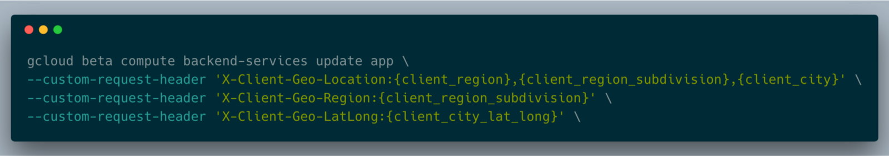
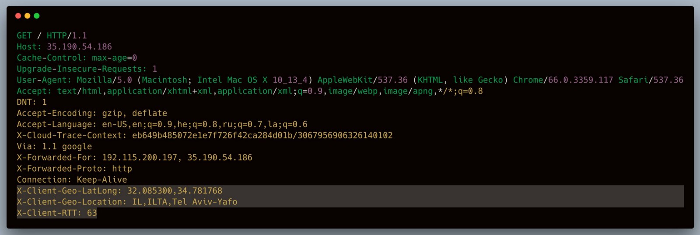

Farewell, MaxMind! Geolocating requests with Google Load Balancer for free!

# Farewell, MaxMind! Geolocating requests with Google Load Balancer for free!

Often, I need to geolocate requests coming to my application, primarily for analytics purposes, i.e. I want to know from where my users are coming from.

Usually, I need just *country, city, latitude *and* longitude *of originating request. For years, I was using [MaxMind](http://maxmind.com/) for this sole reason and while MaxMind is very good, the commercial version costs approximately $1,500 per year and for my basic needs it’s just too much.

Recently, Google has released beta support for “[User-defined request headers](https://cloud.google.com/compute/docs/load-balancing/http/backend-service#user-defined-request-headers)” which allows anyone to geolocate requests coming thru Google Load-Balancer *for free* and I am going to show you how to configure it for your application.

For the sake of simplicity, I will assume you have already have your application running on Google Cloud and you route requests to your application via Google HTTP/S Load Balancer.

First, you will need to update your backend/s to add support for user-defined requests headers. My backend is named “app” and here is the command I’ve used:

Updating your backend to support user-defined headers

Basically, I am instructing Google Load Balancer to add for me three headers to each request — “*X-Client-Geo-Location*”, “*X-Client-Geo-Region*” & “*X-Client-Geo-LatLong*”. You can name your headers as you like as long as it’s NOT “X-User-IP” and it must not begin with “X-Google” or “X-GFE”.

Once the backend is updated, after few minutes you will start seeing new headers being applied to each request:

Google Load Balancer adding user-defined headers to my user’s requests

Congratulations — you now have geolocation information for all of your requests for free and in completely serverless form!

Finally, geolocation is not the only thing you can add to your requests. Google can provide you with client RTT (round-trip transmission) measured in ms as well as TLS version, cipher and hostname!

Want more stories? Check our blog on [Medium](http://blog.doit-intl.com/), or [follow Vadim on Twitter](https://twitter.com/vadimska).