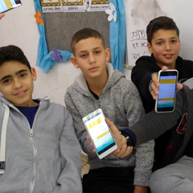

Fast Drawing for Everyone

 [Machine Learning](https://www.blog.google/topics/machine-learning/)   Apr 11, 2017

#  Fast Drawing for Everyone

 Dan Motzenbecker
 Creative Technologist,   Google Creative Lab

Drawing on your phone or computer can be slow and difficult—so we created [AutoDraw](https://www.autodraw.com/), a new web-based tool that pairs machine learning with drawings created by talented artists to help you draw.

 

It works on your phone, computer, or tablet (and it’s free!). So the next time you want to make a birthday card, party invite or just doodle on your phone, it’ll be as easy and fast as everything else on the web.

If you’re interested in learning more about the magic behind AutoDraw, check out [“Quick, Draw!”](https://quickdraw.withgoogle.com/) (one of our A.I. Experiments). AutoDraw’s suggestion tool uses the same technology to guess what you’re trying to draw.

Big thanks to the artists, designers, illustrators and friends of Google who created original drawings for AutoDraw.

**HAWRAF**, Design Studio
**Erin Butner**, Designer
**Julia Melograna**, Illustrator
**Pei Liew**, Designer
**Simone Noronha**, Designer
**Tori Hinn**, Designer
**Selman Design**, Creative Studio

If you are interested in submitting your own drawings, you [can do that here](https://www.autodraw.com/artists). We hope that [AutoDraw](http://www.autodraw.com/), our latest A.I. Experiment, will make drawing more accessible and fun for everyone.**

  Posted in:

- [Machine Learning](https://www.blog.google/topics/machine-learning/)  –

- [Chrome](https://www.blog.google/products/chrome/)

 []()  []()  []()  **

# Up next

 [  3 days ago   ―Machine Learning                         ## Exploring the mysteries of Go with AlphaGo and China's top players    We’re collaborating with the China Go Association and Chinese Government to bring AlphaGo, China’s top Go players, and leading A.I. experts together for the “Future of Go Summit.”](https://www.blog.google/topics/google-asia/exploring-mysteries-go-alphago-and-chinas-top-players/)  [  mar 30   ―Translate                         ## How Google Translate is making learning English fun in Israel    Thousands of Israeli students improve their English with the Google Translate community, and millions get cutting-edge Neural translation for Hebrew and Arabic.](https://www.blog.google/products/translate/how-google-translate-making-learning-english-fun-israel/)  [  mar 10   ―Google Cloud                         ## 100 announcements (!) from Google Cloud Next '17    What a week we’ve had at Google Cloud Next ‘17! Take a look our 100 announcements, including new partnerships and customers, major product releases and updates and more.](https://www.blog.google/topics/google-cloud/100-announcements-google-cloud-next-17/)