Features - iTerm2 - macOS Terminal Replacement

iTerm2 has a lot of features. Every conceivable desire a terminal user might have has been foreseen and solved. And these are just the main attractions!

### Split Panes

Divide a tab up into multiple panes, each one showing a different session. You can slice vertically and horizontally and create any number of panes in any imaginable arrangement.[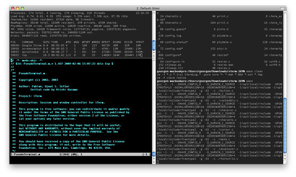](https://iterm2.com/img/screenshots/split_panes_full.png)Notice how inactive panes are slightly dimmed so it's easy to see which is active.

### Hotkey Window

Register a hotkey that brings iTerm2 to the foreground when you're in another application. A terminal is always a keypress away. You can choose to have the hotkey open a dedicated window. This gives you an always-available terminal (like Visor, Guake, or Yakuake) at your fingertips.

### Search

iTerm2 comes with a robust find-on-page feature. The UI stays out of the way. All matches are immediately highlighted. Even regular expression support is offered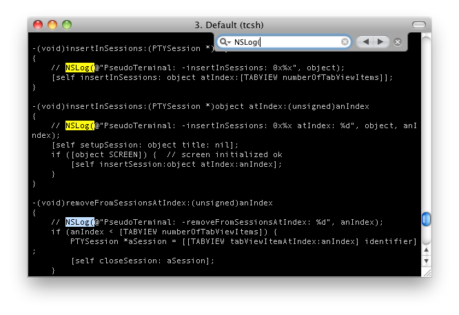](https://iterm2.com/img/screenshots/search.png)

### Autocomplete

Just type the start of any word that has ever appeared in your window and then Cmd-; will pop open a window with suggestions. The word you're looking for is usually on top of the list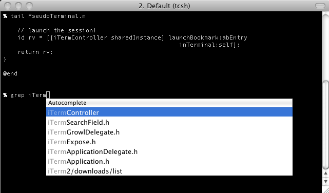](https://iterm2.com/img/screenshots/autocomplete.png)

### Mouseless Copy

Use the Find feature to begin searching for text. Press tab to expand the selection to the right or shift-tab to expand the selection to the left. Option-enter pastes the current match.

### Paste History

Paste history lets you revisit recently copied or pasted text. You can even opt to have the history saved to disk so it will never be lost.[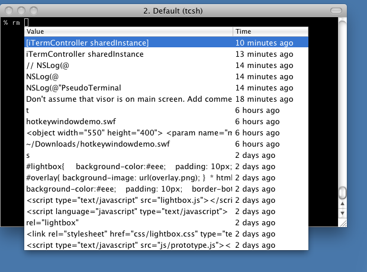](https://iterm2.com/img/screenshots/pastehistory.png)

### Instant Replay

Instant replay lets you travel back in time. It's like TiVo for your terminal](https://iterm2.com/img/screenshots/instantreplay.gif)

### Configurability

Map any key to any function. Assign separate functions to each option key--or even remap all the modifier keys. You can customize iTerm2's appearance to suit your needs: enable transparency, background blur, background images, and much more.

[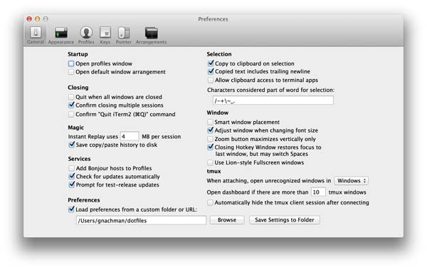](https://iterm2.com/img/screenshots/v2-screen-shots/general.png)[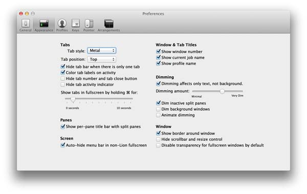](https://iterm2.com/img/screenshots/v2-screen-shots/appearance.png)[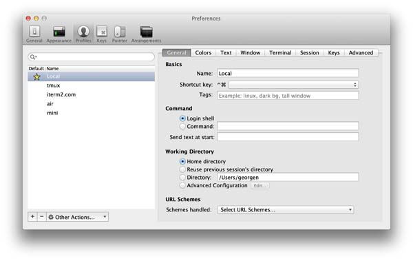](https://iterm2.com/img/screenshots/v2-screen-shots/profiles_general.png)[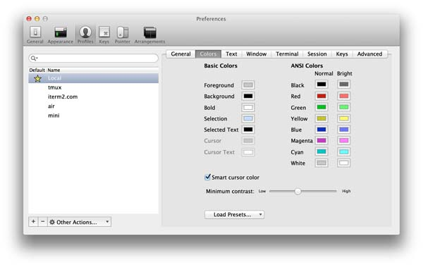](https://iterm2.com/img/screenshots/v2-screen-shots/profiles_colors.png)[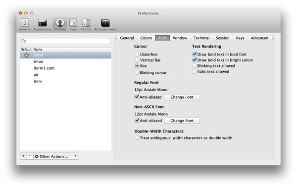](https://iterm2.com/img/screenshots/v2-screen-shots/profiles_text.png)[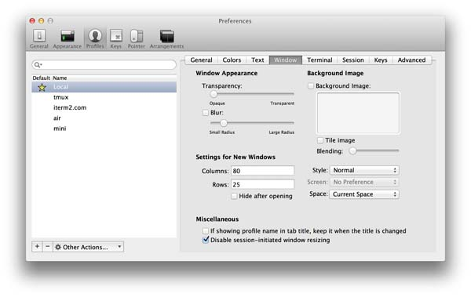](https://iterm2.com/img/screenshots/v2-screen-shots/profiles_window.png)[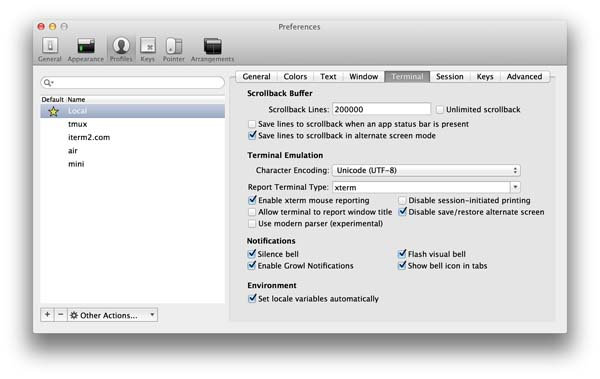](https://iterm2.com/img/screenshots/v2-screen-shots/profiles_terminal.png)[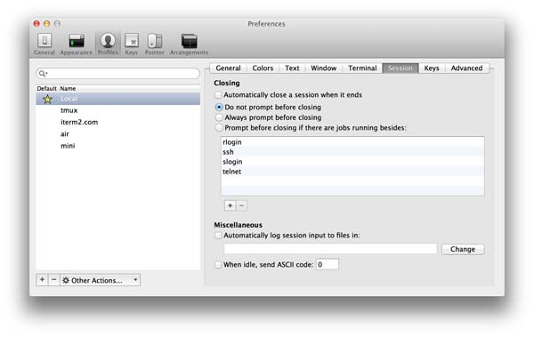](https://iterm2.com/img/screenshots/v2-screen-shots/profiles_session.png)[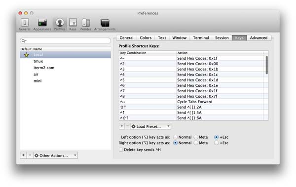](https://iterm2.com/img/screenshots/v2-screen-shots/profiles_keys.png)[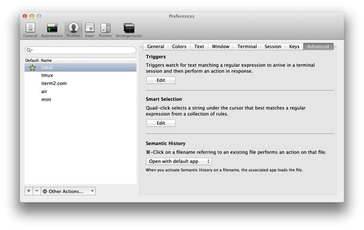](https://iterm2.com/img/screenshots/v2-screen-shots/profiles_advanced.png)[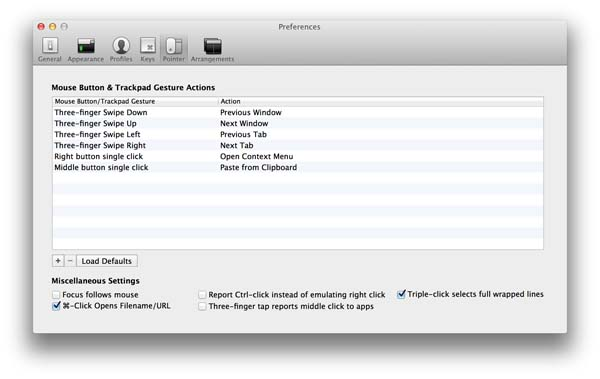](https://iterm2.com/img/screenshots/v2-screen-shots/profiles_pointer.png)[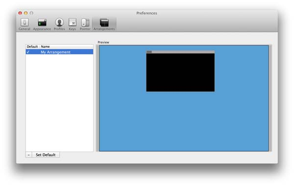](https://iterm2.com/img/screenshots/v2-screen-shots/profiles_arrangements.png)

### Unixyness

Coming from a Unix world? You'll feel at home with focus follows mouse, copy on select, middle button paste, and keyboard shortcuts to avoid mousing.

### 256 Colors (or more!)

With 256-color mode, Vim explodes with photorealism: the terminal is a medley of color and code comes alive. In version 3, 24-bit color is supported.[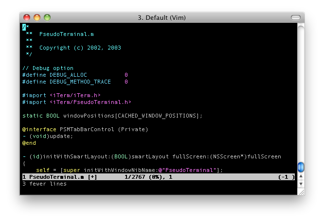](https://iterm2.com/img/screenshots/256colors.png)

### Readability

Do you lose your cursor when there are lots of different colors or have programs display hard-to-read color combinations? With the Smart Cursor Color and Minimum Contrast features, you can ensure that these problems are gone for good.

### Mouse Reporting

You can use the mouse to position the cursor, highlight text, and perform other functions in programs like Vim and Emacs with the mouse reporting feature.

### Growl Support

You can choose to receive Growl notifications of activity, bells, and more. Feel free to let a long job run in the background, secure in the knowledge that you'll know when it's done.[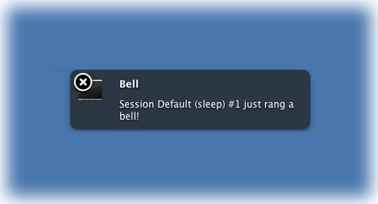](https://iterm2.com/img/screenshots/growl.png)

### Exposé Tab

Like macOS's Exposé feature, iTerm2 shows all your tabs on one screen. Better yet, you can search through them all at once. Go ahead and open as many tabs as you want--you can always find what you're looking for.[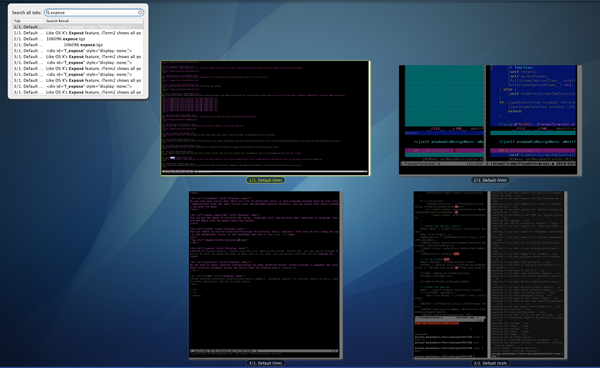](https://iterm2.com/img/screenshots/expose_full.jpg)

### Tagged Profiles

Do you need to store separate configurations for many different hosts? iTerm2 provides a taggable and searchable profiles database so you can easily find the profile you're looking for.[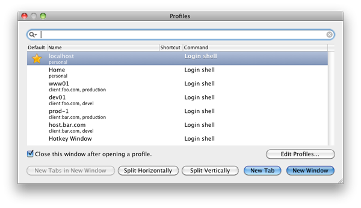](https://iterm2.com/img/screenshots/profiles1_full.png)[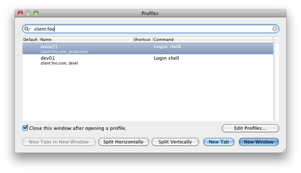](https://iterm2.com/img/screenshots/profiles2_full.png)

### Multi-Lingual

iTerm2 features excellent internationalization support, including support for Unicode combining marks, double-width characters, and all Unicode planes.

### Triggers

iTerm2 supports user-defined triggers, which are actions that run when text matching a regular expression is received. You can use it to highlight words, automatically respond to prompts, notify you when something important happens, and more.[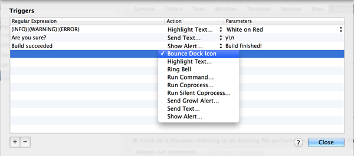](https://iterm2.com/img/screenshots/v2-screen-shots/triggers_full.png)

### Smart Selection

iTerm2 can perform "smart selection" to highlight URLs, email addresses, filenames, and more by recognizing what is under the cursor and choosing how much text to select.

* * *

## New in Version 3

### Shell Integration

iTerm2 can integrate with your shell so it knows where your shell prompt is, what commands you're entering, which host you are on, and what your current directory is. This enables all sorts of cool features: you can easily navigate to previous shell prompts with ⇧⌘↑ and ⇧⌘↓. Your most used directories will be remembered for you. You can auto-complete previously used commands. And much more](https://iterm2.com/img/screenshots/v3-screen-shots/iterm2-shell-integration-navigation-demo.mov)

### Automatic Profile Switching

Using the Shell Integration feature, you can have iTerm2 switch profiles depending on what you're doing. For example, you can define a profile that's always used when you ssh to some hostname. Or when your username is root. Or even when you're in a particular directory.

### Inline Images

iTerm2 has a custom escape sequence to display images right in the terminal. Even animated GIFs!

### Timestamps

You can see the last-modified time of every line in the terminal. It's useful to know how long a job took to complete, if the data you're looking at is fresh, or to try to piece together what you were doing before leaving for the weekend.

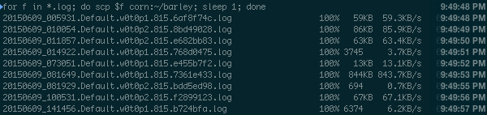

### Password Manager

Do you find yourself typing your password over and over again? Do you need to remember a bunch of passwords? Use iTerm2's built-in password manager. It stores your data securely encrypted in macOS's keychain, protected by your user account's password. iTerm2 includes a safety mechanism that ensures your password only gets entered at a password prompt.

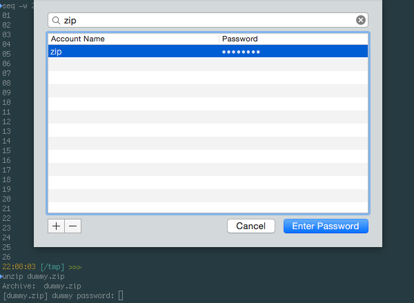

### Advanced Paste

With the Advanced Paste feature you can edit text before pasting it, convert it to base64, transform special characters, and more.

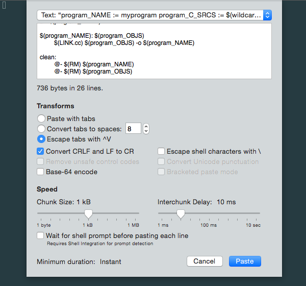

### Annotations

You can select text in your terminal and add an *annotation* to it in iTerm2. If you're puzzling through a big log file, it's useful to mark it up with what you've learned. Working through a disassembly? Make notes about what each register does. Free your mind!

### Badges

You can put a *badge* in the top right of your terminal showing information about the current session. It can show your username, hostname, or even custom data like the current git branch.

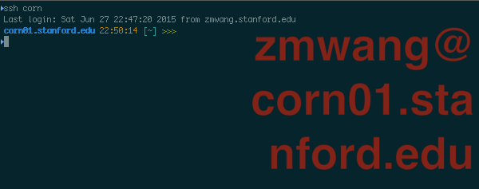

### Captured Output

Use iTerm2 as your IDE. When you build a big project, you used to have to pore over its output to find warnings and errors. No more! With the *captured output* feature, iTerm2 finds those messages (based on regular expressions you define) and shows them in the toolbelt. You can navigate right to each message. A double-click will run a coprocess of your choice, which can (for example) open the file in your favorite editor right to the line with the error.

