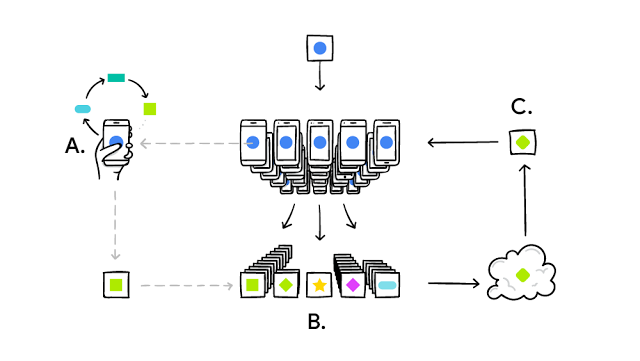
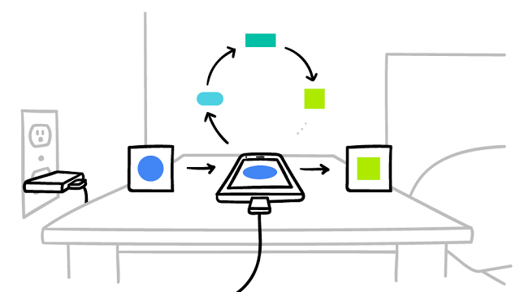

Federated Learning: Collaborative Machine Learning without Centralized Training Data

## [Federated Learning: Collaborative Machine Learning without Centralized Training Data](https://research.googleblog.com/2017/04/federated-learning-collaborative.html)

Thursday, April 06, 2017
 Posted by Brendan McMahan and Daniel Ramage, Research Scientists

Standard machine learning approaches require centralizing the training data on one machine or in a datacenter. And Google has built one of the most secure and robust cloud infrastructures for processing this data to make our services better. Now for models trained from user interaction with mobile devices, we're introducing an additional approach: *Federated Learning*.

Federated Learning enables mobile phones to collaboratively learn a shared prediction model while keeping all the training data on device, decoupling the ability to do machine learning from the need to store the data in the cloud. This goes beyond the use of local models that make predictions on mobile devices (like the [Mobile Vision API](https://developers.google.com/vision/) and [On-Device Smart Reply](https://research.googleblog.com/2017/02/on-device-machine-intelligence.html)) by bringing model *training* to the device as well.

It works like this: your device downloads the current model, improves it by learning from data on your phone, and then summarizes the changes as a small focused update. Only this update to the model is sent to the cloud, using encrypted communication, where it is immediately averaged with other user updates to improve the shared model. All the training data remains on your device, and no individual updates are stored in the cloud.

|     |
| --- |
|  |
| Your phone personalizes the model locally, based on your usage (A). Many users' updates are aggregated (B) to form a consensus change (C) to the shared model, after which the procedure is repeated. |

Federated Learning allows for smarter models, lower latency, and less power consumption, all while ensuring privacy. And this approach has another immediate benefit: in addition to providing an update to the shared model, the improved model on your phone can also be used immediately, powering experiences personalized by the way you use your phone.

We're currently testing Federated Learning in [Gboard on Android](https://blog.google/products/search/gboard-now-on-android/), the Google Keyboard. When Gboard shows a suggested query, your phone locally stores information about the current context and whether you clicked the suggestion. Federated Learning processes that history on-device to suggest improvements to the next iteration of Gboard’s query suggestion model.

To make Federated Learning possible, we had to overcome many algorithmic and technical challenges. In a typical machine learning system, an optimization algorithm like [Stochastic Gradient Descent](https://en.wikipedia.org/wiki/Stochastic_gradient_descent) (SGD) runs on a large dataset partitioned homogeneously across servers in the cloud. Such highly iterative algorithms require low-latency, high-throughput connections to the training data. But in the Federated Learning setting, the data is distributed across millions of devices in a highly uneven fashion. In addition, these devices have significantly higher-latency, lower-throughput connections and are only intermittently available for training.

These bandwidth and latency limitations motivate our [Federated Averaging algorithm](https://arxiv.org/abs/1602.05629), which can train deep networks using 10-100x less communication compared to a naively federated version of SGD. The key idea is to use the powerful processors in modern mobile devices to compute higher quality updates than simple gradient steps. Since it takes fewer iterations of high-quality updates to produce a good model, training can use much less communication. As upload speeds are typically [much slower](http://www.speedtest.net/reports/united-states/) than download speeds, we also developed a novel way to reduce upload communication costs up to another 100x by [compressing updates](https://arxiv.org/abs/1610.05492) using random rotations and quantization. While these approaches are focused on training deep networks, we've also [designed algorithms](https://arxiv.org/abs/1610.02527) for high-dimensional sparse convex models which excel on problems like click-through-rate prediction.

Deploying this technology to millions of heterogenous phones running Gboard requires a sophisticated technology stack. On device training uses a miniature version of [TensorFlow](https://www.tensorflow.org/). Careful scheduling ensures training happens only when the device is idle, plugged in, and on a free wireless connection, so there is no impact on the phone's performance.

|     |
| --- |
|  |
| Your phone participates in Federated Learning only when it won't negatively impact your experience. |

The system then needs to communicate and aggregate the model updates in a secure, efficient, scalable, and fault-tolerant way. It's only the combination of research with this infrastructure that makes the benefits of Federated Learning possible.

Federated learning works without the need to store user data in the cloud, but we're not stopping there. We've developed a [Secure Aggregation protocol](http://eprint.iacr.org/2017/281) that uses cryptographic techniques so a coordinating server can only decrypt the average update if 100s or 1000s of users have participated — no individual phone's update can be inspected before averaging. It's the first protocol of its kind that is practical for deep-network-sized problems and real-world connectivity constraints. We designed Federated Averaging so the coordinating server only needs the average update, which allows Secure Aggregation to be used; however the protocol is general and can be applied to other problems as well. We're working hard on a production implementation of this protocol and expect to deploy it for Federated Learning applications in the near future.

Our work has only scratched the surface of what is possible. Federated Learning can't solve all machine learning problems (for example, learning to [recognize different dog breeds](https://research.googleblog.com/2016/08/improving-inception-and-image.html) by training on carefully labeled examples), and for many other models the necessary training data is already stored in the cloud (like training spam filters for Gmail). So Google will continue to advance the state-of-the-art for cloud-based ML, but we are also committed to ongoing research to expand the range of problems we can solve with Federated Learning. Beyond Gboard query suggestions, for example, we hope to improve the language models that power your keyboard based on what you actually type on your phone (which can have a style all its own) and photo rankings based on what kinds of photos people look at, share, or delete.

Applying Federated Learning requires machine learning practitioners to adopt new tools and a new way of thinking: model development, training, and evaluation with no direct access to or labeling of raw data, with communication cost as a limiting factor. We believe the user benefits of Federated Learning make tackling the technical challenges worthwhile, and are publishing our work with hopes of a widespread conversation within the machine learning community.

**Acknowledgements**

This post reflects the work of many people in Google Research, including Blaise Agüera y Arcas, Galen Andrew, Dave Bacon, Keith Bonawitz, Chris Brumme, Arlie Davis, Jac de Haan, Hubert Eichner, Wolfgang Grieskamp, Wei Huang, Vladimir Ivanov, Chloé Kiddon, Jakub Konečný, Nicholas Kong, Ben Kreuter, Alison Lentz, Stefano Mazzocchi, Sarvar Patel, Martin Pelikan, Aaron Segal, Karn Seth, Ananda Theertha Suresh, Iulia Turc, Felix Yu, and our partners in the Gboard team.

53 comments

Add a comment as Marc Cohen

Top comments

## Stream

### [Research at Google](https://apis.google.com/u/0/wm/1/117790530324740296539) via Google+

[17 hours ago](https://apis.google.com/u/0/wm/1/+ResearchatGoogle/posts/hRyhx6nTDGG)  -  Shared publicly

Standard machine learning approaches require centralizing the training data on one machine or in a datacenter. And Google has built one of the most secure and robust cloud infrastructures for processing this data to make our services better. Now for models trained from user interaction with mobile devices, we're introducing an additional approach: *Federated Learning*.

+
9
0
1
0

 ·
Reply

### [Vincent Vanhoucke](https://apis.google.com/u/0/wm/1/111578115386716207492) via Google+

[17 hours ago (edited)](https://apis.google.com/u/0/wm/1/+VincentVanhoucke/posts/Y9LkV9fgiec)  -  Shared publicly

**Federated Learning** is one of the things I'm really excited about these days. It has the potential to profoundly change how we do machine learning and how we approach privacy. It makes it possible to securely learn models, both shared across users and personalized for you, while the data remains on your phone, and with very strong mathematical guarantees which prevent model updates to communicate any private information. The mathematical and engineering sophistication required to make this happen in a practical manner should delight any ML and/or crypto enthusiast. If you're intrigued, read on:

+
3
6
7
6

 ·
Reply

[Michael Tetelman](https://plus.google.com/+MichaelTetelman)

[17 hours ago](https://apis.google.com/u/0/wm/1/+VincentVanhoucke/posts/Y9LkV9fgiec)

+
1
2
1

This set a precedent for violating personal privacy in a very sophisticated way.

### [Erik Jonker](https://apis.google.com/u/0/wm/1/104854938798902396029) via Google+

[3 hours ago](https://apis.google.com/u/0/wm/1/+ErikJonker/posts/Q9NnsxfC2th)  -  Shared publicly

**Federated learning**

*It works like this: your device downloads the current model, improves it by learning from data on your phone, and then summarizes the changes as a small focused update. Only this update to the model is sent to the cloud, using encrypted communication, where it is immediately averaged with other user updates to improve the shared model. All the training data remains on your device, and no individual updates are stored in the cloud.*

This is a great model for protecting privacy but still train a central model!
+
2
0
1
0

 ·
Reply

[Sanjay Sutradhar](https://plus.google.com/+SanjaySutradhar2021)

[3 hours ago](https://apis.google.com/u/0/wm/1/+ErikJonker/posts/Q9NnsxfC2th)

+
0
1
0

Ilike that..

### [Stephen Hurrell](https://apis.google.com/u/0/wm/1/105156778913597757419) via Google+

[1 hour ago](https://apis.google.com/u/0/wm/1/+StephenHurrell-StephenHurrell/posts/U8m3oK95N7P)  -  Shared publicly

Google's GBoard replacement keyboard uses this new distributed system. See https://goo.gl/e1TDNS

[#GBoard](https://apis.google.com/s/%23GBoard)  [#FederatedLearning](https://apis.google.com/s/%23FederatedLearning)

+
0
1
0

 ·
Reply

### [Jarek Wilkiewicz](https://apis.google.com/u/0/wm/1/115372405214595182619) via Google+

[13 hours ago](https://apis.google.com/u/0/wm/1/+JarekWilkiewicz/posts/fTSQ3VYRcA4)  -  Shared publicly

New from +[Research at Google](https://apis.google.com/117790530324740296539) : *"[...] Federated Learning enables mobile phones to collaboratively learn a shared prediction model while keeping all the training data on device, decoupling the ability to do machine learning from the need to store the data in the cloud. [...]"*

https://research.googleblog.com/2017/04/federated-learning-collaborative.html
+
2
3
2

 ·
Reply

### [Mike Washington](https://apis.google.com/u/0/wm/1/104593871322145158180) shared this

[1 hour ago](https://apis.google.com/u/0/wm/1/104593871322145158180/posts/MxuMEtfNqG1)  -  [Data Science, AI & Machine Learning (Discussion)](https://apis.google.com/u/0/wm/1/communities/107156514183161811383/stream/099b0b56-c249-458c-aea8-29a5b414c19d)

+
0
1
0

### [Zik Zak](https://apis.google.com/u/0/wm/1/103799416683677285846) via Google+

[59 minutes ago](https://apis.google.com/u/0/wm/1/+ZikZakFR/posts/8kEGaPFreTU)  -  Shared publicly

Is that a spy in your pocket?
+
0
1
0

 ·
Reply

### [Kam-Yung Soh](https://apis.google.com/u/0/wm/1/115958295900210268653) via Google+

[12 hours ago](https://apis.google.com/u/0/wm/1/+KamYungSoh/posts/fmQdThbq5vR)  -  Shared publicly

**Interesting. This might help to address privacy issues related to the data set. Via Hacker News [ ****https://news.ycombinator.com/item?id=14055655**** ].** "Federated Learning enables mobile phones to collaboratively learn a shared prediction model while keeping all the training data on device, decoupling the ability to do machine learning from the need to store the data in the cloud. This goes beyond the use of local models that make predictions on mobile devices (like the Mobile Vision API and On-Device Smart Reply) by bringing model training to the device as well.

It works like this: your device downloads the current model, improves it by learning from data on your phone, and then summarizes the changes as a small focused update. Only this update to the model is sent to the cloud, using encrypted communication, where it is immediately averaged with other user updates to improve the shared model. All the training data remains on your device, and no individual updates are stored in the cloud.

Federated Learning allows for smarter models, lower latency, and less power consumption, all while ensuring privacy. And this approach has another immediate benefit: in addition to providing an update to the shared model, the improved model on your phone can also be used immediately, powering experiences personalized by the way you use your phone.

We're currently testing Federated Learning in Gboard on Android, the Google Keyboard. When Gboard shows a suggested query, your phone locally stores information about the current context and whether you clicked the suggestion. Federated Learning processes that history on-device to suggest improvements to the next iteration of Gboard’s query suggestion model.

[...]

Our work has only scratched the surface of what is possible. Federated Learning can't solve all machine learning problems (for example, learning to recognize different dog breeds by training on carefully labeled examples), and for many other models the necessary training data is already stored in the cloud (like training spam filters for Gmail). So Google will continue to advance the state-of-the-art for cloud-based ML, but we are also committed to ongoing research to expand the range of problems we can solve with Federated Learning. Beyond Gboard query suggestions, for example, we hope to improve the language models that power your keyboard based on what you actually type on your phone (which can have a style all its own) and photo rankings based on what kinds of photos people look at, share, or delete."

+[Kwanghui Lim](https://apis.google.com/109276151908925186078)  +[Michael Tan](https://apis.google.com/105625238935822882862)  +[Alfred Siew](https://apis.google.com/100075857159882643076)

+
3
4
3

 ·
Reply

### [Roberto Bayardo](https://apis.google.com/u/0/wm/1/118249005460047214792) via Google+

[14 hours ago (edited)](https://apis.google.com/u/0/wm/1/+RobertoBayardo/posts/8Mg3F7zhfUp)  -  Shared publicly

Privacy-preserving machine learning becomes practical.

[Research at Google](https://apis.google.com/u/0/wm/1/117790530324740296539) originally shared [this](https://apis.google.com/u/0/wm/1/+ResearchatGoogle/posts/hRyhx6nTDGG)

Standard machine learning approaches require centralizing the training data on one machine or in a datacenter. And Google has built one of the most secure and robust cloud infrastructures for processing this data to make our services better. Now for models trained from user interaction with mobile devices, we're introducing an additional approach: *Federated Learning*.

+
1
2
1

 ·
Reply

### [Richard Grayson](https://apis.google.com/u/0/wm/1/114551842999275113138) via Google+

[12 minutes ago](https://apis.google.com/u/0/wm/1/+RichardGrayson/posts/9sQh6oca2ZJ)  -  Shared publicly

[Erik Jonker](https://apis.google.com/u/0/wm/1/104854938798902396029) originally shared [this](https://apis.google.com/u/0/wm/1/+ErikJonker/posts/Q9NnsxfC2th)

**Federated learning**

*It works like this: your device downloads the current model, improves it by learning from data on your phone, and then summarizes the changes as a small focused update. Only this update to the model is sent to the cloud, using encrypted communication, where it is immediately averaged with other user updates to improve the shared model. All the training data remains on your device, and no individual updates are stored in the cloud.*

This is a great model for protecting privacy but still train a central model!
+
0
1
0

 ·
Reply

### [Ersin Esen](https://apis.google.com/u/0/wm/1/113620843208208725814) shared this via Google+

[9 hours ago](https://apis.google.com/u/0/wm/1/+ErsinEsen/posts/FeNMiLzbdyH)  -  Shared publicly

+
2
3
2

 ·
Reply

### [Jean-Marc Autexier](https://apis.google.com/u/0/wm/1/104085788420838489498) shared this via Google+

[7 hours ago](https://apis.google.com/u/0/wm/1/+JeanMarcAutexier/posts/Th74XeV1Eq5)  -  Shared publicly

+
0
1
0

 ·
Reply

### [T Tak](https://apis.google.com/u/0/wm/1/117828397008841764828) via Google+

[8 hours ago](https://apis.google.com/u/0/wm/1/117828397008841764828/posts/Egb96pnxL7x)  -  Shared publicly

https://research.googleblog.com/2017/04/federated-learning-collaborative.html
+
0
1
0

 ·
Reply

### [Yik Sheng Lee](https://apis.google.com/u/0/wm/1/101571290960297943734) shared this via Google+

[15 hours ago](https://apis.google.com/u/0/wm/1/+YikShengLeeIsrael/posts/9b2K9ZSPy4q)  -  Shared publicly

+
2
3
2

 ·
Reply

[李善德（Shande Li）](https://plus.google.com/+%E5%96%84%E5%BE%B7%E6%9D%8E%E6%83%9C%E7%BC%98)

[15 hours ago](https://apis.google.com/u/0/wm/1/+YikShengLeeIsrael/posts/9b2K9ZSPy4q)

+
0
1
0

Japanese Council Member: It’s Everyone's Responsibility to Stop the Communist Regime's State-Sanctioned Live Organ Harvesting

December 25, 2016 | By a Falun Gong practitioner in Japan

(Minghui.org) Two documentary films on the Chinese Communist Party's (CCP) persecution of Falun Gong were screened in Sumida District Council Member Oase Kensuke’s office in Tokyo, on December 19-20, 2016. The first film was the documentary Human Harvest, a Peabody Award winner, which exposed the Chinese Communist Party's state-sanctioned live organ harvesting from Falun Gong practitioners. The second film was Free China: The Courage to Believe, which exposes the CCP's persecution of Falun Gong.

Viewers were appalled at the CCP's atrocities. Sumida District Council Member Oase Kensuke from Tokyo said that the CCP's live organ harvesting described in the film was true and that the numbers were shocking.

Sumida District Council Member Oase Kensuke of Tokyo

Council Member Oase Kensuke said, “The whole country is involved in the large scale of live organ harvesting. It cannot be tolerated by any country's law. But it has existed in China for many years. The main reason is that the CCP places itself above the Constitution.”

He continued, “To stop the crime of live organ harvesting, the CCP must be disintegrated.” He expressed hope that more people would stand up to support Falun Gong practitioners' efforts in opposing the persecution. He emphasized that stopping the CCP's atrocity of live organ harvesting is everyone's responsibility.

The documentary film Free China: The Courage to Believe won the award of free speech at the Inaugural 2012 Free Speech Film Festival, and won the top award at the 2012 Awareness Film Festival in West Hollywood on May 5, 2012. The film is based on the personal experiences of Dr. Charles Lee, originally from China and living in the US as an American citizen, and Jennifer Zeng, living in China and a former Communist Party member. Both began practicing Falun Gong in 1990s.

When the communist regime started persecuting Falun Gong in 1999 and put practitioners into labor camps, Zeng and Lee were imprisoned and tortured. The film reflects the current plight of China and suggests how China can achieve true freedom.

The documentary film Human Harvest describes the story of Nobel Peace Award nominee David Kilgour and David Matas, in their independent investigation of China's live organ harvesting and illicit trade. The film exposes the CCP's systematic live organ harvesting. The film won the 2015 Peabody award and the best international investigative documentary award from the Association for International Broadcasting in 2015.

Mr. Bei, who is working on an assessment of organ transplant tourism, said, “There is no intact donor system in China. Completing at least 60,000 organ transplants is unusual. Many organ transplant hospitals were established in China in recent years, and general hospitals also do organ transplants.”

One man said after watching the film, “This is my first time learning about the CCP's atrocity of live organ harvesting for illicit profit. It is inconceivable. The living part is shocking. It is beyond basic human ethics. Any normal person cannot remain silent about this.”

Many audience members bought related books after the screening, including Bloody Harvest: Organ Harvesting of Falun Gong Practitioners in China, State Organs: Transplant Abuse in China, and An Unprecedented Evil Persecution: A Genocide Against Goodness in Humankind.

Chinese version available

CATEGORY: Organ Harvesting

### [Lauren Weinstein](https://apis.google.com/u/0/wm/1/114753028665775786510) via Google+

[17 hours ago](https://apis.google.com/u/0/wm/1/+LaurenWeinstein/posts/CqJKExPzefV)  -  Shared publicly

[Research at Google](https://apis.google.com/u/0/wm/1/117790530324740296539) originally shared [this](https://apis.google.com/u/0/wm/1/+ResearchatGoogle/posts/hRyhx6nTDGG)

Standard machine learning approaches require centralizing the training data on one machine or in a datacenter. And Google has built one of the most secure and robust cloud infrastructures for processing this data to make our services better. Now for models trained from user interaction with mobile devices, we're introducing an additional approach: *Federated Learning*.

+
5
6
5

 ·
Reply

### [Chris Kim A](https://apis.google.com/u/0/wm/1/111737932039524866299) via Google+

[15 hours ago](https://apis.google.com/u/0/wm/1/+ChrisKimA/posts/765iTjDfD2k)  -  Shared publicly

[Research at Google](https://apis.google.com/u/0/wm/1/117790530324740296539) originally shared [this](https://apis.google.com/u/0/wm/1/+ResearchatGoogle/posts/hRyhx6nTDGG)

Standard machine learning approaches require centralizing the training data on one machine or in a datacenter. And Google has built one of the most secure and robust cloud infrastructures for processing this data to make our services better. Now for models trained from user interaction with mobile devices, we're introducing an additional approach: *Federated Learning*.

+
5
6
5

 ·
Reply

### [Timothy Lau](https://apis.google.com/u/0/wm/1/108944766550735989799) via Google+

[9 hours ago](https://apis.google.com/u/0/wm/1/+TimothyLau1/posts/bikmwqSHAvH)  -  Shared publicly

[Vincent Vanhoucke](https://apis.google.com/u/0/wm/1/111578115386716207492) originally shared [this](https://apis.google.com/u/0/wm/1/+VincentVanhoucke/posts/Y9LkV9fgiec)

**Federated Learning** is one of the things I'm really excited about these days. It has the potential to profoundly change how we do machine learning and how we approach privacy. It makes it possible to securely learn models, both shared across users and personalized for you, while the data remains on your phone, and with very strong mathematical guarantees which prevent model updates to communicate any private information. The mathematical and engineering sophistication required to make this happen in a practical manner should delight any ML and/or crypto enthusiast. If you're intrigued, read on:

+
0
1
0

 ·
Reply

### [Claes-Fredrik Mannby](https://apis.google.com/u/0/wm/1/105466361265305052461) via Google+

[1 hour ago](https://apis.google.com/u/0/wm/1/+ClaesFredrikMannby/posts/4MJXjphCc4G)  -  Shared publicly

[Research at Google](https://apis.google.com/u/0/wm/1/117790530324740296539) originally shared [this](https://apis.google.com/u/0/wm/1/+ResearchatGoogle/posts/hRyhx6nTDGG)

Standard machine learning approaches require centralizing the training data on one machine or in a datacenter. And Google has built one of the most secure and robust cloud infrastructures for processing this data to make our services better. Now for models trained from user interaction with mobile devices, we're introducing an additional approach: *Federated Learning*.

+
0
1
0

 ·
Reply

### [Graphcore](https://apis.google.com/u/0/wm/1/102028474897874874930)

[3 hours ago](https://apis.google.com/u/0/wm/1/102028474897874874930/posts/VPWScSD5tEH)  -  Shared publicly

Federated Learning from Google: collaborative machine learning without centralized training data http://hubs.ly/H06_PMM0

+
0
1
0

 ·
Reply

### [Jomar Tigcal](https://apis.google.com/u/0/wm/1/103806910001842987145) via Google+

[6 hours ago](https://apis.google.com/u/0/wm/1/+JomarTigcal/posts/GihCZrmCmWc)  -  Shared publicly

[Research at Google](https://apis.google.com/u/0/wm/1/117790530324740296539) originally shared [this](https://apis.google.com/u/0/wm/1/+ResearchatGoogle/posts/hRyhx6nTDGG)

Standard machine learning approaches require centralizing the training data on one machine or in a datacenter. And Google has built one of the most secure and robust cloud infrastructures for processing this data to make our services better. Now for models trained from user interaction with mobile devices, we're introducing an additional approach: *Federated Learning*.

+
0
1
0

 ·
Reply

Show more

Labels:[Collaboration](https://research.googleblog.com/search/label/Collaboration) , [Machine Learning](https://research.googleblog.com/search/label/Machine%20Learning) , [On-device Learning](https://research.googleblog.com/search/label/On-device%20Learning) , [optimization](https://research.googleblog.com/search/label/optimization)