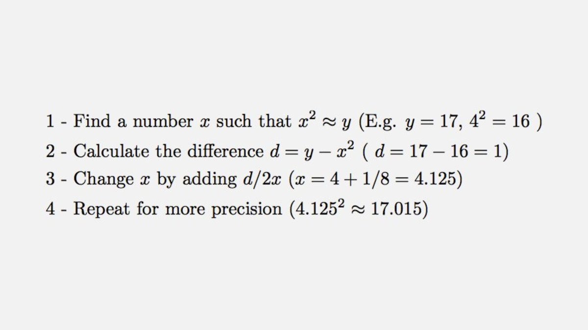
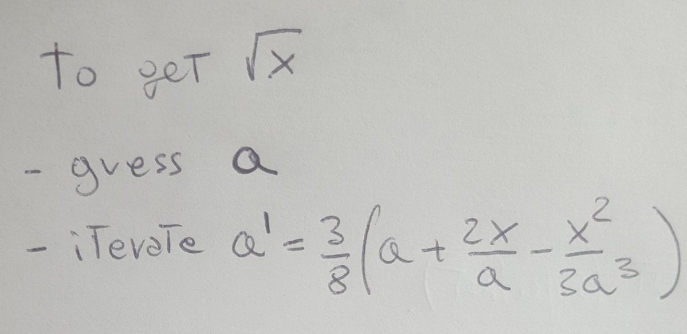
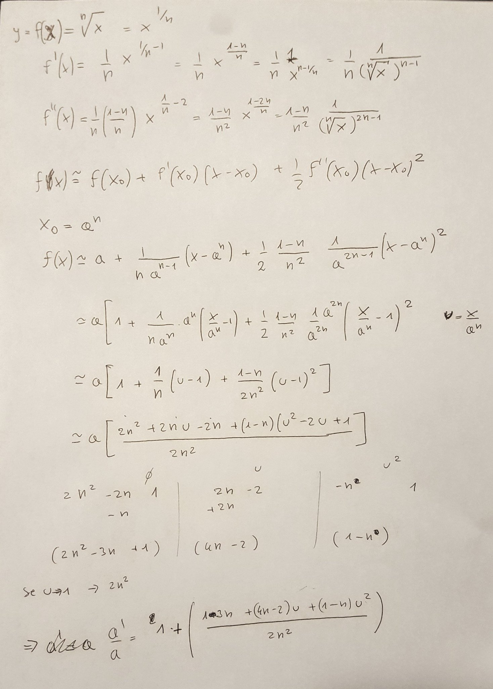
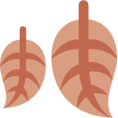

Fermat's Library on Twitter: "Here's a quick method to calculate the square root of a number (√y) by hand https://t.co/IsRSc3UYef" / Twitter

# Conversation

[ Fermat's Library   @fermatslibrary](https://twitter.com/fermatslibrary)

Here's a quick method to calculate the square root of a number (√y) by hand

1:20 PM · Sep 26, 2019·[Buffer](https://help.twitter.com/using-twitter/how-to-tweet#source-labels)

[1.2K  Retweets](https://twitter.com/fermatslibrary/status/1177196132663009280/retweets)

[4.6K  Likes](https://twitter.com/fermatslibrary/status/1177196132663009280/likes)

This Tweet is unavailable

1 more reply

[ swiffy   @swiffydk](https://twitter.com/swiffydk)
·
[19h](https://twitter.com/swiffydk/status/1177197495098777600)

Replying to
[@fermatslibrary](https://twitter.com/fermatslibrary)

Works because (√y)' = 1/2√y = 1/2x. It's Newton's method of iteratively chasing tangent lines

6

86

[ Ted Gallegos   @TedGallegos1](https://twitter.com/TedGallegos1)
·
[14h](https://twitter.com/TedGallegos1/status/1177268547883393024)

Replying to
[@fermatslibrary](https://twitter.com/fermatslibrary)

Faster to look at the iPod in my hand! Does anyone calculate square root anymore? But I hand it to you Fermat, that's a handy way!

[ Carlo Pettinelli         @PettinelliCarlo](https://twitter.com/PettinelliCarlo)

·
[18h](https://twitter.com/PettinelliCarlo/status/1177209901271138304)

Replying to
[@fermatslibrary](https://twitter.com/fermatslibrary)

That's a first order NR. If you use second order you get this formula which converges extremely fast ( using sqrt 17 and 4 as initial guess, the first iteration returns 4 digits correct, second iteration 14 digits ok)

1

2

9

[ Carlo Pettinelli         @PettinelliCarlo](https://twitter.com/PettinelliCarlo)

·
[14h](https://twitter.com/PettinelliCarlo/status/1177272485747798016)

For the ones interested to know where the hell that strange formula comes out of...thats the general iterative formula for the nth root of x

4

[ jorge   @elu_suario](https://twitter.com/elu_suario)
·
[18h](https://twitter.com/elu_suario/status/1177198084742250499)

Replying to
[@fermatslibrary](https://twitter.com/fermatslibrary)
isn't this just a fancy newton rapson?

1

24

[ Evpok         @EvpokPadding](https://twitter.com/EvpokPadding)

·
[17h](https://twitter.com/EvpokPadding/status/1177217665083027456)

Since this was known by the Babylonians and first published by Ήρων of Alexandria, it would be more accurate to say Newton-Rhapson is a fancy generalisation of this

9

[ Mike Fox   @MikeyFox](https://twitter.com/MikeyFox)
·
[18h](https://twitter.com/MikeyFox/status/1177201833544171520)

Replying to
[@fermatslibrary](https://twitter.com/fermatslibrary)
The folks who built our kitchen extension probably used this

1

14

[ daniel read   @danielmabuse](https://twitter.com/danielmabuse)
·
[19h](https://twitter.com/danielmabuse/status/1177197445421391872)

Replying to
[@fermatslibrary](https://twitter.com/fermatslibrary)

This is not quite right. x^2 has to be less than y, otherwise you subtract the value d/2x.

5

5

[ Paul   @bigunclepaul](https://twitter.com/bigunclepaul)
·
[18h](https://twitter.com/bigunclepaul/status/1177199285257068544)

If x is an overestimate, won't d be negative anyway?

1

25

