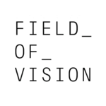

Field of Vision - A Night at the Garden

# Field of Vision - Gavin Grimm vs. (Our 100 Days)

1 year ago

[Field of Vision](https://vimeo.com/fieldofvision)[PRO](https://vimeo.com/pro)

6,184

[25](https://vimeo.com/235019227/likes)

[1](https://vimeo.com/235019227/collections)

[1](https://vimeo.com/235019227#comments)

In 2016, transgender teen Gavin Grimm sued his local school board after its members refused to let him use the bathroom of his choice. He was ready to take his case all the way to the Supreme Court—and then the election happened.

Directed by Nadia Hallgren
2018 Webby Award Winner
______

Our 100 Days is a partnership between Firelight Media and Field of Vision that aims to tell stories from the perspective of vulnerable communities and explore threats to U.S. democracy in this current, polarized political climate.

See more from Field of Vision here: fieldofvision.org
[Read more…]()

### 1 Comment

[Jeffrey Bowers](https://vimeo.com/jeffreybowers)[Staff](https://vimeo.com/about)1 year ago

Gavin is so brave. What a frustrating fight he has. I'm wishing him all the best and good luck.

Add a new comment