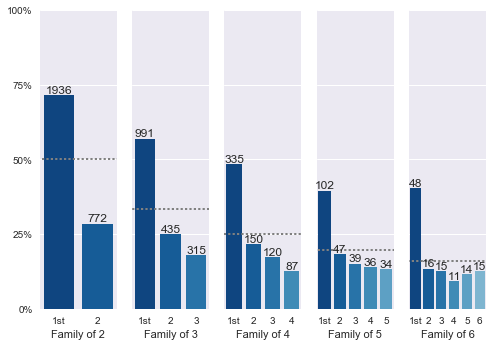
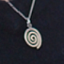

Fight Me, Psychologists: Birth Order Effects Exist And Are Very Strong

[Home](http://slatestarcodex.com/)

- [About / Top Posts](http://slatestarcodex.com/about/)
- [Archives](http://slatestarcodex.com/archives/)
- [Meetups](http://slatestarcodex.com/meetups/)
- [Mistakes](http://slatestarcodex.com/mistakes/)
- [Comments](http://slatestarcodex.com/comments/)
- [Predictions & Bets](http://slatestarcodex.com/predictions-bets/)
- [Advertise](http://slatestarcodex.com/advertise/)
- [Open Thread](http://slatestarcodex.com/tag/open/?latest)

[Comments Feed](http://slatestarcodex.com/comments/feed/)[RSS Feed](http://slatestarcodex.com/feed/)

[Slate Star Codex](http://slatestarcodex.com/)

"Talks a good game about freedom when out of power, but once he’s in – bam! Everyone's enslaved in the human-flourishing mines."

# Fight Me, Psychologists: Birth Order Effects Exist And Are Very Strong

Posted on  [January 8, 2018](http://slatestarcodex.com/2018/01/08/fight-me-psychologists-birth-order-effects-exist-and-are-very-strong/)  by  [Scott Alexander](http://slatestarcodex.com/author/admin/)

“Birth order” refers to whether a child is the oldest, second-oldest, youngest, etc. in their family. For a while, pop psychologists created a whole industry around telling people how their birth order affected their personality: oldest children are more conservative, youngest children are more creative, etc.

Then people got around to actually studying it and couldn’t find any of that. Wikipedia’s [birth order article](https://en.wikipedia.org/wiki/Birth_order) says:

**

> Claims that birth order affects human psychology are prevalent in family literature, but studies find such effects to be vanishingly small….the largest multi-study research suggests zero or near-zero effects. Birth-order theory has the characteristics of a zombie theory, as despite disconfirmation, it continues to have a strong presence in pop psychology and popular culture.

**

I ought to be totally in favor of getting this debunked. After all, the replication crisis in psychology highlights the need to remain skeptical of poorly-supported theories. And some of the seminal work disproving birth order was done by Judith Rich Harris, an intellectual hero of mine who profoundly shaped my worldview with her book [*The Nurture Assumption*.](https://www.amazon.com/Nurture-Assumption-Children-Revised-Updated/dp/1439101655/ref=as_li_ss_tl?ie=UTF8&qid=1515281048&sr=8-1&keywords=the+nurture+assumption&linkCode=ll1&tag=slatestarcode-20&linkId=e63508f6a599a300838e2216b8e880ee)

So I regret to have to inform you that birth order effects are totally a real thing.

I first started thinking this at transhumanist meetups, when it would occasionally come up that everyone there was an oldest child. The pattern was noticeable enough that I included questions about birth order on the latest SSC survey. This blog deals with a lot of issues around transhumanism, futurology, rationality, et cetera, so I thought it would attract the same kind of people.

7,248 people gave me enough information to calculate their birth order, but I am *very paranoid* because previous studies have failed by failing to account for family size. That is, people of certain economic classes/religions/races/whatever tend to have larger family sizes, and if you’re in a large family, you’re more likely to be a later-born child. In order to be absolutely sure I wasn’t making this mistake, I concentrated on within-family-size analyses. For example, there were 2965 respondents with exactly one sibling…

…and a full 2118 of those were the older of the two. That’s 71.4%. p ≤ 0.00000001.

The same effect occurs in sibships of other sizes. Of the 1884 respondents from families with three children (n = 1884), 56.8% are the oldest, compared to predicted 33%. In families with four children (n = 765), 48.2% are the oldest, compared to predicted 25%.

*Number of responses by birth order in sibships of different sizes; graph is by Emile and uses the public data only, which means exact numbers may be slightly different*

This effect reaches the same scale as other effects people consider important. For example, the survey population drew heavily from STEM fields and was predictably very white; however, the birth order gap was larger in magnitude than the racial gap. It is bigger than gender gaps in some fields traditionally considered to have major gender gaps, like undergraduate economics. This can fairly be considered a large effect.

So what is going on here?

It’s unlikely that age alone is driving these results. In sibships of two, older siblings on average were only about one year older than younger siblings. That can’t explain why one group reads this blog so much more often than the other.

And all of the traditional pop psychology claims about birth order don’t seem to hold up. I didn’t find any effect on anything that could be reasonably considered conservativism or rebelliousness.

But there is at least one reputable study that did find a few personality differences. This is [Rohrer et al (2015)](http://www.pnas.org/content/112/46/14224.full), which examined a battery of personality traits and found birth order effects only IQ and Openness to Experience, both very small.

I was only partly able to replicate this work. Rohrer et al found that eldest siblings had an advantage of about 1.5 IQ points. My study found the same: 1.3 to 1.7 IQ points depending on family size – but this did not reach significance. My other measure of intelligence was SAT, but SATs have been renormed and changed so many times over the past few decades that making apples-to-apples comparisons were really tough. I was able to get only a couple of weak and inconsistent effects: in sibships of two, eldest children had a slightly higher SAT1600 (1481 vs. 1458, p = 0.002) but not SAT2400; in sibships of 3+, eldest children had a slightly higher SAT2400 (2214 vs. 2248, p = 0.03), but not SAT1600. Overall this seems way too weak to say anything with certainty. Average SATs and IQs were already around the 99th percentile, so there may have been too much of a selection effect / ceiling effect to get good results.

The Openness results were clearer. Eldest children had significantly higher Openness (73rd %ile vs. 69th %ile, p = 0.001). Like Rohrer, I found no difference in any of the other Big Five traits.

Because I only had one blunt measure of Openness, I couldn’t do as detailed an analysis as Rohrer’s team. But they went on to subdivide Openness into two subcomponents, Intellect and Imagination, and found birth order only affected Intellect. They sort of blew Intellect off as just “self-estimated IQ”, but I don’t think this is right. Looking at it more broadly, it seems to be a measure of intellectual curiosity – for example, one of the questions they asked was, “I am someone who is eager for knowledge”. Educational Testing Service [describes it](https://www.ets.org/s/workforce_readiness/pdf/21332_big_5.pdf) as “liking complex problems”, and its opposite as “avoiding philosophical discussion”.

This seems promising. If older siblings were more likely to enjoy complex philosophical discussion, that would help explain why they are so much more likely to read a blog about science and current events. Unfortunately, the scale is completely wrong. Rohrer et al’s effects are *tiny* – going from a firstborn to a secondborn has an effect size of 0.1 SD on Intellect. In order to contain 71.6% firstborns, this blog would have to select for people above the 99.99999999th percentile in Intellect. There are only 0.8 people at that level in the world, so no existing group is that heavily selected.

I think the most likely explanation is that tests for Openness have limited validity, which makes the correlation look smaller than it really is. If being an eldest sibling increases true underlying Openness by a lot, but your score on psychometric tests for Openness only correlates modestly with true underlying Openness, that would look like being an eldest sibling only increasing test-measured-Openness a little bit.

(cf. [Riemann and Kandler (2010)](https://www.researchgate.net/publication/230787941_Construct_validation_using_multitrait-multimethod-twin_data_The_case_of_a_General_Factor_of_Personality), which finds that the heritability of Openness shoots way up if you do a better job assessing it)

If we suppose that birth order has a moderate effect size on intellectual curiosity of 0.5 SD, that would imply that science blogs select for people in the top 3% or so of intellectual curiosity, a much more reasonable number. Positing higher (but still within the range of plausibility) effect sizes would decrease the necessary filtering even further.

If this is right, it suggests Rohrer et al undersold their conclusion. Their bottom line was something like “birth order effects may exist for a few traits, but are too small to matter”. I agree they may only exist for a few traits, but they can be strong enough to skew ratios in some heavily-selected communities like this one.

When I asked around about this, a couple of people brought up further evidence. Liam Clegg pointed out that philosophy professor Michael Sandel asks his students to raise their hand if they’re the oldest in their family, and [usually gets about 80% of the class](http://www.businessinsider.com/are-80-of-harvard-students-first-born-children-2012-4). And Julia Rohrer herself was kind enough to add her voice and say that:

**

> I’m not up to fight you because I think you might be onto something real here. Just to throw in my own anecdotal data: The topic of birth order effect comes up quite frequently when I chat with people in academic contexts, and more often than not (~80% of the time), the other person turns out to be firstborn. Of course, this could be biased by firstborns being more comfortable bringing up the topic given that they’re supposedly smarter, and it’s only anecdotes. Nonetheless, it sometimes makes me wonder whether we are missing something about the whole birth order story.

**

But *why* would eldest siblings have more intellectual curiosity? There are many good just-so stories, like parents having more time to read to them as children. But these demand strong effects of parenting on children’s later life outcomes, of exactly the sort that behavioral genetic studies consistently find not to exist. An alternate hypothesis could bring in weird immune stuff, like [that thing where people with more older brothers are more likely to be gay](http://www.cnn.com/2017/12/11/health/men-older-brothers-gay-study/index.html) because of maternal immunoreactivity to the Y chromosome (which my survey replicates, by the way). But this is a huge stretch and I don’t even know if people are sure this explains the homosexuality results, let alone the birth order ones.

If mainstream psychology becomes convinced this effect exists, I hope they’ll start doing the necessary next steps. This would involve seeing if biological siblings matter more or less than adopted siblings, whether there’s a difference between paternal and maternal half-siblings, how sibling age gaps work into this, and whether only children are more like oldests or youngests. Their reward would be finding some variable affecting children’s inherent intellectual curiosity – one that might offer opportunities for intervention.

If you want to double-check these results or analyze them further, you can download the data as [.xlsx](http://slatestarcodex.com/Stuff/ssc2018public.xlsx) or [.csv](http://slatestarcodex.com/Stuff/ssc2018public.csv). Some people have complained of weird problems in the csv format and I recommend the xlsx if at all possible. I have removed the data of a few people who did not want their answers to be public, so you may not get exactly the same numbers I did, but they should be pretty close. If you think this could be turned into a paper and are interested in making it happen, please get in contact with me.

### Share this:

- [Twitter](http://slatestarcodex.com/2018/01/08/fight-me-psychologists-birth-order-effects-exist-and-are-very-strong/?share=twitter&nb=1)
- [Facebook506](http://slatestarcodex.com/2018/01/08/fight-me-psychologists-birth-order-effects-exist-and-are-very-strong/?share=facebook&nb=1)
- [Link without comments](http://slatestarcodex.com/2018/01/08/fight-me-psychologists-birth-order-effects-exist-and-are-very-strong/?comments=false)

-

This entry was posted in [Uncategorized](http://slatestarcodex.com/category/uncategorized/) and tagged [original research](http://slatestarcodex.com/tag/original-research/), [psychology](http://slatestarcodex.com/tag/psychology/). Bookmark the [permalink](http://slatestarcodex.com/2018/01/08/fight-me-psychologists-birth-order-effects-exist-and-are-very-strong/).

[← Open Thread 92.5](http://slatestarcodex.com/2018/01/07/open-thread-92-5/)
[Open Thread 92.75 →](http://slatestarcodex.com/2018/01/10/open-thread-92-75/)

### Leave a Reply

You must be [logged in](https://slatestarcodex.com/wp-login.php?redirect_to=https%3A%2F%2Fslatestarcodex.com%2F2018%2F01%2F08%2Ffight-me-psychologists-birth-order-effects-exist-and-are-very-strong%2F) to post a comment.

### 381 Responses to *Fight Me, Psychologists: Birth Order Effects Exist And Are Very Strong*

1. gloster80256  *says:*

[January 8, 2018 at 12:24 am](http://slatestarcodex.com/2018/01/08/fight-me-psychologists-birth-order-effects-exist-and-are-very-strong/#comment-585820)~new~

Is there any indication, pro or con, regarding the assumption that the people who decided to take the survey are a representative sample of the readership as a whole? I can think of several relevant factors that could skew participation.

[Log in to Reply](https://slatestarcodex.com/wp-login.php?redirect_to=https%3A%2F%2Fslatestarcodex.com%2F2018%2F01%2F08%2Ffight-me-psychologists-birth-order-effects-exist-and-are-very-strong%2F)[Hide]()

    - themadmammaker  *says:*

[January 8, 2018 at 12:28 am](http://slatestarcodex.com/2018/01/08/fight-me-psychologists-birth-order-effects-exist-and-are-very-strong/#comment-585821)~new~

Sure, but why would it skew for firstborn children?

[Log in to Reply](https://slatestarcodex.com/wp-login.php?redirect_to=https%3A%2F%2Fslatestarcodex.com%2F2018%2F01%2F08%2Ffight-me-psychologists-birth-order-effects-exist-and-are-very-strong%2F)[Hide]()  [↑](http://slatestarcodex.com/2018/01/08/fight-me-psychologists-birth-order-effects-exist-and-are-very-strong/#comment-585820)

        - gloster80256  *says:*

[January 8, 2018 at 12:07 pm](http://slatestarcodex.com/2018/01/08/fight-me-psychologists-birth-order-effects-exist-and-are-very-strong/#comment-586137)~new~

As someone pointed out below – younger siblings perhaps tend to be more secretive and thus are less likely to divulge information. E.g.

[Log in to Reply](https://slatestarcodex.com/wp-login.php?redirect_to=https%3A%2F%2Fslatestarcodex.com%2F2018%2F01%2F08%2Ffight-me-psychologists-birth-order-effects-exist-and-are-very-strong%2F)[Hide]()  [↑](http://slatestarcodex.com/2018/01/08/fight-me-psychologists-birth-order-effects-exist-and-are-very-strong/#comment-585821)

            - ownshoes  *says:*

[January 9, 2018 at 2:02 am](http://slatestarcodex.com/2018/01/08/fight-me-psychologists-birth-order-effects-exist-and-are-very-strong/#comment-586296)~new~

As someone else pointed out below, if older siblings were more likely to take the survey for this reason then you’d *also* expect older siblings to be more likely to comment rather than lurk.

It should be possible to examine this in the data but I don’t have the smarts to do this unfortunately.

[Log in to Reply](https://slatestarcodex.com/wp-login.php?redirect_to=https%3A%2F%2Fslatestarcodex.com%2F2018%2F01%2F08%2Ffight-me-psychologists-birth-order-effects-exist-and-are-very-strong%2F)[Hide]()  [↑](http://slatestarcodex.com/2018/01/08/fight-me-psychologists-birth-order-effects-exist-and-are-very-strong/#comment-586137)

    - nfeltman  *says:*

[January 8, 2018 at 12:29 am](http://slatestarcodex.com/2018/01/08/fight-me-psychologists-birth-order-effects-exist-and-are-very-strong/#comment-585822)~new~

A survey which disproportionately entices eldest siblings would itself be quite the curiosity.

[Log in to Reply](https://slatestarcodex.com/wp-login.php?redirect_to=https%3A%2F%2Fslatestarcodex.com%2F2018%2F01%2F08%2Ffight-me-psychologists-birth-order-effects-exist-and-are-very-strong%2F)[Hide]()  [↑](http://slatestarcodex.com/2018/01/08/fight-me-psychologists-birth-order-effects-exist-and-are-very-strong/#comment-585820)

        - gloster80256  *says:*

[January 8, 2018 at 1:06 am](http://slatestarcodex.com/2018/01/08/fight-me-psychologists-birth-order-effects-exist-and-are-very-strong/#comment-585834)~new~

Yes, that would certainly be remarkable in and of itself. This is more of a tangential question.

But I do suspect the willingness to take the survey is positively correlated with openness and conscientiousness, so there is a hypothetical mechanism for the birth-order effect to manifest itself.

[Log in to Reply](https://slatestarcodex.com/wp-login.php?redirect_to=https%3A%2F%2Fslatestarcodex.com%2F2018%2F01%2F08%2Ffight-me-psychologists-birth-order-effects-exist-and-are-very-strong%2F)[Hide]()  [↑](http://slatestarcodex.com/2018/01/08/fight-me-psychologists-birth-order-effects-exist-and-are-very-strong/#comment-585822)

    - Tatterdemalion  *says:*

[January 8, 2018 at 11:12 am](http://slatestarcodex.com/2018/01/08/fight-me-psychologists-birth-order-effects-exist-and-are-very-strong/#comment-586120)~new~

The discrepancy between the politics section and the response to Scott’s post on taxes a while ago is strong evidence that survey-takers and commenters are very different groups. Which of those, if either, is more representative of readers, I have no idea.

[Log in to Reply](https://slatestarcodex.com/wp-login.php?redirect_to=https%3A%2F%2Fslatestarcodex.com%2F2018%2F01%2F08%2Ffight-me-psychologists-birth-order-effects-exist-and-are-very-strong%2F)[Hide]()  [↑](http://slatestarcodex.com/2018/01/08/fight-me-psychologists-birth-order-effects-exist-and-are-very-strong/#comment-585820)

        - Evan Þ  *says:*

[January 8, 2018 at 11:16 am](http://slatestarcodex.com/2018/01/08/fight-me-psychologists-birth-order-effects-exist-and-are-very-strong/#comment-586122)~new~

Given the numbers involved, I’m pretty sure the survey-takers.

[Log in to Reply](https://slatestarcodex.com/wp-login.php?redirect_to=https%3A%2F%2Fslatestarcodex.com%2F2018%2F01%2F08%2Ffight-me-psychologists-birth-order-effects-exist-and-are-very-strong%2F)[Hide]()  [↑](http://slatestarcodex.com/2018/01/08/fight-me-psychologists-birth-order-effects-exist-and-are-very-strong/#comment-586120)

2. ResonantPyre  *says:*

[January 8, 2018 at 12:32 am](http://slatestarcodex.com/2018/01/08/fight-me-psychologists-birth-order-effects-exist-and-are-very-strong/#comment-585823)~new~

Talking out of my ass, but could the age of the mother be a possible reason? I know I’ve read before that the age of the mother does have some effect, but I forget how significant it is or how relevant it is to liking smart blogs.

[Log in to Reply](https://slatestarcodex.com/wp-login.php?redirect_to=https%3A%2F%2Fslatestarcodex.com%2F2018%2F01%2F08%2Ffight-me-psychologists-birth-order-effects-exist-and-are-very-strong%2F)[Hide]()

    - themadmammaker  *says:*

[January 8, 2018 at 12:36 am](http://slatestarcodex.com/2018/01/08/fight-me-psychologists-birth-order-effects-exist-and-are-very-strong/#comment-585825)~new~

If that was it you’d see comparible gaps between second and third, third and fourth, etc. Whereas here the biggest gap clearly seems to be between first and second (I’m not sure of that tho, I don’t know if a gap in a trait should translate into an equivalent gap in the number of people here…)

[Log in to Reply](https://slatestarcodex.com/wp-login.php?redirect_to=https%3A%2F%2Fslatestarcodex.com%2F2018%2F01%2F08%2Ffight-me-psychologists-birth-order-effects-exist-and-are-very-strong%2F)[Hide]()  [↑](http://slatestarcodex.com/2018/01/08/fight-me-psychologists-birth-order-effects-exist-and-are-very-strong/#comment-585823)

        - googolplexbyte  *says:*

[January 8, 2018 at 5:22 am](http://slatestarcodex.com/2018/01/08/fight-me-psychologists-birth-order-effects-exist-and-are-very-strong/#comment-585909)~new~

Doesn’t this assume that the effect is linear with the mother’s age and that the age gap between siblings is consistent?

[Log in to Reply](https://slatestarcodex.com/wp-login.php?redirect_to=https%3A%2F%2Fslatestarcodex.com%2F2018%2F01%2F08%2Ffight-me-psychologists-birth-order-effects-exist-and-are-very-strong%2F)[Hide]()  [↑](http://slatestarcodex.com/2018/01/08/fight-me-psychologists-birth-order-effects-exist-and-are-very-strong/#comment-585825)

            - wanderingimpromptu  *says:*

[January 8, 2018 at 12:27 pm](http://slatestarcodex.com/2018/01/08/fight-me-psychologists-birth-order-effects-exist-and-are-very-strong/#comment-586152)~new~

It does. That said, I suspect that if the effect is nonlinear with maternal age, it should be nonlinear such that you’d expect a *larger* gap between later children. [Down’s risk](http://philschatz.com/biology-book/resources/Figure_13_03_03.jpg) (and I believe most other medical risks) grows more quickly as maternal age increases. So the fact that the gap is largest between the first and second child is evidence against it being based primarily on maternal age.

[Log in to Reply](https://slatestarcodex.com/wp-login.php?redirect_to=https%3A%2F%2Fslatestarcodex.com%2F2018%2F01%2F08%2Ffight-me-psychologists-birth-order-effects-exist-and-are-very-strong%2F)[Hide]()  [↑](http://slatestarcodex.com/2018/01/08/fight-me-psychologists-birth-order-effects-exist-and-are-very-strong/#comment-585909)

                - albatross11  *says:*

[January 10, 2018 at 8:34 am](http://slatestarcodex.com/2018/01/08/fight-me-psychologists-birth-order-effects-exist-and-are-very-strong/#comment-586633)~new~

Wouldn’t we expect the Flynn effect to give a very small boost to later-born siblings?

[Hide]()  [↑](http://slatestarcodex.com/2018/01/08/fight-me-psychologists-birth-order-effects-exist-and-are-very-strong/#comment-586152)

    - gloster80256  *says:*

[January 8, 2018 at 1:18 am](http://slatestarcodex.com/2018/01/08/fight-me-psychologists-birth-order-effects-exist-and-are-very-strong/#comment-585838)~new~

In terms of effects on gestation, I would suspect the difference between how a mother’s body handles the *first* pregnancy and how it deals with any *subsequent *pregnancies should probably have a much greater weight. The hormonal and physiological changes are quite significant. Which ties in with what themadmammaker says above.

It would also make sense in evolutionary terms – your first baby should ideally be somewhat tuned to being handled by inexperienced parents.

[Log in to Reply](https://slatestarcodex.com/wp-login.php?redirect_to=https%3A%2F%2Fslatestarcodex.com%2F2018%2F01%2F08%2Ffight-me-psychologists-birth-order-effects-exist-and-are-very-strong%2F)[Hide]()  [↑](http://slatestarcodex.com/2018/01/08/fight-me-psychologists-birth-order-effects-exist-and-are-very-strong/#comment-585823)

        - RandomName  *says:*

[January 8, 2018 at 8:29 am](http://slatestarcodex.com/2018/01/08/fight-me-psychologists-birth-order-effects-exist-and-are-very-strong/#comment-586032)~new~

…and subsequent babies should be more difficult to handle, because the parents can take it?

I’m not really sure what you’re suggesting. Why would a baby with lower openness to experience/IQ be advantageous to experienced parents, relative to a baby with higher openness/IQ? I’d be more inclined to guess if there IS an effect of birth orders, it’s something like a spandrel. As an example, I remember seeing the hypothesis that later male children were more likely to be gay because the mother’s body becomes sensitive to male cells after a pregnancy and attacks them (acquired resistance, a general characteristic of the immune system), so later male children are more “feminized” or something. This being evolutionary psychology, this was probably hogwash and completely failed to replicate, but the type of effect (Some characteristic of the immune system results in birth order effects through an unintended interaction) at least made some intuitive sense to me.

[Log in to Reply](https://slatestarcodex.com/wp-login.php?redirect_to=https%3A%2F%2Fslatestarcodex.com%2F2018%2F01%2F08%2Ffight-me-psychologists-birth-order-effects-exist-and-are-very-strong%2F)[Hide]()  [↑](http://slatestarcodex.com/2018/01/08/fight-me-psychologists-birth-order-effects-exist-and-are-very-strong/#comment-585838)

            - gloster80256  *says:*

[January 8, 2018 at 12:14 pm](http://slatestarcodex.com/2018/01/08/fight-me-psychologists-birth-order-effects-exist-and-are-very-strong/#comment-586142)~new~

I’m just speculating. But the first baby must be a trail-blazer – it has no previous examples to follow or experience to build on within the family. The higher openness and curiosity might be trading off against something – perhaps something that isn’t obvious in our current highly safe and nutritionally saturated environment.

[Log in to Reply](https://slatestarcodex.com/wp-login.php?redirect_to=https%3A%2F%2Fslatestarcodex.com%2F2018%2F01%2F08%2Ffight-me-psychologists-birth-order-effects-exist-and-are-very-strong%2F)[Hide]()  [↑](http://slatestarcodex.com/2018/01/08/fight-me-psychologists-birth-order-effects-exist-and-are-very-strong/#comment-586032)

                - baconbits9  *says:*

[January 8, 2018 at 12:43 pm](http://slatestarcodex.com/2018/01/08/fight-me-psychologists-birth-order-effects-exist-and-are-very-strong/#comment-586161)~new~

This probably wouldn’t have been notable for most of our ancestry. If a woman is having her first child from 13-17 then there is a good chance that she either has older siblings with children or her parents are still in their reproductive years or maybe even both. The currently common occurrence of women having their first child in their late 20s to early 30s while living apart from her parents would have been rare.

[Hide]()  [↑](http://slatestarcodex.com/2018/01/08/fight-me-psychologists-birth-order-effects-exist-and-are-very-strong/#comment-586142)

        - Shion Arita  *says:*

[January 8, 2018 at 7:47 pm](http://slatestarcodex.com/2018/01/08/fight-me-psychologists-birth-order-effects-exist-and-are-very-strong/#comment-586259)~new~

My first thought was also that this is pretty likely. We do know that there are physiological changes that occur after a woman has had a pregnancy. It seems very reasonable that some of those changes could be things that affect how a baby develops.

I agree with RandomName that it’s unlikely to be something that was selected for, just something that happened adventitiously and wasn’t particularly selected *against*.

[Log in to Reply](https://slatestarcodex.com/wp-login.php?redirect_to=https%3A%2F%2Fslatestarcodex.com%2F2018%2F01%2F08%2Ffight-me-psychologists-birth-order-effects-exist-and-are-very-strong%2F)[Hide]()  [↑](http://slatestarcodex.com/2018/01/08/fight-me-psychologists-birth-order-effects-exist-and-are-very-strong/#comment-585838)

    - Lee Wang  *says:*

[January 8, 2018 at 1:28 am](http://slatestarcodex.com/2018/01/08/fight-me-psychologists-birth-order-effects-exist-and-are-very-strong/#comment-585845)~new~

The age of the mother has no expected effect. But the age of the father does!

A father contributes 20+2n new mutations where n is the age of the father at conception. The mother contributes a fixed amount (~20) mutations – since her eggs are produced at birth and kept on ice.

Since most mutations are bad, and the brain is the most fragile organ this will be seen mostly in the brain. Is this effect strong enough? Probably not, but worth a thought.

[Log in to Reply](https://slatestarcodex.com/wp-login.php?redirect_to=https%3A%2F%2Fslatestarcodex.com%2F2018%2F01%2F08%2Ffight-me-psychologists-birth-order-effects-exist-and-are-very-strong%2F)[Hide]()  [↑](http://slatestarcodex.com/2018/01/08/fight-me-psychologists-birth-order-effects-exist-and-are-very-strong/#comment-585823)

        - gloster80256  *says:*

[January 8, 2018 at 1:37 am](http://slatestarcodex.com/2018/01/08/fight-me-psychologists-birth-order-effects-exist-and-are-very-strong/#comment-585850)~new~

Yeah, but genetics is far from the only mechanism having effects on development. It’s also about nutrition, hormonal balances and infections during pregnancy (and probably a host of other things.) A mother’s age has a lot to do with that.

[Log in to Reply](https://slatestarcodex.com/wp-login.php?redirect_to=https%3A%2F%2Fslatestarcodex.com%2F2018%2F01%2F08%2Ffight-me-psychologists-birth-order-effects-exist-and-are-very-strong%2F)[Hide]()  [↑](http://slatestarcodex.com/2018/01/08/fight-me-psychologists-birth-order-effects-exist-and-are-very-strong/#comment-585845)

        - HeirOfDivineThings  *says:*

[January 8, 2018 at 7:47 am](http://slatestarcodex.com/2018/01/08/fight-me-psychologists-birth-order-effects-exist-and-are-very-strong/#comment-585994)~new~

“Since most mutations are bad”

Source? The only place I consistently hear this is from sites like Answers in Genesis to prove that we’d all be dead by now if evolution had been occurring as long as evolutionists say. Therefore Jesus.

Sites like TalkOrigins provides the [counter apologetic](http://www.talkorigins.org/indexcc/CB/CB101.html). But would still be interesting if there’s more rescent research that might contradict TO.

[Log in to Reply](https://slatestarcodex.com/wp-login.php?redirect_to=https%3A%2F%2Fslatestarcodex.com%2F2018%2F01%2F08%2Ffight-me-psychologists-birth-order-effects-exist-and-are-very-strong%2F)[Hide]()  [↑](http://slatestarcodex.com/2018/01/08/fight-me-psychologists-birth-order-effects-exist-and-are-very-strong/#comment-585845)

            - Ruben  *says:*

[January 8, 2018 at 7:51 am](http://slatestarcodex.com/2018/01/08/fight-me-psychologists-birth-order-effects-exist-and-are-very-strong/#comment-585999)~new~

Most mutations are neutral, but on average more mutations are bad, because the good ones are negligibly few in one generation. But paternal age effects are supposed to be [tiny](http://rspb.royalsocietypublishing.org/content/284/1862/20171562), they can’t explain this. And in my [analyses of IQ, birth order wins over paternal age in effect size](http://journals.plos.org/plosone/article?id=10.1371/journal.pone.0090097).

[Log in to Reply](https://slatestarcodex.com/wp-login.php?redirect_to=https%3A%2F%2Fslatestarcodex.com%2F2018%2F01%2F08%2Ffight-me-psychologists-birth-order-effects-exist-and-are-very-strong%2F)[Hide]()  [↑](http://slatestarcodex.com/2018/01/08/fight-me-psychologists-birth-order-effects-exist-and-are-very-strong/#comment-585994)

            - JohnWittle  *says:*

[January 8, 2018 at 8:16 am](http://slatestarcodex.com/2018/01/08/fight-me-psychologists-birth-order-effects-exist-and-are-very-strong/#comment-586020)~new~

Not to be rude, but if the only source for “mutations are bad” you have been able to find is AiG, you must not be looking very hard. An organism’s genome has a certain quantity of ordered information. Taking pieces of the genome which were crafted through selection and replacing them with pieces selected at random decreases the total negentropy of the organism, much the same way taking random parts of an architectural blueprint and randomizing them would almost certainly make the building less stable. The only reason mutations can lead to benefits at all is because, eventually, every possible mutation will get tried, so if any beneficial ones exist, it’s only a matter of time before they get found and implemented. This happens so infrequently that it’s barely worth discussing, in the context of mutation load.

The reason we aren’t all horrible mutants is that the more mutations a person has, the less likely they are to reproduce. This is what’s referred to as selection pressure. The rate at which new mutations enter the population is exactly balanced out by the rate at which mutations are removed from the population via selection (anytime these numbers don’t coincide, the population will either increase or decrease until they do)

As further Evidence, consider that gamma radiation increases the likelihood of cancer by causing random parts of the affected cells to mutate. Considering that we evolved from single cell organisms which reproduced as quickly as possible, my understanding is that a fair amount of our genome encodes methods of cell reproduction, while other sections contain mechanisms for *restraining* cell reproduction. Add enough random mutations into these latter sections, and the cell might revert back to the behavior of a single celled organism; as it reproduces faster, and makes more copies, more mutations will accumulate, possibly breaking more and more of the restraint mechanism. These are called ‘cancer’ and ‘metastasized cancer’, respectively. It’s not that gamma radiation specifically targets the sections of the genome for restraining cell division, it’s that random mutations in general are detrimental, and evolution selects for cells that reproduce the most, which is why cancer is so prevalent.

[Log in to Reply](https://slatestarcodex.com/wp-login.php?redirect_to=https%3A%2F%2Fslatestarcodex.com%2F2018%2F01%2F08%2Ffight-me-psychologists-birth-order-effects-exist-and-are-very-strong%2F)[Hide]()  [↑](http://slatestarcodex.com/2018/01/08/fight-me-psychologists-birth-order-effects-exist-and-are-very-strong/#comment-585994)

                - Nancy Lebovitz  *says:*

[January 8, 2018 at 10:05 am](http://slatestarcodex.com/2018/01/08/fight-me-psychologists-birth-order-effects-exist-and-are-very-strong/#comment-586091)~new~

I think it’s not just that most mutations are neutral or bad, it’s that the genome includes a lot of features to accommodate changes.

If you have unusually long fingers, you still have enough skin to cover them.

[Hide]()  [↑](http://slatestarcodex.com/2018/01/08/fight-me-psychologists-birth-order-effects-exist-and-are-very-strong/#comment-586020)

            - RandomName  *says:*

[January 8, 2018 at 8:34 am](http://slatestarcodex.com/2018/01/08/fight-me-psychologists-birth-order-effects-exist-and-are-very-strong/#comment-586038)~new~

I’ll point out that just because someone who’s wrong in general makes a statement, that statement isn’t necessarily wrong. The correct counterargument to “Most mutations are bad, so we’d be dead by now if evolution had been happening for a long time” is “Most individuals with significant mutations (which were mostly bad) DID die, removing themselves from the gene pool. Those with the (rare) good mutations reproduced more than average, proliferating good mutations. Thus bad mutations are disproportionately removed from the gene pool because they’re bad, and good mutations are disproportionately represented in each successive generation because they’re good. This is the theory of natural selection.”

[Log in to Reply](https://slatestarcodex.com/wp-login.php?redirect_to=https%3A%2F%2Fslatestarcodex.com%2F2018%2F01%2F08%2Ffight-me-psychologists-birth-order-effects-exist-and-are-very-strong%2F)[Hide]()  [↑](http://slatestarcodex.com/2018/01/08/fight-me-psychologists-birth-order-effects-exist-and-are-very-strong/#comment-585994)

                - deciusbrutus  *says:*

[January 9, 2018 at 7:18 am](http://slatestarcodex.com/2018/01/08/fight-me-psychologists-birth-order-effects-exist-and-are-very-strong/#comment-586351)~new~

“Mutations which are disproportionately removed from the gene pool are ‘bad’ or ‘maladaptive’.”

It’s the fact that they are removed that makes them maladaptive- if they were proliferated they would be adaptive.

It isn’t meaningful to speak of a maladaptive trait that proliferates.

[Hide]()  [↑](http://slatestarcodex.com/2018/01/08/fight-me-psychologists-birth-order-effects-exist-and-are-very-strong/#comment-586038)

                - Evan Þ  *says:*

[January 9, 2018 at 10:26 am](http://slatestarcodex.com/2018/01/08/fight-me-psychologists-birth-order-effects-exist-and-are-very-strong/#comment-586413)~new~

@deciusbrutus, what about a bad mutation that proliferates because it happens to be associated with another good mutation – if, for example, one guy has both the “can eat $readily-available-thing” gene and the “needs twice as much water” gene?

[Hide]()  [↑](http://slatestarcodex.com/2018/01/08/fight-me-psychologists-birth-order-effects-exist-and-are-very-strong/#comment-586038)

                - baconbits9  *says:*

[January 9, 2018 at 10:43 am](http://slatestarcodex.com/2018/01/08/fight-me-psychologists-birth-order-effects-exist-and-are-very-strong/#comment-586420)~new~

**

> It’s the fact that they are removed that makes them maladaptive- if they were proliferated they would be adaptive.

**

What about a gene that conferred a small advantage in the near term but was totally wiped out by an event that happens every 10,000 years on average? Is this adaptive or mal adaptive?

[Hide]()  [↑](http://slatestarcodex.com/2018/01/08/fight-me-psychologists-birth-order-effects-exist-and-are-very-strong/#comment-586038)

                - Nearly Takuan  *says:*

[January 9, 2018 at 4:08 pm](http://slatestarcodex.com/2018/01/08/fight-me-psychologists-birth-order-effects-exist-and-are-very-strong/#comment-586509)~new~

@ Evan Þ :

I think the important thing here is to choose specific scales of time and population, preferably calibrated for the question(s) you want to answer, and stick to them without extrapolating to other scales.

So: if *one guy* (let’s call him Timmy) has both a “can derive nutrients to survive by eating rocks” gene and a “needs twice as much hydration to survive” gene, then his survival on the individual level depends on whether or not he lives in an environment that contains enough water and rocks to support him—it seems reasonable to assume that, if these genes have no other effects on his physiology, Timmy could survive being trapped at the bottom of a well for a very long time, so in such an environment Timmy’s mutation would be adaptive. But if Timmy were to find himself stranded in a desert, the mutation would be “maladaptive” in a gene pool of size one on the time-scale of Timmy’s lifespan.

On a multi-generational perspective (say 250 years), this set of traits would be more likely to become maladaptive: even if it successfully takes over a respectable share of the population at first, eventually there will be so many people needing extra rations of water that the supply of drinkable water becomes unsustainable, or a drought catches everyone off guard, or all the rocks get eaten and the advantageous part of the mutation is gone. The tribe might pragmatically decide to exile the excessively-thirsty in order to survive, or its numbers might just naturally dwindle from resource shortage until an equilibrium is reached. In the case that these two traits are actually independent and turn out to come from totally separate gene-sequences, the one that is purely-bad will probably be selected out eventually by one mechanism or another; the one that is purely-good will either be selected *for* or ignored entirely (no benefit is gained from having the gene if nobody thinks to try eating rocks for sustenance, or the tribe doesn’t have a test that can determine whether rock-eating is safe, or if there is a social taboo against rock consumption, or if there is a parasite that lives in rocks which offsets the usefulness of the new ability, or, or, or….)

@ baconbits9 :

Humans as a species have held a respectable share of the planetary gene pool for a while, so whatever genes we have in common with each other (most of which we also presumably have in common with our ancestors over the past several millennia) are adaptive. The same is true of chimpanzees, who as a species have also been around in quantity for a while. The ancestor humans and chimps have in common must have been less adaptive than either humans or chimps, since that species has had its particular combination of genes removed from the pool.

However, as far as I know, all humans and chimps genetically carry a vulnerability to 8.8 earthquakes toppling skyscrapers and dropping us into fissures, so that particular trait could reveal itself to be maladaptive at some point.

[Hide]()  [↑](http://slatestarcodex.com/2018/01/08/fight-me-psychologists-birth-order-effects-exist-and-are-very-strong/#comment-586038)

                - deciusbrutus  *says:*

[January 10, 2018 at 6:04 am](http://slatestarcodex.com/2018/01/08/fight-me-psychologists-birth-order-effects-exist-and-are-very-strong/#comment-586575)~new~

Genes which are adaptive in one set of circumstances can be maladaptive in others.

That’s why species go extinct.

[Hide]()  [↑](http://slatestarcodex.com/2018/01/08/fight-me-psychologists-birth-order-effects-exist-and-are-very-strong/#comment-586038)

            - Murphy  *says:*

[January 8, 2018 at 8:34 am](http://slatestarcodex.com/2018/01/08/fight-me-psychologists-birth-order-effects-exist-and-are-very-strong/#comment-586039)~new~

Sites like Answers in Genesis aren’t always the opposite of correct. Sometimes they include some true statements. The bit they happen to leave out is all the non-viable fetuses, stillbirths and early deaths that filter out the most deadly mutations.

[Log in to Reply](https://slatestarcodex.com/wp-login.php?redirect_to=https%3A%2F%2Fslatestarcodex.com%2F2018%2F01%2F08%2Ffight-me-psychologists-birth-order-effects-exist-and-are-very-strong%2F)[Hide]()  [↑](http://slatestarcodex.com/2018/01/08/fight-me-psychologists-birth-order-effects-exist-and-are-very-strong/#comment-585994)

            - albatross11  *says:*

[January 10, 2018 at 8:38 am](http://slatestarcodex.com/2018/01/08/fight-me-psychologists-birth-order-effects-exist-and-are-very-strong/#comment-586634)~new~

Mutations are either neutral or bad in almost all cases, because we’re talking about existing successful organisms that have been through a lot of generations of selection. When you’ve got things working pretty well, random changes almost never make them work better. That can happen–it’s very important for evolution, in fact–but it’s rare.

Specifically, suppose you’re looking at a gene that makes some protein that does something in a cell. The existing gene makes a protein that does this pretty well–it’s been through enough generations of selection that this protein is probably in the top 1% of all possible nearby proteins for doing its job. When you make a random change to one amino acid in that protein, maybe 99% of those changes make it work less well and only 1% or less make it work better.

[Log in to Reply](https://slatestarcodex.com/wp-login.php?redirect_to=https%3A%2F%2Fslatestarcodex.com%2F2018%2F01%2F08%2Ffight-me-psychologists-birth-order-effects-exist-and-are-very-strong%2F)[Hide]()  [↑](http://slatestarcodex.com/2018/01/08/fight-me-psychologists-birth-order-effects-exist-and-are-very-strong/#comment-585994)

        - anonymousskimmer  *says:*

[January 8, 2018 at 8:17 am](http://slatestarcodex.com/2018/01/08/fight-me-psychologists-birth-order-effects-exist-and-are-very-strong/#comment-586023)~new~

**

> The mother contributes a fixed amount (~20) mutations – since her eggs are produced at birth and kept on ice.

**
This is received wisdom which has recently been challenged by research.

https://news.nationalgeographic.com/news/2012/02/120229-women-health-ovaries-eggs-reproduction-science/

[Log in to Reply](https://slatestarcodex.com/wp-login.php?redirect_to=https%3A%2F%2Fslatestarcodex.com%2F2018%2F01%2F08%2Ffight-me-psychologists-birth-order-effects-exist-and-are-very-strong%2F)[Hide]()  [↑](http://slatestarcodex.com/2018/01/08/fight-me-psychologists-birth-order-effects-exist-and-are-very-strong/#comment-585845)

        - Nabil ad Dajjal  *says:*

[January 8, 2018 at 8:23 am](http://slatestarcodex.com/2018/01/08/fight-me-psychologists-birth-order-effects-exist-and-are-very-strong/#comment-586027)~new~

**

> A father contributes 20+2n new mutations where n is the age of the father at conception.

**

I’m not an expert on this but I spent a few months working for one and the paternal age effect is nonlinear with age.

It’s not just that mutations accumulate but seemingly there’s competition between spermatogonial stem cells which selects for certain mutations over time. By the time a man hits age forty the risk of congenital defects is much higher than would be implied by a linear rate of accumulated mutations.

If I have free time I’ll see if I can dig out any old review papers I had from that rotation.

[Log in to Reply](https://slatestarcodex.com/wp-login.php?redirect_to=https%3A%2F%2Fslatestarcodex.com%2F2018%2F01%2F08%2Ffight-me-psychologists-birth-order-effects-exist-and-are-very-strong%2F)[Hide]()  [↑](http://slatestarcodex.com/2018/01/08/fight-me-psychologists-birth-order-effects-exist-and-are-very-strong/#comment-585845)

    - [James Miller](https://soundcloud.com/user-519115521)  *says:*

[January 8, 2018 at 5:44 am](http://slatestarcodex.com/2018/01/08/fight-me-psychologists-birth-order-effects-exist-and-are-very-strong/#comment-585922)~new~

I think that older fathers are positively correlated with autistic children, which I would guess would cut against this community being disproportionately first borns.

[Log in to Reply](https://slatestarcodex.com/wp-login.php?redirect_to=https%3A%2F%2Fslatestarcodex.com%2F2018%2F01%2F08%2Ffight-me-psychologists-birth-order-effects-exist-and-are-very-strong%2F)[Hide]()  [↑](http://slatestarcodex.com/2018/01/08/fight-me-psychologists-birth-order-effects-exist-and-are-very-strong/#comment-585823)

3. themadmammaker  *says:*

[January 8, 2018 at 12:34 am](http://slatestarcodex.com/2018/01/08/fight-me-psychologists-birth-order-effects-exist-and-are-very-strong/#comment-585824)~new~

Yeah, anybody trying to read that csv with pandas or R: try the excel instead.

I’ve heard anecdotes from coworkers saying children with older siblings learn to read earlier – because they read with their siblings. I have two kids, and the older does seem motivated to teach that kind of stuff to the younger, so that makes sense. But I haven’t seen anything in the literature supporting it (I saw “There does not appear to be much research on the impact of older siblings reading with their younger siblings”), most findings seem to be in the opposite direction (and more consistent with the effects mentioned in this post).

It would be interesting to dig up expected birth-order (and family size) distribution for populations of ages / IQ / income matching this one.

[Log in to Reply](https://slatestarcodex.com/wp-login.php?redirect_to=https%3A%2F%2Fslatestarcodex.com%2F2018%2F01%2F08%2Ffight-me-psychologists-birth-order-effects-exist-and-are-very-strong%2F)[Hide]()

    - phi-of-two  *says:*

[January 8, 2018 at 2:55 am](http://slatestarcodex.com/2018/01/08/fight-me-psychologists-birth-order-effects-exist-and-are-very-strong/#comment-585873)~new~

You could just as well construct a just-so story the other way round: parents tend to be more conscentious with first children, partly because their time isn’t being split between children and partly because they’re more anxious they’ll fuck it up somehow. So probably the parents spend more time teaching their oldest child to read. Since adults are better than children at reading, this dwarfs the sibling effect you mention.

It even has some anecdotal evidence: In my family, I learned to read younger than either of my two younger siblings. (I’m pretty sure this is actually because I’ve always been more introverted than them, so I spent more time by myself and less time playing with friends.)

[Log in to Reply](https://slatestarcodex.com/wp-login.php?redirect_to=https%3A%2F%2Fslatestarcodex.com%2F2018%2F01%2F08%2Ffight-me-psychologists-birth-order-effects-exist-and-are-very-strong%2F)[Hide]()  [↑](http://slatestarcodex.com/2018/01/08/fight-me-psychologists-birth-order-effects-exist-and-are-very-strong/#comment-585824)

        - themadmammaker  *says:*

[January 8, 2018 at 3:09 am](http://slatestarcodex.com/2018/01/08/fight-me-psychologists-birth-order-effects-exist-and-are-very-strong/#comment-585875)~new~

Yes, there are just-so stories both ways; I heard more anecdotes one way (younger siblings should read earlier), but this post & data support the other way.

[Log in to Reply](https://slatestarcodex.com/wp-login.php?redirect_to=https%3A%2F%2Fslatestarcodex.com%2F2018%2F01%2F08%2Ffight-me-psychologists-birth-order-effects-exist-and-are-very-strong%2F)[Hide]()  [↑](http://slatestarcodex.com/2018/01/08/fight-me-psychologists-birth-order-effects-exist-and-are-very-strong/#comment-585873)

        - Freddie deBoer  *says:*

[January 8, 2018 at 5:29 am](http://slatestarcodex.com/2018/01/08/fight-me-psychologists-birth-order-effects-exist-and-are-very-strong/#comment-585914)~new~

Of course, learning to read early is a questionable indicator anyway; Finnish children tend to learn to read very late, comparatively, and yet Finland’s educational stats are the envy of the world.

[Log in to Reply](https://slatestarcodex.com/wp-login.php?redirect_to=https%3A%2F%2Fslatestarcodex.com%2F2018%2F01%2F08%2Ffight-me-psychologists-birth-order-effects-exist-and-are-very-strong%2F)[Hide]()  [↑](http://slatestarcodex.com/2018/01/08/fight-me-psychologists-birth-order-effects-exist-and-are-very-strong/#comment-585873)

            - j1000000  *says:*

[January 8, 2018 at 2:09 pm](http://slatestarcodex.com/2018/01/08/fight-me-psychologists-birth-order-effects-exist-and-are-very-strong/#comment-586195)~new~

@Freddie deBoer Wouldn’t the use of “reading early” as a predictive indicator be to distinguish between kids who are learning to read the same language? I suppose if you’re comparing entire populations you could control for the difficulty of learning to read a particular language, but that seems circular. Unless the theory is all languages are equally easy for children to learn to read.

[Log in to Reply](https://slatestarcodex.com/wp-login.php?redirect_to=https%3A%2F%2Fslatestarcodex.com%2F2018%2F01%2F08%2Ffight-me-psychologists-birth-order-effects-exist-and-are-very-strong%2F)[Hide]()  [↑](http://slatestarcodex.com/2018/01/08/fight-me-psychologists-birth-order-effects-exist-and-are-very-strong/#comment-585914)

            - nimim.k.m.  *says:*

[January 8, 2018 at 2:47 pm](http://slatestarcodex.com/2018/01/08/fight-me-psychologists-birth-order-effects-exist-and-are-very-strong/#comment-586200)~new~

**
> Finnish children tend to learn to read very late
**
Which, now that you mentioned it, is even more puzzling than it may sound.

Finnish has [funetik spelling](https://en.wikipedia.org/wiki/Phonemic_orthography), and conventional wisdom here claims that because of that, *learning to read and write Finnish is very easy*. Thus we can let kids be kids for their kid years, and nevertheless they will learn to read and write quite well and quite soon during the first years of their formal schooling (starting at the age of 7, which AFAIK is remarkably late).

However, if written Finnish is that easy, *and* because Finnish children are not especially stupid compared to kids in other countries [citation needed], one would assume that given the “easy” phonemic orthography, Finnish kids would learn to read earlier than others. Which does not happen.

Possible explanations: 1. phonemic orthography is not especially easy so the whole discussion is pointless. 2. the age where kids learn to read is heavily a product of societal incentives (the age when formal instruction starts). 3. it may nevertheless a valid indicator in a population where all children share same native language and societal background.

[Log in to Reply](https://slatestarcodex.com/wp-login.php?redirect_to=https%3A%2F%2Fslatestarcodex.com%2F2018%2F01%2F08%2Ffight-me-psychologists-birth-order-effects-exist-and-are-very-strong%2F)[Hide]()  [↑](http://slatestarcodex.com/2018/01/08/fight-me-psychologists-birth-order-effects-exist-and-are-very-strong/#comment-585914)

                - albatross11  *says:*

[January 10, 2018 at 8:46 am](http://slatestarcodex.com/2018/01/08/fight-me-psychologists-birth-order-effects-exist-and-are-very-strong/#comment-586637)~new~

I’d bet the answer has to do with culture. Some parents feel like their kids are falling behind or are worried something might be wrong with them if they’re not reading before they go into Kindergarten. Other parents figure that’s what school is for. Some of those differences go across cultures–middle-class vs lower-class whites, blacks vs whites, and even more, Americans vs Brits vs French vs Finns vs Italians.

[Hide]()  [↑](http://slatestarcodex.com/2018/01/08/fight-me-psychologists-birth-order-effects-exist-and-are-very-strong/#comment-586200)

            - Michael Handy  *says:*

[January 8, 2018 at 6:59 pm](http://slatestarcodex.com/2018/01/08/fight-me-psychologists-birth-order-effects-exist-and-are-very-strong/#comment-586248)~new~

But how do you define read? Reading education at age 5 is VERY elementary in western schools. Basically Alphabet, phonetics, and the hope they can string a very simple sentence together and maybe read a picture book by years end. Some kids learn to read by age 2-3, some not before school, which creates a huge discrepancy in ability for the first 2 years of schooling.

Somewhat disappointing for someone like me that was plowing through all of Enid Blyton and eyeing off the Redwall series at the time (which I had to buy, as the school library did not allow 5-7 year olds access to paperbacks.)

[Log in to Reply](https://slatestarcodex.com/wp-login.php?redirect_to=https%3A%2F%2Fslatestarcodex.com%2F2018%2F01%2F08%2Ffight-me-psychologists-birth-order-effects-exist-and-are-very-strong%2F)[Hide]()  [↑](http://slatestarcodex.com/2018/01/08/fight-me-psychologists-birth-order-effects-exist-and-are-very-strong/#comment-585914)

            - albatross11  *says:*

[January 10, 2018 at 8:43 am](http://slatestarcodex.com/2018/01/08/fight-me-psychologists-birth-order-effects-exist-and-are-very-strong/#comment-586636)~new~

I suspect a huge amount of reading early has to do with having someone spend time with you teaching you to read early. Some of that is self-driven, though.

The odd thing I’ve noticed–all three of my kids are big readers. But they seemed to learn how to read in three completely different ways. My oldest learned to read phonetically when he was pretty young (he was reading simple books to himself at 4), my second learned to read a little younger by writing the letters and words–he would sit with me and ask me to write some word, and then he’d write the same word. My youngest was pretty clearly memorizing what the whole words looked like–she read a bit later than the first two, but had this weird transition where she went almost overnight from just barely reading simple books to reading big complicated things quickly and fluently.

[Log in to Reply](https://slatestarcodex.com/wp-login.php?redirect_to=https%3A%2F%2Fslatestarcodex.com%2F2018%2F01%2F08%2Ffight-me-psychologists-birth-order-effects-exist-and-are-very-strong%2F)[Hide]()  [↑](http://slatestarcodex.com/2018/01/08/fight-me-psychologists-birth-order-effects-exist-and-are-very-strong/#comment-585914)

                - [DavidFriedman](http://www.daviddfriedman.com/)  *says:*

[January 10, 2018 at 9:29 am](http://slatestarcodex.com/2018/01/08/fight-me-psychologists-birth-order-effects-exist-and-are-very-strong/#comment-586657)~new~

**

> I suspect a huge amount of reading early has to do with having someone spend time with you teaching you to read early.

**

I was taught to read before entering first grade, I don’t remember how much before, by my two year older sister, although I think my parents may have also helped. I tried to teach my daughter to read very young, following a method suggested in an interesting book, and it didn’t work but entertained both of us. We did teach her bear puppet to read–provided the word on the card was “honey.”

Her mother later taught her to read at about five, a process that took only a few weeks. Her brother, three years younger, observed the process and taught himself with, so far as I can remember, no input from the rest of the family.

Our experience suggests that while some teaching helps it doesn’t have to be very much or by an adult and isn’t always essential.

[Hide]()  [↑](http://slatestarcodex.com/2018/01/08/fight-me-psychologists-birth-order-effects-exist-and-are-very-strong/#comment-586636)

4. Bugmaster  *says:*

[January 8, 2018 at 12:39 am](http://slatestarcodex.com/2018/01/08/fight-me-psychologists-birth-order-effects-exist-and-are-very-strong/#comment-585826)~new~

**
> I first starting thinking this transhumanist meetups
**

I think you mean “…**at** transhumanist meetups”, unless this is another the the thing.

[Log in to Reply](https://slatestarcodex.com/wp-login.php?redirect_to=https%3A%2F%2Fslatestarcodex.com%2F2018%2F01%2F08%2Ffight-me-psychologists-birth-order-effects-exist-and-are-very-strong%2F)[Hide]()

    - enye-word  *says:*

[January 8, 2018 at 3:43 am](http://slatestarcodex.com/2018/01/08/fight-me-psychologists-birth-order-effects-exist-and-are-very-strong/#comment-585884)~new~

Amusingly, that quote also contains another error you didn’t see, “I first starting thinking”!

[edit: it’s fixed now]

[Log in to Reply](https://slatestarcodex.com/wp-login.php?redirect_to=https%3A%2F%2Fslatestarcodex.com%2F2018%2F01%2F08%2Ffight-me-psychologists-birth-order-effects-exist-and-are-very-strong%2F)[Hide]()  [↑](http://slatestarcodex.com/2018/01/08/fight-me-psychologists-birth-order-effects-exist-and-are-very-strong/#comment-585826)

5. Bugmaster  *says:*

[January 8, 2018 at 12:44 am](http://slatestarcodex.com/2018/01/08/fight-me-psychologists-birth-order-effects-exist-and-are-very-strong/#comment-585827)~new~

Regarding the birth order:

I might be missing something, but aren’t you conflating “reads SSC” with “has high IQ” ? There could be lots of families (such as my own) where all the siblings have higher than average IQ, and yet only one of them happens to read SSC. Don’t get me wrong, SSC is very nice, but it’s still much closer to the “esoteric” (rather than “ubiquitous”) side of the publication spectrum.

[Log in to Reply](https://slatestarcodex.com/wp-login.php?redirect_to=https%3A%2F%2Fslatestarcodex.com%2F2018%2F01%2F08%2Ffight-me-psychologists-birth-order-effects-exist-and-are-very-strong%2F)[Hide]()

    - themadmammaker  *says:*

[January 8, 2018 at 12:50 am](http://slatestarcodex.com/2018/01/08/fight-me-psychologists-birth-order-effects-exist-and-are-very-strong/#comment-585829)~new~

That’s what he gets at in this paragraph:
**

> This seems promising. If older siblings were more likely to enjoy complex philosophical discussion, that would help explain why they are so much more likely to read a blog about science and current events. Unfortunately, the scale is completely wrong. Rohrer et al’s effects are tiny – going from a firstborn to a secondborn has an effect size of 0.1 SD on Intellect. In order to contain 71.6% firstborns, this blog would have to select for people above the 99.99999999th percentile in Intellect. There are only 0.8 people at that level in the world, so no existing group is that heavily selected.

**

… which shows that whatever’s going on, it’s not IQ (but maybe something related to it)

[Log in to Reply](https://slatestarcodex.com/wp-login.php?redirect_to=https%3A%2F%2Fslatestarcodex.com%2F2018%2F01%2F08%2Ffight-me-psychologists-birth-order-effects-exist-and-are-very-strong%2F)[Hide]()  [↑](http://slatestarcodex.com/2018/01/08/fight-me-psychologists-birth-order-effects-exist-and-are-very-strong/#comment-585827)

        - albatross11  *says:*

[January 10, 2018 at 8:47 am](http://slatestarcodex.com/2018/01/08/fight-me-psychologists-birth-order-effects-exist-and-are-very-strong/#comment-586638)~new~

If birth-order affects interest in SSC, that’s still an interesting birth-order effect.

[Log in to Reply](https://slatestarcodex.com/wp-login.php?redirect_to=https%3A%2F%2Fslatestarcodex.com%2F2018%2F01%2F08%2Ffight-me-psychologists-birth-order-effects-exist-and-are-very-strong%2F)[Hide]()  [↑](http://slatestarcodex.com/2018/01/08/fight-me-psychologists-birth-order-effects-exist-and-are-very-strong/#comment-585829)

6. phoenixy  *says:*

[January 8, 2018 at 12:44 am](http://slatestarcodex.com/2018/01/08/fight-me-psychologists-birth-order-effects-exist-and-are-very-strong/#comment-585828)~new~

The average age difference between siblings in families with two kids was one year? Does that strike anyone else as extremely implausible/impossible? The absolute minimum possible age difference is 9 months and from a practical / physical perspective, 1 year is about the *smallest* possible gap you could have between siblings with the same mother. I don’t think I know *any* siblings who are that close in age.

[Log in to Reply](https://slatestarcodex.com/wp-login.php?redirect_to=https%3A%2F%2Fslatestarcodex.com%2F2018%2F01%2F08%2Ffight-me-psychologists-birth-order-effects-exist-and-are-very-strong%2F)[Hide]()

    - Scott Alexander  *says:*

[January 8, 2018 at 12:51 am](http://slatestarcodex.com/2018/01/08/fight-me-psychologists-birth-order-effects-exist-and-are-very-strong/#comment-585830)~new~

No, the difference between the average age of all older siblings taking the survey, and the average age of all younger siblings taking the survey, was one year.

[Log in to Reply](https://slatestarcodex.com/wp-login.php?redirect_to=https%3A%2F%2Fslatestarcodex.com%2F2018%2F01%2F08%2Ffight-me-psychologists-birth-order-effects-exist-and-are-very-strong%2F)[Hide]()  [↑](http://slatestarcodex.com/2018/01/08/fight-me-psychologists-birth-order-effects-exist-and-are-very-strong/#comment-585828)

        - Luke Perrin  *says:*

[January 8, 2018 at 1:27 am](http://slatestarcodex.com/2018/01/08/fight-me-psychologists-birth-order-effects-exist-and-are-very-strong/#comment-585844)~new~

This seems surprising in itself. Wouldn’t we have expected them to be the same?

[Log in to Reply](https://slatestarcodex.com/wp-login.php?redirect_to=https%3A%2F%2Fslatestarcodex.com%2F2018%2F01%2F08%2Ffight-me-psychologists-birth-order-effects-exist-and-are-very-strong%2F)[Hide]()  [↑](http://slatestarcodex.com/2018/01/08/fight-me-psychologists-birth-order-effects-exist-and-are-very-strong/#comment-585830)

            - BlindKungFuMaster  *says:*

[January 8, 2018 at 1:32 am](http://slatestarcodex.com/2018/01/08/fight-me-psychologists-birth-order-effects-exist-and-are-very-strong/#comment-585848)~new~

Maybe the average gap depends on age. The younger the more likely you’ll find a significant gap. The older the more it’s a wash.

Edit: Or the other way round? I’m confused.

Ok, should be the other way round: In the general population older siblings are older than the younger siblings. By more than a year, maybe 2-3 or something. But when you have a subset of younger readers, there is selection pressure for the younger siblings to be older, because kids don’t read SSC. The likelihood of reading SSC grows strongly when you enter late teenage years/ early twenties and then levels off. That pushed younger siblings closer to the older siblings.

Does that make any sense?

[Log in to Reply](https://slatestarcodex.com/wp-login.php?redirect_to=https%3A%2F%2Fslatestarcodex.com%2F2018%2F01%2F08%2Ffight-me-psychologists-birth-order-effects-exist-and-are-very-strong%2F)[Hide]()  [↑](http://slatestarcodex.com/2018/01/08/fight-me-psychologists-birth-order-effects-exist-and-are-very-strong/#comment-585844)

                - themadmammaker  *says:*

[January 8, 2018 at 1:53 am](http://slatestarcodex.com/2018/01/08/fight-me-psychologists-birth-order-effects-exist-and-are-very-strong/#comment-585855)~new~

**

> In the general population older siblings are older than the younger siblings. By more than a year, maybe 2-3 or something.

**

In the general population, the age distribution of older siblings should be the same as the age distribution of younger siblings, no? (apart from maybe a small effect from changes in number of children, e.g. China’s one-child policy)

[Hide]()  [↑](http://slatestarcodex.com/2018/01/08/fight-me-psychologists-birth-order-effects-exist-and-are-very-strong/#comment-585848)

                - BlindKungFuMaster  *says:*

[January 8, 2018 at 2:13 am](http://slatestarcodex.com/2018/01/08/fight-me-psychologists-birth-order-effects-exist-and-are-very-strong/#comment-585863)~new~

“In the general population, the age distribution of older siblings should be the same as the age distribution of younger siblings, no?”

Not quite, if the older siblings are still alive, they will on average obviously be older than the younger siblings. On the other end of the age spectrum you only get a chance to be a older sibling once you are older than maybe 1 year or so.

But I get what you mean: If we do a hard cutoff and only look at people between 20 and 50 or so, we should get the same age distribution.

I guess in that light my try at an explanation doesn’t make much sense. Though, if we assume that among the younger readers, they generally share the blogs they enjoy with their siblings, it might still have an effect. In that case the cutoff isn’t hard, rather it is extended for example lower than 20 for younger siblings and beyond 50 for older siblings.

[Hide]()  [↑](http://slatestarcodex.com/2018/01/08/fight-me-psychologists-birth-order-effects-exist-and-are-very-strong/#comment-585848)

                - themadmammaker  *says:*

[January 8, 2018 at 2:16 am](http://slatestarcodex.com/2018/01/08/fight-me-psychologists-birth-order-effects-exist-and-are-very-strong/#comment-585866)~new~

In any cohort the ages should all be (pretty much) the same, by definition of a cohort…

[Hide]()  [↑](http://slatestarcodex.com/2018/01/08/fight-me-psychologists-birth-order-effects-exist-and-are-very-strong/#comment-585848)

            - Rebecca Friedman  *says:*

[January 8, 2018 at 3:01 am](http://slatestarcodex.com/2018/01/08/fight-me-psychologists-birth-order-effects-exist-and-are-very-strong/#comment-585874)~new~

Off the top of my head, I’m not sure we would. Tell me what’s wrong with this:

If you assume that A) SSC is most visible to people within a rough age band, ie they’re most likely to hear of it (I *think* this is true),

and B) having a sibling who reads SSC is a risk factor for reading SSC – you’re more likely to find out about if you have a sibling who reads it –

Then you would expect younger siblings to hear about it a bit younger than average, and older siblings a bit older, since they don’t need to be in the relevant age category themselves to get the benefits of their sibling so being. I’m not sure if the effect should be big enough to explain what we’re seeing, and it does assume you get recommendations on cool things to read from your siblings (other people do that, right?) but it seems as if it should give you some gap in average age of older and younger siblings, purely based on them being older/younger siblings.

[Log in to Reply](https://slatestarcodex.com/wp-login.php?redirect_to=https%3A%2F%2Fslatestarcodex.com%2F2018%2F01%2F08%2Ffight-me-psychologists-birth-order-effects-exist-and-are-very-strong%2F)[Hide]()  [↑](http://slatestarcodex.com/2018/01/08/fight-me-psychologists-birth-order-effects-exist-and-are-very-strong/#comment-585844)

                - themadmammaker  *says:*

[January 8, 2018 at 3:14 am](http://slatestarcodex.com/2018/01/08/fight-me-psychologists-birth-order-effects-exist-and-are-very-strong/#comment-585876)~new~

Well, imagine two cases:

case A: younger siblings slavishly follow the interests and hobbies of their older siblings. In which case they should be expected to be distributed about equally, since they move “as a group” (with a small effect of younger siblings being more likely to be below the cutoff age).

case B: younger siblings determine their interests entirely independently – in which case we should expect a perfectly equal distribution.

In practice we may have a mix of case A and case B (older siblings influence younger siblings), so a weak form of case A, whose only (small) effect is the cutoff point.

A blend of “no effect” and “small effect” doesn’t seem like it would explain the current data.

[Hide]()  [↑](http://slatestarcodex.com/2018/01/08/fight-me-psychologists-birth-order-effects-exist-and-are-very-strong/#comment-585874)

                - Nancy Lebovitz  *says:*

[January 8, 2018 at 4:44 am](http://slatestarcodex.com/2018/01/08/fight-me-psychologists-birth-order-effects-exist-and-are-very-strong/#comment-585895)~new~

Maybe we should have a survey question about whether respondents have family members who read ssc. I suppose there might be some readers who are so deeply anonymous that even family members don’t know they’re readers, but I expect this to be uncommon.

[Hide]()  [↑](http://slatestarcodex.com/2018/01/08/fight-me-psychologists-birth-order-effects-exist-and-are-very-strong/#comment-585874)

                - Mazirian  *says:*

[January 8, 2018 at 8:16 am](http://slatestarcodex.com/2018/01/08/fight-me-psychologists-birth-order-effects-exist-and-are-very-strong/#comment-586021)~new~

**

> Maybe we should have a survey question about whether respondents have family members who read ssc.

**

Yes, if age correlates with birth order in the sample, a likely explanation is that quite a few of the respondents are siblings to each other. This should be controlled.

[Hide]()  [↑](http://slatestarcodex.com/2018/01/08/fight-me-psychologists-birth-order-effects-exist-and-are-very-strong/#comment-585874)

            - trivialanalyst  *says:*

[January 8, 2018 at 4:35 pm](http://slatestarcodex.com/2018/01/08/fight-me-psychologists-birth-order-effects-exist-and-are-very-strong/#comment-586228)~new~

The U.S. fertility rate had a mild peak around 1990. So, adults born after 1990 might be more likely to have an older sibling, and those born before 1990 might be more likely to have a younger sibling.

[Log in to Reply](https://slatestarcodex.com/wp-login.php?redirect_to=https%3A%2F%2Fslatestarcodex.com%2F2018%2F01%2F08%2Ffight-me-psychologists-birth-order-effects-exist-and-are-very-strong%2F)[Hide]()  [↑](http://slatestarcodex.com/2018/01/08/fight-me-psychologists-birth-order-effects-exist-and-are-very-strong/#comment-585844)

        - Lee Wang  *says:*

[January 8, 2018 at 1:30 am](http://slatestarcodex.com/2018/01/08/fight-me-psychologists-birth-order-effects-exist-and-are-very-strong/#comment-585846)~new~

Seems like a variant of Simpsons paradox. The averages are misleading.
One should consider the difference of ages for each individual.

[Log in to Reply](https://slatestarcodex.com/wp-login.php?redirect_to=https%3A%2F%2Fslatestarcodex.com%2F2018%2F01%2F08%2Ffight-me-psychologists-birth-order-effects-exist-and-are-very-strong%2F)[Hide]()  [↑](http://slatestarcodex.com/2018/01/08/fight-me-psychologists-birth-order-effects-exist-and-are-very-strong/#comment-585830)

        - anon679  *says:*

[January 8, 2018 at 3:29 am](http://slatestarcodex.com/2018/01/08/fight-me-psychologists-birth-order-effects-exist-and-are-very-strong/#comment-585880)~new~

Scott, I really think you have this backwards. You can’t use this unless you control for both siblings’ ages.

Like, if I’m 18 and my brother is 12, I’m more likely to be reading SSC than he is.

Hmmmmaybe control for age, with a fixed offset adjusting age difference between older/younger groups? I’ll try to look into it.

I mean, how much of the difference do *you* think is attributed to age? How do you derive that?

[Log in to Reply](https://slatestarcodex.com/wp-login.php?redirect_to=https%3A%2F%2Fslatestarcodex.com%2F2018%2F01%2F08%2Ffight-me-psychologists-birth-order-effects-exist-and-are-very-strong%2F)[Hide]()  [↑](http://slatestarcodex.com/2018/01/08/fight-me-psychologists-birth-order-effects-exist-and-are-very-strong/#comment-585830)

            - JulieK  *says:*

[January 8, 2018 at 3:50 am](http://slatestarcodex.com/2018/01/08/fight-me-psychologists-birth-order-effects-exist-and-are-very-strong/#comment-585885)~new~

I suggest looking at the birth-order percentage for each age group of survey respondents. i.e. What percent of 20-year-olds are first born, versus what percent of 30-year-olds.

[Log in to Reply](https://slatestarcodex.com/wp-login.php?redirect_to=https%3A%2F%2Fslatestarcodex.com%2F2018%2F01%2F08%2Ffight-me-psychologists-birth-order-effects-exist-and-are-very-strong%2F)[Hide]()  [↑](http://slatestarcodex.com/2018/01/08/fight-me-psychologists-birth-order-effects-exist-and-are-very-strong/#comment-585880)

            - Nearly Takuan  *says:*

[January 9, 2018 at 4:19 pm](http://slatestarcodex.com/2018/01/08/fight-me-psychologists-birth-order-effects-exist-and-are-very-strong/#comment-586511)~new~

Right, but the point (I think) is that for (roughly) every 18-year-old SSC reader with a younger sibling, there is also an 18-year-old SSC reader with an older sibling, and there’s the control.

[Log in to Reply](https://slatestarcodex.com/wp-login.php?redirect_to=https%3A%2F%2Fslatestarcodex.com%2F2018%2F01%2F08%2Ffight-me-psychologists-birth-order-effects-exist-and-are-very-strong%2F)[Hide]()  [↑](http://slatestarcodex.com/2018/01/08/fight-me-psychologists-birth-order-effects-exist-and-are-very-strong/#comment-585880)

        - Mark  *says:*

[January 8, 2018 at 4:37 am](http://slatestarcodex.com/2018/01/08/fight-me-psychologists-birth-order-effects-exist-and-are-very-strong/#comment-585893)~new~

**

> No, the difference between the average age of all older siblings taking the survey, and the average age of all younger siblings taking the survey, was one year.

**

You’ve shown that people who read this blog tend to be around about the same age, no matter the birth order, not that the average gap between a younger and older sibling is around a year.

If I’m 25 and my brother is 15, I read ssc, and he doesn’t.
If I’m 25 and my brother is 35, we both read it.

If there is a certain age at which this blog becomes interesting to people, you would expect first born children to be over-represented, with the effect being more pronounced as the average age of the reader approaches that start off point (suggesting that their aren’t as many in older groups to counter-balance.

In fact, doesn’t the fact that both older and younger sibling ssc readers tend to be around the same age suggest exactly this effect?

[Log in to Reply](https://slatestarcodex.com/wp-login.php?redirect_to=https%3A%2F%2Fslatestarcodex.com%2F2018%2F01%2F08%2Ffight-me-psychologists-birth-order-effects-exist-and-are-very-strong%2F)[Hide]()  [↑](http://slatestarcodex.com/2018/01/08/fight-me-psychologists-birth-order-effects-exist-and-are-very-strong/#comment-585830)

            - themadmammaker  *says:*

[January 8, 2018 at 4:59 am](http://slatestarcodex.com/2018/01/08/fight-me-psychologists-birth-order-effects-exist-and-are-very-strong/#comment-585903)~new~

OK, but what if you’re 35 and your brother 45? Or 105 and your brother 115? There must also be a point where your brother would be less likely to read it then you; and that effect (probably spread over more years) should compensate the other one. there’s a cutoff at the bottom and one at the top.

[Log in to Reply](https://slatestarcodex.com/wp-login.php?redirect_to=https%3A%2F%2Fslatestarcodex.com%2F2018%2F01%2F08%2Ffight-me-psychologists-birth-order-effects-exist-and-are-very-strong%2F)[Hide]()  [↑](http://slatestarcodex.com/2018/01/08/fight-me-psychologists-birth-order-effects-exist-and-are-very-strong/#comment-585893)

                - Mark  *says:*

[January 8, 2018 at 11:24 am](http://slatestarcodex.com/2018/01/08/fight-me-psychologists-birth-order-effects-exist-and-are-very-strong/#comment-586125)~new~

How about if people lived for an infinite amount of time?

In our world, the population of younger siblings must be larger than the population of older siblings, and younger. So, I guess any younger siblings you lop off the bottom are the extra ones.

[Hide]()  [↑](http://slatestarcodex.com/2018/01/08/fight-me-psychologists-birth-order-effects-exist-and-are-very-strong/#comment-585903)

            - Michael Handy  *says:*

[January 8, 2018 at 8:59 pm](http://slatestarcodex.com/2018/01/08/fight-me-psychologists-birth-order-effects-exist-and-are-very-strong/#comment-586269)~new~

If this is true, then any other activity that has increasing interest with age…say, Opera…should also be over-represented with eldest children.

That said, the SSC numbers are skewed so far towards first borns that I feel this cannot be the main effect.

[Log in to Reply](https://slatestarcodex.com/wp-login.php?redirect_to=https%3A%2F%2Fslatestarcodex.com%2F2018%2F01%2F08%2Ffight-me-psychologists-birth-order-effects-exist-and-are-very-strong%2F)[Hide]()  [↑](http://slatestarcodex.com/2018/01/08/fight-me-psychologists-birth-order-effects-exist-and-are-very-strong/#comment-585893)

        - sov  *says:*

[January 8, 2018 at 2:08 pm](http://slatestarcodex.com/2018/01/08/fight-me-psychologists-birth-order-effects-exist-and-are-very-strong/#comment-586194)~new~

Does that work for the purposes of this analysis? I think there’s extra information present that we’re discarding.

Consider that if, instead of the metric “Reads SSC” we use “Poos pants.” I think you’ll find that that, very clearly, first-born siblings display exemplary bowel control, while a small but stinky contingent of younger siblings don’t. Older siblings will survey differently by virtue of the fact that a younger sibling *exists*. Effectively, you’d expect mono-directional skew. In the “Poos pants” adaptation, we’d expect either the older to test better or both to test equally well.

This could explain why the age-delta difference between older and younger siblings in 2-plets is as small as it is. SSC posts are generally pretty long [citation needed] and having both the attention span and drive to read them is probably highly selecting to people out of high-school/university and in the workforce (or, at least people pursuing post-grad and therefore often excellent readers).

[Log in to Reply](https://slatestarcodex.com/wp-login.php?redirect_to=https%3A%2F%2Fslatestarcodex.com%2F2018%2F01%2F08%2Ffight-me-psychologists-birth-order-effects-exist-and-are-very-strong%2F)[Hide]()  [↑](http://slatestarcodex.com/2018/01/08/fight-me-psychologists-birth-order-effects-exist-and-are-very-strong/#comment-585830)

    - PedroS  *says:*

[January 8, 2018 at 5:08 am](http://slatestarcodex.com/2018/01/08/fight-me-psychologists-birth-order-effects-exist-and-are-very-strong/#comment-585906)~new~

We can narrow the gap further: I am actually exactly 11 months and 4 days younger than my brother.

[Log in to Reply](https://slatestarcodex.com/wp-login.php?redirect_to=https%3A%2F%2Fslatestarcodex.com%2F2018%2F01%2F08%2Ffight-me-psychologists-birth-order-effects-exist-and-are-very-strong%2F)[Hide]()  [↑](http://slatestarcodex.com/2018/01/08/fight-me-psychologists-birth-order-effects-exist-and-are-very-strong/#comment-585828)

    - Steve Sailer  *says:*

[January 9, 2018 at 3:16 pm](http://slatestarcodex.com/2018/01/08/fight-me-psychologists-birth-order-effects-exist-and-are-very-strong/#comment-586503)~new~

Clearly you have a problem in situations where your reader is, say, 15 years old and has siblings who are, say, 10. There are virtually no 10 year old SSC readers, I’m guessing. Another issue is that the more years you are cognitively mature the more chance you have to stumble upon SSC.

What if you just restricted your analysis to SSC readers over a certain age such as 35 or 40? Most of their siblings will be mentally mature and have had a chance to discover SSC.

[Log in to Reply](https://slatestarcodex.com/wp-login.php?redirect_to=https%3A%2F%2Fslatestarcodex.com%2F2018%2F01%2F08%2Ffight-me-psychologists-birth-order-effects-exist-and-are-very-strong%2F)[Hide]()  [↑](http://slatestarcodex.com/2018/01/08/fight-me-psychologists-birth-order-effects-exist-and-are-very-strong/#comment-585828)

7. Fluffy Buffalo  *says:*

[January 8, 2018 at 1:02 am](http://slatestarcodex.com/2018/01/08/fight-me-psychologists-birth-order-effects-exist-and-are-very-strong/#comment-585831)~new~

Have you asked Judith Rich Harris herself? She has looked at a gazillion birth effect studied; if there’s a systematic flaw with your approach, she’d probably spot it.

[Log in to Reply](https://slatestarcodex.com/wp-login.php?redirect_to=https%3A%2F%2Fslatestarcodex.com%2F2018%2F01%2F08%2Ffight-me-psychologists-birth-order-effects-exist-and-are-very-strong%2F)[Hide]()

8. tentor  *says:*

[January 8, 2018 at 1:03 am](http://slatestarcodex.com/2018/01/08/fight-me-psychologists-birth-order-effects-exist-and-are-very-strong/#comment-585832)~new~

In the article you write “a full 2118 of those were the older of the two”, but in the chart the corresponding bar is clearly below 2000. Am I missing something? Which is right?

[Log in to Reply](https://slatestarcodex.com/wp-login.php?redirect_to=https%3A%2F%2Fslatestarcodex.com%2F2018%2F01%2F08%2Ffight-me-psychologists-birth-order-effects-exist-and-are-very-strong%2F)[Hide]()

    - Scott Alexander  *says:*

[January 8, 2018 at 1:09 am](http://slatestarcodex.com/2018/01/08/fight-me-psychologists-birth-order-effects-exist-and-are-very-strong/#comment-585835)~new~

Emile used the public-only dataset to make the graphs. You’re right that this is confusing.

[Log in to Reply](https://slatestarcodex.com/wp-login.php?redirect_to=https%3A%2F%2Fslatestarcodex.com%2F2018%2F01%2F08%2Ffight-me-psychologists-birth-order-effects-exist-and-are-very-strong%2F)[Hide]()  [↑](http://slatestarcodex.com/2018/01/08/fight-me-psychologists-birth-order-effects-exist-and-are-very-strong/#comment-585832)

9. Sniffnoy  *says:*

[January 8, 2018 at 1:04 am](http://slatestarcodex.com/2018/01/08/fight-me-psychologists-birth-order-effects-exist-and-are-very-strong/#comment-585833)~new~

I wonder what would happen in the 2-child case if instead of just looking at older/younger, you looked at the precise gap? (I guess usual statistics may have some trouble with the fact that nonzero gaps must be bounded away from zero, but…)

[Log in to Reply](https://slatestarcodex.com/wp-login.php?redirect_to=https%3A%2F%2Fslatestarcodex.com%2F2018%2F01%2F08%2Ffight-me-psychologists-birth-order-effects-exist-and-are-very-strong%2F)[Hide]()

    - Scott Alexander  *says:*

[January 8, 2018 at 1:09 am](http://slatestarcodex.com/2018/01/08/fight-me-psychologists-birth-order-effects-exist-and-are-very-strong/#comment-585836)~new~

I agree this should be done, and next year I’ll ask about that on the survey.

[Log in to Reply](https://slatestarcodex.com/wp-login.php?redirect_to=https%3A%2F%2Fslatestarcodex.com%2F2018%2F01%2F08%2Ffight-me-psychologists-birth-order-effects-exist-and-are-very-strong%2F)[Hide]()  [↑](http://slatestarcodex.com/2018/01/08/fight-me-psychologists-birth-order-effects-exist-and-are-very-strong/#comment-585833)

10. BlindKungFuMaster  *says:*

[January 8, 2018 at 1:14 am](http://slatestarcodex.com/2018/01/08/fight-me-psychologists-birth-order-effects-exist-and-are-very-strong/#comment-585837)~new~

If it is brain changes due to “maternal immunoreactivity to the Y chromosome”, it would show up only for men. Do you find the same birth order effects for women?

[Log in to Reply](https://slatestarcodex.com/wp-login.php?redirect_to=https%3A%2F%2Fslatestarcodex.com%2F2018%2F01%2F08%2Ffight-me-psychologists-birth-order-effects-exist-and-are-very-strong%2F)[Hide]()

    - gloster80256  *says:*

[January 8, 2018 at 1:20 am](http://slatestarcodex.com/2018/01/08/fight-me-psychologists-birth-order-effects-exist-and-are-very-strong/#comment-585839)~new~

Why “brain damage”? The assumption that it’s pathological is unwarranted.

[Log in to Reply](https://slatestarcodex.com/wp-login.php?redirect_to=https%3A%2F%2Fslatestarcodex.com%2F2018%2F01%2F08%2Ffight-me-psychologists-birth-order-effects-exist-and-are-very-strong%2F)[Hide]()  [↑](http://slatestarcodex.com/2018/01/08/fight-me-psychologists-birth-order-effects-exist-and-are-very-strong/#comment-585837)

        - BlindKungFuMaster  *says:*

[January 8, 2018 at 1:26 am](http://slatestarcodex.com/2018/01/08/fight-me-psychologists-birth-order-effects-exist-and-are-very-strong/#comment-585842)~new~

Maybe I’m misunderstanding what “maternal immunoreactivity” would involve. I thought it meant that the immun system of the mother would attack and damage certain brain cells / structures. If you can point out how the maternal immune system changes the fetal brain in a non-destructive manner, I’ll edit.

[Log in to Reply](https://slatestarcodex.com/wp-login.php?redirect_to=https%3A%2F%2Fslatestarcodex.com%2F2018%2F01%2F08%2Ffight-me-psychologists-birth-order-effects-exist-and-are-very-strong%2F)[Hide]()  [↑](http://slatestarcodex.com/2018/01/08/fight-me-psychologists-birth-order-effects-exist-and-are-very-strong/#comment-585839)

            - gloster80256  *says:*

[January 8, 2018 at 1:33 am](http://slatestarcodex.com/2018/01/08/fight-me-psychologists-birth-order-effects-exist-and-are-very-strong/#comment-585849)~new~

From what I understand (and I’m certainly not an expert in developmental biology), the mother’s body gets gradually more adept at suppressing testosterone released by the XY fetus (and perhaps other andro-hormones as well) with subsequent XY pregnancies. This somewhat mutes the male developmental path in the embryo, gradually decreasing the manifestation of stereotypical male traits in subsequent male siblings, in extremis culminating in a ~feminized partner preference.

[Log in to Reply](https://slatestarcodex.com/wp-login.php?redirect_to=https%3A%2F%2Fslatestarcodex.com%2F2018%2F01%2F08%2Ffight-me-psychologists-birth-order-effects-exist-and-are-very-strong%2F)[Hide]()  [↑](http://slatestarcodex.com/2018/01/08/fight-me-psychologists-birth-order-effects-exist-and-are-very-strong/#comment-585842)

                - BlindKungFuMaster  *says:*

[January 8, 2018 at 1:47 am](http://slatestarcodex.com/2018/01/08/fight-me-psychologists-birth-order-effects-exist-and-are-very-strong/#comment-585852)~new~

Ok, I thought that the maternal immune system attacks neuronal cells that strongly express proteins from the y-chromosome, similar to what happens in some disease (I thought sleeping sickness, but can’t find anything about it right now). Anyway, I’m not an expert on this stuff either.

[Hide]()  [↑](http://slatestarcodex.com/2018/01/08/fight-me-psychologists-birth-order-effects-exist-and-are-very-strong/#comment-585849)

                - WashedOut  *says:*

[January 9, 2018 at 8:45 pm](http://slatestarcodex.com/2018/01/08/fight-me-psychologists-birth-order-effects-exist-and-are-very-strong/#comment-586547)~new~

Absolutely fascinating if true. Can anyone expand or sustantiate further?

Armchair evo-biol explanations also welcome, if only for the further stimularion of my interest in the topic.

[Hide]()  [↑](http://slatestarcodex.com/2018/01/08/fight-me-psychologists-birth-order-effects-exist-and-are-very-strong/#comment-585849)

        - theory  *says:*

[January 9, 2018 at 5:10 am](http://slatestarcodex.com/2018/01/08/fight-me-psychologists-birth-order-effects-exist-and-are-very-strong/#comment-586326)~new~

Scott Alexander: Not Brain Damaged, But #1 Among the Brain Damaged

[Log in to Reply](https://slatestarcodex.com/wp-login.php?redirect_to=https%3A%2F%2Fslatestarcodex.com%2F2018%2F01%2F08%2Ffight-me-psychologists-birth-order-effects-exist-and-are-very-strong%2F)[Hide]()  [↑](http://slatestarcodex.com/2018/01/08/fight-me-psychologists-birth-order-effects-exist-and-are-very-strong/#comment-585839)

    - [wireheadwannabe](http://wirehead-wannabe.tumblr.com/)  *says:*

[January 8, 2018 at 11:50 am](http://slatestarcodex.com/2018/01/08/fight-me-psychologists-birth-order-effects-exist-and-are-very-strong/#comment-586131)~new~

Well it might explain why there are so few cis women around here.

[Log in to Reply](https://slatestarcodex.com/wp-login.php?redirect_to=https%3A%2F%2Fslatestarcodex.com%2F2018%2F01%2F08%2Ffight-me-psychologists-birth-order-effects-exist-and-are-very-strong%2F)[Hide]()  [↑](http://slatestarcodex.com/2018/01/08/fight-me-psychologists-birth-order-effects-exist-and-are-very-strong/#comment-585837)

11. BlindKungFuMaster  *says:*

[January 8, 2018 at 1:21 am](http://slatestarcodex.com/2018/01/08/fight-me-psychologists-birth-order-effects-exist-and-are-very-strong/#comment-585840)~new~

“Openness to experience” does seem to be unusually changeable for a personality trait. There was this result that a single dose of some psychedelics can change it permanently. My pet theory is that it also makes people unable to distinguish reasonable theories from bs. Would be happy if somebody could point out some crazies with a psychedelics history as examples for a future blogpost of mine (people like Kary Mullis).

[Log in to Reply](https://slatestarcodex.com/wp-login.php?redirect_to=https%3A%2F%2Fslatestarcodex.com%2F2018%2F01%2F08%2Ffight-me-psychologists-birth-order-effects-exist-and-are-very-strong%2F)[Hide]()

    - Ozy Frantz  *says:*

[January 8, 2018 at 7:53 am](http://slatestarcodex.com/2018/01/08/fight-me-psychologists-birth-order-effects-exist-and-are-very-strong/#comment-586000)~new~

You should really ask people to point out people with an extensive psychedelic history regardless of craziness. Even if psychedelic use has no effect on people’s ability to distinguish reasonable theories from BS– or even improves their rationality– asking for crazy psychedelic users will get you, well, crazy psychedelic users.

[Log in to Reply](https://slatestarcodex.com/wp-login.php?redirect_to=https%3A%2F%2Fslatestarcodex.com%2F2018%2F01%2F08%2Ffight-me-psychologists-birth-order-effects-exist-and-are-very-strong%2F)[Hide]()  [↑](http://slatestarcodex.com/2018/01/08/fight-me-psychologists-birth-order-effects-exist-and-are-very-strong/#comment-585840)

        - BlindKungFuMaster  *says:*

[January 8, 2018 at 11:47 pm](http://slatestarcodex.com/2018/01/08/fight-me-psychologists-birth-order-effects-exist-and-are-very-strong/#comment-586278)~new~

Given that I can find out about neither the craziness nor the psychedelics use particularly often for a given sample of people, I don’t really shoot for stats that make my theory plausible, just for some examples.

[Log in to Reply](https://slatestarcodex.com/wp-login.php?redirect_to=https%3A%2F%2Fslatestarcodex.com%2F2018%2F01%2F08%2Ffight-me-psychologists-birth-order-effects-exist-and-are-very-strong%2F)[Hide]()  [↑](http://slatestarcodex.com/2018/01/08/fight-me-psychologists-birth-order-effects-exist-and-are-very-strong/#comment-586000)

12. Anonymous  *says:*

[January 8, 2018 at 1:26 am](http://slatestarcodex.com/2018/01/08/fight-me-psychologists-birth-order-effects-exist-and-are-very-strong/#comment-585843)~new~

I think a fairly simple explanation for higher than expected ssc readership amongst firstborns is that ssc, and rationality in general, are about the art of thinking.

spe cifically i would expect that firstborns would be forced to trailblaze their own intelectual development because they would have significantly lower chances of having someone comparable to learn from, this would force them to find ways of figuring things out on their own, and would increase the chance of getting interested in meta subjects as discussed in ssc.

On the other hand kids that already have elders siblings would find it much easier to make their choices based on their other siblings, whether they follow the elder siblings, or do the opposite still requires less figuring things out as its much easier to stay on these tracks.

I dont have any easier way to test this though.
Sorry for the typos, but im on mobile.

[Log in to Reply](https://slatestarcodex.com/wp-login.php?redirect_to=https%3A%2F%2Fslatestarcodex.com%2F2018%2F01%2F08%2Ffight-me-psychologists-birth-order-effects-exist-and-are-very-strong%2F)[Hide]()

    - adrian.ratnapala  *says:*

[January 8, 2018 at 1:58 am](http://slatestarcodex.com/2018/01/08/fight-me-psychologists-birth-order-effects-exist-and-are-very-strong/#comment-585858)~new~

*I dont have any easier way to test this though.*

If you are talking about actual devopmental effects of finding yourself with/without out older siblings, then this is where studies comparing adopted to biological siblings would be useful. E.g. what if an adoptee was the eldest in their adopted family, but were the secondborn of their biological parents.

If it turned out that it depended on the biological parents, then there is still the possibility that evolution created the effect in order to cope with just the pressures you describe. I don’t know how you’d test that.

[Log in to Reply](https://slatestarcodex.com/wp-login.php?redirect_to=https%3A%2F%2Fslatestarcodex.com%2F2018%2F01%2F08%2Ffight-me-psychologists-birth-order-effects-exist-and-are-very-strong%2F)[Hide]()  [↑](http://slatestarcodex.com/2018/01/08/fight-me-psychologists-birth-order-effects-exist-and-are-very-strong/#comment-585843)

    - synaxarion  *says:*

[January 8, 2018 at 2:32 am](http://slatestarcodex.com/2018/01/08/fight-me-psychologists-birth-order-effects-exist-and-are-very-strong/#comment-585869)~new~

I happen to be an only child, so I’m not sure if I have the necessary background to address this issue appropriately.

With that disclaimer: I have observed the phenomenon being described. More specifically, at my school, younger children, especially those that are close to their siblings in age, almost always participate in the same extracurriculars as their siblings. (The obvious explanation for this is that my school is in the Bay Area and very academically competitive, so naturally if one sibling has found a “good” extracurricular and has specific advice on how to participate for their younger sibling, their younger sibling tends to follow them.) Again, take this with a grain of salt–my school is predominantly Asian and students (especially those I interact with closely) tend to be especially conformist.

Based on this hypothesis, I would expect that only children are likely to be more similar to firstborns than younger siblings.

It would also be interesting to investigate how the age gap between siblings affects the strength of this correlation (since presumably it’s more difficult to follow your sibling’s footsteps if the age gap is large).

[Log in to Reply](https://slatestarcodex.com/wp-login.php?redirect_to=https%3A%2F%2Fslatestarcodex.com%2F2018%2F01%2F08%2Ffight-me-psychologists-birth-order-effects-exist-and-are-very-strong%2F)[Hide]()  [↑](http://slatestarcodex.com/2018/01/08/fight-me-psychologists-birth-order-effects-exist-and-are-very-strong/#comment-585843)

        - JulieK  *says:*

[January 8, 2018 at 12:32 pm](http://slatestarcodex.com/2018/01/08/fight-me-psychologists-birth-order-effects-exist-and-are-very-strong/#comment-586155)~new~

When my older sister and I were in school together, I did the extracurriculars she did, but now that we’re grown up, our politics and so forth are 180 degrees apart (and I don’t think it’s because I was just choosing to do the opposite of her).

[Log in to Reply](https://slatestarcodex.com/wp-login.php?redirect_to=https%3A%2F%2Fslatestarcodex.com%2F2018%2F01%2F08%2Ffight-me-psychologists-birth-order-effects-exist-and-are-very-strong%2F)[Hide]()  [↑](http://slatestarcodex.com/2018/01/08/fight-me-psychologists-birth-order-effects-exist-and-are-very-strong/#comment-585869)

            - albatross11  *says:*

[January 10, 2018 at 8:55 am](http://slatestarcodex.com/2018/01/08/fight-me-psychologists-birth-order-effects-exist-and-are-very-strong/#comment-586641)~new~

As a weird anecdotal datapoint: I’m a pretty math/sciencey guy, and I have a sister who’s six years younger than I am. In grade school, high school and the beginning of college, she was interested in science but pretty phobic about math (which put a limit on what science she could study, obviously). In college, she studied evolution and primatology, got interested in statistics because it helped her solve some problems she wanted to solve, and eventually ended up as an epidemiologist.

My interpretation of this is that she was in my shadow–it’s hard to compete with someone six years older than you in stuff he’s good at. So she differentiated–she got really into art in high school, for example. And later on, out of my shadow, she was able to pursue her interests without having to compete with someone who way overmatched her, both because we went in somewhat different intellectual/academic directions, and because the difference between a bright 10 year old and a bright 16 year old is much bigger than the difference between a bright 22 year old and a bright 28 year old.

[Log in to Reply](https://slatestarcodex.com/wp-login.php?redirect_to=https%3A%2F%2Fslatestarcodex.com%2F2018%2F01%2F08%2Ffight-me-psychologists-birth-order-effects-exist-and-are-very-strong%2F)[Hide]()  [↑](http://slatestarcodex.com/2018/01/08/fight-me-psychologists-birth-order-effects-exist-and-are-very-strong/#comment-586155)

                - [bean](https://navalgazing.obormot.net/)  *says:*

[January 10, 2018 at 9:27 am](http://slatestarcodex.com/2018/01/08/fight-me-psychologists-birth-order-effects-exist-and-are-very-strong/#comment-586655)~new~

I can say pretty much the same about my sister. She’s 5 years younger, and I’m a bit more of a natural engineer than she is. (She’s still very good.) Everyone told her she should do engineering, and she fought tooth and nail against it until one of the aptitude tests returned four engineering fields and CompSci as her recommendations.

[Hide]()  [↑](http://slatestarcodex.com/2018/01/08/fight-me-psychologists-birth-order-effects-exist-and-are-very-strong/#comment-586641)

                - baconbits9  *says:*

[January 10, 2018 at 10:56 am](http://slatestarcodex.com/2018/01/08/fight-me-psychologists-birth-order-effects-exist-and-are-very-strong/#comment-586672)~new~

Stories like this always make me sad.

[Hide]()  [↑](http://slatestarcodex.com/2018/01/08/fight-me-psychologists-birth-order-effects-exist-and-are-very-strong/#comment-586641)

                - Aapje  *says:*

[January 11, 2018 at 12:26 am](http://slatestarcodex.com/2018/01/08/fight-me-psychologists-birth-order-effects-exist-and-are-very-strong/#comment-586904)~new~

I have a large gap with my younger brother and he (also) went into engineering out of his own desire. I see no evidence that he was held back by trying to be different to me or that he actually wanted to be in the same field as me, but decided not to because of me.

Just a counter-anecdote to prevent over-generalization…

[Hide]()  [↑](http://slatestarcodex.com/2018/01/08/fight-me-psychologists-birth-order-effects-exist-and-are-very-strong/#comment-586641)

    - Gerry Quinn  *says:*

[January 8, 2018 at 8:30 am](http://slatestarcodex.com/2018/01/08/fight-me-psychologists-birth-order-effects-exist-and-are-very-strong/#comment-586033)~new~

It would fit with the anecdote about the philosophy professor who found that 80% of his students were firstborns. Maybe professors in a range of disciplines should try taking straw polls like that; it might give some clues.

[Log in to Reply](https://slatestarcodex.com/wp-login.php?redirect_to=https%3A%2F%2Fslatestarcodex.com%2F2018%2F01%2F08%2Ffight-me-psychologists-birth-order-effects-exist-and-are-very-strong%2F)[Hide]()  [↑](http://slatestarcodex.com/2018/01/08/fight-me-psychologists-birth-order-effects-exist-and-are-very-strong/#comment-585843)

        - JulieK  *says:*

[January 8, 2018 at 9:19 am](http://slatestarcodex.com/2018/01/08/fight-me-psychologists-birth-order-effects-exist-and-are-very-strong/#comment-586069)~new~

In that example, does “firstborn” include only children?

[Log in to Reply](https://slatestarcodex.com/wp-login.php?redirect_to=https%3A%2F%2Fslatestarcodex.com%2F2018%2F01%2F08%2Ffight-me-psychologists-birth-order-effects-exist-and-are-very-strong%2F)[Hide]()  [↑](http://slatestarcodex.com/2018/01/08/fight-me-psychologists-birth-order-effects-exist-and-are-very-strong/#comment-586033)

            - Douglas Knight  *says:*

[January 8, 2018 at 9:45 am](http://slatestarcodex.com/2018/01/08/fight-me-psychologists-birth-order-effects-exist-and-are-very-strong/#comment-586082)~new~

Yes. The whole point is to make this confusion.

Just following Clegg’s links gets to [this](https://personal.lse.ac.uk/calel/Millner%20and%20Calel%20(2010).pdf) calling out Sandel’s bullshit.

Also, the number is **made up**. He has the kids raise their hands looks at it and says “looks big to me.” If this is true, he, or anyone else at Harvard, should do a paper survey. But is it even true in the video? My attempts to count the video don’t even reach 50%.

[Log in to Reply](https://slatestarcodex.com/wp-login.php?redirect_to=https%3A%2F%2Fslatestarcodex.com%2F2018%2F01%2F08%2Ffight-me-psychologists-birth-order-effects-exist-and-are-very-strong%2F)[Hide]()  [↑](http://slatestarcodex.com/2018/01/08/fight-me-psychologists-birth-order-effects-exist-and-are-very-strong/#comment-586069)

                - [DavidFriedman](http://www.daviddfriedman.com/)  *says:*

[January 8, 2018 at 11:10 am](http://slatestarcodex.com/2018/01/08/fight-me-psychologists-birth-order-effects-exist-and-are-very-strong/#comment-586118)~new~

What video are you referring to? Can you give a link?

[Hide]()  [↑](http://slatestarcodex.com/2018/01/08/fight-me-psychologists-birth-order-effects-exist-and-are-very-strong/#comment-586082)

                - [Clegg](http://blog.liamclegg.com/)  *says:*

[January 9, 2018 at 2:30 pm](http://slatestarcodex.com/2018/01/08/fight-me-psychologists-birth-order-effects-exist-and-are-very-strong/#comment-586489)~new~

[Here is the video](https://youtu.be/VcL66zx_6No?t=22m59s). I believe it is from 2005.

Millner and Calel show that Harvard students could be 75-80% first-born without birth-order effects if the average Harvard student’s mother has 1.25-1.33 children, vs the national average of 2.4. That means at least 2/3 of students would have to be only children, which seems implausible. Nobody who cites them provides any evidence that this is true.

The oldest Harvard Frosh survey I find online is from [2013](http://features.thecrimson.com/2013/frosh-survey/makeup.html), and students then were 15.6% only children and 38.4% eldest of multiple, so 54% oldest children. More recent surveys look comparable.

That leaves the possibility that students in Sandel’s Justice class are a non-representative 1/6 of Harvard undergrads, which seems sort of consistent with the sort of birth order effects Scott is talking about here. (For this to be driven by non-representative fertility effects, there would need to be more than a 2/3 overlap between the 1/6 of students who are only children and the 1/6 who take Justice.)

[Hide]()  [↑](http://slatestarcodex.com/2018/01/08/fight-me-psychologists-birth-order-effects-exist-and-are-very-strong/#comment-586082)

                - Douglas Knight  *says:*

[January 9, 2018 at 5:16 pm](http://slatestarcodex.com/2018/01/08/fight-me-psychologists-birth-order-effects-exist-and-are-very-strong/#comment-586524)~new~

Thanks!

Sure, it’s possible that the students in the class are not representative of Harvard, but a simpler hypothesis is that Sandel can’t count, which also explains what we see on the video.

[Hide]()  [↑](http://slatestarcodex.com/2018/01/08/fight-me-psychologists-birth-order-effects-exist-and-are-very-strong/#comment-586082)

                - [DavidFriedman](http://www.daviddfriedman.com/)  *says:*

[January 9, 2018 at 7:08 pm](http://slatestarcodex.com/2018/01/08/fight-me-psychologists-birth-order-effects-exist-and-are-very-strong/#comment-586535)~new~

@Clegg:

Looking at the video, do you think anything close to 80% of the students are raising their hands? Trying to count small parts of that large room, it could easily be 50%.

My conclusion is that the professor is seeing what he wants to see, not making any serious attempt to count the very large crowd.

I saved the still and blew it up, then tried to count the students in the front section, in front of the curved wall. I make it about seventy students, of whom about thirty-four have their hands raised.

[Hide]()  [↑](http://slatestarcodex.com/2018/01/08/fight-me-psychologists-birth-order-effects-exist-and-are-very-strong/#comment-586082)

                - [Clegg](http://blog.liamclegg.com/)  *says:*

[January 9, 2018 at 9:47 pm](http://slatestarcodex.com/2018/01/08/fight-me-psychologists-birth-order-effects-exist-and-are-very-strong/#comment-586550)~new~

@DavidFriedman I count 41 hands in the front section. The guy in the blue sweater(?) in the front row towards the bottom of the screen raises his hand a second after everybody else, and rather tentatively, but he’s clearly raising it. There are a few other similar cases. That’s only 58%, which is a non-zero effect but not crazy.

One possibility is that Sandel is badly calibrated for counting hands. He sometimes asks the class to vote on trolley problems by show of hands and there is sometimes near-unanimous agreement on one position, and perhaps he thinks of that as being close to 100% of the hands. But if many students are shy and abstain from voting, unanimous agreement might only be half or three-quarters of hands up.

Or maybe he knows that for whatever reason, it feels like “everybody” is raising their hands when he asks that question, and it helps him make his point about the vicissitudes of fate, even if it’s really bogus data for a weak theory.

[Hide]()  [↑](http://slatestarcodex.com/2018/01/08/fight-me-psychologists-birth-order-effects-exist-and-are-very-strong/#comment-586082)

13. [John Nerst](http://everythingstudies.wordpress.com/)  *says:*

[January 8, 2018 at 1:30 am](http://slatestarcodex.com/2018/01/08/fight-me-psychologists-birth-order-effects-exist-and-are-very-strong/#comment-585847)~new~

Hm.

This gets difficult to understand when you have ‘nonstandard’ family arrangements. I have two older siblings, so technically I guess I’m a youngest child. But they’re both half siblings and way older than me (10 and 15 years), and I’ve not grown up together with them – which makes me effectively an only child. Is that comparable to being the oldest? It seems so? I read SSC and was always the bookish, into-abstract-complex-problems type kid.

It seems like this sort of thing could be used to tease apart biological vs. social explanations.

[Log in to Reply](https://slatestarcodex.com/wp-login.php?redirect_to=https%3A%2F%2Fslatestarcodex.com%2F2018%2F01%2F08%2Ffight-me-psychologists-birth-order-effects-exist-and-are-very-strong%2F)[Hide]()

    - themadmammaker  *says:*

[January 8, 2018 at 1:50 am](http://slatestarcodex.com/2018/01/08/fight-me-psychologists-birth-order-effects-exist-and-are-very-strong/#comment-585853)~new~

By the way I dropped all numbers for half-siblings from the visualisation (there weren’t many of them)

[Log in to Reply](https://slatestarcodex.com/wp-login.php?redirect_to=https%3A%2F%2Fslatestarcodex.com%2F2018%2F01%2F08%2Ffight-me-psychologists-birth-order-effects-exist-and-are-very-strong%2F)[Hide]()  [↑](http://slatestarcodex.com/2018/01/08/fight-me-psychologists-birth-order-effects-exist-and-are-very-strong/#comment-585847)

    - rks  *says:*

[January 8, 2018 at 1:55 am](http://slatestarcodex.com/2018/01/08/fight-me-psychologists-birth-order-effects-exist-and-are-very-strong/#comment-585856)~new~

Yeah, I’m the second child, haven’t lived together with my older sister (same parents) in the conscious part of my life and then she died.

I answered that I’m a single child in the survey, but if this theory is not about relationships between siblings themselves but about parents then I’m obviously not a single child.

Also, from what I know about my first-born sibling, she would certainly understand SSC but wouldn’t find it engaging.

[Log in to Reply](https://slatestarcodex.com/wp-login.php?redirect_to=https%3A%2F%2Fslatestarcodex.com%2F2018%2F01%2F08%2Ffight-me-psychologists-birth-order-effects-exist-and-are-very-strong%2F)[Hide]()  [↑](http://slatestarcodex.com/2018/01/08/fight-me-psychologists-birth-order-effects-exist-and-are-very-strong/#comment-585847)

    - Rachael  *says:*

[January 8, 2018 at 1:58 am](http://slatestarcodex.com/2018/01/08/fight-me-psychologists-birth-order-effects-exist-and-are-very-strong/#comment-585859)~new~

It’s an unpleasant topic, but another way you could tease apart biological and social explanations is to look at people with older siblings who were stillborn or died in infancy.

(Cross-posted with rks, sorry)

[Log in to Reply](https://slatestarcodex.com/wp-login.php?redirect_to=https%3A%2F%2Fslatestarcodex.com%2F2018%2F01%2F08%2Ffight-me-psychologists-birth-order-effects-exist-and-are-very-strong%2F)[Hide]()  [↑](http://slatestarcodex.com/2018/01/08/fight-me-psychologists-birth-order-effects-exist-and-are-very-strong/#comment-585847)

        - googolplexbyte  *says:*

[January 8, 2018 at 5:41 am](http://slatestarcodex.com/2018/01/08/fight-me-psychologists-birth-order-effects-exist-and-are-very-strong/#comment-585919)~new~

I don’t think you’d be able to get reliable enough self-reporting on this to put it on the next SSC survey though.

[Log in to Reply](https://slatestarcodex.com/wp-login.php?redirect_to=https%3A%2F%2Fslatestarcodex.com%2F2018%2F01%2F08%2Ffight-me-psychologists-birth-order-effects-exist-and-are-very-strong%2F)[Hide]()  [↑](http://slatestarcodex.com/2018/01/08/fight-me-psychologists-birth-order-effects-exist-and-are-very-strong/#comment-585859)

    - [Forward Synthesis](https://forwardsynthesis.wordpress.com/)  *says:*

[January 8, 2018 at 3:38 am](http://slatestarcodex.com/2018/01/08/fight-me-psychologists-birth-order-effects-exist-and-are-very-strong/#comment-585882)~new~

@Rachael

I answered that I was an only child in the survey, but I hadn’t considered the fact that my mother had a previous pregnancy where she miscarried. That’s going to be relevant, I guess.

[Log in to Reply](https://slatestarcodex.com/wp-login.php?redirect_to=https%3A%2F%2Fslatestarcodex.com%2F2018%2F01%2F08%2Ffight-me-psychologists-birth-order-effects-exist-and-are-very-strong%2F)[Hide]()  [↑](http://slatestarcodex.com/2018/01/08/fight-me-psychologists-birth-order-effects-exist-and-are-very-strong/#comment-585847)

        - Garrett  *says:*

[January 8, 2018 at 8:07 am](http://slatestarcodex.com/2018/01/08/fight-me-psychologists-birth-order-effects-exist-and-are-very-strong/#comment-586012)~new~

I’m in the same boat, though it was more than one miscarriage.
Might we include maternal miscarriage data for the next SSC survey?

[Log in to Reply](https://slatestarcodex.com/wp-login.php?redirect_to=https%3A%2F%2Fslatestarcodex.com%2F2018%2F01%2F08%2Ffight-me-psychologists-birth-order-effects-exist-and-are-very-strong%2F)[Hide]()  [↑](http://slatestarcodex.com/2018/01/08/fight-me-psychologists-birth-order-effects-exist-and-are-very-strong/#comment-585882)

            - Evan Þ  *says:*

[January 8, 2018 at 10:25 am](http://slatestarcodex.com/2018/01/08/fight-me-psychologists-birth-order-effects-exist-and-are-very-strong/#comment-586098)~new~

That’d assume people know it. I know my mother had at least one miscarriage, but I don’t know how many.

[Log in to Reply](https://slatestarcodex.com/wp-login.php?redirect_to=https%3A%2F%2Fslatestarcodex.com%2F2018%2F01%2F08%2Ffight-me-psychologists-birth-order-effects-exist-and-are-very-strong%2F)[Hide]()  [↑](http://slatestarcodex.com/2018/01/08/fight-me-psychologists-birth-order-effects-exist-and-are-very-strong/#comment-586012)

    - dodrian  *says:*

[January 8, 2018 at 6:40 am](http://slatestarcodex.com/2018/01/08/fight-me-psychologists-birth-order-effects-exist-and-are-very-strong/#comment-585952)~new~

I responded to the survey counting only my full siblings, as like you I did not grow up in the same household as my half siblings. Some clarity with the questions might be nice for next year (to avoid ambiguities with half-siblings, step-siblings, adoptions, twins/multiple-pregnancy, early deaths, etc). I wonder what percentage of respondents any of these actually apply to (and I would be willing to bet they are increasingly common).

[Log in to Reply](https://slatestarcodex.com/wp-login.php?redirect_to=https%3A%2F%2Fslatestarcodex.com%2F2018%2F01%2F08%2Ffight-me-psychologists-birth-order-effects-exist-and-are-very-strong%2F)[Hide]()  [↑](http://slatestarcodex.com/2018/01/08/fight-me-psychologists-birth-order-effects-exist-and-are-very-strong/#comment-585847)

        - Evan Þ  *says:*

[January 8, 2018 at 10:27 am](http://slatestarcodex.com/2018/01/08/fight-me-psychologists-birth-order-effects-exist-and-are-very-strong/#comment-586100)~new~

+1 to more clarity next year. It turns out my sister (who also reads SSC but never comments; hi, Sister!) and I answered the survey differently on that point.

[Log in to Reply](https://slatestarcodex.com/wp-login.php?redirect_to=https%3A%2F%2Fslatestarcodex.com%2F2018%2F01%2F08%2Ffight-me-psychologists-birth-order-effects-exist-and-are-very-strong%2F)[Hide]()  [↑](http://slatestarcodex.com/2018/01/08/fight-me-psychologists-birth-order-effects-exist-and-are-very-strong/#comment-585952)

    - [Well...](http://welldotdotdot.wordpress.com/)  *says:*

[January 8, 2018 at 8:24 am](http://slatestarcodex.com/2018/01/08/fight-me-psychologists-birth-order-effects-exist-and-are-very-strong/#comment-586028)~new~

As I asked further down, I wonder if research about birth order effects is supposed to only be looking at the birth order of a mother’s kids, or of all the kids from both parents, or what.

[Log in to Reply](https://slatestarcodex.com/wp-login.php?redirect_to=https%3A%2F%2Fslatestarcodex.com%2F2018%2F01%2F08%2Ffight-me-psychologists-birth-order-effects-exist-and-are-very-strong%2F)[Hide]()  [↑](http://slatestarcodex.com/2018/01/08/fight-me-psychologists-birth-order-effects-exist-and-are-very-strong/#comment-585847)

    - Steve Sailer  *says:*

[January 8, 2018 at 1:38 pm](http://slatestarcodex.com/2018/01/08/fight-me-psychologists-birth-order-effects-exist-and-are-very-strong/#comment-586179)~new~

I reviewed “Born to Rebel: Birth Order, Family Dynamics, and Creative Lives” by Frank Sulloway for National Review in 1996:

https://www.amazon.ca/gp/customer-reviews/R226WB0UOTYD0K/ref=cm_cr_arp_d_viewpnt?ie=UTF8&ASIN=0679758763#R226WB0UOTYD0K

I noticed that there were all sorts of complex situations that complicated Sulloway’s data. For instance, you can be your father’s young childest and your mother’s oldest child, or vice-versa.

For example, Hitler’s family situation defies easy categorization:
https://en.wikipedia.org/wiki/Hitler_family#Father_of_Alois_Hitler

Sulloway, who didn’t lack confidence, crammed Hitler into one of his categories.

[Log in to Reply](https://slatestarcodex.com/wp-login.php?redirect_to=https%3A%2F%2Fslatestarcodex.com%2F2018%2F01%2F08%2Ffight-me-psychologists-birth-order-effects-exist-and-are-very-strong%2F)[Hide]()  [↑](http://slatestarcodex.com/2018/01/08/fight-me-psychologists-birth-order-effects-exist-and-are-very-strong/#comment-585847)

    - mintrubber  *says:*

[January 10, 2018 at 1:47 pm](http://slatestarcodex.com/2018/01/08/fight-me-psychologists-birth-order-effects-exist-and-are-very-strong/#comment-586716)~new~

I’m either the oldest child of two or the third of four. I only grew up with my maternal younger sister, so I answered that I was the older sibling – that felt like the answer the question was looking for.

The topic is pretty interesting to me, I have a large net of siblings. My younger sister definitely does not have any intellectual curiosity whatsoever. Of my two paternal older sisters, the older one read philosophy for fun when she was in middle school and ran away to / got herself adopted by a relative in Switzerland starting highschool, partially for the higher-level education. She has three younger sisters – one full sister she grew up with, a maternal sister, a paternal sister (me). Her younger sister works adjacent to academia, and is still very intelligent, but has always cared more about family and everyone’s emotional well-being.

The maternal sister is about 15 years younger than her (the same age as me) and they didn’t grow up together – she developed an interest in pop philosophy and art history. This sister also has a younger sister from her father’s side close to her in age, but she never talked much about her.

My maternal sister also has a much older paternal sister who married a celebrity and named her baby after a car brand.

I have enough sisters to form a very small sample size and the results seem to fit. Mostly.

[Log in to Reply](https://slatestarcodex.com/wp-login.php?redirect_to=https%3A%2F%2Fslatestarcodex.com%2F2018%2F01%2F08%2Ffight-me-psychologists-birth-order-effects-exist-and-are-very-strong%2F)[Hide]()  [↑](http://slatestarcodex.com/2018/01/08/fight-me-psychologists-birth-order-effects-exist-and-are-very-strong/#comment-585847)

14. Rachael  *says:*

[January 8, 2018 at 1:52 am](http://slatestarcodex.com/2018/01/08/fight-me-psychologists-birth-order-effects-exist-and-are-very-strong/#comment-585854)~new~

Anecdotally, my husband and I and most of our nerdy Cambridge friends are eldest siblings, to the extent that I worried a bit whether we were so much better attuned to firstborns that we would find our own second child more difficult to relate to.

[Log in to Reply](https://slatestarcodex.com/wp-login.php?redirect_to=https%3A%2F%2Fslatestarcodex.com%2F2018%2F01%2F08%2Ffight-me-psychologists-birth-order-effects-exist-and-are-very-strong%2F)[Hide]()

    - j1000000  *says:*

[January 8, 2018 at 9:26 am](http://slatestarcodex.com/2018/01/08/fight-me-psychologists-birth-order-effects-exist-and-are-very-strong/#comment-586074)~new~

To add another anecdote, I went to a fancy schmancy elite private high school that gave a small boost in admissions to applicants who had older brothers already in the school. I am a younger sibling, and the policy always stood out to me as an odd one — just by looking around, you could clearly see that the eldest brother (it was all male) in a group of admitted siblings was most often the smartest. Presumably had a lot to do with donations or something.

(Perhaps I just had imposter syndrome and this biased my outlook, though, because I was pretty bright but my oldest brother was much brighter.)

[Log in to Reply](https://slatestarcodex.com/wp-login.php?redirect_to=https%3A%2F%2Fslatestarcodex.com%2F2018%2F01%2F08%2Ffight-me-psychologists-birth-order-effects-exist-and-are-very-strong%2F)[Hide]()  [↑](http://slatestarcodex.com/2018/01/08/fight-me-psychologists-birth-order-effects-exist-and-are-very-strong/#comment-585854)

        - Eric  *says:*

[January 9, 2018 at 2:15 am](http://slatestarcodex.com/2018/01/08/fight-me-psychologists-birth-order-effects-exist-and-are-very-strong/#comment-586299)~new~

It is extremely common for selective K-12 schools to automatically accept younger siblings. This is done as charity for parents (it is much easier to coordinate transport if your children are not spread out at different schools, etc).

[Log in to Reply](https://slatestarcodex.com/wp-login.php?redirect_to=https%3A%2F%2Fslatestarcodex.com%2F2018%2F01%2F08%2Ffight-me-psychologists-birth-order-effects-exist-and-are-very-strong%2F)[Hide]()  [↑](http://slatestarcodex.com/2018/01/08/fight-me-psychologists-birth-order-effects-exist-and-are-very-strong/#comment-586074)

            - Andrew Cady  *says:*

[January 9, 2018 at 5:53 am](http://slatestarcodex.com/2018/01/08/fight-me-psychologists-birth-order-effects-exist-and-are-very-strong/#comment-586333)~new~

Only younger siblings? Transportation problems are the same either way.

[Log in to Reply](https://slatestarcodex.com/wp-login.php?redirect_to=https%3A%2F%2Fslatestarcodex.com%2F2018%2F01%2F08%2Ffight-me-psychologists-birth-order-effects-exist-and-are-very-strong%2F)[Hide]()  [↑](http://slatestarcodex.com/2018/01/08/fight-me-psychologists-birth-order-effects-exist-and-are-very-strong/#comment-586299)

15. DocGeezy  *says:*

[January 8, 2018 at 1:55 am](http://slatestarcodex.com/2018/01/08/fight-me-psychologists-birth-order-effects-exist-and-are-very-strong/#comment-585857)~new~

One birth order theory:
Omega 3’s are essential to natal brain development.
Women are demonstrated to store omega 3’s in the fat their behind.
When the 1st baby comes, they get the benefit of all those omega 3’s.

A subsequent baby may get less, as the first gets all the omega 3’s mom stored, but the 2nd only gets all omega 3’s stored since the 1st baby.

This explains why:
-Women with big butts have higher IQ babies on average
-Men are attracted to ample butts
-1st born babies have higher IQs

-Poor people have kids with lower IQs (omega 3’a are primarily in fresh food and aren’t as easily preserved. A poor diet could easily make you deficient)

This could also influence flexibility or curiosity in ways we don’t fully understand, but can observe, and liberate us from just-so nurture stories AND genetic ones.

Maybe 1st in line just maxes out the nutritional benefits, and the runners up are left with less.

[Log in to Reply](https://slatestarcodex.com/wp-login.php?redirect_to=https%3A%2F%2Fslatestarcodex.com%2F2018%2F01%2F08%2Ffight-me-psychologists-birth-order-effects-exist-and-are-very-strong%2F)[Hide]()

    - ilikekittycat  *says:*

[January 8, 2018 at 3:21 am](http://slatestarcodex.com/2018/01/08/fight-me-psychologists-birth-order-effects-exist-and-are-very-strong/#comment-585877)~new~

Women’s “ampleness” goes up with successive pregnancies, to the point where women on their fourth and fifth pregnancy tend to have weight gain instead of weight loss six weeks postpartum; if it were a matter of fatty resources, it would seem of least benefit to the initial (typically sveltest) pregnancy?

[Log in to Reply](https://slatestarcodex.com/wp-login.php?redirect_to=https%3A%2F%2Fslatestarcodex.com%2F2018%2F01%2F08%2Ffight-me-psychologists-birth-order-effects-exist-and-are-very-strong%2F)[Hide]()  [↑](http://slatestarcodex.com/2018/01/08/fight-me-psychologists-birth-order-effects-exist-and-are-very-strong/#comment-585857)

    - tmk  *says:*

[January 8, 2018 at 3:25 am](http://slatestarcodex.com/2018/01/08/fight-me-psychologists-birth-order-effects-exist-and-are-very-strong/#comment-585879)~new~

Sorry, not convinced. Is there evidence that womens omega 3 stores are depleted after each baby?

[Log in to Reply](https://slatestarcodex.com/wp-login.php?redirect_to=https%3A%2F%2Fslatestarcodex.com%2F2018%2F01%2F08%2Ffight-me-psychologists-birth-order-effects-exist-and-are-very-strong%2F)[Hide]()  [↑](http://slatestarcodex.com/2018/01/08/fight-me-psychologists-birth-order-effects-exist-and-are-very-strong/#comment-585857)

        - DocGeezy  *says:*

[January 8, 2018 at 9:48 am](http://slatestarcodex.com/2018/01/08/fight-me-psychologists-birth-order-effects-exist-and-are-very-strong/#comment-586083)~new~

So, FYI, I did not make this theory up.

I can easily show evidence that women with big butts are smarter, that women with big butts have smarter kids, and that omega 3’s are stored in the lower body fat of women (not just a wide hips thing). There’s a 100 articles not just this one.

http://articles.chicagotribune.com/2007-11-18/news/0711170440_1_waist-omega-brain

I can also show that omega 3 deficiencies in pregnant women are common, and women who are omega 3 deficient give birth to kids with lower IQs and neurological deficiencies.

What I have NOT been able to google in 10 minutes is evidence that shows that women are more prone to have omega 3 deficiencies in later pregnancies. I will say that it stands to reason that if you have 2 kids back to back, and you have anything but an omega 3 surplus in your diet, that 2nd kid will likely not have as much available. I will also say again that I didn’t come up with this, so out there somewhere is the thing I read… I on mobile right now I’ve failed to find it.

So you should not be convinced, but it’s worth considering.

[Log in to Reply](https://slatestarcodex.com/wp-login.php?redirect_to=https%3A%2F%2Fslatestarcodex.com%2F2018%2F01%2F08%2Ffight-me-psychologists-birth-order-effects-exist-and-are-very-strong%2F)[Hide]()  [↑](http://slatestarcodex.com/2018/01/08/fight-me-psychologists-birth-order-effects-exist-and-are-very-strong/#comment-585879)

            - MNH  *says:*

[January 8, 2018 at 12:03 pm](http://slatestarcodex.com/2018/01/08/fight-me-psychologists-birth-order-effects-exist-and-are-very-strong/#comment-586135)~new~

I looked at the UCSB study and I’m unconvinced. They demonstrate a pretty clear correlation between waist-hip ratio and cognitive performance, but they only do so while controlling for some covariates, including family income. The thing is, I’d expect both WHR and cognitive performance to affect family income (since both help you get a better man, plus the obvious role of the latter), so controlling for family income could induce a totally spurious correlation between the two.

[Log in to Reply](https://slatestarcodex.com/wp-login.php?redirect_to=https%3A%2F%2Fslatestarcodex.com%2F2018%2F01%2F08%2Ffight-me-psychologists-birth-order-effects-exist-and-are-very-strong%2F)[Hide]()  [↑](http://slatestarcodex.com/2018/01/08/fight-me-psychologists-birth-order-effects-exist-and-are-very-strong/#comment-586083)

            - caryatis  *says:*

[January 9, 2018 at 4:14 pm](http://slatestarcodex.com/2018/01/08/fight-me-psychologists-birth-order-effects-exist-and-are-very-strong/#comment-586510)~new~

Okay, let me womansplain women’s bodies, because both you and the Chicago Tribune article are making a bad mistake. **Low waist-to-hip ratio does not equal a big butt**, in the same way as slim ankles do not equal big feet. WHR is a comparison of the circumference of the narrowest part of the torso to the circumference of the hips. A woman with a big butt is **more** likely to have a low WHR, all other things being equal, because her hip measurement is greater, but butt size and WHR are distinct. For example, a slim but curvy woman who is 34-22-34 will have a low WHR at .647 because her 34″ hips are big compared to her 22″ waist, but compared to other women, her 34″ hips are very slim. On the other hand, imagine a very large woman with a 60″ hip circumference. That’s an incredibly big butt! But someone with that much fat on her hips almost certainly also has a lot of fat on her waist, so the WHR will be approaching 1.

So why are women with high WHRs dumber? Is it because of a deficit of omega-3s? Well, consider that having a moderately low WHR is the normal, healthy shape for a woman. There are some exceptional women who have naturally straighter shapes, but most women who have high WHRs in our society have them because they are suffering from overweight/obesity, leading to a high accumulation of fat in the midsection and a higher WHR. Their problem is too much, not too little, fat. So the study you characterize as suggesting that women with big butts are smarter is more accurately described as showing that obese women are dumber.

And I’m not even going to go into the butt/hips distinction.

[Log in to Reply](https://slatestarcodex.com/wp-login.php?redirect_to=https%3A%2F%2Fslatestarcodex.com%2F2018%2F01%2F08%2Ffight-me-psychologists-birth-order-effects-exist-and-are-very-strong%2F)[Hide]()  [↑](http://slatestarcodex.com/2018/01/08/fight-me-psychologists-birth-order-effects-exist-and-are-very-strong/#comment-586083)

                - vV_Vv  *says:*

[January 11, 2018 at 10:57 am](http://slatestarcodex.com/2018/01/08/fight-me-psychologists-birth-order-effects-exist-and-are-very-strong/#comment-587101)~new~

**
> And I’m not even going to go into the butt/hips distinction.
**

Isn’t hip circumference mostly a skeletal property, anyway (except perhaps in obese people who have lots of subcutaneous fat)?

[Hide]()  [↑](http://slatestarcodex.com/2018/01/08/fight-me-psychologists-birth-order-effects-exist-and-are-very-strong/#comment-586510)

        - bassicallyboss  *says:*

[January 8, 2018 at 1:39 pm](http://slatestarcodex.com/2018/01/08/fight-me-psychologists-birth-order-effects-exist-and-are-very-strong/#comment-586181)~new~

Yes. I remembered the omega-3 hypothesis from this (quite interesting!) [Psychology Today article](https://www.psychologytoday.com/articles/201207/eternal-curves), which mentions that an omega-3 fat called docosahexaenoic acid (DHA) is particularly important. A search on postpartum DHA depletion turns up [this study](https://www.ncbi.nlm.nih.gov/pubmed/26331947). Its abstracted conclusion:

**

> The period of depletion of the maternal DHA status during pregnancy and lactation, seem to turn to repletion from about six months postpartum towards one year after childbirth, irrespective of RBC concentration of DHA during pregnancy. Seafood and EPA/DHA-supplement intake predicted the DHA levels over time.

**
Anecdotally:

I am a middle child of 3 and we are all ~18 months apart, meaning that I and my younger sibling were each conceived 9 months after my mother’s previous birth, during the DHA recovery period. 18 months seemed to be slightly longer than the median sibling birth gap among children I went to school with, so if my anecdata is representative, younger siblings are quite often conceived during the period of postpartum DHA depression.

n=1 speculation but possibly relevant:

My mother had a miscarriage between my older sibling’s birth and my own conception, and while all three of us came out bright, I am probably the smartest of my mother’s children. That isn’t what I would have expected if DHA depletion is the mechanism for the older sibling effect. It’s probably just chance, but maybe miscarriages interact with DHA depletion/recovery in a weird way.

[Log in to Reply](https://slatestarcodex.com/wp-login.php?redirect_to=https%3A%2F%2Fslatestarcodex.com%2F2018%2F01%2F08%2Ffight-me-psychologists-birth-order-effects-exist-and-are-very-strong%2F)[Hide]()  [↑](http://slatestarcodex.com/2018/01/08/fight-me-psychologists-birth-order-effects-exist-and-are-very-strong/#comment-585879)

    - Deiseach  *says:*

[January 8, 2018 at 4:20 am](http://slatestarcodex.com/2018/01/08/fight-me-psychologists-birth-order-effects-exist-and-are-very-strong/#comment-585891)~new~

Sorry, I thought the Big Butt Hypothesis was that wide hips make for easier childbirth and fewer complications of delivery that result in child/maternal mortality?

Now I’m thinking of Sir Mix-a-Lot: *I like big butts and I cannot lie/It’s because of those Omega 3 stores* 🙂

*omega 3’a are primarily in fresh food and aren’t as easily preserved. A poor diet could easily make you deficient*

Fish on Fridays! Smarter Catholic babies due to all those omega 3 in fish oils! 😀

[Log in to Reply](https://slatestarcodex.com/wp-login.php?redirect_to=https%3A%2F%2Fslatestarcodex.com%2F2018%2F01%2F08%2Ffight-me-psychologists-birth-order-effects-exist-and-are-very-strong%2F)[Hide]()  [↑](http://slatestarcodex.com/2018/01/08/fight-me-psychologists-birth-order-effects-exist-and-are-very-strong/#comment-585857)

        - [Well...](http://welldotdotdot.wordpress.com/)  *says:*

[January 8, 2018 at 8:21 am](http://slatestarcodex.com/2018/01/08/fight-me-psychologists-birth-order-effects-exist-and-are-very-strong/#comment-586026)~new~

Some women have butts that bulge out backwards but have narrow hips when seen from the front. Some women have butts that look kinda flat from the side but have wide hips when seen from the front.

Personally if I had (er, I’m married, so…got?) to choose between two women, each with only one or the other kind of shape, I’d go for wide hips. I’m sure I’m programmed by evolution, so score one for the easier childbirth theory.

[Log in to Reply](https://slatestarcodex.com/wp-login.php?redirect_to=https%3A%2F%2Fslatestarcodex.com%2F2018%2F01%2F08%2Ffight-me-psychologists-birth-order-effects-exist-and-are-very-strong%2F)[Hide]()  [↑](http://slatestarcodex.com/2018/01/08/fight-me-psychologists-birth-order-effects-exist-and-are-very-strong/#comment-585891)

            - bassicallyboss  *says:*

[January 8, 2018 at 2:51 pm](http://slatestarcodex.com/2018/01/08/fight-me-psychologists-birth-order-effects-exist-and-are-very-strong/#comment-586202)~new~

On the other hand, this [Psychology Today article](https://www.psychologytoday.com/articles/201207/eternal-curves) suggests the omega-3 stores contribute to the wide hips of an hourglass figure. Though both factors would tend to reinforce men’s body type preferences.

It’s not clear to me that either the hips or the omega-3 padding emerged before the other. Wide hip bones are necessary to birth babies such big heads, but those heads are big because they holdbig brains made from omega-3s.

[Log in to Reply](https://slatestarcodex.com/wp-login.php?redirect_to=https%3A%2F%2Fslatestarcodex.com%2F2018%2F01%2F08%2Ffight-me-psychologists-birth-order-effects-exist-and-are-very-strong%2F)[Hide]()  [↑](http://slatestarcodex.com/2018/01/08/fight-me-psychologists-birth-order-effects-exist-and-are-very-strong/#comment-586026)

16. MB  *says:*

[January 8, 2018 at 1:58 am](http://slatestarcodex.com/2018/01/08/fight-me-psychologists-birth-order-effects-exist-and-are-very-strong/#comment-585860)~new~

This is why there are gatekeepers, so that unsanctioned, amateurish research perishes in obscurity. These “accidental” difficulties in organizing a study and getting one’s results published, accepted, and recorded for posterity (instead of being seen as a best-forgotten one-off fluke) are not, in fact, accidental.

Due to the weakness and lack of reproducibility of psychological effects, it probably takes a great deal of coordination to make the science come out just right. Having all this room for manipulating the conclusions is a feature, not a bug. The current system works to the benefit of everyone that matters.

The author has to ask himself the question: how does what he is doing help the rich and powerful become even more so? Is he proving something that psychological authorities currently want to see proved?

Of course, it could be that the current generation of psychologists is the first one to have really got themselves rid of pseudoscience and nonsense (given that pretty much every psychological study and concept older than 20 years has been discredited, that is). Want to bet on it?

[Log in to Reply](https://slatestarcodex.com/wp-login.php?redirect_to=https%3A%2F%2Fslatestarcodex.com%2F2018%2F01%2F08%2Ffight-me-psychologists-birth-order-effects-exist-and-are-very-strong%2F)[Hide]()

    - themadmammaker  *says:*

[January 8, 2018 at 2:12 am](http://slatestarcodex.com/2018/01/08/fight-me-psychologists-birth-order-effects-exist-and-are-very-strong/#comment-585862)~new~

**

> The author has to ask himself the question: how does what he is doing help the rich and powerful become even more so?

**

Why would he ask himself that? Does it increase his chances of being published? Of getting tenure? I don’t see how, and I don’t see why the author would care about much else…

[Log in to Reply](https://slatestarcodex.com/wp-login.php?redirect_to=https%3A%2F%2Fslatestarcodex.com%2F2018%2F01%2F08%2Ffight-me-psychologists-birth-order-effects-exist-and-are-very-strong%2F)[Hide]()  [↑](http://slatestarcodex.com/2018/01/08/fight-me-psychologists-birth-order-effects-exist-and-are-very-strong/#comment-585860)

    - Evan Þ  *says:*

[January 8, 2018 at 10:29 am](http://slatestarcodex.com/2018/01/08/fight-me-psychologists-birth-order-effects-exist-and-are-very-strong/#comment-586101)~new~

**
> The current system works to the benefit of everyone that matters.
**

Even if we grant that everyone in the system *wants* to arrange it that way, I seriously doubt they’d be able to coordinate and then correctly reach the global maximum.

[Log in to Reply](https://slatestarcodex.com/wp-login.php?redirect_to=https%3A%2F%2Fslatestarcodex.com%2F2018%2F01%2F08%2Ffight-me-psychologists-birth-order-effects-exist-and-are-very-strong%2F)[Hide]()  [↑](http://slatestarcodex.com/2018/01/08/fight-me-psychologists-birth-order-effects-exist-and-are-very-strong/#comment-585860)

17. b_jonas  *says:*

[January 8, 2018 at 2:10 am](http://slatestarcodex.com/2018/01/08/fight-me-psychologists-birth-order-effects-exist-and-are-very-strong/#comment-585861)~new~

What did you get from the survey on Mechanical Turk? Are people who filled that survey also more often older siblings than younger siblings? I’m asking this to see how much reading Shtetl-Optimized is relevant here.

[Log in to Reply](https://slatestarcodex.com/wp-login.php?redirect_to=https%3A%2F%2Fslatestarcodex.com%2F2018%2F01%2F08%2Ffight-me-psychologists-birth-order-effects-exist-and-are-very-strong%2F)[Hide]()

    - themadmammaker  *says:*

[January 8, 2018 at 2:14 am](http://slatestarcodex.com/2018/01/08/fight-me-psychologists-birth-order-effects-exist-and-are-very-strong/#comment-585865)~new~

On the mechanical turk data, I saw such an effect for people from families of 2 (but weaker), but not for bigger family sizes, and considering the small sample sizes, overal it looks more like statistical noise. I could dig up the exact numbers (but not now, I’m at work).

[Log in to Reply](https://slatestarcodex.com/wp-login.php?redirect_to=https%3A%2F%2Fslatestarcodex.com%2F2018%2F01%2F08%2Ffight-me-psychologists-birth-order-effects-exist-and-are-very-strong%2F)[Hide]()  [↑](http://slatestarcodex.com/2018/01/08/fight-me-psychologists-birth-order-effects-exist-and-are-very-strong/#comment-585861)

18. Michael Arc  *says:*

[January 8, 2018 at 2:14 am](http://slatestarcodex.com/2018/01/08/fight-me-psychologists-birth-order-effects-exist-and-are-very-strong/#comment-585864)~new~

How should we update our beliefs about psychology as a whole in light of the ease of demonstrating these effects which have long been hypothesized to begin with?

[Log in to Reply](https://slatestarcodex.com/wp-login.php?redirect_to=https%3A%2F%2Fslatestarcodex.com%2F2018%2F01%2F08%2Ffight-me-psychologists-birth-order-effects-exist-and-are-very-strong%2F)[Hide]()

    - googolplexbyte  *says:*

[January 8, 2018 at 5:59 am](http://slatestarcodex.com/2018/01/08/fight-me-psychologists-birth-order-effects-exist-and-are-very-strong/#comment-585933)~new~

Scott seems to indicate that the failure to account for family size often explains psychology’s inability to demonstrate this effect.

Also it seems to be a very specific effect that could be missed by any psychological literature looking at other effects of birth order.

And it’s not like we’re unaware of psychology’s repeated failure.

[Log in to Reply](https://slatestarcodex.com/wp-login.php?redirect_to=https%3A%2F%2Fslatestarcodex.com%2F2018%2F01%2F08%2Ffight-me-psychologists-birth-order-effects-exist-and-are-very-strong%2F)[Hide]()  [↑](http://slatestarcodex.com/2018/01/08/fight-me-psychologists-birth-order-effects-exist-and-are-very-strong/#comment-585864)

        - Michael Arc  *says:*

[January 8, 2018 at 9:44 am](http://slatestarcodex.com/2018/01/08/fight-me-psychologists-birth-order-effects-exist-and-are-very-strong/#comment-586080)~new~

It seems different from other failures to me in terms of the ease of observing the variable in terms of the standard measures but people forcefully asserting the opposite anyway, and especially in that the advocates say something much weaker than the truth. I’m actually going to downgrade my assessment of the severity of the replication crisis if people who can’t replicate are also reliably unable to find this effect, but I’m also going to downgrade my assessment of the overall competence and honesty of the field to below that of sociology, since sociologists seem somewhat better at using statistics.

One way to think about this is that this is a failure by the top experts, not a failure by the public to receive an adequate summary.

[Log in to Reply](https://slatestarcodex.com/wp-login.php?redirect_to=https%3A%2F%2Fslatestarcodex.com%2F2018%2F01%2F08%2Ffight-me-psychologists-birth-order-effects-exist-and-are-very-strong%2F)[Hide]()  [↑](http://slatestarcodex.com/2018/01/08/fight-me-psychologists-birth-order-effects-exist-and-are-very-strong/#comment-585933)

        - Michael Arc  *says:*

[January 8, 2018 at 1:42 pm](http://slatestarcodex.com/2018/01/08/fight-me-psychologists-birth-order-effects-exist-and-are-very-strong/#comment-586182)~new~

In particular, this problem seems beyond those discussed in ” Contrarianism, Crackpots and Consensus”.

[Log in to Reply](https://slatestarcodex.com/wp-login.php?redirect_to=https%3A%2F%2Fslatestarcodex.com%2F2018%2F01%2F08%2Ffight-me-psychologists-birth-order-effects-exist-and-are-very-strong%2F)[Hide]()  [↑](http://slatestarcodex.com/2018/01/08/fight-me-psychologists-birth-order-effects-exist-and-are-very-strong/#comment-585933)

    - quaelegit  *says:*

[January 8, 2018 at 3:24 pm](http://slatestarcodex.com/2018/01/08/fight-me-psychologists-birth-order-effects-exist-and-are-very-strong/#comment-586209)~new~

Psychology as a whole mostly hasn’t been drawing samples from the population of SSC readers.

[Log in to Reply](https://slatestarcodex.com/wp-login.php?redirect_to=https%3A%2F%2Fslatestarcodex.com%2F2018%2F01%2F08%2Ffight-me-psychologists-birth-order-effects-exist-and-are-very-strong%2F)[Hide]()  [↑](http://slatestarcodex.com/2018/01/08/fight-me-psychologists-birth-order-effects-exist-and-are-very-strong/#comment-585864)

19. Sophronius  *says:*

[January 8, 2018 at 2:29 am](http://slatestarcodex.com/2018/01/08/fight-me-psychologists-birth-order-effects-exist-and-are-very-strong/#comment-585868)~new~

Whenever I read one of these posts trying to explain a common phenomenon, I keep expecting you to bring up my first and – in my mind – totally obvious thought, and then being utterly baffled when you don’t mention it at all. In the case of “why has new atheism failed” there was the fact that new atheists deliberately chose to optimize for truth instead of effectiveness even (or especially) when it meant going against the left. And in this case…

Look, there was an old post on Less Wrong which I can’t find now, where Eliezer said: “Wow, every single person in this movement has an origin story, an awakening where they realized that they and they alone are responsible for securing positive outcomes”. There’s even a whole plotline about it in HPMOR, where Harry has his OWN origin story where his mother is irresponsible and he realizes he has to think for himself instead. We all read that and went “oh yeah, I totally had that too.”

How do you not tie these things together? Like, you write UNSONG, where you tie 9999 crazy and seemingly unrelated things together, but you discuss birth order effects on the rationalist community and you don’t bring up how every single one of us feels like we can’t defer responsibility to anyone else?

*HOW?*

[Log in to Reply](https://slatestarcodex.com/wp-login.php?redirect_to=https%3A%2F%2Fslatestarcodex.com%2F2018%2F01%2F08%2Ffight-me-psychologists-birth-order-effects-exist-and-are-very-strong%2F)[Hide]()

    - BlindKungFuMaster  *says:*

[January 8, 2018 at 2:51 am](http://slatestarcodex.com/2018/01/08/fight-me-psychologists-birth-order-effects-exist-and-are-very-strong/#comment-585871)~new~

Maybe because “openness to experiences” and “a feeling of personal responsibility” aren’t particularly similar things? Maybe he did’t have an “awakening” (I certainly never did, but I don’t identify as rationalist, so maybe that’s a point in favour.). Maybe these things are only obvious to you? (I certainly don’t see that about the new atheists.)

Still, maybe next time a question a la “I’m the captain of my fate” can be included in the survey?

[Log in to Reply](https://slatestarcodex.com/wp-login.php?redirect_to=https%3A%2F%2Fslatestarcodex.com%2F2018%2F01%2F08%2Ffight-me-psychologists-birth-order-effects-exist-and-are-very-strong%2F)[Hide]()  [↑](http://slatestarcodex.com/2018/01/08/fight-me-psychologists-birth-order-effects-exist-and-are-very-strong/#comment-585868)

        - Sophronius  *says:*

[January 8, 2018 at 3:23 am](http://slatestarcodex.com/2018/01/08/fight-me-psychologists-birth-order-effects-exist-and-are-very-strong/#comment-585878)~new~

Of course openness to experience is not the same thing as feeling responsible. The interesting question here is why rationalists are all eldest children, and the fact that rationality requires heroic responsibility feel obvious to me.

[Log in to Reply](https://slatestarcodex.com/wp-login.php?redirect_to=https%3A%2F%2Fslatestarcodex.com%2F2018%2F01%2F08%2Ffight-me-psychologists-birth-order-effects-exist-and-are-very-strong%2F)[Hide]()  [↑](http://slatestarcodex.com/2018/01/08/fight-me-psychologists-birth-order-effects-exist-and-are-very-strong/#comment-585871)

            - Evan Þ  *says:*

[January 8, 2018 at 10:30 am](http://slatestarcodex.com/2018/01/08/fight-me-psychologists-birth-order-effects-exist-and-are-very-strong/#comment-586104)~new~

I think you’re conflating “responds to an SSC survey” with “is a rationalist in the sense of feeling heroic responsibility.” I don’t think it takes heroic responsibility to read this blog.

[Log in to Reply](https://slatestarcodex.com/wp-login.php?redirect_to=https%3A%2F%2Fslatestarcodex.com%2F2018%2F01%2F08%2Ffight-me-psychologists-birth-order-effects-exist-and-are-very-strong%2F)[Hide]()  [↑](http://slatestarcodex.com/2018/01/08/fight-me-psychologists-birth-order-effects-exist-and-are-very-strong/#comment-585878)

                - Sophronius  *says:*

[January 9, 2018 at 2:14 am](http://slatestarcodex.com/2018/01/08/fight-me-psychologists-birth-order-effects-exist-and-are-very-strong/#comment-586298)~new~

You’re right. I forgot how widespread SSC had gotten. That does make it much less obvious than if it were a poll amongst a Less Wrong meetup.

[Hide]()  [↑](http://slatestarcodex.com/2018/01/08/fight-me-psychologists-birth-order-effects-exist-and-are-very-strong/#comment-586104)

        - rocketpie  *says:*

[January 8, 2018 at 9:07 am](http://slatestarcodex.com/2018/01/08/fight-me-psychologists-birth-order-effects-exist-and-are-very-strong/#comment-586059)~new~

>> Still, maybe next time a question a la “I’m the captain of my fate” can be included in the survey?

Well, there is some form of that: LOC3 “What happens to me is mostly my own doing”.

So we can answer the Question

“Are firstborn more likely to state ‘what happens to me is mostly my own doing’ then ppl. with at least one older sibling?”

To do that, we simply count the four tuples
{LOC3:A, 0 older siblings}
{LOC3:B, 0 older siblings}
{LOC3:A, 1+ older siblings}
{LOC3:B, 1+ older siblings}

(I’ve sanitized the data by throwing out ~1258/7299 data sets with any of the relevant awnsers empty (mostly) or stupid (<50), eg. >40k siblings):

What happens to me is mostly my own doing 0 (3139):

################################################################################

I don’t have much control over the direction my life is taking 0 ( 778):
####################
What happens to me is mostly my own doing 1+ (1757):
#############################################
I don’t have much control over the direction my life is taking 1+ ( 368):
#########
wrapping up:
older sibligs vs. “what happens to me is mostly my own doing”
0 : 3139 / (778 + 3139) ~ 80,1%
1+ : 1757 / (368 + 1757) ~ 82,7%

“Are firstborn more likely to state ‘what happens to me is mostly my own doing’ than ppl. with at least one older sibling?”

No.

[Log in to Reply](https://slatestarcodex.com/wp-login.php?redirect_to=https%3A%2F%2Fslatestarcodex.com%2F2018%2F01%2F08%2Ffight-me-psychologists-birth-order-effects-exist-and-are-very-strong%2F)[Hide]()  [↑](http://slatestarcodex.com/2018/01/08/fight-me-psychologists-birth-order-effects-exist-and-are-very-strong/#comment-585871)

            - MNH  *says:*

[January 8, 2018 at 12:08 pm](http://slatestarcodex.com/2018/01/08/fight-me-psychologists-birth-order-effects-exist-and-are-very-strong/#comment-586138)~new~

I appreciate the effort you put into this response. Nothing to add, just want to say that.

[Log in to Reply](https://slatestarcodex.com/wp-login.php?redirect_to=https%3A%2F%2Fslatestarcodex.com%2F2018%2F01%2F08%2Ffight-me-psychologists-birth-order-effects-exist-and-are-very-strong%2F)[Hide]()  [↑](http://slatestarcodex.com/2018/01/08/fight-me-psychologists-birth-order-effects-exist-and-are-very-strong/#comment-586059)

            - Sophronius  *says:*

[January 9, 2018 at 2:21 am](http://slatestarcodex.com/2018/01/08/fight-me-psychologists-birth-order-effects-exist-and-are-very-strong/#comment-586300)~new~

Interesting!

(I can’t really believe older siblings don’t have a stronger sense of responsibility, but I appreciate the data)

[Log in to Reply](https://slatestarcodex.com/wp-login.php?redirect_to=https%3A%2F%2Fslatestarcodex.com%2F2018%2F01%2F08%2Ffight-me-psychologists-birth-order-effects-exist-and-are-very-strong%2F)[Hide]()  [↑](http://slatestarcodex.com/2018/01/08/fight-me-psychologists-birth-order-effects-exist-and-are-very-strong/#comment-586059)

            - JulieK  *says:*

[January 10, 2018 at 7:41 am](http://slatestarcodex.com/2018/01/08/fight-me-psychologists-birth-order-effects-exist-and-are-very-strong/#comment-586612)~new~

If you’re trying to figure out why firstborns score higher in “SSC-ness” than younger children, it won’t help to look just at survey respondents, all of whom read SSC. You want to compare older and younger children in the general population instead.

[Log in to Reply](https://slatestarcodex.com/wp-login.php?redirect_to=https%3A%2F%2Fslatestarcodex.com%2F2018%2F01%2F08%2Ffight-me-psychologists-birth-order-effects-exist-and-are-very-strong%2F)[Hide]()  [↑](http://slatestarcodex.com/2018/01/08/fight-me-psychologists-birth-order-effects-exist-and-are-very-strong/#comment-586059)

    - Deiseach  *says:*

[January 8, 2018 at 4:13 am](http://slatestarcodex.com/2018/01/08/fight-me-psychologists-birth-order-effects-exist-and-are-very-strong/#comment-585890)~new~

*you don’t bring up how every single one of us feels like we can’t defer responsibility to anyone else?*

Because that’s not specifically a rationalist experience, it’s one of the milestones of becoming an adult? “Oh hey, my parents aren’t perfect and infallible and all-knowing!”, followed by “Oh hey, authority figures in general can screw up!” and then “So I guess I have to make my own decisions and if I make bad decisions, then that is going to have a bad effect and I have to accept responsibility for that and not blame it on luck or outside forces or society or people are out to get me”.

It’s possible eldest children get this earlier since if there are several younger siblings, they do get landed with responsibility for looking after them in some way, and there are plenty of opportunities to see how your parents can make errors in decisions, but as I said, I don’t think it’s specifically a rationalist view (regarding that Less Wrong post, I’d be extremely surprised if, in a group of adults – even young adults – a sizeable proportion of them *didn’t* have a “yeah I realised that I was responsible for my own choices” moment).

This is the moral of the Little Red Hen! “If you want the goodies, you have to help bake the bread”.

[Log in to Reply](https://slatestarcodex.com/wp-login.php?redirect_to=https%3A%2F%2Fslatestarcodex.com%2F2018%2F01%2F08%2Ffight-me-psychologists-birth-order-effects-exist-and-are-very-strong%2F)[Hide]()  [↑](http://slatestarcodex.com/2018/01/08/fight-me-psychologists-birth-order-effects-exist-and-are-very-strong/#comment-585868)

        - Sophronius  *says:*

[January 8, 2018 at 4:57 am](http://slatestarcodex.com/2018/01/08/fight-me-psychologists-birth-order-effects-exist-and-are-very-strong/#comment-585902)~new~

I think “but isn’t that a universal value” is a pretty common response to values that are not, in fact, universal. There was a whole slew of posts here on SSC about that. So no, I don’t think that “I can’t trust anyone else to save the world” is a common mindset outside the rationalist community.

Now you’re certainly right that most adults have a generic sense of responsibility, but that doesn’t argue against my point at all. You might as well say that “there are plenty of younger siblings with high IQ, therefore IQ cannot explain why people on SSC are all eldest children”.

That said, thinking about it again, it does seem to me that “heroic responsibility’ can’t actually be that dominant in the SSC community however, because a lot of people just read it out of interest. On the other hand, pretty much everyone here has high IQ. But I also cannot believe that being an older child has that much of an impact on IQ, while I can certainly believe it would impact a sense of responsibility.

Hm…

[Log in to Reply](https://slatestarcodex.com/wp-login.php?redirect_to=https%3A%2F%2Fslatestarcodex.com%2F2018%2F01%2F08%2Ffight-me-psychologists-birth-order-effects-exist-and-are-very-strong%2F)[Hide]()  [↑](http://slatestarcodex.com/2018/01/08/fight-me-psychologists-birth-order-effects-exist-and-are-very-strong/#comment-585890)

            - Deiseach  *says:*

[January 8, 2018 at 6:43 am](http://slatestarcodex.com/2018/01/08/fight-me-psychologists-birth-order-effects-exist-and-are-very-strong/#comment-585957)~new~

*So no, I don’t think that “I can’t trust anyone else to save the world” is a common mindset outside the rationalist community.*

I’d agree there, but “Only you can save the world” is not the same thing we’re talking about re: intellectual curiosity and openness to new ideas, is it?

The result may simply be an odd little quirk, something like “hey, how about that, a majority of SSC readers have blue/brown eyes” (delete as applicable). Whatever is going on, while the spillover from Less Wrong may involve “somebody has to save the world and nobody else is doing it so I guess I’ll have to!” origin stories, I don’t think it is universally applicable to our case in the same way as “I make choices and the results of those choices are my responsibility”.

And while there may be a strong sense of “they and they alone are responsible for securing positive outcomes” amongst the Less Wrong rationalists Mk. I, I think that’s as much down to (a) being young and (b) a sense of discovering The One True Way when they came across rationalism as laid out there. I think you’d find the same mindset amongst, say, a new religious ministry determined to evangelise the modern world or devotees of a self-help technique (I mean, look at how CBT became the One Treatment Cures All of therapies) and so on.

[Log in to Reply](https://slatestarcodex.com/wp-login.php?redirect_to=https%3A%2F%2Fslatestarcodex.com%2F2018%2F01%2F08%2Ffight-me-psychologists-birth-order-effects-exist-and-are-very-strong%2F)[Hide]()  [↑](http://slatestarcodex.com/2018/01/08/fight-me-psychologists-birth-order-effects-exist-and-are-very-strong/#comment-585902)

                - Sophronius  *says:*

[January 9, 2018 at 2:26 am](http://slatestarcodex.com/2018/01/08/fight-me-psychologists-birth-order-effects-exist-and-are-very-strong/#comment-586301)~new~

All good points. I think this was a (rare?) case of me rushing to conclusions based on one interesting observation. I probably wouldn’t have written that OP if I hadn’t already been in a rushed/vexed mood.

[Hide]()  [↑](http://slatestarcodex.com/2018/01/08/fight-me-psychologists-birth-order-effects-exist-and-are-very-strong/#comment-585957)

            - Hyzenthlay  *says:*

[January 8, 2018 at 7:36 pm](http://slatestarcodex.com/2018/01/08/fight-me-psychologists-birth-order-effects-exist-and-are-very-strong/#comment-586257)~new~

*I think “but isn’t that a universal value” is a pretty common response to values that are not, in fact, universal. *

Yeah, I don’t think having a sense of responsibility for oneself is a universal value. Or at least, it’s stressed a lot more in certain subcultures than others, and there are plenty of people who reach adulthood without ever figuring out that no one else is going to fix their life, and who just continue to yell over and over that the world is unfair and that someone else should fix their life. To be fair, that approach can work if enough people start yelling the same thing in tandem.

That said, I don’t think it’s a universal trait of SSC readers either.

[Log in to Reply](https://slatestarcodex.com/wp-login.php?redirect_to=https%3A%2F%2Fslatestarcodex.com%2F2018%2F01%2F08%2Ffight-me-psychologists-birth-order-effects-exist-and-are-very-strong%2F)[Hide]()  [↑](http://slatestarcodex.com/2018/01/08/fight-me-psychologists-birth-order-effects-exist-and-are-very-strong/#comment-585902)

    - googolplexbyte  *says:*

[January 8, 2018 at 6:14 am](http://slatestarcodex.com/2018/01/08/fight-me-psychologists-birth-order-effects-exist-and-are-very-strong/#comment-585942)~new~

>every single one of us feels like we can’t defer responsibility to anyone else
Really?

I’m surrounded by highly competent co-workers, services, friends, and family I can defer responsibility to.

If I was made god-empress of the Earth, all I’d do would be to set up the most effective system of deferring responsibility I can and then leave it to the system.

[Log in to Reply](https://slatestarcodex.com/wp-login.php?redirect_to=https%3A%2F%2Fslatestarcodex.com%2F2018%2F01%2F08%2Ffight-me-psychologists-birth-order-effects-exist-and-are-very-strong%2F)[Hide]()  [↑](http://slatestarcodex.com/2018/01/08/fight-me-psychologists-birth-order-effects-exist-and-are-very-strong/#comment-585868)

    - quaelegit  *says:*

[January 8, 2018 at 10:50 am](http://slatestarcodex.com/2018/01/08/fight-me-psychologists-birth-order-effects-exist-and-are-very-strong/#comment-586115)~new~

Ok I don’t really identify as a rationalist and am not involved in lesswrong, BUT I am very engaged in SSC (read all posts and most open threads, comment occasionally) and I enjoyed HPMOR.

I am an oldest sibling.

And I have NEVER felt anything like this realization you’re describing. Throughout my life I have been increasingly grateful that my parents, teachers, and friends are competent and forgiving people that I can rely on to help me when I fall down on the job. In my teenage and college years I was increasingly concerned about whether I’d be able to “secure positive outcomes” on my own (or as I often thought of it, “adulting successfully”). “Every single one of us feels like we can’t defer responsibility to anyone else” — Hell no! I’m a theoretically productive and independent working adult, but I feel like I would have major problems without my parents helping me, at least for the immediate future.

Anyways, not in any way doubting your experiences or making any guesses on whether your viewpoint or mine is more prevalent in the SSC community, just trying to convey that your “we all felt” scenario feels quite bizarre to me. If Scott thinks more like me on how “alone” one is in responsibility and agent-ness in the world (and no idea if that’s the case) then it’s not surprising he didn’t think of things in the way you suggest.

[Log in to Reply](https://slatestarcodex.com/wp-login.php?redirect_to=https%3A%2F%2Fslatestarcodex.com%2F2018%2F01%2F08%2Ffight-me-psychologists-birth-order-effects-exist-and-are-very-strong%2F)[Hide]()  [↑](http://slatestarcodex.com/2018/01/08/fight-me-psychologists-birth-order-effects-exist-and-are-very-strong/#comment-585868)

        - Sophronius  *says:*

[January 9, 2018 at 2:33 am](http://slatestarcodex.com/2018/01/08/fight-me-psychologists-birth-order-effects-exist-and-are-very-strong/#comment-586303)~new~

Yah, those quotes were more specifically about people identifying themselves as rationalist. But I

I do actually share your experience of being very grateful for the people I can trust, and just like you I also feel I wouldn’t have gotten far without help. But at the same time, I did very much have that moment of ‘holy crap, these people don’t know what they’re doing, and if I don’t step in here, everything is actually going to go wrong.’ But I don’t actually have data on what % of self-identified rationalists had a moment like that.

I agree that my point was not as obvious as I was making it out to be. Usually I mediate on any question for at least 10 minutes before writing a post like that, but in this case I didn’t, and it kind of shows.

[Log in to Reply](https://slatestarcodex.com/wp-login.php?redirect_to=https%3A%2F%2Fslatestarcodex.com%2F2018%2F01%2F08%2Ffight-me-psychologists-birth-order-effects-exist-and-are-very-strong%2F)[Hide]()  [↑](http://slatestarcodex.com/2018/01/08/fight-me-psychologists-birth-order-effects-exist-and-are-very-strong/#comment-586115)

        - Ketil  *says:*

[January 9, 2018 at 9:20 am](http://slatestarcodex.com/2018/01/08/fight-me-psychologists-birth-order-effects-exist-and-are-very-strong/#comment-586387)~new~

**

> I am an oldest sibling. And I have NEVER felt anything like this realization you’re describing.

**

+1. I felt it made sense when reading HPMOR, but haven’t had myself experienced any epiphany like that. But then I think I am more extroverted than most people here seem to be. So perhaps this is more a factor of intro/extroversion or similar traits? Then again, I’m not sure if I entirely count (or self-identify) as a rationalist.

[Log in to Reply](https://slatestarcodex.com/wp-login.php?redirect_to=https%3A%2F%2Fslatestarcodex.com%2F2018%2F01%2F08%2Ffight-me-psychologists-birth-order-effects-exist-and-are-very-strong%2F)[Hide]()  [↑](http://slatestarcodex.com/2018/01/08/fight-me-psychologists-birth-order-effects-exist-and-are-very-strong/#comment-586115)

            - synaxarion  *says:*

[January 10, 2018 at 6:30 pm](http://slatestarcodex.com/2018/01/08/fight-me-psychologists-birth-order-effects-exist-and-are-very-strong/#comment-586841)~new~

I’m fairly introverted (though I think I’ve become less so over time), and I’d definitely agree with this, even though I identify as a rationalist to some extent (possibly less than most people on this site, though). In fact, I trust myself far less than a number of competent people I know (though that is not at all to say that I trust everyone, or even most people).

[Log in to Reply](https://slatestarcodex.com/wp-login.php?redirect_to=https%3A%2F%2Fslatestarcodex.com%2F2018%2F01%2F08%2Ffight-me-psychologists-birth-order-effects-exist-and-are-very-strong%2F)[Hide]()  [↑](http://slatestarcodex.com/2018/01/08/fight-me-psychologists-birth-order-effects-exist-and-are-very-strong/#comment-586387)

20. BlindKungFuMaster  *says:*

[January 8, 2018 at 2:37 am](http://slatestarcodex.com/2018/01/08/fight-me-psychologists-birth-order-effects-exist-and-are-very-strong/#comment-585870)~new~

If heritability of IQ is 0.85, 1.5 points in birth order effect is pretty massive. There aren’t many non-genetic points to go around. Would that amount to another 0.05 percent of the variation? Statisticians?

[Log in to Reply](https://slatestarcodex.com/wp-login.php?redirect_to=https%3A%2F%2Fslatestarcodex.com%2F2018%2F01%2F08%2Ffight-me-psychologists-birth-order-effects-exist-and-are-very-strong%2F)[Hide]()

    - Freddie deBoer  *says:*

[January 8, 2018 at 5:42 am](http://slatestarcodex.com/2018/01/08/fight-me-psychologists-birth-order-effects-exist-and-are-very-strong/#comment-585921)~new~

That’s a really high upper bound for the heritability. We can comfortably say “better than .5” and yes perhaps as high as .8 if the environment starts to get equalized, but I would average it out to something lower for a back of the envelope average.

[Log in to Reply](https://slatestarcodex.com/wp-login.php?redirect_to=https%3A%2F%2Fslatestarcodex.com%2F2018%2F01%2F08%2Ffight-me-psychologists-birth-order-effects-exist-and-are-very-strong%2F)[Hide]()  [↑](http://slatestarcodex.com/2018/01/08/fight-me-psychologists-birth-order-effects-exist-and-are-very-strong/#comment-585870)

    - Mazirian  *says:*

[January 8, 2018 at 6:00 am](http://slatestarcodex.com/2018/01/08/fight-me-psychologists-birth-order-effects-exist-and-are-very-strong/#comment-585934)~new~

It’s not massive. If heritability is 85%, it means that one SD shift in the genetic value changes IQ by sqrt(0.85)*15≈13.8 points, on average. Conversely, one SD shift in the non-genetic value shifts IQ by sqrt(0.15)*15≈5.8 points.

[Log in to Reply](https://slatestarcodex.com/wp-login.php?redirect_to=https%3A%2F%2Fslatestarcodex.com%2F2018%2F01%2F08%2Ffight-me-psychologists-birth-order-effects-exist-and-are-very-strong%2F)[Hide]()  [↑](http://slatestarcodex.com/2018/01/08/fight-me-psychologists-birth-order-effects-exist-and-are-very-strong/#comment-585870)

21. johnjohn  *says:*

[January 8, 2018 at 3:55 am](http://slatestarcodex.com/2018/01/08/fight-me-psychologists-birth-order-effects-exist-and-are-very-strong/#comment-585886)~new~

Random related-ish thought: If you pick a random person above the age of 18, they’re more likely to be an older sibling than a younger sibling (because of the age cutoff)

Does anyone have any idea how much more likely?

[Log in to Reply](https://slatestarcodex.com/wp-login.php?redirect_to=https%3A%2F%2Fslatestarcodex.com%2F2018%2F01%2F08%2Ffight-me-psychologists-birth-order-effects-exist-and-are-very-strong%2F)[Hide]()

    - themadmammaker  *says:*

[January 8, 2018 at 4:00 am](http://slatestarcodex.com/2018/01/08/fight-me-psychologists-birth-order-effects-exist-and-are-very-strong/#comment-585888)~new~

No; that effect should be exactly compensated by older siblings dying first.

[Log in to Reply](https://slatestarcodex.com/wp-login.php?redirect_to=https%3A%2F%2Fslatestarcodex.com%2F2018%2F01%2F08%2Ffight-me-psychologists-birth-order-effects-exist-and-are-very-strong%2F)[Hide]()  [↑](http://slatestarcodex.com/2018/01/08/fight-me-psychologists-birth-order-effects-exist-and-are-very-strong/#comment-585886)

        - Aapje  *says:*

[January 8, 2018 at 4:39 am](http://slatestarcodex.com/2018/01/08/fight-me-psychologists-birth-order-effects-exist-and-are-very-strong/#comment-585894)~new~

Only if there is no self-selection by age, which there is. We have relatively few old SSC readers and many youngsters. So then the effects wouldn’t compensate each other.

Also, the size of each generation is not constant, so it wouldn’t compensate perfectly with no self-selection either.

[Log in to Reply](https://slatestarcodex.com/wp-login.php?redirect_to=https%3A%2F%2Fslatestarcodex.com%2F2018%2F01%2F08%2Ffight-me-psychologists-birth-order-effects-exist-and-are-very-strong%2F)[Hide]()  [↑](http://slatestarcodex.com/2018/01/08/fight-me-psychologists-birth-order-effects-exist-and-are-very-strong/#comment-585888)

            - themadmammaker  *says:*

[January 8, 2018 at 4:56 am](http://slatestarcodex.com/2018/01/08/fight-me-psychologists-birth-order-effects-exist-and-are-very-strong/#comment-585900)~new~

Agrees, if we have generations of different sizes we *may* not have perfect compensation, but I expect a small effect (and not necessarily in the observed direction).

However I don’t see how selection by age should be a factor. If, say, only people who are exactly 29 years old read SSC, the distribution of first siblings should be the same as in the general population of 29 year-olds (it isn’t), which in turn should be close to the distribution of first born among people of all ages (with an effect from family size depending of cohort).

[Log in to Reply](https://slatestarcodex.com/wp-login.php?redirect_to=https%3A%2F%2Fslatestarcodex.com%2F2018%2F01%2F08%2Ffight-me-psychologists-birth-order-effects-exist-and-are-very-strong%2F)[Hide]()  [↑](http://slatestarcodex.com/2018/01/08/fight-me-psychologists-birth-order-effects-exist-and-are-very-strong/#comment-585894)

                - Aapje  *says:*

[January 8, 2018 at 5:47 am](http://slatestarcodex.com/2018/01/08/fight-me-psychologists-birth-order-effects-exist-and-are-very-strong/#comment-585923)~new~

@themadmammaker
You changed your theory from older people dying out, to them aging out.

It’s not a given that there is symmetry in younger people starting to read this blog and having older people stop reading it. Only if there is symmetry between the two, your theory would hold.

Keep in mind that this blog has not existed forever & that the readership has been growing, so based on that you’d expect that the effect of getting new (young) readers is more significant than the effect of (older) people who stop reading. We can test this somewhat by looking at the average age of the readers now and in the past.

The [2014 survey](https://slatestarcodex.com/2015/11/04/2014-ssc-survey-results/) had an average age of 29. I calculated the average age for this survey and it is 31.8.

So in 4 years, the average age of the readers has increased by about 3 years, which suggests extremely loyal readers*.

*Or that this blog is very attractive to a specific generation.

[Hide]()  [↑](http://slatestarcodex.com/2018/01/08/fight-me-psychologists-birth-order-effects-exist-and-are-very-strong/#comment-585900)

                - themadmammaker  *says:*

[January 8, 2018 at 7:09 am](http://slatestarcodex.com/2018/01/08/fight-me-psychologists-birth-order-effects-exist-and-are-very-strong/#comment-585972)~new~

The important thing is that there’s a curve giving how likely someone is to respond to the survey depending of their age; we all agree the curve is zero at birth and at 200 years old; and that it peaks around 30 years old.

The reasons for it going up (learning to read, getting interested in this) or down (old people don’t use the internet; dying) are not that important. There is a symmetry in the sense that however much it goes up, it must go down the same eventually.

[Hide]()  [↑](http://slatestarcodex.com/2018/01/08/fight-me-psychologists-birth-order-effects-exist-and-are-very-strong/#comment-585900)

        - johnjohn  *says:*

[January 8, 2018 at 4:56 am](http://slatestarcodex.com/2018/01/08/fight-me-psychologists-birth-order-effects-exist-and-are-very-strong/#comment-585899)~new~

True in theory, not true in the real world

[Log in to Reply](https://slatestarcodex.com/wp-login.php?redirect_to=https%3A%2F%2Fslatestarcodex.com%2F2018%2F01%2F08%2Ffight-me-psychologists-birth-order-effects-exist-and-are-very-strong%2F)[Hide]()  [↑](http://slatestarcodex.com/2018/01/08/fight-me-psychologists-birth-order-effects-exist-and-are-very-strong/#comment-585888)

    - elephantower  *says:*

[January 9, 2018 at 10:32 am](http://slatestarcodex.com/2018/01/08/fight-me-psychologists-birth-order-effects-exist-and-are-very-strong/#comment-586417)~new~

This doesn’t sound right to me — it seems like every age should have the same number of old and young siblings, since parents’ age is reasonably uniformly distributed and population growth is relatively low? Is there a way to prove more conclusively whether this effect would actually exist? Now I’m really curious

[Log in to Reply](https://slatestarcodex.com/wp-login.php?redirect_to=https%3A%2F%2Fslatestarcodex.com%2F2018%2F01%2F08%2Ffight-me-psychologists-birth-order-effects-exist-and-are-very-strong%2F)[Hide]()  [↑](http://slatestarcodex.com/2018/01/08/fight-me-psychologists-birth-order-effects-exist-and-are-very-strong/#comment-585886)

    - tokkot  *says:*

[January 10, 2018 at 5:51 am](http://slatestarcodex.com/2018/01/08/fight-me-psychologists-birth-order-effects-exist-and-are-very-strong/#comment-586573)~new~

(Here’s a definite answer to a slightly different question.)

If you take two random people, A and B, what is the probability that A is older than B conditional on A being older than Y years? It is (1+f(Y))/2, where f(Y) gives the fraction of people younger than Y. This is true (1) regardless of the underlying distribution and (2) only if my math is right.

For the US, with Y = 18, f(Y) = 23.3%, so the probability is 61.7%. I’m not sure how relevant this is to siblings.

[Log in to Reply](https://slatestarcodex.com/wp-login.php?redirect_to=https%3A%2F%2Fslatestarcodex.com%2F2018%2F01%2F08%2Ffight-me-psychologists-birth-order-effects-exist-and-are-very-strong%2F)[Hide]()  [↑](http://slatestarcodex.com/2018/01/08/fight-me-psychologists-birth-order-effects-exist-and-are-very-strong/#comment-585886)

22. JulieK  *says:*

[January 8, 2018 at 3:57 am](http://slatestarcodex.com/2018/01/08/fight-me-psychologists-birth-order-effects-exist-and-are-very-strong/#comment-585887)~new~

More than 100 people here come from families of 6 children?

[Log in to Reply](https://slatestarcodex.com/wp-login.php?redirect_to=https%3A%2F%2Fslatestarcodex.com%2F2018%2F01%2F08%2Ffight-me-psychologists-birth-order-effects-exist-and-are-very-strong%2F)[Hide]()

    - OptimalSolver  *says:*

[January 8, 2018 at 4:57 am](http://slatestarcodex.com/2018/01/08/fight-me-psychologists-birth-order-effects-exist-and-are-very-strong/#comment-585901)~new~

Orthodox Jews, maybe? 🙂

[Log in to Reply](https://slatestarcodex.com/wp-login.php?redirect_to=https%3A%2F%2Fslatestarcodex.com%2F2018%2F01%2F08%2Ffight-me-psychologists-birth-order-effects-exist-and-are-very-strong%2F)[Hide]()  [↑](http://slatestarcodex.com/2018/01/08/fight-me-psychologists-birth-order-effects-exist-and-are-very-strong/#comment-585887)

        - JulieK  *says:*

[January 8, 2018 at 6:41 am](http://slatestarcodex.com/2018/01/08/fight-me-psychologists-birth-order-effects-exist-and-are-very-strong/#comment-585955)~new~

A quick glance at the raw results showed more Mormons for that group, I think.

[Log in to Reply](https://slatestarcodex.com/wp-login.php?redirect_to=https%3A%2F%2Fslatestarcodex.com%2F2018%2F01%2F08%2Ffight-me-psychologists-birth-order-effects-exist-and-are-very-strong%2F)[Hide]()  [↑](http://slatestarcodex.com/2018/01/08/fight-me-psychologists-birth-order-effects-exist-and-are-very-strong/#comment-585901)

        - Tamar  *says:*

[January 8, 2018 at 7:11 am](http://slatestarcodex.com/2018/01/08/fight-me-psychologists-birth-order-effects-exist-and-are-very-strong/#comment-585974)~new~

Anecdotal: Am from a family of exactly six children, am an Orthodox Jew. Also am an eldest child.

[Log in to Reply](https://slatestarcodex.com/wp-login.php?redirect_to=https%3A%2F%2Fslatestarcodex.com%2F2018%2F01%2F08%2Ffight-me-psychologists-birth-order-effects-exist-and-are-very-strong%2F)[Hide]()  [↑](http://slatestarcodex.com/2018/01/08/fight-me-psychologists-birth-order-effects-exist-and-are-very-strong/#comment-585901)

    - SamChevre  *says:*

[January 8, 2018 at 5:52 am](http://slatestarcodex.com/2018/01/08/fight-me-psychologists-birth-order-effects-exist-and-are-very-strong/#comment-585930)~new~

I do: I’m the oldest of nine.

[Log in to Reply](https://slatestarcodex.com/wp-login.php?redirect_to=https%3A%2F%2Fslatestarcodex.com%2F2018%2F01%2F08%2Ffight-me-psychologists-birth-order-effects-exist-and-are-very-strong%2F)[Hide]()  [↑](http://slatestarcodex.com/2018/01/08/fight-me-psychologists-birth-order-effects-exist-and-are-very-strong/#comment-585887)

    - [Well...](http://welldotdotdot.wordpress.com/)  *says:*

[January 8, 2018 at 8:12 am](http://slatestarcodex.com/2018/01/08/fight-me-psychologists-birth-order-effects-exist-and-are-very-strong/#comment-586018)~new~

I’m from a family of 6 kids if I count my half-siblings, which I normally do by default because I’m emotionally close to them and because most surveys don’t remind me not to count them.

[Log in to Reply](https://slatestarcodex.com/wp-login.php?redirect_to=https%3A%2F%2Fslatestarcodex.com%2F2018%2F01%2F08%2Ffight-me-psychologists-birth-order-effects-exist-and-are-very-strong%2F)[Hide]()  [↑](http://slatestarcodex.com/2018/01/08/fight-me-psychologists-birth-order-effects-exist-and-are-very-strong/#comment-585887)

    - Tarpitz  *says:*

[January 8, 2018 at 9:43 am](http://slatestarcodex.com/2018/01/08/fight-me-psychologists-birth-order-effects-exist-and-are-very-strong/#comment-586079)~new~

I have three full brothers and two half (all younger, the halves much younger). I don’t think there are any particular cultural factors involved; my youngest full brother was an accident and I suspect the younger half-brother was too. My father being well enough off for the numbers not to be too bad a financial strain is relevant, perhaps.

[Log in to Reply](https://slatestarcodex.com/wp-login.php?redirect_to=https%3A%2F%2Fslatestarcodex.com%2F2018%2F01%2F08%2Ffight-me-psychologists-birth-order-effects-exist-and-are-very-strong%2F)[Hide]()  [↑](http://slatestarcodex.com/2018/01/08/fight-me-psychologists-birth-order-effects-exist-and-are-very-strong/#comment-585887)

    - baconbits9  *says:*

[January 8, 2018 at 10:22 am](http://slatestarcodex.com/2018/01/08/fight-me-psychologists-birth-order-effects-exist-and-are-very-strong/#comment-586096)~new~

I do.

[Log in to Reply](https://slatestarcodex.com/wp-login.php?redirect_to=https%3A%2F%2Fslatestarcodex.com%2F2018%2F01%2F08%2Ffight-me-psychologists-birth-order-effects-exist-and-are-very-strong%2F)[Hide]()  [↑](http://slatestarcodex.com/2018/01/08/fight-me-psychologists-birth-order-effects-exist-and-are-very-strong/#comment-585887)

    - JulieK  *says:*

[January 8, 2018 at 12:29 pm](http://slatestarcodex.com/2018/01/08/fight-me-psychologists-birth-order-effects-exist-and-are-very-strong/#comment-586154)~new~

N.b. In a culture where most people have 6 children, in each age cohort, you will find more firstborn than lastborns. The reason being, let’s say (making up numbers) that the typical firstborn 20-year-old has a 40-year-old mother and the lastborn 20-year-old has a 60-year-old mother. A culture with high birth rate has more 40-year-olds than 60-year-olds.

[Log in to Reply](https://slatestarcodex.com/wp-login.php?redirect_to=https%3A%2F%2Fslatestarcodex.com%2F2018%2F01%2F08%2Ffight-me-psychologists-birth-order-effects-exist-and-are-very-strong%2F)[Hide]()  [↑](http://slatestarcodex.com/2018/01/08/fight-me-psychologists-birth-order-effects-exist-and-are-very-strong/#comment-585887)

    - [Mark V Anderson](https://simplifygovernmentblog.wordpress.com/)  *says:*

[January 8, 2018 at 4:11 pm](http://slatestarcodex.com/2018/01/08/fight-me-psychologists-birth-order-effects-exist-and-are-very-strong/#comment-586222)~new~

My family was 6 kids. I am a baby boomer when it was more common for bigger families, so I don’t feel like a particular outlier. My parents were liberal Protestants.

By the way I am fourth in line. I guess I am a bit of an outlier in SSC in that.

[Log in to Reply](https://slatestarcodex.com/wp-login.php?redirect_to=https%3A%2F%2Fslatestarcodex.com%2F2018%2F01%2F08%2Ffight-me-psychologists-birth-order-effects-exist-and-are-very-strong%2F)[Hide]()  [↑](http://slatestarcodex.com/2018/01/08/fight-me-psychologists-birth-order-effects-exist-and-are-very-strong/#comment-585887)

23. Deiseach  *says:*

[January 8, 2018 at 4:05 am](http://slatestarcodex.com/2018/01/08/fight-me-psychologists-birth-order-effects-exist-and-are-very-strong/#comment-585889)~new~

I wonder if it would be helpful to check where all we eldest on here get our intellectual curiosity from? I think I definitely get it from my father, who was interested in the same kind of things (and very interested in maths) but what knocks the correlation on the head here is that he was the second youngest in his family. On the other hand, all my father’s side of the family tend to be interested in “weird stuff”, so maybe it’s heredity rather than birth order?

[Log in to Reply](https://slatestarcodex.com/wp-login.php?redirect_to=https%3A%2F%2Fslatestarcodex.com%2F2018%2F01%2F08%2Ffight-me-psychologists-birth-order-effects-exist-and-are-very-strong%2F)[Hide]()

    - Nancy Lebovitz  *says:*

[January 8, 2018 at 4:53 am](http://slatestarcodex.com/2018/01/08/fight-me-psychologists-birth-order-effects-exist-and-are-very-strong/#comment-585898)~new~

I think I’ve always had my intellectual curiosity. It’s possible it was amplified by the web.

[Log in to Reply](https://slatestarcodex.com/wp-login.php?redirect_to=https%3A%2F%2Fslatestarcodex.com%2F2018%2F01%2F08%2Ffight-me-psychologists-birth-order-effects-exist-and-are-very-strong%2F)[Hide]()  [↑](http://slatestarcodex.com/2018/01/08/fight-me-psychologists-birth-order-effects-exist-and-are-very-strong/#comment-585889)

    - Bugmaster  *says:*

[January 8, 2018 at 8:01 am](http://slatestarcodex.com/2018/01/08/fight-me-psychologists-birth-order-effects-exist-and-are-very-strong/#comment-586007)~new~

How would I know that ? I can’t reliably psychoanalyze myself…

[Log in to Reply](https://slatestarcodex.com/wp-login.php?redirect_to=https%3A%2F%2Fslatestarcodex.com%2F2018%2F01%2F08%2Ffight-me-psychologists-birth-order-effects-exist-and-are-very-strong%2F)[Hide]()  [↑](http://slatestarcodex.com/2018/01/08/fight-me-psychologists-birth-order-effects-exist-and-are-very-strong/#comment-585889)

    - [Well...](http://welldotdotdot.wordpress.com/)  *says:*

[January 8, 2018 at 8:11 am](http://slatestarcodex.com/2018/01/08/fight-me-psychologists-birth-order-effects-exist-and-are-very-strong/#comment-586017)~new~

[Boilerplate warning about my self-report being potentially flawed]

Most people in my nuclear and extended family are intellectually curious, but I think I get my particular style of intellectual curiosity from my maternal grandfather (who incidentally was an oldest child, though not a twin). Our styles are uncanny.

[Log in to Reply](https://slatestarcodex.com/wp-login.php?redirect_to=https%3A%2F%2Fslatestarcodex.com%2F2018%2F01%2F08%2Ffight-me-psychologists-birth-order-effects-exist-and-are-very-strong%2F)[Hide]()  [↑](http://slatestarcodex.com/2018/01/08/fight-me-psychologists-birth-order-effects-exist-and-are-very-strong/#comment-585889)

    - Nick  *says:*

[January 8, 2018 at 12:40 pm](http://slatestarcodex.com/2018/01/08/fight-me-psychologists-birth-order-effects-exist-and-are-very-strong/#comment-586158)~new~

Only child. I didn’t get it from anyone in my family. I don’t know *who* I got it from.

[Log in to Reply](https://slatestarcodex.com/wp-login.php?redirect_to=https%3A%2F%2Fslatestarcodex.com%2F2018%2F01%2F08%2Ffight-me-psychologists-birth-order-effects-exist-and-are-very-strong%2F)[Hide]()  [↑](http://slatestarcodex.com/2018/01/08/fight-me-psychologists-birth-order-effects-exist-and-are-very-strong/#comment-585889)

    - Nornagest  *says:*

[January 8, 2018 at 4:26 pm](http://slatestarcodex.com/2018/01/08/fight-me-psychologists-birth-order-effects-exist-and-are-very-strong/#comment-586227)~new~

Definitely a family trait for me. Don’t know about birth order effects; I’m an oldest child myself, but I’d rate the youngest of my uncles as most likely to read SSC (and the eldest the least), and my grandpa, also a very curious guy, was second-youngest of more than ten siblings.

[Log in to Reply](https://slatestarcodex.com/wp-login.php?redirect_to=https%3A%2F%2Fslatestarcodex.com%2F2018%2F01%2F08%2Ffight-me-psychologists-birth-order-effects-exist-and-are-very-strong%2F)[Hide]()  [↑](http://slatestarcodex.com/2018/01/08/fight-me-psychologists-birth-order-effects-exist-and-are-very-strong/#comment-585889)

    - [thehousecarpenter](https://thehousecarpenter.wordpress.com/)  *says:*

[January 9, 2018 at 11:31 am](http://slatestarcodex.com/2018/01/08/fight-me-psychologists-birth-order-effects-exist-and-are-very-strong/#comment-586437)~new~

It’s *sui generis* for me, as far as I know.

[Log in to Reply](https://slatestarcodex.com/wp-login.php?redirect_to=https%3A%2F%2Fslatestarcodex.com%2F2018%2F01%2F08%2Ffight-me-psychologists-birth-order-effects-exist-and-are-very-strong%2F)[Hide]()  [↑](http://slatestarcodex.com/2018/01/08/fight-me-psychologists-birth-order-effects-exist-and-are-very-strong/#comment-585889)

24. Nancy Lebovitz  *says:*

[January 8, 2018 at 4:52 am](http://slatestarcodex.com/2018/01/08/fight-me-psychologists-birth-order-effects-exist-and-are-very-strong/#comment-585896)~new~

I’m a first child. I’m also a first grandchild on both sides. I have no idea whether this matters, but would other first grandchildren (one side or both) care to chime in?

[Log in to Reply](https://slatestarcodex.com/wp-login.php?redirect_to=https%3A%2F%2Fslatestarcodex.com%2F2018%2F01%2F08%2Ffight-me-psychologists-birth-order-effects-exist-and-are-very-strong%2F)[Hide]()

    - phil  *says:*

[January 8, 2018 at 7:13 am](http://slatestarcodex.com/2018/01/08/fight-me-psychologists-birth-order-effects-exist-and-are-very-strong/#comment-585977)~new~

Since you mentioned it, I’m the oldest child of two oldest children, and yeah, I’m the first grandchild on both side.

Effect, yeah, I don’t know, my extend family is pretty small and geographically dispersed, I don’t have cousins on my mother’s side, and on my father’s side I have two, fairly significantly younger cousins (I think 6 and 8 years younger), who never lived closer than a 3 hour flight from me.

Yeah, I don’t know, I suppose I never had the sense of having relatives that were slightly older peers who could show me the ropes of how certain stuff worked.

I suppose to some degree, I had to figure out how certain stuff worked for myself. Maybe stuff that in other families older siblings or older cousins might help in.

—–

fwiw, I’ve shared certain SSC posts with my younger siblings (4 and 7 years younger than me), and I typically get “yeah, that’s interesting”, but as far as I know, neither of them have become regular readers independent of me sending them a post to read. I don’t know what that means.

(for additional fwiw, my younger sister had a higher SAT score than I did, and my younger brother is far more professionally successful than I am [I like to think that those can be explained by the great SAT and career tips they got though 😉 ])

[Log in to Reply](https://slatestarcodex.com/wp-login.php?redirect_to=https%3A%2F%2Fslatestarcodex.com%2F2018%2F01%2F08%2Ffight-me-psychologists-birth-order-effects-exist-and-are-very-strong%2F)[Hide]()  [↑](http://slatestarcodex.com/2018/01/08/fight-me-psychologists-birth-order-effects-exist-and-are-very-strong/#comment-585896)

        - Evan Þ  *says:*

[January 8, 2018 at 10:33 am](http://slatestarcodex.com/2018/01/08/fight-me-psychologists-birth-order-effects-exist-and-are-very-strong/#comment-586107)~new~

**

> …but as far as I know, neither of them have become regular readers independent of me sending them a post to read.

**
Have you asked?

I’ve also shared some posts with my dad and my sister, and I didn’t think either of them became regular readers until my sister happened to, unsolicited, bring up another SSC post with me several months ago.

[Log in to Reply](https://slatestarcodex.com/wp-login.php?redirect_to=https%3A%2F%2Fslatestarcodex.com%2F2018%2F01%2F08%2Ffight-me-psychologists-birth-order-effects-exist-and-are-very-strong%2F)[Hide]()  [↑](http://slatestarcodex.com/2018/01/08/fight-me-psychologists-birth-order-effects-exist-and-are-very-strong/#comment-585977)

            - phil  *says:*

[January 8, 2018 at 12:15 pm](http://slatestarcodex.com/2018/01/08/fight-me-psychologists-birth-order-effects-exist-and-are-very-strong/#comment-586143)~new~

I haven’t

neither seemed to be aware that there had been an on topic SSC post pre-dating the google memo though …

using my powers of deduction, it appears to be the state of the world that they aren’t regular readers, or weren’t at least as recently as August or so

[Log in to Reply](https://slatestarcodex.com/wp-login.php?redirect_to=https%3A%2F%2Fslatestarcodex.com%2F2018%2F01%2F08%2Ffight-me-psychologists-birth-order-effects-exist-and-are-very-strong%2F)[Hide]()  [↑](http://slatestarcodex.com/2018/01/08/fight-me-psychologists-birth-order-effects-exist-and-are-very-strong/#comment-586107)

        - Loquat  *says:*

[January 8, 2018 at 7:17 pm](http://slatestarcodex.com/2018/01/08/fight-me-psychologists-birth-order-effects-exist-and-are-very-strong/#comment-586253)~new~

I’m like phil – first grandchild on both sides, but my family was very dispersed so I never had much occasion to interact with my cousins beyond family get-togethers once or twice a year.

Also, my younger sister and multiple younger cousins have attained substantially greater educational/career success than me, though so far I’m the only one who’s reproduced.

[Log in to Reply](https://slatestarcodex.com/wp-login.php?redirect_to=https%3A%2F%2Fslatestarcodex.com%2F2018%2F01%2F08%2Ffight-me-psychologists-birth-order-effects-exist-and-are-very-strong%2F)[Hide]()  [↑](http://slatestarcodex.com/2018/01/08/fight-me-psychologists-birth-order-effects-exist-and-are-very-strong/#comment-585977)

    - Rachael  *says:*

[January 8, 2018 at 8:37 am](http://slatestarcodex.com/2018/01/08/fight-me-psychologists-birth-order-effects-exist-and-are-very-strong/#comment-586040)~new~

I’m a first grandchild on both sides. But I’m not the firstborn of two firstborns (my dad is the eldest of four, but my mum is the youngest of two).

[Log in to Reply](https://slatestarcodex.com/wp-login.php?redirect_to=https%3A%2F%2Fslatestarcodex.com%2F2018%2F01%2F08%2Ffight-me-psychologists-birth-order-effects-exist-and-are-very-strong%2F)[Hide]()  [↑](http://slatestarcodex.com/2018/01/08/fight-me-psychologists-birth-order-effects-exist-and-are-very-strong/#comment-585896)

    - Tarpitz  *says:*

[January 8, 2018 at 9:50 am](http://slatestarcodex.com/2018/01/08/fight-me-psychologists-birth-order-effects-exist-and-are-very-strong/#comment-586084)~new~

I’m the eldest son of an eldest son of an eldest son; my mother is her parents’ oldest surviving child as a couple, but she had an older full sister who died in infancy, and has an older half-sister (same father) who she’s never met, and of whose existence she was unaware until a few years ago.

[Log in to Reply](https://slatestarcodex.com/wp-login.php?redirect_to=https%3A%2F%2Fslatestarcodex.com%2F2018%2F01%2F08%2Ffight-me-psychologists-birth-order-effects-exist-and-are-very-strong%2F)[Hide]()  [↑](http://slatestarcodex.com/2018/01/08/fight-me-psychologists-birth-order-effects-exist-and-are-very-strong/#comment-585896)

    - The Nybbler  *says:*

[January 8, 2018 at 12:21 pm](http://slatestarcodex.com/2018/01/08/fight-me-psychologists-birth-order-effects-exist-and-are-very-strong/#comment-586150)~new~

I am also a first child; first grandchild on 3/4 sides. My maternal grandmother had grandchildren older than me, my maternal grandfather (as far as I know) did not, and my mother was the first child of my grandfather but not my grandmother.

[Log in to Reply](https://slatestarcodex.com/wp-login.php?redirect_to=https%3A%2F%2Fslatestarcodex.com%2F2018%2F01%2F08%2Ffight-me-psychologists-birth-order-effects-exist-and-are-very-strong%2F)[Hide]()  [↑](http://slatestarcodex.com/2018/01/08/fight-me-psychologists-birth-order-effects-exist-and-are-very-strong/#comment-585896)

25. tjohnson314  *says:*

[January 8, 2018 at 4:52 am](http://slatestarcodex.com/2018/01/08/fight-me-psychologists-birth-order-effects-exist-and-are-very-strong/#comment-585897)~new~

I realize the sample size might be too small to say, but is there any evidence of a birth order effect with twins?

Anecdotally, I’m older than my twin brother by just two minutes. I can’t come up with a plausible explanation for why that would make a difference in any way. But clearly I’m the one that reads SSC, and I’m the one doing a PhD.

[Log in to Reply](https://slatestarcodex.com/wp-login.php?redirect_to=https%3A%2F%2Fslatestarcodex.com%2F2018%2F01%2F08%2Ffight-me-psychologists-birth-order-effects-exist-and-are-very-strong%2F)[Hide]()

    - [Well...](http://welldotdotdot.wordpress.com/)  *says:*

[January 8, 2018 at 8:08 am](http://slatestarcodex.com/2018/01/08/fight-me-psychologists-birth-order-effects-exist-and-are-very-strong/#comment-586013)~new~

I perceive a birth order effect at least in my own case, where my twin and I spent much of our youth trying to forge our own identities and struggling to avoid being confused for one another. Being able to say “I’m the older one” was very important, even if I’m only older by 8 minutes.

My twin does not read SSC.

[Log in to Reply](https://slatestarcodex.com/wp-login.php?redirect_to=https%3A%2F%2Fslatestarcodex.com%2F2018%2F01%2F08%2Ffight-me-psychologists-birth-order-effects-exist-and-are-very-strong%2F)[Hide]()  [↑](http://slatestarcodex.com/2018/01/08/fight-me-psychologists-birth-order-effects-exist-and-are-very-strong/#comment-585897)

26. [crybx](https://cryb.org/)  *says:*

[January 8, 2018 at 5:15 am](http://slatestarcodex.com/2018/01/08/fight-me-psychologists-birth-order-effects-exist-and-are-very-strong/#comment-585907)~new~

Is there some reason that data from the survey can’t be used to compare whether only children are more like oldests or youngests?

[Log in to Reply](https://slatestarcodex.com/wp-login.php?redirect_to=https%3A%2F%2Fslatestarcodex.com%2F2018%2F01%2F08%2Ffight-me-psychologists-birth-order-effects-exist-and-are-very-strong%2F)[Hide]()

27. fortaleza84  *says:*

[January 8, 2018 at 5:20 am](http://slatestarcodex.com/2018/01/08/fight-me-psychologists-birth-order-effects-exist-and-are-very-strong/#comment-585908)~new~

Just speculating, but perhaps younger siblings develop a stronger tendency to keep personal information to themselves. What made me think of this is that I am a younger sibling who reads this blog but I did not respond to the survey.

The idea is that siblings regularly come into conflict, both physically and mentally. When you are in conflict with a person who is more advanced than you, one of your few defenses is to keep them in the dark regarding information that might be used against you.

[Log in to Reply](https://slatestarcodex.com/wp-login.php?redirect_to=https%3A%2F%2Fslatestarcodex.com%2F2018%2F01%2F08%2Ffight-me-psychologists-birth-order-effects-exist-and-are-very-strong%2F)[Hide]()

    - ownshoes  *says:*

[January 8, 2018 at 5:48 am](http://slatestarcodex.com/2018/01/08/fight-me-psychologists-birth-order-effects-exist-and-are-very-strong/#comment-585928)~new~

This is a great point. Whether or not it’s the precise mechanism you’re describing, I think it’s plausible that birth order would affect propensity to answer voluntary surveys.

For instance: what if older siblings have a more attentive audience from caregivers at a young age and so proceed with an inbuilt sense that their thoughts and experiences are interesting?

[Log in to Reply](https://slatestarcodex.com/wp-login.php?redirect_to=https%3A%2F%2Fslatestarcodex.com%2F2018%2F01%2F08%2Ffight-me-psychologists-birth-order-effects-exist-and-are-very-strong%2F)[Hide]()  [↑](http://slatestarcodex.com/2018/01/08/fight-me-psychologists-birth-order-effects-exist-and-are-very-strong/#comment-585908)

        - Nancy Lebovitz  *says:*

[January 8, 2018 at 6:07 am](http://slatestarcodex.com/2018/01/08/fight-me-psychologists-birth-order-effects-exist-and-are-very-strong/#comment-585938)~new~

In that case, oldest siblings should have a bias towards commenting as well as reading.

[Log in to Reply](https://slatestarcodex.com/wp-login.php?redirect_to=https%3A%2F%2Fslatestarcodex.com%2F2018%2F01%2F08%2Ffight-me-psychologists-birth-order-effects-exist-and-are-very-strong%2F)[Hide]()  [↑](http://slatestarcodex.com/2018/01/08/fight-me-psychologists-birth-order-effects-exist-and-are-very-strong/#comment-585928)

            - ownshoes  *says:*

[January 9, 2018 at 2:03 am](http://slatestarcodex.com/2018/01/08/fight-me-psychologists-birth-order-effects-exist-and-are-very-strong/#comment-586297)~new~

Does anyone here have the capacity to look into this? Should be possible with Scott’s survey data

[Log in to Reply](https://slatestarcodex.com/wp-login.php?redirect_to=https%3A%2F%2Fslatestarcodex.com%2F2018%2F01%2F08%2Ffight-me-psychologists-birth-order-effects-exist-and-are-very-strong%2F)[Hide]()  [↑](http://slatestarcodex.com/2018/01/08/fight-me-psychologists-birth-order-effects-exist-and-are-very-strong/#comment-585938)

        - fortaleza84  *says:*

[January 8, 2018 at 8:28 am](http://slatestarcodex.com/2018/01/08/fight-me-psychologists-birth-order-effects-exist-and-are-very-strong/#comment-586031)~new~

**
> This is a great point.
**

Thanks, but having thought about it, it occurs to me that it’s undermined by Scott’s observation that the attendees at transhumanist meetups are overwhelmingly first children.

Anyway, having thought about it a bit more I think there is something screwy going on here that I don’t understand. The gap Scott’s survey found is so big and so striking that, if it’s legitimate, birth order differences should be common knowledge and obvious from simple observation just like psychological differences between men and women. The scientific studies which purport to find birth-order differences should have no problem being reproduced. If you meet someone and talk to them a bit, you should be able to make a pretty good guess as to whether they have an older sibling just like you can make a pretty good guess as to whether they are gay.

[Log in to Reply](https://slatestarcodex.com/wp-login.php?redirect_to=https%3A%2F%2Fslatestarcodex.com%2F2018%2F01%2F08%2Ffight-me-psychologists-birth-order-effects-exist-and-are-very-strong%2F)[Hide]()  [↑](http://slatestarcodex.com/2018/01/08/fight-me-psychologists-birth-order-effects-exist-and-are-very-strong/#comment-585928)

            - maintain  *says:*

[January 8, 2018 at 10:36 am](http://slatestarcodex.com/2018/01/08/fight-me-psychologists-birth-order-effects-exist-and-are-very-strong/#comment-586111)~new~

>The gap Scott’s survey found is so big and so striking that, if it’s legitimate, birth order differences should be common knowledge and obvious from simple observation just like psychological differences between men and women.

Scott’s talking about tail effects. Check out this link that has graphs and stuff that explain it.

http://emilkirkegaard.dk/understanding_statistics/?app=tail_effects

tl;dr: Scientists might not have noticed the effect, since it only shows up in certain unusual situations.

[Log in to Reply](https://slatestarcodex.com/wp-login.php?redirect_to=https%3A%2F%2Fslatestarcodex.com%2F2018%2F01%2F08%2Ffight-me-psychologists-birth-order-effects-exist-and-are-very-strong%2F)[Hide]()  [↑](http://slatestarcodex.com/2018/01/08/fight-me-psychologists-birth-order-effects-exist-and-are-very-strong/#comment-586031)

            - DNM  *says:*

[January 9, 2018 at 2:10 pm](http://slatestarcodex.com/2018/01/08/fight-me-psychologists-birth-order-effects-exist-and-are-very-strong/#comment-586481)~new~

Made an account to say: are we sure it isn’t? Anecdotally, a colleague and I decided to guess the birth order of coworkers as they entered the lunchroom one day, and we got roughly 9/10 correct. I find it tends to be fairly good odds to intuit for people I have spent considerable time around.

[Log in to Reply](https://slatestarcodex.com/wp-login.php?redirect_to=https%3A%2F%2Fslatestarcodex.com%2F2018%2F01%2F08%2Ffight-me-psychologists-birth-order-effects-exist-and-are-very-strong%2F)[Hide]()  [↑](http://slatestarcodex.com/2018/01/08/fight-me-psychologists-birth-order-effects-exist-and-are-very-strong/#comment-586031)

    - gloster80256  *says:*

[January 8, 2018 at 5:58 am](http://slatestarcodex.com/2018/01/08/fight-me-psychologists-birth-order-effects-exist-and-are-very-strong/#comment-585931)~new~

Ha! I had suspected something like this.

Although, as someone had noted above, that in and of itself constitutes a meaningful birth-order difference.

[Log in to Reply](https://slatestarcodex.com/wp-login.php?redirect_to=https%3A%2F%2Fslatestarcodex.com%2F2018%2F01%2F08%2Ffight-me-psychologists-birth-order-effects-exist-and-are-very-strong%2F)[Hide]()  [↑](http://slatestarcodex.com/2018/01/08/fight-me-psychologists-birth-order-effects-exist-and-are-very-strong/#comment-585908)

    - [Well...](http://welldotdotdot.wordpress.com/)  *says:*

[January 8, 2018 at 7:59 am](http://slatestarcodex.com/2018/01/08/fight-me-psychologists-birth-order-effects-exist-and-are-very-strong/#comment-586005)~new~

I guess. If it’s true, I could see this turning into oldest siblings being more likely to comment and younger siblings being more likely to lurk. Maybe that also translates into them being less likely to take a survey too…are they less likely to take elective surveys in general?

Someone should do a one-question survey with as large a sample size as possible. The question is “How many older siblings do you have?” If some large enough percentage of responses is 0, then that would support your hypothesis.

[Log in to Reply](https://slatestarcodex.com/wp-login.php?redirect_to=https%3A%2F%2Fslatestarcodex.com%2F2018%2F01%2F08%2Ffight-me-psychologists-birth-order-effects-exist-and-are-very-strong%2F)[Hide]()  [↑](http://slatestarcodex.com/2018/01/08/fight-me-psychologists-birth-order-effects-exist-and-are-very-strong/#comment-585908)

28. PedroS  *says:*

[January 8, 2018 at 5:22 am](http://slatestarcodex.com/2018/01/08/fight-me-psychologists-birth-order-effects-exist-and-are-very-strong/#comment-585910)~new~

Does any one here have any pointers to a good primer regarding the correlation between being an only child and the development of a strong sense of agency? Since one can easily make up “just-so stories” for both extreme outcomes (e.g. “obviously an only child will be more sheltered and protected by their parents and feel a smaller correlation between his/her actions and possible negative consequences” or “an only child will obviously feel more alone and therefore be more likely to take their fate into their own hands”), I wonder whether any one has decided to take an empirical look at this issue.

[Log in to Reply](https://slatestarcodex.com/wp-login.php?redirect_to=https%3A%2F%2Fslatestarcodex.com%2F2018%2F01%2F08%2Ffight-me-psychologists-birth-order-effects-exist-and-are-very-strong%2F)[Hide]()

    - PedroS  *says:*

[January 8, 2018 at 5:38 am](http://slatestarcodex.com/2018/01/08/fight-me-psychologists-birth-order-effects-exist-and-are-very-strong/#comment-585917)~new~

oops: I wrote “sense of agency ” but the intended meaning was “internal locus of control”….

[Log in to Reply](https://slatestarcodex.com/wp-login.php?redirect_to=https%3A%2F%2Fslatestarcodex.com%2F2018%2F01%2F08%2Ffight-me-psychologists-birth-order-effects-exist-and-are-very-strong%2F)[Hide]()  [↑](http://slatestarcodex.com/2018/01/08/fight-me-psychologists-birth-order-effects-exist-and-are-very-strong/#comment-585910)

    - Jonas Moss  *says:*

[January 8, 2018 at 5:41 am](http://slatestarcodex.com/2018/01/08/fight-me-psychologists-birth-order-effects-exist-and-are-very-strong/#comment-585920)~new~

Rohrer et al. [did a meta-study](http://journals.sagepub.com/doi/full/10.1177/0956797617723726) about locus of control and other psychological birth-order effects. The results clearly indicate no birth-order effect here, just as it does for every other psychological trait:

From the abstract:
**

> Although specification-curve analysis clearly confirmed the previously reported birth-order effect on intellect, we found no meaningful effects on life satisfaction, locus of control, interpersonal trust, reciprocity, risk taking, patience, impulsivity, or political orientation. The lack of meaningful birth-order effects on self-reports of personality was not limited to broad traits but also held for more narrowly defined characteristics.

**

[Log in to Reply](https://slatestarcodex.com/wp-login.php?redirect_to=https%3A%2F%2Fslatestarcodex.com%2F2018%2F01%2F08%2Ffight-me-psychologists-birth-order-effects-exist-and-are-very-strong%2F)[Hide]()  [↑](http://slatestarcodex.com/2018/01/08/fight-me-psychologists-birth-order-effects-exist-and-are-very-strong/#comment-585910)

        - PedroS  *says:*

[January 8, 2018 at 8:04 am](http://slatestarcodex.com/2018/01/08/fight-me-psychologists-birth-order-effects-exist-and-are-very-strong/#comment-586009)~new~

Thanks for the link. That paper, however, specifically dropped the subjects with no siblings from the analysis, and the comparisons I am interested in are “only children” vs. “people with siblings (regardless of birth-order)”.

[Log in to Reply](https://slatestarcodex.com/wp-login.php?redirect_to=https%3A%2F%2Fslatestarcodex.com%2F2018%2F01%2F08%2Ffight-me-psychologists-birth-order-effects-exist-and-are-very-strong%2F)[Hide]()  [↑](http://slatestarcodex.com/2018/01/08/fight-me-psychologists-birth-order-effects-exist-and-are-very-strong/#comment-585920)

29. Freddie deBoer  *says:*

[January 8, 2018 at 5:24 am](http://slatestarcodex.com/2018/01/08/fight-me-psychologists-birth-order-effects-exist-and-are-very-strong/#comment-585911)~new~

Convenience sampling: just say no.

(This is convincing for SSC readers, I just think SSC readers are probably different from the population writ large on a number of axes.)

[Log in to Reply](https://slatestarcodex.com/wp-login.php?redirect_to=https%3A%2F%2Fslatestarcodex.com%2F2018%2F01%2F08%2Ffight-me-psychologists-birth-order-effects-exist-and-are-very-strong%2F)[Hide]()

    - Creutzer  *says:*

[January 8, 2018 at 6:28 am](http://slatestarcodex.com/2018/01/08/fight-me-psychologists-birth-order-effects-exist-and-are-very-strong/#comment-585948)~new~

> I just think SSC readers are probably different from the population writ large on a number of axes.

But isn’t that kind of the point? This sample is heavily selected in some way, but surely it is not directly selected for birth order. So why the birth-order skew? That’s the entire question.

[Log in to Reply](https://slatestarcodex.com/wp-login.php?redirect_to=https%3A%2F%2Fslatestarcodex.com%2F2018%2F01%2F08%2Ffight-me-psychologists-birth-order-effects-exist-and-are-very-strong%2F)[Hide]()  [↑](http://slatestarcodex.com/2018/01/08/fight-me-psychologists-birth-order-effects-exist-and-are-very-strong/#comment-585911)

        - Freddie deBoer  *says:*

[January 8, 2018 at 7:15 am](http://slatestarcodex.com/2018/01/08/fight-me-psychologists-birth-order-effects-exist-and-are-very-strong/#comment-585980)~new~

Who knows? There’s tons of construct-irrelevant variance that I could imagine makes the SSC population different and prevents us from concluding that birth order in general is associated with the effects we’re seeing here. It’s unknown unknowns.

[Log in to Reply](https://slatestarcodex.com/wp-login.php?redirect_to=https%3A%2F%2Fslatestarcodex.com%2F2018%2F01%2F08%2Ffight-me-psychologists-birth-order-effects-exist-and-are-very-strong%2F)[Hide]()  [↑](http://slatestarcodex.com/2018/01/08/fight-me-psychologists-birth-order-effects-exist-and-are-very-strong/#comment-585948)

            - x6qjs  *says:*

[January 8, 2018 at 12:09 pm](http://slatestarcodex.com/2018/01/08/fight-me-psychologists-birth-order-effects-exist-and-are-very-strong/#comment-586140)~new~

I think we did learn that birth order seems to have *some* kind of effect, and that this effect could be pretty strong.

If Scott’s description of the situation is accurate, this in itself is interesting for a hypothesis which has been largely ruled out because testing for the easily testable variables didn’t yield any results.

[Log in to Reply](https://slatestarcodex.com/wp-login.php?redirect_to=https%3A%2F%2Fslatestarcodex.com%2F2018%2F01%2F08%2Ffight-me-psychologists-birth-order-effects-exist-and-are-very-strong%2F)[Hide]()  [↑](http://slatestarcodex.com/2018/01/08/fight-me-psychologists-birth-order-effects-exist-and-are-very-strong/#comment-585980)

        - [Well...](http://welldotdotdot.wordpress.com/)  *says:*

[January 8, 2018 at 7:56 am](http://slatestarcodex.com/2018/01/08/fight-me-psychologists-birth-order-effects-exist-and-are-very-strong/#comment-586004)~new~

**

> This sample is heavily selected in some way, but surely it is not directly selected for birth order. So why the birth-order skew?

**

I don’t know either but those were the kind of odd skews I was looking for in the SSC survey I conducted last year. (I haven’t dug into the data yet and am not sure what’s there, but in a comment further down I provide a link to it.)

[Log in to Reply](https://slatestarcodex.com/wp-login.php?redirect_to=https%3A%2F%2Fslatestarcodex.com%2F2018%2F01%2F08%2Ffight-me-psychologists-birth-order-effects-exist-and-are-very-strong%2F)[Hide]()  [↑](http://slatestarcodex.com/2018/01/08/fight-me-psychologists-birth-order-effects-exist-and-are-very-strong/#comment-585948)

    - quanta413  *says:*

[January 8, 2018 at 11:28 am](http://slatestarcodex.com/2018/01/08/fight-me-psychologists-birth-order-effects-exist-and-are-very-strong/#comment-586129)~new~

I think you’re probably right. Maybe there’s also some non obvious effect as discussed above from the age distribution of SSC readers.

[Log in to Reply](https://slatestarcodex.com/wp-login.php?redirect_to=https%3A%2F%2Fslatestarcodex.com%2F2018%2F01%2F08%2Ffight-me-psychologists-birth-order-effects-exist-and-are-very-strong%2F)[Hide]()  [↑](http://slatestarcodex.com/2018/01/08/fight-me-psychologists-birth-order-effects-exist-and-are-very-strong/#comment-585911)

30. Ola  *says:*

[January 8, 2018 at 5:39 am](http://slatestarcodex.com/2018/01/08/fight-me-psychologists-birth-order-effects-exist-and-are-very-strong/#comment-585918)~new~

What about a gender factor in this analysis? Is that effect as strong for women as it is for men?

[Log in to Reply](https://slatestarcodex.com/wp-login.php?redirect_to=https%3A%2F%2Fslatestarcodex.com%2F2018%2F01%2F08%2Ffight-me-psychologists-birth-order-effects-exist-and-are-very-strong%2F)[Hide]()

    - Bugmaster  *says:*

[January 8, 2018 at 8:08 am](http://slatestarcodex.com/2018/01/08/fight-me-psychologists-birth-order-effects-exist-and-are-very-strong/#comment-586014)~new~

I don’t think we have enough women here for a large enough sample 🙁

[Log in to Reply](https://slatestarcodex.com/wp-login.php?redirect_to=https%3A%2F%2Fslatestarcodex.com%2F2018%2F01%2F08%2Ffight-me-psychologists-birth-order-effects-exist-and-are-very-strong%2F)[Hide]()  [↑](http://slatestarcodex.com/2018/01/08/fight-me-psychologists-birth-order-effects-exist-and-are-very-strong/#comment-585918)

        - albatross11  *says:*

[January 10, 2018 at 10:48 am](http://slatestarcodex.com/2018/01/08/fight-me-psychologists-birth-order-effects-exist-and-are-very-strong/#comment-586670)~new~

We should sample some group with a larger fraction of women. Like people at a Rush concert.

[Log in to Reply](https://slatestarcodex.com/wp-login.php?redirect_to=https%3A%2F%2Fslatestarcodex.com%2F2018%2F01%2F08%2Ffight-me-psychologists-birth-order-effects-exist-and-are-very-strong%2F)[Hide]()  [↑](http://slatestarcodex.com/2018/01/08/fight-me-psychologists-birth-order-effects-exist-and-are-very-strong/#comment-586014)

    - Garrett  *says:*

[January 8, 2018 at 8:30 am](http://slatestarcodex.com/2018/01/08/fight-me-psychologists-birth-order-effects-exist-and-are-very-strong/#comment-586035)~new~

Good question! I would love to see this analysis. It might help identify the cause of this phenomenon.

[Log in to Reply](https://slatestarcodex.com/wp-login.php?redirect_to=https%3A%2F%2Fslatestarcodex.com%2F2018%2F01%2F08%2Ffight-me-psychologists-birth-order-effects-exist-and-are-very-strong%2F)[Hide]()  [↑](http://slatestarcodex.com/2018/01/08/fight-me-psychologists-birth-order-effects-exist-and-are-very-strong/#comment-585918)

31. Mazirian  *says:*

[January 8, 2018 at 5:47 am](http://slatestarcodex.com/2018/01/08/fight-me-psychologists-birth-order-effects-exist-and-are-very-strong/#comment-585924)~new~

Was being the oldest sibling the default option?

[Log in to Reply](https://slatestarcodex.com/wp-login.php?redirect_to=https%3A%2F%2Fslatestarcodex.com%2F2018%2F01%2F08%2Ffight-me-psychologists-birth-order-effects-exist-and-are-very-strong%2F)[Hide]()

    - publius76  *says:*

[January 8, 2018 at 5:48 am](http://slatestarcodex.com/2018/01/08/fight-me-psychologists-birth-order-effects-exist-and-are-very-strong/#comment-585926)~new~

No.

[Log in to Reply](https://slatestarcodex.com/wp-login.php?redirect_to=https%3A%2F%2Fslatestarcodex.com%2F2018%2F01%2F08%2Ffight-me-psychologists-birth-order-effects-exist-and-are-very-strong%2F)[Hide]()  [↑](http://slatestarcodex.com/2018/01/08/fight-me-psychologists-birth-order-effects-exist-and-are-very-strong/#comment-585924)

    - themadmammaker  *says:*

[January 8, 2018 at 6:04 am](http://slatestarcodex.com/2018/01/08/fight-me-psychologists-birth-order-effects-exist-and-are-very-strong/#comment-585936)~new~

No, the question was how many older brothers, how many older sisters, and same for younger.

[Log in to Reply](https://slatestarcodex.com/wp-login.php?redirect_to=https%3A%2F%2Fslatestarcodex.com%2F2018%2F01%2F08%2Ffight-me-psychologists-birth-order-effects-exist-and-are-very-strong%2F)[Hide]()  [↑](http://slatestarcodex.com/2018/01/08/fight-me-psychologists-birth-order-effects-exist-and-are-very-strong/#comment-585924)

32. publius76  *says:*

[January 8, 2018 at 5:48 am](http://slatestarcodex.com/2018/01/08/fight-me-psychologists-birth-order-effects-exist-and-are-very-strong/#comment-585925)~new~

Could it be: Eldest siblings have to sort of “govern” or “manage” their younger siblings to a degree, and as a result have thought more about, and are more likely to be subconsciously interested in, these social science types of subjects?

Going off that, is this really about intellectual curiosity in general? Maybe it just applies to social science? (which is really what SSC and the rationality crowd are.)

Testable by seeing there are similar birth order effects in pure math or science, or if it’s limited just to social science -type things.

[Log in to Reply](https://slatestarcodex.com/wp-login.php?redirect_to=https%3A%2F%2Fslatestarcodex.com%2F2018%2F01%2F08%2Ffight-me-psychologists-birth-order-effects-exist-and-are-very-strong%2F)[Hide]()

    - [John Nerst](http://everythingstudies.wordpress.com/)  *says:*

[January 8, 2018 at 7:25 am](http://slatestarcodex.com/2018/01/08/fight-me-psychologists-birth-order-effects-exist-and-are-very-strong/#comment-585985)~new~

**

> Could it be: Eldest siblings have to sort of “govern” or “manage” their younger siblings to a degree, and as a result have thought more about, and are more likely to be subconsciously interested in, these social science types of subjects?

**

Wouldn’t that imply that only children would be most like youngest ones? I’ve got the idea that they’re (we’re) more like the oldest, although I don’t know where I got it from.

[Log in to Reply](https://slatestarcodex.com/wp-login.php?redirect_to=https%3A%2F%2Fslatestarcodex.com%2F2018%2F01%2F08%2Ffight-me-psychologists-birth-order-effects-exist-and-are-very-strong%2F)[Hide]()  [↑](http://slatestarcodex.com/2018/01/08/fight-me-psychologists-birth-order-effects-exist-and-are-very-strong/#comment-585925)

        - [Well...](http://welldotdotdot.wordpress.com/)  *says:*

[January 8, 2018 at 7:54 am](http://slatestarcodex.com/2018/01/08/fight-me-psychologists-birth-order-effects-exist-and-are-very-strong/#comment-586001)~new~

I’m an oldest but know a lot of onlys, and I think you lot are way more like youngests.

[Log in to Reply](https://slatestarcodex.com/wp-login.php?redirect_to=https%3A%2F%2Fslatestarcodex.com%2F2018%2F01%2F08%2Ffight-me-psychologists-birth-order-effects-exist-and-are-very-strong%2F)[Hide]()  [↑](http://slatestarcodex.com/2018/01/08/fight-me-psychologists-birth-order-effects-exist-and-are-very-strong/#comment-585985)

33. [James Miller](https://soundcloud.com/user-519115521)  *says:*

[January 8, 2018 at 5:48 am](http://slatestarcodex.com/2018/01/08/fight-me-psychologists-birth-order-effects-exist-and-are-very-strong/#comment-585927)~new~

What if traits correlated with a baby having the genes that will eventually cause him to like SSC cause parents to have additional children? First borns who don’t have these traits are disproportionately going to be only children, whereas first borns who have these traits will have younger siblings at a higher than normal rate. For example, smart/open babies are fun to raise, go on to read SSC, and convince parents that they should have more kids.

[Log in to Reply](https://slatestarcodex.com/wp-login.php?redirect_to=https%3A%2F%2Fslatestarcodex.com%2F2018%2F01%2F08%2Ffight-me-psychologists-birth-order-effects-exist-and-are-very-strong%2F)[Hide]()

    - Ruben  *says:*

[January 8, 2018 at 6:04 am](http://slatestarcodex.com/2018/01/08/fight-me-psychologists-birth-order-effects-exist-and-are-very-strong/#comment-585937)~new~

See here for [Markus Jokela testing such an idea](http://psycnet.apa.org/fulltext/2010-13178-013.html) (unfortunately not with liking SSC as the trait)

[Log in to Reply](https://slatestarcodex.com/wp-login.php?redirect_to=https%3A%2F%2Fslatestarcodex.com%2F2018%2F01%2F08%2Ffight-me-psychologists-birth-order-effects-exist-and-are-very-strong%2F)[Hide]()  [↑](http://slatestarcodex.com/2018/01/08/fight-me-psychologists-birth-order-effects-exist-and-are-very-strong/#comment-585927)

    - themadmammaker  *says:*

[January 8, 2018 at 6:07 am](http://slatestarcodex.com/2018/01/08/fight-me-psychologists-birth-order-effects-exist-and-are-very-strong/#comment-585940)~new~

Yeah, but then the difference would be between single children and children with a lot of brothers and sisters – readers born in families of 4 kids wouldn’t be particularly more likely to be the first among them.

[Log in to Reply](https://slatestarcodex.com/wp-login.php?redirect_to=https%3A%2F%2Fslatestarcodex.com%2F2018%2F01%2F08%2Ffight-me-psychologists-birth-order-effects-exist-and-are-very-strong%2F)[Hide]()  [↑](http://slatestarcodex.com/2018/01/08/fight-me-psychologists-birth-order-effects-exist-and-are-very-strong/#comment-585927)

        - uau  *says:*

[January 8, 2018 at 8:40 am](http://slatestarcodex.com/2018/01/08/fight-me-psychologists-birth-order-effects-exist-and-are-very-strong/#comment-586044)~new~

That’s not correct. If we divide children into “positive” and “negative” ones, and assume a negative first child will stay the only one whereas a positive first child will have a number of siblings following some arbitrary distribution, then any first child with siblings is guaranteed to be a positive one. And thus “random positive child among 4 siblings” is more likely to be the first – exactly how much more likely depends on the overall ratio of positive to negative (how many total positive children there are there among the 4 to select from).

[Log in to Reply](https://slatestarcodex.com/wp-login.php?redirect_to=https%3A%2F%2Fslatestarcodex.com%2F2018%2F01%2F08%2Ffight-me-psychologists-birth-order-effects-exist-and-are-very-strong%2F)[Hide]()  [↑](http://slatestarcodex.com/2018/01/08/fight-me-psychologists-birth-order-effects-exist-and-are-very-strong/#comment-585940)

        - vV_Vv  *says:*

[January 11, 2018 at 11:19 am](http://slatestarcodex.com/2018/01/08/fight-me-psychologists-birth-order-effects-exist-and-are-very-strong/#comment-587108)~new~

No, Miller’s theory is when parents have their first child and he or she turns out to be autistic/sperg/nerd, they will be more willing to have more children until they get a neurotypical one, then they stop having children.

Which is nice if you like cynical theories, but I think has a problem: clinical autism is typically diagnosed at age 3-4, lesser forms of non-neurotypicality aren’t probably much evident before age 5-6, if parents rushed to make a new baby as soon as they noticed that their first-born was weird, this would give a sibling age separation of 6-7 years. If parents planned to have more than one child, they would have probably already had them at this point.

[Log in to Reply](https://slatestarcodex.com/wp-login.php?redirect_to=https%3A%2F%2Fslatestarcodex.com%2F2018%2F01%2F08%2Ffight-me-psychologists-birth-order-effects-exist-and-are-very-strong%2F)[Hide]()  [↑](http://slatestarcodex.com/2018/01/08/fight-me-psychologists-birth-order-effects-exist-and-are-very-strong/#comment-585940)

    - [Well...](http://welldotdotdot.wordpress.com/)  *says:*

[January 8, 2018 at 7:51 am](http://slatestarcodex.com/2018/01/08/fight-me-psychologists-birth-order-effects-exist-and-are-very-strong/#comment-585998)~new~

According to the survey I did last year, 57% of SSC readers have no younger siblings. I’m not good enough at statistics to be able to combine this with the number who reported having no older siblings to get the number of only children, but it seems like it’s a lot.

[Log in to Reply](https://slatestarcodex.com/wp-login.php?redirect_to=https%3A%2F%2Fslatestarcodex.com%2F2018%2F01%2F08%2Ffight-me-psychologists-birth-order-effects-exist-and-are-very-strong%2F)[Hide]()  [↑](http://slatestarcodex.com/2018/01/08/fight-me-psychologists-birth-order-effects-exist-and-are-very-strong/#comment-585927)

34. Ruben  *says:*

[January 8, 2018 at 6:03 am](http://slatestarcodex.com/2018/01/08/fight-me-psychologists-birth-order-effects-exist-and-are-very-strong/#comment-585935)~new~

See also [this paper](https://www.mpg.de/11718145/birth-order-university-subjects) on university major choices by Mikko Myrskylä. There’s a massive effect on engineering there, which many SSC readers seem to study.

Like Julia, I agree that a more plausible pathway doesn’t go via some sort of effect of birth order on innate traits (there are few good mechanistic accounts anyway and claims regarding strong stable changes to traits rarely turn out true), but via some more direct effect. E.g. Kieron Barclay has written about how parents in Sweden take less parental leave for their second born. Anecdotally, I always thought I would have to pick a job that allows me to earn a decent income, because my mother won’t get a sufficient pension. After I picked such a route, maybe my sister was freer to pick something else.

[Log in to Reply](https://slatestarcodex.com/wp-login.php?redirect_to=https%3A%2F%2Fslatestarcodex.com%2F2018%2F01%2F08%2Ffight-me-psychologists-birth-order-effects-exist-and-are-very-strong%2F)[Hide]()

    - walrusface  *says:*

[January 9, 2018 at 7:27 am](http://slatestarcodex.com/2018/01/08/fight-me-psychologists-birth-order-effects-exist-and-are-very-strong/#comment-586356)~new~

There could be a more direct anticorrelation as well, like when the firstborn chooses engineering, the others won’t because they want to define themselves as being different, and also want to be able to be the best at something in the family.

[Log in to Reply](https://slatestarcodex.com/wp-login.php?redirect_to=https%3A%2F%2Fslatestarcodex.com%2F2018%2F01%2F08%2Ffight-me-psychologists-birth-order-effects-exist-and-are-very-strong%2F)[Hide]()  [↑](http://slatestarcodex.com/2018/01/08/fight-me-psychologists-birth-order-effects-exist-and-are-very-strong/#comment-585935)

    - DNM  *says:*

[January 9, 2018 at 2:14 pm](http://slatestarcodex.com/2018/01/08/fight-me-psychologists-birth-order-effects-exist-and-are-very-strong/#comment-586482)~new~

This happened in my family (eldest was encouraged to choose a well-paying major, youngest had free choice).

[Log in to Reply](https://slatestarcodex.com/wp-login.php?redirect_to=https%3A%2F%2Fslatestarcodex.com%2F2018%2F01%2F08%2Ffight-me-psychologists-birth-order-effects-exist-and-are-very-strong%2F)[Hide]()  [↑](http://slatestarcodex.com/2018/01/08/fight-me-psychologists-birth-order-effects-exist-and-are-very-strong/#comment-585935)

35. Brad  *says:*

[January 8, 2018 at 6:12 am](http://slatestarcodex.com/2018/01/08/fight-me-psychologists-birth-order-effects-exist-and-are-very-strong/#comment-585941)~new~

Do we have any data in the survey to know whether only children are under or overrepresented compared to what we would expect from the rest of the demographic information? If there are strong birth order effects it’d be illuminating as to cause if we knew if only children were eldest for these purposes.

[Log in to Reply](https://slatestarcodex.com/wp-login.php?redirect_to=https%3A%2F%2Fslatestarcodex.com%2F2018%2F01%2F08%2Ffight-me-psychologists-birth-order-effects-exist-and-are-very-strong%2F)[Hide]()

36. JohnofCharleston  *says:*

[January 8, 2018 at 6:40 am](http://slatestarcodex.com/2018/01/08/fight-me-psychologists-birth-order-effects-exist-and-are-very-strong/#comment-585953)~new~

The survey results and the academic literature seem to be asking different questions: (1) differences between first-born and later-born siblings *within* a population, and (2) prevalence of first-born and later-born siblings *represented in a population* in the first place. This may resolve the discrepancy.

Academic studies are typically well controlled for statistical factors, but there’s only so much you can do to correct for a non-random sample. No psychology study is a random sample of the population. This is pretty well accepted and understood, college students physically proximate to the social sciences building are always the easiest subjects to recruit. The WEIRD acronym focuses on the fact that these subjects are very likely to come from Western (and Educated, Industrialized, Rich, Democratic) societies. But there’s an effect on the subjects themselves even within a society, they’re disproportionately (A) in college and (B) saying yes to participating in studies. Both seem like they would filter based on “Openness to Experience,” even independent of IQ.

If this is true both results start to make sense. Researchers comparing results of participants in their study find small differences because they’ve already filtered away most of the result. They may find that first-born siblings are over-represented in their initial results and make an effort to recruit more younger siblings, but that won’t fix the problem. There just isn’t much birth-order Openness to Experience effect left between students in college who fill out surveys in exchange for pizza. Absent some sort of compulsive participation, the filter still applies.

This would also explain why first-born siblings are over-represented in the SSC survey, but don’t have statiscally significant differences compared to the younger siblings *that read SSC and participated in the survey.*

[Log in to Reply](https://slatestarcodex.com/wp-login.php?redirect_to=https%3A%2F%2Fslatestarcodex.com%2F2018%2F01%2F08%2Ffight-me-psychologists-birth-order-effects-exist-and-are-very-strong%2F)[Hide]()

    - DNM  *says:*

[January 9, 2018 at 2:15 pm](http://slatestarcodex.com/2018/01/08/fight-me-psychologists-birth-order-effects-exist-and-are-very-strong/#comment-586483)~new~

I think this is a good point.

[Log in to Reply](https://slatestarcodex.com/wp-login.php?redirect_to=https%3A%2F%2Fslatestarcodex.com%2F2018%2F01%2F08%2Ffight-me-psychologists-birth-order-effects-exist-and-are-very-strong%2F)[Hide]()  [↑](http://slatestarcodex.com/2018/01/08/fight-me-psychologists-birth-order-effects-exist-and-are-very-strong/#comment-585953)

37. Nancy Lebovitz  *says:*

[January 8, 2018 at 7:14 am](http://slatestarcodex.com/2018/01/08/fight-me-psychologists-birth-order-effects-exist-and-are-very-strong/#comment-585979)~new~

I’m wondering how much Openness there is in spending years on ssc– it’s pleasant enough, but there’s not the sort of variety you’d get from exploring really different social groups and activities.

[Log in to Reply](https://slatestarcodex.com/wp-login.php?redirect_to=https%3A%2F%2Fslatestarcodex.com%2F2018%2F01%2F08%2Ffight-me-psychologists-birth-order-effects-exist-and-are-very-strong%2F)[Hide]()

    - jasonbayz  *says:*

[January 9, 2018 at 10:45 am](http://slatestarcodex.com/2018/01/08/fight-me-psychologists-birth-order-effects-exist-and-are-very-strong/#comment-586421)~new~

+1

Reading SSC would be very much a “new experience” for the average person, but for me it was just another in a long line of similar blogs. It didn’t give me any special openness points. I think what people are looking for here is nonconformity. A nonconformist likes what he likes without regard to what others think, it doesn’t mean he is any more open to things he thinks he won’t like.

[Log in to Reply](https://slatestarcodex.com/wp-login.php?redirect_to=https%3A%2F%2Fslatestarcodex.com%2F2018%2F01%2F08%2Ffight-me-psychologists-birth-order-effects-exist-and-are-very-strong%2F)[Hide]()  [↑](http://slatestarcodex.com/2018/01/08/fight-me-psychologists-birth-order-effects-exist-and-are-very-strong/#comment-585979)

        - baconbits9  *says:*

[January 9, 2018 at 11:35 am](http://slatestarcodex.com/2018/01/08/fight-me-psychologists-birth-order-effects-exist-and-are-very-strong/#comment-586439)~new~

If an non conformist is an anti conformist then yes, if a non conformist is just less constrained by social opinion then that is almost the definition of openness.

[Log in to Reply](https://slatestarcodex.com/wp-login.php?redirect_to=https%3A%2F%2Fslatestarcodex.com%2F2018%2F01%2F08%2Ffight-me-psychologists-birth-order-effects-exist-and-are-very-strong%2F)[Hide]()  [↑](http://slatestarcodex.com/2018/01/08/fight-me-psychologists-birth-order-effects-exist-and-are-very-strong/#comment-586421)

38. [Well...](http://welldotdotdot.wordpress.com/)  *says:*

[January 8, 2018 at 7:18 am](http://slatestarcodex.com/2018/01/08/fight-me-psychologists-birth-order-effects-exist-and-are-very-strong/#comment-585981)~new~

Back in October I did a survey of various random qualities of SSC readers. 689 people responded.

I asked both about birth order and rebelliousness. I haven’t dug into the data yet and am not sure when I’ll get around to it, but I’ll make it available to anyone who’s interested.

[Edit: [Data is here.](https://docs.google.com/spreadsheets/d/e/2PACX-1vQUm80K_AfpDw9inlcqLF9tHW-v8M_FfCdqphRwLE5c-4gwagpHXGhMjuJRlC8PddQrchbSiNtYCpgG/pubhtml) Warning: there were some legitimate criticisms of the way a few of the questions/answers were worded or structured, so please read the questions and answers carefully and try to account for any problems you see in them when doing your analysis.

Edit 2: not really sure how this Google sheets business works; if the previous link doesn’t let you download the results and feed them into R Studio or something, and you want to do that, provide an email address and I will send you a CSV.]

Glancing at the data just now, I see 80.2% of respondents said they had no older male siblings, and 81.8% said they had no older female siblings. About 57% of all respondents said they had no younger siblings either, so that’s also a huge proportion of siblingless people.

10.5% of all respondents said they had half or adopted siblings and included them in their other answers about siblings, so take that into account. There were apparently 7 respondents who are fraternal twins and 3 who are monozygotic twins. (I did not take my own survey. I’m a monozygotic twin, and I am the oldest of my mom’s kids but one of the middle of my dad’s kids.)

BTW, it looks like SSC readers are slightly more likely to have male than female siblings.

When determining birth order, do existing studies default to counting all siblings born to one’s same mother and father? Or just siblings born to one’s mother? For some reason I doubt it’s siblings born to one’s father…

[Log in to Reply](https://slatestarcodex.com/wp-login.php?redirect_to=https%3A%2F%2Fslatestarcodex.com%2F2018%2F01%2F08%2Ffight-me-psychologists-birth-order-effects-exist-and-are-very-strong%2F)[Hide]()

39. John Schilling  *says:*

[January 8, 2018 at 7:24 am](http://slatestarcodex.com/2018/01/08/fight-me-psychologists-birth-order-effects-exist-and-are-very-strong/#comment-585983)~new~

A first or only child spends several years as the Most Important Being In The Universe, as assessed by basically everyone they interact with at the time of that interaction. Later children have to share the subjective universe.

A first or only child, until they enter school, has to either figure everything out by themselves or have it told to them by a godlike entity. Later children can learn from, or with, near-peers.

A first or only child spends several years in a universe that contains only Things, including living things of an entirely different and incomprehensible order. Later children always live in a universe with other people.

I’m only guessing that these are significant. But if so, I’d expect it to show up if we looked specifically at firstborn children raised in communal settings, firstborn children adopted into existing families, and at the other end with second children born after a very long gap and second children born after the eldest had died in infancy. We may not be able to do that with this dataset, but worth looking at for the next survey perhaps.

[Log in to Reply](https://slatestarcodex.com/wp-login.php?redirect_to=https%3A%2F%2Fslatestarcodex.com%2F2018%2F01%2F08%2Ffight-me-psychologists-birth-order-effects-exist-and-are-very-strong%2F)[Hide]()

    - [Well...](http://welldotdotdot.wordpress.com/)  *says:*

[January 8, 2018 at 7:48 am](http://slatestarcodex.com/2018/01/08/fight-me-psychologists-birth-order-effects-exist-and-are-very-strong/#comment-585996)~new~

What about first children who are the oldest of a pair of twins? Seems like that could be a good opportunity to sort out natal environmental effects from postnatal ones.

[Log in to Reply](https://slatestarcodex.com/wp-login.php?redirect_to=https%3A%2F%2Fslatestarcodex.com%2F2018%2F01%2F08%2Ffight-me-psychologists-birth-order-effects-exist-and-are-very-strong%2F)[Hide]()  [↑](http://slatestarcodex.com/2018/01/08/fight-me-psychologists-birth-order-effects-exist-and-are-very-strong/#comment-585983)

        - John Schilling  *says:*

[January 8, 2018 at 7:50 am](http://slatestarcodex.com/2018/01/08/fight-me-psychologists-birth-order-effects-exist-and-are-very-strong/#comment-585997)~new~

For these hypotheses, I would expect any twin to approximate the life experience of a “younger child”. But definitely worth looking at.

[Log in to Reply](https://slatestarcodex.com/wp-login.php?redirect_to=https%3A%2F%2Fslatestarcodex.com%2F2018%2F01%2F08%2Ffight-me-psychologists-birth-order-effects-exist-and-are-very-strong%2F)[Hide]()  [↑](http://slatestarcodex.com/2018/01/08/fight-me-psychologists-birth-order-effects-exist-and-are-very-strong/#comment-585996)

            - [Well...](http://welldotdotdot.wordpress.com/)  *says:*

[January 8, 2018 at 8:30 am](http://slatestarcodex.com/2018/01/08/fight-me-psychologists-birth-order-effects-exist-and-are-very-strong/#comment-586034)~new~

When we talk about this kind of stuff, I tend to have way more in common with people who are oldest-siblings than youngests or middles.

[Log in to Reply](https://slatestarcodex.com/wp-login.php?redirect_to=https%3A%2F%2Fslatestarcodex.com%2F2018%2F01%2F08%2Ffight-me-psychologists-birth-order-effects-exist-and-are-very-strong%2F)[Hide]()  [↑](http://slatestarcodex.com/2018/01/08/fight-me-psychologists-birth-order-effects-exist-and-are-very-strong/#comment-585997)

            - baconbits9  *says:*

[January 8, 2018 at 9:07 am](http://slatestarcodex.com/2018/01/08/fight-me-psychologists-birth-order-effects-exist-and-are-very-strong/#comment-586058)~new~

I would guess the opposite direction. Twins are notable in public so a little boost to the “most important person in the world”, and they require a lot more effort so you get more total attention when together. You can also control and manipulate your environment more because of the strained resources of the parents.

[Log in to Reply](https://slatestarcodex.com/wp-login.php?redirect_to=https%3A%2F%2Fslatestarcodex.com%2F2018%2F01%2F08%2Ffight-me-psychologists-birth-order-effects-exist-and-are-very-strong%2F)[Hide]()  [↑](http://slatestarcodex.com/2018/01/08/fight-me-psychologists-birth-order-effects-exist-and-are-very-strong/#comment-585997)

    - baconbits9  *says:*

[January 8, 2018 at 9:05 am](http://slatestarcodex.com/2018/01/08/fight-me-psychologists-birth-order-effects-exist-and-are-very-strong/#comment-586057)~new~

**

> A first or only child spends several years as the Most Important Being In The Universe, as assessed by basically everyone they interact with at the time of that interaction. Later children have to share the subjective universe.

**

A first child also stumbles in a world with parents who have far less experience as caregivers. A stay at home caregiver would be averaging ~2,500 hours a year in experience and a working one maybe 500-1,000. That ought to lead to a lot more experience, especially when you are looking at kids 3-X.

**

> A first or only child, until they enter school, has to either figure everything out by themselves or have it told to them by a godlike entity. Later children can learn from, or with, near-peers.

**

Socialization happens between 2-4, prior to 18 months there is relatively little older sibling teaching younger sibling as the younger will look to adults or play alone.

[Log in to Reply](https://slatestarcodex.com/wp-login.php?redirect_to=https%3A%2F%2Fslatestarcodex.com%2F2018%2F01%2F08%2Ffight-me-psychologists-birth-order-effects-exist-and-are-very-strong%2F)[Hide]()  [↑](http://slatestarcodex.com/2018/01/08/fight-me-psychologists-birth-order-effects-exist-and-are-very-strong/#comment-585983)

        - Nancy Lebovitz  *says:*

[January 8, 2018 at 10:14 am](http://slatestarcodex.com/2018/01/08/fight-me-psychologists-birth-order-effects-exist-and-are-very-strong/#comment-586095)~new~

“A first child also stumbles in a world with parents who have far less experience as caregivers.”

I think there’s a lot of cultural variation on that one, though maybe not so much for ssc readers.

In cultures with large families,older children(mostly but not exclusively girls) help raise their siblings.

[Log in to Reply](https://slatestarcodex.com/wp-login.php?redirect_to=https%3A%2F%2Fslatestarcodex.com%2F2018%2F01%2F08%2Ffight-me-psychologists-birth-order-effects-exist-and-are-very-strong%2F)[Hide]()  [↑](http://slatestarcodex.com/2018/01/08/fight-me-psychologists-birth-order-effects-exist-and-are-very-strong/#comment-586057)

        - BlindKungFuMaster  *says:*

[January 9, 2018 at 12:18 am](http://slatestarcodex.com/2018/01/08/fight-me-psychologists-birth-order-effects-exist-and-are-very-strong/#comment-586279)~new~

“Socialization happens between 2-4, prior to 18 months there is relatively little older sibling teaching younger sibling as the younger will look to adults or play alone.”

Definitely not true for my daughter and from conversations I’d say she’s not unusual in that the most interesting thing in the world are kids slightly older than her (already at the age of a few month).

Of course crawling up to another kid and trying to put your hand into its face may not be socialisation.

Also, these little critters try to imitate everything somebody does, and that seems to be a strategy that would work best if that somebody is slightly ahead in motor development.

[Log in to Reply](https://slatestarcodex.com/wp-login.php?redirect_to=https%3A%2F%2Fslatestarcodex.com%2F2018%2F01%2F08%2Ffight-me-psychologists-birth-order-effects-exist-and-are-very-strong%2F)[Hide]()  [↑](http://slatestarcodex.com/2018/01/08/fight-me-psychologists-birth-order-effects-exist-and-are-very-strong/#comment-586057)

        - John Schilling  *says:*

[January 9, 2018 at 7:24 am](http://slatestarcodex.com/2018/01/08/fight-me-psychologists-birth-order-effects-exist-and-are-very-strong/#comment-586354)~new~

**
> Socialization happens between 2-4,
**

And before age 2 an infant isn’t a person in the social sense, and children are spaced by two years, and these are gross oversimplifications but we can perhaps accept them for the sake of argument.

So a first child undergoes socialization in a household with two grups and a thingfant, but does not need to compete for grownup social interaction during the process. Every subsequent child undergoes socialization in a household with a recently-socialized near-peer as a role model and mentor but also competitor. This seems like it could possibly be significant. Somewhat less so when we relax the arbitrary boundaries on “socialization happens”, but maybe still enough to explain the observed effect.

[Log in to Reply](https://slatestarcodex.com/wp-login.php?redirect_to=https%3A%2F%2Fslatestarcodex.com%2F2018%2F01%2F08%2Ffight-me-psychologists-birth-order-effects-exist-and-are-very-strong%2F)[Hide]()  [↑](http://slatestarcodex.com/2018/01/08/fight-me-psychologists-birth-order-effects-exist-and-are-very-strong/#comment-586057)

            - baconbits9  *says:*

[January 9, 2018 at 7:50 am](http://slatestarcodex.com/2018/01/08/fight-me-psychologists-birth-order-effects-exist-and-are-very-strong/#comment-586363)~new~

**

> but does not need to compete for grownup social interaction during the process.

**

There is definitely still competition here. The infant has needs, even if they aren’t the specific needs of the older child, that horn in on the time and energy that the parents have. If I had to guess going from the time my daughter (2nd child, 20 months apart) was 6 months old to being 9x% potty trained at ~30 months that cut my kid related chore time by more than half, and probably around 2/3rds and came along side the ability (willingness) to go new places for longer that were further away. My son went from more 1 on 1 time with me to more 1:1:1 time, but also got more absolute time due to fewer chores (and also dropping his naps). The whole structure changes, I imagine that it is very different for different structures (2 income families, day care, single parent families).

[Log in to Reply](https://slatestarcodex.com/wp-login.php?redirect_to=https%3A%2F%2Fslatestarcodex.com%2F2018%2F01%2F08%2Ffight-me-psychologists-birth-order-effects-exist-and-are-very-strong%2F)[Hide]()  [↑](http://slatestarcodex.com/2018/01/08/fight-me-psychologists-birth-order-effects-exist-and-are-very-strong/#comment-586354)

                - John Schilling  *says:*

[January 9, 2018 at 10:20 am](http://slatestarcodex.com/2018/01/08/fight-me-psychologists-birth-order-effects-exist-and-are-very-strong/#comment-586409)~new~

**

> The infant has needs, even if they aren’t the specific needs of the older child, that horn in on the time and energy that the parents have.

**

And the family car needs to be refueled and have its oil changed, and Dad has to go off to work eight hours a day. It seems to me that there might still be a psychologically meaningful distinction between “Mommy and Daddy sometimes deal with Things that I don’t understand”, and “I have to compete with Another Person for social interaction with Mommy and Daddy”.

Much of infant caregiving is Thing Maintenance. When it becomes recognizable to a toddler as social interaction with Another Person, is an interesting and IMO non-obvious question. And in any event, there’s a period when the oldest child doesn’t have to deal with it at all. It would be implausibly convenient to the birth-order-can’t-matter hypothesis for all of this to neatly cancel out, and the data seems to suggest that birth order sometimes matters a lot.

[Hide]()  [↑](http://slatestarcodex.com/2018/01/08/fight-me-psychologists-birth-order-effects-exist-and-are-very-strong/#comment-586363)

                - baconbits9  *says:*

[January 9, 2018 at 10:37 am](http://slatestarcodex.com/2018/01/08/fight-me-psychologists-birth-order-effects-exist-and-are-very-strong/#comment-586418)~new~

**
> Much of infant caregiving is Thing Maintenance.
**

From the older child’s perspective? I don’t see it, dad (or mom in our case) doesn’t suddenly have to go to work right in the middle of spending time with the kids, the car doesn’t cry and grab mom’s attention while she is reading a book. Newborns spend a lot of time in their parents’ arms, and actively wriggle, cry and screech to get attention. They don’t function like all the other ‘things’ in the household, and moreover most of those things were there before kid #1, and aren’t sudden additions with mom being unavailable for several days or more right at the same time. Plus all the other ‘things’ in the house that the toddler can reach can be banged on or kicked and hit without the level of reaction that happens when the baby gets hit or kicked. “Mom, I want to go to the park”, “we can’t its baby’s nap time”, “Mom, I’m hungry”, “ok dear, let me finish feeding/changing baby”. first kid goes from center of the world to very obviously not the most important person in the world quickly.

[Hide]()  [↑](http://slatestarcodex.com/2018/01/08/fight-me-psychologists-birth-order-effects-exist-and-are-very-strong/#comment-586363)

    - sovietKaleEatYou  *says:*

[January 8, 2018 at 10:53 am](http://slatestarcodex.com/2018/01/08/fight-me-psychologists-birth-order-effects-exist-and-are-very-strong/#comment-586116)~new~

Yeah this strikes me as by far the best explanation for this effect. I’d guess that various narcissistic traits are correlated with both reading ssc/being a rationalist and with being an oldest sibling. I wonder whether this is something that can be checked.

[Log in to Reply](https://slatestarcodex.com/wp-login.php?redirect_to=https%3A%2F%2Fslatestarcodex.com%2F2018%2F01%2F08%2Ffight-me-psychologists-birth-order-effects-exist-and-are-very-strong%2F)[Hide]()  [↑](http://slatestarcodex.com/2018/01/08/fight-me-psychologists-birth-order-effects-exist-and-are-very-strong/#comment-585983)

40. Alaburda  *says:*

[January 8, 2018 at 8:00 am](http://slatestarcodex.com/2018/01/08/fight-me-psychologists-birth-order-effects-exist-and-are-very-strong/#comment-586006)~new~

I don’t think this study by Kristensen and Bjerkedal has been referenced yet:

“Explaining the Relation Between Birth Order and Intelligence” http://science.sciencemag.org/content/316/5832/1717.long

Apparently, your IQ, on average, is higher if you’re the eldest simbling as opposed to being an only child. I’ve stumbled upon the paper through this Robert Sapolsky’s video: https://www.youtube.com/watch?v=lj4D5haCkkQ

[Log in to Reply](https://slatestarcodex.com/wp-login.php?redirect_to=https%3A%2F%2Fslatestarcodex.com%2F2018%2F01%2F08%2Ffight-me-psychologists-birth-order-effects-exist-and-are-very-strong%2F)[Hide]()

    - BlindKungFuMaster  *says:*

[January 9, 2018 at 12:20 am](http://slatestarcodex.com/2018/01/08/fight-me-psychologists-birth-order-effects-exist-and-are-very-strong/#comment-586281)~new~

Of course being a child that dissuades the parents from having another child may be a strike against high IQ. So possibly being first born raises IQ regardless of siblings, but not having siblings indicates problems that negate that effect.

[Log in to Reply](https://slatestarcodex.com/wp-login.php?redirect_to=https%3A%2F%2Fslatestarcodex.com%2F2018%2F01%2F08%2Ffight-me-psychologists-birth-order-effects-exist-and-are-very-strong%2F)[Hide]()  [↑](http://slatestarcodex.com/2018/01/08/fight-me-psychologists-birth-order-effects-exist-and-are-very-strong/#comment-586006)

41. [entirelyuseless](https://entirelyuseless.wordpress.com/)  *says:*

[January 8, 2018 at 8:10 am](http://slatestarcodex.com/2018/01/08/fight-me-psychologists-birth-order-effects-exist-and-are-very-strong/#comment-586016)~new~

Good. I agree, and this is obvious. Hopefully you will also begin to reconsider ego depletion, which also obviously exists.

[Log in to Reply](https://slatestarcodex.com/wp-login.php?redirect_to=https%3A%2F%2Fslatestarcodex.com%2F2018%2F01%2F08%2Ffight-me-psychologists-birth-order-effects-exist-and-are-very-strong%2F)[Hide]()

42. Anatoly  *says:*

[January 8, 2018 at 8:27 am](http://slatestarcodex.com/2018/01/08/fight-me-psychologists-birth-order-effects-exist-and-are-very-strong/#comment-586030)~new~

So many just-so stories in these comments. So many attempts to explain why what was revealed is in fact not surprising at all.

I’m an only child, so I have no immediately useful anecdotal experience. I feel that if Scott declared that there’s a birth order effect favoring SSC participation, but didn’t say which way it went, I would’ve seen both possibilities as about equally likely, and could have invented a few plausible explanations either way.

[Log in to Reply](https://slatestarcodex.com/wp-login.php?redirect_to=https%3A%2F%2Fslatestarcodex.com%2F2018%2F01%2F08%2Ffight-me-psychologists-birth-order-effects-exist-and-are-very-strong%2F)[Hide]()

43. DocKaon  *says:*

[January 8, 2018 at 8:48 am](http://slatestarcodex.com/2018/01/08/fight-me-psychologists-birth-order-effects-exist-and-are-very-strong/#comment-586048)~new~

My guesses as to the explanation are a bug in the survey or Scott is running an experiment on us to see how we’ll rationalize a result. This seems a ridiculously large effect with no remotely plausible driver of sufficient size.

[Log in to Reply](https://slatestarcodex.com/wp-login.php?redirect_to=https%3A%2F%2Fslatestarcodex.com%2F2018%2F01%2F08%2Ffight-me-psychologists-birth-order-effects-exist-and-are-very-strong%2F)[Hide]()

    - fion  *says:*

[January 8, 2018 at 1:50 pm](http://slatestarcodex.com/2018/01/08/fight-me-psychologists-birth-order-effects-exist-and-are-very-strong/#comment-586186)~new~

Sounds plausible. He’s been giving us clues as to his plan for [over a year](http://slatestarcodex.com/2016/12/12/might-people-on-the-internet-sometimes-lie/).

[Log in to Reply](https://slatestarcodex.com/wp-login.php?redirect_to=https%3A%2F%2Fslatestarcodex.com%2F2018%2F01%2F08%2Ffight-me-psychologists-birth-order-effects-exist-and-are-very-strong%2F)[Hide]()  [↑](http://slatestarcodex.com/2018/01/08/fight-me-psychologists-birth-order-effects-exist-and-are-very-strong/#comment-586048)

        - sty_silver  *says:*

[January 9, 2018 at 1:56 am](http://slatestarcodex.com/2018/01/08/fight-me-psychologists-birth-order-effects-exist-and-are-very-strong/#comment-586294)~new~

But the data is public…? He’d have to have modified it, which is a stretch.

[Log in to Reply](https://slatestarcodex.com/wp-login.php?redirect_to=https%3A%2F%2Fslatestarcodex.com%2F2018%2F01%2F08%2Ffight-me-psychologists-birth-order-effects-exist-and-are-very-strong%2F)[Hide]()  [↑](http://slatestarcodex.com/2018/01/08/fight-me-psychologists-birth-order-effects-exist-and-are-very-strong/#comment-586186)

            - fion  *says:*

[January 10, 2018 at 2:24 am](http://slatestarcodex.com/2018/01/08/fight-me-psychologists-birth-order-effects-exist-and-are-very-strong/#comment-586556)~new~

My tongue was mostly in my cheek. I don’t think Scott has falsified the data.

(I also didn’t think birth order effects existed, though, so I guess I’ve got to be wrong about something!)

[Log in to Reply](https://slatestarcodex.com/wp-login.php?redirect_to=https%3A%2F%2Fslatestarcodex.com%2F2018%2F01%2F08%2Ffight-me-psychologists-birth-order-effects-exist-and-are-very-strong%2F)[Hide]()  [↑](http://slatestarcodex.com/2018/01/08/fight-me-psychologists-birth-order-effects-exist-and-are-very-strong/#comment-586294)

                - [DavidFriedman](http://www.daviddfriedman.com/)  *says:*

[January 10, 2018 at 9:36 am](http://slatestarcodex.com/2018/01/08/fight-me-psychologists-birth-order-effects-exist-and-are-very-strong/#comment-586658)~new~

It’s possible that birth order effects don’t exist and there is something wrong with the data that was not intentional by Scott and that none of us has yet figured out.

So you don’t have to be wrong about anything. Except your belief that you have to be wrong about something. There’s a barber in Spain you should talk to.

[Hide]()  [↑](http://slatestarcodex.com/2018/01/08/fight-me-psychologists-birth-order-effects-exist-and-are-very-strong/#comment-586556)

    - jasonbayz  *says:*

[January 9, 2018 at 11:01 am](http://slatestarcodex.com/2018/01/08/fight-me-psychologists-birth-order-effects-exist-and-are-very-strong/#comment-586426)~new~

Maybe someone put a thumb on the scale? There’s been a lot of strong opinions about the ideological demographics of SSC readership, someone could have made a bot to fill out the surveys to push it in a certain direction, and this may be a bug or intentional “signature.”

Ok, that’s implausible, but the birth order effect being a real thing seems pretty implausible as well. I don’t buy that readers are “super-selected.” Most of the content doesn’t require a genius level IQ to understand, half of the posts apart from the open threads/classifieds/ect are about politics directly or indirectly, and we know from Reddit that you can have strong opinions about politics with an IQ of 70. I would think we’re somewhat smarter than the average reader of NRO or VDARE but not *that* much smarter.

[Log in to Reply](https://slatestarcodex.com/wp-login.php?redirect_to=https%3A%2F%2Fslatestarcodex.com%2F2018%2F01%2F08%2Ffight-me-psychologists-birth-order-effects-exist-and-are-very-strong%2F)[Hide]()  [↑](http://slatestarcodex.com/2018/01/08/fight-me-psychologists-birth-order-effects-exist-and-are-very-strong/#comment-586048)

        - baconbits9  *says:*

[January 9, 2018 at 11:34 am](http://slatestarcodex.com/2018/01/08/fight-me-psychologists-birth-order-effects-exist-and-are-very-strong/#comment-586438)~new~

**
> I don’t buy that readers are “super-selected.”
**
If we aren’t selected then why the high autism and trans rates?
**
> Most of the content doesn’t require a genius level IQ to understand,
**

It isn’t the difficulty of the material, it is the difficulty of the material + the manner in which it is presented + the peculiar (as in individual) nature of the blogger + how it is marketed + X + Y + Z. As TLP said “If you are reading it, its for you”. The more niche a blog the more idiosyncratic you should expect the readership to be.

[Log in to Reply](https://slatestarcodex.com/wp-login.php?redirect_to=https%3A%2F%2Fslatestarcodex.com%2F2018%2F01%2F08%2Ffight-me-psychologists-birth-order-effects-exist-and-are-very-strong%2F)[Hide]()  [↑](http://slatestarcodex.com/2018/01/08/fight-me-psychologists-birth-order-effects-exist-and-are-very-strong/#comment-586426)

        - sty_silver  *says:*

[January 9, 2018 at 2:20 pm](http://slatestarcodex.com/2018/01/08/fight-me-psychologists-birth-order-effects-exist-and-are-very-strong/#comment-586484)~new~

If you doubt IQ, then why are you talking about the birth order effect rather than about reported IQ? (Which has been replicated in pretty much every LW and SSC survey thus far afaik).

Frankly, I’m also baffled that you don’t think we’re super selected. I find it obvious within 5 minutes of reading comments that this is an exceptionally high IQ community, by comparing it to conversations on other places on the internet.

[Log in to Reply](https://slatestarcodex.com/wp-login.php?redirect_to=https%3A%2F%2Fslatestarcodex.com%2F2018%2F01%2F08%2Ffight-me-psychologists-birth-order-effects-exist-and-are-very-strong%2F)[Hide]()  [↑](http://slatestarcodex.com/2018/01/08/fight-me-psychologists-birth-order-effects-exist-and-are-very-strong/#comment-586426)

            - [DavidFriedman](http://www.daviddfriedman.com/)  *says:*

[January 9, 2018 at 7:21 pm](http://slatestarcodex.com/2018/01/08/fight-me-psychologists-birth-order-effects-exist-and-are-very-strong/#comment-586536)~new~

**

>  I find it obvious within 5 minutes of reading comments that this is an exceptionally high IQ community, by comparing it to conversations on other places on the internet.

**

That tells you something about the commenters. But more than three quarters of the people who took the poll say they never comment and less than three percent comment as often as once a month.

[Log in to Reply](https://slatestarcodex.com/wp-login.php?redirect_to=https%3A%2F%2Fslatestarcodex.com%2F2018%2F01%2F08%2Ffight-me-psychologists-birth-order-effects-exist-and-are-very-strong%2F)[Hide]()  [↑](http://slatestarcodex.com/2018/01/08/fight-me-psychologists-birth-order-effects-exist-and-are-very-strong/#comment-586484)

                - sty_silver  *says:*

[January 10, 2018 at 2:54 am](http://slatestarcodex.com/2018/01/08/fight-me-psychologists-birth-order-effects-exist-and-are-very-strong/#comment-586558)~new~

That’s true.

[Hide]()  [↑](http://slatestarcodex.com/2018/01/08/fight-me-psychologists-birth-order-effects-exist-and-are-very-strong/#comment-586536)

                - Ketil  *says:*

[January 10, 2018 at 4:42 am](http://slatestarcodex.com/2018/01/08/fight-me-psychologists-birth-order-effects-exist-and-are-very-strong/#comment-586560)~new~

**

> That tells you something about the commenters. But more than three quarters of the people who took the poll say they never comment

**
They are probably the smart ones. *ducks*

[Hide]()  [↑](http://slatestarcodex.com/2018/01/08/fight-me-psychologists-birth-order-effects-exist-and-are-very-strong/#comment-586536)

            - DocKaon  *says:*

[January 10, 2018 at 7:23 am](http://slatestarcodex.com/2018/01/08/fight-me-psychologists-birth-order-effects-exist-and-are-very-strong/#comment-586602)~new~

I find it baffling that the readership would be super-selected on a trait which no one else can find having a strong impact on behavior. A community being self-selected on intelligence, autism, or gender expression make sense because we observe in everyday life that those traits have a significant and obvious impact on interests and behavior. How many of your friends can you recall their birth order easily compared to whether you consider them smart? How frequently has birth order been used as an explanation for your behavior or someone else’s? How many stereotypes do you know about birth order? The only ones I know is older siblings being more responsible which seems unrelated to the content of this blog.

It just seems implausible to me that what is at best a relatively weak driver of behavior would turn out to be such a strong selector of the readership to a blog when there’s no obvious link. It’s not like this blog is Younger Siblings are Annoying Codex.

[Log in to Reply](https://slatestarcodex.com/wp-login.php?redirect_to=https%3A%2F%2Fslatestarcodex.com%2F2018%2F01%2F08%2Ffight-me-psychologists-birth-order-effects-exist-and-are-very-strong%2F)[Hide]()  [↑](http://slatestarcodex.com/2018/01/08/fight-me-psychologists-birth-order-effects-exist-and-are-very-strong/#comment-586484)

                - baconbits9  *says:*

[January 10, 2018 at 7:35 am](http://slatestarcodex.com/2018/01/08/fight-me-psychologists-birth-order-effects-exist-and-are-very-strong/#comment-586608)~new~

What happens when you make groups more equal in terms of income? A drive for income is a strong driver of educational attainment and field employment. Without that strong driver then weak drivers suddenly become extremely powerful because they are the only difference left over. Scandinavian countries that have pushed income into a narrow band have even more gender differences between career choices (source Jordan Peterson podcasts) than countries like the US, so the stripping out of strong drivers will amplify the effects of small ones.

The internet is pretty egalitarian, blogs generally aren’t required reading, and there is little to no difference in cost access for most of them. Without these influences you would expect to see small differences in preference becoming the dominant driver of the distribution of traffic.

[Hide]()  [↑](http://slatestarcodex.com/2018/01/08/fight-me-psychologists-birth-order-effects-exist-and-are-very-strong/#comment-586602)

44. baconbits9  *says:*

[January 8, 2018 at 9:14 am](http://slatestarcodex.com/2018/01/08/fight-me-psychologists-birth-order-effects-exist-and-are-very-strong/#comment-586062)~new~

Just a question that occurred to me. We don’t live in a world (in the US) with limited nutritional resources, but we do still live in one with limited educational resources. If I had to guess I would expect the oldest child to be more likely to go to college (without IQ considerations), and more likely to go to the best college that they got into than younger siblings. If true this could be a driver to some extent of finding places like SSC, which would skew things. Just going to a more prestigious college by a little could plausible expose you to a higher number of high IQ people, which exposes you to the readership of SSC which makes it more likely you will get it suggested by a friend.

Incidentally I am third 3rd of 6, but I went to the same college as both older siblings and 2 of the younger ones (guess my parent’s profession).

[Log in to Reply](https://slatestarcodex.com/wp-login.php?redirect_to=https%3A%2F%2Fslatestarcodex.com%2F2018%2F01%2F08%2Ffight-me-psychologists-birth-order-effects-exist-and-are-very-strong%2F)[Hide]()

45. Moriwen  *says:*

[January 8, 2018 at 9:15 am](http://slatestarcodex.com/2018/01/08/fight-me-psychologists-birth-order-effects-exist-and-are-very-strong/#comment-586064)~new~

Could age cohorts affect this? I don’t naïvely see how the one-year average gap rules that out, but I could be missing something obvious.

If (picking numbers out of a hat) SSC mostly attracts people between 25 and 28, and births aren’t randomly distributed but come in generational clusters, and there’s a cluster that’s currently around age 22 to 26, surely we should expect to see a lot of eldest siblings reading SSC, because they’re most likely to be towards the older end of that cluster. And we should still expect that where younger siblings do read SSC, they’re likely to be pretty close to that prime-SSC-audience 25-to-28 territory, and so not much younger on average than the older siblings who read SSC.

[Log in to Reply](https://slatestarcodex.com/wp-login.php?redirect_to=https%3A%2F%2Fslatestarcodex.com%2F2018%2F01%2F08%2Ffight-me-psychologists-birth-order-effects-exist-and-are-very-strong%2F)[Hide]()

    - Nell  *says:*

[January 8, 2018 at 12:39 pm](http://slatestarcodex.com/2018/01/08/fight-me-psychologists-birth-order-effects-exist-and-are-very-strong/#comment-586157)~new~

This is the only explanation I’ve seen that seems at all reasonable. Could be checked by looking at the distribution of sibling ages given someone is a SSC reader pretty easily.

[Log in to Reply](https://slatestarcodex.com/wp-login.php?redirect_to=https%3A%2F%2Fslatestarcodex.com%2F2018%2F01%2F08%2Ffight-me-psychologists-birth-order-effects-exist-and-are-very-strong%2F)[Hide]()  [↑](http://slatestarcodex.com/2018/01/08/fight-me-psychologists-birth-order-effects-exist-and-are-very-strong/#comment-586064)

    - Evan Þ  *says:*

[January 8, 2018 at 1:23 pm](http://slatestarcodex.com/2018/01/08/fight-me-psychologists-birth-order-effects-exist-and-are-very-strong/#comment-586174)~new~

Why wouldn’t births be randomly distributed, though?

[Log in to Reply](https://slatestarcodex.com/wp-login.php?redirect_to=https%3A%2F%2Fslatestarcodex.com%2F2018%2F01%2F08%2Ffight-me-psychologists-birth-order-effects-exist-and-are-very-strong%2F)[Hide]()  [↑](http://slatestarcodex.com/2018/01/08/fight-me-psychologists-birth-order-effects-exist-and-are-very-strong/#comment-586064)

        - Nell  *says:*

[January 8, 2018 at 5:45 pm](http://slatestarcodex.com/2018/01/08/fight-me-psychologists-birth-order-effects-exist-and-are-very-strong/#comment-586242)~new~

Because of World War 2 (sort of). There’s an echo peaked around the 90s which is more or less centered on Millennials. See: https://en.wikipedia.org/wiki/Baby_boomers#/media/File:US_Birth_Rates.svg

[Log in to Reply](https://slatestarcodex.com/wp-login.php?redirect_to=https%3A%2F%2Fslatestarcodex.com%2F2018%2F01%2F08%2Ffight-me-psychologists-birth-order-effects-exist-and-are-very-strong%2F)[Hide]()  [↑](http://slatestarcodex.com/2018/01/08/fight-me-psychologists-birth-order-effects-exist-and-are-very-strong/#comment-586174)

            - Evan Þ  *says:*

[January 8, 2018 at 6:39 pm](http://slatestarcodex.com/2018/01/08/fight-me-psychologists-birth-order-effects-exist-and-are-very-strong/#comment-586245)~new~

TIL!

(And also, TIL that the people screaming about how our birth rate has recently dropped to the lowest ever shouldn’t be uniquely worried about the present decade.)

[Log in to Reply](https://slatestarcodex.com/wp-login.php?redirect_to=https%3A%2F%2Fslatestarcodex.com%2F2018%2F01%2F08%2Ffight-me-psychologists-birth-order-effects-exist-and-are-very-strong%2F)[Hide]()  [↑](http://slatestarcodex.com/2018/01/08/fight-me-psychologists-birth-order-effects-exist-and-are-very-strong/#comment-586242)

46. Luke Somers  *says:*

[January 8, 2018 at 9:19 am](http://slatestarcodex.com/2018/01/08/fight-me-psychologists-birth-order-effects-exist-and-are-very-strong/#comment-586067)~new~

To tease out which effect it is, you could test for some specific causes…

– Eldest children – what is the gap between your age and that of your next sibling?

– Second-oldest children – what is the gap between your age and that of your oldest sibling?

– Others – what is the gap between your age and the next-older sibling? Between your age and the oldest?

Any result – even nothing in particular being special – would be interesting there.

Your N is probably not big enough to have a bunch of adopted children, early step-siblings, half-siblings raised together and raise apart, and children born to surrogate mothers. But if any of those was over- or under-represented, that would be interesting in itself.

[Log in to Reply](https://slatestarcodex.com/wp-login.php?redirect_to=https%3A%2F%2Fslatestarcodex.com%2F2018%2F01%2F08%2Ffight-me-psychologists-birth-order-effects-exist-and-are-very-strong%2F)[Hide]()

47. Murphy  *says:*

[January 8, 2018 at 9:24 am](http://slatestarcodex.com/2018/01/08/fight-me-psychologists-birth-order-effects-exist-and-are-very-strong/#comment-586073)~new~

Hmmm.
A few points: these are not independent samples.
Looking at the data, the median person with one sibling who reads SSC is 27.

The age range is pretty tightly clustered. You’ve got ~190 27 year olds but only 4 15 year olds

The average difference in age between siblings in the general population is apparently a little under 4 years.

We have ~190 27 year olds in the data but only ~115 23 year olds in the dataset.

Hypothesis:

If we imagine that SSC readers are likely to mention it to their siblings, older or younger but that younger siblings are less likely to be interested until they pass some critical age…. it may be an artifact of your readership being young overall but your blog not appealing very much to readers under a critical age.

Put another way, lets imagine that there existed some trait X which for whatever reason is likely to be shared between siblings that means they’re likely to share interest in your blog.

So one sibling or the other discovers SSC and lets the other know about it.

If they’re an oldest sibling and they’re under the age of 30 their younger sibling is much more likely to fall off the interest cliff and not become a reader of your blog and not participate in your survey.

If they’re a younger sibling the older sibling is much more likely to end up part of the community as well.

I was thinking of trying to simulate a couple of scenarios with different effect sizes but it’s turning into a can of worms trying to get it to work in R.

https://i.imgur.com/l2cJyMp.png

[Log in to Reply](https://slatestarcodex.com/wp-login.php?redirect_to=https%3A%2F%2Fslatestarcodex.com%2F2018%2F01%2F08%2Ffight-me-psychologists-birth-order-effects-exist-and-are-very-strong%2F)[Hide]()

48. fishchisel  *says:*

[January 8, 2018 at 9:58 am](http://slatestarcodex.com/2018/01/08/fight-me-psychologists-birth-order-effects-exist-and-are-very-strong/#comment-586089)~new~

What affect did the 10th plague of Egypt have on that state’s future intellectual development?

[Log in to Reply](https://slatestarcodex.com/wp-login.php?redirect_to=https%3A%2F%2Fslatestarcodex.com%2F2018%2F01%2F08%2Ffight-me-psychologists-birth-order-effects-exist-and-are-very-strong%2F)[Hide]()

    - Brad  *says:*

[January 8, 2018 at 1:01 pm](http://slatestarcodex.com/2018/01/08/fight-me-psychologists-birth-order-effects-exist-and-are-very-strong/#comment-586168)~new~

I chuckled.

[Log in to Reply](https://slatestarcodex.com/wp-login.php?redirect_to=https%3A%2F%2Fslatestarcodex.com%2F2018%2F01%2F08%2Ffight-me-psychologists-birth-order-effects-exist-and-are-very-strong%2F)[Hide]()  [↑](http://slatestarcodex.com/2018/01/08/fight-me-psychologists-birth-order-effects-exist-and-are-very-strong/#comment-586089)

49. dlr  *says:*

[January 8, 2018 at 10:08 am](http://slatestarcodex.com/2018/01/08/fight-me-psychologists-birth-order-effects-exist-and-are-very-strong/#comment-586092)~new~

When Scott suggested ‘intellectual curiosity’ as the possible self-selecting mechanism/trait, I immediately thought of ‘scientists’ vs ‘non-scientists’ as another self-selection mechanism for displaying that trait (although reading science blogs is obviously also a good one.) So I googled to see if noble prize winners were more likely to be first-borns than later borns. I didn’t find the answer to that question, but I found a study that showed noble prize winning scientists were more likely to be earlier in the birth order than noble prize winning non-scientists (ie, noble prize for literature, peace).

From the abstract:

“Examined biographical data on 197 Nobel Prize winners to determine the relationship between birth order and eminence in various fields (physics, chemistry, medicine, economics, literature, and peace)…Eminent scientists appeared to be earlier born than eminent nonscientists, even when family size is controlled…”

If I’m reading the data right (table 3 in the article) r squared is .48 when comparing birth order for Physics-Chemistry-Medicine vs Literature. Problems: 1. they don’t include their raw data. 2. They are just looking at ‘birth order’ rather than specifically ‘eldest born’. If the trend Scott found extends to Nobel Prize winners, the effect would obviously be far stronger if the comparison was ‘eldest born’ to ‘all younger siblings’.

Family Constellations and Eminence: The Birth Orders of Nobel Prize Winners

March 1982 The Journal of Psychology Interdisciplinary and Applied 110(2):281-287

DOI10.1080/00223980.1982.9915350

[Log in to Reply](https://slatestarcodex.com/wp-login.php?redirect_to=https%3A%2F%2Fslatestarcodex.com%2F2018%2F01%2F08%2Ffight-me-psychologists-birth-order-effects-exist-and-are-very-strong%2F)[Hide]()

50. pinyaka  *says:*

[January 8, 2018 at 10:27 am](http://slatestarcodex.com/2018/01/08/fight-me-psychologists-birth-order-effects-exist-and-are-very-strong/#comment-586099)~new~

Just so story: Older siblings are more likely to make fun of younger siblings ignorance. Emotional abuse can have a long term impact on personality traits. Anecdotally, I am a biological second child but was adopted when I was 6 months old into a family where I was the first child. My sister was biologically a first child but was adopted into second child position in our family. One of us is significantly more intellectually curious than the other.

[Log in to Reply](https://slatestarcodex.com/wp-login.php?redirect_to=https%3A%2F%2Fslatestarcodex.com%2F2018%2F01%2F08%2Ffight-me-psychologists-birth-order-effects-exist-and-are-very-strong%2F)[Hide]()

51. spinystellate  *says:*

[January 8, 2018 at 10:30 am](http://slatestarcodex.com/2018/01/08/fight-me-psychologists-birth-order-effects-exist-and-are-very-strong/#comment-586103)~new~

Please, please, include parental age (at reader’s birth) in the next survey. Then this data gets a lot stronger.

Am I the only parent here disturbed by the conflict between this effect and the population genetics finding that reading to your kids doesn’t matter that much? I definitely read less to my second kid than my first, and it *seems* like its made a (bad) difference (too soon to know for sure yet), but then I (and Bryan Caplan) tell myself that no way, it doesn’t really matter, because data. Anyway, I just had a third kid, so now I can try a reversal experiment.

Or maybe I just accumulated so many new germline mutations each year that my younger kids are bound to be lower achievers.

[Log in to Reply](https://slatestarcodex.com/wp-login.php?redirect_to=https%3A%2F%2Fslatestarcodex.com%2F2018%2F01%2F08%2Ffight-me-psychologists-birth-order-effects-exist-and-are-very-strong%2F)[Hide]()

52. Douglas Knight  *says:*

[January 8, 2018 at 10:34 am](http://slatestarcodex.com/2018/01/08/fight-me-psychologists-birth-order-effects-exist-and-are-very-strong/#comment-586109)~new~

**
> further evidence…[Harvard students]…[academics]
**
Just anecdotes, subject to bad memory, bad vision, and bad incentives.

There are serious concerns about the meaning of convenience samples, but if people believe that those two demographics really are 80% first-born+only they should do a written survey to (1) eliminate only children and (2) really count. Sandel claims to eyeball [his class](https://youtu.be/VcL66zx_6No?t=22m59s), but when I try freeze the video and actually try to count, I don’t break 50%. Sandel got [what he wanted](https://books.google.com/books?id=BrdNDG7TTUEC&q=first%20born), so he won’t follow up, but Rohrer publishes on this, so she should do a formal survey. She could start with an exhaustive survey of professors and grad students in her department.

[Log in to Reply](https://slatestarcodex.com/wp-login.php?redirect_to=https%3A%2F%2Fslatestarcodex.com%2F2018%2F01%2F08%2Ffight-me-psychologists-birth-order-effects-exist-and-are-very-strong%2F)[Hide]()

    - [DavidFriedman](http://www.daviddfriedman.com/)  *says:*

[January 8, 2018 at 11:24 am](http://slatestarcodex.com/2018/01/08/fight-me-psychologists-birth-order-effects-exist-and-are-very-strong/#comment-586126)~new~

Thanks for the link–I agree. It’s a huge class. His 80% could easily be 50% or less.

A useful lesson–before creating elaborate theories to explain the data, first check that the data are real.

[Log in to Reply](https://slatestarcodex.com/wp-login.php?redirect_to=https%3A%2F%2Fslatestarcodex.com%2F2018%2F01%2F08%2Ffight-me-psychologists-birth-order-effects-exist-and-are-very-strong%2F)[Hide]()  [↑](http://slatestarcodex.com/2018/01/08/fight-me-psychologists-birth-order-effects-exist-and-are-very-strong/#comment-586109)

    - Andrew Cady  *says:*

[January 9, 2018 at 6:32 am](http://slatestarcodex.com/2018/01/08/fight-me-psychologists-birth-order-effects-exist-and-are-very-strong/#comment-586342)~new~

I counted exactly 1:1 in the front two rows (though a few are hard to make out). I didn’t bother checking more rows. Maybe there’s a birth order effect on sitting near the front that cancels out the one on attending the class.

[Log in to Reply](https://slatestarcodex.com/wp-login.php?redirect_to=https%3A%2F%2Fslatestarcodex.com%2F2018%2F01%2F08%2Ffight-me-psychologists-birth-order-effects-exist-and-are-very-strong%2F)[Hide]()  [↑](http://slatestarcodex.com/2018/01/08/fight-me-psychologists-birth-order-effects-exist-and-are-very-strong/#comment-586109)

    - Douglas Knight  *says:*

[January 9, 2018 at 5:19 pm](http://slatestarcodex.com/2018/01/08/fight-me-psychologists-birth-order-effects-exist-and-are-very-strong/#comment-586525)~new~

Clegg dug up the actual [demographics](http://features.thecrimson.com/2013/frosh-survey/makeup.html) of Harvard undergrads. 38.4% oldest and 30.4% youngest (not oldest and youngest of 2, so not quite comparable, but close), in contrast to 15.6% only and 15.6% middle. So a substantial birth order effect, but nowhere near SSC. 57% compared to SSC’s 71%

[Log in to Reply](https://slatestarcodex.com/wp-login.php?redirect_to=https%3A%2F%2Fslatestarcodex.com%2F2018%2F01%2F08%2Ffight-me-psychologists-birth-order-effects-exist-and-are-very-strong%2F)[Hide]()  [↑](http://slatestarcodex.com/2018/01/08/fight-me-psychologists-birth-order-effects-exist-and-are-very-strong/#comment-586109)

53. divalent  *says:*

[January 8, 2018 at 11:19 am](http://slatestarcodex.com/2018/01/08/fight-me-psychologists-birth-order-effects-exist-and-are-very-strong/#comment-586123)~new~

One possible explanation that reconciles your finding of a strong birth order effect in some parameter in the population that you surveyed, but seems, at best, tiny when measured in the general population, is that first borns have a larger variance in some characteristic that makes them the type to read your blog. So you are seeing a tail effect.

Of course, maybe it’s just (or is compounded by) a difference in the willingness to spend the time to take online surveys.

You can test the latter (maybe) by putting up a new very short survey that readers “must” take (if you can find a way to do that, lol) that asks just two questions of your readers this week: 1) “What is your birth order? (“1st” or “other” is all you need), and 2) “Did you do that big online survey I posted?”) (Of course, you have to hope that, if later-borns are less likely to take surveys, you can somehow make them more likely to take this second one; pleading, begging, whatever it takes.)

[Log in to Reply](https://slatestarcodex.com/wp-login.php?redirect_to=https%3A%2F%2Fslatestarcodex.com%2F2018%2F01%2F08%2Ffight-me-psychologists-birth-order-effects-exist-and-are-very-strong%2F)[Hide]()

54. alef  *says:*

[January 8, 2018 at 11:25 am](http://slatestarcodex.com/2018/01/08/fight-me-psychologists-birth-order-effects-exist-and-are-very-strong/#comment-586128)~new~

Suppose the main effect (disproportionately many first-borns answered the survey) is “real”, i.e. there’s some interesting trait correlated with birth order and SSC-survey answering. (I’d very weakly bet against this myself.)

I can’t imagine any likely trait or correlation which doesn’t entail this: the latter-born _who answered the survey_ will also be atypically high (on average) in this trait. (And, on a simple model, no different statistically than the first-born who answer.)

This makes it pretty weird to try to interpret the IQ or openness findings from the survey. To the extent they match Rohrer, it argues that the purported trait is something else (and indeed, something not particularly correlated with either IQ or openness). That’s certainly possible, but makes the story a lot less satisfactory (there’s probably _another_ birth-order trait, though we don’t know what it is that unlike IQ or openness there’s not even a hint in the literature about it?)

[Log in to Reply](https://slatestarcodex.com/wp-login.php?redirect_to=https%3A%2F%2Fslatestarcodex.com%2F2018%2F01%2F08%2Ffight-me-psychologists-birth-order-effects-exist-and-are-very-strong%2F)[Hide]()

55. Bram Cohen  *says:*

[January 8, 2018 at 11:58 am](http://slatestarcodex.com/2018/01/08/fight-me-psychologists-birth-order-effects-exist-and-are-very-strong/#comment-586133)~new~

Among the second siblings who are in your sample group, does their older sibling tend strongly towards one gender or the other?

[Log in to Reply](https://slatestarcodex.com/wp-login.php?redirect_to=https%3A%2F%2Fslatestarcodex.com%2F2018%2F01%2F08%2Ffight-me-psychologists-birth-order-effects-exist-and-are-very-strong%2F)[Hide]()

    - Mazirian  *says:*

[January 8, 2018 at 2:50 pm](http://slatestarcodex.com/2018/01/08/fight-me-psychologists-birth-order-effects-exist-and-are-very-strong/#comment-586201)~new~

[Here’s](https://www.imageupload.co.uk/image/EqR8) crosstabs for own and sibling’s sex for all respondents from two-child families.

[Log in to Reply](https://slatestarcodex.com/wp-login.php?redirect_to=https%3A%2F%2Fslatestarcodex.com%2F2018%2F01%2F08%2Ffight-me-psychologists-birth-order-effects-exist-and-are-very-strong%2F)[Hide]()  [↑](http://slatestarcodex.com/2018/01/08/fight-me-psychologists-birth-order-effects-exist-and-are-very-strong/#comment-586133)

56. sov  *says:*

[January 8, 2018 at 12:03 pm](http://slatestarcodex.com/2018/01/08/fight-me-psychologists-birth-order-effects-exist-and-are-very-strong/#comment-586134)~new~

Does maternal immunoreactivity increase linearly with time spent pregnant? If so, would the data present offspring whose mother had (a) late-term abortion(s) as being, for all intents and purposes, second-born?

[Log in to Reply](https://slatestarcodex.com/wp-login.php?redirect_to=https%3A%2F%2Fslatestarcodex.com%2F2018%2F01%2F08%2Ffight-me-psychologists-birth-order-effects-exist-and-are-very-strong%2F)[Hide]()

57. [wireheadwannabe](http://wirehead-wannabe.tumblr.com/)  *says:*

[January 8, 2018 at 12:06 pm](http://slatestarcodex.com/2018/01/08/fight-me-psychologists-birth-order-effects-exist-and-are-very-strong/#comment-586136)~new~

An IRL friend suggested that this might be an effect of the amount of time spent on the internet in general. If older children become more accustomed to playing by themselves then maybe that would explain it? On the other hand, if that were the explanation then it seems like we’d expect a much higher proportion of only children than we do.

[Log in to Reply](https://slatestarcodex.com/wp-login.php?redirect_to=https%3A%2F%2Fslatestarcodex.com%2F2018%2F01%2F08%2Ffight-me-psychologists-birth-order-effects-exist-and-are-very-strong%2F)[Hide]()

58. stronghand14  *says:*

[January 8, 2018 at 12:16 pm](http://slatestarcodex.com/2018/01/08/fight-me-psychologists-birth-order-effects-exist-and-are-very-strong/#comment-586144)~new~

My theory on why:

without older siblings people have less of a role model to sort of copy so they are more open and less conventional

[Log in to Reply](https://slatestarcodex.com/wp-login.php?redirect_to=https%3A%2F%2Fslatestarcodex.com%2F2018%2F01%2F08%2Ffight-me-psychologists-birth-order-effects-exist-and-are-very-strong%2F)[Hide]()

59. Riothamus  *says:*

[January 8, 2018 at 12:16 pm](http://slatestarcodex.com/2018/01/08/fight-me-psychologists-birth-order-effects-exist-and-are-very-strong/#comment-586145)~new~

I am interested in the dimension of Openness as liking complex problems vs. disliking complex problems.

Speculation: status games. The oldest sibling mostly tries to emulate adults, because they are the only ones who are higher status; the younger siblings try to emulate the older siblings and adults, because the older sibling is also higher status. I note that complex problems are a sign of development as well as intelligence – perhaps oldest siblings consistently put more effort into complex problems as a way to signal higher status than their younger siblings.

[Log in to Reply](https://slatestarcodex.com/wp-login.php?redirect_to=https%3A%2F%2Fslatestarcodex.com%2F2018%2F01%2F08%2Ffight-me-psychologists-birth-order-effects-exist-and-are-very-strong%2F)[Hide]()

60. Joshua Hedlund  *says:*

[January 8, 2018 at 12:19 pm](http://slatestarcodex.com/2018/01/08/fight-me-psychologists-birth-order-effects-exist-and-are-very-strong/#comment-586148)~new~

For awhile I’ve been curious, if IQ correlates to birth order, whether the Flynn effect holds per birth order… i.e. could the Flynn effect be explained simply by the relatively rising proportions of firstborn (and so on..) children as family size shrinks? Surely researchers have controlled for that already, right? The only thing I found on the google was a paper [suggesting the very opposite](http://www.iapsych.com/iqmr/fe/LinkedDocuments/rodgers2014.pdf): rather than the Flynn effect being caused by birth order effects, it argues that alleged birth order effects might be caused by the Flynn effect! Shrug…

[Log in to Reply](https://slatestarcodex.com/wp-login.php?redirect_to=https%3A%2F%2Fslatestarcodex.com%2F2018%2F01%2F08%2Ffight-me-psychologists-birth-order-effects-exist-and-are-very-strong%2F)[Hide]()

    - sustrik  *says:*

[January 9, 2018 at 12:55 am](http://slatestarcodex.com/2018/01/08/fight-me-psychologists-birth-order-effects-exist-and-are-very-strong/#comment-586288)~new~

Dropping child mortality rates may have contributed to the effect. If 50% of the children died it left half of families without firstborn at all.

[Log in to Reply](https://slatestarcodex.com/wp-login.php?redirect_to=https%3A%2F%2Fslatestarcodex.com%2F2018%2F01%2F08%2Ffight-me-psychologists-birth-order-effects-exist-and-are-very-strong%2F)[Hide]()  [↑](http://slatestarcodex.com/2018/01/08/fight-me-psychologists-birth-order-effects-exist-and-are-very-strong/#comment-586148)

61. ajakaja  *says:*

[January 8, 2018 at 12:54 pm](http://slatestarcodex.com/2018/01/08/fight-me-psychologists-birth-order-effects-exist-and-are-very-strong/#comment-586165)~new~

On the survey I put myself as the eldest in my family because I am 2 minutes older than my twin. You might want to cover that option next time?

[Log in to Reply](https://slatestarcodex.com/wp-login.php?redirect_to=https%3A%2F%2Fslatestarcodex.com%2F2018%2F01%2F08%2Ffight-me-psychologists-birth-order-effects-exist-and-are-very-strong%2F)[Hide]()

62. ajakaja  *says:*

[January 8, 2018 at 1:04 pm](http://slatestarcodex.com/2018/01/08/fight-me-psychologists-birth-order-effects-exist-and-are-very-strong/#comment-586169)~new~

I suspect that a large amount of the difference probably comes from the nature of sibling relationships.

My younger brother (by 9 years), I think, was induced to develop his personality as a “foil” to mine (I have a twin also, but our personalities developed very similarly). So, my analyticalness and insularness had an effect of “inducing him to grow into an identity that was necessarily different than mien”. The result seemed to be that he was never obsessive, intellectual, or philosophizing — these were traits I had and he couldn’t ‘keep up with’ which was very obvious to him as he was growing up (though he wouldn’t have been able to vocalize it). As a result he became, instead, a gregarious jokester — and therefore much less likely to end up either on this blog or in a philosophy classroom.

Also anecdotally, I realized as early as elementary school that the “social kids”, almost all seemed to have older siblings, and I’ve continuously seen this reconfirmed throughout my life. I think the effect is that growing up immediately around someone who’s more socially developed than you causes you to acquire social skills faster than you otherwise would, and makes solo play / intellectually curiosity / obsessiveness less prominent in your development.

I think these are traits of, especially, suburban / atomic-family-style American society and would be less pronounced in social groups that have bigger, more social families, or involve more community interaction.

And I’d predict, therefore, that adopted children would not show the effects much at all.

[Log in to Reply](https://slatestarcodex.com/wp-login.php?redirect_to=https%3A%2F%2Fslatestarcodex.com%2F2018%2F01%2F08%2Ffight-me-psychologists-birth-order-effects-exist-and-are-very-strong%2F)[Hide]()

    - [Mengsk](https://narrativeleaps.wordpress.com/)  *says:*

[January 8, 2018 at 3:06 pm](http://slatestarcodex.com/2018/01/08/fight-me-psychologists-birth-order-effects-exist-and-are-very-strong/#comment-586204)~new~

For what it’s worth, this is also the “just so” story that sprang to mind for me when I first read this.

I think more generally first children have fewer role models their age, have to figure out more things on their own, and don’t have another person’s trail to follow. This could make them more introverted (because their social endeavors are less likely to succeed) and also more curious (since the solutions to their problems aren’t as readily available).

[Log in to Reply](https://slatestarcodex.com/wp-login.php?redirect_to=https%3A%2F%2Fslatestarcodex.com%2F2018%2F01%2F08%2Ffight-me-psychologists-birth-order-effects-exist-and-are-very-strong%2F)[Hide]()  [↑](http://slatestarcodex.com/2018/01/08/fight-me-psychologists-birth-order-effects-exist-and-are-very-strong/#comment-586169)

63. apollocarmb  *says:*

[January 8, 2018 at 1:15 pm](http://slatestarcodex.com/2018/01/08/fight-me-psychologists-birth-order-effects-exist-and-are-very-strong/#comment-586173)~new~

If you want to get psychologists to take birth order seriously the title isn’t exactly helping.

[Log in to Reply](https://slatestarcodex.com/wp-login.php?redirect_to=https%3A%2F%2Fslatestarcodex.com%2F2018%2F01%2F08%2Ffight-me-psychologists-birth-order-effects-exist-and-are-very-strong%2F)[Hide]()

    - The Nybbler  *says:*

[January 8, 2018 at 1:31 pm](http://slatestarcodex.com/2018/01/08/fight-me-psychologists-birth-order-effects-exist-and-are-very-strong/#comment-586175)~new~

Scott’s a psychiatrist, the psychologists are never going to take anything he says seriously anyway 🙂

[Log in to Reply](https://slatestarcodex.com/wp-login.php?redirect_to=https%3A%2F%2Fslatestarcodex.com%2F2018%2F01%2F08%2Ffight-me-psychologists-birth-order-effects-exist-and-are-very-strong%2F)[Hide]()  [↑](http://slatestarcodex.com/2018/01/08/fight-me-psychologists-birth-order-effects-exist-and-are-very-strong/#comment-586173)

64. sovietKaleEatYou  *says:*

[January 8, 2018 at 1:31 pm](http://slatestarcodex.com/2018/01/08/fight-me-psychologists-birth-order-effects-exist-and-are-very-strong/#comment-586176)~new~

I’m going to expand my comment to John Schilling’s post:

There’s a bunch of just-so theories here, but there is one that I find much more convincing than anything else (evidenced by the fact that I had my own just-so theory, then read John Schilling’s post and changed my mind completely). I don’t think that “intellectual curiosity” is the right parameter here (and certainly a tiny IQ difference from birth order couldn’t get a remotely comparable effect). I think the main parameter that being a first or only child affects is socialization. I’m guessing that we are a group of intellectual loners. The representative story goes something like this: child grows up worried that something is wrong with her because she thinks about things completely differently from everyone else. She spends time arguing with people about things that she considers obvious, and develops her whole identity around debunking other people’s BS (just to convince herself she’s not crazy). Child grows up to discover that there are other people like her, and that these people are the movers and shakers of the Earth. But still the way of thinking from her loner days invariably seeps in: both the good things (BS aversion, consequentialist tendencies) and the bad (sympathy to uglier fringe beliefs, the unwavering knowledge that she is right and everyone else is an idiot). Now if the kid has an older sibling who thinks similarly (a good prior because of common genetics and upbringing), the story is completely different: she knows there are other people like her and expends less energy making sure she’s not a total weirdo.

If this theory is true, I’d expect this effect to be more pronounced in the readership of blogs that position themselves “against the main-stream” (rationalists, survivors of atheist reddit, “intellectual” alt-X blogs, etc) and less pronounced to non-existent in online communities that have high intelligence readership but are less confrontational (people who read Nature, Paris Review, Shtetl-Optimized, etc.) I’d also expect it to be correlated with other introverted and narcissistic tendencies, and to be much less pronounced in people who grew up close with relatives (including younger siblings) of a similar age.

[Log in to Reply](https://slatestarcodex.com/wp-login.php?redirect_to=https%3A%2F%2Fslatestarcodex.com%2F2018%2F01%2F08%2Ffight-me-psychologists-birth-order-effects-exist-and-are-very-strong%2F)[Hide]()

    - BlindKungFuMaster  *says:*

[January 9, 2018 at 12:38 am](http://slatestarcodex.com/2018/01/08/fight-me-psychologists-birth-order-effects-exist-and-are-very-strong/#comment-586282)~new~

Then we should add the question: If you have an older sibling, is he/she a weirdo, too?

[Log in to Reply](https://slatestarcodex.com/wp-login.php?redirect_to=https%3A%2F%2Fslatestarcodex.com%2F2018%2F01%2F08%2Ffight-me-psychologists-birth-order-effects-exist-and-are-very-strong%2F)[Hide]()  [↑](http://slatestarcodex.com/2018/01/08/fight-me-psychologists-birth-order-effects-exist-and-are-very-strong/#comment-586176)

65. [David Manheim](http://www.twitter.com/davidmanheim)  *says:*

[January 8, 2018 at 1:32 pm](http://slatestarcodex.com/2018/01/08/fight-me-psychologists-birth-order-effects-exist-and-are-very-strong/#comment-586178)~new~

(As I said elsewhere…) It seems very reasonable that Scott could find an effect where Rohrer et al. could not, given that he has a MUCH higher sample size for the question of whether someone is “intellectual” – whatever it means, as you discuss. That’s because this dataset is implicitly looking at P(First | Intellectual), where as they are looking P(Intellectual | First) – and although Rohrer data set is a bit larger, “intellectual” is a rare trait in the population.

That said, it’s very hard to make much of the conclusion, given that the data conditions on both the trait we’re finding, and a set of other traits that make people SSC readers. So yes, I’d expect it’s a real effect, but potentially only real conditional on a bunch of other factors. That makes any coherent theory of why this occurs seem difficult.

[Log in to Reply](https://slatestarcodex.com/wp-login.php?redirect_to=https%3A%2F%2Fslatestarcodex.com%2F2018%2F01%2F08%2Ffight-me-psychologists-birth-order-effects-exist-and-are-very-strong%2F)[Hide]()

66. Ziz  *says:*

[January 8, 2018 at 1:47 pm](http://slatestarcodex.com/2018/01/08/fight-me-psychologists-birth-order-effects-exist-and-are-very-strong/#comment-586184)~new~

**

> But why would eldest siblings have more intellectual curiosity? There are many good just-so stories, like parents having more time to read to them as children. But these demand strong effects of parenting on children’s later life outcomes, of exactly the sort that behavioral genetic studies consistently find not to exist.

**

Differences in parenting between children are non-shared environment, so behavioral genetic studies find no such thing. It’s a lossy compression of what they find, based on somewhat misleading terms, to say that they do. Please re-check your reasons for what you believe regarding this.

[Log in to Reply](https://slatestarcodex.com/wp-login.php?redirect_to=https%3A%2F%2Fslatestarcodex.com%2F2018%2F01%2F08%2Ffight-me-psychologists-birth-order-effects-exist-and-are-very-strong%2F)[Hide]()

    - baconbits9  *says:*

[January 8, 2018 at 2:03 pm](http://slatestarcodex.com/2018/01/08/fight-me-psychologists-birth-order-effects-exist-and-are-very-strong/#comment-586191)~new~

Twin studies bear it out, twins raised apart converge heavily in life outcomes.

[Log in to Reply](https://slatestarcodex.com/wp-login.php?redirect_to=https%3A%2F%2Fslatestarcodex.com%2F2018%2F01%2F08%2Ffight-me-psychologists-birth-order-effects-exist-and-are-very-strong%2F)[Hide]()  [↑](http://slatestarcodex.com/2018/01/08/fight-me-psychologists-birth-order-effects-exist-and-are-very-strong/#comment-586184)

    - Scott Alexander  *says:*

[January 9, 2018 at 2:36 am](http://slatestarcodex.com/2018/01/08/fight-me-psychologists-birth-order-effects-exist-and-are-very-strong/#comment-586305)~new~

See Douglas Knight’s comment [here](https://slatestarcodex.com/2018/01/08/fight-me-psychologists-birth-order-effects-exist-and-are-very-strong/#comment-586271).

[Log in to Reply](https://slatestarcodex.com/wp-login.php?redirect_to=https%3A%2F%2Fslatestarcodex.com%2F2018%2F01%2F08%2Ffight-me-psychologists-birth-order-effects-exist-and-are-very-strong%2F)[Hide]()  [↑](http://slatestarcodex.com/2018/01/08/fight-me-psychologists-birth-order-effects-exist-and-are-very-strong/#comment-586184)

67. [Mengsk](https://narrativeleaps.wordpress.com/)  *says:*

[January 8, 2018 at 2:57 pm](http://slatestarcodex.com/2018/01/08/fight-me-psychologists-birth-order-effects-exist-and-are-very-strong/#comment-586203)~new~

Perhaps older siblings are more curious because they had to figure more things out on their own in their childhood, while younger siblings had the example of their older sibling to follow. This is, at least my best guess.

[Log in to Reply](https://slatestarcodex.com/wp-login.php?redirect_to=https%3A%2F%2Fslatestarcodex.com%2F2018%2F01%2F08%2Ffight-me-psychologists-birth-order-effects-exist-and-are-very-strong%2F)[Hide]()

68. konshtok  *says:*

[January 8, 2018 at 4:20 pm](http://slatestarcodex.com/2018/01/08/fight-me-psychologists-birth-order-effects-exist-and-are-very-strong/#comment-586225)~new~

maybe just a case of benford’s law ?

[Log in to Reply](https://slatestarcodex.com/wp-login.php?redirect_to=https%3A%2F%2Fslatestarcodex.com%2F2018%2F01%2F08%2Ffight-me-psychologists-birth-order-effects-exist-and-are-very-strong%2F)[Hide]()

    - Qiaochu Yuan  *says:*

[January 8, 2018 at 11:01 pm](http://slatestarcodex.com/2018/01/08/fight-me-psychologists-birth-order-effects-exist-and-are-very-strong/#comment-586276)~new~

Doesn’t seem relevant here. Benford’s law applies mostly to things that are power law or log normally distributed (e.g. sizes of cities), and in particular things that vary over several orders of magnitude so that it makes sense to think about them logarithmically.

More relevantly, here’s a simple probabilistic model of what the data should look like if there’s no birth order effect. Imagine selecting a random person among all people who currently exist. This person is in a family with some number of (living) children, and is equally likely to be any of their (living) siblings. So e.g. if there are 3 children in the family then they’re equally likely to be the first, second, or third child, assuming all three are alive. This means that regardless of the relative frequency of different numbers of children among families, a randomly selected person is equally likely to be an older or younger sibling among all of their *living* siblings.

Things get more complicated once you factor in older siblings being more likely to have died and younger siblings being more likely to be too young to be in the sample (e.g. 6-year-olds probably don’t read SSC) but I expect these effects to be pretty small, basically because there are lots of different families having children of lots of different ages.

[Log in to Reply](https://slatestarcodex.com/wp-login.php?redirect_to=https%3A%2F%2Fslatestarcodex.com%2F2018%2F01%2F08%2Ffight-me-psychologists-birth-order-effects-exist-and-are-very-strong%2F)[Hide]()  [↑](http://slatestarcodex.com/2018/01/08/fight-me-psychologists-birth-order-effects-exist-and-are-very-strong/#comment-586225)

        - konshtok  *says:*

[January 9, 2018 at 10:58 am](http://slatestarcodex.com/2018/01/08/fight-me-psychologists-birth-order-effects-exist-and-are-very-strong/#comment-586423)~new~

that’s not how I think it works

I think that the odds of a randomly chosen person being 1st born should be bigger that the odds of her being 10th born

or to put it another way
there are more 1st borns than there are 2nd borns
because for every 2nd born there is a 1st born but the reverse isn’t true

[Log in to Reply](https://slatestarcodex.com/wp-login.php?redirect_to=https%3A%2F%2Fslatestarcodex.com%2F2018%2F01%2F08%2Ffight-me-psychologists-birth-order-effects-exist-and-are-very-strong%2F)[Hide]()  [↑](http://slatestarcodex.com/2018/01/08/fight-me-psychologists-birth-order-effects-exist-and-are-very-strong/#comment-586276)

            - Edward Scizorhands  *says:*

[January 9, 2018 at 12:32 pm](http://slatestarcodex.com/2018/01/08/fight-me-psychologists-birth-order-effects-exist-and-are-very-strong/#comment-586457)~new~

Scott explicitly looked at multi-sib families in order to exclude only children.

[Log in to Reply](https://slatestarcodex.com/wp-login.php?redirect_to=https%3A%2F%2Fslatestarcodex.com%2F2018%2F01%2F08%2Ffight-me-psychologists-birth-order-effects-exist-and-are-very-strong%2F)[Hide]()  [↑](http://slatestarcodex.com/2018/01/08/fight-me-psychologists-birth-order-effects-exist-and-are-very-strong/#comment-586423)

69. berk  *says:*

[January 8, 2018 at 4:45 pm](http://slatestarcodex.com/2018/01/08/fight-me-psychologists-birth-order-effects-exist-and-are-very-strong/#comment-586233)~new~

Could inter-pregnancy intervals have some explanatory power?
Short (<12 or 18 months) IPIs have been linked to autism & schizophrenia:

http://www.princeton.edu/~sswang/ASD/gunnes_stoltenberg_interpregnancy-interval-ASD.pdf

and low birth weight:

https://www.ncbi.nlm.nih.gov/pmc/articles/PMC1060930/pdf/jepicomh200002-1053.pdf

In a future survey asking the age difference in months between the respondent and any siblings may be illuminating, although would not explain why the effect is so evident in the SSC population specifically.

[Log in to Reply](https://slatestarcodex.com/wp-login.php?redirect_to=https%3A%2F%2Fslatestarcodex.com%2F2018%2F01%2F08%2Ffight-me-psychologists-birth-order-effects-exist-and-are-very-strong%2F)[Hide]()

    - bassicallyboss  *says:*

[January 9, 2018 at 1:47 pm](http://slatestarcodex.com/2018/01/08/fight-me-psychologists-birth-order-effects-exist-and-are-very-strong/#comment-586479)~new~

I think short IPIs probably explain at least a little. IPIs under 12 months would be associated with a lower presence in the mother of certain omega-3 fats important to fetal neurodevelopment, as I mention in [this comment](http://slatestarcodex.com/2018/01/08/fight-me-psychologists-birth-order-effects-exist-and-are-very-strong/#comment-586181) above.

[Log in to Reply](https://slatestarcodex.com/wp-login.php?redirect_to=https%3A%2F%2Fslatestarcodex.com%2F2018%2F01%2F08%2Ffight-me-psychologists-birth-order-effects-exist-and-are-very-strong%2F)[Hide]()  [↑](http://slatestarcodex.com/2018/01/08/fight-me-psychologists-birth-order-effects-exist-and-are-very-strong/#comment-586233)

70. Jonathan Osepchuk  *says:*

[January 8, 2018 at 7:00 pm](http://slatestarcodex.com/2018/01/08/fight-me-psychologists-birth-order-effects-exist-and-are-very-strong/#comment-586250)~new~

Except for Ajakaja’s reference to “younger brother [being] induced to develop his personality as a “foil” to mine”, I find that the comments are not referring at all to the concept of sibling rivalry/competition (words ‘competition’ ‘rival(ry)’ not found in a ‘find’ search). This is extremely interesting, because the sibling rivalry theory seemed dominant decades ago when I was interested in this subject. Either the sibling rivalry theory has been disproven (I don’t think so) or commenters are inclined to disregard it for some reason. It would be very interesting to know why this is. (Perhaps just a focus on biology rather than psychology.)

Intuitively, it seems highly likely that the experience of monopolizing parental love as a first child vs having to compete for the parental love as a subsequent child would change a child’s personality traits. Regarding ‘intellectual curiosity’ I think it is reasonable to consider the possibilities that

1. intellectual curiosity is perceived as ‘good’ but not directly leading to ‘success’ in the sense that ‘success’ will be perceived by parents and increase their love for the successful child

2. non-first-children will be inclined to specialize in areas that do not promote their direct competition with elder siblings

3. non-first-children will be inclined to specialize in areas that lead to ‘success’ in the sense that ‘success’ will be perceived by parents and increase their love for the successful child

Regarding 1 and 3, I would suggest, as just one example, that majoring in philosophy is more risky than majoring in business/accounting etc. with respect to the likelihood of ‘success’ as perceptible to parents.

[Log in to Reply](https://slatestarcodex.com/wp-login.php?redirect_to=https%3A%2F%2Fslatestarcodex.com%2F2018%2F01%2F08%2Ffight-me-psychologists-birth-order-effects-exist-and-are-very-strong%2F)[Hide]()

    - Qiaochu Yuan  *says:*

[January 8, 2018 at 11:04 pm](http://slatestarcodex.com/2018/01/08/fight-me-psychologists-birth-order-effects-exist-and-are-very-strong/#comment-586277)~new~

Seems plausible to me.

[Log in to Reply](https://slatestarcodex.com/wp-login.php?redirect_to=https%3A%2F%2Fslatestarcodex.com%2F2018%2F01%2F08%2Ffight-me-psychologists-birth-order-effects-exist-and-are-very-strong%2F)[Hide]()  [↑](http://slatestarcodex.com/2018/01/08/fight-me-psychologists-birth-order-effects-exist-and-are-very-strong/#comment-586250)

    - Steve Sailer  *says:*

[January 9, 2018 at 4:18 am](http://slatestarcodex.com/2018/01/08/fight-me-psychologists-birth-order-effects-exist-and-are-very-strong/#comment-586320)~new~

In the Hollywood, there were relatively few brother pairs of filmmakers (frauteurs) until the Coen Brothers. I suspect they have chosen a number of strategies to minimize sibling rivalry, such as not encouraging the press to think of them as separate personalities. (When my son was in college, the Coens came to an assembly to be given an award; the students were amazed that they came in separate limos from separate directions; the thought that the Coens lived in separate houses had never occurred to the kids.) Since the Coens (or perhaps the Dardennes in Europe), brother acts have become fairly common in making movies.

In contrast, rock star brothers have a history of getting along badly (Everlys, Davies, Fogertys, the Gallaghers, etc.) The Van Halens seem to get along okay.

[Log in to Reply](https://slatestarcodex.com/wp-login.php?redirect_to=https%3A%2F%2Fslatestarcodex.com%2F2018%2F01%2F08%2Ffight-me-psychologists-birth-order-effects-exist-and-are-very-strong%2F)[Hide]()  [↑](http://slatestarcodex.com/2018/01/08/fight-me-psychologists-birth-order-effects-exist-and-are-very-strong/#comment-586250)

71. Reziac  *says:*

[January 8, 2018 at 7:16 pm](http://slatestarcodex.com/2018/01/08/fight-me-psychologists-birth-order-effects-exist-and-are-very-strong/#comment-586252)~new~

Anecdotally, I’ve noticed that oldest kid is most likely to be a black sheep, but of the lawful (rather than criminal) variety, while youngest is most likely to be in some way sociopathic (especially if female). Also, earlier children (M or F) seem to show more testosterone influence.

I’d guess that birth order has an effect because each fetus triggers some degree of antibody response from the mother, and those antibodies may cause the fetus to respond as if attacked, and that antibody response is cumulative (that is, each fetus must cope with antibodies courtesy of all those that came before), and broadly similar across the entire species. The individual effect may be subtle, such as slight changes in the developing brain’s pathways; the cumulative effect may be considerable, such as a general skew of personality types. Maybe that prenatal environment thereby somewhat predictably shapes the dopamine and seratonin responses, which we know has an effect on personality.

This may also depend on the age of the sire and any skew that may put on the vigor of sperm carrying particular genes. I breed Labradors; I have one of the oldest contiguous bloodlines in the world, 14 generations and several thousand dogs worth of experience. Some years ago I had a stud dog that sired enough puppies for a reasonable sample — 232 from 32 litters, of which 8 were exact repeat breedings; he sired about half his pups after age 10. And after age 10 he started producing a type of puppy I’d never seen from him before, even from the same dams. Judging from descendants, this appears to have happened because sperm with a different genetic makeup were more successful after the dog became aged, since the hitherto-hidden type persisted (in fact I still see it today, some 10 generations later).

Side thought: dietary phytoestrogens and parents’ thyroid status (tending to decline with age) probably matter too.

“It needs an explanation. Having none to hand, I feel free to make one up.”
— Lewis Thomas, Lives of a Cell

[Log in to Reply](https://slatestarcodex.com/wp-login.php?redirect_to=https%3A%2F%2Fslatestarcodex.com%2F2018%2F01%2F08%2Ffight-me-psychologists-birth-order-effects-exist-and-are-very-strong%2F)[Hide]()

72. Levia  *says:*

[January 8, 2018 at 8:47 pm](http://slatestarcodex.com/2018/01/08/fight-me-psychologists-birth-order-effects-exist-and-are-very-strong/#comment-586267)~new~

**

>  “But these demand strong effects of parenting on children’s later life outcomes, of exactly the sort that behavioral genetic studies consistently find not to exist.”

**

I’m far from an expert on this subject, but the typical behavioral genetic breakdown is the ACE model, A is (additive) genetic contribution to existing variation, C is the contribution from shared environmental influence (read: parents), and E is everything else (unshared environmental influences). BG studies don’t tend to find high C values, which means “the variation in traits we can measure does not seem to correlate strongly with *how an individual (set of) parent(s) will tend to consistently provide an environment for their offspring*, which means that, given the broad variation in parenting styles, we haven’t got a clear sense of what makes “influential parenting” (especially if a study is regressing out SES).

But it seems to me that the C in that framework is fundamentally ill-equipped to inform on whether there might be some things about birth order that both reflect *unshared* environmental variance between siblings, and where the form that variance takes tends to be consistent across a range of parenting styles.

So it *could* be something systematic about how parents do all the things a bit differently for the “trial run” child than how it’s done for subsequent children–or, at the very least, that finding wouldn’t be directly at odds with BG findings.

[Log in to Reply](https://slatestarcodex.com/wp-login.php?redirect_to=https%3A%2F%2Fslatestarcodex.com%2F2018%2F01%2F08%2Ffight-me-psychologists-birth-order-effects-exist-and-are-very-strong%2F)[Hide]()

    - Douglas Knight  *says:*

[January 8, 2018 at 9:38 pm](http://slatestarcodex.com/2018/01/08/fight-me-psychologists-birth-order-effects-exist-and-are-very-strong/#comment-586271)~new~

Sure, it’s not logically irreconcilable, but it’s tough. If most parents treat the first child differently than the second on some axis, then parents *can* treat children differently on that axis, so why isn’t there variation between parents on that axis? Similarly, it’s tough to reconcile the Flynn effect with lack of C. If the future environment is different than the past, why wasn’t it already there, just unevenly distributed?

[Log in to Reply](https://slatestarcodex.com/wp-login.php?redirect_to=https%3A%2F%2Fslatestarcodex.com%2F2018%2F01%2F08%2Ffight-me-psychologists-birth-order-effects-exist-and-are-very-strong%2F)[Hide]()  [↑](http://slatestarcodex.com/2018/01/08/fight-me-psychologists-birth-order-effects-exist-and-are-very-strong/#comment-586267)

        - Douglas Knight  *says:*

[January 9, 2018 at 8:46 am](http://slatestarcodex.com/2018/01/08/fight-me-psychologists-birth-order-effects-exist-and-are-very-strong/#comment-586379)~new~

Specifically, if 10% of the trait variance comes from common environment, then the correlation between parenting and the trait is 1/3, so to move the trait 1 standard deviation requires moving parenting 3 standard deviations, which is a lot.

[Log in to Reply](https://slatestarcodex.com/wp-login.php?redirect_to=https%3A%2F%2Fslatestarcodex.com%2F2018%2F01%2F08%2Ffight-me-psychologists-birth-order-effects-exist-and-are-very-strong%2F)[Hide]()  [↑](http://slatestarcodex.com/2018/01/08/fight-me-psychologists-birth-order-effects-exist-and-are-very-strong/#comment-586271)

        - vV_Vv  *says:*

[January 11, 2018 at 11:45 am](http://slatestarcodex.com/2018/01/08/fight-me-psychologists-birth-order-effects-exist-and-are-very-strong/#comment-587117)~new~

**

>  If the future environment is different than the past, why wasn’t it already there, just unevenly distributed?

**
Anything related to technology is not.

Any given technology is, by definition, nowhere to be found before it is invented, and once it is invented it spreads geographically and according to urban-rural and rich-poor gradients, certainly not at random.

[Log in to Reply](https://slatestarcodex.com/wp-login.php?redirect_to=https%3A%2F%2Fslatestarcodex.com%2F2018%2F01%2F08%2Ffight-me-psychologists-birth-order-effects-exist-and-are-very-strong%2F)[Hide]()  [↑](http://slatestarcodex.com/2018/01/08/fight-me-psychologists-birth-order-effects-exist-and-are-very-strong/#comment-586271)

            - Douglas Knight  *says:*

[January 11, 2018 at 7:46 pm](http://slatestarcodex.com/2018/01/08/fight-me-psychologists-birth-order-effects-exist-and-are-very-strong/#comment-587285)~new~

If it spreads urban-rural or rich-poor, then it should show up as common environment.

[Log in to Reply](https://slatestarcodex.com/wp-login.php?redirect_to=https%3A%2F%2Fslatestarcodex.com%2F2018%2F01%2F08%2Ffight-me-psychologists-birth-order-effects-exist-and-are-very-strong%2F)[Hide]()  [↑](http://slatestarcodex.com/2018/01/08/fight-me-psychologists-birth-order-effects-exist-and-are-very-strong/#comment-587117)

73. Jonathan Osepchuk  *says:*

[January 8, 2018 at 9:59 pm](http://slatestarcodex.com/2018/01/08/fight-me-psychologists-birth-order-effects-exist-and-are-very-strong/#comment-586272)~new~

Almost all the commentors’ elaborate and seemingly comprehensive analyses seem to consider children as passive recipients of individual influences (social-parental environmental, genetic, hormonal, etc.), and the traditional sibling rivalry theory is inexplicably being ignored. Why ignore it?

It should be recognized that the children are also actively and rationally responding to different situations that they face owing to their being a first or subsequent child. The monopoly of parental love temporarily enjoyed by first children affects those children’s psyches, and subsequent children’s need to compete for parental love also will affect their psyches. How many more commentors will ignore this fundamentally obvious situation?

Children will actively respond all their lives to the sibling rivalry situations they faced at early/formative ages.

If I am Bill Gates, I will have a management philosophy different from those trying to unseat Gates as No. 1, just as Avis will have a management approach slightly different from Herz, and Southwest Airlines will have a different approach to that of United and Delta etc. This is obvious. So why do commentors think that children facing different competitive situations would not automatically grok that they have to employ different strategies to compete with older siblings?

The genetics and hormones may play a subsequent and secondary role, not the primary role. Just as the manager of a new start up company will employ certain types of strategies to compete with the industry’s leading company — irrespective of the birth ranking of the start up’s president and the social/genetic/hormonal factors affecting that president.

[Log in to Reply](https://slatestarcodex.com/wp-login.php?redirect_to=https%3A%2F%2Fslatestarcodex.com%2F2018%2F01%2F08%2Ffight-me-psychologists-birth-order-effects-exist-and-are-very-strong%2F)[Hide]()

    - wanderingimpromptu  *says:*

[January 9, 2018 at 12:19 am](http://slatestarcodex.com/2018/01/08/fight-me-psychologists-birth-order-effects-exist-and-are-very-strong/#comment-586280)~new~

**

> The monopoly of parental love temporarily enjoyed by first children affects those children’s psyches, and subsequent children’s need to compete for parental love also will affect their psyches. How many more commentors will ignore this fundamentally obvious situation?… Children will actively respond all their lives to the sibling rivalry situations they faced at early/formative ages.

**

So to test this theory you’d really want to see how the birth order effect varies with the age gap. (Older “Irish twins” have less time to bask in monopolized love). Especially if the effect varies nonlinearly, with diminishing returns after hitting some formative age without siblings?

I’m impressed with how convinced you are of the obviousness of this theory, but then again I’m an only child so I wouldn’t have strong intuitions from experience.

[Log in to Reply](https://slatestarcodex.com/wp-login.php?redirect_to=https%3A%2F%2Fslatestarcodex.com%2F2018%2F01%2F08%2Ffight-me-psychologists-birth-order-effects-exist-and-are-very-strong%2F)[Hide]()  [↑](http://slatestarcodex.com/2018/01/08/fight-me-psychologists-birth-order-effects-exist-and-are-very-strong/#comment-586272)

        - Jonathan Osepchuk  *says:*

[January 9, 2018 at 12:52 am](http://slatestarcodex.com/2018/01/08/fight-me-psychologists-birth-order-effects-exist-and-are-very-strong/#comment-586286)~new~

Actually, although I do personally think the theory is obviously true (albeit there are other factors affecting children’s personalities), the reason I’m so surprised nobody is mentioning it is that, the sibling rivalry theory was very mainstream a long time ago, and it appears that interest/belief in and knowledge of it has greatly diminished over time, but it is not clear why.

A Google Trends examination of the use of the phrase “sibling rivalry” from Jan. 2004 (earliest available date) shows a peaking of 100 in Dec. 2004 and March 2006 followed by a long decline to levels in the 40s, and to levels in the 30s since 2010.

There may be a reason why people use the phrase less, but I’m not aware of it.

The Wikipedia article on sibling rivalry says “David Levy introduced the term “sibling rivalry” in 1941″, so it is possible that there are new terms/concepts that have supplanted it. Or that the initial interest in the theory faded over time so only elderly people such as me remember it, and such elders are under-represented among commentors here.

Another problem may be that the term has been somewhat trivialized when applied to sibling celebrities who play the same sport or engage in the same artistic endeavors. But the trivialization of the term shouldn’t undermine the validity of the theory.

Another possibility is that the theory has lost adherents among intellectuals precisely because it has become ‘popularized’ in contemporary cinema/tv/novels etc., in a way perhaps comparable to Freudian psychology.

I am curious about what other people think about this.

[Log in to Reply](https://slatestarcodex.com/wp-login.php?redirect_to=https%3A%2F%2Fslatestarcodex.com%2F2018%2F01%2F08%2Ffight-me-psychologists-birth-order-effects-exist-and-are-very-strong%2F)[Hide]()  [↑](http://slatestarcodex.com/2018/01/08/fight-me-psychologists-birth-order-effects-exist-and-are-very-strong/#comment-586280)

        - Jonathan Osepchuk  *says:*

[January 9, 2018 at 1:21 am](http://slatestarcodex.com/2018/01/08/fight-me-psychologists-birth-order-effects-exist-and-are-very-strong/#comment-586291)~new~

After seeing some more-recent comments, another possibility I considered is that the phrase “Birth order” may have replaced “sibling rivalry”. Maybe it is more euphemistic (politically correct or ‘nice’) to talk about the order of births without the presumption of rivalry? Perhaps society doesn’t like rivalry in general?

But I checked the frequency of use of “Birth order” on Google Trends, and that also shows a drop from 100 around 2004 to levels of generally 40 or less since 2010.

“Middle child syndrome” has been low on Google trends, although “Middle child meme” has recently increased. “First child syndrome” and “Only child syndrome” both peaked in 2004… perhaps analyzing Google Trends levels is not really as useful as it might be, because it doesn’t show absolute levels, just relative levels determined by peaks that reflect temporary issues that make a phrase popular for just a short period of time.

[Log in to Reply](https://slatestarcodex.com/wp-login.php?redirect_to=https%3A%2F%2Fslatestarcodex.com%2F2018%2F01%2F08%2Ffight-me-psychologists-birth-order-effects-exist-and-are-very-strong%2F)[Hide]()  [↑](http://slatestarcodex.com/2018/01/08/fight-me-psychologists-birth-order-effects-exist-and-are-very-strong/#comment-586280)

    - fion  *says:*

[January 9, 2018 at 2:29 am](http://slatestarcodex.com/2018/01/08/fight-me-psychologists-birth-order-effects-exist-and-are-very-strong/#comment-586302)~new~

I’m not knowledgeable about the actual evidence, but anecdotal evidence seems to be fair game in this thread, so…

I have a sibling less than two years older than me. We did most of the same hobbies growing up and are regarded by all our friends as very similar. However, “competition” or “rivalry” played vanishingly small roles in our outlook on life growing up. (Well, they played vanishingly small roles in *my* outlook. I guess I should allow for the possibility that my sibling did feel competitive but hid it very well.)

And in the many conversations I’ve had with friends about childhood and sibling relationships, I’ve never really got a sense that they experienced rivalry with their siblings while growing up. (One exception comes to mind, out of maybe 10 friends I’ve discussed this with.)

We’re in our mid-twenties and grew up in the UK. Perhaps society doesn’t encourage sibling rivalry as much as it did a few decades ago, or perhaps there’s a UK/US difference. Or perhaps you are over-estimating its importance. This seems more likely to me than all the commenters being blind to the obvious.

[Log in to Reply](https://slatestarcodex.com/wp-login.php?redirect_to=https%3A%2F%2Fslatestarcodex.com%2F2018%2F01%2F08%2Ffight-me-psychologists-birth-order-effects-exist-and-are-very-strong%2F)[Hide]()  [↑](http://slatestarcodex.com/2018/01/08/fight-me-psychologists-birth-order-effects-exist-and-are-very-strong/#comment-586272)

        - Jonathan Osepchuk  *says:*

[January 9, 2018 at 3:05 am](http://slatestarcodex.com/2018/01/08/fight-me-psychologists-birth-order-effects-exist-and-are-very-strong/#comment-586306)~new~

Because the 2004-1017 Google Trends show a great drop in usage of ‘sibling rivalry’ related terms from 2004, it is possible that as a person in your mid-20s, you were only in your mid-teens when the terms usage dramatically dropped, so it is quite possible that your generation was not so exposed to related discussions.

The original meaning of the ‘sibling rivalry’ phrase is not exactly that the siblings compete directly, but that the younger siblings will tend to adopt different personalities and careers etc. as a means of avoiding disadvantageous direct competition/comparisons with the elder siblings, but of course siblings will often share hobbies, particularly those they can do together. Because the personalities become differentiated, the direct ‘competition’ is actually reduced, so you wouldn’t perceive yourself as being in competition with your elder brother, although theoretically you might have a personality slightly more differentiated from his owing to the sibling rivalry. For example, if the elder brother is a joker, you might be more serious, if he is risk averse, you might be more inclined to adopt higher-risk strategies etc.

Moreover, the whole concept of sibling rivalry is based on two squeamishness-inducing concepts.

1. the first child benefits from the exclusive monopoly on parental love (this is squeamishness-inducing because we don’t like to think of the inequity/inequality/injustice of any one member of a group enjoying an unequal privilege.)

2. Parents will naturally (for moral reasons and also because the definition of ‘love’ is elastic) avoid candidly admitting that they prefer or disproportionately ‘love’ any particular child, although in reality, you will find many references in life/history/literature to situations where the parents recognized that one of their children had particularly great promise regarding his/her future. Such references often are made only when the particularly promising child dies in an untimely manner, causing particularly painful sorrow to the parents. Even in such cases, it is nonproductive to recognize the differential, but it may still be noted.

I think the above two factors may well account for why people avoid discussing sibling rivalry in general (just as people will increasingly avoid recognizing or mentioning other situations indicative of inequity/inequality/injustice), but it still should be noted when scientifically analyzing social situations that inequity/inequality/injustice does exist and that avoiding consideration of inequity/inequality/injustice will impede rational analyses.

In any case, unless your older brother was the first-born, you are both in a similar situation (neither having ever monopolized parental love) and the only ramification of the sibling rivalry theory would be that you may have differentiated yourself from your brother in some ways (and he was able to choose his personality first). But if you were the youngest of the siblings, then there is another aspect of the sibling rival theory about the benefits/drawbacks of always being the youngest member of the family.

[Log in to Reply](https://slatestarcodex.com/wp-login.php?redirect_to=https%3A%2F%2Fslatestarcodex.com%2F2018%2F01%2F08%2Ffight-me-psychologists-birth-order-effects-exist-and-are-very-strong%2F)[Hide]()  [↑](http://slatestarcodex.com/2018/01/08/fight-me-psychologists-birth-order-effects-exist-and-are-very-strong/#comment-586302)

            - Jonathan Osepchuk  *says:*

[January 9, 2018 at 3:40 am](http://slatestarcodex.com/2018/01/08/fight-me-psychologists-birth-order-effects-exist-and-are-very-strong/#comment-586311)~new~

*Claims that birth order affects human psychology are prevalent in family literature, but studies find such effects to be vanishingly small….the largest multi-study research suggests zero or near-zero effects. Birth-order theory has the characteristics of a zombie theory, as despite disconfirmation, it continues to have a strong presence in pop psychology and popular culture.

*
Having re-read this portion of the original post, it seems to me that

1. The phrase ‘sibling rivalry’ has clearly been replaced by ‘birth order’ for a few reasons, including

(a) ‘sibling rivalry’ theory was overextended and became generally considered a ‘pop science’

(b) although the renaming to ‘birth order’ theory seemed to offer a fresh start, even the scientifically valid portions of the ‘birth order’ theory were/are considered objectionable to people who attach greater value to avoiding recognition of “inequity/inequality/injustice” than they attach to frankly realistic scientific inquiry.

2. Regardless of the naming (‘sibling rivalry’ or ‘birth order’) the theory “continues to have a strong presence in pop psychology and popular culture” either because people irrationally like it or because they perceive it as fundamentally true.

3. There are strong grounds for suspecting that the social scientists who have performed the official “disconfirmation” may well personally (rather than as dispassionate scientists) attach greater value to avoiding recognition of “inequity/inequality/injustice” than they attach to frankly realistic scientific inquiry.

[Log in to Reply](https://slatestarcodex.com/wp-login.php?redirect_to=https%3A%2F%2Fslatestarcodex.com%2F2018%2F01%2F08%2Ffight-me-psychologists-birth-order-effects-exist-and-are-very-strong%2F)[Hide]()  [↑](http://slatestarcodex.com/2018/01/08/fight-me-psychologists-birth-order-effects-exist-and-are-very-strong/#comment-586306)

                - [DavidFriedman](http://www.daviddfriedman.com/)  *says:*

[January 9, 2018 at 9:52 am](http://slatestarcodex.com/2018/01/08/fight-me-psychologists-birth-order-effects-exist-and-are-very-strong/#comment-586398)~new~

**

> There are strong grounds for suspecting that the social scientists who have performed the official “disconfirmation” may well personally (rather than as dispassionate scientists) attach greater value to avoiding recognition of “inequity/inequality/injustice” than they attach to frankly realistic scientific inquiry.

**

As Scott mentioned, one of the people responsible for the rejection of birth order claims was Judith Rich Harris, who is very far from the pattern you describe.

[Hide]()  [↑](http://slatestarcodex.com/2018/01/08/fight-me-psychologists-birth-order-effects-exist-and-are-very-strong/#comment-586311)

            - fion  *says:*

[January 9, 2018 at 7:25 am](http://slatestarcodex.com/2018/01/08/fight-me-psychologists-birth-order-effects-exist-and-are-very-strong/#comment-586355)~new~

**

> I think the above two factors may well account for why people avoid discussing sibling rivalry in general

**

Sure, but sibling rivalry not being a good model would also account for people not discussing it. And in my experience of reading comments on this blog, people don’t seem to shy away from squeamishness-inducing theories.

FWIW, my sibling’s and my personalities are incredibly similar, as are our senses of humour and big life-choices. There are only two of us, so my sibling is the eldest and I am the youngest.

(Of course, me being an exception is not enough to make me disregard the theory, but I’m pretty skeptical so far. To be fair, though, I’m also skeptical of all the other theories I’ve read in this thread (or anywhere) trying to explain birth order effects…)

[Log in to Reply](https://slatestarcodex.com/wp-login.php?redirect_to=https%3A%2F%2Fslatestarcodex.com%2F2018%2F01%2F08%2Ffight-me-psychologists-birth-order-effects-exist-and-are-very-strong%2F)[Hide]()  [↑](http://slatestarcodex.com/2018/01/08/fight-me-psychologists-birth-order-effects-exist-and-are-very-strong/#comment-586306)

                - Jonathan Osepchuk  *says:*

[January 9, 2018 at 8:03 am](http://slatestarcodex.com/2018/01/08/fight-me-psychologists-birth-order-effects-exist-and-are-very-strong/#comment-586367)~new~

You are right that “sibling rivalry not being a good model would also account for people not discussing it” (albeit my updated theory is that “sibling rivalry” seems to have been essentially renamed “birth order,” which they are discussing) but you are still right that it might not be a good model for all cases. Yet it could still be valid in your case if we assume that your parents (along with your older brother) have been exceptionally good people in offering so much love to you as the second child that your family has a logical basis for not having any ‘birth order/rivalry’ effects. Other logical ways to see how your situation could be compatible with the theory are

1. you yourself are fortunate in being exceptionally love inspiring for some reason (handsome, talented, charming), or

2. your brother was so secure in having equal or greater love that he felt no competitive spirit and was therefore generous with his love,

3. the ‘youngest child’ portion of the theory inspired the love, since youngest children and only children are never displaced as the youngest in the family, and being the youngest of the family does naturally inspire desire to be a protective/nurturing parent/sibling.

In such ways, it can seem that the ‘birth order’ theories are overly flexible and so can be fitted to all situations too easily to be rigorous. Yet, at least the theories are attempting to identify root causes of statistical correlations between birth order and observed differences among people rather than just focus on the types and magnitudes of statistical correlations.

Tolstoy wrote that “Happy families are all alike; every unhappy family is unhappy in its own way.” and if that is somewhat true, then it may be that the birth order theories can only be helpful in explaining the diversity of unhappy families insofar as the unhappiness stems from insufficient love within the families.

[Hide]()  [↑](http://slatestarcodex.com/2018/01/08/fight-me-psychologists-birth-order-effects-exist-and-are-very-strong/#comment-586355)

    - [Mengsk](https://narrativeleaps.wordpress.com/)  *says:*

[January 9, 2018 at 7:59 pm](http://slatestarcodex.com/2018/01/08/fight-me-psychologists-birth-order-effects-exist-and-are-very-strong/#comment-586543)~new~

I’m not sure whether this would manifest in different ways for different generations. Older siblings get to monopolize the parent’s love for a time, but the younger sibling’s experiences may differ greatly from household to household. Sometimes the younger children may grow up in the shadow of the older; other times the younger and cuter will take all of the parent’s attention away from the older.

I’ve mentioned this elsewhere, but I money would be on the key factor being something about “living with an older peer” or “not being the first person in your generation going through each developmental stage in your household”. I suspect the birth order effects we see here would be lower in communal living arrangements where first children might still be living in very close proximity to older kids.

[Log in to Reply](https://slatestarcodex.com/wp-login.php?redirect_to=https%3A%2F%2Fslatestarcodex.com%2F2018%2F01%2F08%2Ffight-me-psychologists-birth-order-effects-exist-and-are-very-strong%2F)[Hide]()  [↑](http://slatestarcodex.com/2018/01/08/fight-me-psychologists-birth-order-effects-exist-and-are-very-strong/#comment-586272)

74. Doug  *says:*

[January 9, 2018 at 12:53 am](http://slatestarcodex.com/2018/01/08/fight-me-psychologists-birth-order-effects-exist-and-are-very-strong/#comment-586287)~new~

The effect size here is so large and out-of-proportion to previous research, that a Bayesian would have to question even the most basic assumptions. Are we sure that the there’s not a bug in the survey itself? That you there wasn’t an error with the transcription of the data? That the survey wasn’t flooded with sock puppets? That a large proportion of SSC are either liars or illiterate?

Beyond that, I would question how people classify their family size in ambiguous situations. It’s possible that when it comes to half-siblings, step-siblings or adoptees people are more likely to count their younger brothers and sisters than the older ones. E.g. maybe Donald Trump Jr. would report himself as the first son in a sibship of five, but Barron would classify himself as one of one.

[Log in to Reply](https://slatestarcodex.com/wp-login.php?redirect_to=https%3A%2F%2Fslatestarcodex.com%2F2018%2F01%2F08%2Ffight-me-psychologists-birth-order-effects-exist-and-are-very-strong%2F)[Hide]()

    - Steve Sailer  *says:*

[January 9, 2018 at 4:07 am](http://slatestarcodex.com/2018/01/08/fight-me-psychologists-birth-order-effects-exist-and-are-very-strong/#comment-586318)~new~

That was a big issue in Frank Sulloway’s birth order book in the 1990s. It was important to Sulloway’s theory, for example, for him to categorize Hitler as a first born (IIRC), but reading about Hitler’s family tree makes my head hurt with its complexity. Reading up on the Hitler family on Wikipedia, it appears that Hitler was the third oldest child of his father’s third wife, but his mother’s two older children died young, so was for most of his life he was his mother’s oldest living child, but his father’s third oldest living child.

Personally, in researching this topic, I would discard from my data complicated cases like Hitler’s family origin and focus upon simple nuclear families.

[Log in to Reply](https://slatestarcodex.com/wp-login.php?redirect_to=https%3A%2F%2Fslatestarcodex.com%2F2018%2F01%2F08%2Ffight-me-psychologists-birth-order-effects-exist-and-are-very-strong%2F)[Hide]()  [↑](http://slatestarcodex.com/2018/01/08/fight-me-psychologists-birth-order-effects-exist-and-are-very-strong/#comment-586287)

75. Doug  *says:*

[January 9, 2018 at 3:11 am](http://slatestarcodex.com/2018/01/08/fight-me-psychologists-birth-order-effects-exist-and-are-very-strong/#comment-586307)~new~

I’ve crunched some of the raw data, and have some interesting findings regarding this effect. To simplify, I restricted to the subset of two-sibships (i.e. the survey answer has one sibling). The measure I used was the percentage in that sibship size who are the older sibling. Absent family order effects this should be 0.5. (Plus or minus some small factor to account for changing family sizes over time, birth rates, death rates and other factors discussed above. But basically it should be 0.5 or pretty damn close.):

– Political orientation seems to have a huge effect. The family size affect is smallest among the non-politically affiliated (0.575), social democrats (0.698), then liberals (0.7129). It’s largest among the alt-right (0.782) followed by Marxists (0.77). These effects are statistically significant at p>0.95.

– It’s also stronger for Republicans and Libertarians party members (0.75 for both). Weakest for non-responders (0.684), non-registered (0.704) and Democrats (0.718).

– The effect is larger for older SSC’ers. Among those 30 years or older the proportion is 0.75, for those younger 0.68. division is statistically significant.

– The effect is stronger for smarter SSC’ers. Among those with >=1500 SAT scores (on the 1600 scale), the proportion is 0.76. For those below its 0.71. Also statistically significant.

– Among psychiatric conditions the effect is stronger for those with a formal diagnosis of autism (0.79), OCD (0.8), anxiety (0.74). No effect for schizophrenia. Much weaker effect for bipolar (0.54). Interestingly in all cases (as well as a lot of other questions), the effect is weaker for those who didn’t answer the question: 0.65 for autistic non-responders, 0.54 for ADHD, 0.54 for schizophrenic non-responders, 0.64 for OCD and 0.62 for bipolar.

– The effect is strongest for committed theists (0.74), average for atheists (0.71), slightly below average for agnostics (0.698) and weakest for deists (0.684).

– The effect is stronger for cis-female than cis-males (0.75 vs 0.71).

– The effect varies by race. It’s strongest for Asians (0.73), average for whites (0.71), and below average for Indians (0.64) and hispanics (0.61).

– The effect does not vary significantly by US vs non-US

– The effect is strongest for female bisexuals (0.77), male bisexuals are about average (0.72). The effect is weaker for homosexuals (0.689).

– The effect is stronger for yes-respondents to the mask question (0.71 vs 0.65). It’s weak for yes-respondents to SquaredCircle (0.69 for instants, 0.71 for yes, and 0.73 for no). No loading on the dancer question.

– For education, the effect’s strongest for JDs (0.78) followed by masters (0.73) and PhDs (0.72). It’s weakest for None (0.65), 2 year degrees (0.67) and high school (0.68). However this may be loaded on the age effect found above (older people have had more time to attain a higher degree).

– The effect size is stronger for people making over $100 thousand per year than people making less.

– The effect is stronger for people with children (0.76) than those without (0.7). Again this might be age-related.

– The effects strongest for non-profit workers (0.78), government workers (0.74) and academics (0.74). It’s weakest for the unemployed (0.667), students (0.67) and self-employed (0.687).

– The effect is strongest by far for those with Mormon background (0.846) (small sample size though), followed by Catholics (0.733), then Jews (0.72). It’s weakest for Hindus (0.65), non-respondents (0.667), and Christians-Other (0.674)

– Let me revisit the political party question in another context. The non-responders (who I’m assuming are mostly international) had a weaker effect (0.684). But those non-Americans who insisted on an option had a stronger effect (0.747). This goes back to the observed patterns that those who are insistent answering questions, seem to have a stronger effect.

– On Handedness effect is strongest among the ambidextrous (0.77 but small sample), followed by right-handers (0.716), then left-handers (0.68)

– Among older sisters in two sibships, 37% have brothers. Among younger sisters 65% have brothers. Among older brothers 38% have brothers. Among younger brothers 29% have brothers. Assuming random birth gender birth order, these numbers should all be 50%. This strongly suggests that the parents of SSC’ers preferred daughters to sons, and kept trying until they had a girl child.

– Among morality, deontologists, virtue ethicists and natural lawyers have a stronger effect (0.74). The weakest effect is in Other (0.69), and consequentialists (0.70)

– On a number of the opinion questions (feminism, Donald Trump, immigration, global warming, minimum wage, etc.), the strongest effect occurs at extreme responses (1 or 5) regardless of the specific side.

– Dividing the Big Five into above/below 50 scores: the effect is stronger for extraverts (0.73 vs 0.7), disagreeables (0.72 vs 0.69), the conscientious (0.74 vs 0.69), the open (0.73 vs 0.65) and the non-neurotic (0.73 vs 0.7)

[Log in to Reply](https://slatestarcodex.com/wp-login.php?redirect_to=https%3A%2F%2Fslatestarcodex.com%2F2018%2F01%2F08%2Ffight-me-psychologists-birth-order-effects-exist-and-are-very-strong%2F)[Hide]()

    - Doug  *says:*

[January 9, 2018 at 4:19 am](http://slatestarcodex.com/2018/01/08/fight-me-psychologists-birth-order-effects-exist-and-are-very-strong/#comment-586321)~new~

Some more effects because my edit timed out:
– Effect is stronger for the married (0.75) than the non-married (0.71).

– For childhood income, effect is strongest for Poor (0.74) followed by Below Average (0.735) then Rich (0.734). Effect is weakest for non-responders (0.52) followed by Around Average (0.70) and Above Average (0.719)

– For income status, effect is strongest for retired (0.76), and “well into career” (0.74). Weakest for no response (0.675), followed by student (0.69) and entry-level (0.7)

[Log in to Reply](https://slatestarcodex.com/wp-login.php?redirect_to=https%3A%2F%2Fslatestarcodex.com%2F2018%2F01%2F08%2Ffight-me-psychologists-birth-order-effects-exist-and-are-very-strong%2F)[Hide]()  [↑](http://slatestarcodex.com/2018/01/08/fight-me-psychologists-birth-order-effects-exist-and-are-very-strong/#comment-586307)

    - fion  *says:*

[January 9, 2018 at 7:39 am](http://slatestarcodex.com/2018/01/08/fight-me-psychologists-birth-order-effects-exist-and-are-very-strong/#comment-586361)~new~

Right! Now all you just-so-stories-people, see if you can explain all of them!

[Log in to Reply](https://slatestarcodex.com/wp-login.php?redirect_to=https%3A%2F%2Fslatestarcodex.com%2F2018%2F01%2F08%2Ffight-me-psychologists-birth-order-effects-exist-and-are-very-strong%2F)[Hide]()  [↑](http://slatestarcodex.com/2018/01/08/fight-me-psychologists-birth-order-effects-exist-and-are-very-strong/#comment-586307)

        - alef  *says:*

[January 9, 2018 at 3:29 pm](http://slatestarcodex.com/2018/01/08/fight-me-psychologists-birth-order-effects-exist-and-are-very-strong/#comment-586507)~new~

What’s to explain? Pretty much all these observations seem best explained by “no additional effect”, but we’d need a tighter statistical analaysis to be sure.

As the article notes, there’s an effect (71.4%) in survey participation among all two-sibships. So if we partition all two-sibships in any way uncorrelated to whatever causes the main effect, we’d expect “about” 71% effect in every group of the partition. Well, of course not that, it’s going to randomly vary “near” 71% (with higher divergence to be expected for the smaller subgroups). So assuming that absolutely nothing is going on with any of these sub-questions, you’d expect to see a lot of sub-effects in the range 60-80% of so, exactly what seems to be shown here.

You’d need a more sophisticated analysis to show whether any of the observations are statistically different enough from 71%, given that you are partitioning a 71% population – and in doing so you’d need to account for the after-the-fact multi-comparisons problem you have when you go through all the questions this way.

[Log in to Reply](https://slatestarcodex.com/wp-login.php?redirect_to=https%3A%2F%2Fslatestarcodex.com%2F2018%2F01%2F08%2Ffight-me-psychologists-birth-order-effects-exist-and-are-very-strong%2F)[Hide]()  [↑](http://slatestarcodex.com/2018/01/08/fight-me-psychologists-birth-order-effects-exist-and-are-very-strong/#comment-586361)

            - arabaga  *says:*

[January 9, 2018 at 4:21 pm](http://slatestarcodex.com/2018/01/08/fight-me-psychologists-birth-order-effects-exist-and-are-very-strong/#comment-586512)~new~

They are statistically significantly different from 71.4%, or at least the first few are (where he explicitly calls it out).

[Log in to Reply](https://slatestarcodex.com/wp-login.php?redirect_to=https%3A%2F%2Fslatestarcodex.com%2F2018%2F01%2F08%2Ffight-me-psychologists-birth-order-effects-exist-and-are-very-strong%2F)[Hide]()  [↑](http://slatestarcodex.com/2018/01/08/fight-me-psychologists-birth-order-effects-exist-and-are-very-strong/#comment-586507)

                - Doug  *says:*

[January 9, 2018 at 4:32 pm](http://slatestarcodex.com/2018/01/08/fight-me-psychologists-birth-order-effects-exist-and-are-very-strong/#comment-586517)~new~

Yeah sorry, should have explicitly written out more info. Most of the findings I listed had a statistically significant F-stat at p>0.9. Just got lazy transcribing.

In particular the loadings on education, big 5 Openness, female bisexuals, income, unemployment, extreme politics and insistence on answering every survey question had very large effects.

[Hide]()  [↑](http://slatestarcodex.com/2018/01/08/fight-me-psychologists-birth-order-effects-exist-and-are-very-strong/#comment-586512)

                - alef  *says:*

[January 9, 2018 at 7:57 pm](http://slatestarcodex.com/2018/01/08/fight-me-psychologists-birth-order-effects-exist-and-are-very-strong/#comment-586542)~new~

My bad. I interpreted
> These effects are statistically significant at p>0.95

as being about the individual effects, which – while it is consistent with what is written and parallels the lead article – is a thoroughly uncharitable reading (to put the best light on my response as I can) of what Doug was writing about. Sorry, that was careless and wrong; though, to be sure, and a bit in my defense: Doug could have been more explicit about the test he was running (*). Still, this stuff is hard, I’d love to see a bit of R that reaches these conclusions. (Please?)

To reiterate/re-ask another (unrelated) point that I tried to make earlier. To the extent there is a strong first-born selection effect for ‘answering the SSC survey’, the latter-born _who do_ respond are at least, maybe more, selected for atypicality. How do we control for that? Any conclusion/hypothesis of the form “first-borns are more likely to Y than latter-borns to …” seems to be thouroughly confounded by this, if you are just looking at the survey.

(*) “Most of the findings I listed had a statistically significant F-stat at p>0.9.” You had to know this question would come but: please, can you tell us how many comparisons were tested and not ‘listed’, i.e. were considered by whatever software you used for this (even if the p-value was essentially zero). “I reported those comparisons where p > 0.9” is not very interpretable without that. Or should we assume this baseline is “total number of questions in the survey”?

[Hide]()  [↑](http://slatestarcodex.com/2018/01/08/fight-me-psychologists-birth-order-effects-exist-and-are-very-strong/#comment-586512)

    - JulieK  *says:*

[January 10, 2018 at 10:28 am](http://slatestarcodex.com/2018/01/08/fight-me-psychologists-birth-order-effects-exist-and-are-very-strong/#comment-586665)~new~

Wow, that’s a really extreme result on the number of brothers versus sisters!

I notice that the secondborns mostly had a sibling of the opposite gender. Maybe the trailblazer vs. follower phenomenon is strongest with two same-gender siblings, while being the first son or daughter in the family can be similar to being the first child. I predict that survey respondents who are second out of three or more will also tend to have an oppposite-gender older sibling.

[Log in to Reply](https://slatestarcodex.com/wp-login.php?redirect_to=https%3A%2F%2Fslatestarcodex.com%2F2018%2F01%2F08%2Ffight-me-psychologists-birth-order-effects-exist-and-are-very-strong%2F)[Hide]()  [↑](http://slatestarcodex.com/2018/01/08/fight-me-psychologists-birth-order-effects-exist-and-are-very-strong/#comment-586307)

76. sideshowcrispin  *says:*

[January 9, 2018 at 3:34 am](http://slatestarcodex.com/2018/01/08/fight-me-psychologists-birth-order-effects-exist-and-are-very-strong/#comment-586310)~new~

> strong effects of parenting on children’s later life outcomes, of exactly the sort that behavioral genetic studies consistently find not to exist

That sounds very counterintuitive. Do these not exist, or just haven’t been found yet? As a new parent I read this (rare instance of) parenting advice that cites scientific literature. As you get to the bottom of that page, plenty of examples how parenting affects child development

e.g.

“In a study that followed children throughout early childhood, toddlers who engaged in mutually responsive, positive interactions with their mothers had more developed consciences when they reach school age. These children were also more likely to comply with adult instructions (Kochanska and Murray 2000)”

“some mothers were randomly assigned to receive training in responsive parenting techniques. Afterwards, the infants of trained mothers showed greater growth in cognitive skills than did the infants of control moms (Landry et al 2003; 2006)”

https://www.parentingscience.com/attachment-parenting.html

I’d be interested to know what you think of that essay, but in relation to your original point I find it hard to see how these effects wouldn’t follow through to adulthood in some form? (With obvious implication for the different experience of being a 1st vs later child).

[Log in to Reply](https://slatestarcodex.com/wp-login.php?redirect_to=https%3A%2F%2Fslatestarcodex.com%2F2018%2F01%2F08%2Ffight-me-psychologists-birth-order-effects-exist-and-are-very-strong%2F)[Hide]()

77. Steve Sailer  *says:*

[January 9, 2018 at 3:52 am](http://slatestarcodex.com/2018/01/08/fight-me-psychologists-birth-order-effects-exist-and-are-very-strong/#comment-586314)~new~

My impression is that there is a fair amount of anecdotal evidence for the hypothesis that first borns / only children tend to to be both conventional and achievers. For example, I recall reading as a child about 40 or 50 years ago that something like 22 of the first 23 astronauts were first borns or only children.

Whether the stereotype about first borns is true, I don’t know.

But I haven’t heard all that much evidence for the opposite idea that first borns tend to be unconventional free spirits. That doesn’t seem to be a stereotype at all.

[Log in to Reply](https://slatestarcodex.com/wp-login.php?redirect_to=https%3A%2F%2Fslatestarcodex.com%2F2018%2F01%2F08%2Ffight-me-psychologists-birth-order-effects-exist-and-are-very-strong%2F)[Hide]()

    - Jonathan Osepchuk  *says:*

[January 9, 2018 at 4:33 am](http://slatestarcodex.com/2018/01/08/fight-me-psychologists-birth-order-effects-exist-and-are-very-strong/#comment-586324)~new~

My understanding is that the conventional idea/stereotype of “sibling rivalry” (AKA “birth order”) theory has long been that first borns/only children benefit from a monopoly on parental love that gives them relatively strong egos compared to children who had to compete for a portion of parental love. That seems reasonable and unobjectionable.

The next step seems to be – does a strong ego promote conventionality, free-spiritedness, achievement, etc.

However, I think such characteristics (conventionality, free-spiritedness, achievement, etc.) are secondary, and it is more productive to assume that a strong ego primarily (fundamentally) enables a freer range of lifestyle/personality choices, unconstrained by the effects (fears) associated with a weaker ego.

In other words, it seems reasonable to assume that a person with a strong-ego will feel relatively free to embark on high-risk pursuit, regardless of whether the pursuit is considered conventional or free-spirited, because they are less afraid of the relatively high risks of failure. They are also free to seek unconventional levels of success in conventional pursuits.

It is debatable whether being an astronaut is ‘conventional’ or ‘free-spirited’, but many astronauts were military pilots (fairly risky to health) and then volunteered to be an astronaut (fairly risky to the military career as well as to health). So strong egos would probably promote a higher likelihood of becoming an astronaut. It is debatable whether that is a free-spirited or conventional occupation, but it is a high-risk occupation.

In sum, it seems reasonable to assume that
1. strong egos promote risk taking
2. risk taking promotes achievement as well as catastrophic failures

3. when analyzing a group of survivors (successful people) of a given generation at a given point in time, the proportion of successful risk takers will appear higher than it initially was, owing to the relatively low profiles or exits of the unsuccessful risk takers.

4. so the proportion of highly successful first borns/only children should be relatively high, but the proportion of first borns/only children that abjectly fail may well be relatively high

5. this is the same pattern seen to stem from high testosterone levels (concentrations at the highest and lowest levels of statistical curves measuring various kinds of achievement), and this seems logical when one considers what we intuitively expect the effects of strong egos and high testosterone levels to be.

If we examine any group of high achievers, whether they be conventional or unconventionally free-spirited, it seems reasonable to expect the first borns/only children will be over-represented.

On average, readers of this blog are probably high achievers (objectively high achievers, or at least they have strong enough egos to consider themselves high achievers), so it is logical to expect the first borns/only children will be over-represented.

[Log in to Reply](https://slatestarcodex.com/wp-login.php?redirect_to=https%3A%2F%2Fslatestarcodex.com%2F2018%2F01%2F08%2Ffight-me-psychologists-birth-order-effects-exist-and-are-very-strong%2F)[Hide]()  [↑](http://slatestarcodex.com/2018/01/08/fight-me-psychologists-birth-order-effects-exist-and-are-very-strong/#comment-586314)

        - Steve Sailer  *says:*

[January 9, 2018 at 3:04 pm](http://slatestarcodex.com/2018/01/08/fight-me-psychologists-birth-order-effects-exist-and-are-very-strong/#comment-586498)~new~

Another idea might be that primogeniture would mold people in certain directions, either culturally or genetically, or it might mold the culture in ways that feed back to the individual. In Britain, the oldest son, who would inherit the land, was expected to be prudent and conventional about property, but daring with his life in defense of the social order.

Of course, keep in mind that most aristocratic younger sons were descended from long lines of first sons. For example, Mr. Winston Churchill was legally a commoner (and thus served in the House of Commons, to the benefit of his career), although his paternal grandfather was a duke.

[Log in to Reply](https://slatestarcodex.com/wp-login.php?redirect_to=https%3A%2F%2Fslatestarcodex.com%2F2018%2F01%2F08%2Ffight-me-psychologists-birth-order-effects-exist-and-are-very-strong%2F)[Hide]()  [↑](http://slatestarcodex.com/2018/01/08/fight-me-psychologists-birth-order-effects-exist-and-are-very-strong/#comment-586324)

    - Nancy Lebovitz  *says:*

[January 9, 2018 at 6:48 pm](http://slatestarcodex.com/2018/01/08/fight-me-psychologists-birth-order-effects-exist-and-are-very-strong/#comment-586531)~new~

I wouldn’t call astronauts *conventional* achievers, especially the early ones.

[Log in to Reply](https://slatestarcodex.com/wp-login.php?redirect_to=https%3A%2F%2Fslatestarcodex.com%2F2018%2F01%2F08%2Ffight-me-psychologists-birth-order-effects-exist-and-are-very-strong%2F)[Hide]()  [↑](http://slatestarcodex.com/2018/01/08/fight-me-psychologists-birth-order-effects-exist-and-are-very-strong/#comment-586314)

78. walrusface  *says:*

[January 9, 2018 at 5:02 am](http://slatestarcodex.com/2018/01/08/fight-me-psychologists-birth-order-effects-exist-and-are-very-strong/#comment-586325)~new~

Whacky attempt at explanation with an easily testable prediction: what if there are repelling effects between the children? The eldest ones are lumped together with younger ones, who are significantly dumber at a young age, so they might strive to be in the company of older/more intelligent people. On the other hand, the young ones might be frustrated to be the dumbest of the herd all the time, so might seek out company in which they are not. How this would create the effect is quite straightforward.

And if this is indeed a major factor, we should see it less in only children than in eldest of two or more children.

[Log in to Reply](https://slatestarcodex.com/wp-login.php?redirect_to=https%3A%2F%2Fslatestarcodex.com%2F2018%2F01%2F08%2Ffight-me-psychologists-birth-order-effects-exist-and-are-very-strong%2F)[Hide]()

79. deciusbrutus  *says:*

[January 9, 2018 at 7:29 am](http://slatestarcodex.com/2018/01/08/fight-me-psychologists-birth-order-effects-exist-and-are-very-strong/#comment-586357)~new~

People who have older siblings: Do they share the traits of yours that you think cause attraction to this blog?

People who have younger siblings: Do they share those traits of yours?
Respondents: What is your birth order?

Preregister: V cerqvpg gung svefgobea fvoyvatf bs ernqref jvyy or ercbegrq gb unir zber genvgf fvzvyne gb gur ercbegre guna lbhatre fvoyvatf bs svefgobea ernqref.

Gung vf, guvf fheirl/oybt fryrpgf sbe fhofrdhrag puvyqera jub zber pybfryl erfrzoyr gurve svefgobea fvoyvat, ohg qbrf abg fryrpg sbe “yvxr bgure fvoyvatf jub ner abg svefgobea”, juvpu jvyy erfhyg va ebhtuyl rdhny fvzvynevgl orgjrra nyy cnvevatf RKPRCG sbe uvture fvzvynevgl orgjrra aba-svefgobea erfcbaref naq svefgobea fvoyvatf.

[Log in to Reply](https://slatestarcodex.com/wp-login.php?redirect_to=https%3A%2F%2Fslatestarcodex.com%2F2018%2F01%2F08%2Ffight-me-psychologists-birth-order-effects-exist-and-are-very-strong%2F)[Hide]()

    - fion  *says:*

[January 9, 2018 at 7:52 am](http://slatestarcodex.com/2018/01/08/fight-me-psychologists-birth-order-effects-exist-and-are-very-strong/#comment-586365)~new~

Bar byqre shyy fvoyvat envfrq va fnzr ubhfrubyq. Ab lbhatre fvoyvatf. Va zl bcvavba zl byqre fvoyvat funerf gur genvgf bs zvar gung pnhfr nggenpgvba gb guvf oybt. Ubjrire, gurl qba’g ernq vg, fb creuncf V’z jebat.

[Log in to Reply](https://slatestarcodex.com/wp-login.php?redirect_to=https%3A%2F%2Fslatestarcodex.com%2F2018%2F01%2F08%2Ffight-me-psychologists-birth-order-effects-exist-and-are-very-strong%2F)[Hide]()  [↑](http://slatestarcodex.com/2018/01/08/fight-me-psychologists-birth-order-effects-exist-and-are-very-strong/#comment-586357)

    - Evan Þ  *says:*

[January 9, 2018 at 10:24 am](http://slatestarcodex.com/2018/01/08/fight-me-psychologists-birth-order-effects-exist-and-are-very-strong/#comment-586412)~new~

I’m the oldest; my one younger sibling, VZB, qbrf abg funer gur genvgf gung nggenpgrq zr gb gur oybt. Ubjrire, fur’f gnxra hc ernqvat vg naljnl – nf sne nf V xabj, sbe qvssrerag ernfbaf.

[Log in to Reply](https://slatestarcodex.com/wp-login.php?redirect_to=https%3A%2F%2Fslatestarcodex.com%2F2018%2F01%2F08%2Ffight-me-psychologists-birth-order-effects-exist-and-are-very-strong%2F)[Hide]()  [↑](http://slatestarcodex.com/2018/01/08/fight-me-psychologists-birth-order-effects-exist-and-are-very-strong/#comment-586357)

    - [thehousecarpenter](https://thehousecarpenter.wordpress.com/)  *says:*

[January 9, 2018 at 11:28 am](http://slatestarcodex.com/2018/01/08/fight-me-psychologists-birth-order-effects-exist-and-are-very-strong/#comment-586435)~new~

My younger brother, who is also an SSC reader, is very similar to me and so I would presume they are attracted to this blog for the same reasons.

[Log in to Reply](https://slatestarcodex.com/wp-login.php?redirect_to=https%3A%2F%2Fslatestarcodex.com%2F2018%2F01%2F08%2Ffight-me-psychologists-birth-order-effects-exist-and-are-very-strong%2F)[Hide]()  [↑](http://slatestarcodex.com/2018/01/08/fight-me-psychologists-birth-order-effects-exist-and-are-very-strong/#comment-586357)

    - bassicallyboss  *says:*

[January 9, 2018 at 1:28 pm](http://slatestarcodex.com/2018/01/08/fight-me-psychologists-birth-order-effects-exist-and-are-very-strong/#comment-586473)~new~

No, no, second of three.

[Log in to Reply](https://slatestarcodex.com/wp-login.php?redirect_to=https%3A%2F%2Fslatestarcodex.com%2F2018%2F01%2F08%2Ffight-me-psychologists-birth-order-effects-exist-and-are-very-strong%2F)[Hide]()  [↑](http://slatestarcodex.com/2018/01/08/fight-me-psychologists-birth-order-effects-exist-and-are-very-strong/#comment-586357)

    - deciusbrutus  *says:*

[January 10, 2018 at 6:09 am](http://slatestarcodex.com/2018/01/08/fight-me-psychologists-birth-order-effects-exist-and-are-very-strong/#comment-586577)~new~

Outcome: Sample size not large enough to show an effect. Methodology would make dealing with a large enough sample prohibitively labor-intensive.

Recommend updating future SSC polls to better collect sibling information.

[Log in to Reply](https://slatestarcodex.com/wp-login.php?redirect_to=https%3A%2F%2Fslatestarcodex.com%2F2018%2F01%2F08%2Ffight-me-psychologists-birth-order-effects-exist-and-are-very-strong%2F)[Hide]()  [↑](http://slatestarcodex.com/2018/01/08/fight-me-psychologists-birth-order-effects-exist-and-are-very-strong/#comment-586357)

    - Null Hypothesis  *says:*

[January 10, 2018 at 6:28 pm](http://slatestarcodex.com/2018/01/08/fight-me-psychologists-birth-order-effects-exist-and-are-very-strong/#comment-586840)~new~

Pretty sure my brother reads this site as well. Both very rational/analytical roughly speaking, but I don’t discuss politics with family, as a general rule, so i don’t know the details of what draws him overall to SSC.

However, I can say with about 98% confidence that the thread we are commonly drawn to the most is [The Moral of the Story](http://slatestarcodex.com/2016/10/17/the-moral-of-the-story/) and other pun threads.

Because puns.

[Log in to Reply](https://slatestarcodex.com/wp-login.php?redirect_to=https%3A%2F%2Fslatestarcodex.com%2F2018%2F01%2F08%2Ffight-me-psychologists-birth-order-effects-exist-and-are-very-strong%2F)[Hide]()  [↑](http://slatestarcodex.com/2018/01/08/fight-me-psychologists-birth-order-effects-exist-and-are-very-strong/#comment-586357)

80. mikehinton  *says:*

[January 9, 2018 at 8:36 am](http://slatestarcodex.com/2018/01/08/fight-me-psychologists-birth-order-effects-exist-and-are-very-strong/#comment-586376)~new~

Could these findings be related to this finding that shows that first born children are much more likely to have autism? 4th born children have 50% of the risk of 1st born children, regardless of parent age. I’d imagine this could explain a lot of the effect seen here.

https://www.ncbi.nlm.nih.gov/pmc/articles/PMC3712619/

[Log in to Reply](https://slatestarcodex.com/wp-login.php?redirect_to=https%3A%2F%2Fslatestarcodex.com%2F2018%2F01%2F08%2Ffight-me-psychologists-birth-order-effects-exist-and-are-very-strong%2F)[Hide]()

    - Scott Alexander  *says:*

[January 9, 2018 at 10:00 am](http://slatestarcodex.com/2018/01/08/fight-me-psychologists-birth-order-effects-exist-and-are-very-strong/#comment-586401)~new~

Sounds plausible except that I was unable to find any difference between siblings in autism diagnoses or autism test scores on the survey.

[Log in to Reply](https://slatestarcodex.com/wp-login.php?redirect_to=https%3A%2F%2Fslatestarcodex.com%2F2018%2F01%2F08%2Ffight-me-psychologists-birth-order-effects-exist-and-are-very-strong%2F)[Hide]()  [↑](http://slatestarcodex.com/2018/01/08/fight-me-psychologists-birth-order-effects-exist-and-are-very-strong/#comment-586376)

    - INH5  *says:*

[January 9, 2018 at 8:00 pm](http://slatestarcodex.com/2018/01/08/fight-me-psychologists-birth-order-effects-exist-and-are-very-strong/#comment-586544)~new~

Evidence of birth order effects on autism seems to be mixed. Googling turns up results that indicate that younger siblings are at higher risk ([this one](https://spectrumnews.org/news/later-born-children-at-higher-risk-for-autism/), for example, though it found it only in males) as often as the reverse. [Other studies have apparently found evidence of a birth *spacing* effect where children conceived less than a year after the end of another pregnancy have a significantly higher autism risk](https://www.autismspeaks.org/science/science-news/new-report-pregnancy-spacing-and-autism-risk-what-you-need-know), which would obviously only affect younger siblings. I also don’t know if any of the autism and birth order studies controlled for family size.

So overall, I’d be cautious making any statements about autism and birth order.

[Log in to Reply](https://slatestarcodex.com/wp-login.php?redirect_to=https%3A%2F%2Fslatestarcodex.com%2F2018%2F01%2F08%2Ffight-me-psychologists-birth-order-effects-exist-and-are-very-strong%2F)[Hide]()  [↑](http://slatestarcodex.com/2018/01/08/fight-me-psychologists-birth-order-effects-exist-and-are-very-strong/#comment-586376)

81. dlr  *says:*

[January 9, 2018 at 11:52 am](http://slatestarcodex.com/2018/01/08/fight-me-psychologists-birth-order-effects-exist-and-are-very-strong/#comment-586445)~new~

Another possibility is that the selection characteristic biasing ‘eldest childern’ to become SSC readers isn’t ‘intellectual curiosity’ but ‘math/logic/symbol manipulation ability’. One of the most notable characteristics of Scott’s blog posts, at least to me, is his willingness to use mathematical/statistical arguments in his posts. Indeed, I believe the first blog post of Scott’s that I stumbled across was a “human language” explanation of something to do with statistics.

It would be easy to test this hypothesis — either an additional ‘mini-survey’ now, or an additional question in next year’s survey, breaking the SAT scores down into the verbal and math scores components. It seems hard to believe that if such a correlation exists (between high math ability and birth order), someone, somewhere, hasn’t already discovered it, but….

[Log in to Reply](https://slatestarcodex.com/wp-login.php?redirect_to=https%3A%2F%2Fslatestarcodex.com%2F2018%2F01%2F08%2Ffight-me-psychologists-birth-order-effects-exist-and-are-very-strong%2F)[Hide]()

82. adamshrugged  *says:*

[January 9, 2018 at 1:59 pm](http://slatestarcodex.com/2018/01/08/fight-me-psychologists-birth-order-effects-exist-and-are-very-strong/#comment-586480)~new~

Scott, I’m a psychology graduate student, I think this could be turned into a paper, and I’d be interested in making it happen. I’ll send you an email if you’re interested! (I wasn’t sure what the best way to contact you was.)

Three additional analyses that, I think, bolster your conclusions.

**(1)** You were having trouble reconciling your huge effect size with the tiny effect in Rohrer et al.’s paper. You appealed to the limited validity of openness measures, but I think there’s a better explanation. It’s the classic argument that small differences in averages can make large differences at extremes. If your readership selects for extremely high IQ and openness, then a small average advantage for first-born could lead to the huge difference in representation that you observe.

To quantify this, I ran a quick test. According to Rohrer et al., being first-born gives you an average 1.5 extra IQ points. Your readership has a median of ~130 IQ (according to your data). Let’s simplify and suppose that only people who were above 130 read your blog (and that your readership was randomly sampled from that population). In that case, an extra 1.5 IQ points for firstborns would mean that around 57% of your readers with one sibling would be first-born. (I got this by taking the area under a Normal(101.5, 15) > 130, and dividing it by the sum of it and Normal(100, 15) > 130. In other words, the % of the population over IQ130 that would be a firstborn. I think that’s the right way to do it…)

The results are even more extreme for openness. According to Rohrer et al., being first-born gives you an average 1 extra point on the openness measure (normed to sd of 10). Your readership has a median openness of ~80. Using the same method as before, if only people who were above openness 75 read your blog, 66% would be firstborn. Obviously I’m picking some things out of thin air here, but, as a back-of-the-envelope calculation, it seems reasonable.

**(2)** You don’t just get the effect for who took the survey; you also get it for other measures of SSC involvement. I ran some regressions with your data (coding variables like “number of posts read” numerically, 1 through 5, in the natural order – i.e. 1 means “11 – 50”, 5 means “500+”, etc). After controlling for family size and age, first-borners have been on SSC significantly longer (b = .093, p = .002), have read significantly more posts (b = .09, p = .016), trend towards commenting more (b = .03, p = .067), and are significantly more likely to use the Discord server (b = .34, p = .017). There’s very weak trends towards them being more likely to use the Subreddit and support you on Patreon (ps around .25).

**(3)** This is a smaller point, but some commenters have been complaining about your using a one-sample t-test on the % of first-borns who took the survey to conclude that being first-born causes higher SSC interest. I think I get the concern; it’s just a weird use of a t-test, because it’s testing for the opposite direction of causation than what one usually does.. Usually you’re trying to show that condition X caused a change in Y by comparing avg Y in X vs not-X. But here, we’re trying to show that condition X caused a change in Y by comparing average X in Y vs not-Y. See what I’m saying? I’m not super confident about this – it confuses me. But my PhD advisor had a similar concern, so at least I’m not the only one who finds it suspicious.

Anyway, one overly-complicated way to get around this problem is to construct a generative model of how birth order leads to SSC-reading (with, say, a parameter delta that represents the increase in probability of reading SSC for first-borns), and then just do Bayesian statistics to get the posterior probability of delta given your data. (This doesn’t work on its own – you also have to add in the “data” for everyone who didn’t take the SSC survey. But that’s fine, we can do that from census data! We know the %s of first-borns, second-borns, etc., in the USA, and we know how many people DON’T read SSC – so from that, we can get at least an approximation of the data we need.) I did a preliminary version of this, and, unsurprisingly, it overwhelmingly favors a positive value of delta – i.e. an advantage for firstborns. I think the t-test is simpler and clearer, but, if anyone wanted to see rigorous Bayesian statistics, I think you can make them work.

All this to say – it’s a super interesting effect, and it seems robust.

[Log in to Reply](https://slatestarcodex.com/wp-login.php?redirect_to=https%3A%2F%2Fslatestarcodex.com%2F2018%2F01%2F08%2Ffight-me-psychologists-birth-order-effects-exist-and-are-very-strong%2F)[Hide]()

83. Jai  *says:*

[January 9, 2018 at 2:49 pm](http://slatestarcodex.com/2018/01/08/fight-me-psychologists-birth-order-effects-exist-and-are-very-strong/#comment-586494)~new~

**

> that thing where **> people**>  with more older brothers are more likely to be gay

**
Nitpick: The linked study only found the effect in **men**.

[Log in to Reply](https://slatestarcodex.com/wp-login.php?redirect_to=https%3A%2F%2Fslatestarcodex.com%2F2018%2F01%2F08%2Ffight-me-psychologists-birth-order-effects-exist-and-are-very-strong%2F)[Hide]()

84. Bjorning  *says:*

[January 9, 2018 at 2:59 pm](http://slatestarcodex.com/2018/01/08/fight-me-psychologists-birth-order-effects-exist-and-are-very-strong/#comment-586497)~new~

Obviously, the plural of anecdote is not data, but I find it interesting that as the youngest of my mother’s three children, all male, I think I’m the most heterosexual and possibly the most philosophically-inclined, although it’s a bit hard to be sure about my late eldest (half-)brother, given that he’a a) dead and b) was pretty severely schizophrenic. My other older brother, who is my father’s first child?

definitely scores higher on the Kinsey scale than I do, although he’s currently in a heterosexual monogamous relationship. I think he’s a little less inclined towards philosophical thought, though I’m not entirely certain of that.

My wife, on the other hand, is the eldest of six kids, and is a far more devoted reader of this blog than I. But I feel like she’s less philosophically-inclined than I am, even so.

[Log in to Reply](https://slatestarcodex.com/wp-login.php?redirect_to=https%3A%2F%2Fslatestarcodex.com%2F2018%2F01%2F08%2Ffight-me-psychologists-birth-order-effects-exist-and-are-very-strong%2F)[Hide]()

85. component.elements  *says:*

[January 10, 2018 at 7:26 am](http://slatestarcodex.com/2018/01/08/fight-me-psychologists-birth-order-effects-exist-and-are-very-strong/#comment-586604)~new~

I have a relatively high level of confidence that it’s because eldest children tend to **feel more responsible** for everything. Which means they’re probably more likely to try to figure out how everything is supposed to work together.

Would be interested in seeing some research on that.

[Log in to Reply](https://slatestarcodex.com/wp-login.php?redirect_to=https%3A%2F%2Fslatestarcodex.com%2F2018%2F01%2F08%2Ffight-me-psychologists-birth-order-effects-exist-and-are-very-strong%2F)[Hide]()

86. JulieK  *says:*

[January 10, 2018 at 8:10 am](http://slatestarcodex.com/2018/01/08/fight-me-psychologists-birth-order-effects-exist-and-are-very-strong/#comment-586627)~new~

While constructing just-so stories, keep in mind: reading SSC is a niche taste. If this blog appeals to 3% of oldest children and 1% of younger children, it doesn’t help to pinpoint a trait shared by _most_ older or younger children.

[Log in to Reply](https://slatestarcodex.com/wp-login.php?redirect_to=https%3A%2F%2Fslatestarcodex.com%2F2018%2F01%2F08%2Ffight-me-psychologists-birth-order-effects-exist-and-are-very-strong%2F)[Hide]()

87. fwiffo  *says:*

[January 10, 2018 at 8:13 am](http://slatestarcodex.com/2018/01/08/fight-me-psychologists-birth-order-effects-exist-and-are-very-strong/#comment-586629)~new~

The question is a bit underspecified. It’s self-evident that “birth order effects exist” in the sense that for some cultures, at some times, birth order has been a good predictor of some things. The most extreme example would be at passover when the God of the Israelites went door-to-door and killed every firstborn Egyptian son. Huge birth order effects! Only slightly less extreme, poor Indian families appear to privilege their first born sons: birth order matters for just about anything in poor rural India, because the family’s limited resources are not shared equally: https://www.aeaweb.org/articles?id=10.1257/aer.20151282

Any culture where the firstborn had some special claim on an inheritance would have had big birth order effects on a bunch of these (wealth, and then any effects of that wealth or effects of anticipating an inheritance). There are also unquestionable biological birth order effects in the sense that older women are more likely to have children with health problems, and late order children are born to older women.

So the question of birth order effects is moot. What psychologists have probably been asking (whether they know it or not), is more like, “are there birth order effects for middle class Americans?”

But there are still self evident positive responses here, depending on the object of the question. Effects on what? How about the question, “did you read to your siblings when you were younger?” Firstborns will undoubtedly more frequently answer this question Yes.

So what we really care about are objectively measurable and important things in adulthood, like IQ and Big-5, where birth order effects are large for middle class Americans? Here’s where the evidence suggests, no.

The SSC survey is missing the canonical question on both points. On the subject side, maybe SSC readers come from families with cultural practices that cause birth order effects. (For what it’s worth, I looked at the data and you get same effect if you only look at white Americans from Christian backgrounds.) On the object side, “interest in SSC” is a long way from IQ, extraversion, openness, etc.. it’s more like a measure of a very specific kind of nerdiness. That’s not to say these aren’t interesting — but it doesn’t quite overrule all the econ and psych studies.

We should apply Bayes rule here. Your survey suggests firstborns are on average twice as likely to read SSC. What is our prior estimate on the probability that firstborns are more likely to have/do X, where X is high IQ, openness, or anything else? Based on a lot of pretty good research, my prior is close to 50%, i.e. no birth order effects. The odds ratio that you calculate is a huge outlier relative to our priors. Application of Bayes rule should (i) shift our priors a little; but should also (ii) make us think there might be something weird about your survey.

e.g. There are all kinds of survey design things that you didn’t do. e.g. it’s not a random sample, so the true finding here might be, “conditional on being the type of person who reads SSC, firstborns are more likely to answer surveys.” (For instance, what subtle cue in your survey invitation prompted me, a second-born, to skip it this year, even though I answered it last year?) Maybe it was the timing of your post– maybe firstborns are less likely to answer surveys after 8pm on Dec. 22 (or whenever you posted it).

All of these are still interesting and weird birth order effects that the literature suggests we shouldn’t find. So it seems like something interesting is going on here. But I don’t think we should take this as evidence that the literature on IQ, extraversion, etc., is significantly flawed.

[Log in to Reply](https://slatestarcodex.com/wp-login.php?redirect_to=https%3A%2F%2Fslatestarcodex.com%2F2018%2F01%2F08%2Ffight-me-psychologists-birth-order-effects-exist-and-are-very-strong%2F)[Hide]()

88. fwiffo  *says:*

[January 10, 2018 at 8:31 am](http://slatestarcodex.com/2018/01/08/fight-me-psychologists-birth-order-effects-exist-and-are-very-strong/#comment-586632)~new~

It’s also possible that upon seeing that their first child was bound to be a semi-autistic grown man with weirdo interests like transhumanism and rationalism, parents said to themselves, “this can’t be our only child, we gotta have another one and hope it turns out more normal.” This would easily give you these birth order effects.

[Log in to Reply](https://slatestarcodex.com/wp-login.php?redirect_to=https%3A%2F%2Fslatestarcodex.com%2F2018%2F01%2F08%2Ffight-me-psychologists-birth-order-effects-exist-and-are-very-strong%2F)[Hide]()

89. afrei5  *says:*

[January 10, 2018 at 10:57 am](http://slatestarcodex.com/2018/01/08/fight-me-psychologists-birth-order-effects-exist-and-are-very-strong/#comment-586673)~new~

“It’s unlikely that age alone is driving these results. In sibships of two, older siblings on average were only about one year older than younger siblings. That can’t explain why one group reads this blog so much more often than the other.”

That reported ages of older and younger siblings are very similar is mostly irrelevant, although I think it’s highly plausible that age alone doesn’t explain the discrepancy. Imagine that only 28-year-olds read SSC, so that the reported difference in age between older and younger siblings would be 0. Then the null hypothesis for whether SSC readers are older or younger siblings in 2-person siblingships ought to be whatever the fraction is for 28-year-olds. There is no reason to believe that this is 50% in the general population. Suppose for simplicity that parents always have their first child at age 25 and their second child at age 30. Then you would see substantially more older siblings if the population at age 28+25=53 was much greater than the population at age 28+30=58. I have no idea if this would actually affect the data substantially in practice, but it would be the first thing that I would look at.

Another, more outlandish explanation, is that SSC-readers are substantially different from non-SSC-readers in a way that affects parents’ decision to have more kids. Suppose SSC readers were such a joy that parents always decide to have another kid when they pop out an SSC reader. Or alternatively SSC readers are so embarrassing that they always decide they have to have another kid for pride’s sake. Then SSC readers will never be the younger sibling in a two-person siblingship, but may be the older sibling. I wouldn’t call this a “birth order effect”, since it would occur even if the probability of an nth child being an SSC reader is independent of n. I don’t give this answer as an explanation I believe so much as a way of pointing out that actually testing birth order effects by looking at this obviously highly unusual subset of the population is super tricky.

[Log in to Reply](https://slatestarcodex.com/wp-login.php?redirect_to=https%3A%2F%2Fslatestarcodex.com%2F2018%2F01%2F08%2Ffight-me-psychologists-birth-order-effects-exist-and-are-very-strong%2F)[Hide]()

    - Nearly Takuan  *says:*

[January 10, 2018 at 12:30 pm](http://slatestarcodex.com/2018/01/08/fight-me-psychologists-birth-order-effects-exist-and-are-very-strong/#comment-586690)~new~

Your last paragraph makes me wonder why I haven’t been seeing sensational headlines about how being an only child is a hyooge risk factor for <anything the general population considers a birth defect>.

[Log in to Reply](https://slatestarcodex.com/wp-login.php?redirect_to=https%3A%2F%2Fslatestarcodex.com%2F2018%2F01%2F08%2Ffight-me-psychologists-birth-order-effects-exist-and-are-very-strong%2F)[Hide]()  [↑](http://slatestarcodex.com/2018/01/08/fight-me-psychologists-birth-order-effects-exist-and-are-very-strong/#comment-586673)

90. cmurdock  *says:*

[January 11, 2018 at 9:03 pm](http://slatestarcodex.com/2018/01/08/fight-me-psychologists-birth-order-effects-exist-and-are-very-strong/#comment-587296)~new~

Speaking of the category of “Things scientific studies don’t detect, despite extremely compelling anecdotal evidence”, does anybody know what the latest word is regarding whether women who live together’s menstrual cycles synchronizing is a thing or not?

[Log in to Reply](https://slatestarcodex.com/wp-login.php?redirect_to=https%3A%2F%2Fslatestarcodex.com%2F2018%2F01%2F08%2Ffight-me-psychologists-birth-order-effects-exist-and-are-very-strong%2F)[Hide]()

91. Eratudo  *says:*

[January 12, 2018 at 2:25 am](http://slatestarcodex.com/2018/01/08/fight-me-psychologists-birth-order-effects-exist-and-are-very-strong/#comment-587344)~new~

This reminds me of the “everything correlates with everything” statement. It seems to me that psychologists mostly look at very general and simple constructs (personality type, iq), but that many real world outcomes are far more specific (like if you belong to a certain group) (even if psychologists also look at this there are so many different kinds of real world outcomes). If birth order mostly has an effect on the later it seems very reasonable that the usual psychology experiments only find a small effect. This also makes me think birth order at ssc wouldn’t have to be explained by the ususal constructs, but could also have a more mundane or more complex explanation.

[Log in to Reply](https://slatestarcodex.com/wp-login.php?redirect_to=https%3A%2F%2Fslatestarcodex.com%2F2018%2F01%2F08%2Ffight-me-psychologists-birth-order-effects-exist-and-are-very-strong%2F)[Hide]()

### Leave a Reply

You must be [logged in](https://slatestarcodex.com/wp-login.php?redirect_to=https%3A%2F%2Fslatestarcodex.com%2F2018%2F01%2F08%2Ffight-me-psychologists-birth-order-effects-exist-and-are-very-strong%2F) to post a comment.

-

### Meta

    - [Register](https://slatestarcodex.com/wp-login.php?action=register)
    - [Log in](https://slatestarcodex.com/wp-login.php)
    - [Entries RSS](http://slatestarcodex.com/feed/)
    - [Comments RSS](http://slatestarcodex.com/comments/feed/)
    - [WordPress.org](https://wordpress.org/)

-

### Subscribe via Email

Email Address

-

[Jane Street](https://www.janestreet.com/join-jane-street/open-positions/?utm_source=ssc&utm_medium=banner&utm_campaign=trading&utm_term=trading&utm_content=sierpinski) is a quantitative trading firm with a focus on technology and collaborative problem solving. We're always hiring talented programmers, traders, and researchers and have internships and fulltime positions in New York, London, and Hong Kong. No background in finance required.

80,000 Hours researches different problems and professions to help you figure out how to do as much good as possible. Their [free career guide](https://80000hours.org/career-guide/?utm_source=ssc&utm_campaign=2017-04+Sidebar+Ad&utm_medium=blog) show you how to choose a career that's fulfilling and maximises your contribution to solving the world's most pressing problems.

Beeminder's an evidence-based willpower augmention tool that collects quantifiable data about your life, then helps you organize it into commitment mechanisms so you can keep resolutions. They've also got a blog about what they're doing [here](http://blog.beeminder.com/tag/rationality/)

[MealSquares](http://www.mealsquares.com/) is a "nutritionally complete" food that contains a balanced diet worth of nutrients in a few tasty easily measurable units. Think Soylent, except zero preparation, made with natural ingredients, and looks/tastes a lot like an ordinary scone.

[AISafety.com](https://aisafety.com/reading-group/) hosts a Skype reading group Wednesdays at 19:45 UTC, reading new and old articles on different aspects of AI Safety. We start with a presentation of a summary of the article, and then discuss in a friendly atmosphere.

The [Effective Altruism newsletter](http://effectivealtruism.org/?refer=ssc) provides monthly updates on the highest-impact ways to do good and help others.

"Having relationships issues? Don’t know who to talk or where to go for help? [Relationship Hero](https://relationshiphero.com/?c=ssc) to the rescue! We're a hivemind of highly trained relationship experts who provide actionable advice 24x7. The first 10 minutes with an expert are free, then it's $1/minute."

Support this blog by donating through [Patreon](https://www.patreon.com/user?u=926060&ty=h).

[Shearwater](https://shearwaterintl.com/engineering/) is a Boston tech startup that helps universities run effective mentorship programs. We’re looking to hire software engineer #3. Your code will have a real impact: we help students not drop out of school. Email *eli@shearwaterintl.com* if interested.

[Triplebyte](http://triplebyte.com/?ref=slatestarcodex) is building an objective and empirically validated software engineering recruitment process. We don’t look at resumes, just at whether you can code. We’ve had great success helping SSC readers get jobs in the past. We invite you to test your skills and try our process!

[Giving What We Can](https://www.givingwhatwecan.org/) is a charitable movement promoting giving some of your money to the developing world or other worthy causes. If you're interested in this, consider taking their Pledge as a formal and public declaration of intent.

Metaculus is a platform for generating crowd-sourced predictions about the future, especially science and technology. If you're interested in testing yourself and contributing to their project, check out their [questions page](https://www.metaculus.com/questions/)

[Part of Amazon affiliate program](http://slatestarcodex.com/amazon)[(L)](http://www.hulozila.com/)

380 comments since
[+]
[< 1 min to Spreed]()