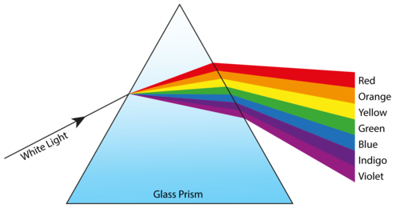
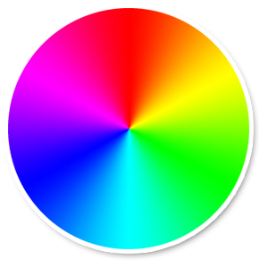
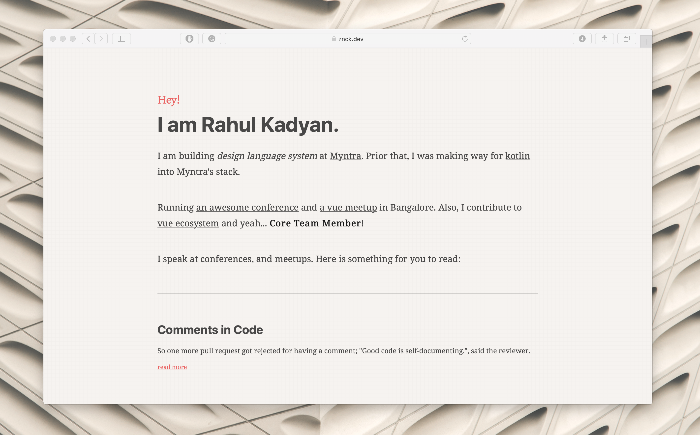
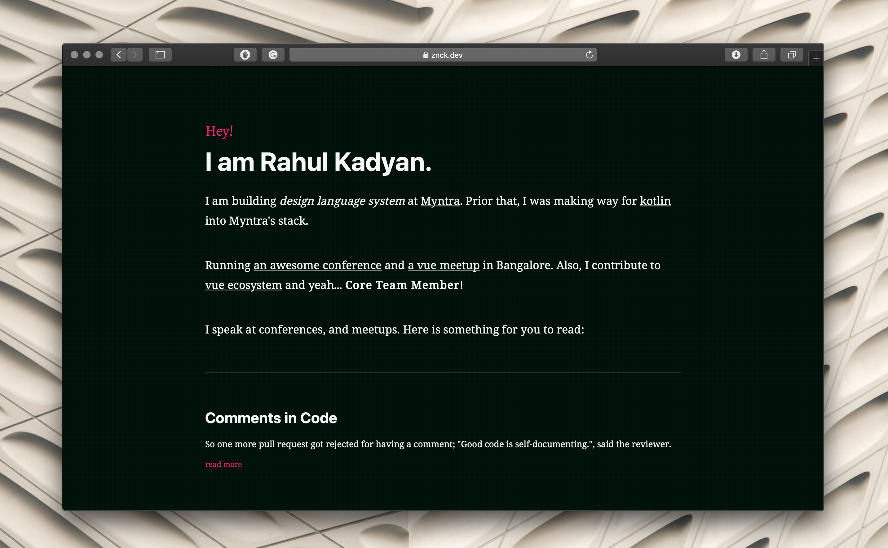

Finally some colors in my life

- #design
- #color
- #eli5

# Finally some colors in my life

by **Rahul Kadyan** |  published on **June 3, 2019**

* * *

"I got a red shirt!", I scream, every time my friends jab that my wardrobe is grey and dull. They always call me out, "Get some colors, dude!".

Colors, huh!

## Colors

I like grey; it's my absolute favorite. Grey is a color. I see grey as `#808080`, call me a nerd, but I do see `#808080`. `#808080` is how we tell computers that I want grey.

The number `#808080`, we call it hex code (short for hexadecimal code) of a color.

One important thing to note here, this 80 in hex code is not the number eighty we learned in the math class. Why it's like that?

Let us ignore why, for a while, and we revisit the elementary math class first.

We have ten digits: 0, 1, 2, 3, 4, 5, 6, 7, 8, and 9. We use these digits to make numbers, and we get a system to make numbers. We are using ten digits in this number system, so it is a base10 number system, also known as the decimal number system.

The 80 in the hex code is 128 in the decimal number system (let's ignore how for a while).

I see the number 128 as a hundred, a twenty, and an eight. We can break it further, a hundred, two tens and an eight.

1×100+2×10+8×1=128
We know hundred is ten times ten.
1×10×10×1+2×10×1+8×1=128

As we move from right to left, the value of a position is increasing ten folds. It is increasing ten folds because we have ten digits or say it is a base10 number. We have a smarter way to represent these ten folds increase: power notation. In power notation, we say:

1=100
10=101
100=102
Let's write 128 with power notation.
1×102+2×101+8×100=128
For brevity, we write these numbers in increasing order of power.
8×100+2×101+1×102=128
Phew!

However, we got one little problem computers do not understand decimal numbers. They use base2 number system (also called binary number system) which means only two digits: 0 and 1. The decimal number 28 is 1000 0000 in the binary number system.

Similar to decimal number above, we can write 1000 0000 in power notation:
0×20+0×21+0×22+0×23+0×24+0×25+0×26+1×27=128

The grey color (hex code `#808080`) would be 1000 0000 1000 0000 1000 0000, and computers would understand it. However, we, humans, would have a tough time using binary numbers. Just imagine, if my designer friend asks "What is the color of the button?" and I say, "It looks like one zero zero zero zero zero zero zero zero one zero zero zero zero ...". It is pretty damn exhausting. Moreover, I am not sure if anyone can comprehend these kinds of numbers. We need a better system to convey these numbers, like the number in the hex code of the grey color. The hex code `#808080` is a hexadecimal number (a base16 number system). The hexadecimal number 80 in power notation would be:

0×160+8×161=128

This number is relatively more comfortable to use as I can reply to my designer friend, "It looks like hex eighty eighty eighty."

Why do we need three eighties for one color?
Yay! I can talk about Color Theory. I feel like a designer now.

Screens use lights to display colors. However, we don't need lights in all colors. A small set of colored lights can be mixed to create various colors. One such set is lights of red, green and blue color. So the three eighties in the hex code of grey are amounts of red, green, and blue colors, and it is also the reason that hex code is also called RGB code.

Hence, grey has some red, some green, and some blue which makes me think grey is full of colors, then why does it look so... grey?

White light passing through prism

Colored lights mix additively or subtractively to give a resultant color. In our case, equal amounts of red, green, and blue cancel each other out, resulting into grey color. I cannot mix these colored lights in my head and write the correct hex code for the color I want to use. I need some other way to tell colors.

Fortunately, there is a way: a color notation called HSL, which stands for hue, saturation, and lightness. Scary, huh! It seemed very complicated to me and chose to stick to color pickers until I saw [Miriam's talk at VueConf US 2019](https://youtu.be/VsG5l5e44ZY). She simplified HSL for me:

- Hue is the color.
- Saturation is the amount of color.
- Lightness is the amount of light.

Imagine if we paint a rainbow on a circular disc such that every radial line is in a different color, gradually changing from red to yellow, yellow to green, green to cyan, cyan to blue, and blue to red. On such a circle, the angle between any radial line with the red radial can be used to choose a color. We have red at 0deg, yellow at 60deg, green at 120deg, cyan at 180deg, blue at 240deg, again red at 360deg, and every other angle in between these would give a color which is a mixture of the two. Now, I know what could be the hue of the color I want.

A disk demonstrating hues of HSL

After picking hue, I choose the amount of the color, i.e., the saturation. It goes no color to full color, and we use percentage to set the amount required.

Finally, we pick a lightness to set the brightness of the color. It goes from dark black to bright white and similar to saturation; we use a percentage value.

Let's pick the grey color:

- Hue does not matter as it's grey.
- We don't want any color, so we set it to 0%
- The correct lightness value would be around 50%, in between black and white.

Hence, the grey color in HSL would be `hsl(0deg, 0%, 50.25%)` which is equivalint to `#808080`. Now I know how to make colors. I am adding colors to my blog.

## The dark theme

I have been redesigning my blog for a while. With some help from [Suwardhan](https://suwardhan.com/), I finally got the new design out.

Screenshot: Default Theme on znck.dev
It looks clean and smooth, and I love it.

However, the brightness hurt my eyes. I am more of a dark mode person. I have to build a dark theme for me, and it is, precisely the opportunity I have been looking to throw in lots of colors.

In the default theme, I have a light yellowish background, black text, and bright orange highlights. So, I need three colors for the dark mode too: a text color, a background color, and a highlight color.

I choose white for text to get maximum contrast as the background would be dark. For background, I need some color with very low lightness. I pick: `hsl(0deg, 100%, 3%)`. I notice that text contrast remains the same, no matter what is the hue, which allows me to throw in lots of colors. I wonder, if somehow I can pass a random hue value to the background color, I can get as many colors as I want.

## The color of the day

"Wonder! every day there's a new color.", I want it, I want it, I want it. How do I get a new hue every day? Can I use date? I think I can. There are 365 days in a year, and 360 degrees of hues (hue is circular so 361deg is equal to 1deg), I can use the day number as the value of the hue. I call it the hue of the day.

So, the background becomes `hsl(var(--hue-of-the-day), 100%, 3%)`. I need one more color for highlights. I choose to use the contrasting hue of the day. It is amazing how easy it is to get contrasting color in HSL, subtract the hue value from 180deg. So, I have white for text, `hsl(var(--hue-of-the-day), 100%, 3%)` for background, and `hsl(calc(180deg - var(--hue-of-the-day)), 100%, 60%)` for highlights.

Screenshot: Dark Theme on znck.dev
I use the following JavaScript snippet to set the hue of the day:

	function hue() {
	  const now = new Date()
	  const start = new Date(now.getFullYear(), 0, 0)
	  const diff = now - start
	  const oneDay = 1000 * 60 * 60 * 24
	  const day = Math.floor(diff / oneDay)

	  return day + 'deg'
	}

	document.body.style['--hue-of-the-day'] = hue()

That's all folks.

I have a dark mode full of colors. Now, I got 723 colors: 360 backgrounds and 360 text colors of the dark theme, the background color of the light theme, the text color of the light theme, and "I got a red shirt!".

* * *

Like this article? [share on twitter](http://twitter.com/intent/tweet?text=Checkout%20%40znck0%27s%20take%20on%20%22Finally%20some%20colors%20in%20my%20life%22.%20https%3A%2F%2Fznck.dev%2Fblog%2F2019-finally-some-colors%2F). If you have any questions or suggestions, write me a [mail](https://znck.dev/blog/2019-finally-some-colors/mailto:rahulkdn+blog@gmail.com?subject=Finally%20some%20colors%20in%20my%20life) or a [twitter DM](https://twitter.com/messages/compose?recipient_id=102900547&text=Checkout%20%40znck0%27s%20take%20on%20%22Finally%20some%20colors%20in%20my%20life%22.%20https%3A%2F%2Fznck.dev%2Fblog%2F2019-finally-some-colors%2F).