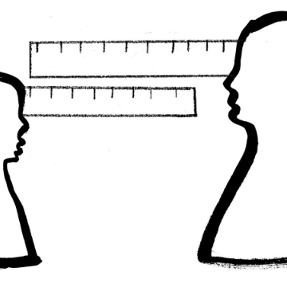

Finding It Hard to Focus? Maybe It’s Not Your Fault

Finding It Hard to Focus? Maybe It’s Not Your Fault

https://www.nytimes.com/2018/08/14/style/how-can-i-focus-better.html

The rise of the new “attention economy.”