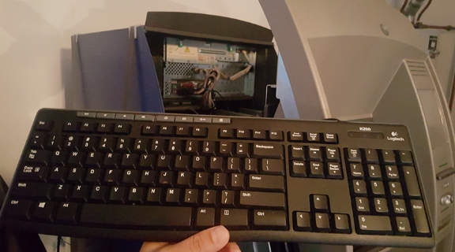
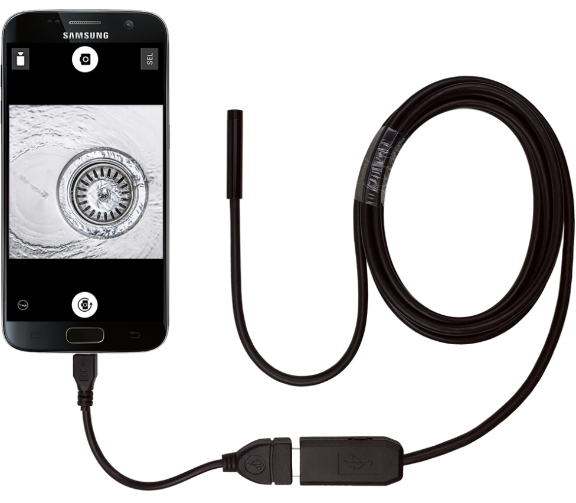

First ‘Jackpotting’ Attacks Hit U.S. ATMs — Krebs on Security

# First ‘Jackpotting’ Attacks Hit U.S. ATMs

ATM “**jackpotting**” — a sophisticated crime in which thieves install malicious software and/or hardware at ATMs that forces the machines to spit out huge volumes of cash on demand — has long been a threat for banks in Europe and Asia, yet these attacks somehow have eluded U.S. ATM operators. But all that changed this week after the **U.S. Secret Service** quietly began warning financial institutions that jackpotting attacks have now been spotted targeting cash machines here in the United States.

To carry out a jackpotting attack, thieves first must gain physical access to the cash machine. From there they can use malware or specialized electronics — often a combination of both — to control the operations of the ATM.

A keyboard attached to the ATM port. Image: FireEye

On Jan. 21, 2018, KrebsOnSecurity began hearing rumblings about jackpotting attacks, also known as “logical attacks,” hitting U.S. ATM operators. I quickly reached out to ATM giant **NCR Corp.** to see if they’d heard anything. NCR said at the time it had received unconfirmed reports, but nothing solid yet.

On Jan. 26, NCR sent an advisory to its customers saying it had received reports from the Secret Service and other sources about jackpotting attacks against ATMs in the United States.

“While at present these appear focused on non-NCR ATMs, logical attacks are an industry-wide issue,” the NCR alert reads. “This represents the first confirmed cases of losses due to logical attacks in the US. This should be treated as a call to action to take appropriate steps to protect their ATMs against these forms of attack and mitigate any consequences.”

The NCR memo does not mention the type of jackpotting malware used against U.S. ATMs. But a source close to the matter said the Secret Service is warning that organized criminal gangs have been attacking stand-alone ATMs in the United States using “**Ploutus.D**,” an advanced strain of jackpotting malware [first spotted in 2013](https://www.fireeye.com/blog/threat-research/2017/01/new_ploutus_variant.html).

According to that source — who asked to remain anonymous because he was not authorized to speak on the record — the Secret Service has received credible information that crooks are activating so-called “cash out crews” to attack front-loading ATMs manufactured by ATM vendor **Diebold Nixdorf**.

The source said the Secret Service is warning that thieves appear to be targeting **Opteva 500 and 700** series Dielbold ATMs using the Ploutus.D malware in a series of coordinated attacks over the past 10 days, and that there is evidence that further attacks are being planned across the country.

> fraudsters dressed as ATM technicians and attached a laptop computer with a mirror image of the ATMs operating system along with a mobile device to the targeted ATM.

“The targeted stand-alone ATMs are routinely located in pharmacies, big box retailers, and drive-thru ATMs,” reads a confidential Secret Service alert sent to multiple financial institutions and obtained by KrebsOnSecurity. “During previous attacks, fraudsters dressed as ATM technicians and attached a laptop computer with a mirror image of the ATMs operating system along with a mobile device to the targeted ATM.”

Reached for comment, Diebold shared an alert it sent to customers Friday warning of potential jackpotting attacks in the United States. Diebold’s alert confirms the attacks so far appear to be targeting front-loaded Opteva cash machines.

“As in Mexico last year, the attack mode involves a series of different steps to overcome security mechanism and the authorization process for setting the communication with the [cash] dispenser,” the Diebold security alert reads. A copy of the entire Diebold alert, complete with advice on how to mitigate these attacks, is available [here](https://krebsonsecurity.com/wp-content/uploads/2018/01/20180126-GLOBAL-SECURITY-ALERT-018-04-0005-Potential-Jackpotting-US-Update-on-017-34-0002-smaller.pdf) (PDF).

The Secret Service alert explains that the attackers typically use an [endoscope](https://en.wikipedia.org/wiki/Endoscope) — a slender, flexible instrument traditionally used in medicine to give physicians a look inside the human body — to locate the internal portion of the cash machine where they can attach a cord that allows them to sync their laptop with the ATM’s computer.

An endoscope made to work in tandem with a mobile device. Source: gadgetsforgeeks.com.au

“Once this is complete, the ATM is controlled by the fraudsters and the ATM will appear Out of Service to potential customers,” reads the confidential Secret Service alert.

At this point, the crook(s) installing the malware will contact co-conspirators who can remotely control the ATMs and force the machines to dispense cash.

“In previous Ploutus.D attacks, the ATM continuously dispensed at a rate of 40 bills every 23 seconds,” the alert continues. Once the dispense cycle starts, the only way to stop it is to press cancel on the keypad. Otherwise, the machine is completely emptied of cash, according to the alert.

An 2017 analysis of Ploutus.D by security firm **FireEye** called it “one of the most advanced ATM malware families we’ve seen in the last few years.”

“Discovered for the [first time in Mexico ](https://www.symantec.com/connect/blogs/criminals-hit-atm-jackpot)back in 2013, Ploutus enabled criminals to empty ATMs using either an external keyboard attached to the machine or [via SMS message](https://www.symantec.com/connect/blogs/texting-atms-cash-shows-cybercriminals-increasing-sophistication), a technique that had never been seen before,” FireEye’s **Daniel Regalado** wrote.

According to FireEye, the Ploutus attacks seen so far require thieves to somehow gain physical access to an ATM — either by picking its locks, using a stolen master key or otherwise removing or destroying part of the machine.

Regalado says the crime gangs typically responsible for these attacks deploy “money mules” to conduct the attacks and siphon cash from ATMs. The term refers to low-level operators within a criminal organization who are assigned high-risk jobs, such as installing ATM skimmers and otherwise physically tampering with cash machines.

“From there, the attackers can attach a physical keyboard to connect to the machine, and [use] an activation code provided by the boss in charge of the operation in order to dispense money from the ATM,” he wrote. “Once deployed to an ATM, Ploutus makes it possible for criminals to obtain thousands of dollars in minutes. While there are some risks of the money mule being caught by cameras, the speed in which the operation is carried out minimizes the mule’s risk.”

Indeed, the Secret Service memo shared by my source says the cash out crew/money mules typically take the dispensed cash and place it in a large bag. After the cash is taken from the ATM and the mule leaves, the phony technician(s) return to the site and remove their equipment from the compromised ATM.

“The last thing the fraudsters do before leaving the site is to plug the Ethernet cable back in,” the alert notes.

FireEye said all of the samples of Ploutus.D it examined targeted Diebold ATMs, but it warned that small changes to the malware’s code could enable it to be used against [40 different ATM vendors in 80 countries](http://www.kal.com/en/video/multi-vendor).

The Secret Service alert says ATMs still running on **Windows XP** are particularly vulnerable, and it urged ATM operators to update to a version of **Windows 7** to defeat this specific type of attack.

This is a quickly developing story and may be updated multiple times over the next few days as more information becomes available.

Tags: [atm jackpotting](https://krebsonsecurity.com/tag/atm-jackpotting/), [atm logical attacks](https://krebsonsecurity.com/tag/atm-logical-attacks/), [Daniel Regalado](https://krebsonsecurity.com/tag/daniel-regalado/), [Diebold Nixdorf](https://krebsonsecurity.com/tag/diebold-nixdorf/), [Diebold Opteva](https://krebsonsecurity.com/tag/diebold-opteva/), [endoscope](https://krebsonsecurity.com/tag/endoscope/), [FireEye](https://krebsonsecurity.com/tag/fireeye/), [NCR Corp](https://krebsonsecurity.com/tag/ncr-corp/), [Ploutus.D](https://krebsonsecurity.com/tag/ploutus-d/), [U.S. Secret Service](https://krebsonsecurity.com/tag/u-s-secret-service/), [Windows 7](https://krebsonsecurity.com/tag/windows-7/), [Windows XP](https://krebsonsecurity.com/tag/windows-xp/)

This entry was posted on Saturday, January 27th, 2018 at 1:45 pm	and is filed under [All About Skimmers](https://krebsonsecurity.com/category/all-about-skimmers/), [Latest Warnings](https://krebsonsecurity.com/category/latest-warnings/), [The Coming Storm](https://krebsonsecurity.com/category/comingstorm/). You can follow any comments to this entry through the [RSS 2.0](https://krebsonsecurity.com/2018/01/first-jackpotting-attacks-hit-u-s-atms/feed/) feed.

You can skip to the end and leave a comment. Pinging is currently not allowed.