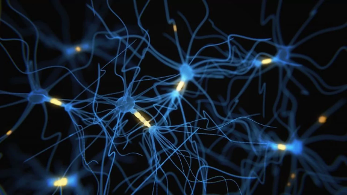

Five major psychiatric disorders have overlapping patterns of genetic activity, new study shows

# Five major psychiatric disorders have overlapping patterns of genetic activity, new study shows

Artist's conception of a network of brain cells. Researchers have found similar signs of disrupted neuronal communication in five psychiatric disorders. (iStock)

*This post has been updated.*

Certain patterns of genetic activity appear to be common among five distinct psychiatric disorders — [autism](https://www.asha.org/public/speech/disorders/Autism/), [schizophrenia](https://www.psychiatry.org/patients-families/schizophrenia/what-is-schizophrenia), [bipolar](https://www.psychiatry.org/patients-families/bipolar-disorders/what-are-bipolar-disorders) disorder, [depression](https://www.mayoclinic.org/diseases-conditions/depression/symptoms-causes/syc-20356007) and [alcoholism](https://www.google.com/search?rlz=1C1GCEA_enUS781US781&ei=8B57Wou9CsSzggeD_Y3IDw&q=What+is+alcoholism&oq=What+is+alcoholism&gs_l=psy-ab.3..0l10.6035.9130.0.9353.10.7.0.3.3.0.88.461.7.7.0....0...1c.1.64.psy-ab..0.10.495...35i39k1j0i67k1j0i20i264k1j0i131k1.0.YxNZN278FfQ) — according to a new study. The [paper](http://science.sciencemag.org/content/359/6376/693.full), appearing in the journal Science, was released Thursday.

Scientists analyzed data from 700 human brains, all donated either from patients who suffered one of these major psychiatric disorders or from people who had not been diagnosed with mental illness. The scientists found similar levels of particular molecules in the brains of people with autism, schizophrenia and bipolar disorder; other commonalities between bipolar and major depression; and other matches between major depression and alcoholism.

“We’re on the threshold to using genomics and molecular technology to look at [mental illness] in a way we’ve never been able to do before,” said Daniel Geschwind, a neurogeneticist at the University of California at Los Angeles and a leader of the study. “Psychiatric disorders have no obvious pathology in the brain, but now we have the genomic tools to ask what actually goes awry in these brains.”

These shared, disease-related “signatures” involve a disruption in how brain cells communicate with one another.

“What we're seeing is giving us a sense of alterations in the way neurons are signaling to each other,” Geschwind said. “We think some of it is confused activity. That’s the next step, to connect it to the physiology: how do these changes affect neuronal firing and connectivity. We have a clue that it’s adding 'noise' to the system. Maybe things are attenuated or jumbled.”

To eliminate the possibility that antipsychotic medication — likely to have been taken by many of the deceased mentally ill subjects — was causing the overlapping patterns of molecules in the brains, the researchers compared the brain samples of their subjects with those taken from nonhuman primates that were first given PCP to evoke psychosis, then treated with antipsychotic drugs. The medications appeared to partially “normalize” the disordered genetic activity in the monkey's brains.

2:34
The genetics of autism, explained
Embed
Share

Here's what you need to know about genetics and autism. (Animation and illustration by Marc Christofordis for Spectrum)

“Gene-expression patterns might someday be good targets for reversal by medication,” Geschwind said. “In [our study] the drugs at least partially normalized gene expression in the brain.”

Many studies have identified variations in the genetic code that seem to be more common in people with psychiatric disorders. This approach goes a step further to show how genes are more or less active in the brains of people with various conditions. The study confirmed that genetic variations contributed to the patterns of activity in the brains, but as the authors wrote, “there is undoubtedly a contribution from environmental effects.”

Psychiatric disorders have some overlapping symptoms, making them difficult to diagnose. The molecular signatures in the new study suggested that schizophrenia, bipolar disorder and autism have dysfunctional synapses, the points of contact between neurons where they exchange information. Brain support cells called microglia and astroglia had unusual patterns of activity in some of the disorders, as well.

Geschwind credits not only technological advances for the breakthrough but also an extraordinary level of international collaboration made possible by the National Institutes of Health's PsychEncode consortium, which encourages the sharing of information. The drop in cost of sequencing genetic code has also helped.

What the research represents, Geschwind said, is the chance to get closer to targeted molecular therapy, much like what's being done with cancer. “This gives us the first road map to what’s really going on with these disorders.”

Thomas Lehner, director of the Office of Genomics Research Coordination at the National Institute of Mental Health, called it a “very exciting finding” with the potential “to give us a better understanding of the molecular machinery of neuropsychiatric disorders.”

Carol Tamminga, the chair of psychiatry at the University of Texas Southwestern’s O’Donnell Brain Institute, goes further. She thinks the new study will require revising how psychiatric diagnoses are made. In the past, those were derived solely by observing patients and cataloging symptoms.

“Now we can go back to the drawing board and decide what are the biological characteristics than can define these diseases,” she said. “This gives us guidance as to what direction to take.”

**Read more:**

[A mentally ill woman's harrowing last days](https://www.washingtonpost.com/news/to-your-health/wp/2017/05/02/god-know-where-i-am-documentary-explores-the-mental-health-systems-failures-through-one-womans-own-words/?utm_term=.20146cf66008)

[ADHD linked to delayed brain development](https://www.washingtonpost.com/news/to-your-health/wp/2017/02/15/attention-deficithyperactivity-is-a-brain-disorder-scientists-confirm/?utm_term=.712876cd294d)

[Pregnancy changes the brain for at least two years](https://www.washingtonpost.com/news/to-your-health/wp/2016/12/19/pregnancy-changes-the-brain-for-as-long-as-two-years/?utm_term=.9619698e8be2)