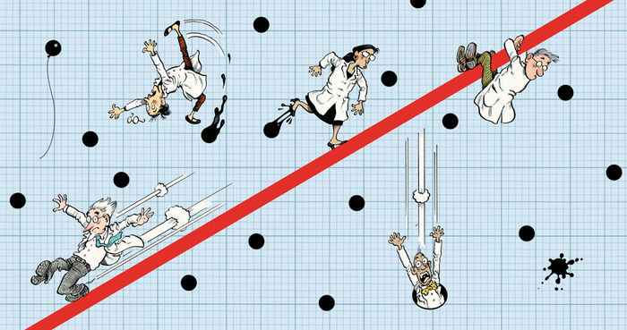
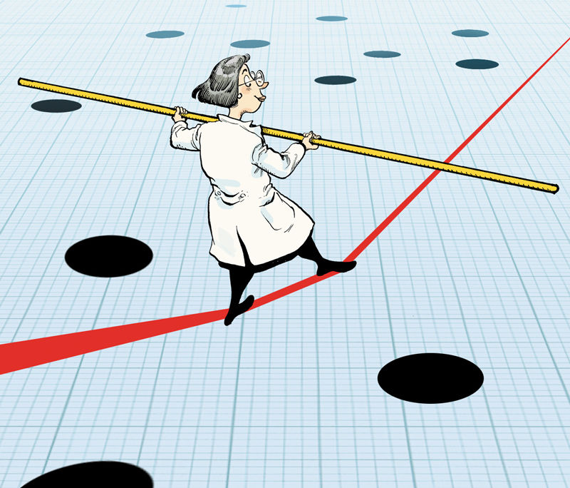
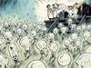

Five ways to fix statistics

COMMENT
·  28 November 2017

# Five ways to fix statistics

As debate rumbles on about how and how much poor statistics is to blame for poor reproducibility, *Nature* asked influential statisticians to recommend one change to improve science. The common theme? The problem is not our maths, but ourselves.

### Show author information[  [Jeff Leek](#),](#)

### Show author information[Blakeley B. McShane,](#)

### Show author information[  [Andrew Gelman](#),](#)

### Show author information[  [David Colquhoun](#),](#)

### Show author information[  [Michèle B. Nuijten](#) &](#)

### Show author information[  [Steven N. Goodman](#)](#)

         

Illustration by David Parkins

 [PDF version](https://www.nature.com/magazine-assets/d41586-017-07522-z/d41586-017-07522-z.pdf)

**JEFF LEEK: Adjust for human cognition **

To use statistics well, researchers must study how scientists analyse and interpret data and then apply that information to prevent cognitive mistakes.

In the past couple of decades, many fields have shifted from data sets with a dozen measurements to data sets with millions. Methods that were developed for a world with sparse and hard-to-collect information have been jury-rigged to handle bigger, more-diverse and more-complex data sets. No wonder the literature is now full of papers that use outdated statistics, misapply statistical tests and misinterpret results. The application of *P* values to determine whether an analysis is interesting is just one of the most visible of many shortcomings.

It’s not enough to blame a surfeit of data and a lack of training in analysis[1](https://www.nature.com/articles/d41586-017-07522-z?imm_mid=0f9b7e&cmp=em-data-na-na-newsltr_20171213#ref-CR1). It’s also impractical to say that statistical metrics such as *P* values should not be used to make decisions. Sometimes a decision (editorial or funding, say) must be made, and clear guidelines are useful.

The root problem is that we know very little about how people analyse and process information. An illustrative exception is graphs. Experiments show that people struggle to compare angles in pie charts yet breeze through comparative lengths and heights in bar charts[2](https://www.nature.com/articles/d41586-017-07522-z?imm_mid=0f9b7e&cmp=em-data-na-na-newsltr_20171213#ref-CR2). The move from pies to bars has brought better understanding.

We need to appreciate that data analysis is not purely computational and algorithmic — it is a human behaviour. In this case, the behaviour is made worse by training that was developed for a data-poor era. This framing will enable us to address practical problems. For instance, how do we reduce the number of choices an analyst has to make without missing key features in a data set? How do we help researchers to explore data without introducing bias?

The first step is to observe: what do people do now, and how do they report it? My colleagues and I are doing this and taking the next step: running controlled experiments on how people handle specific analytical challenges in our massive online open courses[3](https://www.nature.com/articles/d41586-017-07522-z?imm_mid=0f9b7e&cmp=em-data-na-na-newsltr_20171213#ref-CR3).

We need more observational studies and randomized trials — more epidemiology on how people collect, manipulate, analyse, communicate and consume data. We can then use this evidence to improve training programmes for researchers and the public. As cheap, abundant and noisy data inundate analyses, this is our only hope for robust information.

**BLAKELEY B. MCSHANE & ANDREW GELMAN: Abandon statistical significance**

In many fields, decisions about whether to publish an empirical finding, pursue a line of research or enact a policy are considered only when results are ‘statistically significant’, defined as having a *P* value (or similar metric) that falls below some pre-specified threshold. This approach is called null hypothesis significance testing (NHST). It encourages researchers to investigate so many paths in their analyses that whatever appears in papers is an unrepresentative selection of the data.

Worse, NHST is often taken to mean that any data can be used to decide between two inverse claims: either ‘an effect’ that posits a relationship between, say, a treatment and an outcome (typically the favoured hypothesis) or ‘no effect’ (defined as the null hypothesis).

In practice, this often amounts to uncertainty laundering. Any study, no matter how poorly designed and conducted, can lead to statistical significance and thus a declaration of truth or falsity. NHST was supposed to protect researchers from over-interpreting noisy data. Now it has the opposite effect.

This year has seen a debate about whether tightening the threshold for statistical significance would improve science. More than 150 researchers have weighed in[4](https://www.nature.com/articles/d41586-017-07522-z?imm_mid=0f9b7e&cmp=em-data-na-na-newsltr_20171213#ref-CR4),[5](https://www.nature.com/articles/d41586-017-07522-z?imm_mid=0f9b7e&cmp=em-data-na-na-newsltr_20171213#ref-CR5). We think improvements will come not from tighter thresholds, but from dropping them altogether. We have no desire to ban *P* values. Instead, we wish them to be considered as just one piece of evidence among many, along with prior knowledge, plausibility of mechanism, study design and data quality, real-world costs and benefits, and other factors. For more, see our article with David Gal at the University of Illinois at Chicago, Christian Robert at the University of Paris-Dauphine and Jennifer Tackett at Northwestern University[6](https://www.nature.com/articles/d41586-017-07522-z?imm_mid=0f9b7e&cmp=em-data-na-na-newsltr_20171213#ref-CR6).

For example, consider a claim, published in a leading psychology journal in 2011, that a single exposure to the US flag shifts support towards the Republican Party for up to eight months[7](https://www.nature.com/articles/d41586-017-07522-z?imm_mid=0f9b7e&cmp=em-data-na-na-newsltr_20171213#ref-CR7). In our view, this finding has no backing from political-science theory or polling data; the reported effect is implausibly large and long-lasting; the sample sizes were small and nonrepresentative; and the measurements (for example, those of voting and political ideology) were noisy. Although the authors stand by their findings, we argue that their *P* values provide very little information.

Statistical-significance thresholds are perhaps useful under certain conditions: when effects are large and vary little under the conditions being studied, and when variables can be measured accurately. This may well describe the experiments for which NHST and canonical statistical methods were developed, such as agricultural trials in the 1920s and 1930s examining how various fertilizers affected crop yields. Nowadays, however, in areas ranging from policy analysis to biomedicine, changes tend to be small, situation-dependent and difficult to measure. For example, in nutrition studies, it can be a challenge to get accurate reporting of dietary choices and health outcomes.

Open-science practices can benefit science by making it more difficult for researchers to make overly strong claims from noisy data, but cannot by themselves compensate for poor experiments. Real advances will require researchers to make predictions more capable of probing their theories and invest in more precise measurements featuring, in many cases, within-person comparisons.

A crucial step is to move beyond the alchemy of binary statements about ‘an effect’ or ‘no effect’ with only a *P* value dividing them. Instead, researchers must accept uncertainty and embrace variation under different circumstances.

 

Illustration by David Parkins

**DAVID COLQUHOUN: State false-positive risk, too**

To demote *P* values to their rightful place, researchers need better ways to interpret them. What matters is the probability that a result that has been labelled as ‘statistically significant’ turns out to be a false positive. This false-positive risk (FPR) is always bigger than the *P* value.

How much bigger depends strongly on the plausibility of the hypothesis before an experiment is done — the prior probability of there being a real effect. If this prior probability were low, say 10%, then a *P* value close to 0.05 would carry an FPR of 76%. To lower that risk to 5% (which is what many people still believe *P* < 0.05 means), the *P* value would need to be 0.00045.

So why not report the false-positive risk instead of the easily misinterpreted *P* value? The problem is that researchers usually have no way of knowing what the prior probability is.

The best solution is to specify the prior probability needed to believe in order to achieve an FPR of 5%, as well as providing the *P* value and confidence interval.

Another approach is to assume, arbitrarily, a prior probability of 0.5 and calculate the minimum FPR for the observed *P* value. (The calculations can be done easily with an online calculator, see [http://fpr-calc.ucl.ac.uk](http://fpr-calc.ucl.ac.uk/).)

This is one strategy that combines familiar statistics with Bayes’ theorem, which updates prior probabilities using the evidence from an experiment. Of course, there are assumptions behind these calculations[8](https://www.nature.com/articles/d41586-017-07522-z?imm_mid=0f9b7e&cmp=em-data-na-na-newsltr_20171213#ref-CR8), and no automated tool can absolve a researcher from careful thought.

The hope is that my proposal might help to break the deadlock among statisticians about how to improve reproducibility.

Imagine the healthy scepticism readers would feel if, when reporting a just-significant *P* value, a value close to 0.05, they also reported that the results imply a false-positive risk of at least 26%. And that to reduce this risk to 5%, you’d have to be almost (at least 87%) sure that there was a real effect before you did the experiment.

**MICHÈLE B. NUIJTEN: Share analysis plans and results**

Better than rules about how to analyse data are conventions that keep researchers accountable for their analyses.

A set of rigorous rules won’t work to improve statistical practices because there will be too many situations to account for. Even a seemingly simple research question (does drug A work better than drug B?) can lead to a surfeit of different analyses. How should researchers account for variables such as gender or age, if they do so at all? Which extreme data points should be excluded, and when? The plethora of options creates a hazard that statistician Andrew Gelman has dubbed the garden of forking paths, a place where people are easily led astray. In the vast number of routes, at least one will lead to a ‘significant’ finding simply by chance. Researchers who hunt hard enough will turn up a result that fits statistical criteria — but their discovery will probably be a false positive.

Planning and openness can help researchers to avoid false positives. One technique is to preregister analysis plans: scientists write down (and preferably publish) how they intend to analyse their data before they even see them. This eliminates the temptation to hack out the one path that leads to significance and afterwards rationalize why that path made the most sense. With the plan in place, researchers can still actively try out several analyses and learn whether results hinge on a particular variable or a narrow set of choices, as long as they clearly state that these explorations were not planned beforehand.

The next step is to share all data and results of all analyses as well as any relevant syntax or code. That way, people can judge for themselves if they agree with the analytical choices, identify innocent mistakes and try other routes.

**STEVEN N. GOODMAN: Change norms from within**

It is not statistics that is broken, but how it is applied to science. This varies in myriad ways from subfield to subfield. Unfortunately, disciplinary conventions die hard, even when they contribute to shaky conclusions. Statisticians can be allies — the American Statistical Association, for instance, broke from tradition to warn against misuse of *P* values[9](https://www.nature.com/articles/d41586-017-07522-z?imm_mid=0f9b7e&cmp=em-data-na-na-newsltr_20171213#ref-CR9) — but they cannot fix the cultures of other fields.

When training scientists in the use of quantitative methods, I and others often feel pressure to teach the standard approaches that peers and journals expect rather than to expose the problems. Explaining to young scientists why they should be able to argue for a real finding when *P* = 0.10, or for its non-existence when *P* = 0.01 does not enhance their professional prospects, and usually takes more time than we have. Many scientists want only enough knowledge to run the statistical software that allows them to get their papers out quickly, and looking like all the others in their field.

Norms are established within communities partly through methodological mimicry. In a paper published last month on predicting suicidality[10](https://www.nature.com/articles/d41586-017-07522-z?imm_mid=0f9b7e&cmp=em-data-na-na-newsltr_20171213#ref-CR10), the authors justified their sample size of 17 participants per group by stating that a previous study of people on the autism spectrum had used those numbers. Previous publication is not a true justification for the sample size, but it does legitimize it as a model. To quote from a Berwick report on system change, “culture will trump rules, standards and control strategies every single time” (see [go.nature.com/2hxo4q2](http://go.nature.com/2hxo4q2)).

Disparate norms govern what kinds of result are sufficient to claim a discovery. Biomedical research generally uses the 2 sigma (*P* ≤ 0.05) rule; physics requires at least 3 sigma (*P* ≤  0.003). In clinical research, the idea that a small randomized trial could establish therapeutic efficacy was discarded decades ago. In psychology, the notion that one randomized trial can establish a bold theory had been the norm until about five years ago. Even now, replicating a psychology study is sometimes taken as an affront to the original investigator.

No single approach will address problems in all fields. The challenge must be taken up by funders, journals and, most importantly, the leaders of the innumerable subdisciplines. Once the process starts, it could be self-reinforcing. Scientists will follow practices they see in publications; peer reviewers will demand what other reviewers demand of them.

The time is ripe for reform. The ‘reproducibility crisis’ has shown the cost of inattention to proper design and analysis. Many young scientists today are demanding change; field leaders must champion efforts to properly train the next generation and re-train the existing one. Statisticians have an important, but secondary role. Norms of practice must be changed from within.

doi: 10.1038/d41586-017-07522-z

Nature Briefing

**Sign up for the daily *Nature Briefing* email newsletter**

Stay up to date with what matters in science and why, handpicked from *Nature* and other publications worldwide.

 [Sign Up](https://www.nature.com/briefing/signup/)

## References

1. 1.

Leek, J. T. & Peng, R. D. *Proc. Natl Acad. Sci. USA*  **112**, 1645–1646 (2015).

    -
    -

        - [PubMed](http://www.ncbi.nlm.nih.gov/entrez/query.fcgi?cmd=Retrieve&db=PubMed&dopt=Abstract&list_uids=25670866)
        - [Article](http://dx.doi.org/10.1073%2Fpnas.1421412111)
        - [CAS](https://www.nature.com/articles/cas-redirect/1%3ACAS%3A528%3ADC%2BC2MXitlOqt7s%3D)

2. 2.
Cleveland, W. S. & McGill, R. *J. Am. Stat. Assoc.*  **79**, 531–554 (1984).

    -
    -

        - [Article](http://dx.doi.org/10.1080%2F01621459.1984.10478080)

3. 3.

Myint, L. *et al.* Preprint at bioRxiv [http://dx.doi.org/10.1101/218784](https://www.nature.com/articles/d41586-017-07522-z?imm_mid=0f9b7e&cmp=em-data-na-na-newsltr_20171213) (2017).

    -
    -

4. 4.

Benjamin, D. J. *et al.*  *Nature Hum. Behav.*  [http://doi.org/cff2](https://www.nature.com/articles/d41586-017-07522-z?imm_mid=0f9b7e&cmp=em-data-na-na-newsltr_20171213) (2017).

    -
    -

5. 5.

Lakens, D. *et al.* Preprint on PsyArXiv at [http://doi.org/cgbn](https://www.nature.com/articles/d41586-017-07522-z?imm_mid=0f9b7e&cmp=em-data-na-na-newsltr_20171213) (2017).

    -
    -

6. 6.

McShane, B. B. *et al.* Preprint at [https://arxiv.org/abs/1709.07588](https://www.nature.com/articles/d41586-017-07522-z?imm_mid=0f9b7e&cmp=em-data-na-na-newsltr_20171213) (2017).

    -
    -

7. 7.
Carter, T. J. *et al.*  *Psychol. Sci.*  **22**, 1011–1018 (2011).

    -
    -

        - [PubMed](http://www.ncbi.nlm.nih.gov/entrez/query.fcgi?cmd=Retrieve&db=PubMed&dopt=Abstract&list_uids=21742933)
        - [Article](http://dx.doi.org/10.1177%2F0956797611414726)

8. 8.

Colquhoun, D. Preprint at [https://doi.org/10.1101/144337](https://www.nature.com/articles/d41586-017-07522-z?imm_mid=0f9b7e&cmp=em-data-na-na-newsltr_20171213) (2017).

    -
    -

9. 9.
Wasserstein, R. L. & Lazar, N. A. *Am. Stat.*  **70**, 129–133 (2016).

    -
    -

        - [Article](http://dx.doi.org/10.1080%2F00031305.2016.1154108)

10. 10.

Just, M. A. *et al.*  *Nature Hum. Behav.*  [http://dx.doi.org/10.1038/s41562-017-0234-y](https://www.nature.com/articles/d41586-017-07522-z?imm_mid=0f9b7e&cmp=em-data-na-na-newsltr_20171213) (2017).

    -
    -

        - [Article](http://dx.doi.org/10.1038%2Fs41562-017-0234-y)

[Download references](https://www.nature.com/articles/d41586-017-07522-z-references.ris)

### Related Articles

-

###   [ Blind analysis: Hide results to seek the truth](http://www.nature.com/news/blind-analysis-hide-results-to-seek-the-truth-1.18510)

-

###   [ Crowdsourced research: Many hands make tight work](http://www.nature.com/news/crowdsourced-research-many-hands-make-tight-work-1.18508)

-

###   [ No publication without confirmation](https://www.nature.com/news/no-publication-without-confirmation-1.21509)

-

###   [ Reproducibility: A tragedy of errors](https://www.nature.com/news/reproducibility-a-tragedy-of-errors-1.19264)

### Subjects

- Research data