Flights

Round trip

Round tripOne-way
1 passenger

Economy

EconomyPremium EconomyBusinessFirst Class

London

Where to?

Tue, 9 Jul

Fri, 12 Jul
Price

Any price

## Popular destinations

1.

### Paris

Non-stop
·
1 h 15 m
£166
2.

### Amsterdam

1 stop
·
3 h 40 m
£159
3.

### Barcelona

Non-stop
·
2 h 15 m
£97
4.

### Edinburgh

Non-stop
·
1 h 20 m
£144
5.

### Dublin

Non-stop
·
1 h 20 m
£182
6.

### Rome

1 stop
·
11 h 45 m
£156
7.

### Málaga

Non-stop
·
2 h 55 m
£127
8.

### Lisbon

Non-stop
·
2 h 40 m
£189
9.

### İstanbul

1 stop
·
12 h 50 m
£237
10.

### Madrid

1 stop
·
12 h 10 m
£147
11.

### Manchester

1 stop
·
4 h 45 m
£298
12.

### Alicante

Non-stop
·
2 h 35 m
£90
13.

### Berlin

1 stop
·
4 h 5 m
£153
14.

### Glasgow

Non-stop
·
1 h 15 m
£122
15.

### Budapest

Non-stop
·
2 h 30 m
£136
16.

### Newquay

Non-stop
·
1 h 10 m
£175
17.

### Prague

Non-stop
·
1 h 50 m
£153
18.

### Brussels

Non-stop
·
1 h 10 m
£176
19.

### Milan

1 stop
·
3 h 30 m
£154
20.

### Palma

Non-stop
·
2 h 30 m
£105
21.

### Faro

Non-stop
·
2 h 55 m
£120
22.

### Athens

1 stop
·
18 h 55 m
£151
23.

### Malta

1 stop
·
17 h 5 m
£146
24.

### Nice

1 stop
·
4 h 15 m
£145
25.

### Belfast

Non-stop
·
1 h 25 m
£160
26.

### Venice

Non-stop
·
2 h 10 m
£101
27.

### Geneva

1 stop
·
1 h 40 m
£205
28.

### Marrakesh

1 stop
·
16 h 35 m
£270
29.

### Naples

1 stop
·
4 h 25 m
£166
30.

### Newcastle upon Tyne

1 stop
·
13 h 5 m
£307
31.

### Ibiza

Non-stop
·
2 h 35 m
£101
32.

### Copenhagen

1 stop
·
4 h 25 m
£194
33.

### Frankfurt

1 stop
·
12 h 15 m
£217
34.

### Munich

1 stop
·
3 h 45 m
£150
35.

### Tel Aviv-Yafo

1 stop
·
6 h 45 m
£317
36.

### Zürich

1 stop
·
4 h 0 m
£220
37.

### Vienna

Non-stop
·
2 h 15 m
£180
38.

### Bucharest

1 stop
·
17 h 15 m
£186
39.

### Porto

1 stop
·
17 h 40 m
£172
40.

### Düsseldorf

Non-stop
·
1 h 10 m
£194

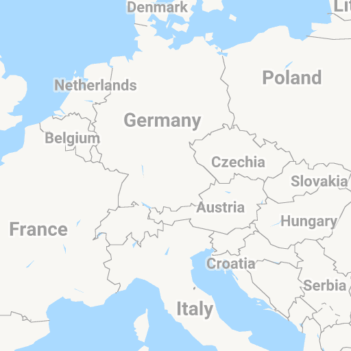
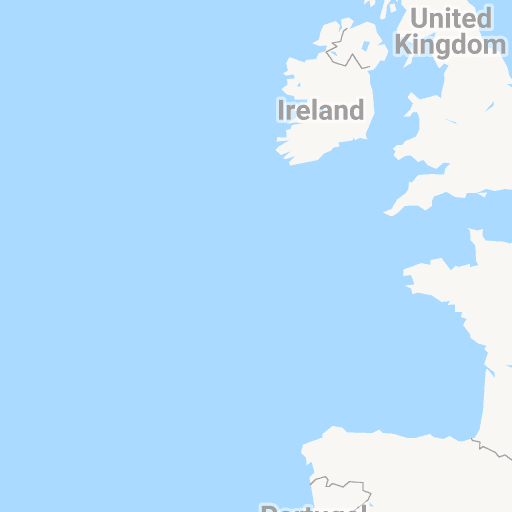
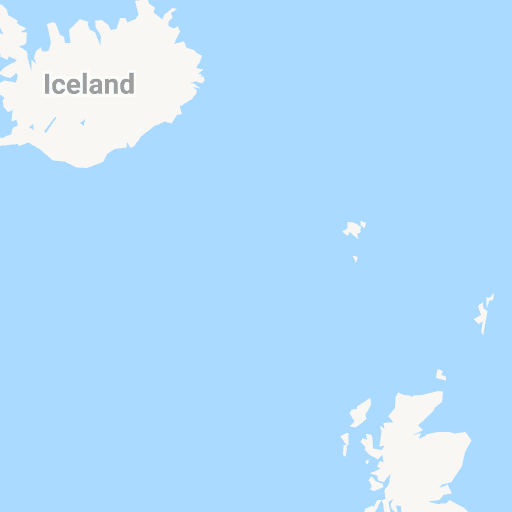

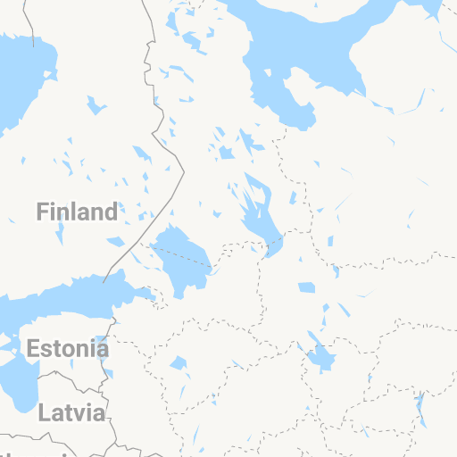
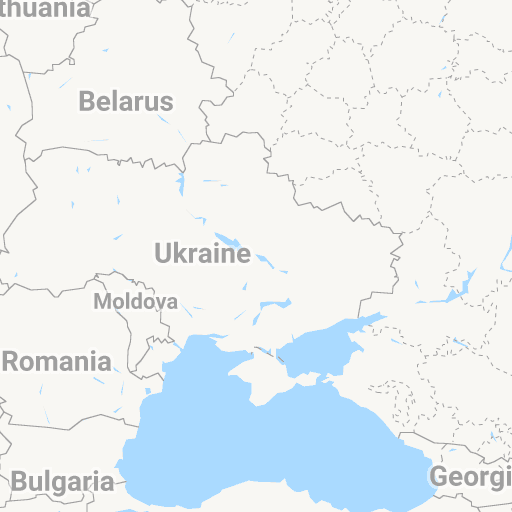
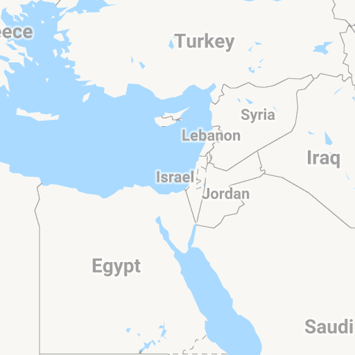
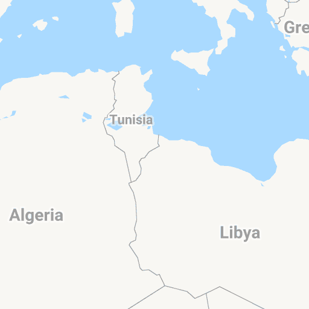

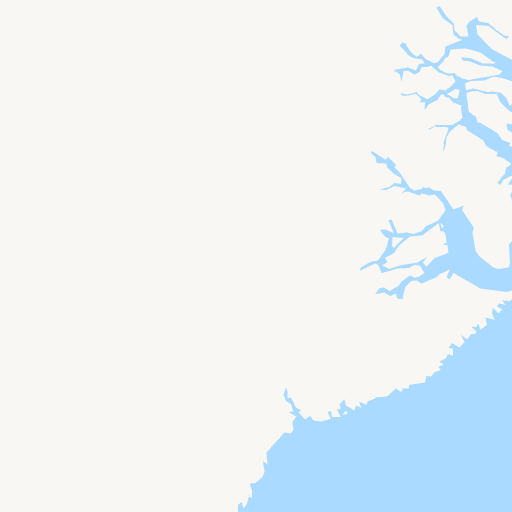
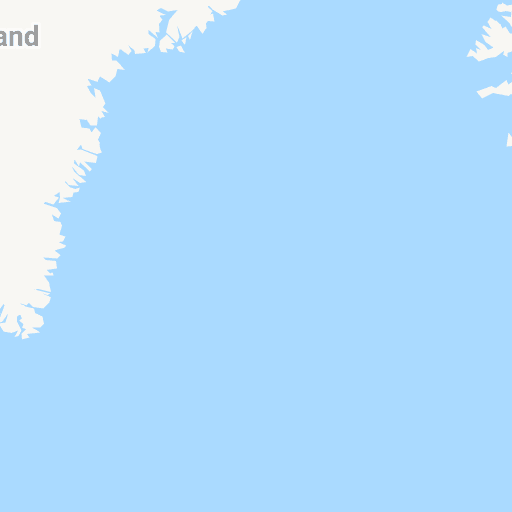

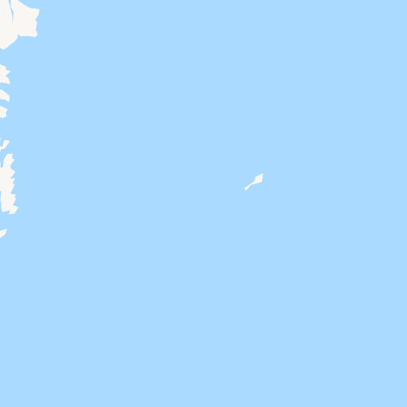
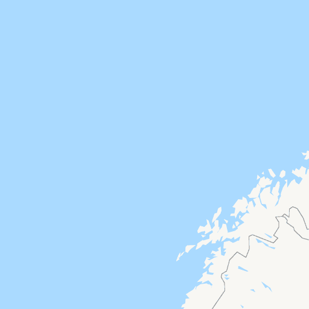

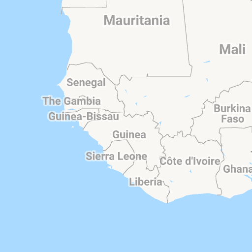

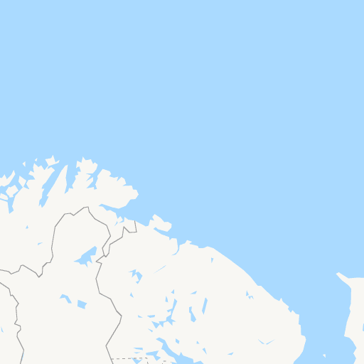

Paris
£166

Amsterdam
£159

Barcelona
£97

Edinburgh
£144

Dublin
£182

Rome
£156

Málaga
£127

Lisbon
£189

İstanbul
£237

Madrid
£147

Manchester
£298

Alicante
£90

Berlin
£153

Glasgow
£122

Budapest
£136

Newquay
£175

Prague
£153

Brussels
£176

Milan
£154

Palma
£105

Faro
£120

Athens
£151

Malta
£146

Nice
£145

Belfast
£160

Venice
£101

Geneva
£205

Marrakesh
£270

Naples
£166

Newcastle upon Tyne
£307

Ibiza
£101

Copenhagen
£194

Frankfurt
£217

Munich
£150

Tel Aviv-Yafo
£317

Zürich
£220

Vienna
£180

Bucharest
£186

Porto
£172

Düsseldorf
£194

Seville
£149

Larnaca
£253

Florence
£153

Stockholm
£156

Santorini
£241

Kraków
£144

Inverness
£163

Tirana
£250

Valencia
£147

Dalaman
£162

Aberdeen
£201

Warsaw
£193

Antalya
£177

Sofia
£153

Hamburg
£177

Corfu
£270

Oslo
£184

Moscow
£170

Lyon
£162

Leeds
£289

Madeira
£370

Dubrovnik
£159

Murcia
£187

Marseille
£148

Jersey
£154

Split
£117

Bordeaux
£138

Pisa
£184

Cologne
£147

Bologna
£156

Paphos
£241

Cork
£194

Gibraltar

Verona
£158

Beirut
£454

Turin
£158

Mykonos
£297

Helsinki
£148

Toulouse
£87

Kyiv
£153

Shannon
£259

Salzburg
£172

Catania
£162

Bilbao
£130

Luxembourg
£163

Iași
£312

Menorca
£104

Stuttgart
£217

Ljubljana
£340

Bari
£194

Palermo
£245

Rhodes
£279

Riga
£160

Basel
£148

Guernsey
£158

Bodrum
£230

Vilnius
£147

Exeter
£175

Thessaloniki
£119

Cephalonia

Chisinau

Almería

Amman

Isle of Man

Zagreb

Rotterdam

Eindhoven

Saint Petersburg

Hanover

Nantes

Gdańsk

Gothenburg

Bacău

Bratislava

Genoa

Bergerac

Belgrade

Heraklion

Montpellier

Knock

Casablanca

Bergen

Chania

Londonderry

Biarritz

Nuremberg

Wrocław

Cluj-Napoca

Perugia

Cagliari

Dundee

Dortmund

Kaunas

Burgas

Limoges

Katowice

Varna

Algiers

Suceava

Rennes

Tunis

Poznań

Kerry

Bremen

Billund

Santiago de Compostela

Timișoara

Antwerp

La Rochelle

Skiathos

Map data ©2019 Google, INEGI, ORION-ME

[Terms of Use](https://www.google.com/intl/en-GB_US/help/terms_maps.html)

Update results when map moves

StopsAirlinesTimesBagsDuration