Flow-Charts of Programming Language Constructs – progsbase

**Published:**     February 14, 2020   **    ** Author: **  Martin F. Johansen  **

# Flow-Charts of Programming Language Constructs

This article contains the flow-charts of many common programming language constructs that involve distinct combinations of gotos. The goto (or jump) is a basic building block of control flow, therefore most control flow constructs can be modelled using it.

## 1a. If

The if construct is a part of most programming languages. It is a structured construct — a part of the programming style known as structured programming.

In the graph below, the empty-circle is the entry point of a program and the double-edged circle is the exit point. The rhombus (the square turned on its side) is a choice point where the program can go two places based on the content of a variable. The squares are code blocks. The arrows are execution flow through the program.

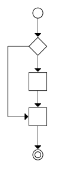

This graph corresponds to the following code. In this code, a variable is set to true or false. If the value is true, the program writes AB. If it is false, it writes B.

	boolean a = ...;
	if(a){
	  print("A");
	}
	print("B");

## 1b. If-else

The if-else construct is a part of most programming languages. It is a structured construct.

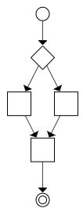

This graph corresponds to the following code. In this code, a variable is set to true or false. If the value is true, the program writes AC. If it is false, it writes BC.

	boolean a = ...;

	if(a){
	  print("A");
	}else{
	  print("B");
	}

	print("C");

## 2. Loop

The loop construct is a part of most programming languages. It is a typical imperative, structured construct.

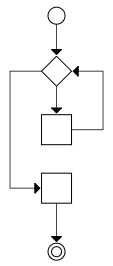

This graph corresponds to the following code. In this code, a variable is set to a positive number. If it is set to 5, it prints 01234A.

	int a = ...;

	for(i = 0; i < a; i++){
	  print(i);
	}

	print("A");

## 3. Function

The function construct is a part of most programming languages. It is a structured construct. A function here is taken to mean function, subroutine, procedure or method. One can consider these different things, but for this article, they are considered the same.

This graph corresponds to the following code. This code prints AFC.

	function f(){
	  print("F");
	}

	print("A");
	f();
	print("C");

## 4. Break

The break construct is a part of many programming languages. It is a typical imperative construct, but is not structured. It is more like a limited form of a goto-statement.

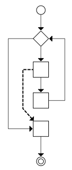

This graph corresponds to the following code. This code prints 012A. The break statement will cause the control flow to goto the end of the enclosing loop. In, for example, Java, a loop can be labeled. `break x` will then goto the end of the loop labeled ‘x’.

	int a = 10;

	for(i = 0; i < a; i++){
	  if(i == 3){
	    break;
	  }
	  print(i);
	}

	print("A");

## 5. Continue

The continue construct is a part of many programming languages. It is a typical imperative construct, but is not structured. It is more like a limited form of a goto-statement, and it is closely related to the break statement.

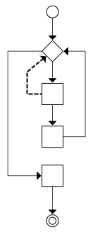

This graph corresponds to the following code. This code prints 02A. Notice that it does not print 1. The continue statement will cause the control flow to goto the start of the enclosing loop. In, for example, Java, a loop can be labeled. `continue x` will then goto the start of the loop labeled ‘x’.

	int a = 3;

	for(i = 0; i < a; i++){
	  if(i == 1){
	    continue;
	  }
	  print(i);
	}

	print("A");

## 6. Early Return

The early return construct is a part of many programming languages. It is a typical imperative construct, but is not structured. It is more like a limited form of a goto-statement, and it is closely related to the break statement. Indeed, if a loop is extracted to its own function, break can be replaced by an early return.

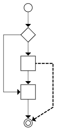

This graph corresponds to the following code. If the variable a is set to true, this code prints A; if the variable a is set to false, this code prints AC.

	function f(boolean a){
	  print("A");
	  if(a){
	    return;
	  }
	  print("C");
	}

* * *

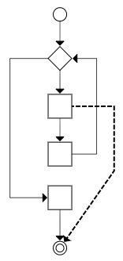

This graph corresponds to the following code. If a is set to 3, this code prints 012. If a is set to 5, this code prints 01234A.

	function f(int a){
	  int i;
	  for(i = 0; i < 4; i++){
	    if(i == a){
	      return;
	    }
	    print(i);
	  }
	  print("A");
	}

## 7. Switch (No Fall-Through)

The switch construct is a part of many programming languages. To avoid fall-through, a break statement is usually put at the end of each case. This makes the switch construct like a series of if-statements, just shortened. It is a structured construct.

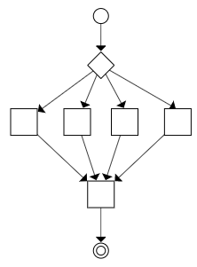

This graph corresponds to the following code. If the variable a is set to 1 it prints "one", if a is set to 2 it prints "two", etc.

	switch(a){
	  case 1:{
	    print("one");
	    break;
	  }
	  case 2:{
	    print("two");
	    break;
	  }
	  case 3:{
	    print("three");
	    break;
	  }
	  case 4:{
	    print("four");
	    break;
	  }
	}

## 8. Switch with Fall-Through

The switch construct with fall through is a part of many programming languages. This is not a structured construct. It is a restricted form of goto statement. It can be used to construct something called [Duff’s Device](https://en.wikipedia.org/wiki/Duff%27s_device), a typical unstructured construct.

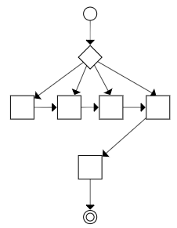

This graph corresponds to the following code. If the variable a is set to 1 it prints "onetwothreefour", if a is set to 3 it prints "threefour", etc.

	switch(a){
	  case 1:{
	    print("one");
	  }
	  case 2:{
	    print("two");
	  }
	  case 3:{
	    print("three");
	  }
	  case 4:{
	    print("four");
	  }
	}

## 9. Local Goto

The local goto construct is a part of some programming languages, but mostly not in newer languages. For example, it was not included in Python, released 1991, or Java, released 1995. The local goto can be used inside a function, but not between functions. It is definitely not a structured construct, but a typical imperative construct.

This graph corresponds to the following code. This code will write CBCBC… BC will be repeated until the program is stopped by an external cause. C will be the first letter, then BC is repeated.

	goto L;
	M:
	print("B");
	L:
	print("C");
	goto M;

## 10. Long Jump

Set jump (setjmp) and Long Jump (longjmp) are a part of C and C++. They are used to create a form of goto (or jump) that goes over function borders. First a function calls Set Jump. Later, in the same function, or inside a function called from the function, no matter how deeply nested it is, a call to Long Jump will make the control flow return to the point Set Jump was called. (After the function that called Set Jump returns, a Long Jump to that function is no longer possible.)

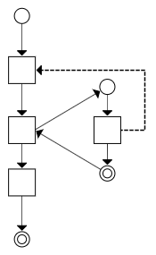

This graph corresponds to the following code. This code will print ABD. The first block calls setjmp. The second block contains the if, which either calls the function or goes on to the else. The first time it calls the function, the second time it goes to the else.

	#include <stdio.h>
	#include <setjmp.h>
	jmp_buf x;
	void f(){
	  printf("B");
	  longjmp(x, 1);
	  printf("C");
	}

	int main(){
	  int a = setjmp(x);
	  if(!a){
	    printf("A");
	    f();
	  }else{
	    printf("D");
	  }
	  return 0;
	}

## 11. Exception

Exceptions are a part of most modern languages, with notable exceptions being C, Google’s Go and Jonathan Blow’s jai.

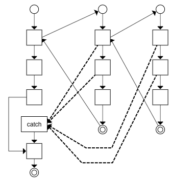

This graph corresponds to the following code. If none of the risky calls fail, the code will write "ABCXYD". If any of the risky calls fail, it will print "AED".

	function g(){
	  risky3();
	  risky4();
	  print("B");
	}

	function f(){
	  g();
	  risky1();
	  risky2();
	  print("C");
	}

	try{
	  print("A");
	  f();
	  print("X");
	  print("Y");
	}catch(Exception e){
	  print("E");
	}

	print("D");

## 12. Finally

Finally are a part of some modern languages, notably Java and C#.
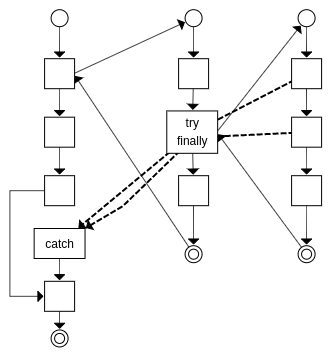

This graph corresponds to the following code. If none of the risky calls fail, the code will write "ABCDEFGH". If any of the risky calls fail, it will print "ABDIH"; notice that E was not printed in this case.

	function g(){
	  risky1();
	  risky2();
	  print("C");
	}

	function f(){
	  print("B");
	  try{
	    g();
	  }finally{
	    printf("D");
	  }
	  print("E");
	}

	try{
	  print("A");
	  f();
	  print("F");
	  print("G");
	}catch(Exception e){
	  print("I");
	}

	print("H");

## 13. Blocking, Synchronous Calls

Blocking calls are a part of most languages, old and new. One language notable for discouraging blocking calls is JavaScript and NodeJS. In the following diagram, a cloud means another program. During blocking, execution is carried out in a different program.

This graph corresponds to the following code. The call to f is a blocking call. f will call some library or operating system function that will suspend the current program and execution proceeds in another program. The current program will be woken up when the blocking operation is finished.

	print("A");
	f();
	print("B");

## 14a. Non-Blocking, Asynchronous Call, Callback

Non-blocking calls are a part of most languages. In the diagram below, again a cloud means another program. The main program, the program on the left, does a non-blocking call. This call tells an external program to call another function once it is done. That function is the callback. The main program finishes. Then, at some later time, the non-blocking call calls the callback function causing execution to continue after the cloud in the diagram.

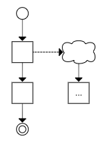

This graph corresponds to the following code. The call to f is non-blocking. The program will print ABC. After the non-blocking call to f, B is printed. Then, at some later time, when f is done, g is called printing C.

	function g(){
	  print("C");
	}
	print("A");
	f(g);
	print("B");

## 14b. Device Input

Device input is supported in many programming languages. A device can be a keyboard, mouse, microphone, timer, network card etc. Device input is a very typical use case for non-blocking calls. A program typically registers which functions are to be called in which case of inputs. If a computer has an OS, it is typically the initial targets of device input. The OS then redirects it to a user function, just as in the diagram below.

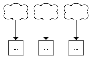

This graph corresponds to the following code. If a key on the keyboard is pressed, it prints A. If the mouse is moved, it prints B and if a timer expires, it prints C.

	function k(){
	  print("A");
	}
	function m(){
	  print("B");
	}
	function t(){
	  print("C");
	}

## 15. Framework

Frameworks are available for most programming languages. A framework is different than a library in that where libraries are called from the user program, frameworks call the user program.

While it is often easy to use two different libraries, it is difficult to use two different frameworks. The reason is that calling two different libraries is easy, but having two different frameworks call your code and cooperate is more difficult.

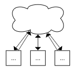

This graph corresponds to the following code. The framework calls a, b or c, when it needs to.

	function a(){
	  print("A");
	}
	function b(){
	  print("B");
	}
	function c(){
	  print("C");
	}

## 16. Yield, Lazy Evaluation

Yield are a part of some languages, notably C#, PHP, Kotlin and Python. A function that calls yield will return to the calling function, and when the function is called again, it will continue after the yield statement. This can be used to make lazy evaluation. For example, one can make a program that returns the next prime number, but it only calculates the next when it is actually requested.

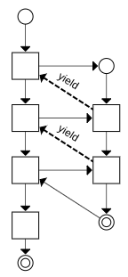

This graph corresponds to the following code. It will print ABC. A and B are yield-returned, while C is returned normally.

	function f(){
	  yield "A";
	  yield "B";
	  return "C";
	}
	print(f());
	print(f());
	print(f());

## 17. Coroutine

Coroutines are supported in some languages, including Kotlin, C++20, C#, Go, JavaScript, PHP, Python. A coroutine can be paused and resumed. A coroutine can pass control to another coroutine which passes control back and resumes the original function where it left off.

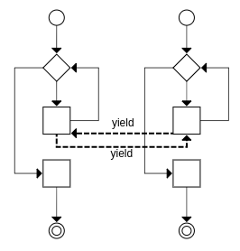

This graph corresponds to the following code. This code prints CPCPC… . The first function yields to the second which yields to the first etc.

	function p(){
	  while(true){
	    print("P");
	    yield to p;
	  }
	}

	function c(){
	  while(true){
	    print("C");
	    yield to c;
	  }
	}

	c();

## 18. Come-from

Come-from was originally a joke in the joke language INTERCAL, but variants of it are now used in some languages and frameworks notably C++, Go, HTML (the defer attribute), AspectJ and Spring. Come-from is sort of a reverse goto. You ask the control flow to come from other places in the code.

In the following graph, two functions ask to come-from the point between Block 1 and 2 in the first function. This is illustrated as a small square. It might not really be there, it can be just an implication of the two come-froms.

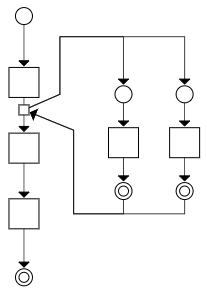

This graph corresponds to the following code. This code prints ABCD or ACBD, depending on which of the two comefroms to get their output done first.

	comefrom x{
	  print("B");
	}

	comefrom x{
	  print("C");
	}

	print("A");
	x:
	print("D");

## 19. Aspect

Aspects are a part of a few languages, notably AspectJ and Java annotations in the Spring framework. The way aspects are turned into code is by a so-called weaver that injects the calls where the aspects say.

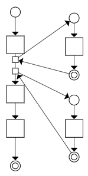

This graph corresponds to the following code. This code prints ABCD. The term "pointcut" means to insert a call to the function at certain points in the code. Both g and h are inserted at the start of all functions in the program, therefor "function start".

	pointcut function start
	function g{
	  print("A");
	}

	pointcut function start
	function h{
	  print("B");
	}

	f();
	function f(){
	  print("C");
	  print("D");
	}

## 20. Dependency Injection

Dependency injection is usually implemented as an extension to other languages. For example, spring adds dependency injection to Java through its annotations and XML-files. The graph has a dotted square, because its content is injected when running the program, so it is empty before injected.

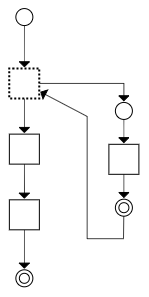

This graph corresponds to the following code. This code prints ABC. The function f is injected into the empty function x. When x is called, f is called, printing A.

	inject f into x;

	function f(){
	  print("A");
	}

	...

	function x;

	x();
	print("B");
	print("C");

## 21. Destructor

Destructors are a part of some languages, notably C++. The interesting thing about destructors for this article, is the feature that the destructor for an object on the stack is automatically called when leaving the scope.

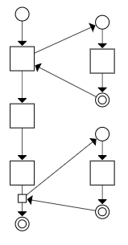

This graph corresponds to the following code. This code will print ABC. The constructor is called when creating the object x, and the destructor is called when leaving the function f. Destructors are called in the opposite order of the constructors. If three objects were created, the destructors would be called in the opposite order of their creation.

	class X{
	  constructor function g(){
	    print("A");
	  }

	  destructor function h(){
	    print("C");
	  }
	}

	f();
	function f(){
	  X x;
	  print("B");
	}

## 22. Defer

Defer are a part of some languages, notably Go, jai and HTML (in the script tag). Deferred statements will be called in opposite order when a scope ends.

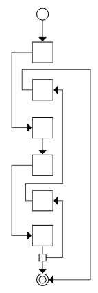
This graph corresponds to the following code. This code will print ABCDE.

	f();
	function f(){
	  print("A");
	  defer print("E");
	  print("B");
	  defer print("D");
	  print("C");
	}

## Grouping the Constructs

The programming language constructs can be classified into five categories. These groups have an increasing complexity.

The simplest are the structured constructs, where all the code on the same continued indentation level is always executed together and in order.

Then comes the constructs that are similar to local gotos in that statements on the same indentation level are no longer necessarily executed together or in order.

Then comes the constructs that are similar to program-wide gotos in that control flow can jump to the middle of other functions in the program.

Then comes the constructs that are similar to system-wide gotos in that control flow can be transferred to and from the middle of functions in the program to components that are not even a part of the program. Control flow can also be passed to and from a system component to the program at many different places.

Finally comes the constructs that are similar to the come-from construct in that control flow is not passed from a function, but another function asks to come-from a part of a function.

- **Structured**: if, if-else, loop, function, switch without fall through
- **Local Goto**: goto, continue, break, early return, switch with fall through
- **Program-wide Goto**: setjmp/longjmp, exception, finally, yield, coroutine
- **System-wide Goto**: blocking, non-blocking async callback, device input, framework
- **Come From**: come from, aspects, dependency injection, destructor, defer

## Goto Structures

Control-flow structures impacts the understandability of a program to a huge extent. As most control-flow structures can be created, and, indeed, is created using goto, we can talk about the goto structure of the entire program.

A program has two kinds of goto structures: internal and external.

### Internal Goto Structure

The internal goto structure of a program is all gotos originating and ending inside the program. An internal goto structure that is difficult to understand is often derided as "spaghetti code".

### External Goto Structure

The external goto structure of a program is all inbound and outbound gotos from the program. The simplest kind of program has one entry and one exit. All executions of a program goes through a single entry, and leaves through a single exit.

Most programs written using current best practices have hundreds if not thousands of inbound and outbound gotos, and most developers do not even known about half of them. This makes the program difficult to understand. This is also a huge source of security problems: Certain entries and exits — which the product owners are not even aware exists — are exploited by hackers.

If a whole program is drawn with the diagrams above, then the inbound gotos are all those arrows going from clouds, and the outgoing gotos are those going to clouds.

## Further Reading and Watching

- [Structured Programming](https://en.wikipedia.org/wiki/Structured_programming)
- [Thomas J. McCabe, "A complexity measure", 1976](http://juacompe.mrchoke.com/natty/thesis/FrameworkComparison/A%20complexity%20measure.pdf)
- [Spring AOP Tutorial](https://www.youtube.com/watch?v=Ft29HgsePfQ&t=852s)
- [jai Resources and Information](https://inductive.no/jai/)
- [Spaghetti code](https://en.wikipedia.org/wiki/Spaghetti_code)
- [HTML’s "come from"](https://www.w3schools.com/tags/att_script_defer.asp)
- [Duff’s Device](https://en.wikipedia.org/wiki/Duff%27s_device)